# Trip Planner - Architecture

> Comprehensive architecture reference for the **Trip Planner** web application.
>
> **Last Updated:** 2026-03-15

---

## Table of Contents

1. [Overview](#1-overview)
2. [Directory Structure](#2-directory-structure)
3. [Tech Stack & Dependencies](#3-tech-stack--dependencies)
4. [Frontend Architecture](#4-frontend-architecture)
5. [Backend Architecture](#5-backend-architecture)
6. [Database Schema](#6-database-schema)
7. [Data Flow Diagrams](#7-data-flow-diagrams)
8. [Security](#8-security)
9. [Configuration & Environment](#9-configuration--environment)
10. [Deployment](#10-deployment)

---

## 1. Overview

Trip Planner is a full-stack Next.js 15 application for collaboratively planning multi-city trips. It aggregates events from iCal feeds and RSS sources, curates neighborhood spots, overlays live crime heatmaps on Google Maps, and provides a minute-level day planner with pair-planning (shared rooms). The app supports multiple cities worldwide with per-city crime data adapters, timezone-aware scheduling, and a trip dashboard for managing multiple trips with multi-leg itineraries.

### Core Features

- **Multi-city trip management** with dashboard, trip CRUD, and multi-leg itineraries
- **City auto-provisioning** via Google Places API with worldwide search
- Event aggregation from Luma calendars, RSS feeds, and Firecrawl-scraped web pages
- Curated spot lists (restaurants, bars, cafes, shops) with tag-based filtering
- Interactive Google Map with event/spot markers, route polylines, and crime heatmaps
- Crime heatmaps for SF, NYC, LA, and Chicago via Socrata open data APIs
- Minute-granularity day planner with drag-to-reschedule
- Pair planning via shareable room codes (2-member max)
- Magic-link authentication (Resend) with owner/member RBAC
- ICS export and Google Calendar integration
- GDPR cookie consent banner

### High-Level System Diagram

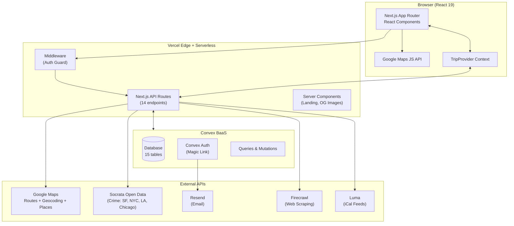
```mermaid
graph TB
    subgraph Client["Browser (React 19)"]
        UI["Next.js App Router<br/>React Components"]
        Maps["Google Maps JS API"]
        TripCtx["TripProvider Context"]
    end

    subgraph Vercel["Vercel Edge + Serverless"]
        MW["Middleware<br/>(Auth Guard)"]
        API["Next.js API Routes<br/>(14 endpoints)"]
        SSR["Server Components<br/>(Landing, OG Images)"]
    end

    subgraph Convex["Convex BaaS"]
        DB[(Database<br/>15 tables)]
        Auth["Convex Auth<br/>(Magic Link)"]
        Fns["Queries & Mutations"]
    end

    subgraph External["External APIs"]
        GMaps["Google Maps<br/>Routes + Geocoding + Places"]
        CityData["Socrata Open Data<br/>(Crime: SF, NYC, LA, Chicago)"]
        Resend["Resend<br/>(Email)"]
        Firecrawl["Firecrawl<br/>(Web Scraping)"]
        Luma["Luma<br/>(iCal Feeds)"]
    end

    UI --> MW --> API
    UI <--> TripCtx
    TripCtx <--> API
    UI --> Maps
    API <--> Convex
    API --> GMaps
    API --> CityData
    Auth --> Resend
    API --> Firecrawl
    API --> Luma
```

---

## 2. Directory Structure

```
.
├── app/                          # Next.js App Router
│   ├── dashboard/                # Trip dashboard (authenticated)
│   │   └── page.tsx              # Trip grid, create trip via CityPickerModal
│   ├── trips/                    # Per-trip planning views
│   │   ├── layout.tsx            # TripProvider + AppShell wrapper
│   │   └── [tripId]/             # Dynamic route: /trips/{urlId}/{tab}
│   │       └── [tab]/page.tsx    # Tab pages: map, calendar, planning, spots, config
│   ├── api/                      # REST API endpoints
│   │   ├── cities/               # City management
│   │   │   ├── route.ts          # GET list / POST create city
│   │   │   └── timezone/route.ts # GET timezone lookup (Google TimeZone API)
│   │   ├── trips/                # Trip management
│   │   │   ├── route.ts          # GET list / POST create trip (auto-provisions cities)
│   │   │   └── [tripId]/route.ts # GET/PATCH/DELETE single trip
│   │   ├── config/route.ts       # GET/POST trip configuration
│   │   ├── crime/route.ts        # GET live crime incidents (multi-city via Socrata)
│   │   ├── events/route.ts       # GET aggregated events + places
│   │   ├── geocode/route.ts      # POST address geocoding
│   │   ├── me/route.ts           # GET current user profile
│   │   ├── pair/route.ts         # GET/POST pair room management
│   │   ├── planner/route.ts      # GET/POST day planner state
│   │   ├── route/route.ts        # POST route computation
│   │   ├── sources/route.ts      # GET/POST source management
│   │   ├── sources/[sourceId]/route.ts  # PATCH/POST/DELETE individual source
│   │   └── sync/route.ts         # POST trigger full sync
│   ├── landing/                  # Landing page components
│   │   ├── LandingContent.tsx    # Feature showcase
│   │   └── LandingMotion.tsx     # Framer Motion animations
│   ├── signin/                   # Authentication pages
│   │   ├── layout.tsx            # Sign-in layout wrapper
│   │   └── page.tsx              # Magic link sign-in form
│   ├── globals.css               # Design tokens, theme, custom classes
│   ├── layout.tsx                # Root layout: fonts, providers, CookieConsent, metadata
│   ├── page.tsx                  # Landing page (/)
│   ├── opengraph-image.tsx       # Dynamic OG image generation
│   ├── twitter-image.tsx         # Dynamic Twitter card image
│   ├── robots.ts                 # robots.txt
│   └── sitemap.ts                # sitemap.xml
├── components/                   # React components
│   ├── providers/
│   │   ├── ConvexClientProvider.tsx  # Convex React client initialization
│   │   └── TripProvider.tsx         # Central state management (1500+ lines)
│   ├── ui/                       # Radix-based UI primitives
│   │   ├── avatar.tsx            # User avatar circle with initial
│   │   ├── badge.tsx             # Colored label
│   │   ├── button.tsx            # CVA button variants
│   │   ├── card.tsx              # Container card
│   │   ├── input.tsx             # Text input
│   │   ├── modal.tsx             # Portal-based modal with overlay + Escape-to-close
│   │   ├── select.tsx            # Radix Select dropdown
│   │   ├── tabs.tsx              # Radix Tabs
│   │   └── toggle-group.tsx      # Radix ToggleGroup
│   ├── AppShell.tsx              # Header + top nav + map/sidebar layout + StatusBar
│   ├── CityPickerModal.tsx       # Google Places-powered city search for trip creation
│   ├── CookieConsent.tsx         # GDPR cookie consent banner (root layout)
│   ├── DayList.tsx               # Vertical date selector with metrics
│   ├── EmptyState.tsx            # Reusable empty state with icon, title, CTA
│   ├── ErrorState.tsx            # Error state variants (connection, sync, session)
│   ├── EventsItinerary.tsx       # Event cards for selected date
│   ├── MapPanel.tsx              # Google Map + filter chips + crime overlay
│   ├── PlannerItinerary.tsx      # 24h time grid + drag-to-schedule
│   ├── SkeletonCard.tsx          # Loading skeleton variants (event, spot, planner)
│   ├── SpotsItinerary.tsx        # Curated spot cards by tag
│   ├── StatusBar.tsx             # Full-width bottom bar: sync age, route summary
│   └── TripSelector.tsx          # Header dropdown for trip/city-leg switching
├── convex/                       # Convex backend
│   ├── _generated/               # Auto-generated types and API bindings
│   ├── schema.ts                 # Database schema (15 tables incl. cities, trips)
│   ├── appUsers.ts               # User profile queries/mutations
│   ├── auth.ts                   # Auth provider setup (Resend magic links)
│   ├── auth.config.ts            # Auth configuration
│   ├── authz.ts                  # Authentication/authorization guards
│   ├── cities.ts                 # City CRUD queries/mutations
│   ├── events.ts                 # Event queries/mutations (city-scoped)
│   ├── http.ts                   # HTTP router for auth callbacks
│   ├── ownerRole.ts              # Owner email allowlist logic
│   ├── planner.ts                # Planner + pair room queries/mutations (trip-scoped)
│   ├── routeCache.ts             # Route cache queries/mutations
│   ├── seed.ts                   # City seed data (SF, NYC, LA, Chicago, London, Tokyo)
│   ├── sources.ts                # Source CRUD queries/mutations (city-scoped)
│   ├── spots.ts                  # Spot queries/mutations (city-scoped)
│   ├── tripConfig.ts             # Trip config queries/mutations (trip-scoped)
│   └── trips.ts                  # Trip CRUD with multi-leg support
├── lib/                          # Shared utilities
│   ├── api-guards.ts             # runWithAuthenticatedClient / runWithOwnerClient
│   ├── city-registry.ts          # Static city catalog (8 cities with map bounds, timezone)
│   ├── convex-client-context.ts  # Scoped Convex client for API routes
│   ├── crime-cities.ts           # Crime API city config registry (SF, NYC, LA, Chicago)
│   ├── events.ts                 # Event sync engine (iCal, RSS, Firecrawl, geocoding)
│   ├── events-api.ts             # GET /api/events handler factory
│   ├── helpers.ts                # Date formatting, tag normalization, distance
│   ├── map-helpers.ts            # Map marker icons, travel time cache, route requests
│   ├── mock-data.ts              # Mock trip data + formatTripDateRange helper
│   ├── pair-api.ts               # Pair action body parsing
│   ├── planner-api.ts            # Planner payload parsing
│   ├── planner-helpers.ts        # Plan item CRUD, ICS export, Google Calendar URLs
│   ├── request-auth.ts           # Request-level auth (Convex token → client)
│   ├── security.ts               # Rate limiting, SSRF validation, IP extraction
│   ├── security-server.ts        # DNS-based SSRF check (server-only)
│   ├── types.ts                  # Shared type aliases (PlaceTag, TravelMode, PlanItem, etc.)
│   └── utils.ts                  # cn() (clsx + tailwind-merge)
├── types/                        # TypeScript declarations
│   ├── google-maps.d.ts          # Google Maps API types
│   └── lucide-internal.d.ts      # Lucide icon node types
├── middleware.ts                 # Auth route protection + legacy route redirects
├── next.config.mjs               # Security headers, CSP
├── postcss.config.mjs            # Tailwind v4 PostCSS plugin
├── package.json                  # Dependencies, scripts
├── tsconfig.json                 # TypeScript config
└── .env.example                  # Environment variable documentation
```

---

## 3. Tech Stack & Dependencies

### Runtime & Framework

| Tool | Version | Purpose |
|------|---------|---------|
| Next.js | ^15.1.0 | App Router, API routes, SSR |
| React | ^19.0.0 | UI rendering |
| Node.js | 24.x | Server runtime |
| Bun | 1.2.22 | Package manager |
| TypeScript | ^5.9.3 | Type safety |

### Backend & Data

| Library | Version | Purpose |
|---------|---------|---------|
| Convex | ^1.31.7 | BaaS: database, real-time queries, mutations |
| @convex-dev/auth | ^0.0.90 | Magic link authentication |
| @auth/core | 0.37.0 | Auth foundation |
| node-ical | ^0.25.1 | iCal feed parsing |

### Frontend & Styling

| Library | Version | Purpose |
|---------|---------|---------|
| Tailwind CSS | ^4.1.18 | Utility-first CSS (v4 — no config file) |
| @tailwindcss/postcss | ^4.1.18 | PostCSS integration |
| Radix UI (select, slot, tabs, toggle-group) | ^2.x / ^1.x | Accessible headless UI primitives |
| class-variance-authority (CVA) | ^0.7.1 | Component variant styling |
| clsx | ^2.1.1 | Conditional class merging |
| tailwind-merge | ^3.4.0 | Tailwind class deduplication |
| Framer Motion | ^12.34.2 | Landing page animations |
| lucide-react | ^0.563.0 | Icon library |

### Monitoring & Dev

| Library | Version | Purpose |
|---------|---------|---------|
| @vercel/analytics | ^1.6.1 | Page view analytics |
| ESLint | ^9.39.2 | Linting |
| Prettier | ^3.8.1 | Code formatting |
| Playwright | ^1.58.2 | E2E testing |

---

## 4. Frontend Architecture

### 4.1 App Router Structure

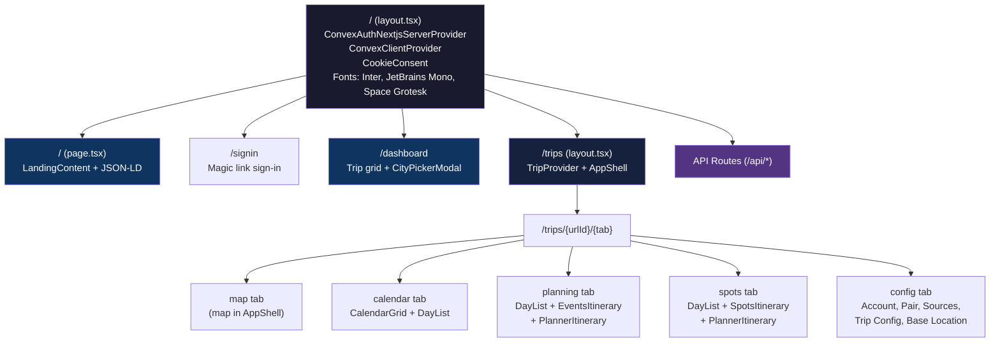
```mermaid
graph TD
    Root["/ (layout.tsx)<br/>ConvexAuthNextjsServerProvider<br/>ConvexClientProvider<br/>CookieConsent<br/>Fonts: Inter, JetBrains Mono, Space Grotesk"]

    Root --> Landing["/ (page.tsx)<br/>LandingContent + JSON-LD"]
    Root --> SignIn["/signin<br/>Magic link sign-in"]
    Root --> Dashboard["/dashboard<br/>Trip grid + CityPickerModal"]
    Root --> TripsGroup["/trips (layout.tsx)<br/>TripProvider + AppShell"]
    Root --> API["API Routes (/api/*)"]

    TripsGroup --> TripView["/trips/{urlId}/{tab}"]
    TripView --> Map["map tab<br/>(map in AppShell)"]
    TripView --> Calendar["calendar tab<br/>CalendarGrid + DayList"]
    TripView --> Planning["planning tab<br/>DayList + EventsItinerary<br/>+ PlannerItinerary"]
    TripView --> Spots["spots tab<br/>DayList + SpotsItinerary<br/>+ PlannerItinerary"]
    TripView --> Config["config tab<br/>Account, Pair, Sources,<br/>Trip Config, Base Location"]

    style Root fill:#1a1a2e,color:#fff
    style TripsGroup fill:#16213e,color:#fff
    style Dashboard fill:#0f3460,color:#fff
    style Landing fill:#0f3460,color:#fff
    style API fill:#533483,color:#fff
```

### 4.2 Component Hierarchy

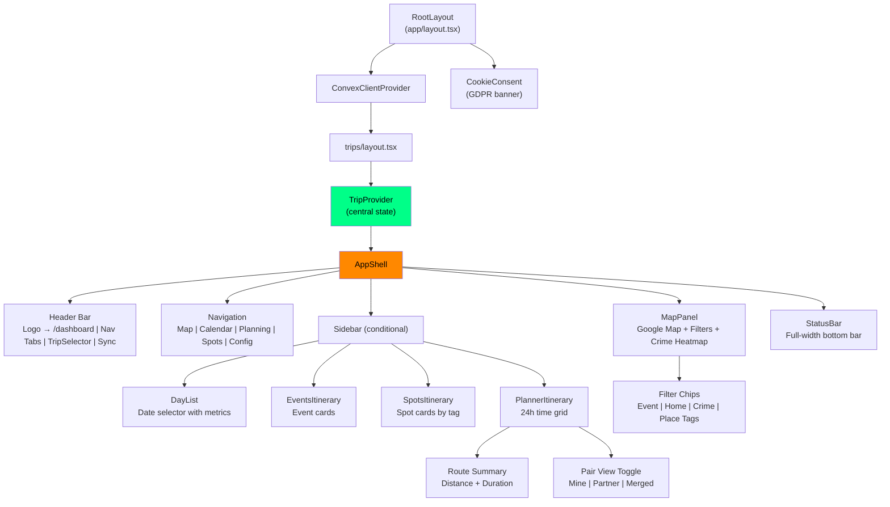
```mermaid
graph TD
    RootLayout["RootLayout<br/>(app/layout.tsx)"]
    RootLayout --> ConvexProvider["ConvexClientProvider"]
    RootLayout --> CookieConsent["CookieConsent<br/>(GDPR banner)"]
    ConvexProvider --> TripsLayout["trips/layout.tsx"]

    TripsLayout --> TripProvider["TripProvider<br/>(central state)"]
    TripProvider --> AppShell["AppShell"]

    AppShell --> Header["Header Bar<br/>Logo → /dashboard | Nav Tabs | TripSelector | Sync"]
    AppShell --> NavBar["Navigation<br/>Map | Calendar | Planning | Spots | Config"]
    AppShell --> MapPanel["MapPanel<br/>Google Map + Filters + Crime Heatmap"]
    AppShell --> Sidebar["Sidebar (conditional)"]
    AppShell --> StatusBar["StatusBar<br/>Full-width bottom bar"]

    Sidebar --> DayList["DayList<br/>Date selector with metrics"]
    Sidebar --> EventsIt["EventsItinerary<br/>Event cards"]
    Sidebar --> SpotsIt["SpotsItinerary<br/>Spot cards by tag"]
    Sidebar --> PlannerIt["PlannerItinerary<br/>24h time grid"]

    PlannerIt --> RouteSum["Route Summary<br/>Distance + Duration"]
    PlannerIt --> PairView["Pair View Toggle<br/>Mine | Partner | Merged"]

    MapPanel --> FilterChips["Filter Chips<br/>Event | Home | Crime | Place Tags"]

    style TripProvider fill:#00ff88,color:#000
    style AppShell fill:#ff8800,color:#000
```

### 4.3 State Management — TripProvider

The entire application state lives in a single React Context (`TripProvider`), consumed via the `useTrip()` hook. There is no external state library — all state, derived values, and handlers are co-located.

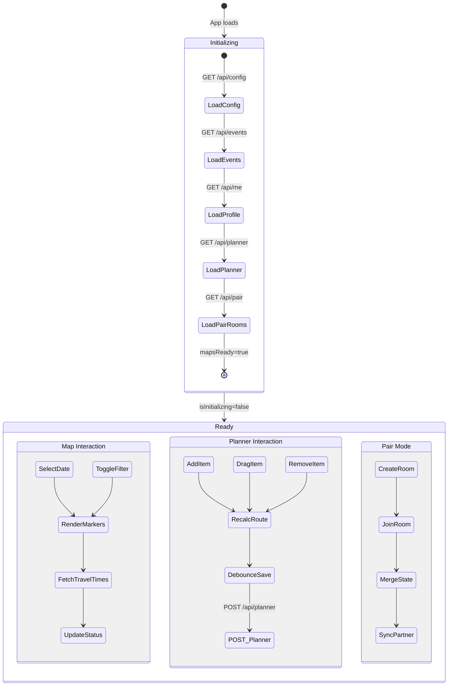
```mermaid
stateDiagram-v2
    [*] --> Initializing: App loads

    state Initializing {
        [*] --> LoadConfig: GET /api/config
        LoadConfig --> LoadEvents: GET /api/events
        LoadEvents --> LoadProfile: GET /api/me
        LoadProfile --> LoadPlanner: GET /api/planner
        LoadPlanner --> LoadPairRooms: GET /api/pair
        LoadPairRooms --> [*]: mapsReady=true
    }

    Initializing --> Ready: isInitializing=false

    state Ready {
        state "Map Interaction" as MapInt {
            SelectDate --> RenderMarkers
            ToggleFilter --> RenderMarkers
            RenderMarkers --> FetchTravelTimes
            FetchTravelTimes --> UpdateStatus
        }

        state "Planner Interaction" as PlanInt {
            AddItem --> RecalcRoute
            DragItem --> RecalcRoute
            RemoveItem --> RecalcRoute
            RecalcRoute --> DebounceSave
            DebounceSave --> POST_Planner: POST /api/planner
        }

        state "Pair Mode" as PairMode {
            CreateRoom --> JoinRoom
            JoinRoom --> MergeState
            MergeState --> SyncPartner
        }
    }
```

#### State Variables (grouped)

| Group | Variables | Type |
|-------|-----------|------|
| **Auth** | `authLoading`, `isAuthenticated`, `authUserId`, `profile`, `canManageGlobal` | boolean, string, object |
| **Map** | `mapsReady`, `isInitializing`, `status`, `statusError`, `mapRef`, `mapElementRef` | boolean, string, Ref |
| **Events/Places** | `allEvents`, `allPlaces`, `visibleEvents`, `visiblePlaces` | array |
| **Selection** | `selectedDate`, `showAllEvents`, `placeTagFilter`, `hiddenCategories`, `travelMode` | string, boolean, Set |
| **Crime** | `crimeLayerMeta` (`loading`, `count`, `generatedAt`, `error`), `crimeHeatmapStrength` | object, string |
| **Calendar** | `calendarMonthISO` | string (YYYY-MM-01) |
| **Planner** | `plannerByDateMine`, `plannerByDate`, `activePlanId`, `routeSummary`, `isRouteUpdating` | Record, string, boolean |
| **Pair** | `plannerByDatePartner`, `currentPairRoomId`, `pairRooms`, `pairMemberCount`, `plannerViewMode` | Record, string, array |
| **Sources** | `sources`, `newSourceType`, `newSourceUrl`, `newSourceLabel`, `isSavingSource`, `syncingSourceId` | array, string, boolean |
| **Trip Config** | `tripStart`, `tripEnd`, `baseLocationText` | string (YYYY-MM-DD) |
| **Sync** | `isSyncing`, `isSigningOut` | boolean |

#### Key Derived Values (useMemo)

| Value | Description |
|-------|-------------|
| `uniqueDates` | Sorted unique ISO dates from events + plan items |
| `eventsByDate` | Map of dateISO → event count |
| `planItemsByDate` | Map of dateISO → plan item count |
| `eventLookup` | Map of eventUrl → event object |
| `placeLookup` | Map of sourceKey → place object |
| `filteredPlaces` | Places filtered by active tag filter |
| `dayPlanItems` | Plan items for the currently selected date |
| `plannedRouteStops` | Stops with lat/lng for route computation |
| `travelReadyCount` | Events with resolved coordinates |
| `plannerByDateForView` | Merged/mine/partner view based on pair mode |

#### Handler Methods

| Category | Methods |
|----------|---------|
| **Auth** | `handleSignOut()` |
| **Sync** | `handleSync()`, `handleDeviceLocation()` |
| **Pair** | `handleCreatePairRoom()`, `handleJoinPairRoom(code)`, `handleSelectPairRoom(code)`, `handleUsePersonalPlanner()` |
| **Sources** | `handleCreateSource()`, `handleToggleSourceStatus()`, `handleDeleteSource()`, `handleSyncSource()` |
| **Trip** | `handleSaveTripDates(start, end)`, `handleSaveBaseLocation(text)` |
| **Planner** | `addEventToDayPlan()`, `addPlaceToDayPlan()`, `removePlanItem()`, `clearDayPlan()`, `startPlanDrag()` |
| **Export** | `handleExportPlannerIcs()`, `handleAddDayPlanToGoogleCalendar()` |
| **Map** | `renderCurrentSelection()`, `setStatusMessage()`, `toggleCategory()`, `shiftCalendarMonth()` |

### 4.4 Styling — Design System

Tailwind v4 with no config file (inline via PostCSS plugin). All design tokens defined in `app/globals.css`.

#### Color Palette

| Token | Value | Usage |
|-------|-------|-------|
| `--color-bg` | `#0C0C0C` | Page background |
| `--color-bg-subtle` | `#1A1A1A` | Subtle backgrounds |
| `--color-bg-elevated` | `#141414` | Elevated surfaces |
| `--color-bg-sidebar` | `#080808` | Sidebar background |
| `--color-card` | `#0A0A0A` | Card background |
| `--color-card-glass` | `rgba(10,10,10,0.92)` | Glassmorphic cards |
| `--color-foreground` | `#FFFFFF` | Primary text |
| `--color-foreground-secondary` | `#8a8a8a` | Secondary text |
| `--color-muted` | `#6a6a6a` | Muted text |
| `--color-accent` | `#00FF88` | Primary accent (green) |
| `--color-accent-hover` | `#00cc6e` | Accent hover state |
| `--color-border` | `#2f2f2f` | Default borders |
| `--color-warning` | `#FF8800` | Warning / events (orange) |
| `--color-danger` | `#FF4444` | Danger / crime (red) |

#### Typography

| Font | Variable | Usage |
|------|----------|-------|
| Inter | `--font-inter` | UI labels |
| JetBrains Mono | `--font-jetbrains` | Body text (monospace default) |
| Space Grotesk | `--font-space-grotesk` | Headings |

#### Planner-Specific CSS

| Class | Purpose |
|-------|---------|
| `.planner-time-grid` | 24-hour grid (24 x 50px rows) |
| `.planner-item` | Draggable plan block |
| `.planner-item-event` | Orange background (#FF8800) |
| `.planner-item-place` | Green background (#00FF88) |
| `.planner-item-owner-mine` | Green overlay in pair mode |
| `.planner-item-owner-partner` | Blue overlay in pair mode |

#### Responsive Breakpoints

| Breakpoint | Behavior |
|------------|----------|
| `> 1200px` | Side-by-side map + sidebar (`grid-cols-[minmax(0,3fr)_5fr]`) |
| `<= 1200px` | Stacked layout (map above sidebar) |
| `<= 640px` | Compact topbar, hidden action labels, compressed sidebar |

### 4.5 Key Screens

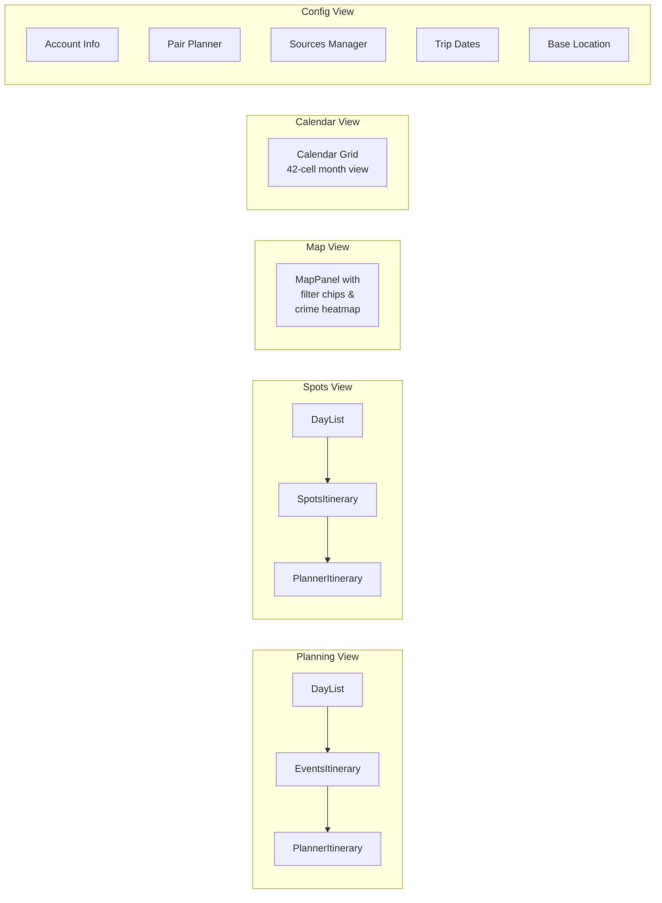
```mermaid
graph LR
    subgraph Planning["Planning View"]
        PD[DayList] --> PE[EventsItinerary] --> PP[PlannerItinerary]
    end

    subgraph Spots["Spots View"]
        SD[DayList] --> SS[SpotsItinerary] --> SP[PlannerItinerary]
    end

    subgraph Map["Map View"]
        M[MapPanel with<br/>filter chips &<br/>crime heatmap]
    end

    subgraph Calendar["Calendar View"]
        CG[Calendar Grid<br/>42-cell month view]
    end

    subgraph Config["Config View"]
        CA[Account Info]
        CP[Pair Planner]
        CS[Sources Manager]
        CT[Trip Dates]
        CB[Base Location]
    end
```

---

## 5. Backend Architecture

### 5.1 Convex BaaS

Convex serves as the primary database and real-time backend. The React client connects directly via `ConvexReactClient` for real-time subscriptions, while API routes use `ConvexHttpClient` for server-side operations.

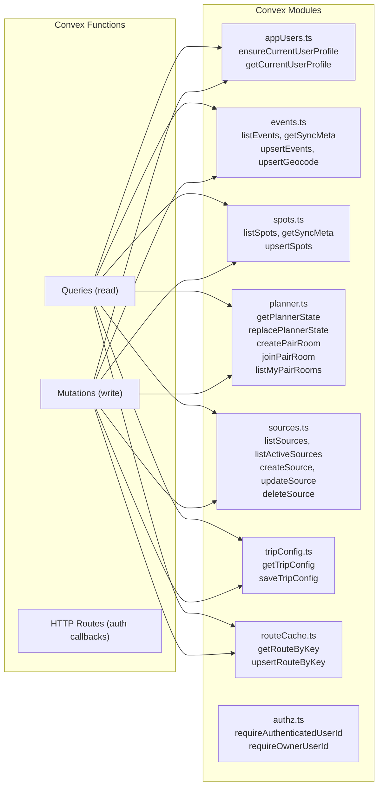
```mermaid
graph LR
    subgraph "Convex Functions"
        direction TB
        Q["Queries (read)"]
        M["Mutations (write)"]
        H["HTTP Routes (auth callbacks)"]
    end

    subgraph "Convex Modules"
        appUsers["appUsers.ts<br/>ensureCurrentUserProfile<br/>getCurrentUserProfile"]
        events["events.ts<br/>listEvents, getSyncMeta<br/>upsertEvents, upsertGeocode"]
        spots["spots.ts<br/>listSpots, getSyncMeta<br/>upsertSpots"]
        planner["planner.ts<br/>getPlannerState<br/>replacePlannerState<br/>createPairRoom<br/>joinPairRoom<br/>listMyPairRooms"]
        sources["sources.ts<br/>listSources, listActiveSources<br/>createSource, updateSource<br/>deleteSource"]
        tripConfig["tripConfig.ts<br/>getTripConfig<br/>saveTripConfig"]
        routeCache["routeCache.ts<br/>getRouteByKey<br/>upsertRouteByKey"]
        authz["authz.ts<br/>requireAuthenticatedUserId<br/>requireOwnerUserId"]
    end

    Q --> appUsers & events & spots & planner & sources & tripConfig & routeCache
    M --> appUsers & events & spots & planner & sources & tripConfig & routeCache
```

### 5.2 Next.js API Routes

All 14 endpoints with their contracts:

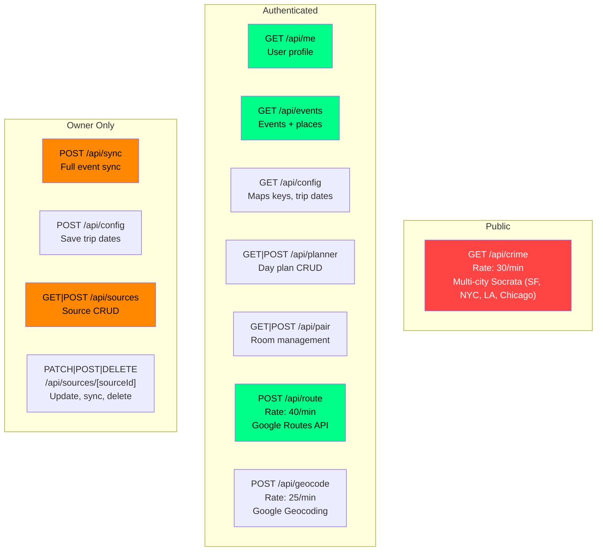
```mermaid
graph TD
    subgraph "Public"
        Crime["GET /api/crime<br/>Rate: 30/min<br/>Multi-city Socrata (SF, NYC, LA, Chicago)"]
    end

    subgraph "Authenticated"
        Me["GET /api/me<br/>User profile"]
        Events["GET /api/events<br/>Events + places"]
        Config_GET["GET /api/config<br/>Maps keys, trip dates"]
        Planner["GET|POST /api/planner<br/>Day plan CRUD"]
        Pair["GET|POST /api/pair<br/>Room management"]
        Route["POST /api/route<br/>Rate: 40/min<br/>Google Routes API"]
        Geocode["POST /api/geocode<br/>Rate: 25/min<br/>Google Geocoding"]
    end

    subgraph "Owner Only"
        Sync["POST /api/sync<br/>Full event sync"]
        Config_POST["POST /api/config<br/>Save trip dates"]
        Sources["GET|POST /api/sources<br/>Source CRUD"]
        SourceId["PATCH|POST|DELETE<br/>/api/sources/[sourceId]<br/>Update, sync, delete"]
    end

    style Crime fill:#ff4444,color:#fff
    style Me fill:#00ff88,color:#000
    style Events fill:#00ff88,color:#000
    style Route fill:#00ff88,color:#000
    style Sync fill:#ff8800,color:#000
    style Sources fill:#ff8800,color:#000
```

#### Endpoint Detail Table

| Endpoint | Methods | Auth | Rate Limit | External API | Key Response Fields |
|----------|---------|------|------------|-------------|-------------------|
| `/api/me` | GET | Auth | - | - | `{ authenticated, profile }` |
| `/api/config` | GET | Auth | - | - | `{ mapsBrowserKey, mapsMapId, tripStart, tripEnd, baseLocation }` |
| `/api/config` | POST | Owner | - | - | `{ ok, tripStart, tripEnd }` |
| `/api/events` | GET | Auth | - | - | `{ meta, events[], places[] }` |
| `/api/planner` | GET | Auth | - | - | `{ userId, roomCode, plannerByDateMine, plannerByDatePartner }` |
| `/api/planner` | POST | Auth | - | - | `{ userId, roomCode, dateCount, itemCount }` |
| `/api/pair` | GET | Auth | - | - | `{ rooms[] }` |
| `/api/pair` | POST | Auth | - | - | `{ roomCode, memberCount }` |
| `/api/route` | POST | Auth | 40/min | Google Routes API | `{ encodedPolyline, totalDistanceMeters, totalDurationSeconds, source }` |
| `/api/geocode` | POST | Auth | 25/min | Google Geocoding | `{ lat, lng }` |
| `/api/crime` | GET | None | 30/min | Multi-city Socrata | `{ incidents[], hours, count, source, bounds, generatedAt }` — accepts `?city=` param (default: `san-francisco`). Supported: `san-francisco`, `new-york`, `los-angeles`, `chicago` |
| `/api/sync` | POST | Owner | - | Luma/Firecrawl/Corner | `{ eventCount, spotCount, syncedAt }` |
| `/api/sources` | GET | Owner | - | - | `{ sources[] }` |
| `/api/sources` | POST | Owner | - | - | `{ source }` |
| `/api/sources/[id]` | PATCH | Owner | - | - | `{ source }` |
| `/api/sources/[id]` | POST | Owner | - | Firecrawl/iCal | `{ eventCount/spotCount }` (sync trigger) |
| `/api/sources/[id]` | DELETE | Owner | - | - | `{ deleted }` |

### 5.3 Authentication & Authorization

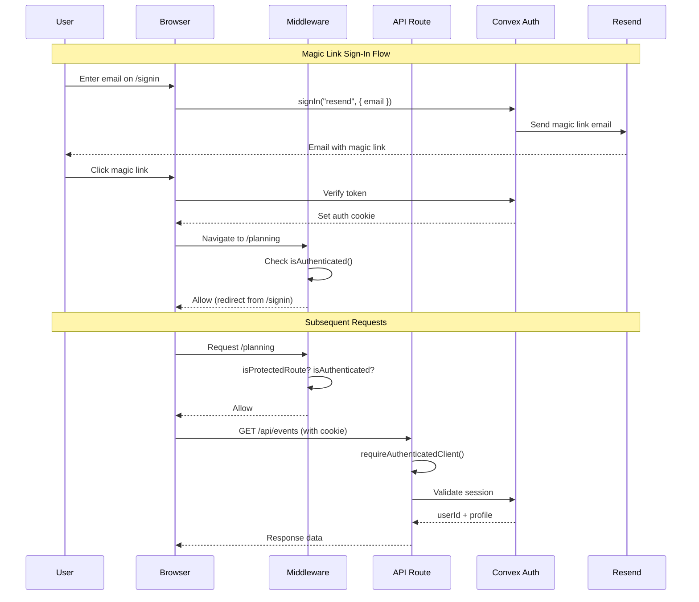
```mermaid
sequenceDiagram
    participant U as User
    participant B as Browser
    participant MW as Middleware
    participant API as API Route
    participant C as Convex Auth
    participant R as Resend

    Note over U,R: Magic Link Sign-In Flow
    U->>B: Enter email on /signin
    B->>C: signIn("resend", { email })
    C->>R: Send magic link email
    R-->>U: Email with magic link
    U->>B: Click magic link
    B->>C: Verify token
    C-->>B: Set auth cookie
    B->>MW: Navigate to /planning
    MW->>MW: Check isAuthenticated()
    MW-->>B: Allow (redirect from /signin)

    Note over U,R: Subsequent Requests
    B->>MW: Request /planning
    MW->>MW: isProtectedRoute? isAuthenticated?
    MW-->>B: Allow
    B->>API: GET /api/events (with cookie)
    API->>API: requireAuthenticatedClient()
    API->>C: Validate session
    C-->>API: userId + profile
    API-->>B: Response data
```

#### Role Resolution

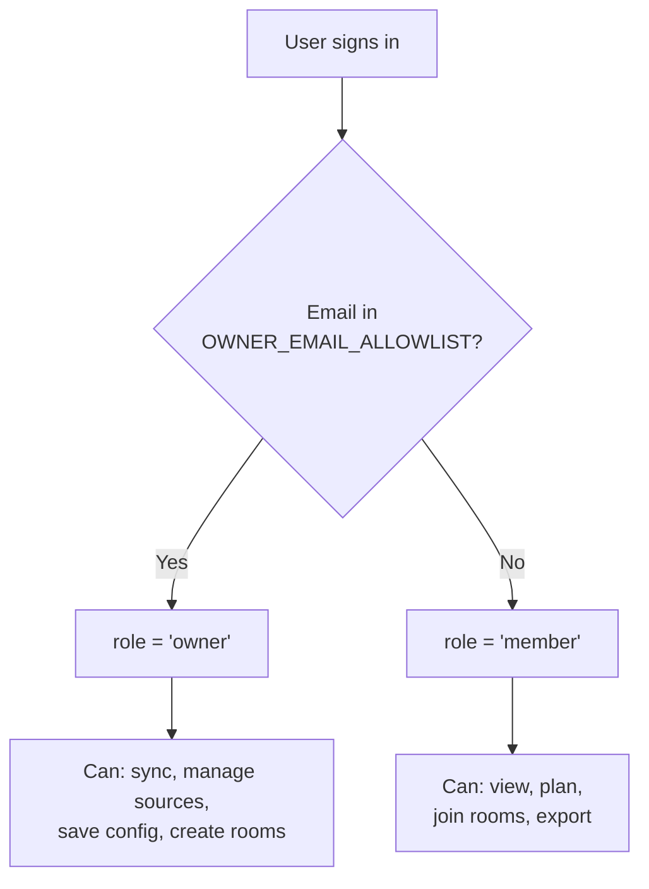
```mermaid
flowchart TD
    Login["User signs in"] --> Check{"Email in<br/>OWNER_EMAIL_ALLOWLIST?"}
    Check -->|Yes| Owner["role = 'owner'"]
    Check -->|No| Member["role = 'member'"]

    Owner --> CanSync["Can: sync, manage sources,<br/>save config, create rooms"]
    Member --> CanPlan["Can: view, plan,<br/>join rooms, export"]
```

#### Middleware Route Protection

| Route Pattern | Unauthenticated | Authenticated |
|---------------|-----------------|---------------|
| `/signin` | Allow | Redirect → `/planning` |
| `/map(.*)`, `/calendar(.*)`, `/planning(.*)`, `/spots(.*)`, `/config(.*)` | Redirect → `/signin` | Allow |
| `/`, `/api/*` | Allow | Allow |

### 5.4 External API Integrations

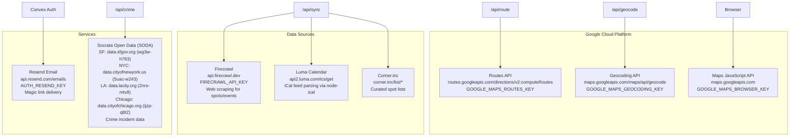
```mermaid
graph TB
    subgraph "Google Cloud Platform"
        GRoutes["Routes API<br/>routes.googleapis.com/directions/v2:computeRoutes<br/>GOOGLE_MAPS_ROUTES_KEY"]
        GGeocode["Geocoding API<br/>maps.googleapis.com/maps/api/geocode<br/>GOOGLE_MAPS_GEOCODING_KEY"]
        GMapsJS["Maps JavaScript API<br/>maps.googleapis.com<br/>GOOGLE_MAPS_BROWSER_KEY"]
    end

    subgraph "Data Sources"
        Firecrawl["Firecrawl<br/>api.firecrawl.dev<br/>FIRECRAWL_API_KEY<br/>Web scraping for spots/events"]
        Luma["Luma Calendar<br/>api2.luma.com/ics/get<br/>iCal feed parsing via node-ical"]
        Corner["Corner.inc<br/>corner.inc/list/*<br/>Curated spot lists"]
    end

    subgraph "Services"
        Resend["Resend Email<br/>api.resend.com/emails<br/>AUTH_RESEND_KEY<br/>Magic link delivery"]
        SocrataData["Socrata Open Data (SODA)<br/>SF: data.sfgov.org (wg3w-h783)<br/>NYC: data.cityofnewyork.us (5uac-w243)<br/>LA: data.lacity.org (2nrs-mtv8)<br/>Chicago: data.cityofchicago.org (ijzp-q8t2)<br/>Crime incident data"]
    end

    API["/api/route"] --> GRoutes
    API2["/api/geocode"] --> GGeocode
    Browser["Browser"] --> GMapsJS
    API3["/api/sync"] --> Firecrawl & Luma & Corner
    ConvexAuth["Convex Auth"] --> Resend
    API4["/api/crime"] --> SocrataData
```

---

## 6. Database Schema

### Entity Relationship Diagram

```mermaid
erDiagram
    cities {
        string _id PK
        string slug UK "indexed"
        string name
        string timezone
        string locale
        object mapCenter "lat, lng"
        object mapBounds "north, south, east, west"
        string crimeAdapterId
        boolean isSeeded
        string createdByUserId
        string createdAt
        string updatedAt
    }

    trips {
        string _id PK
        string userId FK "indexed"
        string urlId UK "indexed"
        string name
        array legs "cityId, startDate, endDate"
        string createdAt
        string updatedAt
    }

    userProfiles {
        string userId PK
        string role "owner | member"
        string email
        string createdAt
        string updatedAt
    }

    events {
        string id
        string cityId FK "indexed"
        string eventUrl UK "indexed (cityId, eventUrl)"
        string name
        string description
        string startDateTimeText
        string startDateISO
        string locationText
        string address
        string googleMapsUrl
        float lat
        float lng
        string sourceId FK "indexed (cityId, sourceId)"
        string sourceUrl
        float confidence
        int missedSyncCount
        boolean isDeleted
        string lastSeenAt
        string updatedAt
    }

    spots {
        string id PK "indexed (cityId, id)"
        string cityId FK "indexed"
        string name
        string tag
        string location
        string mapLink
        string cornerLink
        string curatorComment
        string description
        string details
        float lat
        float lng
        string sourceId FK "indexed (cityId, sourceId)"
        string sourceUrl
        float confidence
        int missedSyncCount
        boolean isDeleted
        string lastSeenAt
        string updatedAt
    }

    sources {
        string _id PK
        string cityId FK "indexed (cityId, sourceType, status)"
        string sourceType "event | spot"
        string url "indexed (cityId, url)"
        string label
        string status "active | paused"
        string createdAt
        string updatedAt
        string lastSyncedAt
        string lastError
        string rssStateJson
    }

    plannerEntries {
        string tripId FK "indexed"
        string cityId
        string roomCode "indexed (tripId, roomCode)"
        string ownerUserId "indexed"
        string dateISO "indexed"
        string itemId
        string kind "event | place"
        string sourceKey
        string title
        string locationText
        string link
        string tag
        int startMinutes
        int endMinutes
        string updatedAt
    }

    pairRooms {
        string tripId FK "indexed (tripId, roomCode)"
        string roomCode PK
        string createdByUserId
        string createdAt
        string updatedAt
    }

    pairMembers {
        string tripId FK "indexed (tripId, roomCode)"
        string roomCode FK
        string userId "indexed"
        string joinedAt
    }

    routeCache {
        string key PK "indexed"
        string encodedPolyline
        int totalDistanceMeters
        int totalDurationSeconds
        string updatedAt
    }

    geocodeCache {
        string addressKey PK "indexed"
        string addressText
        float lat
        float lng
        string updatedAt
    }

    syncMeta {
        string key PK "indexed"
        string syncedAt
        string_array calendars
        int eventCount
    }

    tripConfig {
        string tripId FK PK "indexed"
        string timezone
        string tripStart
        string tripEnd
        string baseLocation
        string updatedAt
    }

    plannerState {
        string key PK "indexed (legacy)"
        json plannerByDate
        string updatedAt
    }

    trips ||--o{ tripConfig : "tripId"
    trips ||--o{ plannerEntries : "tripId"
    trips ||--o{ pairRooms : "tripId"
    trips ||--o{ pairMembers : "tripId"
    cities ||--o{ events : "cityId"
    cities ||--o{ spots : "cityId"
    cities ||--o{ sources : "cityId"
    sources ||--o{ events : "sourceId"
    sources ||--o{ spots : "sourceId"
    pairRooms ||--o{ pairMembers : "roomCode"
    pairRooms ||--o{ plannerEntries : "roomCode"
    userProfiles ||--o{ pairMembers : "userId"
    userProfiles ||--o{ plannerEntries : "ownerUserId"
    userProfiles ||--o{ trips : "userId"
```

### Table Index Reference

| Table | Index Name | Fields | Purpose |
|-------|-----------|--------|---------|
| `cities` | `by_slug` | `slug` | City lookup by slug |
| `trips` | `by_user` | `userId` | List user's trips |
| `trips` | `by_url_id` | `urlId` | Trip lookup by URL-safe ID |
| `userProfiles` | `by_user_id` | `userId` | Profile lookup |
| `userProfiles` | `by_role` | `role` | List owners/members |
| `events` | `by_city` | `cityId` | List events for a city |
| `events` | `by_city_event_url` | `cityId, eventUrl` | Dedup on upsert (city-scoped) |
| `events` | `by_city_source` | `cityId, sourceId` | List events by source in city |
| `spots` | `by_city` | `cityId` | List spots for a city |
| `spots` | `by_city_spot_id` | `cityId, id` | Spot lookup (city-scoped) |
| `spots` | `by_city_source` | `cityId, sourceId` | List spots by source in city |
| `sources` | `by_city_type_status` | `cityId, sourceType, status` | Active source queries (city-scoped) |
| `sources` | `by_city_url` | `cityId, url` | Dedup on create (city-scoped) |
| `plannerEntries` | `by_trip_room` | `tripId, roomCode` | All entries in trip/room |
| `plannerEntries` | `by_trip_room_owner` | `tripId, roomCode, ownerUserId` | User's entries in room |
| `plannerEntries` | `by_trip_room_owner_date` | `tripId, roomCode, ownerUserId, dateISO` | User's entries for a day |
| `plannerEntries` | `by_trip_room_date` | `tripId, roomCode, dateISO` | All entries for a day |
| `pairRooms` | `by_trip_room` | `tripId, roomCode` | Room lookup (trip-scoped) |
| `pairMembers` | `by_trip_room` | `tripId, roomCode` | List room members |
| `pairMembers` | `by_trip_room_user` | `tripId, roomCode, userId` | Check membership |
| `pairMembers` | `by_user` | `userId` | List user's rooms |
| `routeCache` | `by_key` | `key` | Route lookup (SHA256 hash) |
| `geocodeCache` | `by_address_key` | `addressKey` | Geocode lookup |
| `syncMeta` | `by_key` | `key` | Sync status |
| `tripConfig` | `by_trip` | `tripId` | Trip config (per-trip) |
| `plannerState` | `by_key` | `key` | Legacy planner lookup |

---

## 7. Data Flow Diagrams

### 7.1 Event Sync Pipeline

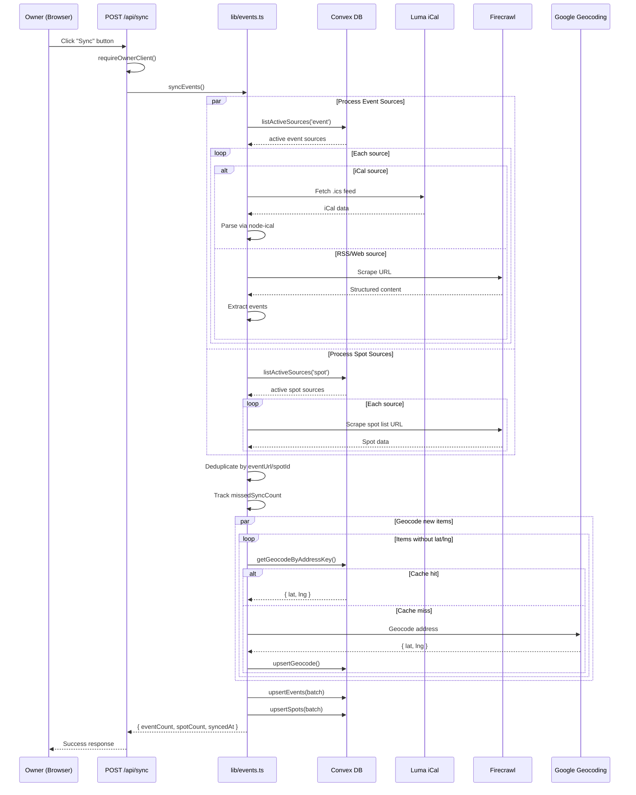
```mermaid
sequenceDiagram
    participant Owner as Owner (Browser)
    participant API as POST /api/sync
    participant Sync as lib/events.ts
    participant Convex as Convex DB
    participant Luma as Luma iCal
    participant FC as Firecrawl
    participant GMaps as Google Geocoding

    Owner->>API: Click "Sync" button
    API->>API: requireOwnerClient()
    API->>Sync: syncEvents()

    par Process Event Sources
        Sync->>Convex: listActiveSources('event')
        Convex-->>Sync: active event sources
        loop Each source
            alt iCal source
                Sync->>Luma: Fetch .ics feed
                Luma-->>Sync: iCal data
                Sync->>Sync: Parse via node-ical
            else RSS/Web source
                Sync->>FC: Scrape URL
                FC-->>Sync: Structured content
                Sync->>Sync: Extract events
            end
        end
    and Process Spot Sources
        Sync->>Convex: listActiveSources('spot')
        Convex-->>Sync: active spot sources
        loop Each source
            Sync->>FC: Scrape spot list URL
            FC-->>Sync: Spot data
        end
    end

    Sync->>Sync: Deduplicate by eventUrl/spotId
    Sync->>Sync: Track missedSyncCount

    par Geocode new items
        loop Items without lat/lng
            Sync->>Convex: getGeocodeByAddressKey()
            alt Cache hit
                Convex-->>Sync: { lat, lng }
            else Cache miss
                Sync->>GMaps: Geocode address
                GMaps-->>Sync: { lat, lng }
                Sync->>Convex: upsertGeocode()
            end
        end
    end

    Sync->>Convex: upsertEvents(batch)
    Sync->>Convex: upsertSpots(batch)
    Sync-->>API: { eventCount, spotCount, syncedAt }
    API-->>Owner: Success response
```

### 7.2 Route Calculation Flow

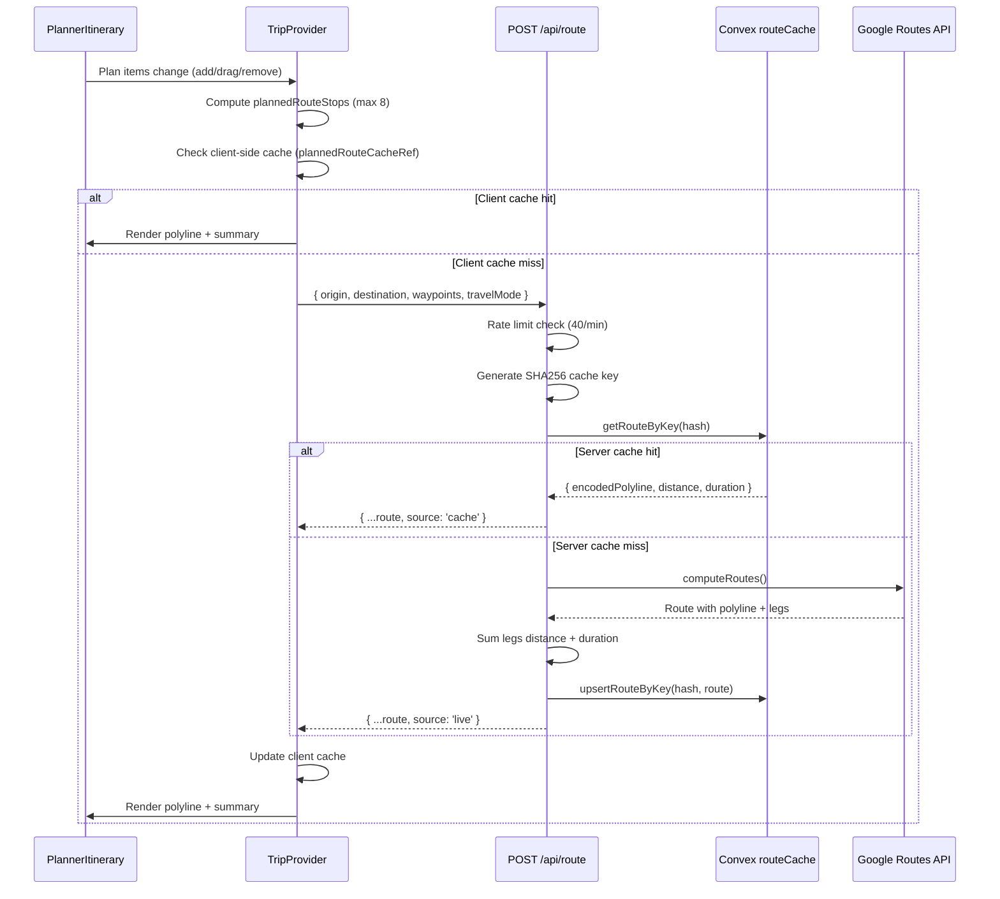
```mermaid
sequenceDiagram
    participant UI as PlannerItinerary
    participant Ctx as TripProvider
    participant API as POST /api/route
    participant Cache as Convex routeCache
    participant Google as Google Routes API

    UI->>Ctx: Plan items change (add/drag/remove)
    Ctx->>Ctx: Compute plannedRouteStops (max 8)
    Ctx->>Ctx: Check client-side cache (plannedRouteCacheRef)
    alt Client cache hit
        Ctx->>UI: Render polyline + summary
    else Client cache miss
        Ctx->>API: { origin, destination, waypoints, travelMode }
        API->>API: Rate limit check (40/min)
        API->>API: Generate SHA256 cache key
        API->>Cache: getRouteByKey(hash)
        alt Server cache hit
            Cache-->>API: { encodedPolyline, distance, duration }
            API-->>Ctx: { ...route, source: 'cache' }
        else Server cache miss
            API->>Google: computeRoutes()
            Google-->>API: Route with polyline + legs
            API->>API: Sum legs distance + duration
            API->>Cache: upsertRouteByKey(hash, route)
            API-->>Ctx: { ...route, source: 'live' }
        end
        Ctx->>Ctx: Update client cache
        Ctx->>UI: Render polyline + summary
    end
```

### 7.3 Planner State & Pair Room Flow

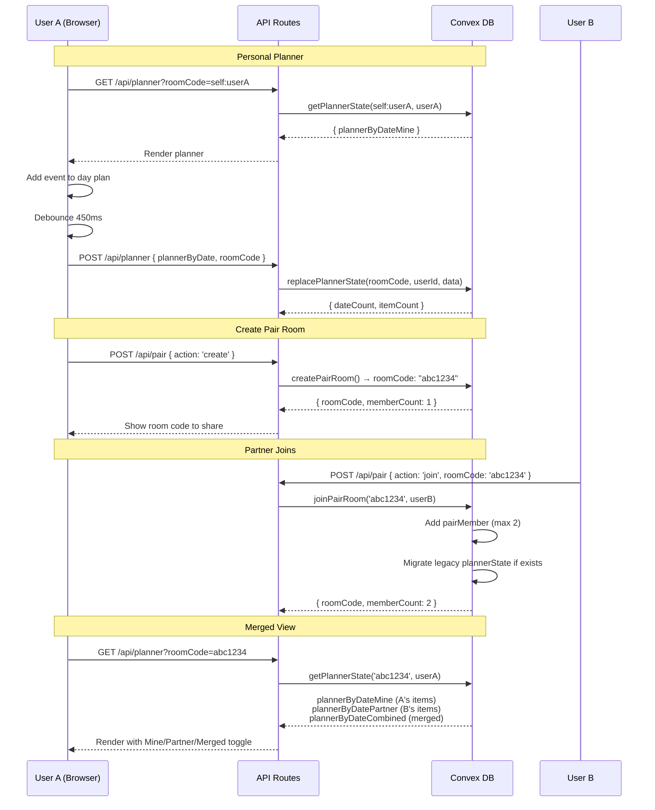
```mermaid
sequenceDiagram
    participant A as User A (Browser)
    participant API as API Routes
    participant Conv as Convex DB

    Note over A,Conv: Personal Planner
    A->>API: GET /api/planner?roomCode=self:userA
    API->>Conv: getPlannerState(self:userA, userA)
    Conv-->>API: { plannerByDateMine }
    API-->>A: Render planner

    A->>A: Add event to day plan
    A->>A: Debounce 450ms
    A->>API: POST /api/planner { plannerByDate, roomCode }
    API->>Conv: replacePlannerState(roomCode, userId, data)
    Conv-->>API: { dateCount, itemCount }

    Note over A,Conv: Create Pair Room
    A->>API: POST /api/pair { action: 'create' }
    API->>Conv: createPairRoom() → roomCode: "abc1234"
    Conv-->>API: { roomCode, memberCount: 1 }
    API-->>A: Show room code to share

    Note over A,Conv: Partner Joins
    participant B as User B
    B->>API: POST /api/pair { action: 'join', roomCode: 'abc1234' }
    API->>Conv: joinPairRoom('abc1234', userB)
    Conv->>Conv: Add pairMember (max 2)
    Conv->>Conv: Migrate legacy plannerState if exists
    Conv-->>API: { roomCode, memberCount: 2 }

    Note over A,Conv: Merged View
    A->>API: GET /api/planner?roomCode=abc1234
    API->>Conv: getPlannerState('abc1234', userA)
    Conv-->>API: plannerByDateMine (A's items)<br/>plannerByDatePartner (B's items)<br/>plannerByDateCombined (merged)
    API-->>A: Render with Mine/Partner/Merged toggle
```

### 7.4 Crime Heatmap Flow

The crime API supports multiple US cities via a city config registry (`lib/crime-cities.ts`). Each city defines its Socrata host, dataset ID, field name mappings, and excluded categories. The API normalizes all responses to a common incident shape regardless of city.

**Supported cities:** San Francisco, New York City, Los Angeles, Chicago

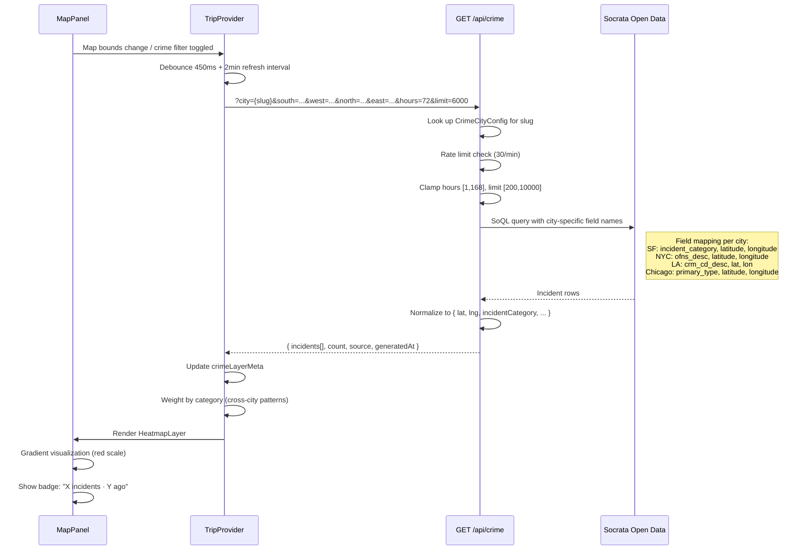
```mermaid
sequenceDiagram
    participant Map as MapPanel
    participant Ctx as TripProvider
    participant API as GET /api/crime
    participant Socrata as Socrata Open Data

    Map->>Ctx: Map bounds change / crime filter toggled
    Ctx->>Ctx: Debounce 450ms + 2min refresh interval
    Ctx->>API: ?city={slug}&south=...&west=...&north=...&east=...&hours=72&limit=6000
    API->>API: Look up CrimeCityConfig for slug
    API->>API: Rate limit check (30/min)
    API->>API: Clamp hours [1,168], limit [200,10000]
    API->>Socrata: SoQL query with city-specific field names
    Note right of Socrata: Field mapping per city:<br/>SF: incident_category, latitude, longitude<br/>NYC: ofns_desc, latitude, longitude<br/>LA: crm_cd_desc, lat, lon<br/>Chicago: primary_type, latitude, longitude
    Socrata-->>API: Incident rows
    API->>API: Normalize to { lat, lng, incidentCategory, ... }
    API-->>Ctx: { incidents[], count, source, generatedAt }
    Ctx->>Ctx: Update crimeLayerMeta
    Ctx->>Ctx: Weight by category (cross-city patterns)
    Ctx->>Map: Render HeatmapLayer
    Map->>Map: Gradient visualization (red scale)
    Map->>Map: Show badge: "X incidents · Y ago"
```

### 7.5 Application Initialization Sequence

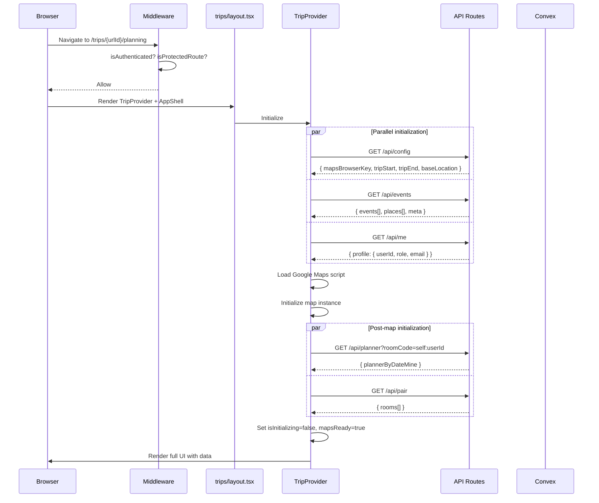
```mermaid
sequenceDiagram
    participant B as Browser
    participant MW as Middleware
    participant Layout as trips/layout.tsx
    participant TP as TripProvider
    participant APIs as API Routes
    participant Convex as Convex

    B->>MW: Navigate to /trips/{urlId}/planning
    MW->>MW: isAuthenticated? isProtectedRoute?
    MW-->>B: Allow

    B->>Layout: Render TripProvider + AppShell
    Layout->>TP: Initialize

    par Parallel initialization
        TP->>APIs: GET /api/config
        APIs-->>TP: { mapsBrowserKey, tripStart, tripEnd, baseLocation }
    and
        TP->>APIs: GET /api/events
        APIs-->>TP: { events[], places[], meta }
    and
        TP->>APIs: GET /api/me
        APIs-->>TP: { profile: { userId, role, email } }
    end

    TP->>TP: Load Google Maps script
    TP->>TP: Initialize map instance

    par Post-map initialization
        TP->>APIs: GET /api/planner?roomCode=self:userId
        APIs-->>TP: { plannerByDateMine }
    and
        TP->>APIs: GET /api/pair
        APIs-->>TP: { rooms[] }
    end

    TP->>TP: Set isInitializing=false, mapsReady=true
    TP->>B: Render full UI with data
```

### 7.6 Source Management Lifecycle

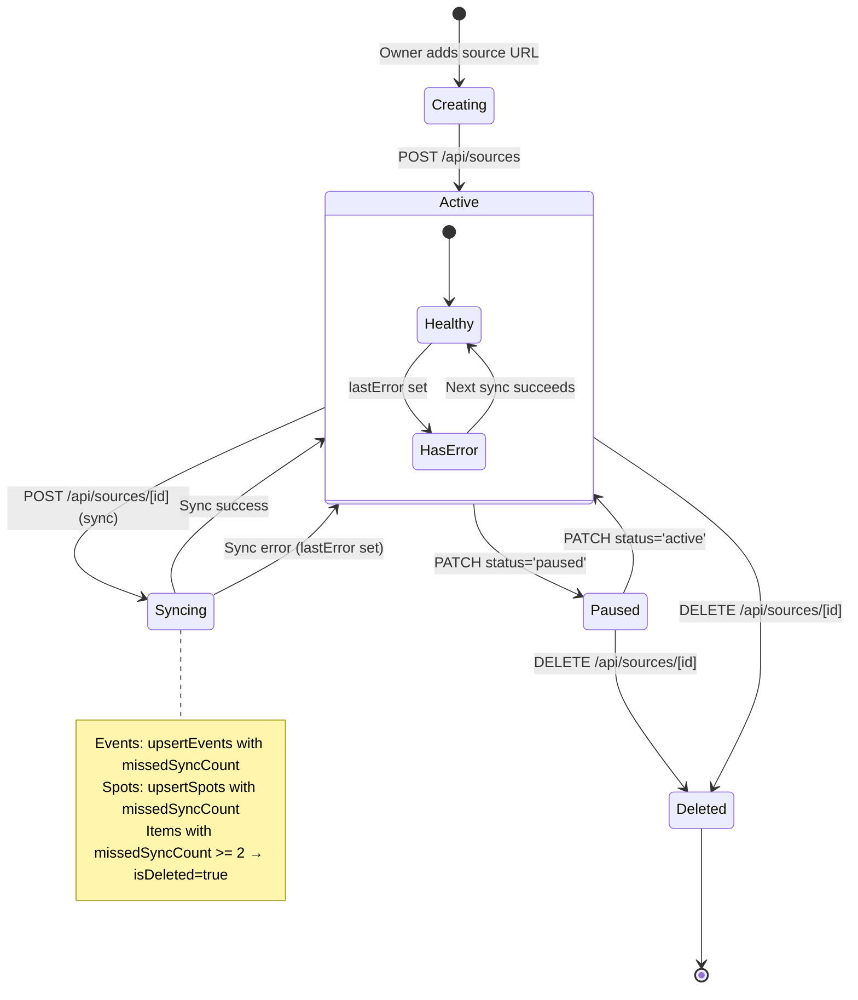
```mermaid
stateDiagram-v2
    [*] --> Creating: Owner adds source URL

    Creating --> Active: POST /api/sources
    Active --> Syncing: POST /api/sources/[id] (sync)
    Syncing --> Active: Sync success
    Syncing --> Active: Sync error (lastError set)

    Active --> Paused: PATCH status='paused'
    Paused --> Active: PATCH status='active'

    Active --> Deleted: DELETE /api/sources/[id]
    Paused --> Deleted: DELETE /api/sources/[id]
    Deleted --> [*]

    state Active {
        [*] --> Healthy
        Healthy --> HasError: lastError set
        HasError --> Healthy: Next sync succeeds
    }

    note right of Syncing
        Events: upsertEvents with missedSyncCount
        Spots: upsertSpots with missedSyncCount
        Items with missedSyncCount >= 2 → isDeleted=true
    end note
```

### 7.7 Soft-Delete Mechanism (Events & Spots)

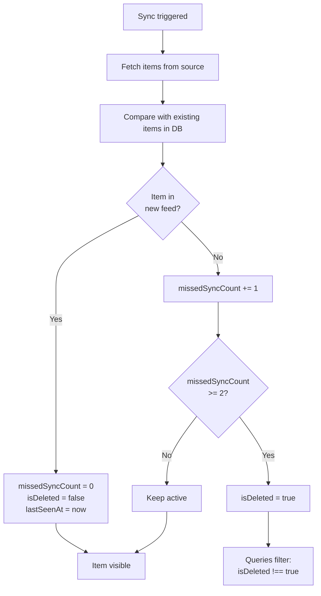
```mermaid
flowchart TD
    Sync["Sync triggered"] --> Fetch["Fetch items from source"]
    Fetch --> Compare["Compare with existing items in DB"]

    Compare --> Found{"Item in<br/>new feed?"}
    Found -->|Yes| Reset["missedSyncCount = 0<br/>isDeleted = false<br/>lastSeenAt = now"]
    Found -->|No| Increment["missedSyncCount += 1"]

    Increment --> Threshold{"missedSyncCount<br/>>= 2?"}
    Threshold -->|No| Keep["Keep active"]
    Threshold -->|Yes| SoftDelete["isDeleted = true"]

    SoftDelete --> Query["Queries filter:<br/>isDeleted !== true"]
    Reset --> Active["Item visible"]
    Keep --> Active
```

---

## 8. Security

### 8.1 Security Architecture Overview

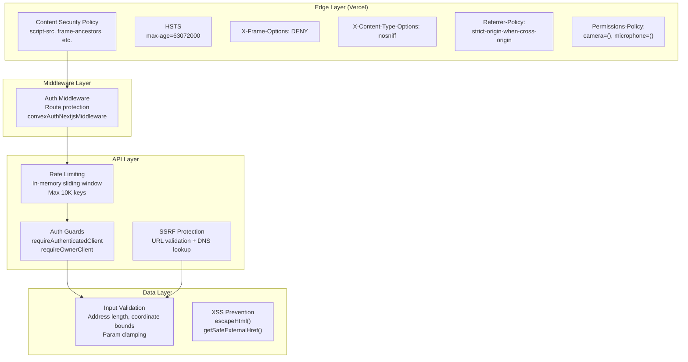
```mermaid
graph TB
    subgraph "Edge Layer (Vercel)"
        CSP["Content Security Policy<br/>script-src, frame-ancestors, etc."]
        HSTS["HSTS<br/>max-age=63072000"]
        XFO["X-Frame-Options: DENY"]
        XCTO["X-Content-Type-Options: nosniff"]
        RP["Referrer-Policy:<br/>strict-origin-when-cross-origin"]
        PP["Permissions-Policy:<br/>camera=(), microphone=()"]
    end

    subgraph "Middleware Layer"
        AuthMW["Auth Middleware<br/>Route protection<br/>convexAuthNextjsMiddleware"]
    end

    subgraph "API Layer"
        RateLimit["Rate Limiting<br/>In-memory sliding window<br/>Max 10K keys"]
        AuthGuard["Auth Guards<br/>requireAuthenticatedClient<br/>requireOwnerClient"]
        SSRF["SSRF Protection<br/>URL validation + DNS lookup"]
    end

    subgraph "Data Layer"
        InputVal["Input Validation<br/>Address length, coordinate bounds<br/>Param clamping"]
        XSSPrev["XSS Prevention<br/>escapeHtml()<br/>getSafeExternalHref()"]
    end

    CSP --> AuthMW --> RateLimit --> AuthGuard --> InputVal
    SSRF --> InputVal
```

### 8.2 Rate Limiting

In-memory sliding-window rate limiter (`lib/security.ts`):

| Endpoint | Limit | Window | Key Pattern |
|----------|-------|--------|-------------|
| `POST /api/route` | 40 | 60s | `api:route:{ip}` |
| `GET /api/crime` | 30 | 60s | `api:crime:{ip}` |
| `POST /api/geocode` | 25 | 60s | `api:geocode:{ip}` |

- Max 10,000 concurrent rate limit keys in memory
- Expired keys are garbage collected on overflow
- Returns `429 Too Many Requests` with `Retry-After` header

### 8.3 IP Resolution

Client IP extracted from headers in priority order:

1. `x-vercel-ip`
2. `cf-connecting-ip`
3. `fly-client-ip`
4. `fastly-client-ip`
5. `true-client-ip`
6. `x-forwarded-for` (first entry, only if proxy headers trusted)
7. `x-real-ip` (only if proxy headers trusted)
8. Fallback: `"unknown"`

Proxy headers trusted automatically when `VERCEL=1`, `CF_PAGES=1`, or `NETLIFY=true`.

### 8.4 SSRF Protection

Two-layer validation for source URLs (`lib/security.ts` + `lib/security-server.ts`):

**Layer 1 — URL Validation (`validateIngestionSourceUrl`)**
- Protocol must be `http:` or `https:`
- Hostname must not be private

**Layer 2 — DNS Validation (`validateIngestionSourceUrlForFetch`)**
- DNS lookup on hostname
- All resolved IPs must be public (not in private ranges)

**Private address ranges blocked:**

| IPv4 Range | Description |
|------------|-------------|
| `0.0.0.0/8` | Current network |
| `10.0.0.0/8` | Private class A |
| `100.64.0.0/10` | Carrier-grade NAT |
| `127.0.0.0/8` | Loopback |
| `169.254.0.0/16` | Link-local |
| `172.16.0.0/12` | Private class B |
| `192.168.0.0/16` | Private class C |
| `224.0.0.0/4` | Multicast |

| IPv6 | Description |
|------|-------------|
| `::`, `::1` | Loopback |
| `fc00::/7` (`fc`, `fd`) | Unique local |
| `fe80::/10` | Link-local |
| IPv4-mapped (`::ffff:x.x.x.x`) | Checked against IPv4 rules |

**Local hostnames blocked:** `localhost`, `*.localhost`, `*.local`, `*.internal`

### 8.5 Content Security Policy

Defined in `next.config.mjs`:

```
default-src 'self'
base-uri 'self'
object-src 'none'
frame-ancestors 'none'
script-src 'self' 'unsafe-inline' https://maps.googleapis.com https://maps.gstatic.com https://cdnjs.buymeacoffee.com
  (+ 'unsafe-eval' in development)
style-src 'self' 'unsafe-inline' https://fonts.googleapis.com
img-src 'self' data: blob: https:
font-src 'self' data: https://fonts.gstatic.com
connect-src 'self' https: wss:
frame-src 'self' https:
```

---

## 9. Configuration & Environment

### Environment Variables

#### Required

| Variable | Purpose |
|----------|---------|
| `CONVEX_URL` | Convex deployment URL (server-side) |
| `NEXT_PUBLIC_CONVEX_URL` | Convex deployment URL (client-side) |
| `GOOGLE_MAPS_BROWSER_KEY` | Google Maps JavaScript API key |
| `AUTH_RESEND_KEY` | Resend API key for magic link emails |
| `OWNER_EMAIL_ALLOWLIST` | Comma-separated owner emails (case-insensitive) |
| `FIRECRAWL_API_KEY` | Firecrawl API key for web scraping |

#### Required in Production

| Variable | Purpose |
|----------|---------|
| `AUTH_EMAIL_FROM` | Verified sender email for Resend (e.g., `SF Trip <auth@yourdomain.com>`) |

#### Optional

| Variable | Default | Purpose |
|----------|---------|---------|
| `GOOGLE_MAPS_MAP_ID` | - | Map ID for Advanced Markers |
| `GOOGLE_MAPS_ROUTES_KEY` | Falls back to `GOOGLE_MAPS_SERVER_KEY` / `BROWSER_KEY` | Routes API key |
| `GOOGLE_MAPS_GEOCODING_KEY` | Falls back to `GOOGLE_MAPS_SERVER_KEY` / `BROWSER_KEY` | Geocoding API key |
| `SFGOV_APP_TOKEN` | - | SF Open Data API token |
| `PORT` | `3000` | Development server port |
| `TRIP_START` | - | Default trip start (YYYY-MM-DD) |
| `TRIP_END` | - | Default trip end (YYYY-MM-DD) |
| `LUMA_CALENDAR_URLS` | Hardcoded defaults | Comma-separated Luma iCal URLs |
| `RSS_INITIAL_ITEMS` | `1` | RSS items on first sync |
| `RSS_MAX_ITEMS_PER_SYNC` | `3` | Max RSS items per sync |
| `NEXT_PUBLIC_BUYMEACOFFEE_ID` | - | Buy Me A Coffee widget ID |
| `TRUST_PROXY_IP_HEADERS` | Auto-detected | Trust `x-forwarded-for` headers |
| `AUTH_RESEND_TEMPLATE_ID` | - | Custom Resend email template |

### Build Scripts

```json
{
  "dev": "next dev",
  "build": "next build",
  "start": "next start",
  "test:backend": "node --test lib/*.test.mjs convex/*.test.mjs",
  "lint": "eslint .",
  "typecheck": "tsc --noEmit",
  "format": "prettier --write .",
  "convex:dev": "convex dev",
  "convex:deploy": "convex deploy"
}
```

---

## 10. Deployment

### Deployment Model

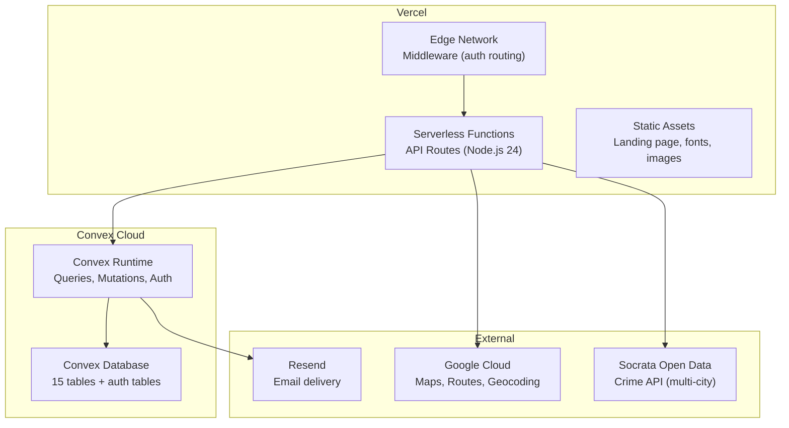
```mermaid
graph TB
    subgraph "Vercel"
        Edge["Edge Network<br/>Middleware (auth routing)"]
        Serverless["Serverless Functions<br/>API Routes (Node.js 24)"]
        Static["Static Assets<br/>Landing page, fonts, images"]
    end

    subgraph "Convex Cloud"
        ConvexRT["Convex Runtime<br/>Queries, Mutations, Auth"]
        ConvexDB["Convex Database<br/>15 tables + auth tables"]
    end

    subgraph "External"
        GCP["Google Cloud<br/>Maps, Routes, Geocoding"]
        ResendSvc["Resend<br/>Email delivery"]
        SFGov["Socrata Open Data<br/>Crime API (multi-city)"]
    end

    Edge --> Serverless
    Serverless --> ConvexRT
    ConvexRT --> ConvexDB
    Serverless --> GCP
    Serverless --> SFGov
    ConvexRT --> ResendSvc
```

### Deployment Checklist

| Step | Command | Notes |
|------|---------|-------|
| Deploy Convex | `npx convex deploy` | Schema + functions pushed to Convex Cloud |
| Deploy Vercel | `git push` (auto) or `vercel deploy` | Builds Next.js, deploys to edge + serverless |
| Set env vars | Vercel Dashboard → Settings → Environment Variables | All required vars from section 9 |
| Verify auth | Visit `/signin`, send magic link | Ensure Resend key and `AUTH_EMAIL_FROM` are correct |

- **No Docker** — Vercel handles containerization
- **No CI/CD pipeline** — Vercel auto-deploys from Git; Convex deployed manually
- **No separate staging** — Single deployment target

### Caching Strategy

```mermaid
graph LR
    subgraph "Client (Browser)"
        TTC["travelTimeCacheRef<br/>(in-memory Map)"]
        PRC["plannedRouteCacheRef<br/>(in-memory Map)"]
        GCC["geocodeStoreRef<br/>(in-memory Map)"]
    end

    subgraph "Server (Convex)"
        RC["routeCache table<br/>(SHA256-keyed)"]
        GeC["geocodeCache table<br/>(address-keyed)"]
    end

    subgraph "Server (Filesystem)"
        EF["data/events-cache.json"]
        GF["data/geocode-cache.json"]
        RF["data/route-cache.json"]
        TF["data/trip-config.json"]
    end

    subgraph "CDN (Vercel)"
        Crime["GET /api/crime?city={slug}<br/>s-maxage=60<br/>stale-while-revalidate=120"]
    end
```

**Fallback Chain:** Convex DB (primary) → Local JSON cache files (secondary) → Sample/static data (fallback)

---

## 11. Testing Strategy & Roadmap

### Current Test Coverage

The project uses Node.js built-in test runner (`node:test`) for backend tests. Most tests are **source-code-scanning tests** that read `.tsx` files as strings and assert on content, rather than behavioral tests.

| Test Category | Files | Coverage |
|---------------|-------|----------|
| Crime city registry | `lib/crime-cities.test.mjs` | Field completeness, slug matching |
| Auth guards | `lib/api-guards.test.mjs`, `convex/authz.test.mjs` | Guard function behavior |
| Owner role resolution | `convex/owner-role.test.mjs` | Allowlist parsing |
| Planner API | `lib/planner-api.test.mjs` | Room code normalization |
| Pair API | `lib/pair-api.test.mjs` | Action body parsing |
| Sync engine | `lib/events.test.mjs`, `lib/events.rss.test.mjs` | iCal parsing, SSRF rejection |
| Dashboard | `lib/dashboard.test.mjs` | Source code assertions |
| TripProvider | `lib/trip-provider-bootstrap.test.mjs` | Source code assertions |

### Test Commands

```bash
# Run all backend tests
bun run test:backend

# Run specific test file
node --test lib/crime-cities.test.mjs

# Run with verbose output
node --test --test-reporter spec lib/*.test.mjs
```

### Current Gaps

| Area | Gap | Impact |
|------|-----|--------|
| Component tests | No React component rendering tests | UI regressions undetected |
| Integration tests | No E2E tests for user flows | Cross-component bugs undetected |
| API route tests | No HTTP-level API tests | Request/response contract drift |
| Convex mutations | No mutation behavior tests | Database logic untested |
| TypeScript | `lib/events.ts` has `@ts-nocheck` | Type errors hidden |

### Testing Roadmap

**Phase 1: Foundation (Recommended First)**
- [ ] Add Vitest for component testing
- [ ] Create test utilities for mocking TripProvider context
- [ ] Add tests for pure helper functions (`lib/helpers.ts`, `lib/planner-helpers.ts`)
- [ ] Remove `@ts-nocheck` from `lib/events.ts` and fix type errors

**Phase 2: Component Tests**
- [ ] Test `PlannerItinerary` drag-and-drop behavior
- [ ] Test `MapPanel` filter chip interactions
- [ ] Test `TripSelector` trip/city switching
- [ ] Test `CityPickerModal` search and selection

**Phase 3: Integration Tests**
- [ ] Add Playwright for E2E testing
- [ ] Test sign-in → dashboard → trip creation flow
- [ ] Test planner → calendar export flow
- [ ] Test pair room creation and joining

**Phase 4: API Contract Tests**
- [ ] Add OpenAPI spec generation
- [ ] Test all 14 API endpoints with mock data
- [ ] Add rate limit verification tests

### Recommended Test Setup

```bash
# Add testing dependencies
bun add -d vitest @testing-library/react @testing-library/jest-dom
bun add -d @playwright/test
```

```json
// package.json additions
{
  "scripts": {
    "test": "vitest",
    "test:e2e": "playwright test",
    "test:backend": "node --test lib/*.test.mjs convex/*.test.mjs"
  }
}
```

---

## Appendix: Key Data Structures

### PlanItem

```typescript
{
  id: string               // 'plan-xxxxx'
  kind: 'event' | 'place'
  sourceKey: string         // eventUrl or spot id
  title: string
  locationText: string
  link: string
  tag: string              // normalized place tag
  startMinutes: number     // 0–1440
  endMinutes: number       // 0–1440
  ownerUserId?: string     // set in pair mode
}
```

### Room Code Rules

| Type | Format | Example | Shareable |
|------|--------|---------|-----------|
| Personal | `self:{userId}` | `self:abc123` | No |
| Pair | 7-char alphanumeric | `xk9m2p7` | Yes (max 2 members) |

- Normalized: lowercase, non-alphanumeric stripped
- Pattern: `^[a-z0-9_-]{2,64}$`

### Planner Constants

| Constant | Value | Purpose |
|----------|-------|---------|
| `PLAN_SNAP_MINUTES` | 15 | Drag snap interval |
| `PLAN_HOUR_HEIGHT` | 50px | Time grid row height |
| `MAX_ROUTE_STOPS` | 8 | Max waypoints for route |
| `MIN_PLAN_BLOCK_MINUTES` | 30 | Minimum block duration |
| `MISSED_SYNC_THRESHOLD` | 2 | Syncs before soft-delete |
