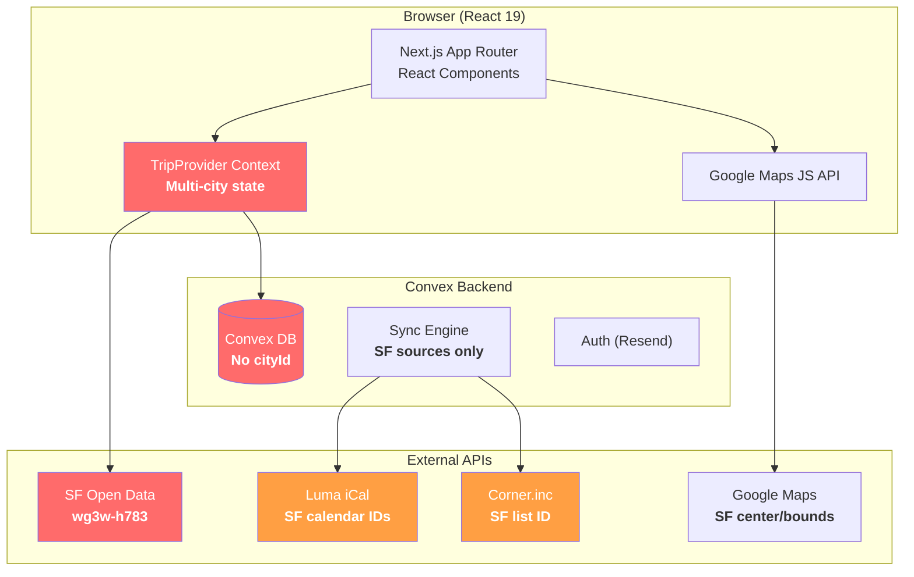
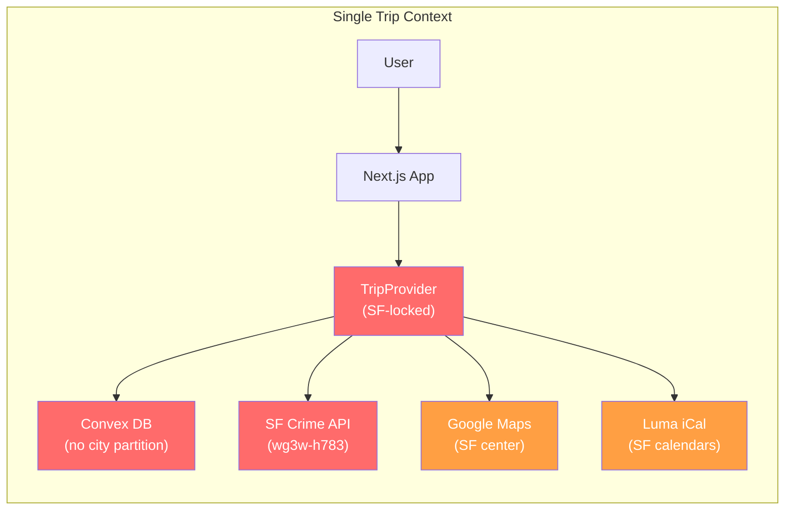
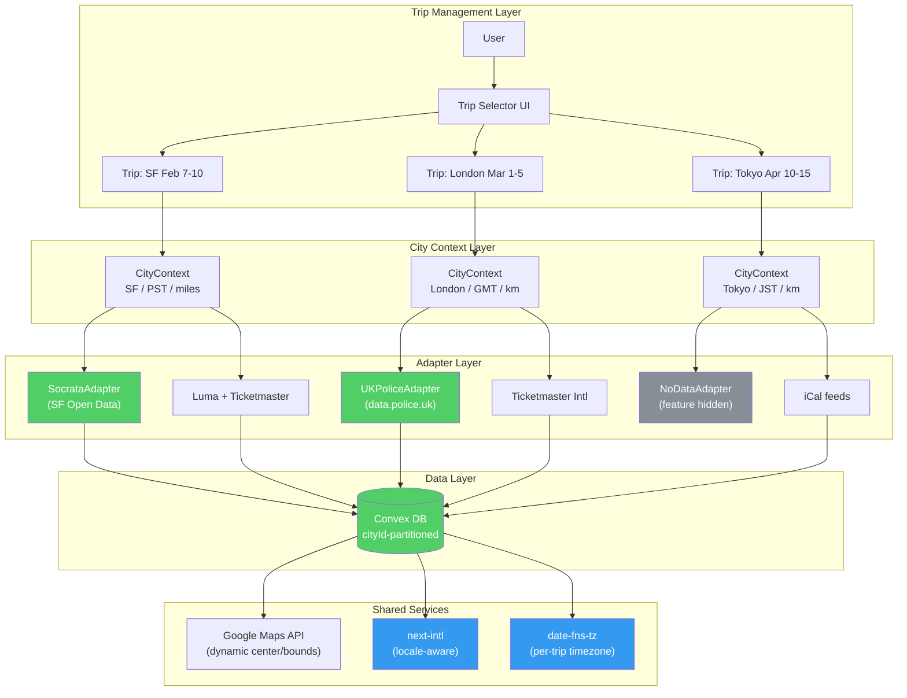
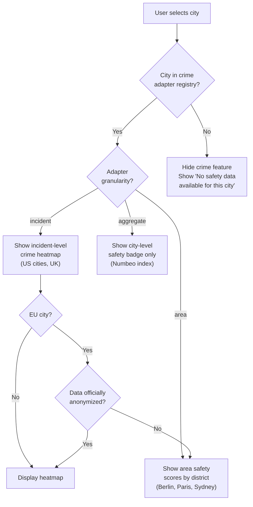
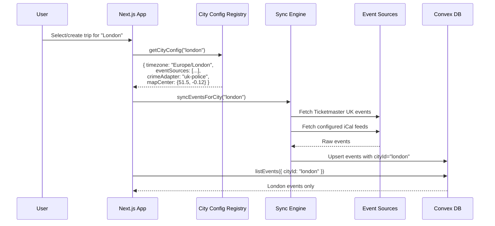

# Expansion Plan: Trip Planner Multi-Region Platform

> **Last Updated:** 2026-03-15
>
> Comprehensive analysis of technical, product, and design work for extending Trip Planner across US cities, Europe, and other global regions.
>
> **Status:** Many items in this plan have been implemented (multi-city data model, city auto-provisioning, per-city crime adapters, GDPR cookie consent, TripSelector, CityPickerModal). This document remains relevant for items still in progress (i18n, mobile, full GDPR compliance, additional crime data adapters).

---

## Table of Contents

1. [Executive Summary](#1-executive-summary)
2. [Current Architecture Overview](#2-current-architecture-overview)
3. [Database Schema — Single-Tenancy](#3-database-schema--single-tenancy-critical)
4. [External API Integrations — SF-Locked](#4-external-api-integrations--sf-locked-critical)
5. [Crime Data API Landscape — Global Research](#5-crime-data-api-landscape--global-research)
6. [Event Aggregation Platforms — Global Research](#6-event-aggregation-platforms--global-research)
7. [Timezone & Locale — Hardcoded PST](#7-timezone--locale--hardcoded-pst-critical)
8. [Timezone Library Recommendations](#8-timezone-library-recommendations)
9. [Units & Locale — US-Only](#9-units--locale--us-only-moderate)
10. [Internationalization (i18n) Strategy](#10-internationalization-i18n-strategy)
11. [State Management — Single-Trip Architecture](#11-state-management--single-trip-architecture-critical)
12. [Branding & Content — Pervasive SF References](#12-branding--content--pervasive-sf-references-high)
13. [Static Data — All SF Content](#13-static-data--all-sf-content-moderate)
14. [GDPR & Data Privacy — European Expansion](#14-gdpr--data-privacy--european-expansion)
15. [Product & Design Blockers](#15-product--design-blockers)
16. [Scaling Tiers — Implementation Plans](#16-scaling-tiers--implementation-plans)
17. [Architecture Diagrams](#17-architecture-diagrams)
18. [Summary Heat Map](#18-summary-heat-map)

---

## 1. Executive Summary

Trip Planner has been refactored from its original SF-only architecture to support multiple cities. The core planning engine (planner, pair rooms, ICS export, route computation) is now city-agnostic. The database schema includes `cities` and `trips` tables with per-city scoping on events, spots, and sources. Crime data adapters cover SF, NYC, LA, and Chicago. Remaining expansion work includes adding more crime adapters, full i18n, and GDPR compliance beyond cookie consent.

Scaling to multi-city requires a **"city/trip context" abstraction** threaded through every layer. The effort ranges from low (map defaults, source URLs) to very high (database schema redesign, multi-trip UX).

**Key findings from online research:**
- Crime data APIs exist for major US cities (NYC, LA, Chicago) but use incompatible schemas; UK has `data.police.uk`; most EU/Asian cities lack public incident-level APIs entirely
- Event aggregation is feasible globally via Ticketmaster Discovery API, Eventbrite (limited), and iCal feeds; Luma and Meetup require per-city configuration
- `next-intl` is the recommended i18n solution for Next.js App Router
- GDPR Article 10 heavily restricts processing of criminal conviction data in the EU
- The Temporal API has shipped in Chrome 144 and Firefox 139 but is not yet baseline; `date-fns-tz` or Luxon remain the practical choices

---

## 2. Current Architecture Overview



---

## 3. Database Schema — Single-Tenancy (CRITICAL)

**No city/region/trip dimension on any table.**

| Table | Scoping Today | Blocker | File:Line |
|-------|--------------|---------|-----------|
| `events` | Global (dedup by `eventUrl`) | No `cityId`/`tripId` — SF + NYC events collide in same table | `convex/schema.ts:76-96` |
| `spots` | Global (dedup by `id`) | All cities' spots in one flat list | `convex/schema.ts:97-117` |
| `sources` | Global (dedup by `url`) | Can't have SF Corner list + NYC Corner list simultaneously | `convex/schema.ts:118-129` |
| `tripConfig` | Singleton (`key='default'`) | Only ONE trip config per deployment | `convex/tripConfig.ts:5` |
| `plannerEntries` | Scoped by `roomCode` | Room is city-agnostic, but loads ALL events/spots globally | `convex/schema.ts:27-45` |
| `geocodeCache` | Global (`addressKey`) | Unlikely collision but no city partition | `convex/schema.ts:130-136` |
| `routeCache` | Global (SHA256 of coords) | Not a real problem — coords are unique per location | `convex/schema.ts:69-75` |
| `syncMeta` | Singleton (`key='default'`) | One sync state per deployment | `convex/schema.ts:137-142` |

### Queries return everything unfiltered

- `listEvents()` → `ctx.db.query('events').collect()` — **ALL** events globally — `convex/events.ts:62-78`
- `listSpots()` → `ctx.db.query('spots').collect()` — **ALL** spots globally — `convex/spots.ts:52-64`
- `listActiveSources()` → returns all sources by type, no city filter — `convex/sources.ts:121-135`

### Required changes

**Option A — Column-level multi-tenancy:**
- Add `cityId: v.string()` to `events`, `spots`, `sources`, `syncMeta`
- Add `tripId: v.id('trips')` to `plannerEntries`, `tripConfig`
- Create new `cities` and `trips` tables
- Add composite indexes (e.g., `by_city_and_date` on events)
- Update every query to filter by `cityId`/`tripId`

**Option B — Deployment-per-city:**
- Simpler isolation but limits cross-city features (multi-leg trips, shared accounts)
- Each city gets its own Convex deployment URL

---

## 4. External API Integrations — SF-Locked (CRITICAL)

### 4.1 Crime Data — 100% SF-Specific

| Item | Value | File:Line |
|------|-------|-----------|
| Dataset ID | `wg3w-h783` (SF Police Incidents) | `app/api/crime/route.ts:6` |
| API endpoint | `https://data.sfgov.org/resource/wg3w-h783.json` | `app/api/crime/route.ts:7` |
| Excluded categories | Non-Criminal, Case Closure, Lost Property, Courtesy Report, Recovered Vehicle | `app/api/crime/route.ts:42-48` |
| No `?city=` param | API has no mechanism to switch city | `app/api/crime/route.ts:52-85` |

### 4.2 Event Sources — Partially City-Agnostic

| Source Type | SF-Specific? | Details | File:Line |
|-------------|-------------|---------|-----------|
| Luma iCal feeds | **YES** — hardcoded SF calendar IDs | `cal-kC1rltFkxqfbHcB`, `discplace-BDj7GNbGlsF7Cka` | `lib/events.ts:89-90` |
| Corner.inc list | **YES** — hardcoded SF list ID | `e65af393-70dd-46d5-948a-d774f472d2ee` | `lib/events.ts:20` |
| Beehiiv RSS | **YES** — SF newsletter feed | `9B98D9gG4C` | `lib/events.ts:21` |
| `LUMA_CALENDAR_URLS` env | Partially configurable | Env var exists but defaults are hardcoded | `lib/events.ts:87-94` |
| iCal protocol | **NO** — generic | Works for any iCal feed | `lib/events.ts` |
| Firecrawl scraping | **NO** — generic | Scrapes any URL | `lib/events.ts` |
| Source management UI | **NO** — generic | Owner can add/remove arbitrary sources | `convex/sources.ts` |

### 4.3 Google Maps — Works Globally, but Defaults are SF

| Item | Value | File:Line |
|------|-------|-----------|
| Default center | `{ lat: 37.7749, lng: -122.4194 }` (SF City Hall) | `components/providers/TripProvider.tsx:1291` |
| Map restriction bounds | `{ north: 37.85, south: 37.68, west: -122.55, east: -122.33 }` | `components/providers/TripProvider.tsx:1296` |
| "My location" fallback | Same SF coords | `components/providers/TripProvider.tsx:841` |

---

## 5. Crime Data API Landscape — Global Research

### 5.1 US Cities — Socrata Open Data (SODA API)

Most major US cities publish crime data through Socrata-powered open data portals, using the SODA (Socrata Open Data API) protocol. This is the same protocol SF uses, which simplifies adapter development.

#### San Francisco (Current)
- **Portal:** `data.sfgov.org`
- **Dataset:** `wg3w-h783` (Police Department Incident Reports: 2018 to Present)
- **Endpoint:** `https://data.sfgov.org/resource/wg3w-h783.json`
- **Key fields:** `incident_category`, `incident_datetime`, `latitude`, `longitude`, `incident_description`
- **Auth:** Open (no key required; app token recommended for higher rate limits)
- **Docs:** [SF OpenData](https://data.sfgov.org/Public-Safety/Police-Department-Incident-Reports-2018-to-Present/wg3w-h783)

#### New York City
- **Portal:** `data.cityofnewyork.us`
- **Dataset (YTD):** `5uac-w243` — [NYPD Complaint Data Current (Year To Date)](https://data.cityofnewyork.us/Public-Safety/NYPD-Complaint-Data-Current-Year-To-Date-/5uac-w243)
- **Dataset (Historic):** `qgea-i56i` — [NYPD Complaint Data Historic](https://data.cityofnewyork.us/Public-Safety/NYPD-Complaint-Data-Historic/qgea-i56i)
- **Endpoint:** `https://data.cityofnewyork.us/resource/5uac-w243.json`
- **Key fields:** `ofns_desc` (offense description), `cmplnt_fr_dt` (date), `latitude`, `longitude`, `law_cat_cd` (felony/misdemeanor/violation)
- **Auth:** Open (app token recommended)
- **Docs:** [NYC OpenData](https://opendata.cityofnewyork.us/)

#### Los Angeles
- **Portal:** `data.lacity.org`
- **Dataset:** `2nrs-mtv8` — [Crime Data from 2020 to Present](https://data.lacity.org/Public-Safety/Crime-Data-from-2020-to-Present/2nrs-mtv8)
- **Endpoint:** `https://data.lacity.org/resource/2nrs-mtv8.json`
- **Key fields:** `crm_cd_desc` (crime description), `date_occ` (date), `lat`, `lon`, `area_name`
- **Auth:** Open (app token recommended)
- **Update:** Bi-weekly (switched to NIBRS format in 2024)
- **Docs:** [Socrata Foundry](https://dev.socrata.com/foundry/data.lacity.org/2nrs-mtv8)

#### Chicago
- **Portal:** `data.cityofchicago.org`
- **Dataset:** `ijzp-q8t2` — [Crimes - 2001 to Present](https://data.cityofchicago.org/Public-Safety/Crimes-2001-to-Present/ijzp-q8t2)
- **Endpoint:** `https://data.cityofchicago.org/resource/ijzp-q8t2.json`
- **Key fields:** `primary_type`, `date`, `latitude`, `longitude`, `description`, `location_description`
- **Auth:** Open (app token recommended)
- **Update:** Daily (minus most recent 7 days)
- **Docs:** [Socrata Foundry](https://dev.socrata.com/foundry/data.cityofchicago.org/ijzp-q8t2)

### 5.2 UK — data.police.uk (Best International Option)

The UK has the most comprehensive public crime API outside the US.

- **Base URL:** `https://data.police.uk/api/`
- **Street-level crimes:** `GET /crimes-street/all-crime?lat={lat}&lng={lng}&date={YYYY-MM}`
- **Crimes at location:** `GET /crimes-at-location?date={YYYY-MM}&lat={lat}&lng={lng}`
- **Crime categories:** `GET /crime-categories?date={YYYY-MM}`
- **Key fields:** `category`, `location.latitude`, `location.longitude`, `month`, `outcome_status`
- **Auth:** None required
- **Rate limit:** 15 requests per second, max 10,000 crimes per call
- **Coverage:** England, Wales, Northern Ireland (not Scotland)
- **Privacy:** Locations are snapped to anonymous map points (not exact addresses) — GDPR-compliant by design
- **Docs:** [data.police.uk/docs](https://data.police.uk/docs/)

### 5.3 Japan (Tokyo) — No Public Incident-Level API

- **National Police Agency:** Publishes annual aggregate crime statistics only (PDF/Excel) — [NPA Statistics](https://www.npa.go.jp/english/Statistics.html)
- **e-Stat portal:** Provides aggregate criminal statistics via API — [e-stat.go.jp](https://www.e-stat.go.jp/en/statistics/00130001)
- **Tokyo Metropolitan Police:** Publishes a crime occurrence map at keishicho.metro.tokyo.jp but no public API
- **Key limitation:** NPA explicitly states they do not provide location-level crime data
- **Conclusion:** No incident-level crime API available. Feature must degrade to aggregate safety scores or be hidden entirely

### 5.4 Germany (Berlin) — Aggregate Only

- **Berlin Open Data:** Publishes the "Kriminalitatsatlas" (Crime Atlas) with crime rates by district — [daten.berlin.de](https://daten.berlin.de/datensaetze?author_string=Polizei+Berlin+LKA+St+14)
- **Format:** CSV/Excel files, downloadable from the open data portal; not a real-time API
- **Coverage:** Aggregated by planning area (Planungsraum), not individual incidents
- **Crime types:** Muggings, bike theft, drug-related crimes; excludes serious crimes like murder/rape
- **Interactive tool:** [Crime Atlas Berlin](https://lab.technologiestiftung-berlin.de/projects/crime-atlas/en/)
- **Conclusion:** District-level aggregate data only. Could show neighborhood safety scores but not heatmaps

### 5.5 France (Paris) — Departmental Aggregates

- **Portal:** `data.gouv.fr`
- **Dataset:** [Crimes et delits enregistres](https://www.data.gouv.fr/en/datasets/bases-statistiques-communale-departementale-et-regionale-de-la-delinquance-enregistree-par-la-police-et-la-gendarmerie-nationales/) — crimes and offenses recorded by police and gendarmerie since 2012
- **Granularity:** Municipal, departmental, and regional levels — NOT incident-level
- **Format:** CSV downloads via CKAN API
- **Auth:** None
- **Conclusion:** Aggregate data by commune/department. No incident-level coordinates

### 5.6 Australia (Sydney) — BOCSAR

- **Portal:** [bocsar.nsw.gov.au](https://bocsar.nsw.gov.au/)
- **Crime Mapping Tool:** [crimetool.bocsar.nsw.gov.au](https://crimetool.bocsar.nsw.gov.au/bocsar/)
- **Open datasets:** Monthly criminal incident data, updated quarterly
- **Granularity:** LGA (Local Government Area), suburb, or postcode — not individual incidents
- **API:** Web API with query support (CKAN-style)
- **Hotspot maps:** Available for 11 offence types including assault, robbery, theft
- **Conclusion:** Suburb/LGA level. Hotspot data could support area-level safety indicators

### 5.7 Commercial / Aggregated Providers

| Provider | Coverage | Data Type | API? | Pricing |
|----------|----------|-----------|------|---------|
| **Numbeo** | 150+ countries | Crowd-sourced safety index | REST API | Paid |
| **CrimeMapping.com** | US cities | Incident-level (from police feeds) | No public API | N/A |
| **SpotCrime** | US cities | Incident-level (aggregated) | Paid API | Paid |
| **Base Operations** | Global | Safety intelligence | API | Enterprise |

### 5.8 Adapter Architecture Required

```typescript
// Proposed crime data adapter interface
interface CrimeDataAdapter {
  readonly cityId: string;
  readonly granularity: 'incident' | 'area' | 'aggregate' | 'none';

  fetchIncidents(bounds: LatLngBounds, dateRange: DateRange): Promise<CrimeIncident[]>;
  fetchAreaScores?(areaIds: string[]): Promise<AreaSafetyScore[]>;

  // Schema normalization
  normalizeCategory(rawCategory: string): StandardCrimeCategory;
  normalizeLocation(raw: unknown): { lat: number; lng: number };
}

// Registry of adapters per city
const CRIME_ADAPTERS: Record<string, () => CrimeDataAdapter> = {
  'san-francisco': () => new SocrataAdapter({ host: 'data.sfgov.org', dataset: 'wg3w-h783', ... }),
  'new-york':      () => new SocrataAdapter({ host: 'data.cityofnewyork.us', dataset: '5uac-w243', ... }),
  'los-angeles':   () => new SocrataAdapter({ host: 'data.lacity.org', dataset: '2nrs-mtv8', ... }),
  'chicago':       () => new SocrataAdapter({ host: 'data.cityofchicago.org', dataset: 'ijzp-q8t2', ... }),
  'london':        () => new UKPoliceAdapter(),
  'tokyo':         () => new NoDataAdapter({ fallback: 'aggregate-safety-score' }),
  'berlin':        () => new AggregateCSVAdapter({ source: 'berlin-crime-atlas' }),
  'paris':         () => new AggregateCSVAdapter({ source: 'data-gouv-fr' }),
  'sydney':        () => new BOCSARAdapter(),
};
```

### 5.9 Crime Feature Summary by Region

| Region | Incident-Level Heatmap | Area Safety Scores | No Data |
|--------|----------------------|-------------------|---------|
| US (top 10 cities) | Yes (SODA API) | Yes | — |
| UK (England/Wales) | Yes (data.police.uk) | Yes | — |
| Germany | — | Yes (Crime Atlas) | — |
| France | — | Partial (commune level) | — |
| Japan | — | — | Feature hidden |
| Australia (NSW) | — | Yes (BOCSAR hotspots) | — |
| Most other countries | — | — | Feature hidden |

---

## 6. Event Aggregation Platforms — Global Research

### 6.1 Platform Comparison

#### Luma (lu.ma)
- **API docs:** [docs.luma.com](https://docs.luma.com/reference/getting-started-with-your-api) and [help.luma.com/p/luma-api](https://help.luma.com/p/luma-api)
- **Auth:** API key (OAuth available for integrations)
- **Coverage:** Global, but strongest in US tech hubs (SF, NYC, LA, Austin)
- **iCal feeds:** Yes — each calendar has a public `.ics` URL (already used by the app)
- **Key limitation:** No public "search events by city" endpoint; must know specific calendar IDs
- **Rate limits:** Documented in API docs; varies by plan
- **Current app usage:** Hardcoded SF calendar IDs in `lib/events.ts:89-90`
- **Scaling approach:** Maintain a per-city registry of Luma calendar IDs; community-contributed

#### Eventbrite
- **API docs:** [eventbrite.com/platform/api](https://www.eventbrite.com/platform/api)
- **Auth:** OAuth 2.0 (API key from Developer Portal)
- **Coverage:** Global (190+ countries)
- **Key limitation:** **Event Search API (`/v3/events/search/`) was deprecated in February 2020**. Current alternatives:
  - `GET /v3/events/:event_id/` — retrieve by ID
  - `GET /v3/venues/:venue_id/events/` — list by venue
  - `GET /v3/organizations/:org_id/events/` — list by organization
- **No city-wide search:** Cannot discover events by location without knowing specific org/venue IDs
- **Conclusion:** Limited utility for discovery; useful if you know specific organizers per city

#### Meetup
- **API docs:** [meetup.com/graphql](https://www.meetup.com/graphql/)
- **Auth:** OAuth 2.0 (requires **Meetup Pro subscription** to create OAuth consumers)
- **API type:** GraphQL only (REST API deprecated)
- **Coverage:** Global (190+ countries, strong in tech/professional communities)
- **Key limitation:** API access restricted to Pro subscribers; approval not guaranteed
- **Useful queries:** Search events by location (lat/lng + radius), category, keyword
- **Conclusion:** Good data source if Pro subscription is available; GraphQL adds complexity

#### Ticketmaster Discovery API
- **API docs:** [developer.ticketmaster.com/products-and-docs/apis/discovery-api/v2/](https://developer.ticketmaster.com/products-and-docs/apis/discovery-api/v2/)
- **Auth:** API key (free developer account)
- **Coverage:** Global — US, Canada, Mexico, UK, Europe, Australia, New Zealand
- **Main endpoint:** `GET https://app.ticketmaster.com/discovery/v2/events.json?apikey={key}&latlong={lat},{lng}&radius={miles}`
- **Sources:** Ticketmaster, Universe, FrontGate Tickets, TMR
- **Features:** Search by keyword, location (lat/lng + radius), date range, genre, venue
- **Rate limit:** 5,000 requests/day (free tier)
- **International variant:** [International Discovery API v2](https://developer.ticketmaster.com/products-and-docs/apis/international-discovery/v2/)
- **Conclusion:** **Best option for global event discovery** — free, well-documented, location-based search

#### PredictHQ
- **API docs:** [docs.predicthq.com](https://docs.predicthq.com)
- **Auth:** API key (Bearer token)
- **Coverage:** Global — millions of events across 18 categories
- **Event search:** `GET /v1/events/?location_around.origin={lat},{lng}&location_around.offset={km}`
- **Categories:** Concerts, conferences, festivals, sports, community, public holidays, etc.
- **SDKs:** Python, JavaScript
- **Pricing:** Free tier available with limits; paid plans for higher volume
- **Conclusion:** Excellent for enriching event data; broad coverage but commercial pricing at scale

#### Resident Advisor (ra.co)
- **API:** No official public API
- **Coverage:** Global electronic music / club events
- **Workaround:** Web scraping (Firecrawl) or community-maintained scrapers
- **Conclusion:** Scraping-only; useful for nightlife-focused cities

#### iCal Protocol (Generic)
- **Standard:** RFC 5545
- **Already supported:** The app's `node-ical` parser works with any `.ics` feed
- **Sources that provide iCal:** Luma, Google Calendar, Eventbrite (per-event), most venue websites
- **Conclusion:** The most portable event ingestion method; per-city iCal URLs can be configured

### 6.2 Recommended Event Strategy by Tier

| Tier | Primary Source | Secondary | Fallback |
|------|---------------|-----------|----------|
| **US cities** | Luma iCal + Ticketmaster API | Eventbrite (known orgs) | Firecrawl scraping |
| **Europe** | Ticketmaster International API | iCal feeds (venue sites) | Firecrawl scraping |
| **Asia-Pacific** | Ticketmaster (AU/NZ) | iCal feeds | Firecrawl scraping |
| **Any city** | User-added iCal/RSS sources (existing feature) | — | — |

---

## 7. Timezone & Locale — Hardcoded PST (CRITICAL)

**Every date formatting function hardcodes `America/Los_Angeles`:**

| Function | File:Line |
|----------|-----------|
| `formatDate()` | `lib/helpers.ts:115` |
| `formatDateWeekday()` | `lib/helpers.ts:123` |
| `formatDateDayMonth()` | `lib/helpers.ts:131` |
| `formatMonthYear()` | `lib/helpers.ts:139` |
| `formatDayOfMonth()` | `lib/helpers.ts:147` |
| `buildGoogleCalendarItemUrl()` — `ctz: 'America/Los_Angeles'` | `lib/planner-helpers.ts:195` |

### Impact

- All dates render in PST/PDT regardless of trip destination
- A user planning a Tokyo trip sees event times in SF time
- Google Calendar exports create events in the wrong timezone
- Multi-leg trips spanning timezones (London GMT → Paris CET → Istanbul TRT) are impossible

### Required Fix

Add a `timezone` field to `tripConfig` (e.g., `"Europe/London"`), thread it through every formatting function and calendar export as a parameter instead of hardcoding.

---

## 8. Timezone Library Recommendations

### Current Landscape (2025-2026)

| Library | Bundle Size | TZ Support | Approach | Recommendation |
|---------|------------|------------|----------|----------------|
| **date-fns-tz** | ~3 KB (tree-shakeable) | Via `formatInTimeZone()` | Modular, extends date-fns | **Best for this app** — already lightweight, tree-shakeable |
| **Luxon** | ~22 KB | Built-in `DateTime.setZone()` | Comprehensive, chainable | Good alternative — built-in i18n via `Intl` |
| **Day.js + tz plugin** | ~7 KB total | Via plugin | Moment.js-compatible API | Viable — small but plugin setup required |
| **Temporal API** | Native (0 KB) | Built-in `Temporal.ZonedDateTime` | TC39 Stage 3, native | **Not yet ready for production** |

### Temporal API Status

- **Chrome 144:** Shipped January 2026
- **Firefox 139:** Shipped May 2025
- **Safari:** Partial (Technical Preview, some features behind flag)
- **Edge 144:** Shipped January 2026
- **Polyfill:** `@js-temporal/polyfill` on npm — [npmjs.com](https://www.npmjs.com/package/@js-temporal/polyfill)
- **TC39 status:** Stage 3 (no API changes expected)
- **Recommendation:** Not baseline yet. Use `date-fns-tz` today; plan migration to Temporal in ~2027 when Safari ships stable support

### Proposed Implementation

```typescript
// lib/timezone.ts — central timezone utility
import { formatInTimeZone } from 'date-fns-tz';

// Read from tripConfig instead of hardcoding
export function getTripTimezone(): string {
  // Loaded from tripConfig.timezone, defaults to Intl.DateTimeFormat().resolvedOptions().timeZone
  return tripConfig?.timezone ?? Intl.DateTimeFormat().resolvedOptions().timeZone;
}

export function formatDate(date: string | Date, tz?: string): string {
  return formatInTimeZone(date, tz ?? getTripTimezone(), 'EEE, MMM d');
}
```

---

## 9. Units & Locale — US-Only (MODERATE)

| Item | Current Value | File:Line |
|------|-------|-----------|
| Distance format | Miles only (`formatDistance()` divides meters by 1609.344) | `lib/helpers.ts:150-154` |
| Time format | 12-hour AM/PM (`formatMinuteLabel()`, `formatHour()`) | `lib/helpers.ts:188-202` |
| Date locale | `en-US` implicit | Throughout `lib/helpers.ts` |
| ICS PRODID | `Trip Planner` | `lib/planner-helpers.ts` |
| ICS UID domain | `@sf-trip.local` | `lib/planner-helpers.ts:167` |

### Impact for International Users

- Europeans expect **kilometers**, **24-hour time**, and **DD/MM** date formatting
- Japanese users expect **YYYY/MM/DD** format
- Australia uses **metric** but **12-hour time** colloquially

### Required Fix

Derive locale settings from trip destination or user preference:
```typescript
interface LocaleConfig {
  distanceUnit: 'mi' | 'km';
  timeFormat: '12h' | '24h';
  dateLocale: string;        // e.g., 'en-US', 'de-DE', 'ja-JP'
  temperatureUnit: 'F' | 'C';
  currencyCode: string;       // e.g., 'USD', 'EUR', 'GBP'
}
```

---

## 10. Internationalization (i18n) Strategy

### Recommended: next-intl

[next-intl](https://next-intl.dev/docs/getting-started/app-router) is the community standard for Next.js App Router i18n.

**Key features:**
- Full App Router + Server Components support
- Middleware-based locale detection and routing
- TypeScript-first with type-safe message keys
- Built-in date/time/number formatting via `Intl` API
- Supports both `/en/about` (prefix) and cookie-based locale patterns

**Setup overview:**
1. Create `[locale]` dynamic segment wrapping all routes
2. Configure middleware for locale detection (`createMiddleware` from `next-intl/middleware`)
3. JSON message files per locale (e.g., `messages/en.json`, `messages/de.json`)
4. `useTranslations()` hook in Client Components, `getTranslations()` in Server Components

**Alternatives considered:**
- `next-i18next` — Pages Router only, not compatible with App Router
- `react-intl` — Works but less Next.js-specific integration
- Built-in Next.js i18n — Only available in Pages Router (removed in App Router)

**Docs:** [next-intl App Router setup](https://next-intl.dev/docs/getting-started/app-router)

### Implementation Scope

For Tier 1 (US-only), i18n is not required — just template branding text.
For Tier 2 (international), full i18n with at minimum `en`, `de`, `fr`, `ja`, `es` locales.

---

## 11. State Management — Single-Trip Architecture (CRITICAL)

**TripProvider (`components/providers/TripProvider.tsx`) manages all state as one flat trip:**

| State | Assumption | Line |
|-------|-----------|------|
| `allEvents: any[]` | One flat array — all events from all sources | ~245 |
| `allPlaces: any[]` | All spots globally | ~246 |
| `selectedDate: string` | One selected date for entire app | ~317 |
| `tripStart / tripEnd` | One date range | ~268-269 |
| `baseLocationText` | One "home base" location | ~264 |
| `plannerByDateMine` | One planner state (room-scoped but not city-scoped) | ~300 |
| `crimeLayerMeta` | One crime data source | ~280 |
| `sources` | One flat source list | ~310 |
| `travelMode` | One travel mode for all routes | ~320 |

### Impact

- Cannot plan "SF Feb 7-10 + NYC Feb 11-14" as a multi-leg trip
- No concept of switching between cities/regions
- Map, events, spots, planner, and crime overlay are all locked to one geographic context

### Required: TripContext Abstraction

```typescript
interface TripContext {
  tripId: string;
  cityId: string;
  cityName: string;
  timezone: string;
  locale: LocaleConfig;
  mapCenter: google.maps.LatLngLiteral;
  mapBounds: google.maps.LatLngBoundsLiteral;
  crimeAdapter: CrimeDataAdapter | null;
  eventSources: EventSource[];
}

// Multi-leg trip
interface Trip {
  id: string;
  legs: TripLeg[];
}

interface TripLeg {
  cityId: string;
  startDate: string;
  endDate: string;
}
```

---

## 12. Branding & Content — Pervasive SF References (HIGH)

### Hardcoded "San Francisco" / "SF" text (30+ instances)

| Location | Count | File |
|----------|-------|------|
| App metadata (title, description, OG) | 8 | `app/layout.tsx:28-40` |
| Landing page copy | 12+ | `app/landing/LandingContent.tsx` (lines 144, 258, 343, 412, 449, 453, 673, 679) |
| FAQ structured data | 6 | `app/page.tsx:55-117` |
| OG/Twitter images | 3 | `app/opengraph-image.tsx:6,56,84` |
| Sign-in page | 1 | `app/signin/layout.tsx:6` |
| Auth email template | 2 | `convex/auth.ts:23,36` |
| Config placeholder | 1 | `app/trips/[tripId]/config/page.tsx` |
| ICS export fallback | 2 | `lib/planner-helpers.ts:170,194` |
| Base location fallback | 1 | `lib/events.ts:119` |
| localStorage keys | 2 | `lib/planner-helpers.ts:16-17` (`sf-trip-day-plans-v1`, `sf-trip-geocode-cache-v1`) |
| Domain reference | 1 | `app/opengraph-image.tsx:84` (`sf.ianhsiao.me`) |

### SF-specific content
- Landing page references "Tenderloin at midnight" vs "Marina at noon" — `LandingContent.tsx:449`
- FAQ references SFPD, CivicHub SF, Safemap SF — `page.tsx:77-78`
- External links to `sfgov.org` and `sanfranciscopolice.org` — `LandingContent.tsx:38,48`
- All screenshots in `public/screenshots/` show SF map/data

---

## 13. Static Data — All SF Content (MODERATE)

| File | Content | Records |
|------|---------|---------|
| `data/static-places.json` | Curated SF spots with lat/lng, neighborhood descriptions | 41 |
| `data/sample-events.json` | Sample SF Luma events with SF addresses | 2 |
| `skills/sf-trip-data-ingestion/` | SF-specific ingestion scripts and prompts | N/A |

For new cities, equivalent curated data must be sourced. Options:
- Google Places API (automated, but expensive at scale)
- Community contributions (curated lists per city)
- Partnerships with Corner.inc or similar platforms
- AI-assisted curation from review sites

---

## 14. GDPR & Data Privacy — European Expansion

### Article 10 — Criminal Conviction Data

[GDPR Article 10](https://gdpr-info.eu/art-10-gdpr/) states:

> Processing of personal data relating to criminal convictions and offences or related security measures [...] shall be carried out only under the control of official authority or when the processing is authorised by Union or Member State law.

**Key implications:**
- **Incident-level crime data** that could identify individuals (victim, suspect) is heavily restricted
- **Aggregated/anonymized data** (e.g., "X burglaries in this district last month") is generally permissible
- The UK's `data.police.uk` is specifically designed to be GDPR-compliant by snapping locations to anonymized map points
- Each EU member state has different laws on what criminal data processing is permissible — there is no unified standard
- **Law Enforcement Directive (EU 2016/680)** governs police use of personal data separately from GDPR

### Practical Requirements for European Expansion

1. **Crime heatmaps in EU:** Only permissible using officially published, anonymized data. Most EU cities don't publish incident-level data at all, making this a moot point
2. **Feature degradation:** For EU cities without crime data, hide the crime heatmap feature entirely rather than showing an empty/misleading map
3. **Cookie consent:** Required for all EU users (ePrivacy Directive). Implement a consent banner before setting any non-essential cookies/localStorage
4. **Data residency:** GDPR does not strictly require EU-based servers (adequacy decisions cover US for some frameworks), but using EU-based infrastructure (e.g., Convex EU region if available) reduces compliance burden
5. **Privacy policy:** Must disclose what data is collected, processing purposes, and data retention periods
6. **Right to deletion:** Users must be able to request deletion of their account and associated data

### Compliance Checklist for Tier 2

- [ ] Cookie consent banner (e.g., `cookie-consent` library or custom)
- [ ] Privacy policy page with GDPR-required disclosures
- [ ] Crime feature hidden for cities without officially published data
- [ ] User data export endpoint (GDPR Article 20 — data portability)
- [ ] User data deletion endpoint (GDPR Article 17 — right to erasure)
- [ ] Data processing records (GDPR Article 30)
- [ ] Consider Convex deployment in EU region

---

## 15. Product & Design Blockers

### 15.1 No Multi-Trip / Multi-City UX
- No trip list or trip selector — app boots into one trip
- No city picker or destination search
- No concept of "creating a new trip for Paris"
- DayList shows one contiguous date range — no multi-leg support

### 15.2 Crime Feature Doesn't Scale
- Most cities worldwide don't have open crime APIs (see Section 5)
- US cities use incompatible schemas requiring per-city adapters
- EU cities generally don't publish incident-level data (GDPR)
- Landing page positions crime heatmaps as a primary value prop — needs redesign for cities without data

### 15.3 Curated Spots Require Per-City Content
- Corner.inc may not have lists for every city
- The tag system (eat, bar, cafes, go out, shops) is universal
- Quality spots data for 100+ cities requires content partnerships or community contributions

### 15.4 Event Sources Are Per-City
- Luma has different calendar IDs per city
- Each city needs its own event source configuration
- No marketplace or discovery for "find events in {city}"

### 15.5 Pair Planning Across Cities
- Pair rooms don't distinguish which city's events are being added
- A merged view would mix SF spots with NYC spots on the same planner

---

## 16. Scaling Tiers — Implementation Plans

### Tier 1: "Works for Any US City" (Medium Effort — ~4-6 weeks)

**Goal:** Any US city can be configured as a trip destination with full feature support.

| Change | Effort | Details |
|--------|--------|---------|
| Parameterize map center/bounds from `tripConfig` | Low | Read from DB instead of hardcoded constants |
| Move Luma/Corner/RSS URLs to env vars or per-city config | Low | Already partially env-configurable |
| Add `timezone` to `tripConfig`, thread through all formatters | Medium | 6 functions in `lib/helpers.ts` + calendar export |
| Crime API city registry (top 10 US SODA cities) | Medium | Create `SocrataAdapter` with per-city dataset configs |
| Template branding text from config | Medium | Replace 30+ hardcoded SF references with dynamic text |
| Add `cityId` to `sources` table | Low | Schema migration + filter in queries |
| Update localStorage keys to be trip-scoped | Low | Prefix keys with trip ID |

### Tier 2: "Works Internationally" (High Effort — ~8-12 weeks)

Everything in Tier 1, plus:

| Change | Effort | Details |
|--------|--------|---------|
| Locale-aware units (km/mi, 24h/12h, date formats) | Medium | `LocaleConfig` type + formatting layer |
| Crime feature graceful degradation | Medium | Hide heatmap if no adapter for city; show "no data" state |
| UK crime adapter (data.police.uk) | Medium | Different API protocol from SODA |
| Aggregate safety adapters (Berlin, Paris, Sydney) | Medium | CSV/area-level data instead of incidents |
| i18n with `next-intl` | High | Middleware routing, message files, component migration |
| GDPR compliance | High | Cookie consent, privacy policy, data export/deletion endpoints |
| Currency display for recommendations | Low | `Intl.NumberFormat` with currency code from config |
| Ticketmaster Discovery API integration | Medium | New event source type with location-based search |
| Social-link-to-itinerary import (Instagram/TikTok/Reddit) | Medium | Paste a social media travel post URL → Firecrawl extracts content → AI structures into places/events → adds to trip. Builds on existing Firecrawl scraping pipeline in `lib/events.ts`. Inspired by 圆周旅行's Xiaohongshu link parsing (follow redirects → extract embedded JSON/HTML → LLM structuring). No Western competitor offers this. |

### Tier 3: "Multi-City Trip Planning Platform" (Very High Effort — ~16-24 weeks)

Everything in Tier 2, plus:

| Change | Effort | Details |
|--------|--------|---------|
| Database schema redesign: `tripId` on events, spots, plannerEntries | High | Migration + rewrite all queries |
| New `trips` and `cities` tables | Medium | Schema + CRUD mutations |
| Trip CRUD UI: create, list, switch, delete trips | High | New pages + components |
| City picker / destination search with auto-configured sources | High | Google Places autocomplete + city config registry |
| Multi-leg trip support in DayList | Very High | Trip legs with different cities, timezones, date ranges |
| Per-city pair rooms or cross-city rooms with city context | High | Room schema changes + UI updates |
| Content pipeline for curated spots at scale | Very High | Community contributions, AI curation, partnerships |
| Source marketplace: browse available event feeds per city | High | New UI for discovering and adding sources |

---

## 17. Architecture Diagrams

### Original Architecture (SF-Only, pre-expansion)

> **Note:** This diagram shows the original single-city architecture before the multi-city refactor. See `docs/architecture.md` for the current state.



### Target Architecture (Multi-Region)



### Crime Adapter Decision Flow



### Data Flow: Multi-City Event Sync



---

## 18. Summary Heat Map

| Layer | Blocker Severity | Effort to Fix | Blocks Tier |
|-------|-----------------|---------------|-------------|
| Crime API (SF Open Data) | **CRITICAL** | Very High (per-city adapter) | Tier 1 |
| Timezone (PST hardcoded) | **CRITICAL** | Medium (config + threading) | Tier 1 |
| DB schema (no cityId) | **CRITICAL** | High (migration + queries) | Tier 3 |
| State management (single trip) | **CRITICAL** | Very High (architecture) | Tier 3 |
| Map defaults (SF coords) | **HIGH** | Low (config-driven) | Tier 1 |
| Branding (30+ SF refs) | **HIGH** | Medium (template/i18n) | Tier 1 |
| Multi-trip UX | **HIGH** | Very High (new UI) | Tier 3 |
| GDPR / data residency | **HIGH** | High (legal + infra) | Tier 2 |
| Default source URLs | MEDIUM | Low (env vars) | Tier 1 |
| Units (miles, 12h) | MODERATE | Medium (locale system) | Tier 2 |
| Static data (41 SF spots) | MODERATE | N/A (content) | Tier 1 |
| Spot curation at scale | MODERATE | N/A (product/ops) | Tier 2 |
| Screenshots / marketing | LOW | N/A (design) | Tier 1 |

---

## References

### Crime Data APIs
- [SF OpenData — Police Incidents](https://data.sfgov.org/Public-Safety/Police-Department-Incident-Reports-2018-to-Present/wg3w-h783)
- [NYC OpenData — NYPD Complaints (YTD)](https://data.cityofnewyork.us/Public-Safety/NYPD-Complaint-Data-Current-Year-To-Date-/5uac-w243)
- [NYC OpenData — NYPD Complaints (Historic)](https://data.cityofnewyork.us/Public-Safety/NYPD-Complaint-Data-Historic/qgea-i56i)
- [LA OpenData — Crime Data 2020-Present](https://data.lacity.org/Public-Safety/Crime-Data-from-2020-to-Present/2nrs-mtv8)
- [Chicago Data Portal — Crimes 2001-Present](https://data.cityofchicago.org/Public-Safety/Crimes-2001-to-Present/ijzp-q8t2)
- [data.police.uk — API Documentation](https://data.police.uk/docs/)
- [data.police.uk — Street-level Crimes](https://data.police.uk/docs/method/crime-street/)
- [Japan NPA — Crime Statistics](https://www.npa.go.jp/english/Statistics.html)
- [Berlin Crime Atlas](https://lab.technologiestiftung-berlin.de/projects/crime-atlas/en/)
- [France data.gouv.fr — Crime Statistics](https://www.data.gouv.fr/en/datasets/bases-statistiques-communale-departementale-et-regionale-de-la-delinquance-enregistree-par-la-police-et-la-gendarmerie-nationales/)
- [BOCSAR NSW Crime Data](https://bocsar.nsw.gov.au/)

### Event Platforms
- [Luma API Documentation](https://docs.luma.com/reference/getting-started-with-your-api)
- [Eventbrite Platform API](https://www.eventbrite.com/platform/api)
- [Meetup GraphQL API](https://www.meetup.com/graphql/)
- [Ticketmaster Discovery API v2](https://developer.ticketmaster.com/products-and-docs/apis/discovery-api/v2/)
- [PredictHQ API Docs](https://docs.predicthq.com)

### i18n & Timezone
- [next-intl — App Router Setup](https://next-intl.dev/docs/getting-started/app-router)
- [TC39 Temporal Proposal](https://github.com/tc39/proposal-temporal)
- [@js-temporal/polyfill](https://www.npmjs.com/package/@js-temporal/polyfill)
- [Temporal API Browser Status (Bryntum)](https://bryntum.com/blog/javascript-temporal-is-it-finally-here/)

### GDPR & Privacy
- [GDPR Article 10 — Criminal Conviction Data](https://gdpr-info.eu/art-10-gdpr/)
- [EU Law Enforcement Directive 2016/680](https://eur-lex.europa.eu/legal-content/EN/TXT/?uri=legissum:310401_3)
- [GDPR and Criminal Conviction Data Processing (Sterling)](https://www.sterlingcheck.com/blog/2022/04/gdpr-and-the-processing-of-criminal-conviction-data-across-europe/)
