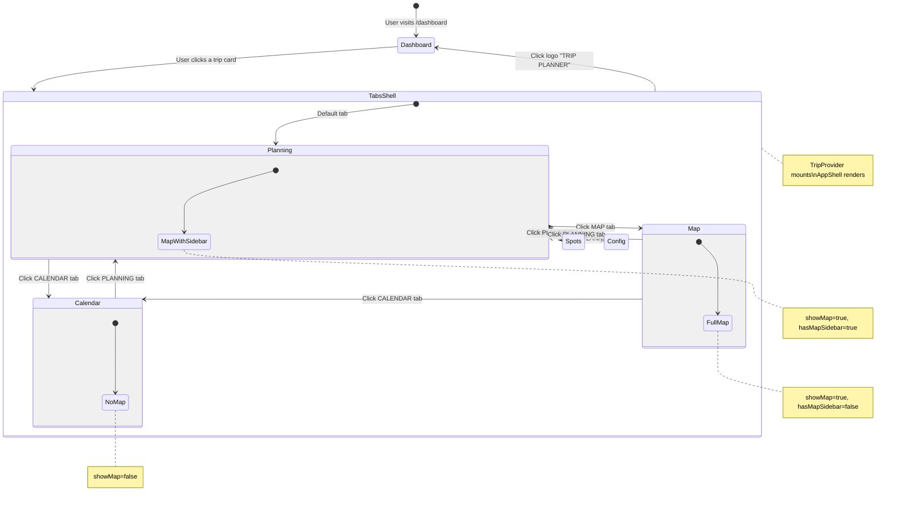
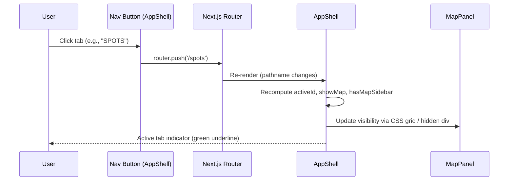
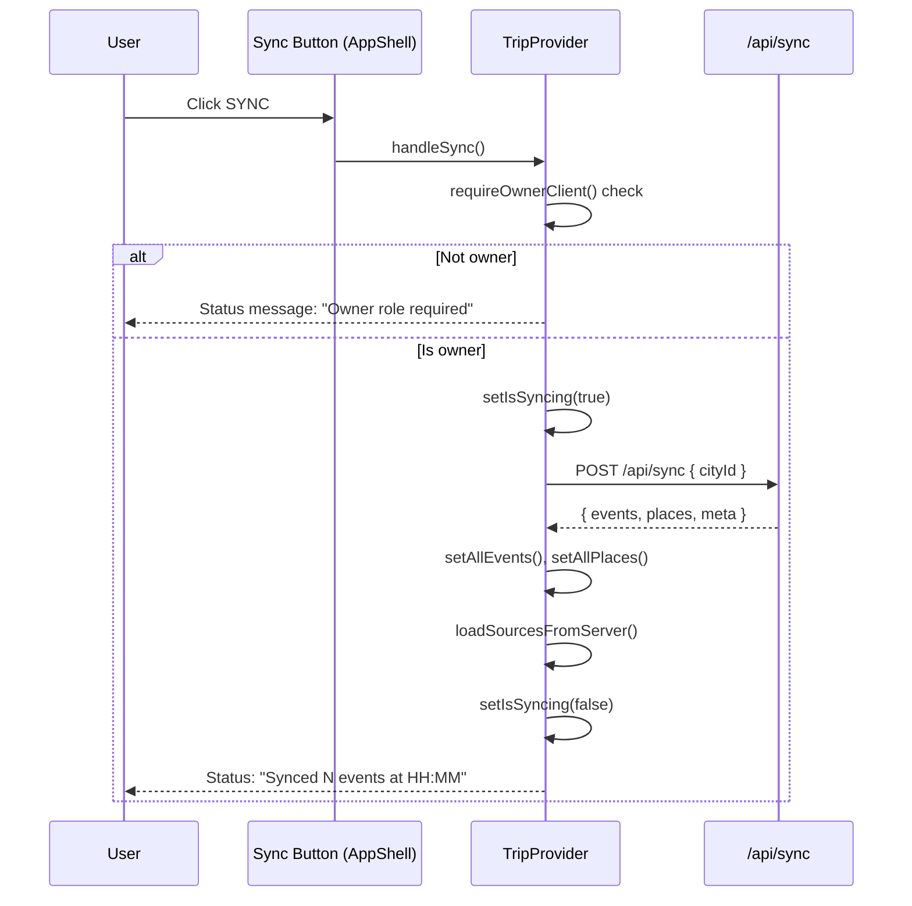
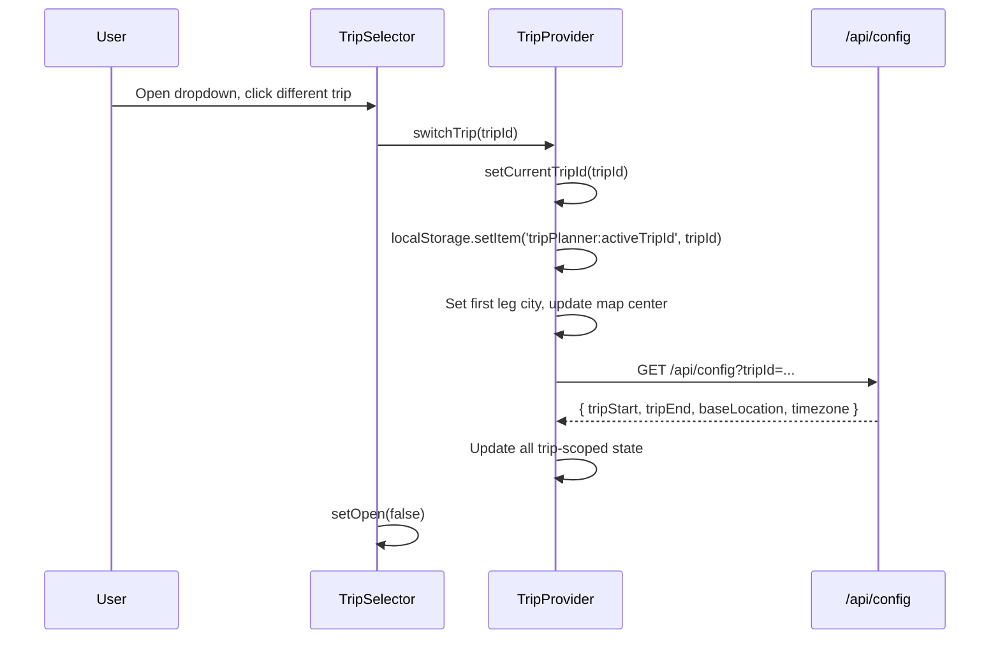

# App Shell & Navigation: Technical Architecture & Implementation

**Document Basis:** current code at time of generation.

---

## 1. Summary

The App Shell is the persistent chrome wrapping all authenticated (tab) routes. It provides:

- **Top header bar** (52 px) -- brand logo link, five-tab navigation, trip/city selector dropdown, and a global sync button.
- **Content area** -- a CSS Grid that conditionally shows a map panel alongside the active tab's content, or the content alone.
- **Status bar** (28 px) -- a slim bottom strip showing connection health and route summary.

**Shipped scope:** single-level header, five static tabs (Map, Calendar, Planning, Spots, Config), trip+city switching via dropdown, manual sync trigger, responsive breakpoints at 1200 px and 640 px.

**Out of scope:** mobile hamburger menu (actions are hidden at 640 px but no menu replaces them), notification system, breadcrumbs, user avatar in shell (avatar only appears on the Dashboard page).

---

## 2. Runtime Placement & Ownership

### Component hierarchy

```
RootLayout (app/layout.tsx)                    -- Server Component
  ConvexAuthNextjsServerProvider               -- auth session
    ConvexClientProvider                       -- Convex React client
      TabsLayout (app/trips/layout.tsx)       -- Server Component (wraps protected tabs)
        TripProvider                           -- client-side context (~85 KB)
          AppShell (components/AppShell.tsx)    -- client-side shell
            <header>                           -- top bar
              Logo link  |  NavItems  |  TripSelector  |  SyncButton
            </header>
            <grid>                             -- content area
              MapPanel                         -- always mounted, visually hidden when not needed
              {children}                       -- active tab page
            </grid>
            StatusBar                          -- bottom bar
```

### Lifecycle boundaries

| Boundary | File | Behavior |
|---|---|---|
| Auth gate | `middleware.ts:8-15` | Routes `/map`, `/calendar`, `/planning`, `/spots`, `/config` are protected. Unauthenticated users redirect to `/signin`. (Currently bypassed with `DEV_BYPASS_AUTH = true`, line 18.) |
| TripProvider mount | `app/trips/layout.tsx:6` | Created once when any tab route loads. Destroyed only when navigating outside `trips/[tripId]` group. |
| AppShell mount | `app/trips/layout.tsx:7` | Lives inside TripProvider; mounts/unmounts together. |
| Dashboard | `app/dashboard/page.tsx` | Has its **own** header bar (not AppShell). Selecting a trip navigates to `/trips/{urlId}/map`, which enters the `trips/[tripId]` layout group and mounts AppShell. |

### Route-to-layout mapping

| Route | Layout | Shell |
|---|---|---|
| `/` | RootLayout only | LandingContent (no shell) |
| `/signin` | RootLayout + signin layout | No shell |
| `/dashboard` | RootLayout only | Own header (not AppShell) |
| `/map`, `/calendar`, `/planning`, `/spots`, `/config` | RootLayout + TabsLayout | AppShell |

---

## 3. Module/File Map

| File | Responsibility | Key Exports | Dependencies | Side Effects |
|---|---|---|---|---|
| `components/AppShell.tsx` | Top bar, grid layout, map panel toggle, status bar composition | `default` (AppShell) | TripProvider (`useTrip`), MapPanel, StatusBar, TripSelector, lucide-react, next/navigation | None |
| `app/trips/layout.tsx` | Wraps tab routes with TripProvider + AppShell | `default` (TabsLayout) | TripProvider, AppShell | None |
| `components/TripSelector.tsx` | Dropdown for trip + city leg switching | `default` (TripSelector) | TripProvider (`useTrip`), lucide-react | DOM event listener (`mousedown` for click-outside) |
| `components/StatusBar.tsx` | Bottom status strip | `default` (StatusBar) | TripProvider (`useTrip`) | None |
| `components/MapPanel.tsx` | Map container + filter chips + crime overlay | `default` (MapPanel) | TripProvider (`useTrip`), lucide-react | None (map init is in TripProvider) |
| `components/providers/TripProvider.tsx` | All trip state, sync handlers, trip/city switching | `default` (TripProvider), `useTrip`, `TAG_COLORS`, `getTagIconComponent` | Convex auth, Google Maps, many lib modules | Network fetches, timers, localStorage, Google Maps API |
| `app/globals.css` | Responsive breakpoints, layout grid overrides, scrollbar styles | N/A | Tailwind CSS v4 | CSS custom properties |
| `middleware.ts` | Auth-based route protection | `default`, `config` | `@convex-dev/auth/nextjs/server` | Redirects |

---

## 4. State Model & Transitions

### Navigation state

Navigation state is derived from the URL pathname, not stored in component state. The `activeId` is computed on every render.

```
// components/AppShell.tsx:30
const activeId = NAV_ITEMS.find((n) => pathname.startsWith(n.href))?.id || 'planning';
```

Fallback: if no tab matches the current path, `'planning'` is used as the default active tab.

### Map visibility state

Two derived booleans control the layout grid:

```
// components/AppShell.tsx:21,31-32
const MAP_TABS = new Set(['map', 'planning', 'spots']);
const showMap = MAP_TABS.has(activeId);
const hasMapSidebar = activeId !== 'map' && showMap;
```

| activeId | showMap | hasMapSidebar | Layout |
|---|---|---|---|
| `map` | true | false | Full-width map, child returns null |
| `planning` | true | true | 3:5 grid (map : sidebar) |
| `spots` | true | true | 3:5 grid (map : sidebar) |
| `calendar` | false | false | Full content, map visually hidden |
| `config` | false | false | Full content, map visually hidden |

### TripSelector state

| State | Type | Source |
|---|---|---|
| `open` | `boolean` | Local `useState` in TripSelector (`components/TripSelector.tsx:13`) |
| `currentTripId` | `string` | TripProvider state (`TripProvider.tsx:289`) |
| `currentCityId` | `string` | TripProvider state (`TripProvider.tsx:290`) |
| `trips` | `any[]` | TripProvider state, loaded from `/api/trips` during bootstrap |
| `cities` | `any[]` | TripProvider state, loaded from `/api/cities` during bootstrap |

### Sync button state

| State | Type | Source |
|---|---|---|
| `isSyncing` | `boolean` | TripProvider state (`TripProvider.tsx:261`) |
| `canManageGlobal` | `boolean` | Derived: `profile?.role === 'owner'` (`TripProvider.tsx:320`) |

### State diagram



---

## 5. Interaction & Event Flow

### Tab navigation



### Sync flow



### Trip switching flow



### City leg switching flow

When the active trip has multiple legs, the user can switch between city legs:

1. User clicks a city in the TripSelector dropdown (`TripSelector.tsx:102`).
2. `switchCityLeg(cityId)` is called on TripProvider (`TripProvider.tsx:1729`).
3. TripProvider updates `currentCityId`, `currentCity`, `timezone`, re-centers the map.
4. Events and sources are reloaded for the new city via `/api/events?cityId=...`.

---

## 6. Rendering/Layers/Motion

### Layer stack (z-index)

| Layer | z-index | Element | File:Line |
|---|---|---|---|
| Top header bar | `z-30` | `<header>` | `AppShell.tsx:37` |
| TripSelector dropdown | `z-50` | Dropdown panel | `TripSelector.tsx:50` |
| Crime overlay (on map) | `z-20` | Crime live widget | `MapPanel.tsx:106` |
| Map container | (default) | `#map` | `globals.css:96` (position: absolute, inset: 0) |
| Status bar | (default, stacking order) | Bottom `<div>` | `StatusBar.tsx:9` |

### Layout dimensions

| Element | Height | Source |
|---|---|---|
| Header bar | 52 px (48 px at <= 640 px) | `AppShell.tsx:37`, `globals.css:166` |
| Status bar | 28 px | `StatusBar.tsx:14` |
| Content area | `flex-1 min-h-0` (fills remaining) | `AppShell.tsx:97` |

### Grid configurations

| Tab | Grid class | Column template |
|---|---|---|
| Map (full) | `grid-cols-1` | Single column, MapPanel fills all |
| Planning / Spots (sidebar) | `grid-cols-[minmax(0,3fr)_5fr]` | 3fr map, 5fr sidebar |
| Calendar / Config (no map) | `display: contents` | No grid; MapPanel is hidden with `position:absolute; width:0; height:0` |

### Responsive breakpoints

| Breakpoint | Behavior | Source |
|---|---|---|
| <= 1200 px | Sidebar layout stacks vertically. Map gets 50vh, sidebar below. | `globals.css:154-162` |
| <= 640 px | Header shrinks to 48 px. Nav items get smaller padding. **Right-side actions (TripSelector + Sync) are hidden** (`display: none !important`). Map gets 40vh. | `globals.css:165-178` |

### Animation

| Animation | Duration/Curve | Usage | Source |
|---|---|---|---|
| Sync icon spin | CSS `animate-spin` (Tailwind default: 1s linear infinite) | RefreshCw icon when `isSyncing` | `AppShell.tsx:92` |
| Tab color transition | `duration-200` (200ms) | Button hover/active state | `AppShell.tsx:54` |
| Status dot pulse | `statusPulse` (0->100% opacity loop) | Defined but not directly used on status dot | `globals.css:43` |

### Typography

| Element | Font | Size | Weight | Color |
|---|---|---|---|---|
| Logo "TRIP PLANNER" | Space Grotesk | 15 px | 700 (bold) | `#F5F5F5`, hover `#00E87B` |
| Tab labels | JetBrains Mono | 11 px | 600 active / 500 inactive | `#00E87B` active / `#525252` inactive |
| Sync button | JetBrains Mono | 10 px | 500 | `#525252` |
| City label (TripSelector trigger) | JetBrains Mono | 10 px | 500 (medium) | `#737373` |
| Status bar text | JetBrains Mono | 10 px | (default) | `#666` normal / `#FF4444` error |

---

## 7. API & Prop Contracts

### AppShell

```tsx
// components/AppShell.tsx:23
export default function AppShell({ children })
```

**Props:** `children: ReactNode` -- the active tab page content rendered by Next.js routing.

**Consumes from `useTrip()`:**

| Field | Type | Purpose |
|---|---|---|
| `isSyncing` | `boolean` | Disables sync button, shows spinner |
| `handleSync` | `() => Promise<void>` | Triggered on sync button click |
| `canManageGlobal` | `boolean` | Enables/disables sync button (owner-only) |

### TripSelector

```tsx
// components/TripSelector.tsx:7
export default function TripSelector()
```

**Props:** None.

**Consumes from `useTrip()`:**

| Field | Type | Purpose |
|---|---|---|
| `trips` | `any[]` | List of trips to display |
| `cities` | `any[]` | City metadata for leg display |
| `currentTripId` | `string` | Highlights active trip |
| `currentCityId` | `string` | Highlights active city leg |
| `currentCity` | `object \| null` | Display name for trigger button |
| `switchTrip` | `(tripId: string) => Promise<void>` | Switch active trip |
| `switchCityLeg` | `(cityId: string) => Promise<void>` | Switch active city leg |
| `timezone` | `string` | Formats timezone abbreviation in trigger |

### StatusBar

```tsx
// components/StatusBar.tsx:5
export default function StatusBar()
```

**Props:** None.

**Consumes from `useTrip()`:**

| Field | Type | Purpose |
|---|---|---|
| `status` | `string` | Status message text |
| `statusError` | `boolean` | Red dot + text when true |
| `routeSummary` | `string` | Route info displayed on the right |

### NAV_ITEMS constant

```tsx
// components/AppShell.tsx:13-19
const NAV_ITEMS = [
  { id: 'map',      href: '/map',      icon: MapPin,     label: 'MAP' },
  { id: 'calendar', href: '/calendar',  icon: Calendar,   label: 'CALENDAR' },
  { id: 'planning', href: '/planning',  icon: Navigation, label: 'PLANNING' },
  { id: 'spots',    href: '/spots',     icon: Compass,    label: 'SPOTS' },
  { id: 'config',   href: '/config',    icon: Settings,   label: 'CONFIG' }
];
```

### MAP_TABS constant

```tsx
// components/AppShell.tsx:21
const MAP_TABS = new Set(['map', 'planning', 'spots']);
```

---

## 8. Reliability Invariants

These are deterministic truths that must remain true after refactors:

1. **AppShell is only rendered inside `trips/[tripId]` layout.** It depends on TripProvider context -- rendering it outside will throw `"useTrip must be used inside TripProvider"` (`TripProvider.tsx:219`).

2. **MapPanel is always mounted** when AppShell is mounted. When `showMap` is false, it is hidden via `position: absolute; width: 0; height: 0; overflow: hidden; pointer-events: none` (`AppShell.tsx:98`), not unmounted. This preserves Google Maps state across tab switches.

3. **Active tab is derived from pathname**, not stored state. The `pathname.startsWith(n.href)` check (`AppShell.tsx:30`) means tab identity is always in sync with the URL.

4. **Default fallback tab is `'planning'`** when no route matches (`AppShell.tsx:30`).

5. **Sync requires owner role.** The sync button is disabled when `!canSync` (which equals `!canManageGlobal`), and `handleSync` calls `requireOwnerClient()` as a server-side guard (`TripProvider.tsx:1475`).

6. **Trip ID resolution priority:** URL param `?trip=` > `localStorage('tripPlanner:activeTripId')` > first trip in list (`TripProvider.tsx:1302-1304`). This is verified by `lib/trip-provider-bootstrap.test.mjs`.

7. **TripSelector dropdown closes on outside click** via a `mousedown` event listener on `document` (`TripSelector.tsx:17-21`).

8. **City legs section only appears when `activeTrip.legs.length > 1`** (`TripSelector.tsx:86`).

---

## 9. Edge Cases & Pitfalls

### Mobile breakpoint hides critical controls

At viewport widths <= 640 px, the right-side actions area (TripSelector + Sync button) is completely hidden via `display: none !important` (`globals.css:169`). There is no hamburger menu or alternative mobile UI. Users on small screens cannot switch trips/cities or trigger sync.

### No loading/skeleton state in AppShell

AppShell itself has no loading state. During TripProvider initialization (`isInitializing === true`), the shell renders fully but child components like DayList show skeleton placeholders. The header bar is immediately interactive, but `trips` and `cities` arrays are empty, making TripSelector show "No city" and an empty dropdown.

### MapPanel never unmounts

Because MapPanel is hidden via CSS rather than conditional rendering (`AppShell.tsx:98`), the Google Maps instance persists across all tab navigations. This is intentional (avoids re-initializing the map) but means the map continues consuming memory and potentially running timers (crime refresh, idle listeners) even on Calendar and Config tabs.

### Sync button disabled for non-owners

The sync button is disabled when `canManageGlobal` is false (`AppShell.tsx:81`). The visual feedback is `opacity: 0.4` and `cursor: not-allowed`. There is no tooltip or message explaining why -- the user must check the Config page's `[OWNER]` / `[MEMBER]` badge to understand.

### Click-outside handler uses mousedown

TripSelector's click-outside detection uses `mousedown` (`TripSelector.tsx:17`), not `click`. This means the dropdown closes before the `click` event fires, which could interfere with interactions on elements revealed by the dropdown closing.

### Tab navigation uses `router.push` not `<Link>`

Tab buttons use `onClick={() => router.push(href)}` (`AppShell.tsx:62`) instead of Next.js `<Link>` components. This means tab navigation does not benefit from Next.js prefetching on hover. The logo link to `/dashboard` does use `<Link>` (`AppShell.tsx:39-46`).

### Auth bypass flag

`middleware.ts:18` has `DEV_BYPASS_AUTH = true`, which skips all authentication checks. This must be set to `false` before production deployment.

---

## 10. Testing & Verification

### Existing test coverage

| Test file | What it covers | Relevance to AppShell |
|---|---|---|
| `lib/trip-provider-bootstrap.test.mjs` | Trip ID resolution priority (URL > localStorage > first trip) | Verifies TripSelector's data source for `currentTripId` |
| `lib/trip-provider-storage.test.mjs` | Ensures no `window.localStorage` usage for planner/pair data (only `localStorage`) | Guards against accidental storage in TripProvider |
| `lib/layout-security.test.mjs` | Verifies Buy Me a Coffee widget is env-gated in layout | Covers root layout script security |

**No direct unit/integration tests exist for AppShell, TripSelector, or StatusBar components.** All existing tests are source-code-scanning tests (reading file contents), not render tests.

### Manual verification scenarios

1. **Tab switching:** Navigate to each of the five tabs. Verify the green underline moves. Verify map shows/hides correctly per the MAP_TABS table.

2. **Trip switching:** Open TripSelector, switch to a different trip. Verify the map re-centers, events reload, and the city label in the trigger updates.

3. **City leg switching:** For a multi-leg trip, switch city legs in TripSelector. Verify timezone abbreviation updates in the trigger.

4. **Sync:** Click SYNC as an owner. Verify the spinner appears, status bar updates with sync result. Click SYNC as a non-owner -- verify button is disabled.

5. **Responsive:** Resize browser below 640 px. Verify the right-side actions disappear. Resize below 1200 px with a sidebar tab active -- verify vertical stacking.

6. **Logo click:** Click "TRIP PLANNER" text. Verify navigation to `/dashboard`.

---

## 11. Quick Change Playbook

| Change | Edit location |
|---|---|
| Add a new tab | Add entry to `NAV_ITEMS` array in `components/AppShell.tsx:13-19`. Create corresponding page at `app/trips/[tripId]/<slug>/page.tsx`. If it should show the map, add its `id` to `MAP_TABS` set at line 21. |
| Change header height | Update `h-[52px] min-h-[52px]` in `components/AppShell.tsx:37`. Also update `globals.css:166` for the mobile override (`height: 48px; min-height: 48px`). |
| Change map-to-sidebar ratio | Update `grid-cols-[minmax(0,3fr)_5fr]` in `components/AppShell.tsx:97`. |
| Change brand name | Update `"TRIP PLANNER"` text in `components/AppShell.tsx:45`. Also update `app/dashboard/page.tsx:133` for the dashboard header, and `app/layout.tsx:29` for metadata. |
| Change accent color | Update `#00E87B` usages in AppShell.tsx (lines 41, 60, 67) and TripSelector.tsx (lines 42, 74, 111). The CSS custom property `--color-accent: #00FF88` in `globals.css:13` is a slightly different shade -- these are not unified. |
| Make sync available to non-owners | Remove `disabled={!canSync}` from `AppShell.tsx:81` and remove the `requireOwnerClient()` guard in `TripProvider.tsx:1475`. |
| Restore mobile actions | Remove or modify `.topbar-actions-responsive { display: none !important; }` in `globals.css:169`. |
| Add mobile hamburger menu | Add a new component rendered conditionally when viewport is narrow. Wire it into the `topbar-actions-responsive` region in `AppShell.tsx:74`. |
| Change responsive breakpoints | Edit `@media` blocks in `globals.css:154` (1200 px) and `globals.css:165` (640 px). |
| Change tab icon | Replace the icon import and reference in `NAV_ITEMS` at `AppShell.tsx:14-18`. Icons come from `lucide-react`. |
| Persist active tab in URL | Replace `router.push(href)` with `<Link href={href}>` in `AppShell.tsx:62`. This also enables prefetching. |

---

## Appendix: Color Constants Reference

| Constant | Value | Usage |
|---|---|---|
| Header background | `#080808` | `AppShell.tsx:37` |
| Logo text | `#F5F5F5` | `AppShell.tsx:41` |
| Logo hover | `#00E87B` | `AppShell.tsx:41` |
| Active tab color | `#00E87B` | `AppShell.tsx:60` |
| Inactive tab color | `#525252` | `AppShell.tsx:60` |
| Active tab underline | `#00E87B` | `AppShell.tsx:67` |
| Grid icon color | `#525252` | `AppShell.tsx:44` |
| Sync button background | `#111111` | `AppShell.tsx:85` |
| Sync button border | `#262626` | `AppShell.tsx:86` |
| Status bar background | `#080808` | `StatusBar.tsx:13` |
| Status dot (healthy) | `#00E87B` | `StatusBar.tsx:28` |
| Status dot (error) | `#FF4444` | `StatusBar.tsx:27` |
| TripSelector accent | `#00E87B` | `TripSelector.tsx:42, 74` |
| TripSelector dropdown bg | `#111111` | `TripSelector.tsx:51` |
