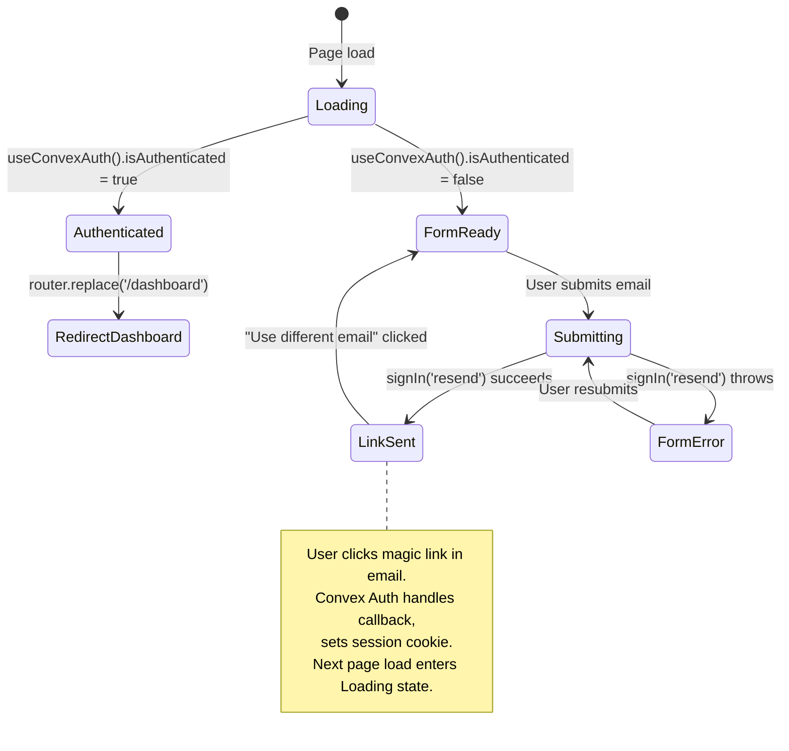
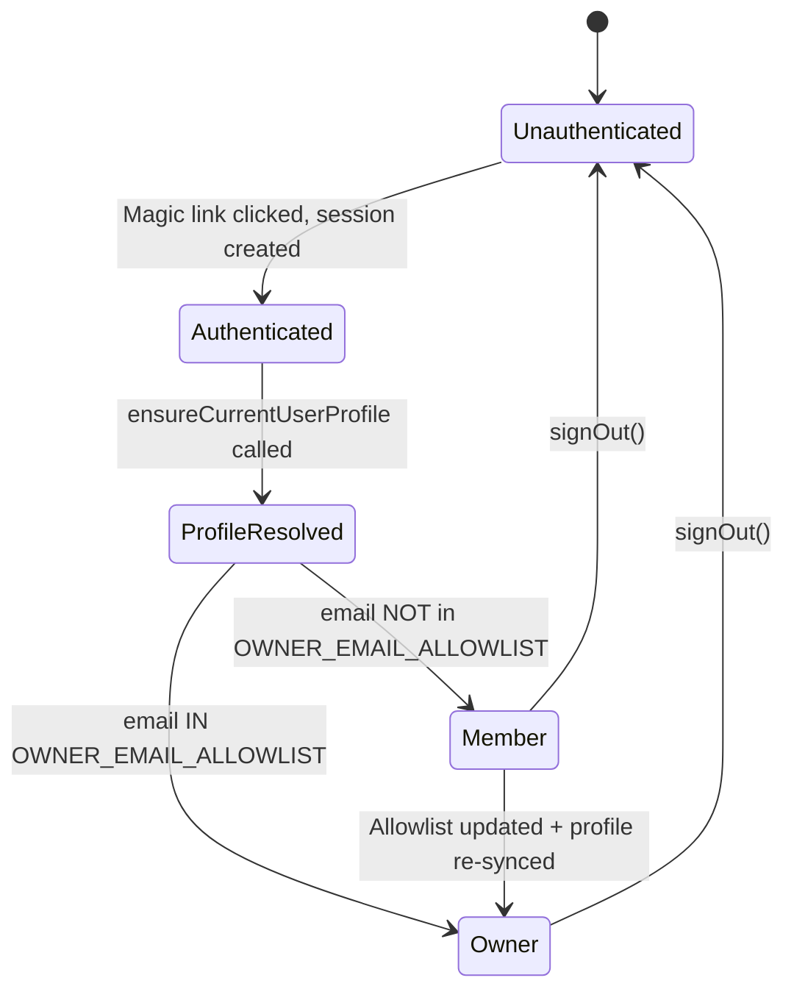
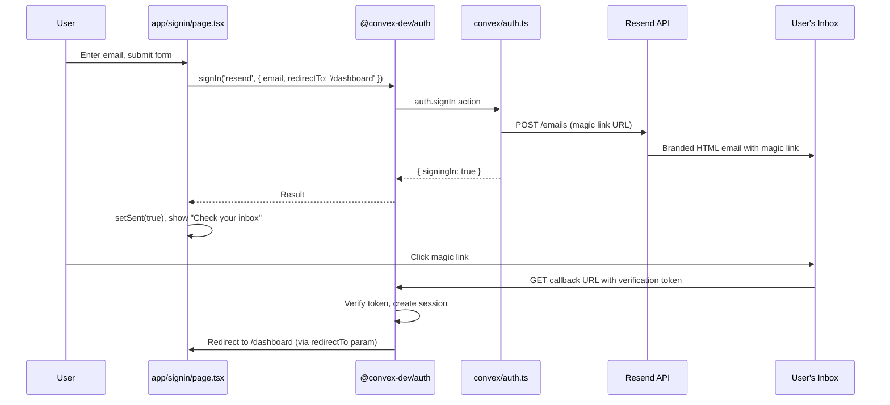
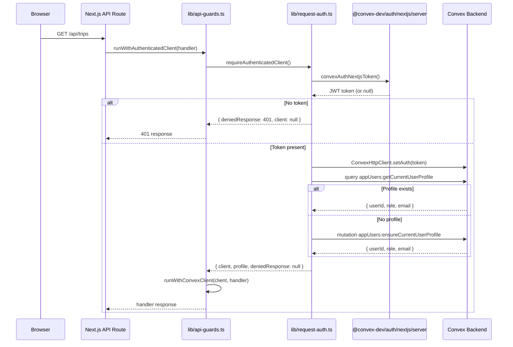

# Authentication Flow: Technical Architecture & Implementation

Document Basis: current code at time of generation.

**Last Updated:** 2026-03-16

---

## 1. Summary

The authentication flow implements passwordless magic-link sign-in using Resend as the email transactional provider, backed by Convex Auth (`@convex-dev/auth`). Users enter their email, receive a branded HTML magic link, and clicking it authenticates them against the Convex backend. The system enforces two authorization tiers -- `owner` and `member` -- with owner status determined by an environment-variable allowlist.

**Current shipped scope:**
- Passwordless magic-link sign-in via Resend API
- Branded HTML email template with inline fallback
- Resend template ID support (optional override)
- Next.js middleware route protection with redirect logic
- Convex-side authorization guards (`requireAuthenticatedUserId`, `requireOwnerUserId`)
- Next.js API route authorization guards (`requireAuthenticatedClient`, `requireOwnerClient`)
- Higher-order API guard wrappers (`runWithAuthenticatedClient`, `runWithOwnerClient`)
- User profile auto-provisioning on first sign-in (`appUsers:ensureCurrentUserProfile`)
- Owner role assignment from `OWNER_EMAIL_ALLOWLIST` env var
- Dev bypass mode (hardcoded `DEV_BYPASS_AUTH = true` across three files)
- Client-side sign-out with redirect to `/signin`

**Out of scope / not implemented:**
- OAuth / social login providers
- Multi-factor authentication
- Session revocation UI
- Rate limiting on magic-link requests
- Email change / account deletion flows

---

## 2. Runtime Placement & Ownership

### Provider Hierarchy

The auth provider stack is mounted in `app/layout.tsx:59-61` and wraps the entire application:

```
<html>
  <body>
    <ConvexAuthNextjsServerProvider>        <!-- Server-side auth token management -->
      <ConvexClientProvider>                 <!-- Client-side Convex + auth context -->
        {children}
      </ConvexClientProvider>
    </ConvexAuthNextjsServerProvider>
  </body>
</html>
```

- `ConvexAuthNextjsServerProvider` (`@convex-dev/auth/nextjs/server`) -- manages server-side auth token cookie handling. Mounted in `app/layout.tsx:59`.
- `ConvexAuthNextjsProvider` (`@convex-dev/auth/nextjs`) -- wraps the Convex React client with auth context. Mounted in `components/providers/ConvexClientProvider.tsx:12`.
- `TripProvider` -- consumes `useConvexAuth()` and `useAuthActions()` for auth state and sign-out. Mounted in `app/trips/layout.tsx:6`, scoped to protected tab routes only.

### Lifecycle Boundaries

| Boundary | Scope | File |
|---|---|---|
| Middleware route guard | All non-static routes | `middleware.ts` |
| Server-side auth token | Root layout, all routes | `app/layout.tsx:59` |
| Client-side auth context | All client components | `components/providers/ConvexClientProvider.tsx:12` |
| TripProvider auth consumption | `/trips/[tripId]/*` routes only | `app/trips/layout.tsx:6` |
| Sign-in page | `/signin` route | `app/signin/page.tsx` |
| Dashboard | `/dashboard` route | `app/dashboard/page.tsx` |

---

## 3. Module/File Map

| File | Responsibility | Key Exports | Dependencies | Side Effects |
|---|---|---|---|---|
| `convex/auth.ts` | Configures Convex Auth with Resend email provider | `auth`, `signIn`, `signOut`, `store`, `isAuthenticated` | `@convex-dev/auth`, Resend API | Sends email via Resend HTTP API |
| `convex/auth.config.ts` | Auth provider domain config for JWT validation | Default export config object | `CONVEX_SITE_URL` env var | None |
| `convex/authz.ts` | Server-side authorization guards for Convex functions | `requireAuthenticatedUserId`, `requireOwnerUserId` | `@convex-dev/auth/server`, `userProfiles` table | Throws on unauthorized access |
| `convex/appUsers.ts` | User profile CRUD, auto-provisioning, role resolution | `ensureCurrentUserProfile`, `getCurrentUserProfile` | `convex/ownerRole.ts`, `userProfiles` table | Inserts/patches `userProfiles` records |
| `convex/ownerRole.ts` | Owner email allowlist parsing and role resolution | `parseOwnerEmailAllowlist`, `resolveInitialUserRole` | None (pure functions) | None |
| `middleware.ts` | Next.js edge middleware for route protection | Default middleware export, `config` | `@convex-dev/auth/nextjs/server` | Redirects unauthenticated users |
| `lib/request-auth.ts` | API route auth helpers (server-side, Node.js) | `requireAuthenticatedClient`, `requireOwnerClient` | `@convex-dev/auth/nextjs/server`, `convex/browser` | Creates ConvexHttpClient, fetches profile |
| `lib/api-guards.ts` | Higher-order wrappers for API route handlers | `runWithAuthenticatedClient`, `runWithOwnerClient` | `lib/request-auth.ts`, `lib/convex-client-context.ts` | Runs handler within AsyncLocalStorage context |
| `lib/convex-client-context.ts` | AsyncLocalStorage for scoped Convex client access | `runWithConvexClient`, `getScopedConvexClient` | `node:async_hooks` | None |
| `components/providers/ConvexClientProvider.tsx` | Client-side Convex + auth provider wrapper | `ConvexClientProvider` | `@convex-dev/auth/nextjs`, `convex/react` | Initializes `ConvexReactClient` singleton |
| `app/signin/page.tsx` | Sign-in UI with email form and success state | `SignInPage` | `@convex-dev/auth/react`, `convex/react` | Calls `signIn('resend', ...)` |
| `app/signin/layout.tsx` | Sign-in route metadata (noindex) | `SignInLayout`, `metadata` | None | None |
| `app/api/me/route.ts` | API endpoint returning current user profile | `GET` handler | `lib/request-auth.ts` | None |
| `components/providers/TripProvider.tsx` | Consumes auth state, exposes `handleSignOut` | `TripProvider`, `useTripContext` | `@convex-dev/auth/react`, `convex/react` | Sign-out redirects to `/signin` |

---

## 4. State Model & Transitions

### Sign-In Page State

The sign-in page (`app/signin/page.tsx`) manages a simple local state machine:

| State Variable | Type | Purpose |
|---|---|---|
| `email` | `string` | User-entered email |
| `isSubmitting` | `boolean` | Form submission in progress |
| `notice` | `string` | User-facing message text |
| `noticeError` | `boolean` | Whether notice is an error |
| `sent` | `boolean` | Whether magic link was sent successfully |

### Auth State (Global)

Auth state is provided by `useConvexAuth()` from `convex/react`:

| Property | Type | Source |
|---|---|---|
| `isLoading` | `boolean` | Convex auth initialization |
| `isAuthenticated` | `boolean` | Valid session exists |

### User Profile State (TripProvider)

| Property | Type | Source |
|---|---|---|
| `profile` | `{ userId, role, email } \| null` | Fetched from `/api/me` at bootstrap (`TripProvider.tsx:1286-1294`) |
| `authUserId` | `string` | Extracted from profile |
| `canManageGlobal` | `boolean` | Derived: `profile?.role === 'owner'` (`TripProvider.tsx:320`) |
| `isSigningOut` | `boolean` | Sign-out in progress |

### State Diagram



### Authorization Tier Transitions



---

## 5. Interaction & Event Flow

### Magic Link Sign-In Sequence



### API Route Auth Guard Sequence



### Bootstrap Profile Loading

When a user navigates to any `/trips/[tripId]/*` route, `TripProvider` bootstraps auth state at `TripProvider.tsx:1282-1294`:

1. Fetches `/api/me` to get `{ authenticated, profile }`.
2. Sets `profile` and `authUserId` in state.
3. Derives `canManageGlobal = profile?.role === 'owner'` (`TripProvider.tsx:320`).
4. If role is `owner`, triggers background sync (`TripProvider.tsx:1337-1339`).

---

## 6. Rendering/Layers/Motion

### Sign-In Page Visual Structure

The sign-in page (`app/signin/page.tsx`) is a full-viewport centered card with:

| Layer | Element | Style |
|---|---|---|
| Background | Grid pattern overlay | `opacity: 0.15`, 48px grid lines (`page.tsx:76-80`) |
| Background | Green radial glow | `rgba(0,255,136,0.06)` at top (`page.tsx:85-87`) |
| Card | Auth form / success state | `#0A0A0A` bg, `1px solid #2f2f2f` border (`page.tsx:139-141`) |
| Loading | Spinner | `Loader2` with `animate-spin`, `#00FF88` color (`page.tsx:61`) |

**Animation:** Card entrance uses CSS `fadeSlideUp` animation, 0.5s ease-out (`page.tsx:93`).

**Two visual states (toggled by `sent` boolean):**
1. **Form state** -- email input + submit button (`page.tsx:228-358`)
2. **Success state** -- checkmark icon + "Check your inbox" message + "Use different email" button (`page.tsx:146-225`)

### Branded Magic Link Email

The email template is defined inline at `convex/auth.ts:7-73`. Key visual specs:
- Background: `#0C0C0C`
- Card: `#0A0A0A` with `1px solid #2f2f2f` border
- CTA button: `#00FF88` background, `#0C0C0C` text
- Font: `'Courier New', Courier, monospace`
- Max width: 440px
- Link expiry text: "This link expires in 1 hour"

---

## 7. API & Prop Contracts

### Convex Auth Exports (`convex/auth.ts:120-122`)

```typescript
export const { auth, signIn, signOut, store, isAuthenticated } = convexAuth({
  providers: [resendProvider]
});
```

### Resend Provider Configuration (`convex/auth.ts:75-118`)

| Setting | Value | Source |
|---|---|---|
| Provider ID | `'resend'` | `convex/auth.ts:76` |
| API Key | `process.env.AUTH_RESEND_KEY` | `convex/auth.ts:77` |
| Link TTL | 3600 seconds (1 hour) | `convex/auth.ts:78` |
| `authorize` | `undefined` | Magic-link mode, no re-entry required (`convex/auth.ts:79`) |
| Sender address | `process.env.AUTH_EMAIL_FROM` or `'Trip Planner <onboarding@resend.dev>'` | `convex/auth.ts:83` |
| Template mode | If `AUTH_RESEND_TEMPLATE_ID` set, uses Resend template; otherwise inline HTML | `convex/auth.ts:87-103` |

### Client-Side Sign-In Call (`app/signin/page.tsx:39-42`)

```typescript
const result = await signIn('resend', {
  email: normalizedEmail,
  redirectTo: '/dashboard'
});
```

### Authorization Guards -- Convex Side (`convex/authz.ts`)

```typescript
// Returns userId string or throws "Authentication required."
async function requireAuthenticatedUserId(
  ctx: MutationCtx | QueryCtx,
  deps?: { getUserId?: (ctx) => Promise<unknown> }
): Promise<string>

// Returns userId string or throws "Owner role required."
async function requireOwnerUserId(
  ctx: MutationCtx | QueryCtx,
  deps?: { getUserId?: (ctx) => Promise<unknown> }
): Promise<string>
```

### Authorization Guards -- API Route Side (`lib/request-auth.ts`)

```typescript
type AuthResult = {
  client: ConvexHttpClient | null;
  deniedResponse: Response | null;
  profile: { userId: string; role: string; email: string } | null;
};

async function requireAuthenticatedClient(): Promise<AuthResult>
// Returns 401 if no token, 503 if no CONVEX_URL

async function requireOwnerClient(): Promise<AuthResult>
// Returns 401 if no token, 403 if role !== 'owner'
```

### User Profile Contract (`convex/appUsers.ts:20-24`)

```typescript
// Schema for profile responses
{
  userId: string;     // Convex auth user ID
  role: 'owner' | 'member';
  email: string;      // Normalized lowercase
}
```

### `/api/me` Endpoint (`app/api/me/route.ts`)

**GET** -- Returns `{ authenticated: true, profile: { userId, role, email } }` or 401.

### Middleware Route Matchers (`middleware.ts:7-15`)

| Matcher | Routes |
|---|---|
| `isSignInRoute` | `/signin` |
| `isProtectedRoute` | `/dashboard(.*)`, `/map(.*)`, `/calendar(.*)`, `/planning(.*)`, `/spots(.*)`, `/config(.*)` |

### Middleware Matcher Config (`middleware.ts:41-43`)

```typescript
export const config = {
  matcher: ['/((?!_next|.*\\..*).*)', '/(api|trpc)(.*)']
};
```

This runs middleware on all routes except Next.js internals and static files.

---

## 8. Reliability Invariants

These truths must hold after any refactor:

1. **Three-file dev bypass symmetry**: `DEV_BYPASS_AUTH` is defined independently in `middleware.ts:18`, `convex/authz.ts:5`, and `lib/request-auth.ts:5`. All three must be toggled together for consistent behavior. If any one is `true` while others are `false`, auth will be partially enforced.

2. **Profile auto-provisioning**: `requireAuthenticatedClient()` calls `getCurrentUserProfile` first, then falls back to `ensureCurrentUserProfile` mutation (`lib/request-auth.ts:81-82`). This ensures first-time users get a profile record created automatically.

3. **Owner role is allowlist-driven**: The only path to `owner` role assignment is through the `OWNER_EMAIL_ALLOWLIST` environment variable, parsed by `parseOwnerEmailAllowlist()` in `convex/ownerRole.ts:5-13`. There is no admin UI for role management.

4. **Token-gated API routes**: Every API route under `/api/*` (except publicly-accessible ones) must call `requireAuthenticatedClient()` or `requireOwnerClient()` before performing any data operations.

5. **Middleware redirect contract**: Authenticated users visiting `/signin` get redirected to `/dashboard`. Unauthenticated users visiting any protected route get redirected to `/signin`.

6. **Magic link expiry**: Links expire after exactly 3600 seconds (1 hour), configured at `convex/auth.ts:78`.

7. **Email normalization**: Emails are trimmed and lowercased at every entry point: sign-in form (`page.tsx:27`), profile resolution (`appUsers.ts:38`), and allowlist parsing (`ownerRole.ts:2`).

8. **Sign-out clears client state**: `handleSignOut` in `TripProvider.tsx:551-564` calls `signOut()` then does `window.location.assign('/signin')`, performing a full page reload to clear all in-memory state.

---

## 9. Edge Cases & Pitfalls

### Dev Bypass Mode

The `DEV_BYPASS_AUTH = true` flag is currently hardcoded to `true` in three independent locations. This means:
- All middleware redirects are bypassed; visiting `/signin` immediately redirects to `/dashboard` (`middleware.ts:24-25`).
- All Convex function auth checks return `'dev-bypass'` as the userId (`convex/authz.ts:17`).
- All API route auth checks return a synthetic profile `{ email: 'pinchen147@gmail.com', role: 'owner', userId: 'dev-bypass' }` (`lib/request-auth.ts:52`).
- **Pitfall**: Forgetting to set all three to `false` before production deployment will leave the entire app unprotected.

### Profile Query-Then-Mutate Race

In `lib/request-auth.ts:80-82`, the pattern `query || mutation` is not atomic:

```typescript
const profile =
  await client.query('appUsers:getCurrentUserProfile' as any, {}) ||
  await client.mutation('appUsers:ensureCurrentUserProfile' as any, {});
```

If two concurrent requests arrive for a first-time user, both may find `null` from the query and both call the mutation. The mutation in `appUsers.ts:63-66` uses a query-then-insert pattern that could theoretically create duplicate profiles, though Convex's serializable transactions mitigate this.

### Sign-In Page Redirect Loop Prevention

The sign-in page has a `useEffect` that redirects authenticated users to `/dashboard` (`page.tsx:19-23`). The middleware also redirects authenticated users on `/signin` to `/dashboard` (`middleware.ts:32-34`). These are redundant safeguards -- the middleware catches it at the edge, and the client-side effect handles cases where auth state changes after page load.

### Missing `CONVEX_URL` Handling

Both `createConvexClient()` in `lib/request-auth.ts:13-18` and `ConvexClientProvider.tsx:7` read `CONVEX_URL` / `NEXT_PUBLIC_CONVEX_URL`. If missing:
- API routes return `503 Service Unavailable` (`request-auth.ts:45-46`).
- Client-side creates a `ConvexReactClient` with empty string, which will fail silently on operations.

### No Sign-Out from Dashboard

The dashboard page (`app/dashboard/page.tsx`) does not expose a sign-out button. Sign-out is only available from within the `/trips/[tripId]/*` routes where `TripProvider` provides `handleSignOut`. The dashboard renders an `<Avatar>` component (`page.tsx:151`) but does not wire it to any sign-out action.

---

## 10. Testing & Verification

### Existing Test Coverage

| Test File | What It Tests | Runner |
|---|---|---|
| `convex/authz.test.mjs` | `requireAuthenticatedUserId` throws on null userId; `requireOwnerUserId` rejects members, accepts owners | `node:test` |
| `convex/owner-role.test.mjs` | `parseOwnerEmailAllowlist` parsing; `resolveInitialUserRole` assigns member by default, owner by allowlist | `node:test` |
| `lib/api-guards.test.mjs` | `runWithAuthenticatedClient` short-circuits on denied response, runs handler on success; `runWithOwnerClient` enforces owner guard | `node:test` |

### Manual Verification Scenarios

1. **Magic link delivery**: Set `DEV_BYPASS_AUTH = false` in all three files. Navigate to `/signin`, submit email. Verify email arrives with branded template within 60 seconds.

2. **Link expiry**: Wait > 1 hour after receiving magic link. Click it. Verify redirect to `/signin` with error state (expired token).

3. **Middleware redirect -- unauthenticated**: Clear cookies. Navigate to `/planning`. Verify redirect to `/signin`.

4. **Middleware redirect -- authenticated**: Sign in. Navigate to `/signin`. Verify redirect to `/dashboard`.

5. **Owner vs member role**: Sign in with an email NOT in `OWNER_EMAIL_ALLOWLIST`. Attempt to access `/api/sources` (owner-only). Verify 403 response.

6. **Profile auto-creation**: Sign in with a new email (never seen before). Call `GET /api/me`. Verify profile is returned with correct role.

### Test Command

```bash
node --test convex/authz.test.mjs convex/owner-role.test.mjs lib/api-guards.test.mjs
```

---

## 11. Quick Change Playbook

| If you want to... | Edit this... |
|---|---|
| **Disable dev bypass for production** | Set `DEV_BYPASS_AUTH = false` in all three files: `middleware.ts:18`, `convex/authz.ts:5`, `lib/request-auth.ts:5` |
| **Change magic link expiry time** | `convex/auth.ts:78` -- change `maxAge` value (seconds) |
| **Change sender email address** | Set `AUTH_EMAIL_FROM` env var in Convex dashboard, or edit fallback at `convex/auth.ts:83` |
| **Use a Resend template instead of inline HTML** | Set `AUTH_RESEND_TEMPLATE_ID` env var in Convex dashboard; template receives variables `APP_NAME`, `HOST`, `SIGN_IN_URL`, `YEAR` (`convex/auth.ts:93-97`) |
| **Modify the magic link email design** | Edit `brandedEmailHtml()` function at `convex/auth.ts:7-73` |
| **Add a new protected route** | Add the route pattern to the `isProtectedRoute` matcher array in `middleware.ts:8-15` |
| **Grant owner role to a new email** | Add the email to the `OWNER_EMAIL_ALLOWLIST` env var (comma-separated) in the Convex dashboard |
| **Change post-login redirect destination** | Edit `redirectTo` in `app/signin/page.tsx:41` and middleware redirect at `middleware.ts:25,33` |
| **Add a new auth provider (e.g., Google OAuth)** | Add provider to the `providers` array in `convexAuth()` call at `convex/auth.ts:120-122`; update `auth.config.ts` with provider domain |
| **Change the sign-in page UI** | Edit `app/signin/page.tsx` -- form state starts at line 228, success state at line 146 |
| **Require owner role for a new Convex function** | Call `await requireOwnerUserId(ctx)` at the start of the handler; import from `convex/authz.ts` |
| **Require owner role for a new API route** | Use `runWithOwnerClient(handler)` from `lib/api-guards.ts`, or call `requireOwnerClient()` from `lib/request-auth.ts` |
| **Change sign-out behavior** | Edit `handleSignOut` in `TripProvider.tsx:551-564` |
| **Add fields to user profile** | Update `userProfiles` table schema in `convex/schema.ts:111-119`; update `ensureCurrentUserProfile` in `convex/appUsers.ts:53-107`; update `userProfileResponseValidator` at `convex/appUsers.ts:20-24` |

---

## Appendix: Environment Variables

| Variable | Where Used | Required | Default |
|---|---|---|---|
| `AUTH_RESEND_KEY` | `convex/auth.ts:77` | Yes (for production) | None |
| `AUTH_EMAIL_FROM` | `convex/auth.ts:4,83` | No | `'Trip Planner <onboarding@resend.dev>'` |
| `AUTH_RESEND_TEMPLATE_ID` | `convex/auth.ts:5,87` | No | Empty (uses inline HTML) |
| `OWNER_EMAIL_ALLOWLIST` | `convex/appUsers.ts:61` | No | Empty (all users become `member`) |
| `CONVEX_SITE_URL` | `convex/auth.config.ts:4` | Yes | None |
| `CONVEX_URL` / `NEXT_PUBLIC_CONVEX_URL` | `lib/request-auth.ts:10-11`, `components/providers/ConvexClientProvider.tsx:7` | Yes | Empty string |

## Appendix: Files Using Auth Guards

### Convex Functions Using `requireAuthenticatedUserId`

- `convex/trips.ts` -- `listMyTrips`, `getTrip`, `createTrip`, `updateTrip`, `deleteTrip`
- `convex/events.ts` -- read queries
- `convex/spots.ts` -- read queries
- `convex/routeCache.ts` -- read/write cache
- `convex/sources.ts` -- read queries
- `convex/tripConfig.ts` -- read query
- `convex/cities.ts` -- read queries

### Convex Functions Using `requireOwnerUserId`

- `convex/cities.ts` -- `createCity`, `deleteCity`
- `convex/sources.ts` -- `createSource`, `deleteSource`, `syncSource`
- `convex/events.ts` -- bulk import
- `convex/spots.ts` -- bulk import
- `convex/tripConfig.ts` -- `saveTripConfig`
- `convex/seed.ts` -- `seedCity`

### API Routes Using `requireAuthenticatedClient`

- `app/api/planner/route.ts` -- GET, POST
- `app/api/cities/route.ts` -- GET
- `app/api/me/route.ts` -- GET
- `app/api/trips/route.ts` -- GET, POST
- `app/api/trips/[tripId]/route.ts` -- GET, PUT, DELETE
- `app/api/pair/route.ts` -- GET, POST

### API Routes Using `requireOwnerClient`

- `app/api/cities/route.ts` -- POST
- `app/api/sources/route.ts` -- GET, POST (via `runWithOwnerClient`)
- `app/api/config/route.ts` -- POST (via `runWithOwnerClient`)
- `app/api/sync/route.ts` -- POST (via `runWithOwnerClient`)
