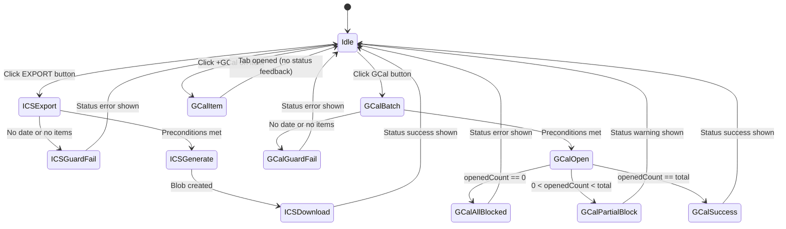
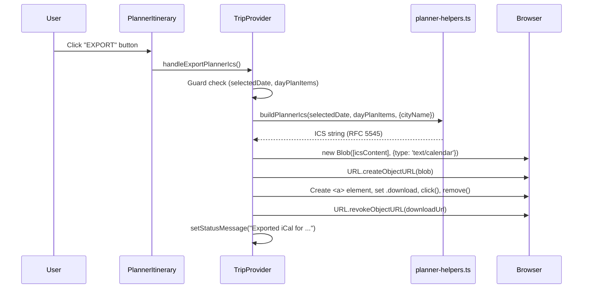
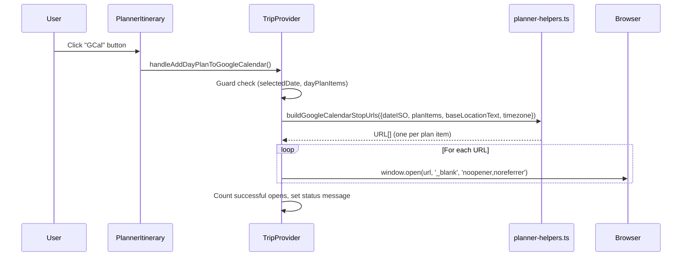
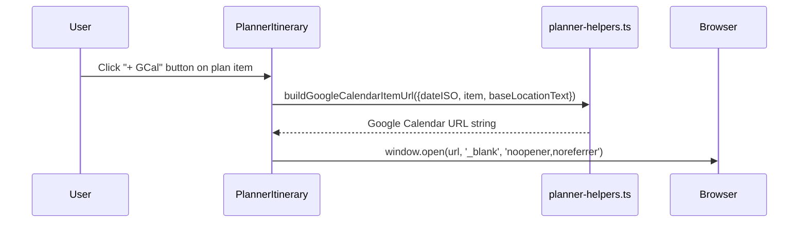

# Calendar Export: Technical Architecture & Implementation

Document Basis: current code at time of generation.

**Last Updated:** 2026-03-16

---

## 1. Summary

The Calendar Export feature allows users to export their day planner itinerary to external calendar applications through three mechanisms:

1. **ICS file download** -- generates a standards-compliant `.ics` file containing all plan items for the selected day, triggering a browser download.
2. **Bulk Google Calendar sync** -- opens one Google Calendar "create event" draft tab per plan item, allowing the user to confirm each event individually.
3. **Per-item Google Calendar link** -- each plan item card has a `+ GCal` button that opens a single Google Calendar draft for that specific item.

**In scope**: ICS generation, Google Calendar URL construction, download/open triggers, user feedback via status bar.
**Out of scope**: Apple Calendar deep links, Outlook integration, server-side calendar sync, OAuth-based Google Calendar API writes, recurring events.

---

## 2. Runtime Placement & Ownership

| Concern | Location | Notes |
|---|---|---|
| ICS generation logic | `lib/planner-helpers.ts:150-177` | Pure function, no side effects |
| Google Calendar URL builder (single item) | `lib/planner-helpers.ts:179-198` | Pure function, returns URL string |
| Google Calendar URL builder (batch) | `lib/planner-helpers.ts:200-203` | Maps over items calling single-item builder |
| ICS download handler | `components/providers/TripProvider.tsx:1615-1628` | Creates Blob, triggers anchor click download |
| Google Calendar batch handler | `components/providers/TripProvider.tsx:1630-1638` | Opens N browser tabs via `window.open` |
| "EXPORT" button (ICS) | `components/PlannerItinerary.tsx:163-180` | Styled native `<button>` element |
| "GCal" button (batch) | `components/PlannerItinerary.tsx:182` | `<Button>` component (secondary variant) |
| "+ GCal" button (per-item) | `components/PlannerItinerary.tsx:244` | Inline button on each plan item card |
| Status feedback | `components/providers/TripProvider.tsx:538-541` | `setStatusMessage()` sets text + error flag |

**Lifecycle**: The feature is entirely client-side. No API calls, no server involvement, no authentication required for the export itself (though the planner data requires authentication to load). All three export paths are synchronous, fire-and-forget operations.

---

## 3. Module/File Map

| File | Responsibility | Key Exports | Dependencies | Side Effects |
|---|---|---|---|---|
| `lib/planner-helpers.ts` | ICS generation, Google Calendar URL construction, plan item utilities | `buildPlannerIcs`, `buildGoogleCalendarItemUrl`, `buildGoogleCalendarStopUrls` | `lib/helpers.ts` (`clampMinutes`, `toDateOnlyISO`, `formatMinuteLabel`, `formatDate`, `MINUTES_IN_DAY`, `MIN_PLAN_BLOCK_MINUTES`) | None |
| `lib/helpers.ts` | Date/time formatting, clamping, normalization | `clampMinutes`, `snapMinutes`, `formatMinuteLabel`, `formatDate`, `toDateOnlyISO`, `normalizeDateKey`, `MINUTES_IN_DAY`, `MIN_PLAN_BLOCK_MINUTES` | None | None |
| `components/providers/TripProvider.tsx` | Orchestrates download/open actions, provides handlers to components | `handleExportPlannerIcs`, `handleAddDayPlanToGoogleCalendar` (via context) | `lib/planner-helpers.ts`, `lib/helpers.ts` | DOM manipulation (Blob URL, anchor click, `window.open`) |
| `components/PlannerItinerary.tsx` | Renders export buttons and per-item GCal buttons | Default export: `PlannerItinerary` | `TripProvider` (via `useTrip`), `lib/planner-helpers.ts` (`buildGoogleCalendarItemUrl`) | `window.open` for per-item GCal |
| `components/StatusBar.tsx` | Displays status/error messages from export operations | Default export: `StatusBar` | `TripProvider` (via `useTrip`) | None |

---

## 4. State Model & Transitions

The Calendar Export feature is stateless -- it does not maintain its own state machine. It reads from existing planner state and performs one-shot actions. The relevant preconditions and outcomes are:

### Preconditions (all three export paths)

| Condition | Source | Check Location |
|---|---|---|
| `selectedDate` is non-empty | `TripProvider.tsx:257` | Checked at button `disabled` prop (`PlannerItinerary.tsx:167,182`) and handler guard (`TripProvider.tsx:1616,1631`) |
| `dayPlanItems.length > 0` | Derived in `TripProvider.tsx:411-415` | Same disabled prop and handler guard |

### Outcome States

| Trigger | Success | Partial Failure | Full Failure |
|---|---|---|---|
| ICS Export | File downloads, status: `"Exported iCal for {date}."` | N/A (always succeeds if preconditions met) | Precondition guard: `"Add planner stops before exporting iCal."` (error) |
| GCal Batch | N tabs opened, status: `"Opened N Google Calendar drafts for {date}."` | Some tabs blocked: `"Opened X/Y Google drafts. Your browser blocked some pop-ups."` (error) | All blocked: `"Google Calendar pop-up blocked. Allow pop-ups and try again."` (error) |
| GCal Per-Item | 1 tab opens | N/A | Browser popup blocker silently blocks (no status feedback) |



---

## 5. Interaction & Event Flow

### ICS File Download



### Google Calendar Batch Export



### Per-Item Google Calendar Export



---

## 6. Rendering/Layers/Motion

### Button Layout

The three export triggers are positioned in the planner header area:

| Button | Element Type | Position | Visual Style |
|---|---|---|---|
| EXPORT | Native `<button>` | Header top-right, first in group | Transparent bg, 1px `#262626` border, JetBrains Mono 9px uppercase, `#525252` text |
| Clear | `<Button variant="secondary" size="sm">` | Header top-right, second in group | Standard secondary button |
| GCal | `<Button variant="secondary" size="sm">` | Header top-right, third in group | Standard secondary button |
| + GCal (per-item) | Native `<button>` | Top-right corner of each plan item card, positioned absolutely | 0.65rem, semibold, border + bg-elevated, hover transitions to accent colors |

**Disabled state**: All three header buttons receive `disabled` when `!selectedDate || dayPlanItems.length === 0`. The EXPORT button uses `disabled:opacity-40 disabled:cursor-not-allowed`. The GCal button uses the `<Button>` component's built-in disabled styling.

**Per-item + GCal button**: Always visible on each plan item card. No disabled state (items only exist when they are valid plan entries). Has hover transition: `hover:bg-accent-light hover:border-accent-border hover:text-accent transition-colors`.

### Z-Index / Layering

The `+ GCal` button sits inside `.planner-item` (absolutely positioned plan blocks). The button uses `e.stopPropagation()` on click to prevent the plan item's `onPointerDown` (drag) handler from firing (`PlannerItinerary.tsx:244`).

### Animation

No animations are involved in the export flow itself. The status bar updates are immediate text swaps with no transition.

---

## 7. API & Prop Contracts

### `buildPlannerIcs(dateISO, planItems, options?)`

**Location**: `lib/planner-helpers.ts:150-177`

```typescript
// Parameters:
//   dateISO: string        -- ISO date string (e.g. "2026-03-20")
//   planItems: PlanItem[]  -- array of plan items for the day
//   options?: { cityName?: string }  -- optional city name for LOCATION fallback
// Returns: string          -- RFC 5545 ICS file content with CRLF line endings
```

**ICS structure produced**:
- `VCALENDAR` wrapper with `PRODID:-//Trip Planner//EN`, `METHOD:PUBLISH`
- One `VEVENT` per plan item
- `UID` format: `{item.id}-{dateISO}@trip-planner.local`
- `DTSTART`/`DTEND` in local time format `YYYYMMDDTHHMMSS` (no timezone suffix -- floating time)
- `SUMMARY`: item title (ICS-escaped)
- `LOCATION`: `item.locationText` falling back to `cityName`
- `DESCRIPTION`: includes `Type: Event|Place` and optional link
- `DTSTAMP`: UTC timestamp at generation time

### `buildGoogleCalendarItemUrl(params)`

**Location**: `lib/planner-helpers.ts:179-198`

```typescript
// Parameters (destructured object):
//   dateISO: string               -- ISO date string
//   item: PlanItem                 -- single plan item
//   baseLocationText: string      -- fallback location text
//   timezone?: string             -- IANA timezone (default: 'America/Los_Angeles')
// Returns: string                 -- Full Google Calendar event creation URL
```

**URL structure**: `https://calendar.google.com/calendar/render?action=TEMPLATE&text=...&dates=...&details=...&location=...&ctz=...`

| Parameter | Value Source |
|---|---|
| `action` | Always `"TEMPLATE"` |
| `text` | `"{item.title} - {formatted date}"` |
| `dates` | `"{YYYYMMDDTHHMMSS}/{YYYYMMDDTHHMMSS}"` (start/end) |
| `details` | `"Planned time: {start} - {end}\nType: Event|Place\n{link}"` |
| `location` | `item.locationText` or `baseLocationText` fallback |
| `ctz` | IANA timezone string |

### `buildGoogleCalendarStopUrls(params)`

**Location**: `lib/planner-helpers.ts:200-203`

```typescript
// Parameters (destructured object):
//   dateISO: string
//   planItems: PlanItem[]
//   baseLocationText: string
//   timezone?: string              -- default: 'America/Los_Angeles'
// Returns: string[]                -- array of Google Calendar URLs, one per item
```

### Plan Item Shape

Plan items flowing through the export functions have this shape (derived from `sanitizePlannerByDate` at `lib/planner-helpers.ts:28-51`):

```typescript
{
  id: string;            // e.g. "plan-a8f3k2x"
  kind: 'event' | 'place';
  sourceKey: string;     // reference to original event/place
  title: string;         // display name
  locationText: string;  // address or location description
  link: string;          // external URL (event page, etc.)
  tag: string;           // normalized place tag
  startMinutes: number;  // minutes from midnight (0-1440)
  endMinutes: number;    // minutes from midnight (startMinutes+30 to 1440)
  ownerUserId?: string;  // present in pair mode
}
```

---

## 8. Reliability Invariants

These must remain true after any refactor:

1. **ICS escaping**: All text fields passed to ICS `SUMMARY`, `LOCATION`, and `DESCRIPTION` must go through `escapeIcsText()` which escapes `\`, newlines, commas, and semicolons per RFC 5545 (`planner-helpers.ts:124-131`).

2. **CRLF line endings**: The ICS output uses `\r\n` line endings as required by the iCalendar specification (`planner-helpers.ts:176`).

3. **Minimum duration enforcement**: `buildGoogleCalendarItemUrl` enforces `endMinutes >= startMinutes + MIN_PLAN_BLOCK_MINUTES` (30 minutes) to prevent zero-duration Google Calendar events (`planner-helpers.ts:182`).

4. **Blob URL cleanup**: `handleExportPlannerIcs` calls `URL.revokeObjectURL()` after the download anchor is clicked to prevent memory leaks (`TripProvider.tsx:1626`).

5. **Pop-up count tracking**: `handleAddDayPlanToGoogleCalendar` counts successful `window.open()` calls and reports partial failures to the user (`TripProvider.tsx:1633-1637`).

6. **Event propagation stop**: The per-item `+ GCal` button calls `e.stopPropagation()` before `window.open()` to prevent triggering the parent plan item's drag handler (`PlannerItinerary.tsx:244`).

7. **Sort order**: All export functions process items through `sortPlanItems()` which sorts by `startMinutes` ascending (`planner-helpers.ts:24-26, 152`). ICS events and Google Calendar tabs open in chronological order.

8. **Date normalization**: Both ICS and Google Calendar paths normalize dates through `toDateOnlyISO()` which falls back to today's date if the input is invalid (`helpers.ts:215-217`).

9. **Floating time in ICS**: `DTSTART`/`DTEND` values use the format `YYYYMMDDTHHMMSS` without a `Z` suffix or `TZID` parameter, making them "floating" local times in the ICS spec (`planner-helpers.ts:139-143`).

10. **Google Calendar timezone**: Google Calendar URLs include the `ctz` parameter defaulting to `America/Los_Angeles`, which tells Google Calendar to interpret the times in that timezone (`planner-helpers.ts:196`).

---

## 9. Edge Cases & Pitfalls

### Pop-up Blockers
The batch Google Calendar export (`handleAddDayPlanToGoogleCalendar`) opens N browser tabs in a loop. Most browsers will block pop-ups after the first `window.open()` call. The handler detects this by checking if `window.open()` returns `null` and reports partial/full blocking to the user (`TripProvider.tsx:1633-1637`). **The per-item `+ GCal` button does NOT have this detection** -- if the pop-up is blocked, the user gets no feedback (`PlannerItinerary.tsx:244`).

### Floating Time Ambiguity in ICS
The ICS file uses floating (timezone-unqualified) `DTSTART`/`DTEND` values. This means the importing calendar application will interpret times in the user's local timezone, which may differ from the trip destination timezone. This is a known trade-off: the Google Calendar URL path correctly uses the `ctz` parameter, but the ICS path does not embed timezone information.

### Download Filename
The ICS download filename follows the pattern `trip-{cityId}-{date}.ics` (e.g., `trip-san-francisco-2026-03-20.ics`). If `currentCityId` is empty, it falls back to `trip-plan-{date}.ics` (`TripProvider.tsx:1622`).

### Empty Location Fields
Both ICS and Google Calendar builders handle empty locations gracefully:
- ICS: `LOCATION:` will be empty string if both `item.locationText` and `cityName` are empty (`planner-helpers.ts:170`).
- Google Calendar: `location` URL param will be empty string if both `item.locationText` and `baseLocationText` are empty (`planner-helpers.ts:194`).

### Pair Mode Behavior
In pair mode, the export operates on `dayPlanItems` which is derived from `plannerByDateForView`. This means:
- If `plannerViewMode === 'mine'`: only the user's items are exported.
- If `plannerViewMode === 'partner'`: only the partner's items are exported.
- If `plannerViewMode === 'merged'`: both users' items are exported together.

The view mode is set via the toggle group in `PlannerItinerary.tsx:147-159`.

### Large Itineraries
No upper bound is enforced on the number of plan items. A day with many items will attempt to open that many browser tabs in the GCal batch flow, which browsers will almost certainly block beyond 1-2 tabs.

---

## 10. Testing & Verification

### Existing Test Coverage

No dedicated test files exist for the calendar export functions. The `lib/` directory contains test files for other modules (`crime-cities.test.mjs`, `dashboard.test.mjs`, `trip-provider-bootstrap.test.mjs`) but none covering `planner-helpers.ts` export functions.

### Manual Verification Scenarios

| Scenario | Steps | Expected |
|---|---|---|
| ICS basic export | Select a date with 2+ plan items, click EXPORT | `.ics` file downloads, opens in calendar app, shows correct times/titles/locations |
| ICS empty guard | Select a date with no plan items, verify EXPORT disabled | Button has `disabled:opacity-40`, click does nothing |
| GCal batch export | Select a date with 2 items, click GCal | 2 Google Calendar tabs open with pre-filled event drafts |
| GCal popup blocked | Block popups in browser, click GCal | Status bar shows error about popup blocker |
| GCal per-item | Click `+ GCal` on a single plan item | 1 Google Calendar tab opens with that item's details |
| GCal per-item no drag | Click `+ GCal` on a plan item | Item does NOT start dragging (stopPropagation works) |
| Pair mode mine view | In pair mode, set view to "Mine", click EXPORT | ICS contains only user's items, not partner's |
| Pair mode merged view | In pair mode, set view to "Merged", click GCal | Google Calendar tabs open for both users' items |
| ICS text escaping | Add item with commas and semicolons in title | ICS file has `\,` and `\;` in SUMMARY field |

### Build/Type Checks

The project uses TypeScript with `strict: false`. The export functions have no explicit type annotations (plain JS-style parameters) but are consumed by typed React components through the TripProvider context.

---

## 11. Quick Change Playbook

| If you want to... | Edit... |
|---|---|
| Change the ICS producer name | `lib/planner-helpers.ts:155` -- modify `PRODID:-//Trip Planner//EN` |
| Add timezone to ICS events | `lib/planner-helpers.ts:159-168` -- add `VTIMEZONE` component and `TZID` to `DTSTART`/`DTEND` |
| Change default timezone for Google Calendar | `lib/planner-helpers.ts:179` and `200` -- change `'America/Los_Angeles'` default |
| Change the ICS download filename | `components/providers/TripProvider.tsx:1622` -- modify `anchor.download` template |
| Change the Google Calendar event title format | `lib/planner-helpers.ts:191` -- modify the `text` parameter template |
| Add details to Google Calendar event description | `lib/planner-helpers.ts:184-188` -- add entries to `detailsParts` array |
| Add details to ICS event description | `lib/planner-helpers.ts:161-163` -- add entries to `descriptionParts` array |
| Change the EXPORT button styling | `components/PlannerItinerary.tsx:168-177` -- modify inline `style` object |
| Change the + GCal per-item button styling | `components/PlannerItinerary.tsx:244` -- modify Tailwind classes |
| Add a new export format (e.g., Outlook) | Add pure function to `lib/planner-helpers.ts`, add handler in `TripProvider.tsx:1615-1638` area, add button in `PlannerItinerary.tsx:162-183` |
| Disable export in read-only pair views | `components/PlannerItinerary.tsx:167,182` -- add `\|\| isReadOnly` to disabled condition |
| Add status feedback to per-item GCal button | `components/PlannerItinerary.tsx:244` -- check `window.open` return value, call a status setter |
| Fix floating time issue in ICS | `lib/planner-helpers.ts:133-143` -- append timezone suffix (e.g., use `TZID=America/Los_Angeles:` prefix on DTSTART/DTEND) and add a VTIMEZONE block |

---

## Appendix: Key Code Snippets

### ICS Generation Core (`lib/planner-helpers.ts:150-177`)

```typescript
export function buildPlannerIcs(dateISO, planItems, { cityName = '' } = {}) {
  const dateOnlyISO = toDateOnlyISO(dateISO);
  const sortedItems = sortPlanItems(planItems);
  const timestamp = toIcsUtcTimestamp(new Date());
  const lines = [
    'BEGIN:VCALENDAR', 'VERSION:2.0', 'PRODID:-//Trip Planner//EN',
    'CALSCALE:GREGORIAN', 'METHOD:PUBLISH'
  ];
  for (const item of sortedItems) {
    const startValue = toCalendarDateTime(dateOnlyISO, item.startMinutes);
    const endValue = toCalendarDateTime(dateOnlyISO, item.endMinutes);
    const descriptionParts = [
      `Type: ${item.kind === 'event' ? 'Event' : 'Place'}`,
      item.link ? `Link: ${item.link}` : ''
    ].filter(Boolean);
    lines.push(
      'BEGIN:VEVENT', `UID:${escapeIcsText(`${item.id}-${dateOnlyISO}@trip-planner.local`)}`,
      `DTSTAMP:${timestamp}`, `DTSTART:${startValue}`, `DTEND:${endValue}`,
      `SUMMARY:${escapeIcsText(item.title || 'Trip stop')}`,
      `LOCATION:${escapeIcsText(item.locationText || cityName || '')}`,
      `DESCRIPTION:${escapeIcsText(descriptionParts.join('\n'))}`,
      'END:VEVENT'
    );
  }
  lines.push('END:VCALENDAR');
  return `${lines.join('\r\n')}\r\n`;
}
```

### ICS Download Handler (`components/providers/TripProvider.tsx:1615-1628`)

```typescript
const handleExportPlannerIcs = useCallback(() => {
  if (!selectedDate || dayPlanItems.length === 0) {
    setStatusMessage('Add planner stops before exporting iCal.', true); return;
  }
  const icsContent = buildPlannerIcs(selectedDate, dayPlanItems, { cityName: currentCity?.name || '' });
  const blob = new Blob([icsContent], { type: 'text/calendar;charset=utf-8' });
  const downloadUrl = window.URL.createObjectURL(blob);
  const anchor = document.createElement('a');
  anchor.href = downloadUrl;
  anchor.download = `trip-${currentCityId || 'plan'}-${selectedDate}.ics`;
  document.body.appendChild(anchor);
  anchor.click();
  anchor.remove();
  window.URL.revokeObjectURL(downloadUrl);
  setStatusMessage(`Exported iCal for ${formatDate(selectedDate, timezone)}.`);
}, [dayPlanItems, selectedDate, setStatusMessage, timezone, currentCity]);
```

### Google Calendar Batch Handler (`components/providers/TripProvider.tsx:1630-1638`)

```typescript
const handleAddDayPlanToGoogleCalendar = useCallback(() => {
  if (!selectedDate || dayPlanItems.length === 0) {
    setStatusMessage('Add planner stops before opening Google Calendar.', true); return;
  }
  const draftUrls = buildGoogleCalendarStopUrls({
    dateISO: selectedDate, planItems: dayPlanItems, baseLocationText, timezone
  });
  let openedCount = 0;
  for (const url of draftUrls) {
    const w = window.open(url, '_blank', 'noopener,noreferrer');
    if (w) openedCount += 1;
  }
  if (openedCount === 0) {
    setStatusMessage('Google Calendar pop-up blocked. Allow pop-ups and try again.', true); return;
  }
  if (openedCount < draftUrls.length) {
    setStatusMessage(`Opened ${openedCount}/${draftUrls.length} Google drafts. Your browser blocked some pop-ups.`, true); return;
  }
  setStatusMessage(`Opened ${openedCount} Google Calendar drafts for ${formatDate(toDateOnlyISO(selectedDate), timezone)}.`);
}, [baseLocationText, dayPlanItems, selectedDate, setStatusMessage, timezone]);
```
