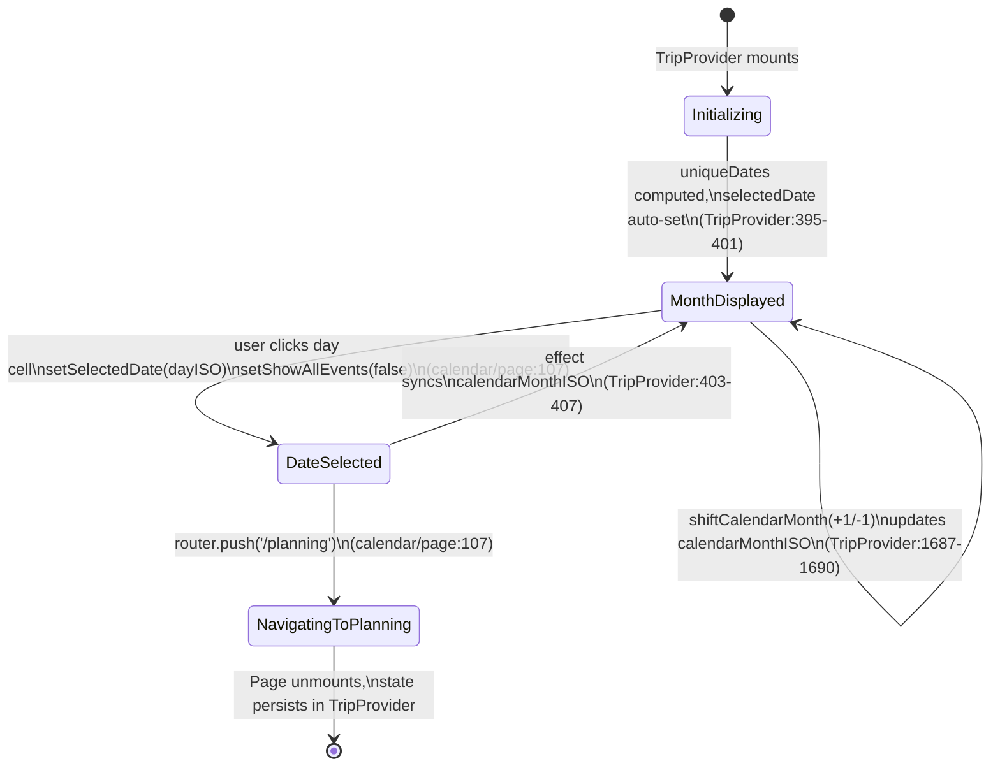
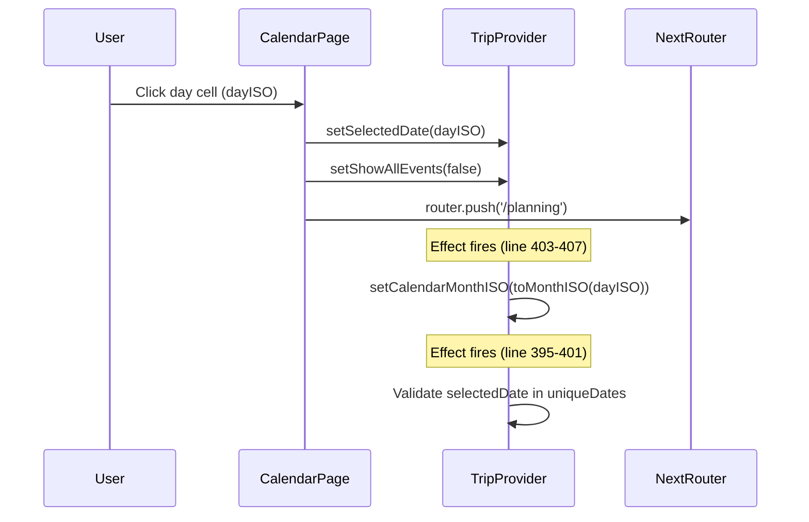
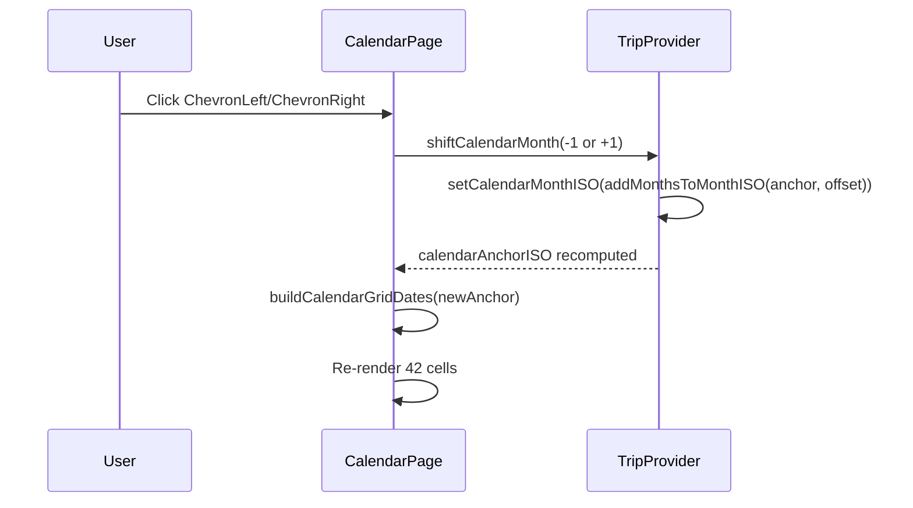

# Calendar View: Technical Architecture & Implementation

**Document Basis:** current code at time of generation.

**Last Updated:** 2026-03-16

---

## 1. Summary

The Calendar View is a month-grid tab that displays event and plan counts per day, supports month navigation via previous/next arrows, and acts as a date-selection gateway that navigates the user to the Planning tab for the chosen day.

**Current shipped scope:**
- Full 6-week (42-cell) month grid anchored to the current calendar month
- Per-day event count and plan count display
- Month forward/backward navigation
- Date selection that sets global `selectedDate`, resets `showAllEvents`, and routes to `/planning`
- Static legend showing city timezone color bars and event/plan dot indicators
- Current-month vs. adjacent-month visual distinction (opacity)
- Selected-date border highlight (accent green `#00E87B`)

**Out of scope (not implemented):**
- Multi-city colored trip-leg bars per day (legend references London/Paris but no per-day city coloring logic exists)
- Today indicator / "jump to today" action
- Inline event previews or tooltips on hover
- Drag-to-select date ranges
- Week view toggle

---

## 2. Runtime Placement & Ownership

The Calendar View is a **route-scoped page** rendered inside the protected tabs layout.

| Layer | File | Role |
|---|---|---|
| Middleware auth gate | `middleware.ts:11` | `/calendar(.*)` matched as protected route |
| Layout wrapper | `app/trips/layout.tsx:4-9` | Wraps children in `<TripProvider>` then `<AppShell>` |
| Navigation entry | `components/AppShell.tsx:15` | `NAV_ITEMS[1]` = `{ id: 'calendar', href: '/calendar', icon: Calendar, label: 'CALENDAR' }` |
| Page component | `app/trips/[tripId]/calendar/page.tsx:10` | `CalendarPage` -- single file, no sub-components |

**Lifecycle boundaries:**
- All calendar state lives in `TripProvider`. The page is a pure consumer -- it reads derived values and calls setter callbacks.
- The map panel is **hidden** when the calendar tab is active because `MAP_TABS` (`AppShell.tsx:21`) only includes `map`, `planning`, `spots` -- not `calendar`.
- `StatusBar` remains visible at the bottom regardless of active tab.

---

## 3. Module/File Map

| File | Responsibility | Key Exports | Dependencies | Side Effects |
|---|---|---|---|---|
| `app/trips/[tripId]/calendar/page.tsx` | Month grid UI, date cell rendering | `CalendarPage` (default) | `TripProvider`, `lib/helpers`, `lucide-react` | Router push on click |
| `components/providers/TripProvider.tsx` | All calendar state + derived data | `useTrip()` context hook | Convex, helpers, planner-helpers, map-helpers | localStorage, fetch, Google Maps |
| `lib/helpers.ts` | Date math and formatting | `buildCalendarGridDates`, `toMonthISO`, `addMonthsToMonthISO`, `formatMonthYear`, `formatDayOfMonth`, `normalizeDateKey`, `toISODate` | None | None |
| `components/AppShell.tsx` | Top nav bar with calendar tab link | `AppShell` (default) | `TripProvider` | Router push |
| `components/DayList.tsx` | Sidebar day list (shares `selectedDate` state) | `DayList` (default) | `TripProvider`, `lib/helpers` | None |

---

## 4. State Model & Transitions

### 4.1 Core State Variables

All state is owned by `TripProvider.tsx`. The calendar page reads these via `useTrip()`:

| Variable | Type | Default | Source | Purpose |
|---|---|---|---|---|
| `calendarMonthISO` | `string` | `''` | `useState` (`TripProvider.tsx:266`) | Explicit month override (ISO date, always 1st of month) |
| `selectedDate` | `string` | `''` | `useState` (`TripProvider.tsx:257`) | Currently selected day (ISO `YYYY-MM-DD`) |
| `showAllEvents` | `boolean` | `true` | `useState` (`TripProvider.tsx:258`) | Whether events list shows all dates or just selected |
| `timezone` | `string` | `'America/Los_Angeles'` | `useState` (`TripProvider.tsx:294`) | Active city timezone for date formatting |

### 4.2 Derived Values

| Value | Computation | Source |
|---|---|---|
| `calendarAnchorISO` | `calendarMonthISO \|\| selectedDate \|\| uniqueDates[0] \|\| toISODate(new Date())` | `TripProvider.tsx:390-393` |
| `eventsByDate` | `Map<string, number>` -- counts `allEvents` per `startDateISO` | `TripProvider.tsx:372-380` |
| `planItemsByDate` | `Map<string, number>` -- counts planner items per date | `TripProvider.tsx:382-388` |
| `uniqueDates` | Trip date range (`tripStart..tripEnd`) or union of event dates + planner dates, sorted | `TripProvider.tsx:357-370` |

### 4.3 Calendar Grid Construction

`buildCalendarGridDates(anchorISO)` (`lib/helpers.ts:96-108`):

```typescript
// lib/helpers.ts:96-108
export function buildCalendarGridDates(anchorISO) {
  const anchor = new Date(`${toMonthISO(anchorISO)}T00:00:00`);
  if (Number.isNaN(anchor.getTime())) return [];
  const start = new Date(anchor);
  start.setDate(1 - start.getDay());           // rewind to Sunday
  const dates = [];
  for (let index = 0; index < 42; index += 1) { // always 6 rows x 7 cols
    const date = new Date(start);
    date.setDate(start.getDate() + index);
    dates.push(toISODate(date));
  }
  return dates;
}
```

**Key invariant:** Always produces exactly 42 ISO date strings. The grid always renders 6 weeks starting from the Sunday on or before the 1st of the anchor month.

### 4.4 Month Navigation

`shiftCalendarMonth(offset)` (`TripProvider.tsx:1687-1690`):

```typescript
// TripProvider.tsx:1687-1690
const shiftCalendarMonth = useCallback((offset) => {
  const shifted = addMonthsToMonthISO(calendarAnchorISO, offset);
  setCalendarMonthISO(shifted);
}, [calendarAnchorISO]);
```

`addMonthsToMonthISO` (`lib/helpers.ts:88-94`) uses `Date.setMonth` to add/subtract months, always clamping to the 1st.

### 4.5 Auto-sync: selectedDate to calendarMonthISO

An effect in `TripProvider.tsx:403-407` keeps the calendar month in sync when `selectedDate` changes:

```typescript
// TripProvider.tsx:403-407
useEffect(() => {
  if (!selectedDate) return;
  const selectedMonth = toMonthISO(selectedDate);
  if (!calendarMonthISO || calendarMonthISO !== selectedMonth)
    setCalendarMonthISO(selectedMonth);
}, [calendarMonthISO, selectedDate]);
```

### 4.6 State Diagram



---

## 5. Interaction & Event Flow

### 5.1 Day Cell Click



### 5.2 Month Navigation



### 5.3 Initial Date Selection (on mount / data load)

`TripProvider.tsx:395-401`:
- If `uniqueDates` is empty, `selectedDate` is cleared.
- If `selectedDate` is empty or not in `uniqueDates`, it is set to today (if today is in `uniqueDates`) or the first available date.

---

## 6. Rendering/Layers/Motion

### 6.1 Layout Structure

```
<section>                          flex-1, overflow-y-auto, p-8, bg-bg
  <div>                            max-w-960px, centered, flex-col, gap-6
    <div> Month Header </div>      ChevronLeft | "Month Year" | ChevronRight
    <div> Legend </div>             4 items: London, Paris, Events, Plans
    <div> Day Headers </div>       7-col grid: SUN..SAT
    <div> Day Cells Grid </div>    7-col grid, 42 cells, gap-0.5
    <p> Footer text </p>           Instruction text
  </div>
</section>
```

### 6.2 Day Cell Visual Contract

Each cell is a `<button>` with these properties (`calendar/page.tsx:96-134`):

| Property | Current Month | Adjacent Month | Selected |
|---|---|---|---|
| Background | `#111111` | `#0A0A0A` | Same as month status |
| Border | `1px solid #1E1E1E` | `1px solid #1E1E1E` | `1px solid #00E87B` |
| Opacity | `1` | `0.4` | `1` (if current month) |
| Height | `90px` | `90px` | `90px` |
| Day number color | `#F5F5F5` | `#F5F5F5` (dimmed by opacity) | `#00E87B` |

### 6.3 Color Constants

| Element | Color | Usage |
|---|---|---|
| Day number (default) | `#F5F5F5` | `calendar/page.tsx:113` |
| Day number (selected) | `#00E87B` | `calendar/page.tsx:113` |
| Event count text | `#F59E0B` (amber) | `calendar/page.tsx:121` |
| Plan count text | `#00E87B` (accent green) | `calendar/page.tsx:129` |
| Legend: London bar | `#3B82F6` (blue) | `calendar/page.tsx:57` |
| Legend: Paris bar | `#A855F7` (purple) | `calendar/page.tsx:60` |
| Legend: Events dot | `#F59E0B` (amber) | `calendar/page.tsx:63` |
| Legend: Plans dot | `#00E87B` (green) | `calendar/page.tsx:66` |
| Nav arrows | `#737373` | `calendar/page.tsx:30, 50` |
| Cell border (default) | `#1E1E1E` | `calendar/page.tsx:102` |
| Cell border (selected) | `#00E87B` | `calendar/page.tsx:102` |
| Weekday headers | `#525252` | `calendar/page.tsx:83` |
| Month title | `#F5F5F5` | `calendar/page.tsx:39` |

### 6.4 Typography

| Element | Font | Size | Weight |
|---|---|---|---|
| Month title | Space Grotesk | 22px | 600 |
| Legend items | JetBrains Mono | 10px | 500 |
| Weekday headers | JetBrains Mono | 10px | 600 |
| Day number | JetBrains Mono | 12px (`text-xs`) | 600 (`font-semibold`) |
| Event/plan counts | JetBrains Mono | 9px | inherited |
| Footer | JetBrains Mono | 10px | inherited |

### 6.5 Animation

| Property | Value | Source |
|---|---|---|
| Cell hover/state transition | `transition-all duration-200` | `calendar/page.tsx:99` |

No keyframe animations, no z-index layering, no absolute positioning within the calendar grid.

### 6.6 Responsive Behavior

- Padding switches from `p-8` to `p-3.5` at `max-sm` breakpoint (`calendar/page.tsx:20`)
- The grid container is capped at `max-w-[840px]` (`calendar/page.tsx:71`)
- The outer container is `max-w-[960px]` (`calendar/page.tsx:21`)

---

## 7. API & Prop Contracts

### 7.1 TripProvider Context Values Consumed by CalendarPage

```typescript
// Values destructured in calendar/page.tsx:12-15
const {
  calendarAnchorISO,     // string -- ISO date for the anchor month
  selectedDate,          // string -- ISO date of selected day
  setSelectedDate,       // (date: string) => void
  setShowAllEvents,      // (show: boolean) => void
  eventsByDate,          // Map<string, number>
  planItemsByDate,       // Map<string, number>
  shiftCalendarMonth,    // (offset: number) => void
  timezone               // string -- IANA timezone
} = useTrip();
```

### 7.2 Helper Function Signatures

```typescript
// lib/helpers.ts
buildCalendarGridDates(anchorISO: string): string[]     // Always 42 items
toMonthISO(isoDate: string): string                      // "YYYY-MM-DD" -> "YYYY-MM-01"
addMonthsToMonthISO(monthISO: string, offset: number): string
formatMonthYear(isoDate: string, tz?: string): string    // "March 2026"
formatDayOfMonth(isoDate: string, tz?: string): string   // "15"
```

### 7.3 Cross-Tab State Sharing

The calendar page writes to state that other tabs consume:

| State Set by Calendar | Consumers |
|---|---|
| `selectedDate` | `DayList`, `EventsItinerary`, `PlannerItinerary`, `MapPanel` |
| `showAllEvents = false` | `EventsItinerary` (filters to single date) |

---

## 8. Reliability Invariants

These deterministic truths must remain true after refactors:

1. **Grid size is always 42 cells** -- `buildCalendarGridDates` always returns exactly 42 ISO date strings, producing a 6-row x 7-column grid (`lib/helpers.ts:102`).

2. **Grid always starts on Sunday** -- The start date is computed as `day 1 - dayOfWeek`, rewinding to Sunday (`lib/helpers.ts:100`).

3. **`calendarAnchorISO` never empty at render time** -- The fallback chain is `calendarMonthISO || selectedDate || uniqueDates[0] || toISODate(new Date())` (`TripProvider.tsx:391`).

4. **Day click always navigates to `/planning`** -- The `onClick` handler calls three operations atomically: `setSelectedDate`, `setShowAllEvents(false)`, `router.push('/planning')` (`calendar/page.tsx:107`).

5. **`eventsByDate` and `planItemsByDate` are Maps, not objects** -- They use `Map.get()` which returns `undefined` for missing keys, defaulted to `0` via `|| 0` (`calendar/page.tsx:93-94`).

6. **Month navigation only changes `calendarMonthISO`** -- It does not modify `selectedDate`. The selected date highlight persists across month navigation (`TripProvider.tsx:1687-1690`).

7. **Adjacent-month cells are clickable** -- They are not disabled, just visually dimmed with `opacity: 0.4`. Clicking them sets `selectedDate` to a date outside the current grid month.

---

## 9. Edge Cases & Pitfalls

### 9.1 Empty State

If `allEvents` is empty and `plannerByDateForView` has no entries and `tripStart`/`tripEnd` are unset, `uniqueDates` will be empty. The effect at `TripProvider.tsx:396` sets `selectedDate` to `''`. The calendar will still render because `calendarAnchorISO` falls through to `toISODate(new Date())`.

### 9.2 Adjacent-Month Click Drift

Clicking a date in the next/previous month sets `selectedDate` but does not call `shiftCalendarMonth`. However, the sync effect (`TripProvider.tsx:403-407`) detects the month mismatch and updates `calendarMonthISO` to match -- but this happens **after** `router.push('/planning')` fires, so the calendar grid update occurs when the user returns to the calendar tab.

### 9.3 Hardcoded Legend

The legend references "London (GMT)" and "Paris (CET)" with color bars (`calendar/page.tsx:57-61`). These are hardcoded strings, not derived from trip/city data. They will be incorrect for non-European trips.

### 9.4 Timezone Sensitivity in `buildCalendarGridDates`

`buildCalendarGridDates` uses `new Date()` with local-time parsing (`T00:00:00` without Z suffix). This means grid construction uses the **browser's local timezone**, not the trip timezone. However, `formatDayOfMonth` and `formatMonthYear` use the `timezone` parameter for display formatting, which could cause a 1-day offset near midnight for users in significantly different timezones from the trip destination.

### 9.5 No Debounce on Month Navigation

Rapid clicking of ChevronLeft/ChevronRight will trigger multiple `setCalendarMonthISO` updates. Since `buildCalendarGridDates` is called inline during render (not memoized), each click causes a full re-render. There is no throttle/debounce.

### 9.6 `isCurrentMonth` Check

The check `toMonthISO(dayISO) === toMonthISO(calendarAnchorISO)` (`calendar/page.tsx:91`) compares month strings like `"2026-03-01"`. This works correctly because `toMonthISO` always normalizes to `YYYY-MM-01`.

---

## 10. Testing & Verification

### 10.1 Existing Test Coverage

**No calendar-specific tests exist.** The helper functions `buildCalendarGridDates`, `toMonthISO`, `addMonthsToMonthISO`, `formatMonthYear`, and `formatDayOfMonth` have no unit tests in the repository.

### 10.2 Manual Verification Scenarios

| # | Scenario | Expected Behavior |
|---|---|---|
| 1 | Load calendar tab with trip data | Grid shows current month, cells show event/plan counts |
| 2 | Click ChevronRight | Month title advances by one month, grid updates |
| 3 | Click ChevronLeft | Month title goes back one month, grid updates |
| 4 | Click a day with events | `selectedDate` updates, navigates to `/planning`, events tab shows filtered |
| 5 | Click a grayed-out adjacent-month day | Same as #4, plus `calendarMonthISO` syncs on next calendar visit |
| 6 | No events loaded | Calendar still renders current month with zero counts |
| 7 | Trip spans multiple months | Navigate between months; event counts are correct per month |
| 8 | Rapid month navigation (10+ clicks) | No crashes, no stale renders |

### 10.3 Recommended Test Additions

```
buildCalendarGridDates:
  - returns 42 dates
  - first date is a Sunday
  - contains all days of the anchor month
  - handles month starting on Sunday
  - handles month starting on Saturday
  - returns [] for invalid input

addMonthsToMonthISO:
  - positive offset advances month
  - negative offset decreases month
  - wraps year boundary (Dec -> Jan)
  - handles invalid input gracefully

toMonthISO:
  - normalizes to first of month
  - returns '' for short/invalid strings
```

---

## 11. Quick Change Playbook

| If you want to... | Edit this |
|---|---|
| Change grid cell height | `calendar/page.tsx:104` -- `height: 90` |
| Change selected day highlight color | `calendar/page.tsx:102` (border) and `:113` (text) -- `#00E87B` |
| Change event count color | `calendar/page.tsx:121` -- `#F59E0B` |
| Change plan count color | `calendar/page.tsx:129` -- `#00E87B` |
| Add a new legend item | `calendar/page.tsx:55-68` -- add another `<span>` |
| Fix hardcoded legend labels | `calendar/page.tsx:57-61` -- replace with dynamic city data from `useTrip()` |
| Change grid size (e.g. 5 rows) | `lib/helpers.ts:102` -- change `42` to `35` |
| Change week start day (Monday) | `lib/helpers.ts:100` -- change `start.getDay()` logic; also update `calendar/page.tsx:73` weekday headers |
| Add "today" indicator | `calendar/page.tsx:90-106` -- compare `dayISO` against `toISODate(new Date())` and add styling |
| Make adjacent-month cells non-clickable | `calendar/page.tsx:99` -- add `disabled={!isCurrentMonth}` |
| Change month title font | `calendar/page.tsx:35` -- change `fontFamily` |
| Add month navigation debounce | `TripProvider.tsx:1687-1690` -- wrap in debounce/throttle |
| Change the route on day click | `calendar/page.tsx:107` -- change `'/planning'` path |
| Memoize calendar grid computation | `calendar/page.tsx:17` -- wrap `buildCalendarGridDates` in `useMemo` with `[calendarAnchorISO]` dependency |
| Show event details on hover | `calendar/page.tsx:96-134` -- add `onMouseEnter`/tooltip using `allEvents` filtered by `dayISO` |

---

## Appendix: Data Flow Diagram

```
                    Convex DB
                       |
                  events.listEvents(cityId)
                       |
                       v
              TripProvider.tsx
         +--------------------------+
         | allEvents[]              |
         |   -> eventsByDate Map    |----> CalendarPage
         | plannerByDateForView{}   |        (reads counts)
         |   -> planItemsByDate Map |
         | calendarMonthISO         |
         |   -> calendarAnchorISO   |----> buildCalendarGridDates()
         | selectedDate             |        (42 ISO strings)
         | timezone                 |
         +--------------------------+
                  |          ^
                  |          |
         setSelectedDate     |
         setShowAllEvents    |
         shiftCalendarMonth  |
                  |          |
                  v          |
            CalendarPage ----+
                  |
                  v
           router.push('/planning')
```
