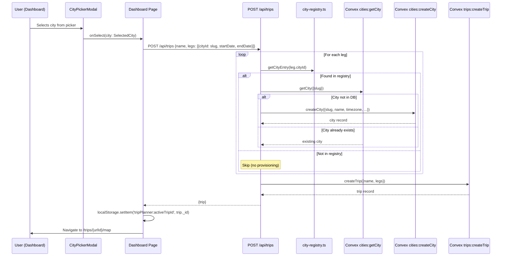

# City Auto-Provisioning: Technical Architecture & Implementation

Document Basis: current code at time of generation.

**Last Updated:** 2026-03-16

---

## 1. Summary

**Purpose**: When a user creates a trip through the dashboard, the system automatically ensures that every city referenced by a trip leg exists in the Convex `cities` table before the trip record is inserted. City metadata (coordinates, timezone, map bounds, crime adapter) is resolved from a static in-process registry (`lib/city-registry.ts`), eliminating the need for manual city setup or external geocoding APIs at trip-creation time.

**Current shipped scope**:
- Static registry of 8 cities with full geographic metadata.
- Auto-provisioning triggered during `POST /api/trips` for each leg whose `cityId` matches a registry entry.
- Idempotent: skips provisioning if the city row already exists (checked by slug index).
- Separate bulk-seed mechanism (`convex/seed.ts`) for initial database population (6 cities).

**Out of scope**:
- Dynamic city creation for slugs not in the registry (silently skipped).
- User-facing city management UI (the `POST /api/cities` endpoint exists but requires owner role and is not wired to auto-provisioning).
- Geocoding or reverse-geocoding of arbitrary addresses into city records.

---

## 2. Runtime Placement & Ownership

The auto-provisioning logic lives entirely in the **Next.js API route layer** (`app/api/trips/route.ts`), executing server-side during the trip creation request. It bridges two subsystems:

| Boundary | Owner | Runtime |
|---|---|---|
| Static city metadata | `lib/city-registry.ts` | Node.js (Next.js server) |
| Auto-provision orchestration | `app/api/trips/route.ts` POST handler | Node.js (Next.js API route, `runtime = 'nodejs'`) |
| City persistence + uniqueness | `convex/cities.ts` (`getCity`, `createCity`) | Convex serverless functions |
| Bulk seed (separate path) | `convex/seed.ts` | Convex mutation |

**Lifecycle**: Auto-provisioning runs synchronously within the trip creation request. It must complete before `trips:createTrip` is called because `createTrip` reads the city row to derive the `tripConfig.timezone` field.

---

## 3. Module/File Map

| File | Responsibility | Key Exports | Dependencies | Side Effects |
|---|---|---|---|---|
| `lib/city-registry.ts` | Static in-memory registry of supported cities | `CityEntry` type, `getCityEntry(slug)`, `getAllCityEntries()` | None | None |
| `app/api/trips/route.ts` | Trip CRUD API; orchestrates auto-provisioning on POST | `GET`, `POST` route handlers | `lib/request-auth`, `lib/city-registry` | Convex queries + mutations via HTTP client |
| `convex/cities.ts` | City table CRUD (Convex serverless) | `listCities`, `getCity`, `createCity`, `updateCity` | `convex/authz` | DB reads/writes to `cities` table |
| `convex/seed.ts` | Bulk-insert seed cities into empty database | `seedInitialData`, `seedInitialDataInternal` | `convex/authz` | DB writes to `cities` table |
| `convex/schema.ts` | Schema definition for `cities` table | Schema with `by_slug` index | Convex schema system | Defines table shape and indexes |
| `app/api/cities/route.ts` | Direct city CRUD API (owner-only POST) | `GET`, `POST` route handlers | `lib/request-auth` | Convex queries + mutations |
| `lib/crime-cities.ts` | Separate crime-data-specific city config | `CrimeCityConfig`, `getCrimeCityConfig(slug)` | None | None |
| `components/CityPickerModal.tsx` | Google Places-powered city search | `CityPickerModal`, `SelectedCity` | `Modal`, `map-helpers`, `city-registry` | Google Maps script, Places API, Geocoder |
| `app/dashboard/page.tsx` | Dashboard; triggers trip creation flow | `DashboardPage` component | `CityPickerModal`, `lib/mock-data` | `fetch('/api/trips')`, localStorage |

---

## 4. State Model & Transitions

### 4.1 City Lifecycle States

A city record transitions through two states:

```mermaid
stateDiagram-v2
    [*] --> NotProvisioned: slug exists in registry only
    NotProvisioned --> Provisioned: auto-provision or seed
    Provisioned --> Provisioned: updateCity (idempotent)

    state NotProvisioned {
        note right of NotProvisioned: No row in cities table
    }

    state Provisioned {
        note right of Provisioned: Row exists with isSeeded flag
    }
```

| From | To | Trigger | Guard | Citation |
|---|---|---|---|---|
| Not in DB | Provisioned (`isSeeded: false`) | `POST /api/trips` with leg referencing registry slug | `getCity` returns null | `app/api/trips/route.ts:40-56` |
| Not in DB | Provisioned (`isSeeded: true`) | `seedInitialData` / `seedInitialDataInternal` | `by_slug` index lookup returns null | `convex/seed.ts:66-81` |
| In DB | No change | `POST /api/trips` with leg referencing existing city | `getCity` returns non-null | `app/api/trips/route.ts:44-45` |
| In DB | Error thrown | `createCity` called directly with duplicate slug | `existing` is truthy | `convex/cities.ts:76-78` |

### 4.2 Auto-Provision Decision Logic

For each leg in the trip creation payload:

1. Look up `leg.cityId` in the static registry via `getCityEntry(leg.cityId)`.
2. If not found in registry: **skip silently** (the leg proceeds with whatever `cityId` string it has).
3. If found: query Convex `cities:getCity` by slug.
4. If city row exists: **skip** (already provisioned).
5. If city row does not exist: call `cities:createCity` with full metadata from registry.

---

## 5. Interaction & Event Flow

### 5.1 Trip Creation Sequence (with Auto-Provisioning)



### 5.2 Key Data Flow: City Slug Propagation

The `slug` string serves as the universal join key across the system:

```
SelectedCity.slug (UI) --> leg.cityId (API payload) --> getCityEntry(slug) (registry lookup)
                                                --> cities.slug (DB row, indexed)
                                                --> events.cityId, spots.cityId, sources.cityId (downstream)
                                                --> tripConfig.timezone (derived from city)
```

---

## 6. Rendering/Layers/Motion

This feature is primarily backend-oriented. The relevant UI touchpoints are:

**CityPickerModal** (`components/CityPickerModal.tsx`): Searches worldwide cities via Google Places Autocomplete API. The selected city is resolved into a `SelectedCity` object with slug, map bounds, timezone, and crime adapter ID. The slug is generated by `toSlug()` from `lib/city-registry.ts`.

**Dashboard** (`app/dashboard/page.tsx`): After city selection, constructs a leg with `cityId: city.slug` and POSTs to `/api/trips`. The dashboard also loads provisioned cities via `GET /api/cities` to resolve display names for trip cards (`citiesMap[cityId]?.name`).

No animations, z-index layering, or motion configs are specific to the auto-provisioning feature.

---

## 7. API & Prop Contracts

### 7.1 Static Registry API (`lib/city-registry.ts`)

```typescript
// lib/city-registry.ts:1-9
export type CityEntry = {
  slug: string;
  name: string;
  timezone: string;
  locale: string;
  mapCenter: { lat: number; lng: number };
  mapBounds: { north: number; south: number; east: number; west: number };
  crimeAdapterId: string;
};
```

| Function | Signature | Returns | Citation |
|---|---|---|---|
| `getCityEntry` | `(slug: string) => CityEntry \| undefined` | Entry or `undefined` if slug not in registry | `lib/city-registry.ts:86-88` |
| `getAllCityEntries` | `() => CityEntry[]` | Array of all 8 city entries | `lib/city-registry.ts:90-92` |

### 7.2 Registry Contents (Truth Table)

| Slug | Name | Timezone | Locale | Crime Adapter | Citation |
|---|---|---|---|---|---|
| `san-francisco` | San Francisco | `America/Los_Angeles` | `en-US` | `sf-open-data` | `lib/city-registry.ts:12-20` |
| `new-york` | New York | `America/New_York` | `en-US` | `nypd-open-data` | `lib/city-registry.ts:21-29` |
| `los-angeles` | Los Angeles | `America/Los_Angeles` | `en-US` | `lapd-open-data` | `lib/city-registry.ts:30-38` |
| `chicago` | Chicago | `America/Chicago` | `en-US` | `chicago-open-data` | `lib/city-registry.ts:39-47` |
| `london` | London | `Europe/London` | `en-GB` | `uk-police` | `lib/city-registry.ts:48-56` |
| `tokyo` | Tokyo | `Asia/Tokyo` | `ja-JP` | (empty string) | `lib/city-registry.ts:57-65` |
| `paris` | Paris | `Europe/Paris` | `fr-FR` | (empty string) | `lib/city-registry.ts:66-74` |
| `barcelona` | Barcelona | `Europe/Madrid` | `es-ES` | (empty string) | `lib/city-registry.ts:75-83` |

### 7.3 Seed Cities (Truth Table)

The seed mechanism in `convex/seed.ts:5-60` provisions 6 cities. Compared to the registry (8 cities), **Paris and Barcelona are absent from the seed data**.

| Slug | In Registry | In Seed | Difference |
|---|---|---|---|
| `san-francisco` | Yes | Yes | None |
| `new-york` | Yes | Yes | None |
| `los-angeles` | Yes | Yes | None |
| `chicago` | Yes | Yes | None |
| `london` | Yes | Yes | None |
| `tokyo` | Yes | Yes | None |
| `paris` | Yes | **No** | Only auto-provisioned on trip creation |
| `barcelona` | Yes | **No** | Only auto-provisioned on trip creation |

### 7.4 Convex `cities:createCity` Mutation Args

```typescript
// convex/cities.ts:53-66
args: {
  slug: v.string(),
  name: v.string(),
  timezone: v.string(),
  locale: v.string(),
  mapCenter: v.object({ lat: v.number(), lng: v.number() }),
  mapBounds: v.object({ north, south, east, west: v.number() }),
  crimeAdapterId: v.optional(v.string()),  // defaults to '' if omitted
}
```

**Auth requirement**: `requireOwnerUserId(ctx)` -- only owner-role users can create cities (`convex/cities.ts:69`).

**Uniqueness enforcement**: Throws `Error('City with slug "..." already exists.')` if slug is already taken (`convex/cities.ts:76-78`).

### 7.5 Convex Schema: `cities` Table

```typescript
// convex/schema.ts:10-30
cities: defineTable({
  slug: v.string(),
  name: v.string(),
  timezone: v.string(),
  locale: v.string(),
  mapCenter: v.object({ lat: v.number(), lng: v.number() }),
  mapBounds: v.object({ north, south, east, west: v.number() }),
  crimeAdapterId: v.string(),
  isSeeded: v.boolean(),
  createdByUserId: v.string(),
  createdAt: v.string(),
  updatedAt: v.string(),
}).index('by_slug', ['slug'])
```

### 7.6 POST /api/trips Request/Response

**Request**:
```json
{
  "name": "San Francisco",
  "legs": [
    { "cityId": "san-francisco", "startDate": "2026-03-15", "endDate": "2026-03-18" }
  ]
}
```

**Response** (200):
```json
{
  "trip": {
    "_id": "...",
    "userId": "...",
    "name": "San Francisco",
    "legs": [...],
    "createdAt": "...",
    "updatedAt": "..."
  }
}
```

---

## 8. Reliability Invariants

These invariants must hold true after any refactor:

1. **Registry is pure and side-effect-free**: `getCityEntry()` performs no I/O, no network calls, no DB access. It is a synchronous dictionary lookup. (`lib/city-registry.ts:86-88`)

2. **Auto-provisioning is idempotent**: Calling `POST /api/trips` with the same city slug multiple times never creates duplicate city rows. The `getCity` query guards the `createCity` call. (`app/api/trips/route.ts:44-45`)

3. **Slug uniqueness is enforced at the DB layer**: Even if the API-layer guard is bypassed, `createCity` throws on duplicate slugs via its own `by_slug` index check. (`convex/cities.ts:72-78`)

4. **Unknown slugs are silently skipped**: If `getCityEntry(leg.cityId)` returns `undefined`, the loop `continue`s without error. The trip is still created; the leg's `cityId` string is stored as-is. (`app/api/trips/route.ts:42`)

5. **`isSeeded` distinguishes provenance**: Cities created via `seed.ts` have `isSeeded: true`; cities created via auto-provisioning have `isSeeded: false`. (`convex/seed.ts:76`, `convex/cities.ts:89`)

6. **`createdByUserId` tracks creator**: Seed cities use `'system'` (`convex/seed.ts:77`). Auto-provisioned cities use the authenticated user's ID (via `requireOwnerUserId` in `createCity`). (`convex/cities.ts:69`)

7. **Trip creation depends on city existence for timezone**: `trips:createTrip` queries the city by slug to derive `tripConfig.timezone`. If the city is not found, it falls back to `'UTC'`. (`convex/trips.ts:83-86, 91`)

---

## 9. Edge Cases & Pitfalls

### 9.1 Slug Not in Registry

If a user (or a modified client) sends a `cityId` that is not in the static registry, auto-provisioning is skipped (`continue` at `app/api/trips/route.ts:42`). The trip is still created, but:
- No city row is created in the DB.
- `tripConfig.timezone` falls back to `'UTC'` (`convex/trips.ts:91`).
- The dashboard will show the raw slug string instead of a display name (`app/dashboard/page.tsx:34`).
- Events, spots, and sources queries will return empty results for that `cityId`.

### 9.2 Race Condition on Concurrent Trip Creation

If two users simultaneously create trips for the same never-before-provisioned city:
- Both will pass the `getCity` null check.
- The second `createCity` call will throw `'City with slug "..." already exists.'` from the Convex mutation.
- This will cause the entire `POST /api/trips` to return a 400 error for the second user.
- **Mitigation**: The `try/catch` in `app/api/trips/route.ts:38-68` catches this and returns the error message. The user can retry.

### 9.3 Auth Model Asymmetry

- Auto-provisioning calls `cities:createCity`, which requires `requireOwnerUserId` (`convex/cities.ts:69`).
- Trip creation calls `trips:createTrip`, which only requires `requireAuthenticatedUserId` (`convex/trips.ts:66`).
- In the current dev-bypass mode (`DEV_BYPASS_AUTH = true`), this is transparent because the bypass user gets owner privileges (`convex/authz.ts:28-30`).
- In production: a non-owner user creating a trip for an unprovisioned city will fail at `createCity` with `'Owner role required.'`, even though `createTrip` itself would succeed.

### 9.4 Registry vs. Seed Divergence

The registry has 8 cities; the seed has 6. Paris and Barcelona will only exist in the DB if a user creates a trip to those cities. This means:
- Fresh databases after seeding will not have Paris/Barcelona rows.
- Events/spots sync for Paris/Barcelona cannot run until a trip triggers auto-provisioning.

### 9.5 CityPickerModal Uses Mock Data, Not Registry

The `CityPickerModal` now uses Google Places Autocomplete API to search worldwide cities. When a city is selected, it is geocoded and its slug is generated via `toSlug()`. The `POST /api/trips` handler then calls `cities:ensureCity` in Convex to auto-provision the city record with metadata from the client (mapCenter, mapBounds, timezone, locale). Cities in `lib/city-registry.ts` will have their `crimeAdapterId` resolved; others will have an empty string.

---

## 10. Testing & Verification

### 10.1 Existing Tests

| Test File | Scope | Runner | Citation |
|---|---|---|---|
| `lib/crime-cities.test.mjs` | `crime-cities.ts` registry (NOT `city-registry.ts`) | `node:test` | `lib/crime-cities.test.mjs:1-92` |
| `lib/dashboard.test.mjs` | Dashboard page structure: fetches `/api/trips` and `/api/cities`, trip creation via POST | `node:test` (source-reading assertions) | `lib/dashboard.test.mjs:1-99` |
| `lib/trip-provider-bootstrap.test.mjs` | TripProvider trip resolution and crime city slug usage | `node:test` (source-reading assertions) | `lib/trip-provider-bootstrap.test.mjs:1-99` |

**Notable gap**: There are no unit tests for `lib/city-registry.ts` itself, and no integration tests that verify the auto-provisioning flow end-to-end.

### 10.2 Manual Verification Scenarios

1. **Fresh database, create trip for seeded city**:
   - Run seed: `npx convex run seed:seedInitialDataInternal`
   - POST to `/api/trips` with `cityId: "san-francisco"` -- should skip provisioning (city already seeded).

2. **Fresh database, create trip for unseeded registry city**:
   - POST to `/api/trips` with `cityId: "paris"` -- should auto-provision Paris, then create trip.
   - Verify via `GET /api/cities` that Paris row exists with `isSeeded: false`.

3. **Create trip for unknown city**:
   - POST to `/api/trips` with `cityId: "atlantis"` -- should skip provisioning, create trip with `timezone: 'UTC'`.

4. **Duplicate provisioning**:
   - POST to `/api/trips` with `cityId: "barcelona"` twice -- second call should not error, should skip provisioning.

### 10.3 Commands

```bash
# Run existing tests
node --test lib/crime-cities.test.mjs
node --test lib/dashboard.test.mjs
node --test lib/trip-provider-bootstrap.test.mjs

# Seed cities via Convex CLI
npx convex run seed:seedInitialDataInternal

# Check provisioned cities
curl -s http://localhost:3000/api/cities | jq '.cities[].slug'
```

---

## 11. Quick Change Playbook

| If you want to... | Edit... | Notes |
|---|---|---|
| Add a new supported city | `lib/city-registry.ts`: add entry to `CITIES` dict | Use kebab-case slug. Optionally also add to `convex/seed.ts` SEED_CITIES and `lib/mock-data.ts` for UI visibility. |
| Change a city's map bounds or coordinates | `lib/city-registry.ts`: update the entry | Only affects future auto-provisions. Existing DB rows are not retroactively updated. Use `cities:updateCity` to patch existing rows. |
| Add a city to the seed list | `convex/seed.ts`: add entry to `SEED_CITIES` array | Ensure the data matches the registry entry to avoid drift. |
| Make auto-provisioning work for non-owner users | `convex/cities.ts:69`: change `requireOwnerUserId` to `requireAuthenticatedUserId` in `createCity` | Security consideration: this allows any authenticated user to create city records. |
| Show real registry cities in the picker instead of mocks | `components/CityPickerModal.tsx`: replace Google Places API / Google Places API imports with `getAllCityEntries()` from `lib/city-registry.ts` | Requires adapting the `SelectedCity` type to `CityEntry` type (different field names: `country`, `imageUrl`, `autoSources` do not exist on `CityEntry`). |
| Retroactively update existing city rows from registry | Write a migration script or Convex internal mutation that iterates `getAllCityEntries()`, looks up each by slug, and patches with `updateCity` | No built-in mechanism exists for this today. |
| Handle the race condition on concurrent provisioning | Wrap the provision loop in `app/api/trips/route.ts:40-56` with a try/catch per-leg, catching the "already exists" error and continuing | Currently the entire request fails if any `createCity` throws. |
| Remove a city from the system | Remove from `lib/city-registry.ts` and `convex/seed.ts` | Existing DB rows, events, spots, and sources referencing that slug are not cleaned up automatically. |
| Change the fallback timezone for unknown cities | `convex/trips.ts:91`: change `'UTC'` to desired default | Affects all trips whose legs reference cities not in the DB. |
