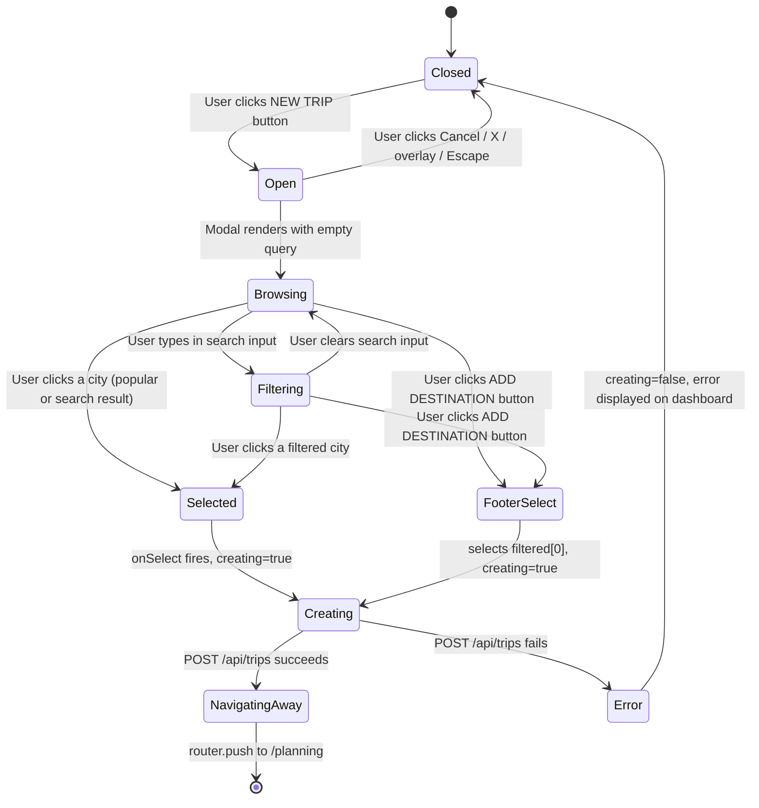
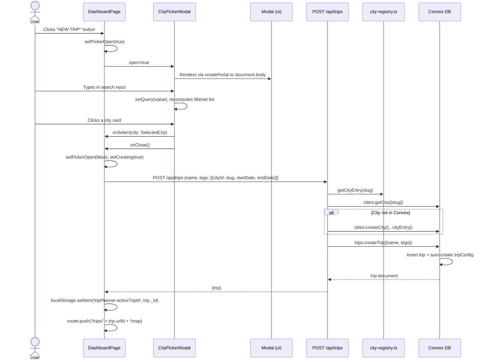

# City Picker Modal: Technical Architecture & Implementation

**Document Basis**: current code at time of generation.

---

## 1. Summary

The City Picker Modal is the UI surface through which users search for and select a city to create a new trip. It is a controlled modal dialog powered by Google Places Autocomplete API that provides worldwide city search. When a city is selected, the modal geocodes it, resolves its timezone via the Google TimeZone API, and delegates to the parent callback which creates a trip via the API.

**Current shipped scope**:
- Modal with search input powered by Google Places AutocompleteService (type `(cities)`).
- Debounced search (300ms) with prediction results from Google Places API.
- City selection resolves: lat/lng, viewport bounds, country code, timezone (via `/api/cities/timezone`), and locale.
- Slug generation via `toSlug()` from `lib/city-registry.ts` (e.g., `san-francisco-us`).
- Crime adapter ID lookup via `getCrimeAdapterIdForSlug()` for known cities.
- Selection triggers `onSelect` callback (parent creates trip via `POST /api/trips`).

**Out of scope / not yet implemented**:
- Multi-city selection within a single modal session (only one city per trip creation).
- Keyboard navigation within the prediction list (no `aria-activedescendant` or arrow-key handling).
- City images or visual previews.

---

## 2. Runtime Placement & Ownership

The `CityPickerModal` is rendered inside the **Dashboard page** (`app/dashboard/page.tsx`). It is not mounted globally -- it exists only while the dashboard is active.

**Lifecycle boundaries**:
- **Mount**: Rendered unconditionally at the bottom of `DashboardPage` (`app/dashboard/page.tsx:371`). The `open` prop controls visibility.
- **Open trigger**: Three buttons on the dashboard set `pickerOpen = true`:
  1. Header "NEW TRIP" button (`app/dashboard/page.tsx:185`)
  2. Empty-state "NEW TRIP" button (`app/dashboard/page.tsx:229`)
  3. Dashed "Create new trip" card in the trip grid (`app/dashboard/page.tsx:346`)
- **Close trigger**: `onClose={() => setPickerOpen(false)}` (`app/dashboard/page.tsx:371`).
- **Portal**: The underlying `Modal` component renders via `createPortal` to `document.body` (`components/ui/modal.tsx:27`), so the modal DOM lives outside the React tree of `DashboardPage`.

---

## 3. Module/File Map

| File | Responsibility | Key exports | Dependencies | Side effects |
|---|---|---|---|---|
| `components/CityPickerModal.tsx` | City search/select UI via Google Places | `CityPickerModal`, `SelectedCity` | `Modal`, `map-helpers.loadGoogleMapsScript`, `city-registry.toSlug/getCrimeAdapterIdForSlug`, `lucide-react` | Loads Google Maps script; calls Google Places & Geocoder APIs |
| `components/ui/modal.tsx` | Generic modal shell with portal, overlay, Escape-to-close | `Modal` | `react-dom/createPortal`, `lucide-react/X` | Adds/removes `keydown` listener on `document` |
| `lib/city-registry.ts` | Static city catalog + slug/crime-adapter helpers | `CityEntry`, `getCityEntry`, `getAllCityEntries`, `toSlug`, `getCrimeAdapterIdForSlug` | None | None |
| `lib/map-helpers.ts` | Google Maps script loader | `loadGoogleMapsScript` | None | Script injection |
| `app/dashboard/page.tsx` | Dashboard page; owns modal open state and city-select handler | `DashboardPage` (default) | `CityPickerModal`, `SelectedCity`, router, `/api/trips`, `/api/cities` | `fetch` on mount, `localStorage.setItem` on trip creation |
| `app/api/trips/route.ts` | Trip CRUD API | `GET`, `POST` | `requireAuthenticatedClient`, `getCrimeAdapterIdForSlug`, Convex `trips:*`, `cities:*` | Auto-creates city in Convex DB via `ensureCity` |
| `app/api/cities/route.ts` | City list/create API | `GET`, `POST` | `requireAuthenticatedClient`, `requireOwnerClient`, Convex `cities:*` | None |
| `app/api/cities/timezone/route.ts` | Timezone lookup via Google TimeZone API | `GET` | Google TimeZone API | None |
| `convex/cities.ts` | Convex city functions | `listCities`, `getCity`, `createCity`, `ensureCity`, `updateCity` | `convex/values`, `authz` | DB writes |
| `convex/trips.ts` | Convex trip functions | `listMyTrips`, `getTrip`, `createTrip`, `updateTrip`, `deleteTrip`, `backfillUrlIds` | `convex/values`, `authz` | DB writes, auto-creates `tripConfig` |
| `convex/schema.ts` | Database schema | `default` (schema definition) | `convex/server`, `@convex-dev/auth` | Schema registration |
| `convex/seed.ts` | City seed data (6 cities) | `seedInitialData`, `seedInitialDataInternal` | `authz` | DB writes |

---

## 4. State Model & Transitions

### CityPickerModal internal state

The component manages multiple pieces of local state:

| State variable | Type | Default | Purpose |
|---|---|---|---|
| `query` | `string` | `''` | Current search input value |
| `predictions` | `any[]` | `[]` | Google Places autocomplete predictions |
| `resolving` | `boolean` | `false` | Whether a city selection is being geocoded |
| `mapsReady` | `boolean` | `false` | Whether Google Maps JS API has loaded |
| `placesReady` | `boolean` | `false` | Whether Places library + AutocompleteService are initialized |
| `error` | `string` | `''` | Error message to display |

**Refs**: `autocompleteServiceRef` (Google AutocompleteService), `sessionTokenRef` (Google AutocompleteSessionToken), `debounceRef` (debounce timer).

**Search behavior**: When `query` has 2+ characters and `placesReady` is true, a debounced (300ms) call to `AutocompleteService.getPlacePredictions` with `types: ['(cities)']` populates `predictions`. When a prediction is selected, the component geocodes it, resolves timezone via `/api/cities/timezone`, and calls `onSelect` with a `SelectedCity` object.

### Dashboard page state (modal-related)

| State variable | Type | Default | Purpose |
|---|---|---|---|
| `pickerOpen` | `boolean` | `false` | Controls modal visibility |
| `creating` | `boolean` | `false` | Guards against double-submission during trip creation |

### State diagram



---

## 5. Interaction & Event Flow

### Sequence diagram: City selection and trip creation



### Event-to-action mapping

| User event | Handler location | Action |
|---|---|---|
| Click "NEW TRIP" button | `app/dashboard/page.tsx:185,229,346` | `setPickerOpen(true)` |
| Type in search input | `components/CityPickerModal.tsx:84` | `setQuery(e.target.value)` -- triggers re-render with filtered list |
| Click popular destination card | `components/CityPickerModal.tsx:107` | `onSelect?.(city); onClose()` |
| Click search result row | `components/CityPickerModal.tsx:155` | `onSelect?.(city); onClose()` |
| Click "ADD DESTINATION" footer button | `components/CityPickerModal.tsx:53` | Selects `filtered[0]` if it exists, calls `onSelect`, then `onClose()` |
| Click "CANCEL" footer button | `components/CityPickerModal.tsx:48` | `onClose()` |
| Press Escape key | `components/ui/modal.tsx:20` | `onClose()` |
| Click overlay background | `components/ui/modal.tsx:32` | `onClose()` (checks `e.target === overlayRef.current`) |
| Click X close button | `components/ui/modal.tsx:47` | `onClose()` |

---

## 6. Rendering/Layers/Motion

### Layer stack

| Layer | z-index | Component | Rendering mechanism |
|---|---|---|---|
| Dashboard page | auto (document flow) | `DashboardPage` | Normal React render |
| Modal overlay | `z-50` (Tailwind) | `Modal` | `createPortal(_, document.body)` |
| Modal content | child of overlay | `Modal` inner `div` | Flex centering within overlay |
| CityPickerModal content | child of modal body | `CityPickerModal` | Scrollable body region |

### Modal dimensions and constraints

| Property | Value | Source |
|---|---|---|
| Overlay background | `rgba(0,0,0,0.7)` | `components/ui/modal.tsx:31` |
| Overlay padding | `p-10` (40px) | `components/ui/modal.tsx:30` |
| Content max-width | `560px` | `components/ui/modal.tsx:35` |
| Content max-height | `720px` | `components/ui/modal.tsx:35` |
| Content background | `#111111` | `components/ui/modal.tsx:36` |
| Content border-radius | `2px` | `components/ui/modal.tsx:36` |
| Header height | `64px` min-height | `components/ui/modal.tsx:38` |
| Footer height | `64px` min-height | `components/ui/modal.tsx:55` |
| Body | Scrollable (`overflow-y-auto`) | `components/ui/modal.tsx:53` |

### City card dimensions

| Element | Dimensions | Source |
|---|---|---|
| Search input container | `48px` height | `components/CityPickerModal.tsx:78` |
| Popular destination card | `64px` height, 2-column grid | `components/CityPickerModal.tsx:102,114` |
| Popular card thumbnail | `36x36px` placeholder | `components/CityPickerModal.tsx:120` |
| Search result row | `72px` height | `components/CityPickerModal.tsx:158` |
| Search result thumbnail | `48x48px` (image or placeholder) | `components/CityPickerModal.tsx:164,167` |

### Animation / Motion

The modal has **no enter/exit animations**. It renders immediately when `open=true` and is removed from DOM when `open=false` (early return `null` at `components/ui/modal.tsx:25`). Hover transitions use Tailwind `transition-colors` on city cards.

### Typography contracts

| Element | Font family | Size | Weight | Color |
|---|---|---|---|---|
| Modal title | JetBrains Mono | 14px (`text-sm`) | 600 | `#FFFFFF` |
| Section labels | JetBrains Mono | 11px | 600 | `#666` |
| City name (popular) | Space Grotesk | 14px (`text-sm`) | 600 | `#FFFFFF` |
| City metadata | JetBrains Mono | 10px | normal | `#666` |
| Source badges | JetBrains Mono | 9px | 600 | `#666` on `#1A1A1A` |
| Search input | JetBrains Mono | 14px | normal | `#FFF` |
| Footer buttons | JetBrains Mono | 12px | 600 | Cancel: `#999`, Add: `#0A0A0A` on `#00E87B` |

---

## 7. API & Prop Contracts

### CityPickerModal props

```typescript
// components/CityPickerModal.tsx:8-12
interface CityPickerModalProps {
  open: boolean;           // Controls visibility
  onClose: () => void;     // Called on any dismiss action
  onSelect?: (city: SelectedCity) => void;  // Called with selected city before close
}
```

### SelectedCity type

```typescript
// components/CityPickerModal.tsx:9-18
export interface SelectedCity {
  slug: string;         // URL-safe key (e.g., 'san-francisco-us')
  name: string;         // Display name (e.g., 'San Francisco')
  country: string;      // Country name (e.g., 'United States')
  timezone: string;     // IANA timezone (e.g., 'America/Los_Angeles')
  locale: string;       // Locale string (e.g., 'en-US')
  mapCenter: { lat: number; lng: number };
  mapBounds: { north: number; south: number; east: number; west: number };
  crimeAdapterId: string; // Crime adapter ID or empty string
}
```

### POST /api/trips request body

```typescript
// app/dashboard/page.tsx:104-107
{
  name: string;  // city.name
  legs: [{
    cityId: string;    // city.slug (maps to city-registry key)
    startDate: string; // ISO date, today
    endDate: string;   // ISO date, today + 3 days
  }]
}
```

### POST /api/trips response

```typescript
// app/api/trips/route.ts:62
{ trip: { _id: string; userId: string; name: string; legs: TripLeg[]; createdAt: string; updatedAt: string; } }
```

### CityEntry (city-registry)

```typescript
// lib/city-registry.ts:1-9
export type CityEntry = {
  slug: string;
  name: string;
  timezone: string;
  locale: string;
  mapCenter: { lat: number; lng: number };
  mapBounds: { north: number; south: number; east: number; west: number };
  crimeAdapterId: string;
};
```

### Modal (ui) props

```typescript
// components/ui/modal.tsx:7-13
interface ModalProps {
  open: boolean;
  onClose: () => void;
  title: string;
  children: React.ReactNode;
  footer?: React.ReactNode;
}
```

---

## 8. Reliability Invariants

These truths must hold after any refactor:

1. **Modal never renders DOM when `open=false`**: `Modal` returns `null` when `!open` (`components/ui/modal.tsx:25`). This means no hidden DOM lingers.

2. **Escape key always closes the modal**: The `keydown` listener is added/removed in a `useEffect` tied to `open` and `onClose` (`components/ui/modal.tsx:18-22`).

3. **Overlay click only closes on exact target match**: The click handler checks `e.target === overlayRef.current` (`components/ui/modal.tsx:32`), preventing clicks on modal content from closing.

4. **City selection always calls `onClose` after `onSelect`**: All three selection paths (popular card at `:107`, search result at `:155`, footer button at `:53`) call `onClose()` after `onSelect`.

5. **Footer "ADD DESTINATION" selects `filtered[0]` only if it exists**: The guard `if (filtered[0] && onSelect)` prevents calling `onSelect` with `undefined` (`components/CityPickerModal.tsx:53`). However, `onClose()` is always called regardless.

6. **Trip creation is guarded against double-submission**: `handleCitySelect` checks `if (creating) return` at the top (`app/dashboard/page.tsx:94`).

7. **The `slug` field bridges mock data to the city registry**: `SelectedCity.slug` is used as `leg.cityId` in the API call, and `getCityEntry(leg.cityId)` resolves it against `lib/city-registry.ts` (`app/api/trips/route.ts:41`).

8. **City auto-provisioning is idempotent**: The trips API checks for existing city before creating (`app/api/trips/route.ts:44-55`). Convex `createCity` also throws if slug already exists (`convex/cities.ts:77`).

9. **Trip creation always creates a `tripConfig`**: `convex/trips.ts:88-94` inserts a `tripConfig` row with timezone from the first leg's city.

---

## 9. Edge Cases & Pitfalls

### Google Places API key required

The CityPickerModal fetches the Google Maps API key from `GET /api/config`. If `GOOGLE_MAPS_BROWSER_KEY` is not configured, the modal displays an error message and city search is unavailable.

### Timezone resolution failure

If the `/api/cities/timezone` call fails (e.g., Google TimeZone API quota exceeded), the timezone falls back to `'UTC'`. This affects planner scheduling accuracy for that city.

### Unknown crime adapter

For cities not in the `lib/city-registry.ts` catalog, `getCrimeAdapterIdForSlug()` returns an empty string. Crime heatmaps will not be available for those cities.

### Default trip date range

Trip creation uses a hardcoded 3-day range starting from today (`app/dashboard/page.tsx:97-99`). There is no date picker in the city picker flow.

### No `onSelect` prop

`onSelect` is optional (`onSelect?`). If not provided, clicking a city still closes the modal but creates no trip. In the current codebase, `onSelect` is always provided by `DashboardPage`.

---

## 10. Testing & Verification

### Existing test coverage

`lib/dashboard.test.mjs` contains 13 static-analysis tests that verify the `DashboardPage` source file:

| Test | What it checks | Location |
|---|---|---|
| `fetches from /api/trips and /api/cities` | Source contains both fetch calls | `:16-19` |
| `does not import MOCK_TRIPS for rendering` | No `MOCK_TRIPS` usage in dashboard | `:22-25` |
| `passes onSelect to CityPickerModal` | `onSelect=` prop is wired | `:72-78` |
| `creates trip via POST /api/trips on city select` | POST method present | `:80-86` |
| `sends legs with cityId, startDate, endDate` | Leg fields present in source | `:88-93` |
| `navigates to new trip after creation` | `newTrip._id` used for navigation | `:95-98` |
| `has loading/error/empty states` | UI states are handled | `:49-65` |
| `cleans up on unmount` | `mounted = false` in cleanup | `:67-69` |

**No unit tests exist for `CityPickerModal.tsx` itself.**

### Manual verification scenarios

1. **Open modal**: Click any "NEW TRIP" button on dashboard -- modal should appear with overlay.
2. **Search filtering**: Type "bar" -- only "Barcelona" should appear in search results.
3. **Clear search**: Delete all text -- all suggestions should reappear.
4. **Select popular city**: Click "San Francisco" card -- modal closes, trip is created, navigates to `/planning`.
5. **Select search result**: Click "New York City" row -- same behavior.
6. **Footer select**: With results visible, click "ADD DESTINATION" -- selects first result.
7. **Cancel**: Click "CANCEL" -- modal closes, no trip created.
8. **Escape dismiss**: Press Escape -- modal closes.
9. **Overlay dismiss**: Click dark overlay outside modal -- modal closes.
10. **Double-click guard**: Rapidly click a city twice -- only one API call should fire.

### Run existing tests

```bash
node --test lib/dashboard.test.mjs
```

---

## 11. Quick Change Playbook

| If you want to... | Edit... | Notes |
|---|---|---|
| Add a seeded city | `convex/seed.ts` (add to `SEED_CITIES`) AND `lib/city-registry.ts` (add to `CITIES`) | Slugs must match between both files. |
| Add crime data for a new city | `lib/crime-cities.ts` (add config) AND `lib/city-registry.ts` (set `crimeAdapterId`) | Requires a Socrata open data portal with incident data. |
| Change modal dimensions | `components/ui/modal.tsx:35` | Modify `max-w-[560px]` and `max-h-[720px]`. |
| Change search debounce delay | `components/CityPickerModal.tsx:110` | Currently 300ms. |
| Add multi-city selection | Add local state for selected cities array in `CityPickerModal.tsx`. Change `onSelect` signature to accept `SelectedCity[]`. |
| Change the default trip duration | `app/dashboard/page.tsx:99` | Currently `3 * 86400000` (3 days). |
| Add keyboard navigation to results | `components/CityPickerModal.tsx` | Add `onKeyDown` handler for ArrowUp/ArrowDown with focused index state. |
| Change the locale resolution | `components/CityPickerModal.tsx:26-31` | Edit `COUNTRY_TO_LOCALE` map. |

---

## Appendix: Data Source Cross-Reference

Cities that exist across all three data layers:

| Mock slug | City Registry | Seed Data | Crime Config |
|---|---|---|---|
| `san-francisco` | Yes | Yes | Yes (`sf-open-data`) |
| `london` | Yes | Yes | No (has `uk-police` in registry, not in crime config) |
| `tokyo` | Yes | Yes | No |
| `paris` | Yes | No (not in seed) | No |
| `new-york` | Yes | Yes | Yes (`nypd-open-data`) |
| `barcelona` | Yes | No (not in seed) | No |

Cities in city-registry but not in mock data: `los-angeles`, `chicago`.
