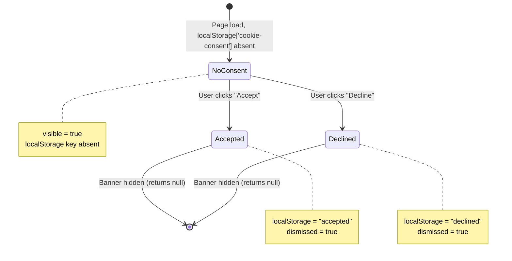
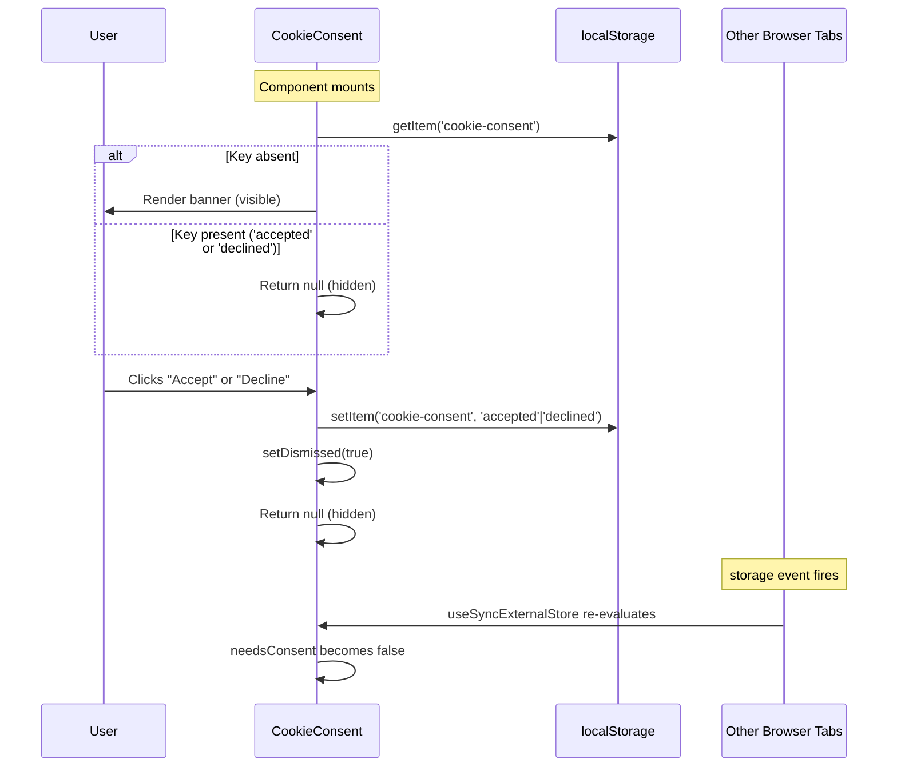

# Cookie Consent Banner: Technical Architecture & Implementation

**Document Basis:** current code at time of generation.

---

## 1. Summary

The Cookie Consent Banner is a GDPR-oriented UI component that displays a fixed bottom banner asking users to accept or decline non-essential cookies. The user's choice is persisted to `localStorage` under the key `cookie-consent`. The banner renders on every page (mounted in the root layout) and hides once the user has made a choice or dismisses it within the current session.

**Current shipped scope:**

- Binary accept/decline consent with localStorage persistence.
- Cross-tab reactivity via `useSyncExternalStore` + `storage` event listener.
- SSR-safe: renders nothing on the server (snapshot returns `false`).
- No granular cookie categories (analytics vs. functional vs. marketing).
- No integration with downstream features -- the consent value is written but never read by any other module.

**Out of scope (not implemented):**

- Reading consent state before firing analytics or loading crime data.
- Consent expiration or re-prompting after a time period.
- Privacy policy link.
- Per-category consent (analytics, functional, marketing).
- Server-side consent enforcement.
- GDPR Article 20/17 endpoints (data portability, right to erasure).

---

## 2. Runtime Placement & Ownership

The `CookieConsent` component is mounted in the root layout (`app/layout.tsx:62`), **outside** the `ConvexAuthNextjsServerProvider` and `ConvexClientProvider` tree. This means:

1. It renders on **every page** of the application -- landing, sign-in, dashboard, and all tab routes.
2. It has **no access** to Convex context, authentication state, or trip data.
3. It is a **standalone, self-contained** client component with no props and no context dependencies.

```
// app/layout.tsx:56-63
<body>
  <ConvexAuthNextjsServerProvider>
    <ConvexClientProvider>{children}</ConvexClientProvider>
  </ConvexAuthNextjsServerProvider>
  <CookieConsent />          {/* <-- mounted here, outside providers */}
  <Analytics />
  ...
</body>
```

**Lifecycle:** The component mounts once per full page load. It self-hides by returning `null` when consent has been recorded (or was previously recorded). There is no unmount/remount behavior tied to route navigation since it lives in the root layout which persists across all navigations.

---

## 3. Module/File Map

| File | Responsibility | Exports | Dependencies | Side Effects |
|---|---|---|---|---|
| `components/CookieConsent.tsx` | Consent banner UI + state logic | `default` (CookieConsent) | `react` (useSyncExternalStore, useCallback, useState), `@/components/ui/button` (Button) | Reads/writes `localStorage['cookie-consent']`; subscribes to `window.storage` events |
| `app/layout.tsx` | Mounts CookieConsent in root layout | `default` (RootLayout), `metadata` | `CookieConsent` (line 6) | Renders banner on all pages |
| `components/ui/button.tsx` | Reusable button primitive | `Button`, `buttonVariants` | `@radix-ui/react-slot`, `class-variance-authority`, `@/lib/utils` | None |
| `app/globals.css` | Design tokens used by banner | N/A (CSS) | Tailwind CSS v4 | Defines `--color-border`, `--color-foreground-secondary` |

---

## 4. State Model & Transitions

The component manages two independent pieces of state:

1. **`needsConsent`** (derived from localStorage via `useSyncExternalStore`) -- whether the `cookie-consent` key exists in localStorage.
2. **`dismissed`** (React `useState`, default `false`) -- whether the user has clicked a button in the current render cycle.

The banner is visible only when `needsConsent === true && dismissed === false`.

### localStorage Values

| Value | Meaning | Set By |
|---|---|---|
| (key absent) | No consent recorded; banner shows | Default state |
| `"accepted"` | User accepted cookies | `accept()` at `CookieConsent.tsx:26` |
| `"declined"` | User declined cookies | `decline()` at `CookieConsent.tsx:31` |

### State Diagram



### Why Both `dismissed` and `needsConsent` Exist

The `dismissed` state provides **instant** visual feedback. Without it, the banner would remain visible until `useSyncExternalStore` re-evaluates (which depends on a `storage` event firing, which only fires for **cross-tab** changes, not same-tab `setItem` calls). The `dismissed` flag ensures the banner hides immediately on click within the same tab.

---

## 5. Interaction & Event Flow

### Sequence Diagram



### Event-to-State Mapping

| User Action | Handler | localStorage Write | React State Change | Visual Result |
|---|---|---|---|---|
| Click "Accept" | `accept()` | `'accepted'` | `dismissed = true` | Banner disappears |
| Click "Decline" | `decline()` | `'declined'` | `dismissed = true` | Banner disappears |
| Clear localStorage (DevTools) | (external) | key removed | `needsConsent = true` (via storage event, cross-tab only) | Banner reappears |
| Open new tab | N/A | N/A | `needsConsent` reads existing value | Banner stays hidden if consent was previously given |

---

## 6. Rendering/Layers/Motion

### Visual Layout

The banner is a full-width fixed bar anchored to the bottom of the viewport.

```
// CookieConsent.tsx:38
<div className="fixed bottom-0 left-0 right-0 z-50 ...">
```

### Styling Constants

| Property | Value | Source |
|---|---|---|
| Position | `fixed`, `bottom-0`, `left-0`, `right-0` | Tailwind classes, `CookieConsent.tsx:38` |
| z-index | `50` (`z-50`) | Tailwind class, `CookieConsent.tsx:38` |
| Background | `#111111` | `bg-[#111111]`, `CookieConsent.tsx:38` |
| Border | `border-t border-border` (resolves to `#2f2f2f`) | `globals.css:18` |
| Text color | `text-foreground-secondary` (resolves to `#8a8a8a`) | `globals.css:11` |
| Font size | `0.82rem` | `text-[0.82rem]`, `CookieConsent.tsx:38` |
| Padding | `px-6 py-3` (24px horizontal, 12px vertical) | Tailwind classes |
| Gap | `gap-4` (16px between text and buttons) | Tailwind class |
| Button gap | `gap-2` (8px between Decline and Accept) | `CookieConsent.tsx:42` |

### Button Variants Used

| Button | Variant | Size | Visual Result |
|---|---|---|---|
| Decline | `secondary` | `sm` | Dark background (`#0A0A0A`), border, muted text. Hover: accent border + green tint. |
| Accept | `default` (implicit) | `sm` | Accent green background (`#00FF88`), dark text (`#0C0C0C`). Hover: brightness 110%. |

Button variant definitions: `components/ui/button.tsx:11-16`, size `sm`: `min-h-[32px] px-2.5 py-1 text-[0.82rem]` at `button.tsx:19`.

### z-index Contract

| Element | z-index | Source |
|---|---|---|
| AppShell header | `z-30` | `AppShell.tsx:37` |
| Landing progress bar | `z-40` | `app/landing/LandingMotion.tsx:57` |
| Landing nav bar | `z-50` | `app/landing/LandingContent.tsx:139` |
| **Cookie Consent banner** | **`z-50`** | **`CookieConsent.tsx:38`** |
| Modal overlay | `z-50` | `components/ui/modal.tsx:30` |
| TripSelector dropdown | `z-50` | `components/TripSelector.tsx:50` |

**Risk:** The Cookie Consent banner, modal overlay, landing nav, and TripSelector dropdown all share `z-50`. Since the banner is `fixed bottom-0` and the modal is `fixed inset-0`, a modal opened while the banner is visible will have the banner painted on top of or at the same layer as the modal backdrop. In practice this is unlikely (the banner auto-dismisses quickly), but if it occurs, paint order depends on DOM order in the document, which places the banner first (layout renders it before modals portaled to `document.body`).

### Animation

**None.** The banner appears and disappears instantly (no enter/exit transitions). There are no CSS animations or motion configs applied.

---

## 7. API & Prop Contracts

### Component API

```tsx
// CookieConsent.tsx:20
export default function CookieConsent(): JSX.Element | null
```

- **Props:** None.
- **Return:** The banner `<div>` when visible, `null` when hidden.
- **Context dependencies:** None (no React context consumed).

### Internal Hook

```tsx
// CookieConsent.tsx:8-18
function useNeedsConsent(): boolean
```

- **Not exported.** Internal to the module.
- **Returns:** `true` if `localStorage.getItem('cookie-consent')` is falsy, `false` otherwise.
- **SSR behavior:** Server snapshot returns `false` (banner never renders during SSR). See `CookieConsent.tsx:16`.
- **Cross-tab sync:** Subscribes to `window.storage` events to detect changes made in other tabs.

### localStorage Contract

| Key | Type | Possible Values | Read By | Written By |
|---|---|---|---|---|
| `cookie-consent` | `string \| null` | `null`, `"accepted"`, `"declined"` | `useNeedsConsent()` | `accept()`, `decline()` |

**Important:** No other module in the codebase reads this key. The consent value is recorded but not acted upon. See Section 9 for implications.

---

## 8. Reliability Invariants

These must remain true after any refactor:

1. **SSR safety:** The component must never access `localStorage` or `window` during server-side rendering. The `useSyncExternalStore` server snapshot (`() => false`) at `CookieConsent.tsx:16` guarantees this.

2. **Idempotent dismiss:** Clicking Accept or Decline multiple times must not cause errors or state corruption. Both handlers unconditionally call `setItem` and `setDismissed(true)`.

3. **Persistence across sessions:** Once a user accepts or declines, the banner must not reappear on subsequent visits (unless localStorage is cleared). This is guaranteed by the `getItem` check in `useNeedsConsent`.

4. **No provider dependency:** The component must function without Convex, auth, or trip context. It is mounted outside all providers in `layout.tsx:62`.

5. **Cross-tab consistency:** If a user accepts consent in Tab A, Tab B must eventually reflect this (via `storage` event). The `useSyncExternalStore` subscription at `CookieConsent.tsx:9-11` ensures this.

---

## 9. Edge Cases & Pitfalls

### Consent Value Is Never Read

**This is the most significant architectural gap.** The `cookie-consent` localStorage key is written but never consumed by any other module. Specifically:

- The **crime data API** (`app/api/crime/route.ts`) does not check consent before fetching crime data.
- The **Vercel Analytics** component (`<Analytics />` in `layout.tsx:63`) loads unconditionally regardless of consent state.
- The **TripProvider** does not gate any behavior on consent.

This means the banner is currently **cosmetic only** -- it records the user's preference but does not enforce it. The expansion plan (`docs/expansion-plan.md:620`) explicitly calls out that cookie consent enforcement is a Tier 2 requirement for EU expansion.

### Same-Tab Storage Event Limitation

The `window.storage` event only fires for changes made in **other tabs/windows**, not the current tab. This is why the `dismissed` state variable exists. Without it, clicking Accept/Decline would write to localStorage but the `useSyncExternalStore` snapshot would not re-evaluate, leaving the banner visible until the next re-render.

### localStorage Unavailable

If localStorage is unavailable (private browsing in some older browsers, storage quota exceeded), `localStorage.getItem` and `localStorage.setItem` will throw. The component has **no try/catch protection**. This would cause a React error boundary to catch the error (or crash the page if no boundary exists).

### Hydration Mismatch Risk

The server snapshot returns `false` (banner hidden), but the client snapshot may return `true` (banner visible) if no consent is recorded. This is a **controlled hydration mismatch** -- `useSyncExternalStore` is specifically designed to handle this case by deferring to the client value after hydration. React 18+ handles this correctly without warnings.

### StatusBar Occlusion

The `StatusBar` component renders as the last child inside `AppShell`'s `<main>` element (`AppShell.tsx:103`). It uses `position: static` (default flow) with `height: 28px`. The Cookie Consent banner is `position: fixed` at `bottom-0`, meaning it will **overlap the StatusBar** when visible. The StatusBar has no z-index and is in normal flow, so the fixed banner paints on top. There is no padding or margin adjustment on `<body>` to compensate for the banner's height.

### No Expiration

The consent value persists indefinitely in localStorage. GDPR guidance generally recommends re-prompting for consent periodically (commonly every 12 months). This is not implemented.

---

## 10. Testing & Verification

### Existing Test Coverage

There are **no tests** for the `CookieConsent` component. The project's test files (located in `lib/` and `convex/`) cover API guards, events, planner logic, crime city config, and auth -- but not UI components.

### Manual Verification Scenarios

| Scenario | Steps | Expected Result |
|---|---|---|
| First visit | Clear localStorage, load any page | Banner appears at bottom of viewport |
| Accept | Click "Accept" | Banner disappears; `localStorage['cookie-consent'] === 'accepted'` |
| Decline | Click "Decline" | Banner disappears; `localStorage['cookie-consent'] === 'declined'` |
| Persistence | Accept/decline, then reload page | Banner does not reappear |
| Cross-tab | Open two tabs; accept in Tab A | Banner disappears in Tab B (may require focus on Tab B) |
| Reset | Clear `cookie-consent` from localStorage in DevTools | Banner reappears on next navigation or tab focus |
| SSR | View page source or disable JS | Banner is not present in server-rendered HTML |

### Command Checks

```bash
# Verify the component exists and has no TypeScript errors
npx tsc --noEmit components/CookieConsent.tsx

# Verify it is imported in layout
grep -n 'CookieConsent' app/layout.tsx

# Verify no other module reads the consent value
grep -rn 'cookie-consent' --include='*.ts' --include='*.tsx' --exclude-dir=node_modules .
# Expected: only CookieConsent.tsx
```

---

## 11. Quick Change Playbook

| If you want to... | Edit... | Notes |
|---|---|---|
| Change the banner copy | `components/CookieConsent.tsx:40` | The `<p>` element containing the consent message |
| Add a privacy policy link | `components/CookieConsent.tsx:40` | Add an `<a>` tag inside the `<p>` |
| Change the localStorage key | `components/CookieConsent.tsx:6` | Update `CONSENT_KEY` constant. Will reset all existing consent. |
| Add consent expiration | `components/CookieConsent.tsx:26,31` | Store a timestamp alongside the value; check it in `useNeedsConsent` |
| Gate analytics on consent | `app/layout.tsx:63` | Conditionally render `<Analytics />` based on consent value. Requires reading localStorage in layout or lifting consent state. |
| Gate crime data on consent | `app/api/crime/route.ts` or the client-side fetch call | Check consent value before fetching. Client-side gating is simpler (read localStorage before calling the API). |
| Add enter/exit animation | `components/CookieConsent.tsx:37-50` | Add CSS transition classes or use `framer-motion`. The instant show/hide is the current behavior. |
| Change z-index | `components/CookieConsent.tsx:38` | Modify `z-50` class. Coordinate with modal (`z-50` in `modal.tsx:30`). |
| Add granular consent categories | `components/CookieConsent.tsx` | Replace binary accept/decline with category checkboxes. Update localStorage schema from string to JSON object. |
| Remove the banner entirely | `app/layout.tsx:6,62` | Delete the import and the `<CookieConsent />` JSX. Optionally delete `components/CookieConsent.tsx`. |
| Fix localStorage error handling | `components/CookieConsent.tsx:15,26,31` | Wrap `localStorage.getItem` and `setItem` calls in try/catch blocks |
| Prevent StatusBar occlusion | `components/AppShell.tsx` or `CookieConsent.tsx` | Add `pb-[44px]` (approx banner height) to body/main when banner is visible, or raise StatusBar z-index |

---

## Appendix: Key Code Snippet

```tsx
// components/CookieConsent.tsx:1-18 -- Full state management logic
'use client';

import { useSyncExternalStore, useCallback, useState } from 'react';
import { Button } from '@/components/ui/button';

const CONSENT_KEY = 'cookie-consent';

function useNeedsConsent() {
  const subscribe = useCallback((cb: () => void) => {
    window.addEventListener('storage', cb);
    return () => window.removeEventListener('storage', cb);
  }, []);
  return useSyncExternalStore(
    subscribe,
    () => !localStorage.getItem(CONSENT_KEY),   // client snapshot
    () => false,                                  // server snapshot (SSR-safe)
  );
}
```
