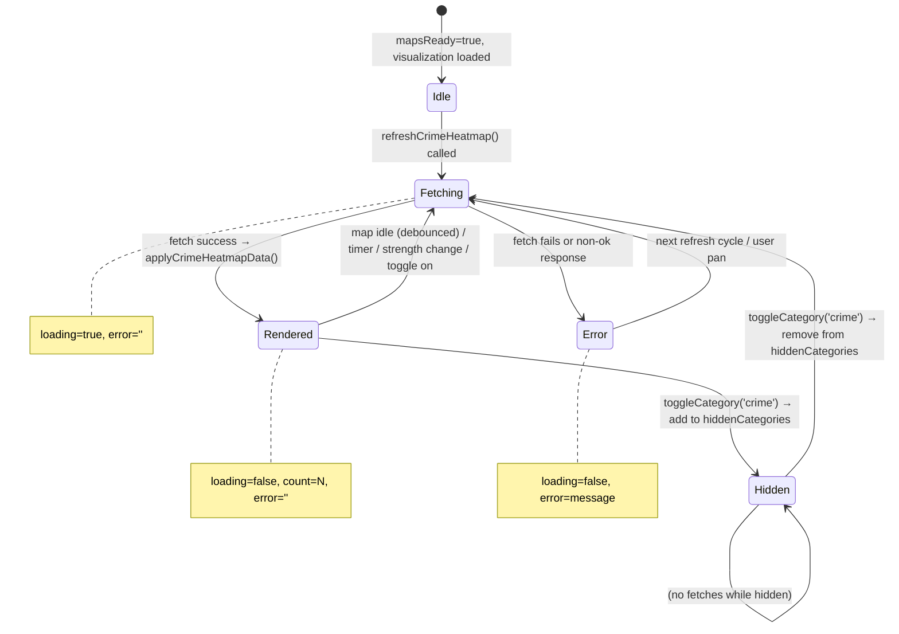
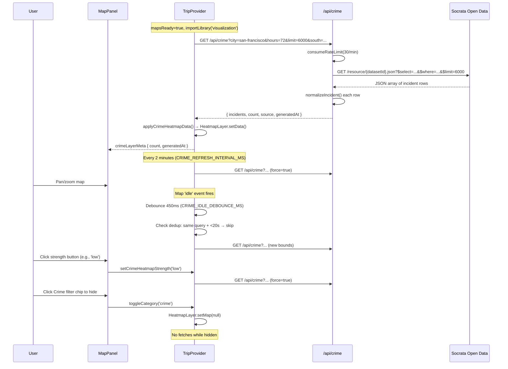

# Crime Heatmap: Technical Architecture & Implementation

> Document Basis: current code at time of generation (2026-03-15).

---

## 1. Summary

The Crime Heatmap feature overlays a real-time, category-weighted heat visualization on the Google Maps instance within the trip planner. It fetches incident data from municipal open-data portals (Socrata-powered) for supported cities, applies severity-based weighting, and renders a `google.maps.visualization.HeatmapLayer` with user-adjustable intensity.

**Shipped scope:**
- Real-time crime incident overlay on Google Maps via `HeatmapLayer`
- 72-hour rolling incident window (configurable up to 7 days via API)
- Category-weighted density: violent crimes produce stronger hotspots
- Three-level adjustable heatmap strength (Low / Medium / High)
- Multi-city adapter registry: San Francisco, New York City, Los Angeles, Chicago
- Viewport-bounded queries (only fetches incidents visible on map)
- Automatic refresh on pan/zoom (debounced) and periodic timer (2 min)
- Server-side rate limiting (30 req/min per IP)
- Client-side deduplication guard (20-second minimum between identical requests)
- Live status badge with animated pulse indicator, incident count, and staleness display

**Out of scope (not implemented):**
- Per-incident click/inspect interaction (no markers, heatmap only)
- Historical trend comparison or time-slider
- Offline/cached fallback for crime data
- User-configurable category filtering in UI

---

## 2. Runtime Placement & Ownership

| Concern | Location | Notes |
|---|---|---|
| API route | `app/api/crime/route.ts` | Next.js Route Handler, `runtime = 'nodejs'`, `dynamic = 'force-dynamic'` |
| City adapter registry | `lib/crime-cities.ts` | Pure config module, no side effects |
| Client state + map integration | `components/providers/TripProvider.tsx` | All crime state, refs, fetch logic, `HeatmapLayer` lifecycle |
| UI controls | `components/MapPanel.tsx` | Filter chip, strength selector, live status badge |
| Rate limiting | `lib/security.ts` | In-memory sliding window, shared across all API routes |

**Lifecycle boundaries:**
- The crime heatmap initializes when `mapsReady` becomes `true` and `google.maps.visualization` is loaded (`TripProvider.tsx:1346`).
- It is destroyed on the effect cleanup of the maps-ready effect (`TripProvider.tsx:1398-1416`).
- The entire feature lives within the `TripProvider` context -- there is no standalone crime module.

---

## 3. Module/File Map

| File | Responsibility | Key Exports | Dependencies | Side Effects |
|---|---|---|---|---|
| `app/api/crime/route.ts` | Server-side crime data proxy | `GET` handler | `lib/security`, `lib/crime-cities` | Fetches upstream Socrata API; rate-limits per IP |
| `lib/crime-cities.ts` | City adapter configuration registry | `CrimeCityConfig`, `CrimeCityFieldMap`, `getCrimeCityConfig`, `getDefaultCrimeCitySlug`, `getAllCrimeCitySlugs` | None | None |
| `components/providers/TripProvider.tsx` | Client-side crime state, fetch orchestration, `HeatmapLayer` management | Exposed via `useTrip()`: `crimeLayerMeta`, `crimeHeatmapStrength`, `setCrimeHeatmapStrength` | Google Maps JS API (visualization library) | `setInterval` timer, map `idle` listener, `fetch` calls |
| `components/MapPanel.tsx` | Crime toggle chip, strength selector panel, live status text | `MapPanel` (default) | `TripProvider` via `useTrip()` | None |
| `lib/security.ts` | IP-based rate limiting | `consumeRateLimit`, `getRequestRateLimitIp` | None | In-memory `Map` for rate limit state |

---

## 4. State Model & Transitions

### 4.1 Client-Side State

```
// TripProvider.tsx:119-131
type CrimeLayerMeta = {
  loading: boolean;
  count: number;
  generatedAt: string;  // ISO timestamp from server
  error: string;
};

// Defaults
const EMPTY_CRIME_LAYER_META: CrimeLayerMeta = {
  loading: false, count: 0, generatedAt: '', error: ''
};
```

**State atoms** (`TripProvider.tsx:250-251`):
- `crimeLayerMeta: CrimeLayerMeta` -- loading/count/error/timestamp
- `crimeHeatmapStrength: 'low' | 'medium' | 'high'` -- defaults to `'high'`

**Refs** (`TripProvider.tsx:237-241`):
- `crimeHeatmapRef` -- the `google.maps.visualization.HeatmapLayer` instance
- `crimeRefreshTimerRef` -- handle for the 2-minute periodic refresh `setInterval`
- `crimeIdleListenerRef` -- handle for the Google Maps `idle` event listener
- `lastCrimeFetchAtRef` -- timestamp of last successful fetch (dedup guard)
- `lastCrimeQueryRef` -- last request URL string (dedup guard)

### 4.2 Visibility Toggle

Crime visibility is managed through `hiddenCategories: Set<string>` (`TripProvider.tsx:264`). The `toggleCategory('crime')` callback (`TripProvider.tsx:1678-1685`) adds or removes `'crime'` from the set. Two effects respond:

1. **Category visibility effect** (`TripProvider.tsx:878-888`): When `hiddenCategories` changes, attaches/detaches the heatmap layer from the map. If crime becomes visible, triggers a forced refresh.
2. **Strength change effect** (`TripProvider.tsx:890-893`): When `crimeHeatmapStrength` changes and crime is visible, triggers a forced refresh.

### 4.3 State Diagram



---

## 5. Interaction & Event Flow

### 5.1 Sequence Diagram -- Initial Load & Refresh Cycle



### 5.2 Event-to-Action Map

| User Action | Handler | State Change | Visual Effect |
|---|---|---|---|
| Click "Crime Live" chip | `toggleCategory('crime')` | Toggle `'crime'` in `hiddenCategories` | Show/hide heatmap layer + control panel |
| Click Low/Medium/High button | `setCrimeHeatmapStrength(level)` | Update `crimeHeatmapStrength` | Re-render heatmap with new profile; force-refresh data |
| Pan or zoom map | Google Maps `idle` listener | Triggers debounced `refreshCrimeHeatmap()` | Heatmap updates for new viewport |
| (Automatic) 2-min timer | `setInterval` callback | Force-refresh crime data | Fresh data rendered |

---

## 6. Rendering / Layers / Motion

### 6.1 HeatmapLayer Configuration

The heatmap is rendered via `google.maps.visualization.HeatmapLayer` (`TripProvider.tsx:710`):

```typescript
// TripProvider.tsx:710-716
new window.google.maps.visualization.HeatmapLayer({
  data: weightedPoints,
  dissipating: true,
  radius,
  opacity: profile.opacity,
  maxIntensity: profile.maxIntensity,
  gradient: CRIME_HEATMAP_GRADIENT
});
```

### 6.2 Gradient

Seven-stop gradient from transparent to deep crimson (`TripProvider.tsx:57-65`):

| Stop | RGBA |
|---|---|
| 0 | `rgba(0, 0, 0, 0)` |
| 1 | `rgba(254, 202, 202, 0.06)` |
| 2 | `rgba(248, 113, 113, 0.22)` |
| 3 | `rgba(239, 68, 68, 0.45)` |
| 4 | `rgba(225, 29, 72, 0.68)` |
| 5 | `rgba(159, 18, 57, 0.86)` |
| 6 | `rgba(127, 29, 29, 0.96)` |

### 6.3 Strength Profiles

Three presets defined in `getCrimeHeatmapProfile()` (`TripProvider.tsx:89-97`):

| Strength | `weightMultiplier` | `opacity` | `maxIntensity` | `radiusScale` |
|---|---|---|---|---|
| `high` | 1.85 | 0.90 | 2.9 | 1.08 |
| `medium` | 1.45 | 0.84 | 3.3 | 1.00 |
| `low` | 1.15 | 0.72 | 4.9 | 0.90 |

**Design note:** Lower `maxIntensity` at `high` strength means the layer saturates faster (appears more intense). Higher `maxIntensity` at `low` requires more incidents to reach full color.

### 6.4 Radius Calculation

Zoom-adaptive radius (`TripProvider.tsx:84-87`):

```typescript
function getCrimeHeatmapRadiusForZoom(zoom) {
  const zoomLevel = Number.isFinite(zoom) ? Number(zoom) : 12;
  return Math.max(16, Math.min(34, Math.round(46 - zoomLevel * 1.9)));
}
```

At zoom 12 (default): `46 - 12*1.9 = 23.2` -> radius 23 pixels (before `radiusScale`).
Final radius: `Math.max(12, Math.round(baseRadius * profile.radiusScale))` (`TripProvider.tsx:695`).

### 6.5 Category Weighting

`getCrimeCategoryWeight()` (`TripProvider.tsx:71-82`) assigns severity multipliers:

| Category Pattern | Weight |
|---|---|
| homicide, murder, human trafficking | 4.2 |
| rape, sex offense, sex crime | 3.8 |
| assault, robbery | 3.2 |
| weapons, arson, kidnapping | 2.8 |
| burglary, motor vehicle theft | 2.3 |
| theft, larceny | 1.8 |
| vandalism, criminal mischief, criminal damage | 1.6 |
| All other categories | 1.2 |

Final point weight: `getCrimeCategoryWeight(category) * profile.weightMultiplier`.

### 6.6 UI Control Panel

When crime is visible, a floating panel renders at `absolute top-3 right-3 z-20` (`MapPanel.tsx:106`):
- Animated pulse indicator (CSS `animate-ping` on `#FF4444` dot)
- "CRIME LIVE" label with ON badge
- Three strength toggle buttons (Low / Medium / High)
- Gradient bar (`from-[#FF8800] via-[#FF4444] to-[#7f1d1d]`)
- Status text: incident count, 72h window, and staleness (e.g., "updated 3m ago")

### 6.7 Design Tokens

| Token | Value | Source |
|---|---|---|
| `CRIME_COLOR` | `#FF4444` | `MapPanel.tsx:9` |
| `--color-danger` | `#FF4444` | `globals.css:23` |
| `--color-danger-light` | `rgba(255, 68, 68, 0.08)` | `globals.css:24` |

---

## 7. API & Prop Contracts

### 7.1 Server API: `GET /api/crime`

**Request parameters** (all query string):

| Param | Type | Default | Range | Description |
|---|---|---|---|---|
| `city` | string | `'san-francisco'` | Any registered slug | City adapter to use |
| `hours` | integer | 24 | 1 - 168 (7 days) | Lookback window |
| `limit` | integer | 4000 | 200 - 10,000 | Max incident rows from upstream |
| `south` | float | -- | -90 to 90 | Viewport bounds (optional) |
| `west` | float | -- | -180 to 180 | Viewport bounds (optional) |
| `north` | float | -- | -90 to 90 | Viewport bounds (optional) |
| `east` | float | -- | -180 to 180 | Viewport bounds (optional) |

**Note:** The client always requests `hours=72` and `limit=6000` (`TripProvider.tsx:51-52`), overriding the server defaults of 24 and 4000.

**Success response** (200):

```json
{
  "incidents": [
    {
      "lat": 37.7749,
      "lng": -122.4194,
      "incidentDatetime": "2026-03-14T15:30:00",
      "incidentCategory": "Assault",
      "incidentSubcategory": "Aggravated Assault",
      "neighborhood": "Mission"
    }
  ],
  "hours": 72,
  "limit": 6000,
  "count": 1423,
  "source": {
    "provider": "SF Open Data",
    "datasetId": "wg3w-h783",
    "datasetUrl": "https://data.sfgov.org/d/wg3w-h783"
  },
  "bounds": { "south": 37.7, "west": -122.5, "north": 37.8, "east": -122.3 },
  "generatedAt": "2026-03-15T12:00:00.000Z"
}
```

**Error responses:**

| Status | Condition | Body |
|---|---|---|
| 400 | Unknown city slug | `{ "error": "Unsupported city: atlantis" }` |
| 429 | Rate limit exceeded (30/min/IP) | `{ "error": "Too many crime data requests..." }` + `Retry-After` header |
| 502 | Upstream Socrata API failure | `{ "error": "Upstream SF Open Data... failed (status)", "details": "..." }` |

**Caching:** `Cache-Control: public, s-maxage=60, stale-while-revalidate=120` on success. Upstream fetch uses `next: { revalidate: 60 }` for ISR.

### 7.2 City Adapter Config Shape

```typescript
// lib/crime-cities.ts:1-21
type CrimeCityFieldMap = {
  datetime: string;
  category: string;
  subcategory: string;
  neighborhood: string;
  latitude: string;
  longitude: string;
};

type CrimeCityConfig = {
  slug: string;
  label: string;
  host: string;          // Socrata domain
  datasetId: string;     // Socrata 4x4 identifier
  fields: CrimeCityFieldMap;
  excludedCategories: string[];
  appTokenEnvVar: string;
  dateFilterField: string;
  providerName: string;
  portalBaseUrl: string;
};
```

### 7.3 Registered Cities

| Slug | Host | Dataset ID | App Token Env Var | Excluded Categories |
|---|---|---|---|---|
| `san-francisco` | `data.sfgov.org` | `wg3w-h783` | `SFGOV_APP_TOKEN` | Non-Criminal, Case Closure, Lost Property, Courtesy Report, Recovered Vehicle |
| `new-york` | `data.cityofnewyork.us` | `5uac-w243` | `NYC_APP_TOKEN` | (none) |
| `los-angeles` | `data.lacity.org` | `2nrs-mtv8` | `LA_APP_TOKEN` | (none) |
| `chicago` | `data.cityofchicago.org` | `ijzp-q8t2` | `CHICAGO_APP_TOKEN` | NON-CRIMINAL, NON - CRIMINAL, NON-CRIMINAL (SUBJECT SPECIFIED) |

**Field mapping quirk:** LA uses `lat`/`lon` for coordinates while all other cities use `latitude`/`longitude` (`crime-cities.ts:78-79`). SF has a separate `dateFilterField` (`incident_date`) distinct from its `datetime` field (`incident_datetime`) (`crime-cities.ts:45`).

### 7.4 Context API (via `useTrip()`)

| Property | Type | Description |
|---|---|---|
| `crimeLayerMeta` | `CrimeLayerMeta` | Read-only loading/count/error/generatedAt |
| `crimeHeatmapStrength` | `string` | Current strength: `'low'`, `'medium'`, or `'high'` |
| `setCrimeHeatmapStrength` | `(s: string) => void` | Setter for strength level |
| `hiddenCategories` | `Set<string>` | Contains `'crime'` when layer is hidden |
| `toggleCategory` | `(cat: string) => void` | Toggle visibility of any category including `'crime'` |

---

## 8. Reliability Invariants

These must remain true after any refactor:

1. **Rate limit is enforced before any upstream call.** `consumeRateLimit` is called at the top of the `GET` handler before query construction (`route.ts:95-112`).

2. **Null coordinates never enter the heatmap.** Both server-side `normalizeIncident` (`route.ts:81`) and client-side `applyCrimeHeatmapData` (`TripProvider.tsx:701`) reject non-finite lat/lng.

3. **The heatmap layer is detached on cleanup.** The effect at `TripProvider.tsx:1398-1416` clears the interval timer, removes the idle listener, and calls `crimeHeatmapRef.current.setMap(null)`.

4. **No fetch fires while crime is hidden.** The idle listener check and strength-change effect both guard on `hiddenCategories.has('crime')` (`TripProvider.tsx:885, 891`).

5. **Bounds validation rejects degenerate rectangles.** `parseCrimeBounds` requires `south < north` and `west < east` (`route.ts:45-46`).

6. **SQL injection is mitigated via `sqlStringLiteral`.** Category exclusions are escaped with single-quote doubling (`route.ts:36-37`). Bounds are numeric-only (parsed via `clampFloat`).

7. **Client-side deduplication prevents stampede.** Identical query URLs within 20 seconds are skipped unless `force=true` (`TripProvider.tsx:740-743`).

8. **Default city is always `'san-francisco'`.** Both server (`route.ts:115` via `getDefaultCrimeCitySlug()`) and client (`TripProvider.tsx:67, 738`) fall back to this slug.

---

## 9. Edge Cases & Pitfalls

| Scenario | Behavior | Source |
|---|---|---|
| **App token env var missing** | Request proceeds without `X-App-Token` header; Socrata may throttle or reject | `route.ts:152-155` |
| **Upstream returns non-JSON** | `rows` defaults to `[]`, no incidents rendered, no error surfaced to user | `route.ts:173` |
| **All incidents filtered by category exclusion** | Empty heatmap, `count=0`, status shows "0 incidents in last 72h" | Normal flow |
| **Map bounds not available yet** | `buildCrimeBoundsQuery` returns `''`, fetch runs without bounds (global query) | `TripProvider.tsx:99-117` |
| **Rapid pan/zoom** | Debounced at 450ms; dedup guard rejects same-URL requests within 20s | `TripProvider.tsx:54-55, 740-743` |
| **Rate limit hit (429)** | Error propagated to `crimeLayerMeta.error`, displayed in red status text | `TripProvider.tsx:752-753` |
| **LA lat/lon field names** | Field map uses `lat`/`lon` instead of `latitude`/`longitude`; mismatched config would silently produce empty results | `crime-cities.ts:78-79` |
| **SF dateFilterField != datetime field** | `incident_date` is used in the WHERE clause (date-truncated), `incident_datetime` is used for SELECT and ordering; conflating them would cause empty results or incorrect filtering | `crime-cities.ts:29-30, 45` |
| **Chicago category casing** | Excluded categories are uppercase (`NON-CRIMINAL`); case mismatch in exclusion list would let non-criminal incidents through | `crime-cities.ts:100-104` |
| **Timezone not applied to crime timestamps** | `since` is computed in UTC (`Date.now() - hours * ms`); cities in different timezones may show slightly different effective windows | `route.ts:128` |
| **Max 10,000 rows from Socrata** | Client requests 6,000 but API caps at 10,000; dense cities during long windows could truncate results silently | `route.ts:14` |

---

## 10. Testing & Verification

### 10.1 Existing Tests

**`lib/crime-cities.test.mjs`** -- 11 test cases using Node.js built-in test runner:
- Default slug is `san-francisco`
- All 4 city slugs are registered
- Unknown city returns `undefined`
- Each city has all required config fields
- Each city has lat/lng/datetime/category field mappings
- Each city's slug matches its registry key
- Each city's portal URL starts with `https://`
- LA uses `lat`/`lon` field names
- SF has separate `dateFilterField` from `datetime`
- SF and Chicago exclude non-criminal categories
- NYC and LA have no excluded categories

Run: `node --test lib/crime-cities.test.mjs`

### 10.2 Manual Verification Scenarios

| Scenario | Steps | Expected |
|---|---|---|
| Crime layer loads on app start | Open app with map visible | Heatmap overlay appears; status shows incident count |
| Toggle crime off/on | Click "Crime Live" chip | Layer disappears/reappears; no fetch while hidden |
| Change strength | Click Low/Medium/High in panel | Heatmap intensity visibly changes |
| Pan to new area | Drag map significantly | After ~450ms idle, new data loads for visible bounds |
| Rate limit | Send 31+ requests in 60s | 429 error shown in status text |
| Unsupported city | `curl /api/crime?city=atlantis` | 400 with "Unsupported city" |
| API direct test | `curl "/api/crime?city=san-francisco&hours=72&limit=100"` | JSON with `incidents` array, `count`, `source` |

---

## 11. Quick Change Playbook

| Change | Files to Edit | Notes |
|---|---|---|
| **Add a new city** | `lib/crime-cities.ts` -- add entry to `CRIME_CITIES` record | Must map all `CrimeCityFieldMap` fields to the city's Socrata schema. Add env var for app token. Tests will catch missing fields if updated. |
| **Change default time window** | `TripProvider.tsx:51` (`CRIME_HEATMAP_HOURS`) | Server default is 24h (`route.ts:11`) but client overrides to 72h. Change client constant. |
| **Change max incidents** | `TripProvider.tsx:52` (`CRIME_HEATMAP_LIMIT`) and/or `route.ts:14` (`MAX_LIMIT`) | Client requests 6,000; server caps at 10,000. |
| **Adjust heatmap color** | `TripProvider.tsx:57-65` (`CRIME_HEATMAP_GRADIENT`) | 7-stop RGBA array passed to `HeatmapLayer`. |
| **Adjust strength presets** | `TripProvider.tsx:89-97` (`getCrimeHeatmapProfile`) | Modify `weightMultiplier`, `opacity`, `maxIntensity`, `radiusScale`. |
| **Adjust category weights** | `TripProvider.tsx:71-82` (`getCrimeCategoryWeight`) | Keyword-match cascade; order matters (first match wins). |
| **Change refresh interval** | `TripProvider.tsx:53` (`CRIME_REFRESH_INTERVAL_MS`) | Currently 2 minutes. Also consider `CRIME_IDLE_DEBOUNCE_MS` (450ms) and `CRIME_MIN_REQUEST_INTERVAL_MS` (20s). |
| **Change rate limit** | `route.ts:97-98` | Currently 30 requests per 60,000ms per IP. |
| **Exclude more crime categories** | `lib/crime-cities.ts` | Add strings to city's `excludedCategories` array. Must match upstream category names exactly (case-sensitive). |
| **Change UI badge/panel** | `components/MapPanel.tsx:106-141` | Floating panel with z-20. Modify positioning, colors, or add new controls. |
| **Change default city fallback** | `lib/crime-cities.ts:112` and `TripProvider.tsx:67` | Both must stay in sync. |

---

## Appendix: Timing Constants Truth Table

| Constant | Value | Location | Purpose |
|---|---|---|---|
| `CRIME_HEATMAP_HOURS` | `72` | `TripProvider.tsx:51` | Client-side lookback window for API request |
| `CRIME_HEATMAP_LIMIT` | `6000` | `TripProvider.tsx:52` | Max incidents requested from API |
| `CRIME_REFRESH_INTERVAL_MS` | `120000` (2 min) | `TripProvider.tsx:53` | Periodic forced refresh timer |
| `CRIME_IDLE_DEBOUNCE_MS` | `450` | `TripProvider.tsx:54` | Debounce after map pan/zoom idle event |
| `CRIME_MIN_REQUEST_INTERVAL_MS` | `20000` (20s) | `TripProvider.tsx:55` | Minimum gap between identical non-forced requests |
| `DEFAULT_CRIME_HEATMAP_STRENGTH` | `'high'` | `TripProvider.tsx:56` | Initial strength preset |
| `DEFAULT_HOURS` (server) | `24` | `route.ts:11` | Server fallback if `hours` param omitted |
| `MAX_HOURS` (server) | `168` (7 days) | `route.ts:12` | Maximum allowed lookback |
| `DEFAULT_LIMIT` (server) | `4000` | `route.ts:13` | Server fallback if `limit` param omitted |
| `MAX_LIMIT` (server) | `10000` | `route.ts:14` | Maximum allowed incident limit |
| Rate limit | `30 req / 60s / IP` | `route.ts:97-98` | Server-side rate limiter |
| Cache TTL | `s-maxage=60, stale-while-revalidate=120` | `route.ts:194` | CDN/proxy cache headers |
| Upstream revalidate | `60s` | `route.ts:159` | Next.js ISR revalidation for Socrata fetch |
