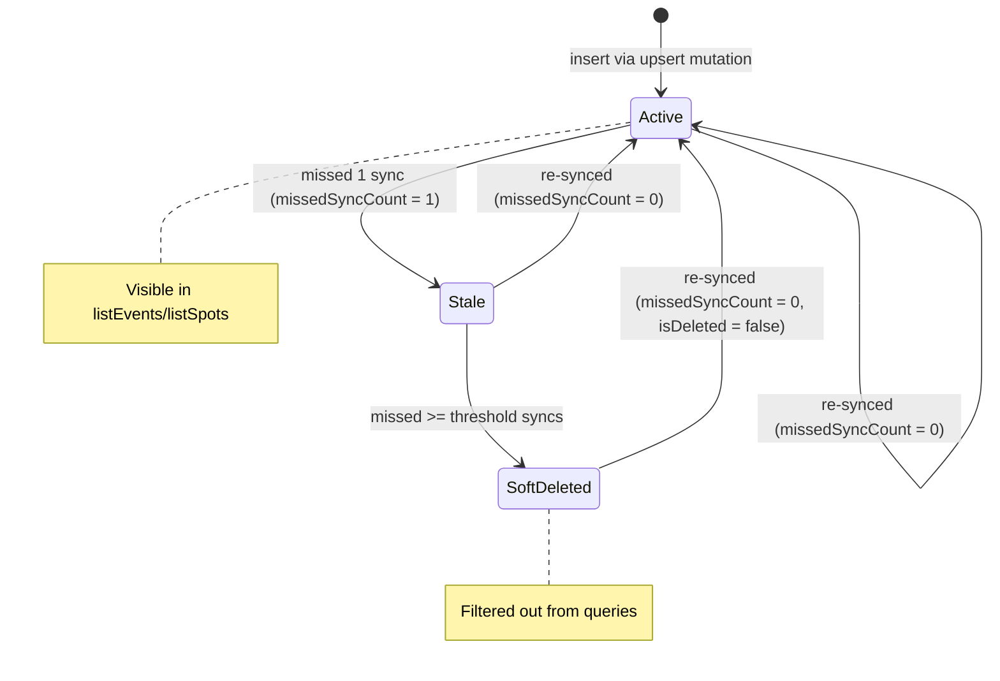
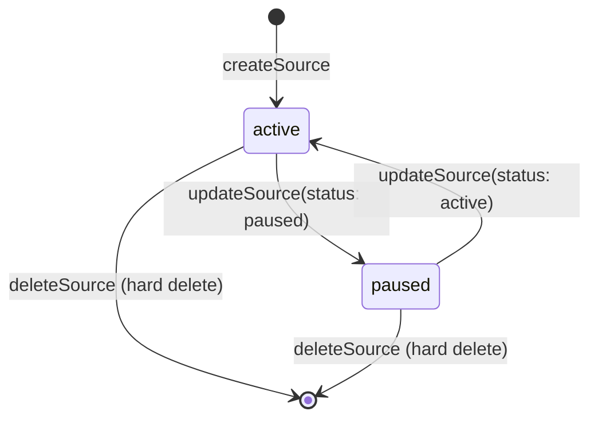
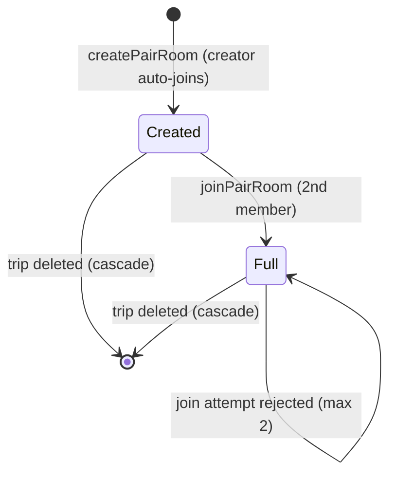
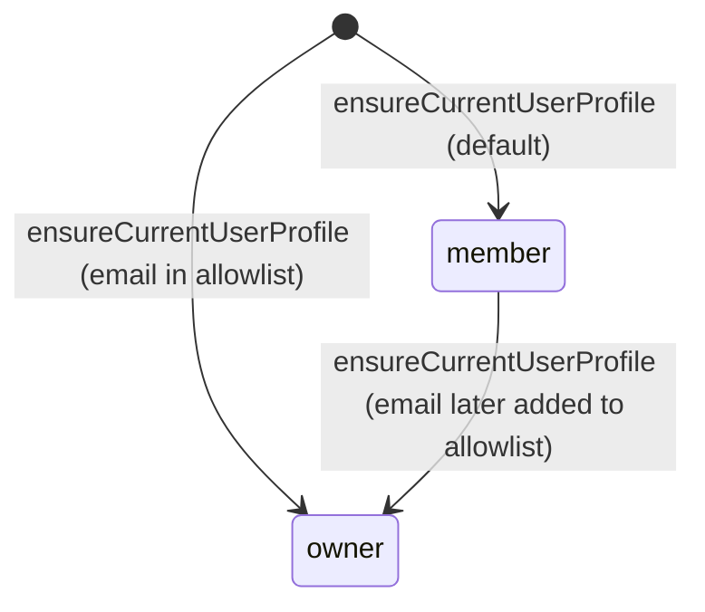
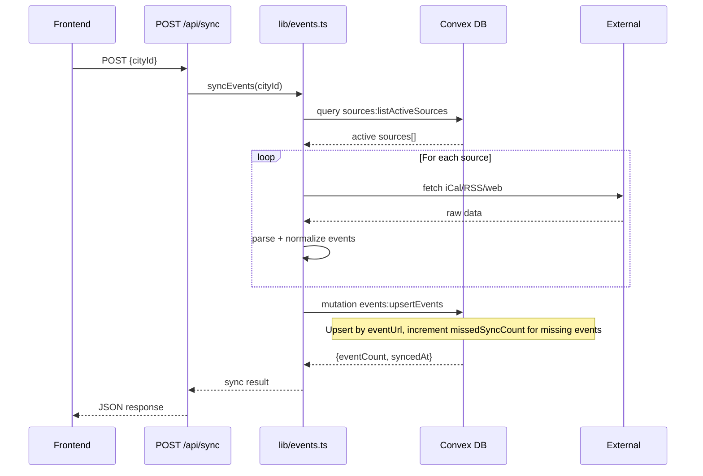
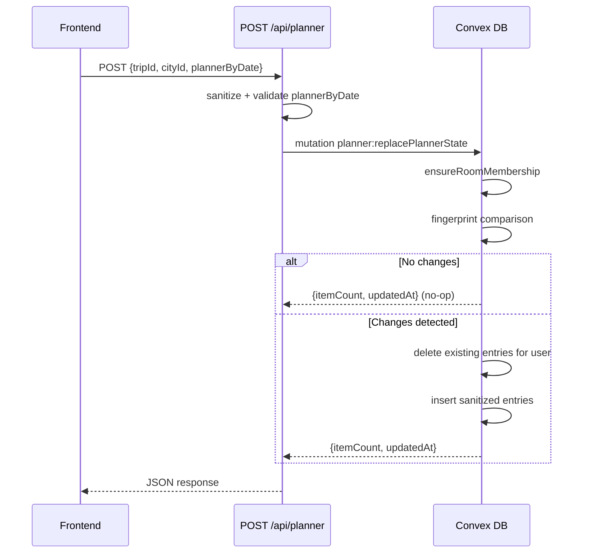

# Database Schema & Data Model: Technical Architecture & Implementation

Document Basis: current code at time of generation.

---

## 1. Summary

The Trip Planner application uses **Convex** as its backend database and serverless function layer. The schema defines **14 application tables** plus auth tables provided by `@convex-dev/auth`. Together they model a multi-city trip planning system with collaborative pairing, external data ingestion (events, spots, sources), geocoding/route caching, and role-based access control.

**Current shipped scope:**

- Multi-city trips with date-ranged legs
- Per-trip configuration (timezone, dates, base location)
- Collaborative day planning via pair rooms (2-person max)
- Event and spot ingestion from external sources (iCal, RSS, web scraping)
- Geocode and route caching against Google Maps APIs
- Role-based access: `owner` vs `member`
- Soft-delete via `missedSyncCount` / `isDeleted` pattern for events and spots
- Shared `syncMeta` table tracking last sync state for both events and spots

**Out of scope (not in schema):**

- Crime data (fetched live from Socrata APIs, not persisted in Convex)
- Google Maps API keys (environment variables, not DB)
- Session/token storage (handled by `@convex-dev/auth` internal tables)

---

## 2. Runtime Placement & Ownership

| Layer | Responsibility | Key files |
|-------|---------------|-----------|
| **Schema definition** | Single source of truth for all table shapes and indexes | `convex/schema.ts` |
| **Convex functions** | Server-side queries and mutations per domain | `convex/events.ts`, `convex/spots.ts`, `convex/sources.ts`, `convex/planner.ts`, `convex/trips.ts`, `convex/cities.ts`, `convex/tripConfig.ts`, `convex/routeCache.ts`, `convex/appUsers.ts`, `convex/seed.ts` |
| **Auth & authz** | Authentication (magic link via Resend) and role checks | `convex/auth.ts`, `convex/authz.ts`, `convex/ownerRole.ts` |
| **Next.js API routes** | HTTP facade proxying to Convex mutations/queries | `app/api/*/route.ts` |
| **Lib layer** | Data transformation, ingestion orchestration, caching | `lib/events.ts`, `lib/planner-api.ts`, `lib/pair-api.ts`, `lib/request-auth.ts`, `lib/api-guards.ts` |
| **Frontend state** | Monolithic context consuming API routes | `components/providers/TripProvider.tsx` |

The schema is consumed exclusively through Convex's generated typed API. All reads are `query` functions (real-time reactive) and all writes are `mutation` functions (transactional).

---

## 3. Module/File Map

| File | Responsibility | Exports | Dependencies | Side Effects |
|------|---------------|---------|-------------|-------------|
| `convex/schema.ts` | Schema definition | `default` (schema) | `@convex-dev/auth/server`, `convex/server`, `convex/values` | Defines all tables + indexes |
| `convex/events.ts` | Events + geocode + syncMeta CRUD | `listEvents`, `getSyncMeta`, `getGeocodeByAddressKey`, `upsertGeocode`, `upsertEvents` | `authz` | Writes to `events`, `geocodeCache`, `syncMeta` |
| `convex/spots.ts` | Spots CRUD + sync | `listSpots`, `getSyncMeta`, `upsertSpots` | `authz` | Writes to `spots`, `syncMeta` |
| `convex/sources.ts` | Source management | `listSources`, `listActiveSources`, `createSource`, `updateSource`, `deleteSource` | `authz` | Writes to `sources` |
| `convex/planner.ts` | Planner entries + pair rooms | `getPlannerState`, `replacePlannerState`, `createPairRoom`, `joinPairRoom`, `listMyPairRooms` | `@convex-dev/auth/server` | Writes to `plannerEntries`, `pairRooms`, `pairMembers` |
| `convex/trips.ts` | Trip CRUD | `listMyTrips`, `getTrip`, `createTrip`, `updateTrip`, `deleteTrip` | `authz`, reads `cities`, `tripConfig` | Cascade-deletes `tripConfig`, `plannerEntries`, `pairRooms`, `pairMembers` |
| `convex/cities.ts` | City CRUD | `listCities`, `getCity`, `createCity`, `updateCity` | `authz` | Writes to `cities` |
| `convex/tripConfig.ts` | Trip config upsert | `getTripConfig`, `saveTripConfig` | `authz` | Writes to `tripConfig` |
| `convex/routeCache.ts` | Route cache upsert | `getRouteByKey`, `upsertRouteByKey` | `authz` | Writes to `routeCache` |
| `convex/appUsers.ts` | User profile management | `ensureCurrentUserProfile`, `getCurrentUserProfile` | `@convex-dev/auth/server`, `ownerRole` | Writes to `userProfiles` |
| `convex/seed.ts` | Initial city data seeding | `seedInitialData`, `seedInitialDataInternal` | `authz` | Inserts into `cities` |
| `convex/authz.ts` | Auth guard functions | `requireAuthenticatedUserId`, `requireOwnerUserId` | `@convex-dev/auth/server` | Reads `userProfiles` |
| `convex/ownerRole.ts` | Owner email allowlist logic | `parseOwnerEmailAllowlist`, `resolveInitialUserRole` | none | Pure functions |

---

## 4. Complete Table Reference

### 4.1 Auth Tables (from `@convex-dev/auth`)

Spread via `...authTables` at `convex/schema.ts:6`. These tables (`users`, `sessions`, `accounts`, `authRateLimits`, etc.) are managed by the `@convex-dev/auth` library and are not directly modified by application code.

### 4.2 `cities`

**Purpose:** Registry of supported cities with map configuration and crime adapter binding.

```
convex/schema.ts:10-30
```

| Field | Type | Required | Description |
|-------|------|----------|-------------|
| `slug` | `string` | yes | URL-safe unique identifier (e.g., `"san-francisco"`) |
| `name` | `string` | yes | Display name |
| `timezone` | `string` | yes | IANA timezone (e.g., `"America/Los_Angeles"`) |
| `locale` | `string` | yes | BCP 47 locale (e.g., `"en-US"`) |
| `mapCenter` | `{lat, lng}` | yes | Default map center coordinates |
| `mapBounds` | `{north, south, east, west}` | yes | Map viewport bounding box |
| `crimeAdapterId` | `string` | yes | Crime data adapter key (empty string if none) |
| `isSeeded` | `boolean` | yes | Whether city was created by seed script |
| `createdByUserId` | `string` | yes | User ID or `"system"` for seeded cities |
| `createdAt` | `string` | yes | ISO 8601 timestamp |
| `updatedAt` | `string` | yes | ISO 8601 timestamp |

**Indexes:**

| Name | Fields | Usage |
|------|--------|-------|
| `by_slug` | `['slug']` | Unique city lookup, slug uniqueness enforcement |

**Key behaviors:**
- Slug uniqueness enforced at mutation level (`convex/cities.ts:76-78`): throws `"City with slug already exists"`.
- Seeded with 6 initial cities via `convex/seed.ts:5-60` (SF, NYC, LA, Chicago, London, Tokyo).
- `lib/city-registry.ts` contains a static duplicate of city data (8 cities including Paris and Barcelona) used by the trips API route to auto-ensure cities exist before trip creation (`app/api/trips/route.ts:40-55`).

---

### 4.3 `trips`

**Purpose:** User-owned trip containers with multi-city legs.

```
convex/schema.ts:32-44
```

| Field | Type | Required | Description |
|-------|------|----------|-------------|
| `userId` | `string` | yes | Owning user's ID |
| `name` | `string` | yes | Trip display name |
| `legs` | `array` | yes | Ordered city stops (see below) |
| `createdAt` | `string` | yes | ISO 8601 timestamp |
| `updatedAt` | `string` | yes | ISO 8601 timestamp |

**Leg schema:** `{ cityId: string, startDate: string, endDate: string }`

**Indexes:**

| Name | Fields | Usage |
|------|--------|-------|
| `by_user` | `['userId']` | List trips for authenticated user |

**Key behaviors:**
- Minimum one leg required (`convex/trips.ts:69-71`).
- `createTrip` auto-creates a `tripConfig` from the first leg's city timezone (`convex/trips.ts:82-94`).
- `deleteTrip` performs cascade deletion of: `tripConfig`, all `plannerEntries`, all `pairRooms` and their `pairMembers` (`convex/trips.ts:136-181`).
- `getTrip` grants access to trip owner AND pair room members (`convex/trips.ts:44-52`).
- `legs[].cityId` is a city slug (string), not a Convex `Id<'cities'>`.

---

### 4.4 `tripConfig`

**Purpose:** Per-trip configuration for timezone, date range, and base location.

```
convex/schema.ts:209-216
```

| Field | Type | Required | Description |
|-------|------|----------|-------------|
| `tripId` | `Id<'trips'>` | yes | Foreign key to trips table |
| `timezone` | `string` | yes | IANA timezone |
| `tripStart` | `string` | yes | ISO date (YYYY-MM-DD) |
| `tripEnd` | `string` | yes | ISO date (YYYY-MM-DD) |
| `baseLocation` | `string` | optional | Free-text base location (e.g., hotel address) |
| `updatedAt` | `string` | yes | ISO 8601 timestamp |

**Indexes:**

| Name | Fields | Usage |
|------|--------|-------|
| `by_trip` | `['tripId']` | 1:1 lookup by trip |

**Key behaviors:**
- Created automatically when a trip is created (`convex/trips.ts:88-94`).
- `saveTripConfig` is an upsert: creates if missing, patches only changed fields (`convex/tripConfig.ts:45-96`).
- `getTripConfig` returns fallback defaults if no row exists: `{ timezone: 'UTC', tripStart: '', tripEnd: '', baseLocation: '' }` (`convex/tripConfig.ts:31`).
- Write access restricted to `owner` role.

---

### 4.5 `events`

**Purpose:** Calendar events ingested from external sources (iCal feeds, RSS, web scraping).

```
convex/schema.ts:129-152
```

| Field | Type | Required | Description |
|-------|------|----------|-------------|
| `cityId` | `string` | yes | City slug |
| `id` | `string` | yes | Stable event identifier |
| `name` | `string` | yes | Event title |
| `description` | `string` | yes | Event description |
| `eventUrl` | `string` | yes | Canonical event URL (used for dedup) |
| `startDateTimeText` | `string` | yes | Human-readable date/time |
| `startDateISO` | `string` | yes | ISO date for sorting |
| `locationText` | `string` | yes | Venue/location display text |
| `address` | `string` | yes | Street address |
| `googleMapsUrl` | `string` | yes | Google Maps link |
| `lat` | `number` | optional | Latitude |
| `lng` | `number` | optional | Longitude |
| `sourceId` | `string` | optional | ID of the source that produced this event |
| `sourceUrl` | `string` | optional | URL of the source |
| `confidence` | `number` | optional | Extraction confidence score |
| `missedSyncCount` | `number` | optional | Times event was absent from sync |
| `isDeleted` | `boolean` | optional | Soft-delete flag |
| `lastSeenAt` | `string` | optional | Last sync timestamp where event appeared |
| `updatedAt` | `string` | optional | Last modification timestamp |

**Indexes:**

| Name | Fields | Usage |
|------|--------|-------|
| `by_city` | `['cityId']` | List all events for a city |
| `by_city_event_url` | `['cityId', 'eventUrl']` | Dedup events by URL within a city |
| `by_city_source` | `['cityId', 'sourceId']` | Filter events by source |

**Key behaviors:**
- **Soft-delete pattern**: Events not present in a sync get their `missedSyncCount` incremented. When `missedSyncCount >= missedSyncThreshold` (default: 2), `isDeleted` is set to `true` (`convex/events.ts:196-207`).
- `listEvents` filters out `isDeleted === true` events and sorts by `startDateISO` ascending (`convex/events.ts:75-83`).
- `upsertEvents` deduplicates by `eventUrl` within a city, using the `by_city` index to fetch all existing rows (`convex/events.ts:190-225`).
- Write access restricted to `owner` role.

---

### 4.6 `spots`

**Purpose:** Curated places (restaurants, bars, cafes, shops) ingested from external sources.

```
convex/schema.ts:154-177
```

| Field | Type | Required | Description |
|-------|------|----------|-------------|
| `cityId` | `string` | yes | City slug |
| `id` | `string` | yes | Stable spot identifier |
| `name` | `string` | yes | Place name |
| `tag` | `string` | yes | Category tag: `eat`, `bar`, `cafes`, `go out`, `shops`, `avoid`, `safe` |
| `location` | `string` | yes | Location display text |
| `mapLink` | `string` | yes | Google Maps link |
| `cornerLink` | `string` | yes | Corner.inc list link |
| `curatorComment` | `string` | yes | Curator's note |
| `description` | `string` | yes | Place description |
| `details` | `string` | yes | Additional details |
| `lat` | `number` | optional | Latitude |
| `lng` | `number` | optional | Longitude |
| `sourceId` | `string` | optional | Source ID |
| `sourceUrl` | `string` | optional | Source URL |
| `confidence` | `number` | optional | Extraction confidence |
| `missedSyncCount` | `number` | optional | Missed sync counter |
| `isDeleted` | `boolean` | optional | Soft-delete flag |
| `lastSeenAt` | `string` | optional | Last seen in sync |
| `updatedAt` | `string` | optional | Last modification |

**Indexes:**

| Name | Fields | Usage |
|------|--------|-------|
| `by_city` | `['cityId']` | List all spots for a city |
| `by_city_spot_id` | `['cityId', 'id']` | Lookup specific spot within a city |
| `by_city_source` | `['cityId', 'sourceId']` | Filter spots by source |

**Key behaviors:**
- Uses identical soft-delete pattern as events (`convex/spots.ts:111-122`).
- `listSpots` sorts by `tag|name` alphabetically after filtering deleted records (`convex/spots.ts:65-68`).
- `upsertSpots` deduplicates by `id` within a city (`convex/spots.ts:104-109`).
- Write access restricted to `owner` role.

---

### 4.7 `sources`

**Purpose:** External data source registry (iCal calendars, RSS feeds, web pages).

```
convex/schema.ts:179-192
```

| Field | Type | Required | Description |
|-------|------|----------|-------------|
| `cityId` | `string` | yes | City slug |
| `sourceType` | `'event' \| 'spot'` | yes | What type of data this source provides |
| `url` | `string` | yes | Source URL |
| `label` | `string` | yes | Human-readable label |
| `status` | `'active' \| 'paused'` | yes | Whether source is actively synced |
| `createdAt` | `string` | yes | ISO 8601 timestamp |
| `updatedAt` | `string` | yes | ISO 8601 timestamp |
| `lastSyncedAt` | `string` | optional | Last successful sync time |
| `lastError` | `string` | optional | Last sync error message |
| `rssStateJson` | `string` | optional | Serialized RSS processing state |

**Indexes:**

| Name | Fields | Usage |
|------|--------|-------|
| `by_city_type_status` | `['cityId', 'sourceType', 'status']` | Filter active sources by type |
| `by_city_url` | `['cityId', 'url']` | Dedup sources by URL within a city |

**Key behaviors:**
- `createSource` enforces URL uniqueness per city via `by_city_url` index. If a source with the same URL and type exists, it reactivates it (`convex/sources.ts:164-185`).
- Source URLs are validated for public internet access: private IPs (10.x, 127.x, 192.168.x, etc.), localhost, and non-HTTP protocols are rejected (`convex/sources.ts:55-109`).
- `deleteSource` performs hard delete (`convex/sources.ts:290-306`).
- All write operations restricted to `owner` role.

---

### 4.8 `plannerEntries`

**Purpose:** Individual items placed on the day planner timeline, scoped by trip, room, and owner.

```
convex/schema.ts:71-91
```

| Field | Type | Required | Description |
|-------|------|----------|-------------|
| `tripId` | `Id<'trips'>` | yes | Foreign key to trips table |
| `cityId` | `string` | yes | City slug |
| `roomCode` | `string` | yes | Pair room code or `"self:{userId}"` for personal |
| `ownerUserId` | `string` | yes | User who created this entry |
| `dateISO` | `string` | yes | Date string (YYYY-MM-DD) |
| `itemId` | `string` | yes | Client-generated plan item ID |
| `kind` | `'event' \| 'place'` | yes | Whether entry is an event or a place |
| `sourceKey` | `string` | yes | Identifier linking to source event/spot |
| `title` | `string` | yes | Display title |
| `locationText` | `string` | yes | Location display text |
| `link` | `string` | yes | External link |
| `tag` | `string` | yes | Category tag |
| `startMinutes` | `number` | yes | Start time as minutes from midnight |
| `endMinutes` | `number` | yes | End time as minutes from midnight |
| `updatedAt` | `string` | yes | ISO 8601 timestamp |

**Indexes:**

| Name | Fields | Usage |
|------|--------|-------|
| `by_trip_room` | `['tripId', 'roomCode']` | All entries in a room |
| `by_trip_room_owner` | `['tripId', 'roomCode', 'ownerUserId']` | User's entries in a room |
| `by_trip_room_owner_date` | `['tripId', 'roomCode', 'ownerUserId', 'dateISO']` | User's entries for a specific date |
| `by_trip_room_date` | `['tripId', 'roomCode', 'dateISO']` | All entries for a date in a room |

**Key behaviors:**
- `replacePlannerState` uses a **delete-all-then-reinsert** strategy: deletes all entries for the user in the room, then inserts sanitized entries (`convex/planner.ts:374-411`).
- **Fingerprint optimization**: Before deleting/reinserting, computes a deterministic fingerprint of the current and incoming planner state. If they match, the mutation is a no-op (`convex/planner.ts:361-373`).
- Time constraints: `startMinutes` clamped to `[0, 1410]`, `endMinutes` clamped to `[startMinutes + 30, 1440]`. Minimum block is 30 minutes (`convex/planner.ts:7-8`).
- `getPlannerState` partitions entries into `mine`, `partner`, and `combined` views based on `ownerUserId` (`convex/planner.ts:300-319`).

---

### 4.9 `plannerState` (Legacy)

**Purpose:** Original monolithic planner state table. Marked as legacy in schema comments.

```
convex/schema.ts:48-67
```

| Field | Type | Required | Description |
|-------|------|----------|-------------|
| `key` | `string` | yes | Lookup key |
| `plannerByDate` | `Record<string, PlanItem[]>` | yes | Date-keyed map of plan items |
| `updatedAt` | `string` | yes | ISO 8601 timestamp |

**Indexes:**

| Name | Fields | Usage |
|------|--------|-------|
| `by_key` | `['key']` | Key-based lookup |

**Status:** No active Convex functions reference this table. It exists in the schema for backward compatibility. The `plannerEntries` table is the current implementation.

---

### 4.10 `pairRooms`

**Purpose:** Collaborative pairing rooms for shared trip planning (2-person max).

```
convex/schema.ts:93-99
```

| Field | Type | Required | Description |
|-------|------|----------|-------------|
| `tripId` | `Id<'trips'>` | yes | Foreign key to trips table |
| `roomCode` | `string` | yes | 7-character alphanumeric code |
| `createdByUserId` | `string` | yes | Room creator |
| `createdAt` | `string` | yes | ISO 8601 timestamp |
| `updatedAt` | `string` | yes | ISO 8601 timestamp |

**Indexes:**

| Name | Fields | Usage |
|------|--------|-------|
| `by_trip_room` | `['tripId', 'roomCode']` | Unique room lookup within a trip |

**Key behaviors:**
- Room codes are auto-generated: 7 characters from `abcdefghjkmnpqrstuvwxyz23456789` (no ambiguous chars like `i`, `l`, `o`, `0`, `1`) (`convex/planner.ts:414-421`).
- Uniqueness enforced by up to 20 random attempts (`convex/planner.ts:433-443`).
- Room creator is automatically added as a member (`convex/planner.ts:456-461`).

---

### 4.11 `pairMembers`

**Purpose:** Membership records linking users to pair rooms.

```
convex/schema.ts:101-109
```

| Field | Type | Required | Description |
|-------|------|----------|-------------|
| `tripId` | `Id<'trips'>` | yes | Foreign key to trips table |
| `roomCode` | `string` | yes | Room code |
| `userId` | `string` | yes | Member user ID |
| `joinedAt` | `string` | yes | ISO 8601 timestamp |

**Indexes:**

| Name | Fields | Usage |
|------|--------|-------|
| `by_trip_room` | `['tripId', 'roomCode']` | List all members of a room |
| `by_trip_room_user` | `['tripId', 'roomCode', 'userId']` | Check specific membership |
| `by_user` | `['userId']` | List all rooms a user belongs to |

**Key behaviors:**
- Maximum 2 members per room, enforced at join time (`convex/planner.ts:502-507`).
- `joinPairRoom` is idempotent: joining an already-joined room is a no-op (`convex/planner.ts:500-501`).
- Room membership is checked before any planner read/write via `ensureRoomMembership()` (`convex/planner.ts:167-196`).
- Users without a room code operate in a personal "room" with code `self:{userId}` (`convex/planner.ts:163-165`).

---

### 4.12 `userProfiles`

**Purpose:** Application-level user profiles with role assignments.

```
convex/schema.ts:111-119
```

| Field | Type | Required | Description |
|-------|------|----------|-------------|
| `userId` | `string` | yes | Convex auth user ID |
| `role` | `'owner' \| 'member'` | yes | Access role |
| `email` | `string` | optional | User email |
| `createdAt` | `string` | yes | ISO 8601 timestamp |
| `updatedAt` | `string` | yes | ISO 8601 timestamp |

**Indexes:**

| Name | Fields | Usage |
|------|--------|-------|
| `by_user_id` | `['userId']` | Profile lookup by auth user ID |
| `by_role` | `['role']` | Query users by role |

**Key behaviors:**
- `ensureCurrentUserProfile` creates a profile on first access and determines initial role from `OWNER_EMAIL_ALLOWLIST` env var (`convex/appUsers.ts:53-107`).
- Owner role is auto-assigned if user's email matches the allowlist (comma-separated, case-insensitive) (`convex/ownerRole.ts:15-21`).
- Profile email is updated from auth identity on each ensure call (`convex/appUsers.ts:74-75`).
- `requireOwnerUserId` in `convex/authz.ts:27-42` reads `userProfiles` to enforce `owner` role.

---

### 4.13 `geocodeCache`

**Purpose:** Cache of geocoded addresses to avoid redundant Google Maps Geocoding API calls.

```
convex/schema.ts:194-200
```

| Field | Type | Required | Description |
|-------|------|----------|-------------|
| `addressKey` | `string` | yes | Normalized address string used as lookup key |
| `addressText` | `string` | yes | Original address text |
| `lat` | `number` | yes | Latitude |
| `lng` | `number` | yes | Longitude |
| `updatedAt` | `string` | yes | ISO 8601 timestamp |

**Indexes:**

| Name | Fields | Usage |
|------|--------|-------|
| `by_address_key` | `['addressKey']` | Unique lookup by normalized address |

**Key behaviors:**
- Address key normalization: lowercase, stripped special chars, collapsed whitespace (`lib/helpers.ts:18-24`).
- `upsertGeocode` only patches when coordinates or text actually changed (`convex/events.ts:155-161`).
- Rate-limited at API layer: 25 requests per minute per IP (`app/api/geocode/route.ts:9-13`).

---

### 4.14 `routeCache`

**Purpose:** Cache of Google Routes API responses (polylines, distance, duration).

```
convex/schema.ts:121-127
```

| Field | Type | Required | Description |
|-------|------|----------|-------------|
| `key` | `string` | yes | SHA-256 hash of route parameters |
| `encodedPolyline` | `string` | yes | Encoded polyline string |
| `totalDistanceMeters` | `number` | yes | Total route distance |
| `totalDurationSeconds` | `number` | yes | Total route duration |
| `updatedAt` | `string` | yes | ISO 8601 timestamp |

**Indexes:**

| Name | Fields | Usage |
|------|--------|-------|
| `by_key` | `['key']` | Unique lookup by route hash |

**Key behaviors:**
- Cache key is SHA-256 of `{ travelMode, origin, destination, waypoints }` with coordinates normalized to 5 decimal places (`app/api/route/route.ts:216-223`).
- `upsertRouteByKey` only patches when polyline, distance, or duration changed (`convex/routeCache.ts:67-69`).
- Rate-limited at API layer: 40 requests per minute per IP (`app/api/route/route.ts:18-19`).

---

### 4.15 `syncMeta`

**Purpose:** Tracks the last sync timestamp, source calendars, and item count for event/spot ingestion jobs.

```
convex/schema.ts:202-207
```

| Field | Type | Required | Description |
|-------|------|----------|-------------|
| `key` | `string` | yes | Format: `"{cityId}:events"` or `"{cityId}:spots"` |
| `syncedAt` | `string` | yes | ISO 8601 timestamp of last sync |
| `calendars` | `array<string>` | yes | List of calendar/source URLs processed |
| `eventCount` | `number` | yes | Number of items in last sync |

**Indexes:**

| Name | Fields | Usage |
|------|--------|-------|
| `by_key` | `['key']` | Unique lookup by sync key |

**Key behaviors:**
- Updated atomically within `upsertEvents` (`convex/events.ts:227-244`) and `upsertSpots` (`convex/spots.ts:142-159`).
- Key format convention: `"{citySlug}:events"` for events, `"{citySlug}:spots"` for spots.
- Spots sync reuses the `calendars` field to store source URLs and `eventCount` to store spot count (field names are legacy).

---

## 5. State Model & Transitions

### 5.1 Entity Lifecycle



This lifecycle applies to both `events` and `spots` tables. The `missedSyncThreshold` defaults to 2 but is configurable per sync call (`convex/events.ts:188`, `convex/spots.ts:103`).

### 5.2 Source Status



### 5.3 Pair Room Lifecycle



### 5.4 User Profile Role



Role escalation from `member` to `owner` is one-way. There is no demotion path in current code (`convex/appUsers.ts:77-79`).

---

## 6. Interaction & Event Flow

### 6.1 Event Sync Flow



### 6.2 Planner Save Flow



---

## 7. API & Prop Contracts

### 7.1 Authorization Model

All Convex functions use one of two guard functions from `convex/authz.ts`:

| Guard | Tables that require it | Behavior |
|-------|----------------------|----------|
| `requireAuthenticatedUserId` | `events` (read), `spots` (read), `sources` (read), `cities` (read), `trips` (read/write), `geocodeCache`, `routeCache`, `tripConfig` (read) | Returns user ID or throws `"Authentication required."` |
| `requireOwnerUserId` | `events` (write), `spots` (write), `sources` (write), `cities` (write), `tripConfig` (write) | Returns user ID or throws `"Owner role required."` Reads `userProfiles.by_user_id` to check role. |

**Dev bypass:** Both guards have a `DEV_BYPASS_AUTH = true` flag that returns `"dev-bypass"` as the user ID, skipping all auth checks (`convex/authz.ts:5-6`).

The `planner.ts` module uses its own `requireCurrentUserId` that calls `getAuthUserId` directly from `@convex-dev/auth/server` (`convex/planner.ts:155-161`).

### 7.2 Key Function Signatures

**Events:**
- `listEvents({ cityId: string })` -> `EventRecord[]` (query, auth required)
- `upsertEvents({ cityId, events[], syncedAt, calendars[], missedSyncThreshold? })` -> `{ eventCount, syncedAt }` (mutation, owner required)

**Spots:**
- `listSpots({ cityId: string })` -> `SpotRecord[]` (query, auth required)
- `upsertSpots({ cityId, spots[], syncedAt, sourceUrls[], missedSyncThreshold? })` -> `{ spotCount, syncedAt }` (mutation, owner required)

**Planner:**
- `getPlannerState({ tripId: Id<'trips'>, roomCode?: string })` -> `{ userId, roomCode, memberCount, plannerByDateMine, plannerByDatePartner, plannerByDateCombined }` (query, auth required + room membership)
- `replacePlannerState({ tripId: Id<'trips'>, cityId: string, roomCode?: string, plannerByDate: Record<string, PlanItem[]> })` -> `{ userId, roomCode, dateCount, itemCount, updatedAt }` (mutation, auth required + room membership)

**Trips:**
- `listMyTrips({})` -> `Trip[]` (query, auth required)
- `createTrip({ name, legs[] })` -> `Trip` (mutation, auth required)
- `deleteTrip({ tripId })` -> `{ deleted: boolean }` (mutation, auth required, owner-only)

---

## 8. Reliability Invariants

These are deterministic truths that must remain true after refactors:

1. **Every `plannerEntries` row belongs to exactly one trip and one room.** The `tripId` is a typed `Id<'trips'>`, enforced by Convex's type system.

2. **Pair rooms never exceed 2 members.** Enforced at `convex/planner.ts:506`: `if (members.length >= 2) throw`.

3. **Events are deduplicated by `eventUrl` within a city.** The `upsertEvents` mutation fetches all events for a city and matches by URL (`convex/events.ts:194`).

4. **Spots are deduplicated by `id` within a city.** The `upsertSpots` mutation fetches all spots for a city and matches by ID (`convex/spots.ts:109`).

5. **Source URLs must target public internet.** Private IPs, localhost, and non-HTTP protocols are rejected at creation time (`convex/sources.ts:96-109`).

6. **Planner time blocks have a minimum duration of 30 minutes.** `MIN_PLAN_BLOCK_MINUTES = 30` enforced at `convex/planner.ts:8` and `lib/planner-helpers.ts:3`.

7. **Trip deletion cascades to tripConfig, plannerEntries, pairRooms, and pairMembers.** Implemented in `convex/trips.ts:144-176`.

8. **City slugs are unique.** Enforced at mutation level in `convex/cities.ts:76-78`.

9. **The `syncMeta` key format is `"{citySlug}:events"` or `"{citySlug}:spots"`.** Hardcoded in `convex/events.ts:93` and `convex/spots.ts:79`.

10. **`replacePlannerState` is a no-op when the fingerprint matches.** Comparison at `convex/planner.ts:361`.

---

## 9. Edge Cases & Pitfalls

### 9.1 Dual City Registries

Cities exist in two places: the `cities` table in Convex and a static `CITIES` map in `lib/city-registry.ts`. The trips API route auto-creates cities from the static registry if they do not exist in Convex (`app/api/trips/route.ts:40-55`). The static registry includes 8 cities (adds Paris and Barcelona), while the seed script only includes 6. This can cause drift.

### 9.2 `legs[].cityId` is a Slug, Not an ID

The `trips.legs[].cityId` field stores a city slug string (e.g., `"san-francisco"`), not a Convex `Id<'cities'>`. This means there is no referential integrity enforced by Convex. If a city slug is renamed, existing trip legs will reference a stale slug.

### 9.3 Dev Auth Bypass

Both `convex/authz.ts` and `lib/request-auth.ts` have `DEV_BYPASS_AUTH = true` hardcoded. This bypasses all authentication and role checks, returning a fixed `"dev-bypass"` user ID. This **must** be set to `false` before production deployment.

### 9.4 SyncMeta Field Name Mismatch for Spots

The `syncMeta` table uses `calendars` and `eventCount` field names even when storing spot sync metadata. In `convex/spots.ts:151-153`, source URLs are written to `calendars` and spot count is written to `eventCount`. This is a naming legacy from when only events existed.

### 9.5 No TTL on Cache Tables

`geocodeCache` and `routeCache` have no expiration mechanism. Entries persist indefinitely. Stale geocodes or route data must be manually managed.

### 9.6 plannerState Table is Dead Code

The `plannerState` table (legacy) remains in the schema but no Convex functions read or write it. It can be removed in a future migration.

### 9.7 Cascade Delete Performance

`deleteTrip` performs sequential deletes in a single mutation: first `tripConfig`, then all `plannerEntries`, then for each `pairRoom` all its `pairMembers`, then the room, then the trip (`convex/trips.ts:136-181`). For trips with many entries and rooms, this could approach Convex mutation time limits.

---

## 10. Testing & Verification

### 10.1 Existing Test Coverage

| Test file | Coverage area |
|-----------|--------------|
| `convex/authz.test.mjs` | `requireAuthenticatedUserId`, `requireOwnerUserId` guard logic |
| `convex/owner-role.test.mjs` | Email allowlist parsing, initial role resolution |
| `lib/planner-api.test.mjs` | Planner payload parsing and sanitization |
| `lib/pair-api.test.mjs` | Pair room action parsing |
| `lib/events.test.mjs` | Event ingestion and sync logic |
| `lib/events-api.test.mjs` | Events API handler |
| `lib/events.planner.test.mjs` | Planner state management in events lib |
| `lib/events.rss.test.mjs` | RSS feed parsing |
| `lib/security.test.mjs` | Rate limiting, IP extraction |
| `lib/trip-provider-bootstrap.test.mjs` | TripProvider initialization |
| `lib/trip-provider-storage.test.mjs` | TripProvider local storage |
| `lib/dashboard.test.mjs` | Dashboard functionality |
| `lib/crime-cities.test.mjs` | Crime city configuration |

### 10.2 Manual Verification Scenarios

| Scenario | Steps | Expected |
|----------|-------|----------|
| City uniqueness | Create two cities with same slug | Second creation throws error |
| Trip cascade delete | Delete a trip with planner entries and pair rooms | All related records removed |
| Event soft delete | Run sync without an event that was previously present | Event's `missedSyncCount` increments; at threshold, `isDeleted = true` |
| Pair room max capacity | Third user attempts to join a full room | `"This pair room is full"` error |
| Planner fingerprint no-op | Save identical planner state twice | Second save returns without DB writes |
| Source URL validation | Create source with `http://localhost:3000` | `"Source URL must target the public internet"` error |
| Owner role bootstrap | Sign in with email from `OWNER_EMAIL_ALLOWLIST` | Profile created with `role: 'owner'` |

---

## 11. Relationship Diagram

```
cities (slug) <--[cityId]-- trips.legs[]
                         |
cities (slug) <--[cityId]-- events
cities (slug) <--[cityId]-- spots
cities (slug) <--[cityId]-- sources
cities (slug) <--[cityId]-- plannerEntries
                         |
trips (_id)   <--[tripId]-- tripConfig         (1:1)
trips (_id)   <--[tripId]-- plannerEntries      (1:N)
trips (_id)   <--[tripId]-- pairRooms           (1:N)
trips (_id)   <--[tripId]-- pairMembers         (1:N)
                         |
pairRooms (tripId+roomCode) <--[tripId+roomCode]-- pairMembers  (1:2 max)
pairRooms (tripId+roomCode) <--[tripId+roomCode]-- plannerEntries
                         |
userProfiles (userId) <-- authz checks (requireOwnerUserId)
                         |
syncMeta (key) <-- upsertEvents / upsertSpots (one per city+type)
geocodeCache (addressKey) <-- geocode API route
routeCache (key) <-- route API route
```

---

## 12. Index Inventory (All Tables)

| Table | Index Name | Fields | Uniqueness |
|-------|-----------|--------|-----------|
| `cities` | `by_slug` | `['slug']` | Enforced at app level |
| `trips` | `by_user` | `['userId']` | Not unique |
| `plannerState` | `by_key` | `['key']` | Legacy |
| `plannerEntries` | `by_trip_room` | `['tripId', 'roomCode']` | Not unique |
| `plannerEntries` | `by_trip_room_owner` | `['tripId', 'roomCode', 'ownerUserId']` | Not unique |
| `plannerEntries` | `by_trip_room_owner_date` | `['tripId', 'roomCode', 'ownerUserId', 'dateISO']` | Not unique |
| `plannerEntries` | `by_trip_room_date` | `['tripId', 'roomCode', 'dateISO']` | Not unique |
| `pairRooms` | `by_trip_room` | `['tripId', 'roomCode']` | Effectively unique |
| `pairMembers` | `by_trip_room` | `['tripId', 'roomCode']` | Not unique (max 2) |
| `pairMembers` | `by_trip_room_user` | `['tripId', 'roomCode', 'userId']` | Effectively unique |
| `pairMembers` | `by_user` | `['userId']` | Not unique |
| `userProfiles` | `by_user_id` | `['userId']` | Effectively unique |
| `userProfiles` | `by_role` | `['role']` | Not unique |
| `routeCache` | `by_key` | `['key']` | Effectively unique |
| `events` | `by_city` | `['cityId']` | Not unique |
| `events` | `by_city_event_url` | `['cityId', 'eventUrl']` | Effectively unique |
| `events` | `by_city_source` | `['cityId', 'sourceId']` | Not unique |
| `spots` | `by_city` | `['cityId']` | Not unique |
| `spots` | `by_city_spot_id` | `['cityId', 'id']` | Effectively unique |
| `spots` | `by_city_source` | `['cityId', 'sourceId']` | Not unique |
| `sources` | `by_city_type_status` | `['cityId', 'sourceType', 'status']` | Not unique |
| `sources` | `by_city_url` | `['cityId', 'url']` | Effectively unique |
| `geocodeCache` | `by_address_key` | `['addressKey']` | Effectively unique |
| `syncMeta` | `by_key` | `['key']` | Effectively unique |
| `tripConfig` | `by_trip` | `['tripId']` | Effectively unique (1:1) |

Note: Convex does not enforce unique indexes at the database level. "Effectively unique" means application code enforces uniqueness through upsert patterns.

---

## 13. Quick Change Playbook

| If you want to... | Edit... | Watch out for... |
|-------------------|---------|-----------------|
| Add a field to a table | `convex/schema.ts` (add field), corresponding `convex/*.ts` (add to validators and handlers) | New required fields need migration; use `v.optional()` for backward compat |
| Add a new table | `convex/schema.ts` (add `defineTable`), create new `convex/{table}.ts` module | Run `npx convex dev` to regenerate `_generated/api.d.ts` |
| Add a new index | `convex/schema.ts` (chain `.index()` on table) | Deploy schema first; queries using new index will fail until deployed |
| Change soft-delete threshold | `convex/events.ts:188` or `convex/spots.ts:103` | Threshold is per-sync-call, default is 2; callers can override via `missedSyncThreshold` |
| Add a new city to seed data | `convex/seed.ts` SEED_CITIES array AND `lib/city-registry.ts` CITIES map | Keep both in sync; the registry has Paris and Barcelona that seed does not |
| Change room code length | `convex/planner.ts:417` (change loop bound) | Also update room code regex at `convex/planner.ts:9` |
| Change min plan block duration | Update `MIN_PLAN_BLOCK_MINUTES` in `convex/planner.ts:8`, `lib/helpers.ts:2`, `lib/planner-api.ts:10`, `lib/planner-helpers.ts:3` | Constant is duplicated in 4 files |
| Enable production auth | Set `DEV_BYPASS_AUTH = false` in `convex/authz.ts:5` AND `lib/request-auth.ts:5` | Both must be changed together |
| Remove legacy plannerState table | Delete table from `convex/schema.ts:48-67` | Requires Convex schema migration; verify no code references it |
| Add cache TTL | Add `expiresAt` field to `geocodeCache`/`routeCache`, add cleanup mutation | No built-in TTL in Convex; needs scheduled function or manual cleanup |
| Add a new user role | Update `role` union in `convex/schema.ts:113`, update `normalizeUserRole` in `convex/appUsers.ts:49-51`, update `requireOwnerUserId` in `convex/authz.ts:27-42` | Consider backward compat for existing profiles |

---

## 14. Constants Reference

| Constant | Value | Location | Purpose |
|----------|-------|----------|---------|
| `MINUTES_IN_DAY` | `1440` | `convex/planner.ts:7`, `lib/helpers.ts:1` | Max minutes boundary |
| `MIN_PLAN_BLOCK_MINUTES` | `30` | `convex/planner.ts:8`, `lib/helpers.ts:2` | Minimum planner block size |
| `ROOM_CODE_PATTERN` | `/^[a-z0-9_-]{2,64}$/` | `convex/planner.ts:9` | Valid room code format |
| `MISSED_SYNC_THRESHOLD` | `2` (default) | `convex/events.ts:188`, `convex/spots.ts:103` | Syncs missed before soft-delete |
| Room code charset | `abcdefghjkmnpqrstuvwxyz23456789` | `convex/planner.ts:415` | Ambiguity-free chars |
| Room code length | `7` | `convex/planner.ts:417` | Generated code length |
| Max room members | `2` | `convex/planner.ts:506` | Pair room capacity |
| Max room code generation attempts | `20` | `convex/planner.ts:433` | Collision retry limit |
| Geocode rate limit | `25/min/IP` | `app/api/geocode/route.ts:11` | API rate limiting |
| Route rate limit | `40/min/IP` | `app/api/route/route.ts:20` | API rate limiting |
| Crime rate limit | `30/min/IP` | `app/api/crime/route.ts:97` | API rate limiting |
| Route cache key precision | `5 decimal places` | `app/api/route/route.ts:226-228` | Coordinate normalization |
| Max waypoints per route | `20` | `app/api/route/route.ts:14` | Route API limit |
| Max ISO date range days | `90` | `lib/helpers.ts:220` | Trip duration cap |
