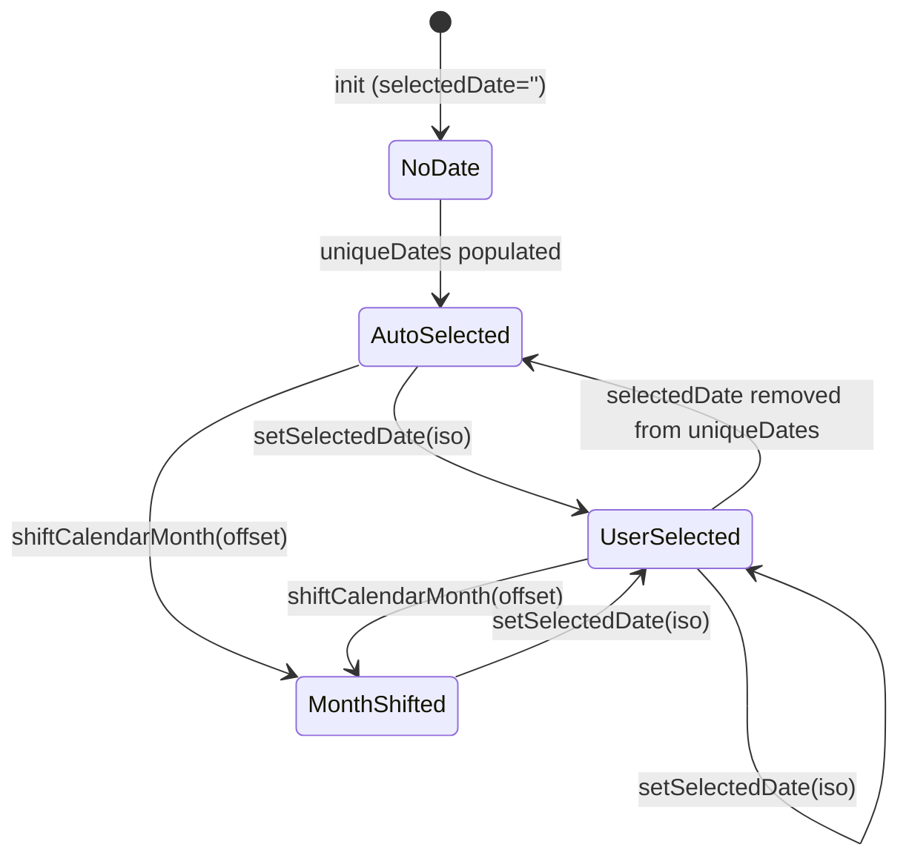
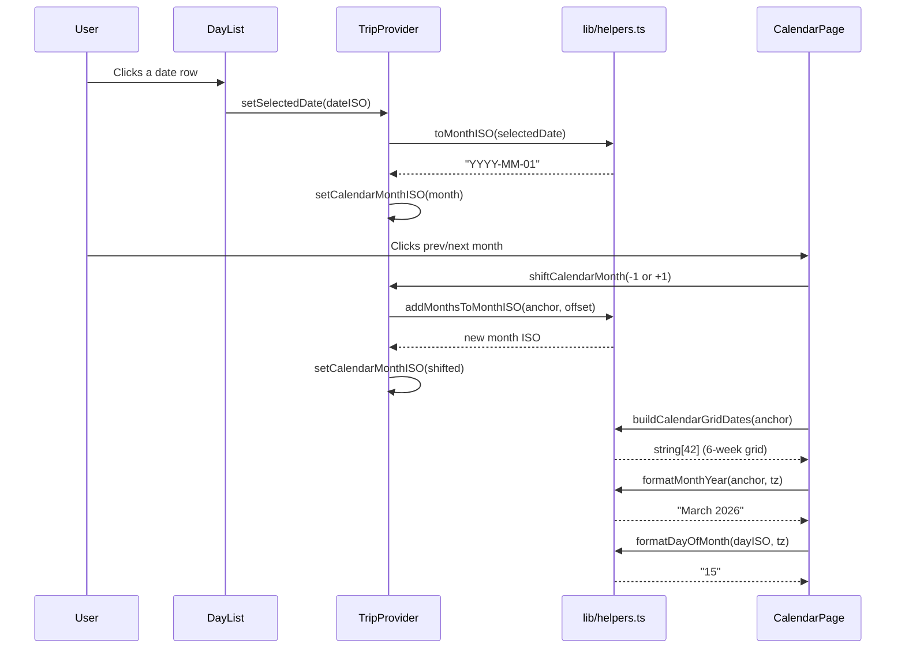

# Date/Time Helpers: Technical Architecture & Implementation

Document Basis: current code at time of generation.

---

## 1. Summary

The Date/Time Helpers module (`lib/helpers.ts`) provides a pure-function utility layer for all date normalization, formatting, arithmetic, and calendar grid construction used across the trip planner application. These functions ensure a single canonical `YYYY-MM-DD` date format throughout the system, provide timezone-aware display formatting via `Intl.DateTimeFormat` and `toLocaleDateString`, and handle minute-of-day arithmetic for the day planner grid.

**Shipped scope:**
- ISO date normalization (`normalizeDateKey`, `toISODate`, `toDateOnlyISO`)
- Month-level ISO truncation and arithmetic (`toMonthISO`, `addMonthsToMonthISO`)
- Calendar grid date generation (`buildCalendarGridDates`)
- Date range construction with safety cap (`buildISODateRange`)
- Timezone-aware display formatters (`formatDate`, `formatDateWeekday`, `formatDateDayMonth`, `formatMonthYear`, `formatDayOfMonth`)
- Relative day calculation (`daysFromNow`)
- Minute-of-day arithmetic (`clampMinutes`, `snapMinutes`, `formatMinuteLabel`, `formatHour`)
- Time constants (`MINUTES_IN_DAY`, `MIN_PLAN_BLOCK_MINUTES`)

**Out of scope:** Timezone conversion logic (delegated to browser `Intl` APIs), recurring event rules, duration-based scheduling.

---

## 2. Runtime Placement & Ownership

All date/time helpers are defined in a single file and imported by both client components and shared library modules. There is no framework-level provider or context; the functions are stateless and side-effect-free.

| Boundary | Detail |
|---|---|
| **Definition** | `lib/helpers.ts` (single source of truth) |
| **Lifecycle** | Stateless pure functions, no initialization required |
| **Client usage** | Imported directly in React components via `@/lib/helpers` |
| **Server usage** | Not imported server-side; `convex/planner.ts` and `lib/events.ts` carry local copies of `clampMinutes` (see Section 9) |
| **Timezone state** | Owned by `TripProvider` (`useState('America/Los_Angeles')`) and threaded to formatters as a parameter (`TripProvider.tsx:294`) |

---

## 3. Module/File Map

| File | Responsibility | Key Exports | Dependencies | Side Effects |
|---|---|---|---|---|
| `lib/helpers.ts` | All date/time utility functions | `normalizeDateKey`, `toISODate`, `toDateOnlyISO`, `toMonthISO`, `addMonthsToMonthISO`, `buildCalendarGridDates`, `buildISODateRange`, `formatDate`, `formatDateWeekday`, `formatDateDayMonth`, `formatMonthYear`, `formatDayOfMonth`, `daysFromNow`, `clampMinutes`, `snapMinutes`, `formatMinuteLabel`, `formatHour`, `MINUTES_IN_DAY`, `MIN_PLAN_BLOCK_MINUTES` | None (zero external deps) | None |
| `lib/planner-helpers.ts` | Planner slot logic, ICS/GCal generation | `sanitizePlannerByDate`, `parseEventTimeRange`, `getSuggestedPlanSlot`, `buildPlannerIcs`, `buildGoogleCalendarItemUrl` | `lib/helpers.ts` (imports `clampMinutes`, `snapMinutes`, `normalizeDateKey`, `formatMinuteLabel`, `formatDate`, `toDateOnlyISO`, `MINUTES_IN_DAY`, `MIN_PLAN_BLOCK_MINUTES`) | None |
| `components/providers/TripProvider.tsx` | Central state; computes `uniqueDates`, `eventsByDate`, `calendarAnchorISO` | `useTrip` context | `lib/helpers.ts` (19 imports at lines 23-26) | State mutations, network requests |
| `app/trips/[tripId]/calendar/page.tsx` | Calendar month grid UI | Default export | `lib/helpers.ts` (`formatMonthYear`, `formatDayOfMonth`, `toMonthISO`, `buildCalendarGridDates`) | None |
| `components/DayList.tsx` | Day sidebar with date labels | Default export | `lib/helpers.ts` (`formatDateWeekday`, `formatDateDayMonth`, `toISODate`) | None |
| `components/PlannerItinerary.tsx` | Day plan timeline | Default export | `lib/helpers.ts` (`formatDate`, `formatMinuteLabel`, `formatHour`) | None |
| `components/EventsItinerary.tsx` | Event list panel | Default export | `lib/helpers.ts` (`formatDateDayMonth`) | None |
| `components/SpotsItinerary.tsx` | Curated spots panel | Default export | `lib/helpers.ts` (`formatDateDayMonth`) | None |

---

## 4. State Model & Transitions

The helpers themselves are stateless. The date-related state they operate on lives in `TripProvider`:

| State Variable | Type | Initial | Source of Truth | Ref |
|---|---|---|---|---|
| `selectedDate` | `string` | `''` | User selection / auto-select effect | `TripProvider.tsx:257` |
| `calendarMonthISO` | `string` | `''` | Derived from `selectedDate` or month shift | `TripProvider.tsx:266` |
| `timezone` | `string` | `'America/Los_Angeles'` | City config or trip config | `TripProvider.tsx:294` |
| `tripStart` | `string` | `''` | Trip config from Convex | `TripProvider.tsx:280` |
| `tripEnd` | `string` | `''` | Trip config from Convex | `TripProvider.tsx:281` |

**Derived values (memoized):**

| Computed | Derivation | Ref |
|---|---|---|
| `uniqueDates` | `buildISODateRange(tripStart, tripEnd)` when trip dates exist, else union of event dates + planner dates, sorted | `TripProvider.tsx:357-370` |
| `eventsByDate` | Count map from `allEvents` grouped by `normalizeDateKey(e.startDateISO)` | `TripProvider.tsx:372-380` |
| `calendarAnchorISO` | `calendarMonthISO \|\| selectedDate \|\| uniqueDates[0] \|\| toISODate(new Date())` | `TripProvider.tsx:390-393` |



**Auto-select logic** (`TripProvider.tsx:395-401`): When `uniqueDates` changes and the current `selectedDate` is not in the list, the system selects today if present, otherwise the first date.

---

## 5. Interaction & Event Flow



---

## 6. Rendering/Layers/Motion

Not applicable -- these are pure utility functions with no rendering, layering, or animation behavior. They produce string outputs consumed by UI components.

**Component-to-formatter mapping:**

| Component | Formatter Used | Display Example |
|---|---|---|
| `CalendarPage` header | `formatMonthYear` | "March 2026" |
| `CalendarPage` cell | `formatDayOfMonth` | "15" |
| `CalendarPage` month check | `toMonthISO` | "2026-03-01" |
| `DayList` weekday label | `formatDateWeekday` | "Sat" |
| `DayList` date label | `formatDateDayMonth` | "Mar 15" |
| `PlannerItinerary` header | `formatDate` | "Sat, Mar 15, 2026" |
| `PlannerItinerary` hour gutter | `formatHour` | "9 AM" |
| `PlannerItinerary` block label | `formatMinuteLabel` | "9:30 AM" |
| `EventsItinerary` header | `formatDateDayMonth` | "Mar 15" |
| `SpotsItinerary` header | `formatDateDayMonth` | "Mar 15" |
| Map info windows | `daysFromNow` | "In 3 days" / "Today" |

---

## 7. API & Prop Contracts

### 7.1 Date Normalization Functions

#### `normalizeDateKey(value: any): string`
Extracts a canonical `YYYY-MM-DD` string from any input. Returns `''` on failure.

```typescript
// lib/helpers.ts:38-53
export function normalizeDateKey(value) {
  const text = String(value || '').trim();
  if (!text) return '';
  const dateMatch = text.match(/^(\d{4})-(\d{2})-(\d{2})/);
  if (dateMatch) return `${dateMatch[1]}-${dateMatch[2]}-${dateMatch[3]}`;
  const parsedDate = new Date(text);
  if (Number.isNaN(parsedDate.getTime())) return '';
  return [
    parsedDate.getFullYear(),
    String(parsedDate.getMonth() + 1).padStart(2, '0'),
    String(parsedDate.getDate()).padStart(2, '0')
  ].join('-');
}
```

**Behavior:**
- Fast path: regex match on ISO-prefixed strings (avoids `new Date()` parsing).
- Slow path: falls back to `new Date(text)` for non-ISO inputs.
- Returns `''` for invalid/empty inputs (never throws).

#### `toISODate(dateInput: any): string`
Converts a `Date` object or date-parseable value to `YYYY-MM-DD`. Returns `''` on invalid input.
`lib/helpers.ts:73-81`

#### `toDateOnlyISO(value: any): string`
Combines `normalizeDateKey` with a today-fallback: returns `normalizeDateKey(value) || toISODate(new Date())`.
`lib/helpers.ts:215-217`

### 7.2 Month-Level Functions

#### `toMonthISO(isoDate: string): string`
Truncates a date string to month granularity: `"2026-03-15"` becomes `"2026-03-01"`.
Returns `''` if input is shorter than 7 characters.
`lib/helpers.ts:83-86`

#### `addMonthsToMonthISO(monthISO: string, offset: number): string`
Adds or subtracts months from a month-level ISO string. Returns current month on invalid input.
`lib/helpers.ts:88-94`

### 7.3 Date Range & Grid Builders

#### `buildISODateRange(startISO: string, endISO: string): string[]`
Returns an array of `YYYY-MM-DD` strings from start to end (inclusive). Safety cap of **90 days** (`MAX_DAYS = 90`). Uses UTC arithmetic to avoid DST skew.
Returns `[]` if inputs are invalid, non-string, or start > end.
`lib/helpers.ts:219-233`

#### `buildCalendarGridDates(anchorISO: string): string[]`
Generates exactly **42 dates** (6 weeks) for a calendar month grid, starting from the Sunday of the anchor month's first week.
`lib/helpers.ts:96-108`

### 7.4 Timezone-Aware Formatters

All formatters share this pattern:
1. Normalize input via `normalizeDateKey`.
2. Parse as `new Date("YYYY-MM-DDT00:00:00")` (local time, no `Z` suffix).
3. Format via `toLocaleDateString` or `Intl.DateTimeFormat` with the provided `timeZone`.
4. Return the original input unchanged on failure (graceful degradation).

| Function | Intl Options | Default TZ | Example Output | Ref |
|---|---|---|---|---|
| `formatDate` | `weekday:'short', month:'short', day:'numeric', year:'numeric'` | `America/Los_Angeles` | `"Sat, Mar 15, 2026"` | `:110-116` |
| `formatDateWeekday` | `weekday:'short'` | `America/Los_Angeles` | `"Sat"` | `:118-124` |
| `formatDateDayMonth` | `month:'short', day:'numeric'` | `America/Los_Angeles` | `"Mar 15"` | `:126-132` |
| `formatMonthYear` | `month:'long', year:'numeric'` | `America/Los_Angeles` | `"March 2026"` | `:134-140` |
| `formatDayOfMonth` | `day:'numeric'` (Intl.DateTimeFormat, `en-US`) | `America/Los_Angeles` | `"15"` | `:142-148` |

**Key distinction:** `formatDayOfMonth` uses `new Intl.DateTimeFormat('en-US', ...)` with a hardcoded locale, while all others use `toLocaleDateString(undefined, ...)` which inherits the browser/runtime locale.

### 7.5 Relative Date Calculation

#### `daysFromNow(isoDate: any): number`
Returns the number of days between today (midnight) and the target date. Positive = future, negative = past, 0 = today.
`lib/helpers.ts:55-62`

**Usage context:** Filtering past events (`daysFromNow(e.startDateISO) >= 0` at `TripProvider.tsx:1090`), computing map marker labels (`TripProvider.tsx:1100-1101`), and building info window text (`TripProvider.tsx:1042-1043`).

### 7.6 Minute-of-Day Arithmetic

| Function | Signature | Purpose | Ref |
|---|---|---|---|
| `clampMinutes` | `(value, min, max) => number` | Clamp + round to valid minute range | `:177-180` |
| `snapMinutes` | `(value) => number` | Snap to nearest 15-minute increment (`PLAN_SNAP_MINUTES = 15`) | `:182-186` |
| `formatMinuteLabel` | `(minutesValue) => string` | Minutes since midnight to `"9:30 AM"` format | `:188-195` |
| `formatHour` | `(hourValue) => string` | Hour (0-23) to `"9 AM"` format | `:197-202` |

### 7.7 Constants

| Constant | Value | Purpose | Ref |
|---|---|---|---|
| `MINUTES_IN_DAY` | `1440` (24 * 60) | Upper bound for minute-of-day values | `:1` |
| `MIN_PLAN_BLOCK_MINUTES` | `30` | Minimum duration for any planner block | `:2` |

---

## 8. Reliability Invariants

These are deterministic truths that must remain true after any refactor:

1. **`normalizeDateKey` always returns `YYYY-MM-DD` or `''`** -- never throws, never returns partial strings (`lib/helpers.ts:38-53`).
2. **`buildISODateRange` never returns more than 90 elements** -- enforced by `MAX_DAYS = 90` guard (`lib/helpers.ts:220,228`).
3. **`buildCalendarGridDates` always returns exactly 42 elements** -- the 6-week grid constant (`lib/helpers.ts:102`).
4. **`buildISODateRange` uses UTC arithmetic** -- `cursor.setUTCDate()` prevents DST-induced date skips or repeats (`lib/helpers.ts:229`).
5. **All formatters return the original input on failure** -- they never throw, enabling safe rendering even with garbage data (`lib/helpers.ts:112,114`).
6. **`daysFromNow` zeroes the time component of "today"** via `today.setHours(0, 0, 0, 0)` to ensure integer day boundaries (`lib/helpers.ts:60`).
7. **`clampMinutes` always rounds** -- `Math.round(value)` ensures integer results even with fractional input (`lib/helpers.ts:179`).
8. **`toMonthISO` is a pure string slice** -- it does not parse or validate the date, just returns `isoDate.slice(0,7) + "-01"` (`lib/helpers.ts:85`).
9. **Timezone is a passthrough parameter** -- helpers never read or store timezone state; it is always provided by the caller from `TripProvider.timezone`.

---

## 9. Edge Cases & Pitfalls

### 9.1 Duplicated `clampMinutes` Implementations

`clampMinutes` exists in three places with near-identical logic:
- `lib/helpers.ts:177-180` (canonical, exported)
- `convex/planner.ts:108-114` (local copy, typed `value: unknown`)
- `lib/events.ts:2411-2417` (local copy)

This is intentional: Convex serverless functions cannot import from `lib/helpers.ts` (different runtime), and `lib/events.ts` is a large legacy module. But divergence risk exists if the rounding or clamping logic is changed in only one location.

### 9.2 Local Time Parsing Hazard in `normalizeDateKey`

The fallback path `new Date(text)` (line 45) uses the JavaScript engine's date parser, which is locale- and implementation-dependent. The ISO regex fast path avoids this for well-formed inputs, but freeform strings like `"March 15, 2026"` may parse differently across runtimes (Node vs. browser, V8 vs. JSC).

### 9.3 `daysFromNow` Uses Local Midnight

`target` is constructed as `new Date("YYYY-MM-DDT00:00:00")` (local time, no `Z`), while `today` uses `new Date()` zeroed to local midnight. This is consistent but means the calculation depends on the machine's system timezone, not the trip's configured timezone. A user viewing a Tokyo trip from a San Francisco browser gets "days from now" relative to PST.

### 9.4 `buildCalendarGridDates` Uses Local Time

`start.setDate(1 - start.getDay())` and subsequent arithmetic use local-time `Date` methods (not UTC). This is correct for display purposes but means server-side rendering in a different timezone could produce different grid dates than the client.

### 9.5 `formatDayOfMonth` Locale Mismatch

`formatDayOfMonth` hardcodes `'en-US'` locale while all other formatters use `undefined` (browser default). This means in a non-English locale, day-of-month rendering stays English while month names in `formatMonthYear` would localize. This is likely intentional for the calendar grid but is worth noting.

### 9.6 `buildISODateRange` vs `buildCalendarGridDates` UTC Inconsistency

`buildISODateRange` uses `cursor.setUTCDate()` (line 229) for DST safety, while `buildCalendarGridDates` uses local `date.setDate()` (line 104). This means `buildISODateRange` is DST-safe but `buildCalendarGridDates` could theoretically produce a duplicate or skip a date during a DST transition, though this is extremely unlikely since calendar grids are display-only.

---

## 10. Testing & Verification

### 10.1 Current Test Coverage

No dedicated test file for `lib/helpers.ts` exists. The functions are exercised indirectly through:
- `lib/planner-helpers.ts` consumers (tested via `lib/events.planner.test.mjs`)
- `TripProvider` bootstrap logic (tested via `lib/trip-provider-bootstrap.test.mjs`)

**Coverage gap:** `normalizeDateKey`, `daysFromNow`, `buildISODateRange`, `buildCalendarGridDates`, and all format functions lack direct unit tests.

### 10.2 Recommended Manual Verification Scenarios

| Scenario | Steps | Expected |
|---|---|---|
| ISO normalization | Call `normalizeDateKey("2026-03-15T10:30:00Z")` | `"2026-03-15"` |
| Invalid input | Call `normalizeDateKey("")` | `""` |
| Freeform fallback | Call `normalizeDateKey("March 15, 2026")` | `"2026-03-15"` |
| Date range | Call `buildISODateRange("2026-03-01", "2026-03-03")` | `["2026-03-01", "2026-03-02", "2026-03-03"]` |
| Range cap | Call `buildISODateRange("2026-01-01", "2026-12-31")` | Array of 90 elements (capped) |
| Inverted range | Call `buildISODateRange("2026-03-05", "2026-03-01")` | `[]` |
| Calendar grid size | Call `buildCalendarGridDates("2026-03-15")` | Array of exactly 42 strings |
| Days from now (today) | Call `daysFromNow(toISODate(new Date()))` | `0` |
| Days from now (future) | Call `daysFromNow("2099-01-01")` | Large positive number |
| Minute formatting | Call `formatMinuteLabel(570)` | `"9:30 AM"` |
| Hour formatting | Call `formatHour(14)` | `"2 PM"` |
| Midnight edge | Call `formatMinuteLabel(0)` | `"12:00 AM"` |
| Noon edge | Call `formatMinuteLabel(720)` | `"12:00 PM"` |
| Snap minutes | Call `snapMinutes(37)` | `30` (nearest 15) |
| Clamp overflow | Call `clampMinutes(2000, 0, 1440)` | `1440` |

---

## 11. Quick Change Playbook

| If you want to... | Edit... | Notes |
|---|---|---|
| Change the default timezone | `TripProvider.tsx:294` | Change the `useState` default; also check `convex/schema.ts:211` for the DB default |
| Add a new date format | `lib/helpers.ts` | Follow the existing pattern: normalize via `normalizeDateKey`, parse, format, return original on failure |
| Change the minimum planner block | `lib/helpers.ts:2` (`MIN_PLAN_BLOCK_MINUTES`) | Also update the local copies in `convex/planner.ts` and `lib/events.ts` |
| Change the planner snap increment | `lib/helpers.ts:183` (`PLAN_SNAP_MINUTES` inside `snapMinutes`) and `lib/planner-helpers.ts:13` (exported constant) | Two locations; keep in sync |
| Change the date range safety cap | `lib/helpers.ts:220` (`MAX_DAYS = 90`) | Increasing this affects `uniqueDates` array size in TripProvider |
| Change calendar grid to 5 weeks | `lib/helpers.ts:102` (change `42` to `35`) | All calendar UI assumes 42 cells; update `CalendarPage` grid accordingly |
| Localize `formatDayOfMonth` | `lib/helpers.ts:147` | Change `'en-US'` to `undefined` to inherit browser locale |
| Make `daysFromNow` timezone-aware | `lib/helpers.ts:58-60` | Replace local midnight with timezone-adjusted midnight using `Intl.DateTimeFormat` |
| Add tests for helpers | Create `lib/helpers.test.mjs` | Import functions directly; no mocking needed (pure functions) |
| Consolidate duplicated `clampMinutes` | Export from `lib/helpers.ts` only | `convex/planner.ts` cannot import browser-side modules; its copy must remain separate |
