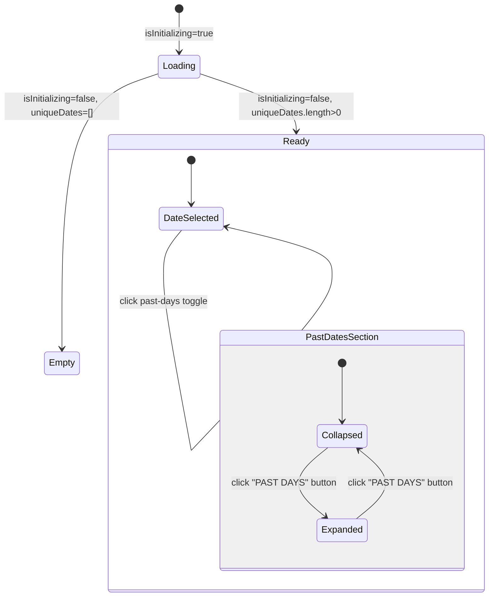
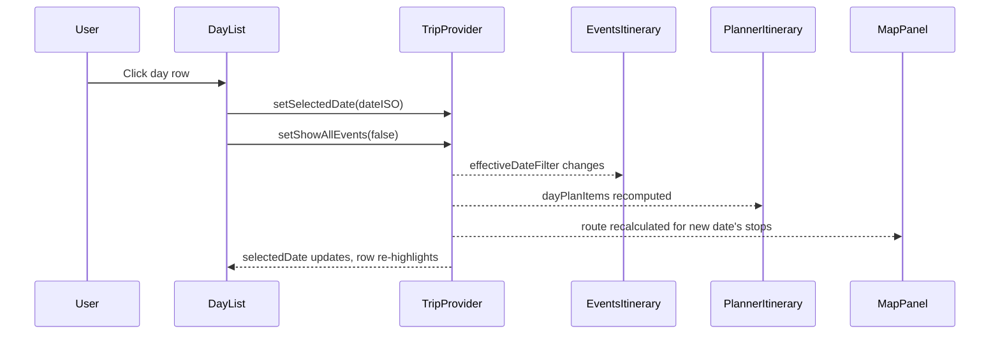

# Day List Sidebar: Technical Architecture & Implementation

Document Basis: current code at time of generation.

---

## 1. Summary

The Day List Sidebar is a narrow, scrollable vertical column that displays all trip dates in chronological order. Each day row shows a weekday label, a month/day label, and per-day intensity bars visualizing event and plan density. Clicking a day sets the global `selectedDate`, which drives content in the adjacent EventsItinerary, SpotsItinerary, and PlannerItinerary panels, as well as the map route overlay.

**Shipped scope:**
- Chronological date list derived from trip start/end range or union of event + planner dates.
- Per-day event count bar (orange `#FF8800`) and plan count bar (green `#00FF88`), scaled relative to the day with the most events/plans.
- Past-dates collapsible section with aggregate metrics bar and toggle.
- Loading skeleton with staggered pulse animation during bootstrap.
- Empty state when no dates exist.
- Fixed 140px column width in the sidebar grid, responsive to vertical scroll on mobile.

**Out of scope:** multi-city leg rendering (currently hardcoded to "SAN FRANCISCO"), keyboard navigation, drag-to-reorder, date range editing from within the sidebar.

---

## 2. Runtime Placement & Ownership

### Component tree

```
TripsLayout (app/trips/layout.tsx)
  TripProvider               -- context boundary
    AppShell                 -- top bar + map + children slot
      PlanningPage | SpotsPage
        <aside> sidebar container
          CSS Grid: 140px | 1fr | 1fr
            [col 0] DayList        <-- THIS FEATURE
            [col 1] EventsItinerary | SpotsItinerary
            [col 2] PlannerItinerary
```

### Mounting points

| Route | File | Grid position |
|---|---|---|
| `/planning` | `app/trips/[tripId]/planning/page.tsx:14` | First column of 3-column sidebar grid |
| `/spots` | `app/trips/[tripId]/spots/page.tsx:14` | First column of 3-column sidebar grid |

DayList is NOT rendered on the `/map`, `/calendar`, or `/config` tabs.

### Lifecycle boundaries

- **Created:** when user navigates to `/planning` or `/spots` tab.
- **Provider dependency:** all state comes from `useTrip()` (TripProvider). No local data fetching.
- **Destroyed:** when user navigates away from those tabs (React unmount).

---

## 3. Module/File Map

| File | Responsibility | Key exports | Dependencies | Side effects |
|---|---|---|---|---|
| `components/DayList.tsx` | Full DayList UI: skeleton, empty state, day rows, past-dates toggle, metrics bars | `default` (DayList component) | `useTrip`, `formatDateWeekday`, `formatDateDayMonth`, `toISODate`, `lucide-react/MapPin` | None |
| `components/providers/TripProvider.tsx` | State owner: `uniqueDates`, `eventsByDate`, `planItemsByDate`, `selectedDate`, `isInitializing`, `timezone` | `useTrip` hook, `TripContext.Provider` | Convex, Google Maps, fetch APIs | Bootstrap data loading, map init |
| `lib/helpers.ts` | Date formatting/normalization utilities | `formatDateWeekday`, `formatDateDayMonth`, `toISODate`, `buildISODateRange`, `normalizeDateKey` | None | None |
| `app/globals.css` | Responsive CSS rules for `day-list-responsive`, `day-list-item-responsive`, `sidebar-grid-responsive` | N/A | N/A | Media query breakpoints |
| `app/trips/[tripId]/planning/page.tsx` | Mounts DayList in sidebar grid | `default` (PlanningPage) | DayList, EventsItinerary, PlannerItinerary, useTrip | None |
| `app/trips/[tripId]/spots/page.tsx` | Mounts DayList in sidebar grid | `default` (SpotsPage) | DayList, SpotsItinerary, PlannerItinerary, useTrip | None |

---

## 4. State Model & Transitions

### State sources (all from TripProvider)

| State field | Type | Source | DayList usage |
|---|---|---|---|
| `uniqueDates` | `string[]` | `useMemo` derived from `tripStart`/`tripEnd` range OR union of event dates + planner dates (`TripProvider.tsx:357-370`) | Drives the list of day rows |
| `selectedDate` | `string` | `useState('')` (`TripProvider.tsx:257`) | Highlights active row, set on click |
| `setSelectedDate` | `(date: string) => void` | State setter | Called on day click |
| `setShowAllEvents` | `(val: boolean) => void` | State setter | Set to `false` on day click |
| `eventsByDate` | `Map<string, number>` | `useMemo` counting events per date (`TripProvider.tsx:372-380`) | Event intensity bars |
| `planItemsByDate` | `Map<string, number>` | `useMemo` counting plan items per date (`TripProvider.tsx:382-388`) | Plan intensity bars |
| `isInitializing` | `boolean` | `useState(true)` (`TripProvider.tsx:262`) | Show skeleton vs real content |
| `timezone` | `string` | `useState('America/Los_Angeles')` (`TripProvider.tsx:294`) | Date formatting |

### Local state (DayList-internal)

| State | Type | Default | Purpose |
|---|---|---|---|
| `isPastExpanded` | `boolean` | `false` | Toggle past-dates section visibility |

### State diagram



### Auto-selection logic (TripProvider)

When `uniqueDates` changes, TripProvider auto-selects a date (`TripProvider.tsx:395-401`):
1. If `uniqueDates` is empty, clear `selectedDate`.
2. If current `selectedDate` is not in `uniqueDates`, pick today if available, else pick `uniqueDates[0]`.

---

## 5. Interaction & Event Flow

### Date selection sequence



### Past-dates toggle

1. User clicks "PAST DAYS" button.
2. `isPastExpanded` toggles (local state only).
3. If expanded: individual past day rows render below the toggle button.
4. If collapsed: aggregate metrics bar shows combined event/plan totals for all past dates.
5. No effect on `selectedDate` -- the toggle does not auto-select a date.

### Side effect on selection

`selectDate()` (`DayList.tsx:126-129`) always sets `showAllEvents` to `false`. This switches EventsItinerary from "show all dates" mode to filtered mode for the selected date.

---

## 6. Rendering/Layers/Motion

### Layout geometry

| Property | Value | Source |
|---|---|---|
| Column width | `140px` fixed | `sidebar-grid-responsive` class (`globals.css:144`) |
| Background | `#080808` | Inline style (`DayList.tsx:192`) |
| Padding | `12px 0` (top/bottom) | Inline style (`DayList.tsx:192`) |
| Border | Right border `1px solid var(--color-border)` | Tailwind class `border-r border-border` |
| Overflow | `overflow-y: auto` | Tailwind class |
| Scrollbar | 6px dark thumb | `.scrollbar-thin` + global scrollbar CSS (`globals.css:148-151`) |

### Day row styling

| Property | Active state | Inactive state |
|---|---|---|
| Background | `rgba(0, 232, 123, 0.07)` | transparent |
| Left border | `2px solid #00E87B` | `2px solid transparent` |
| Weekday font size | `11px` | `11px` |
| Weekday font weight | `600` | `500` |
| Weekday color | `#F5F5F5` | `#737373` |
| Day/month font size | `10px` | `10px` |
| Day/month color | `#737373` | `#525252` |
| Font family | JetBrains Mono | JetBrains Mono |
| Transition | `transition-all duration-200` | `transition-all duration-200` |

### Metrics bars

| Property | Event bar | Plan bar |
|---|---|---|
| Color | `#FF8800` (orange / warning) | `#00FF88` (green / accent) |
| Height | `6px` | `6px` |
| Min width | `22%` of container | `22%` of container |
| Max width | `100%` | `100%` |
| Opacity range | `0.35` to `1.0` (linear with intensity) | `0.35` to `1.0` |
| Visibility | Hidden when count=0 | Hidden when count=0 |
| `aria-hidden` | `true` (decorative) | `true` (decorative) |

Intensity formula (`DayList.tsx:8-11`):
```
intensity(count, max) = count === 0 ? 0 : Math.min(count / max, 1)
opacity = 0.35 + intensity * 0.65
width = Math.max(intensity * 100, 22) + '%'
```

### City leg label

A static label "SAN FRANCISCO" is rendered with a green MapPin icon and `2px solid #00E87B` left border (`DayList.tsx:200-212`). This is currently hardcoded and not driven by trip/city data.

### DAYS header

A `10px` uppercase "DAYS" label in muted `#525252` with `1px` letter-spacing, using JetBrains Mono (`DayList.tsx:194-199`).

### Skeleton state

`DayListSkeleton` renders 8 placeholder rows with:
- Staggered `animationDelay` at `75ms` increments per row (`DayList.tsx:57`).
- Randomized widths for text placeholders from a fixed array: `['w-[70%]', 'w-[60%]', 'w-[80%]', 'w-[55%]', 'w-[75%]', 'w-[65%]', 'w-[50%]', 'w-[72%]']` (`DayList.tsx:52`).
- Bar placeholders in `#FF8800/15` and `#00FF88/15` with Tailwind `animate-pulse`.
- Every 3rd row (i % 3 === 2) omits bar placeholders; even rows show both bars, odd rows show only the orange bar (`DayList.tsx:62-66`).

### Responsive behavior

| Breakpoint | Behavior | Source |
|---|---|---|
| > 1200px | Standard 3-column sidebar grid, DayList in 140px first column | `globals.css:144` |
| <= 1200px | Grid collapses to `140px 1fr 1fr`, sidebar gets `height: auto` | `globals.css:161` |
| <= 640px | Grid becomes single column (`1fr`), DayList uses vertical scroll with `border-right` | `globals.css:174-177` |

At 640px and below, `day-list-item-responsive` sets `min-width: 112px; flex-shrink: 0`.

---

## 7. API & Prop Contracts

### DayList (default export)

**Props:** none. All data comes from `useTrip()` context hook.

**Context dependencies consumed:**

```typescript
// DayList.tsx:75-84
const {
  uniqueDates,      // string[] -- sorted ISO date strings
  selectedDate,     // string -- currently selected ISO date
  setSelectedDate,  // (date: string) => void
  setShowAllEvents, // (val: boolean) => void
  eventsByDate,     // Map<string, number>
  planItemsByDate,  // Map<string, number>
  isInitializing,   // boolean
  timezone          // string (IANA timezone)
} = useTrip();
```

### DayMetricsBars (internal component)

```typescript
// DayList.tsx:13
function DayMetricsBars({
  eventCount,  // number -- events on this day
  planCount,   // number -- plan items on this day
  maxEvents,   // number -- max event count across all days
  maxPlans     // number -- max plan count across all days
})
```

Returns `null` if both counts are zero (`DayList.tsx:17-19`).

### intensity (internal pure function)

```typescript
// DayList.tsx:8-11
function intensity(count: number, max: number): number
// Returns 0 if max===0 or count===0, else min(count/max, 1)
```

### Helper functions consumed from `lib/helpers.ts`

| Function | Signature | Purpose |
|---|---|---|
| `formatDateWeekday` | `(isoDate: string, tz?: string) => string` | Renders weekday abbreviation (e.g. "Mon") |
| `formatDateDayMonth` | `(isoDate: string, tz?: string) => string` | Renders "Mar 15" style label |
| `toISODate` | `(dateInput: Date) => string` | Converts Date to `YYYY-MM-DD` string |

---

## 8. Reliability Invariants

These are deterministic truths that must remain true after any refactor:

1. **`uniqueDates` is always sorted ascending.** If `tripStart`/`tripEnd` are set, it is produced by `buildISODateRange` which iterates chronologically (`helpers.ts:219-233`). Otherwise, dates are collected into a Set then `Array.from(dateSet).sort()` (`TripProvider.tsx:369`).

2. **`intensity()` is clamped to [0, 1].** The `Math.min(count/max, 1)` ensures bars never exceed 100% width (`DayList.tsx:10`).

3. **Bars have a minimum visual width of 22%.** Even a single event/plan on a day with 100 max produces a visible bar (`DayList.tsx:28, 40`).

4. **Clicking a day always sets `showAllEvents` to `false`.** This is unconditional in `selectDate()` (`DayList.tsx:128`).

5. **Skeleton renders exactly 8 rows.** Hardcoded in `Array.from({ length: 8 })` (`DayList.tsx:56`).

6. **`DayMetricsBars` is `aria-hidden="true"`.** Bars are decorative and not exposed to screen readers (`DayList.tsx:22`).

7. **Past/upcoming split uses string comparison against `todayISO`.** `dateISO < todayISO` is a lexicographic comparison on ISO strings, which is correct for `YYYY-MM-DD` format (`DayList.tsx:104`).

8. **`todayISO` is computed once per mount via `useMemo(() => toISODate(new Date()), [])`.** It does NOT update if the user keeps the tab open across midnight (`DayList.tsx:87`).

---

## 9. Edge Cases & Pitfalls

### Midnight boundary staleness

`todayISO` is memoized with `[]` deps (`DayList.tsx:87`). If the user keeps the app open past midnight, the past/upcoming partition will be stale until the component remounts. A day that crosses into "past" will remain in "upcoming."

### Hardcoded city label

The "SAN FRANCISCO" label at `DayList.tsx:210` is a static string, not derived from `currentCity` or any trip data. Multi-city support will require replacing this with dynamic city name rendering.

### Empty `eventsByDate` / `planItemsByDate` for dates outside events

`eventsByDate` initializes all `uniqueDates` keys to 0 (`TripProvider.tsx:374`), but `planItemsByDate` only includes dates that have planner entries (`TripProvider.tsx:382-388`). DayList handles this with `|| 0` fallback (`DayList.tsx:132-133`).

### `maxEvents` and `maxPlans` can both be 0

If no events or plans exist on any date, `max` values will be 0. The `intensity()` function returns 0 in this case (`DayList.tsx:9`), and `DayMetricsBars` returns `null` when both counts are 0, so no bars render. No division-by-zero risk.

### Past dates toggle does not affect selectedDate

Expanding or collapsing past dates only changes `isPastExpanded` local state. If the user had a past date selected before collapsing, it remains selected (the row just becomes invisible). The `isSelectedPastDate` flag is computed but only used for styling the toggle button, not for clearing the selection.

### No virtualization

All dates render in the DOM simultaneously. For trips spanning the maximum 90 days (`buildISODateRange` has `MAX_DAYS = 90` at `helpers.ts:220`), this means up to 90 button elements. This is within reasonable limits but could cause minor jank on very low-powered devices.

---

## 10. Testing & Verification

### Existing tests

No dedicated unit or integration tests exist for DayList. The following test files exist in the project but cover other features:
- `lib/crime-cities.test.mjs`
- `lib/dashboard.test.mjs`
- `lib/trip-provider-bootstrap.test.mjs`

### Manual verification scenarios

| Scenario | Steps | Expected |
|---|---|---|
| Skeleton display | Open app, observe DayList during bootstrap | 8 skeleton rows with staggered pulse animation |
| Date selection | Click any day row | Row highlights with green left border and tinted background; EventsItinerary filters to that date |
| Empty state | Configure trip with no events and no date range | "No event dates" message in dashed border box |
| Past dates collapsed | Have dates before today | "PAST DAYS" toggle shows with aggregate bars; past dates hidden |
| Past dates expanded | Click "PAST DAYS" toggle | Past date rows appear; toggle label changes to "(SHOWING)" |
| Intensity bars | Have varying event/plan counts across days | Bars scale proportionally; day with most events has full-width orange bar |
| Zero-count day | Have a day with no events and no plans | No bars render for that day |
| Responsive (mobile) | Resize to < 640px | DayList switches to vertical column layout |

### Programmatic checks

```bash
# Verify DayList is only imported in planning and spots pages
grep -rn "DayList" --include="*.tsx" --include="*.ts" app/ components/
```

---

## 11. Quick Change Playbook

| Goal | Files to edit | Details |
|---|---|---|
| Change bar colors | `components/DayList.tsx:29, 41` | Modify `backgroundColor` inline styles in `DayMetricsBars` |
| Change bar height | `components/DayList.tsx:24, 36` | Modify `h-[6px]` Tailwind class |
| Change minimum bar width | `components/DayList.tsx:28, 40` | Modify the `22` in `Math.max(eventIntensity * 100, 22)` |
| Change opacity range | `components/DayList.tsx:30, 42` | Modify `0.35 + intensity * 0.65` formula |
| Dynamic city label | `components/DayList.tsx:210` | Replace `SAN FRANCISCO` with `currentCity?.name` from `useTrip()` |
| Change column width | `app/globals.css:144, 161` | Modify `140px` in `grid-template-columns` of `.sidebar-grid-responsive` |
| Change skeleton count | `components/DayList.tsx:56` | Change `8` in `Array.from({ length: 8 })` |
| Add keyboard navigation | `components/DayList.tsx:137-176` | Add `onKeyDown` handler to day buttons, manage focus with refs |
| Add date range to sidebar | `components/DayList.tsx` | Import `tripStart`/`tripEnd`/`setTripStart`/`setTripEnd` from `useTrip()`, add date picker UI |
| Fix midnight staleness | `components/DayList.tsx:87` | Replace `useMemo` with `useState` + a `setInterval` or visibility-change listener that updates `todayISO` |
| Add virtualization | `components/DayList.tsx:252-253` | Wrap date lists in a virtual scroll container (e.g. `react-window`) keyed by date strings |
| Change active-row highlight color | `components/DayList.tsx:142` | Modify `rgba(0, 232, 123, 0.07)` background and `#00E87B` border color |
