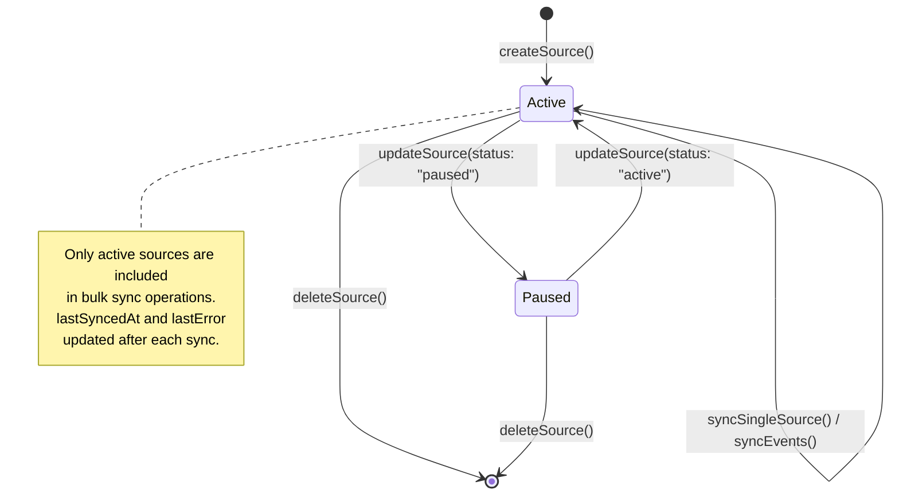
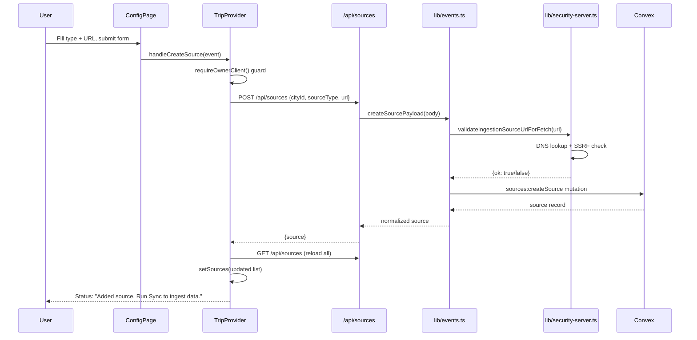
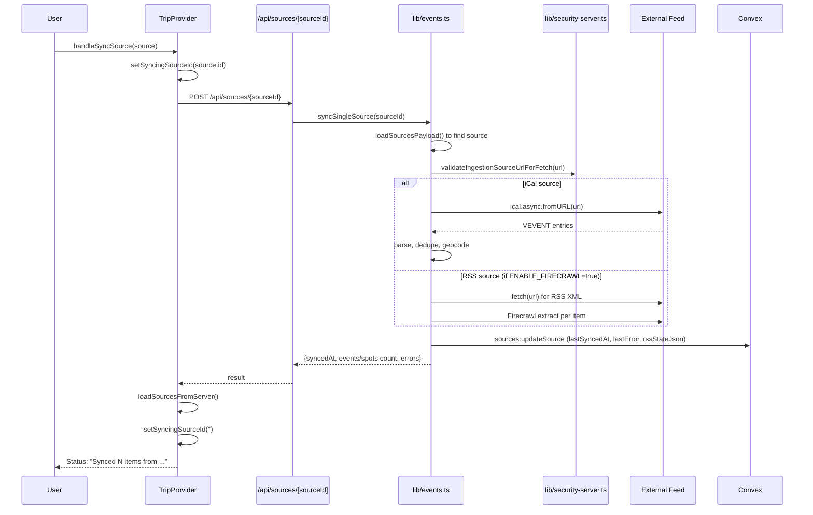

# Event Source Management: Technical Architecture & Implementation

Document Basis: current code at time of generation.

---

## 1. Summary

Event Source Management allows **owner-role users** to register external data feeds (iCal calendars, RSS newsletters, web-scraped spot lists) and ingest them into the trip planner. Each source has a URL, type (`event` or `spot`), a status (`active` or `paused`), error tracking, last-synced timestamp, and optional RSS deduplication state.

**Current shipped scope:**
- CRUD operations on sources (create, read, update status/label, delete).
- Manual per-source sync and bulk sync of all active sources.
- Pause/resume toggle per source.
- Error surfacing per source after sync.
- iCal (Luma, Eventbrite, any `.ics` URL) ingestion is fully functional.
- RSS/Firecrawl extraction pipeline exists but is **disabled by default** (`ENABLE_FIRECRAWL=true` required).
- Spot source sync function (`syncSpotsFromSources`) is a **stub** that returns empty results.

**Out of scope (not implemented):**
- Scheduled/cron-based automatic sync.
- Source editing (URL is immutable after creation).
- Per-source ingestion history/audit log.
- Webhook/push-based source updates.

---

## 2. Runtime Placement & Ownership

| Concern | Location | Lifecycle |
|---|---|---|
| **UI** | `app/trips/[tripId]/config/page.tsx` "EVENT SOURCES" section | Mounted inside the `trips/[tripId]` layout; only visible to authenticated users |
| **Client state** | `components/providers/TripProvider.tsx` | App-wide; sources loaded on initial bootstrap and after every mutation |
| **API routes** | `app/api/sources/route.ts` (list + create) | Per-request; Node.js runtime |
| | `app/api/sources/[sourceId]/route.ts` (update + sync + delete) | Per-request; Node.js runtime |
| | `app/api/sync/route.ts` (bulk sync) | Per-request with in-flight dedup; Node.js runtime |
| **Business logic** | `lib/events.ts` | Server-side only; stateless functions |
| **Database** | `convex/sources.ts` | Convex mutations/queries; owner-role gated |
| **Security** | `lib/security.ts`, `lib/security-server.ts` | SSRF validation at create-time and sync-time |
| **Auth guard** | `lib/api-guards.ts` + `lib/request-auth.ts` | Wraps every API route |

All source mutations require **owner role**. Source listing requires authentication (any role).

---

## 3. Module/File Map

| File | Responsibility | Key Exports | Side Effects |
|---|---|---|---|
| `convex/schema.ts:179-192` | Schema definition for `sources` table | Table definition with 2 indexes | None |
| `convex/sources.ts` | Convex CRUD mutations/queries | `listSources`, `listActiveSources`, `createSource`, `updateSource`, `deleteSource` | DB reads/writes |
| `convex/authz.ts` | Authorization guards | `requireAuthenticatedUserId`, `requireOwnerUserId` | None |
| `app/api/sources/route.ts` | REST: `GET /api/sources`, `POST /api/sources` | `GET`, `POST` handlers | Network I/O |
| `app/api/sources/[sourceId]/route.ts` | REST: `PATCH`, `POST` (sync), `DELETE` per source | `PATCH`, `POST`, `DELETE` handlers | Network I/O, sync side effects |
| `app/api/sync/route.ts` | Bulk sync endpoint with in-flight dedup | `POST` handler | Network I/O, file cache write |
| `lib/events.ts` | Core source + sync logic | `loadSourcesPayload`, `createSourcePayload`, `updateSourcePayload`, `deleteSourcePayload`, `syncEvents`, `syncSingleSource` | iCal fetch, RSS fetch, Firecrawl API, file system cache, Convex mutations |
| `lib/security.ts` | URL validation, SSRF prevention, rate limiting | `validateIngestionSourceUrl`, `isPrivateHost` | In-memory rate limit state |
| `lib/security-server.ts` | DNS-resolution SSRF check | `validateIngestionSourceUrlForFetch` | DNS lookup |
| `lib/api-guards.ts` | Auth middleware wrappers | `runWithOwnerClient`, `runWithAuthenticatedClient` | Auth token resolution |
| `lib/convex-client-context.ts` | AsyncLocalStorage for Convex client propagation | `runWithConvexClient`, `getScopedConvexClient` | AsyncLocalStorage |
| `components/providers/TripProvider.tsx` | Client state + UI callbacks | `handleCreateSource`, `handleToggleSourceStatus`, `handleDeleteSource`, `handleSyncSource`, `handleSync` | `fetch` calls to API routes |
| `app/trips/[tripId]/config/page.tsx` | Source management UI | `ConfigPage` (default export) | None |
| `lib/helpers.ts:64-71` | Source label formatting | `formatSourceLabel`, `safeHostname` | None |

---

## 4. State Model & Transitions

### 4.1 Source Status

Sources have exactly two statuses, defined in `convex/sources.ts:7`:

```
'active' | 'paused'
```

### 4.2 State Diagram



### 4.3 Transition Rules

| From | To | Trigger | Guard | Side Effect |
|---|---|---|---|---|
| (none) | `active` | `createSource` mutation | Owner role, valid public URL, unique URL per city | Inserts row; if duplicate URL+type exists, reactivates it |
| `active` | `paused` | `updateSource` with `status: "paused"` | Owner role | Paused sources excluded from `listActiveSources` and bulk sync |
| `paused` | `active` | `updateSource` with `status: "active"` | Owner role | Source re-included in sync |
| any | (deleted) | `deleteSource` mutation | Owner role | Hard delete from DB; no cascade to events/spots |
| `active` | `active` | Sync completes | None (server-side) | `lastSyncedAt` and `lastError` updated |

### 4.4 Duplicate URL Handling

`createSource` in `convex/sources.ts:164-185`: if a source with the same `cityId` + `url` + `sourceType` already exists, the mutation **reactivates** it (sets status to `active`, updates label) instead of creating a duplicate. This uses the `by_city_url` index.

---

## 5. Interaction & Event Flow

### 5.1 Create Source Flow



### 5.2 Single Source Sync Flow



### 5.3 Bulk Sync Flow

The bulk sync (`POST /api/sync`) uses **in-flight deduplication** via a module-level `syncInFlight` variable (`app/api/sync/route.ts:6-25`). Concurrent requests share the same sync promise rather than triggering parallel syncs.

The `syncEvents` function (`lib/events.ts:512-563`):
1. Calls `getSourceSnapshotForSync(cityId)` to load active sources from Convex (with env-var fallbacks).
2. Runs `syncEventsFromSources` for all active event sources sequentially.
3. Runs `syncSpotsFromSources` for spot sources (currently a stub returning empty).
4. Writes results to local file cache (`data/events-cache.json`).
5. Persists to Convex via `saveEventsToConvex`, `saveSpotsToConvex`, and `saveSourceSyncStatus` (all via `Promise.allSettled`).

---

## 6. Rendering/Layers/Motion

### 6.1 Source Card Layout (`config/page.tsx:143-183`)

Each source renders as a `Card` component with:
- **Left border indicator**: orange (`rgba(255,136,0,0.4)`) for event sources, green (`rgba(0,255,136,0.3)`) for spot sources.
- **Status badge**: green dot + "active" or amber dot + "paused", using `Badge` component with `variant="default"` or `variant="warning"`.
- **Opacity**: `opacity-60` class applied when status is `paused`.
- **Sync timestamp**: formatted via `toLocaleDateString` with user's timezone, or "Never synced".
- **Error display**: red (`#FF4444`) text showing `lastError`.
- **Action buttons**: Sync (with spinning `RefreshCw` icon during sync), Pause/Resume toggle, Remove.

### 6.2 Visual States

| State | Visual Indicator |
|---|---|
| Active | Full opacity, green status dot with glow shadow |
| Paused | 60% opacity, amber status dot |
| Syncing | Sync button disabled, `RefreshCw` icon animates (`animate-spin`), text changes to "Syncing..." |
| Read-only (fallback) | All action buttons disabled, "Read-only" italic label |
| Error after sync | Red error text next to sync timestamp |
| Empty state | Dashed border placeholder: "No sources yet." |

### 6.3 Add Source Form

Inline form below source cards with:
- `Select` dropdown for type (`event` / `spot`), width 120px.
- `Input` for URL with placeholder.
- `Button` submit, disabled when `!canManageGlobal` or `isSavingSource`.

---

## 7. API & Prop Contracts

### 7.1 REST API

| Method | Path | Auth | Request Body | Response |
|---|---|---|---|---|
| `GET` | `/api/sources?cityId=X` | Owner | -- | `{ sources: SourceRecord[], source: "convex"\|"fallback" }` |
| `POST` | `/api/sources` | Owner | `{ cityId, sourceType, url, label? }` | `{ source: SourceRecord }` |
| `PATCH` | `/api/sources/[sourceId]` | Owner | `{ label?, status? }` | `{ source: SourceRecord }` |
| `POST` | `/api/sources/[sourceId]` | Owner | -- | `{ syncedAt, events?\|spots?, errors }` |
| `DELETE` | `/api/sources/[sourceId]` | Owner | -- | `{ deleted: true }` |
| `POST` | `/api/sync` | Owner | `{ cityId? }` | Full sync payload with `meta`, `events`, `places` |

### 7.2 Convex Source Record Shape

Defined in `convex/schema.ts:179-192`:

```typescript
{
  cityId: string;           // foreign key to cities table
  sourceType: 'event' | 'spot';
  url: string;              // immutable after creation
  label: string;            // display name, defaults to URL
  status: 'active' | 'paused';
  createdAt: string;        // ISO 8601
  updatedAt: string;        // ISO 8601, updated on any mutation
  lastSyncedAt?: string;    // ISO 8601, set after sync
  lastError?: string;       // first error message from last sync
  rssStateJson?: string;    // JSON-serialized RSS dedup state
}
```

**Indexes:**
- `by_city_type_status`: `[cityId, sourceType, status]` -- used by `listActiveSources` for filtered queries.
- `by_city_url`: `[cityId, url]` -- used by `createSource` for duplicate detection.

### 7.3 Normalized Client Source Record

Returned by `normalizeSourceRecord` in `lib/events.ts:1779-1804`:

```typescript
{
  id: string;              // Convex _id mapped to "id"
  cityId: string;
  sourceType: 'event' | 'spot';
  url: string;
  label: string;
  status: 'active' | 'paused';
  createdAt: string;
  updatedAt: string;
  lastSyncedAt: string;    // empty string if never synced
  lastError: string;       // empty string if no error
  rssStateJson: string;
  readonly?: boolean;      // true for env-var fallback sources
}
```

### 7.4 TripProvider Exposed State & Callbacks

From `TripProvider.tsx` context value (lines ~1781-1784):

| Name | Type | Purpose |
|---|---|---|
| `sources` | `any[]` | Full source list |
| `groupedSources` | `{ event: Source[], spot: Source[] }` | Sources grouped by type |
| `newSourceType` | `string` | Form state: "event" or "spot" |
| `setNewSourceType` | setter | |
| `newSourceUrl` | `string` | Form state: URL input |
| `setNewSourceUrl` | setter | |
| `isSavingSource` | `boolean` | True during create request |
| `syncingSourceId` | `string` | ID of source currently being synced, or empty |
| `handleCreateSource` | `(event) => Promise<void>` | Submit handler for add-source form |
| `handleToggleSourceStatus` | `(source) => Promise<void>` | Pause/resume toggle |
| `handleDeleteSource` | `(source) => Promise<void>` | Delete source |
| `handleSyncSource` | `(source) => Promise<void>` | Sync single source |

---

## 8. Reliability Invariants

These are deterministic truths verified in code:

1. **SSRF protection at two layers**: Source URLs are validated against private/local networks both at **creation time** (DNS resolution via `validateIngestionSourceUrlForFetch` in `lib/events.ts:254`) and at **sync time** (each source URL re-validated before fetch in `syncEventsFromSources` at `lib/events.ts:1094` and `syncEventsFromRssSource` at `lib/events.ts:1203`). (`lib/security.ts:150-190`, `lib/security-server.ts:13-52`)

2. **Owner-only mutations**: Every write operation (create, update, delete, sync) passes through `requireOwnerUserId` at the Convex layer (`convex/sources.ts:157,221,296`) and `runWithOwnerClient` at the API route layer (`app/api/sources/route.ts:15`, `app/api/sources/[sourceId]/route.ts:7,37,55`).

3. **Duplicate URL prevention**: `createSource` checks `by_city_url` index before inserting. Same URL + same type reactivates; insert only if no match exists. (`convex/sources.ts:164-185`)

4. **Sync does not delete events/spots when source is removed**: `deleteSource` is a hard delete on the `sources` table only; it does not cascade. Events/spots remain in their respective tables. (`convex/sources.ts:290-306`)

5. **Bulk sync in-flight dedup**: Module-level `syncInFlight` variable prevents parallel bulk syncs. Concurrent requests await the same promise. (`app/api/sync/route.ts:6,19-25`)

6. **Fallback sources are read-only**: When no Convex sources exist for a type, env-var-based fallback sources are injected with `readonly: true`. UI disables all action buttons for these. (`lib/events.ts:190-208`, `config/page.tsx:148`)

7. **Source sync status persisted via `Promise.allSettled`**: Sync status writes never throw; failures are silently logged. (`lib/events.ts:547-561`)

---

## 9. Edge Cases & Pitfalls

### 9.1 Spot Sync is a Stub

`syncSpotsFromSources` at `lib/events.ts:1192-1198` returns `{ places: [], sourceUrls: [...], errors: [] }`. Spot sources can be registered and will appear in the UI, but syncing them produces no data. Static places from `data/static-places.json` are used instead.

### 9.2 RSS/Firecrawl Pipeline Disabled by Default

The RSS event extraction pipeline in `syncEventsFromRssSource` (`lib/events.ts:1219-1229`) checks `ENABLE_FIRECRAWL` env var. If not set to `"true"`, RSS sources are silently skipped (no error, zero events). Additionally requires `FIRECRAWL_API_KEY`.

### 9.3 Dev Auth Bypass

Both `convex/authz.ts:5-6` and `lib/request-auth.ts:4-5` have `DEV_BYPASS_AUTH = true` hardcoded. This means in development, all auth checks are bypassed with a fixed `dev-bypass` user ID and owner role. Must be disabled before production deployment.

### 9.4 Source URL Immutability

There is no API to change a source's URL after creation. To use a different URL, the source must be deleted and re-created.

### 9.5 iCal Timezone Hardcoded

Event date formatting during iCal parsing uses `'America/Los_Angeles'` timezone hardcoded in `lib/events.ts:1140`. This does not adapt to the city's configured timezone.

### 9.6 No Confirmation on Delete

`handleDeleteSource` in `TripProvider.tsx:1574-1590` performs a hard delete without user confirmation dialog.

### 9.7 Error Tracking is First-Error-Only

`saveSourceSyncStatus` at `lib/events.ts:1740-1747` stores only the **first** error per source per sync cycle. Multiple errors from the same source are lost.

### 9.8 `syncSingleSource` Loads All Sources to Find One

`syncSingleSource` at `lib/events.ts:567-568` calls `loadSourcesPayload()` (which loads all sources) then searches by ID. There is no direct Convex query by source ID in this path.

---

## 10. Testing & Verification

### 10.1 Automated Tests

| Test File | Coverage |
|---|---|
| `lib/events.test.mjs` | Source creation rejects private URLs; sync skips unsafe source URLs; iCal parsing and URL canonicalization; ingestion error surfacing; Convex spot field sanitization |
| `lib/events.rss.test.mjs` | RSS source appears in payload; first-sync item limiting; RSS dedup by guid+version; re-parse on updated version; missing Firecrawl API key error |
| `lib/security.test.mjs` | URL validation (public/private/IPv6/mapped); DNS-resolution SSRF; rate limiting; IP extraction from headers |
| `lib/api-guards.test.mjs` | Auth guard wrappers |

### 10.2 Running Tests

```bash
npx tsx --test lib/events.test.mjs
npx tsx --test lib/events.rss.test.mjs
npx tsx --test lib/security.test.mjs
npx tsx --test lib/api-guards.test.mjs
```

### 10.3 Manual Verification Scenarios

| Scenario | Steps | Expected |
|---|---|---|
| Add iCal source | Config > type "Event", paste Luma iCal URL, click Add | Source card appears with "active" badge, "Never synced" |
| Sync single source | Click "Sync" on source card | Spinner, then "Synced N items" status message; `lastSyncedAt` updates |
| Pause source | Click "Pause" on active source | Badge changes to "paused", card becomes 60% opacity |
| Resume source | Click "Resume" on paused source | Badge returns to "active", full opacity |
| Delete source | Click "Remove" | Source card disappears, status message "Source deleted" |
| Bulk sync | Click global Sync button | All active sources synced, events/places updated |
| Duplicate URL | Add same URL twice with same type | No new source created; existing source reactivated if paused |
| Private URL rejection | Add `https://127.0.0.1/feed.ics` | Error: "Source URL must target the public internet." |
| Member role blocked | Sign in as member, attempt to add source | Button disabled (`!canManageGlobal`) |

---

## 11. Quick Change Playbook

| If you want to... | Edit... |
|---|---|
| Add a new source type (e.g., "venue") | `convex/schema.ts:182` (add literal to union), `convex/sources.ts:6` (add to validator), `lib/events.ts:26` (`SOURCE_TYPES` set), `config/page.tsx:328` (add `SelectItem`) |
| Add a new source field | `convex/schema.ts:179-192` (add field), `convex/sources.ts:8-19` (add to validator), `lib/events.ts:1779-1804` (`normalizeSourceRecord`), `convex/sources.ts:210-287` (`updateSource` handler) |
| Change auth requirement for source listing | `convex/sources.ts:117` (change `requireAuthenticatedUserId` to different guard) |
| Enable RSS/Firecrawl pipeline | Set env var `ENABLE_FIRECRAWL=true` and `FIRECRAWL_API_KEY=<key>` |
| Implement actual spot sync | Replace stub body in `lib/events.ts:1192-1198` |
| Add delete confirmation dialog | `components/providers/TripProvider.tsx:1574` (add `window.confirm()` or custom modal before fetch) |
| Change iCal timezone handling | `lib/events.ts:1140` (replace hardcoded `'America/Los_Angeles'` with city timezone) |
| Add scheduled/cron sync | Create a new API route or Convex scheduled function that calls `syncEvents(cityId)` |
| Change the SSRF allowed/blocked list | `lib/security.ts:59-91` (`isPrivateIpv4`), `lib/security.ts:93-109` (`isPrivateIpv6`), `lib/security.ts:111-119` (`isLocalHostname`) |
| Customize fallback event/spot sources | Set `LUMA_CALENDAR_URLS` and/or `SPOT_SOURCE_URLS` env vars (comma-separated) |
| Store multiple errors per source per sync | `lib/events.ts:1733-1766` (`saveSourceSyncStatus`) -- change `firstErrorBySource` logic to collect all errors |
| Add cascade delete (remove events when source deleted) | `convex/sources.ts:290-306` -- add query by `sourceId` on events/spots tables and delete matching rows |

---

## Constants Reference

| Constant | Value | Location |
|---|---|---|
| `MISSED_SYNC_THRESHOLD` | `2` | `lib/events.ts:19` |
| `DEFAULT_RSS_INITIAL_ITEMS` | `1` | `lib/events.ts:23` |
| `DEFAULT_RSS_MAX_ITEMS_PER_SYNC` | `3` | `lib/events.ts:24` |
| `DEFAULT_RSS_STATE_MAX_ITEMS` | `500` | `lib/events.ts:25` |
| `DEFAULT_CORNER_LIST_URL` | `https://www.corner.inc/list/e65af393-70dd-46d5-948a-d774f472d2ee` | `lib/events.ts:20` |
| `FIRECRAWL_BASE_URL` | `https://api.firecrawl.dev` | `lib/events.ts:22` |
| `SOURCE_TYPES` | `Set(['event', 'spot'])` | `lib/events.ts:26` |
| `SOURCE_STATUSES` | `Set(['active', 'paused'])` | `lib/events.ts:27` |
| `MAX_RATE_LIMIT_KEYS` | `10_000` | `lib/security.ts:2` |

---

## Environment Variables

| Variable | Purpose | Default |
|---|---|---|
| `CONVEX_URL` / `NEXT_PUBLIC_CONVEX_URL` | Convex backend URL | Required |
| `LUMA_CALENDAR_URLS` | Comma-separated fallback iCal URLs | None |
| `SPOT_SOURCE_URLS` | Comma-separated fallback spot source URLs | Falls back to `DEFAULT_CORNER_LIST_URL` |
| `ENABLE_FIRECRAWL` | Enable RSS extraction pipeline | `false` |
| `FIRECRAWL_API_KEY` | Firecrawl API key for RSS event extraction | None |
| `RSS_INITIAL_ITEMS` | Max RSS items on first sync (no prior state) | `1` |
| `RSS_MAX_ITEMS_PER_SYNC` | Max RSS items per sync cycle | `3` |
