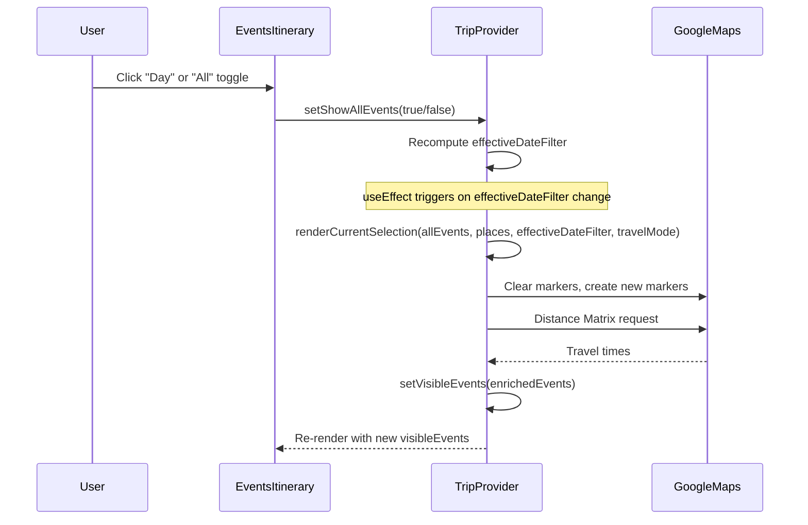
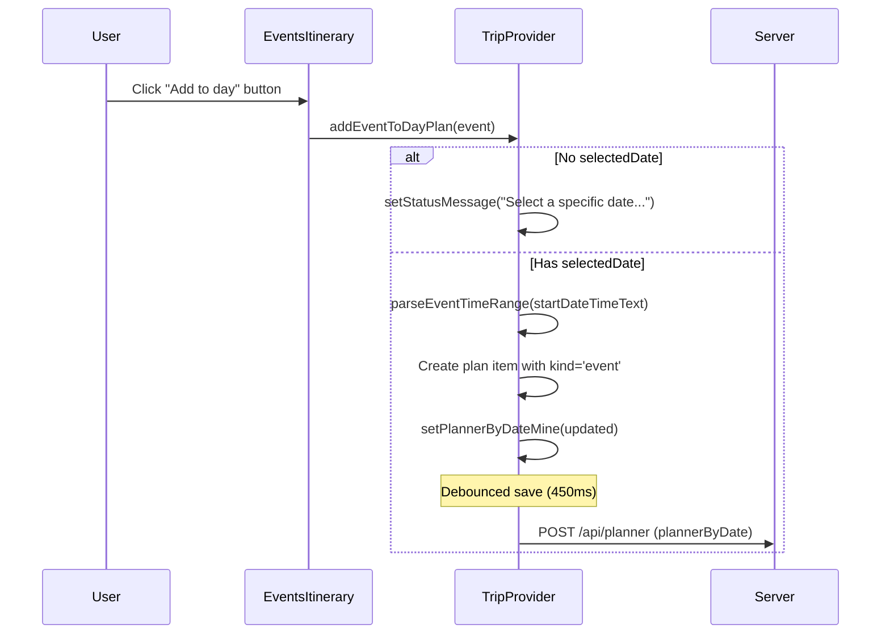

# Events Itinerary: Technical Architecture & Implementation

Document Basis: current code at time of generation.

---

## 1. Summary

The Events Itinerary is a client-side React component that displays a filtered, scrollable list of event cards for a trip. Each card shows the event's name, time, location, travel duration, description, and an "Add to day" button that inserts the event into the day planner. A Day/All toggle controls whether events are filtered to the selected date or shown in full.

**Current shipped scope:**
- Render events filtered by selected date or show all events
- Display event cards with title, time, location, travel time, description
- Time-conflict detection and visual warning between overlapping events
- "Add to day" button to insert an event into the planner for the selected date
- "Open event" link with URL sanitization (HTTPS/HTTP only)
- Loading skeleton during initialization
- Badge counters: number of visible events, number with travel-time data
- Empty state when no events match the active filter

**Out of scope:**
- Event creation/editing (events come from external calendar sync)
- Direct Convex subscriptions from this component (data flows through TripProvider)
- Map marker rendering (handled in TripProvider's `renderCurrentSelection`)

---

## 2. Runtime Placement & Ownership

EventsItinerary is rendered inside the Planning page tab layout:

```
app/trips/[tripId]/planning/page.tsx
  <aside> (sidebar)
    <div> (3-column grid: 140px | 1fr | 1fr)
      <DayList />                   -- column 1
      <EventsItinerary />           -- column 2 (border-r)
      <PlannerItinerary />          -- column 3
    </div>
  </aside>
```

**Lifecycle boundaries:**
- The component is a `'use client'` module (`components/EventsItinerary.tsx:1`).
- It is mounted when the user navigates to the `/planning` tab.
- All state is consumed from `TripProvider` via the `useTrip()` hook -- the component owns zero local state.
- The component unmounts when the user navigates away from the planning tab (App Router client navigation).

**Ownership chain:**
`app/trips/[tripId]/planning/page.tsx:16` imports and renders `<EventsItinerary />`.
TripProvider (`components/providers/TripProvider.tsx`) owns all data, filtering, and mutation logic.

---

## 3. Module/File Map

| File | Responsibility | Key Exports | Dependencies | Side Effects |
|------|---------------|-------------|--------------|--------------|
| `components/EventsItinerary.tsx` | UI rendering of event list + skeleton | `default` (EventsItinerary) | `useTrip`, `Card`, `Button`, `ToggleGroup`, `formatDateDayMonth`, `parseEventTimeRange`, `getSafeExternalHref` | None |
| `components/providers/TripProvider.tsx` | State management: `visibleEvents`, `showAllEvents`, `addEventToDayPlan`, `travelReadyCount` | `useTrip`, `TripProvider` | Convex, Google Maps, fetch APIs | Map markers, travel time calculation, planner persistence |
| `lib/events-api.ts` | Server-side GET handler factory for `/api/events` | `createGetEventsHandler` | `loadEventsPayload`, `runWithAuthenticatedClient` | Network (Convex queries) |
| `lib/events.ts` | Server-side data loading: iCal parsing, Convex read/write, geocoding | `loadEventsPayload`, `syncEvents` | Convex, node-ical, Google Maps Geocoding | File I/O (cache files), Convex mutations |
| `app/api/events/route.ts` | Next.js route handler wiring | `GET` | `createGetEventsHandler` | None |
| `convex/events.ts` | Database queries and mutations for events table | `listEvents`, `getSyncMeta`, `upsertEvents`, `upsertGeocode`, `getGeocodeByAddressKey` | Convex runtime, `authz` | Database writes |
| `convex/schema.ts` | Schema definition for `events` table | `default` (schema) | Convex | None |
| `lib/planner-helpers.ts` | Time parsing, plan slot logic | `parseEventTimeRange`, `getSuggestedPlanSlot`, `createPlanId`, `sortPlanItems` | `helpers.ts` | None |
| `lib/security.ts` | URL sanitization | `getSafeExternalHref` | None | None |
| `lib/helpers.ts` | Date formatting, normalization | `formatDateDayMonth`, `normalizeDateKey`, `daysFromNow` | None | None |
| `components/ui/toggle-group.tsx` | Radix ToggleGroup primitives | `ToggleGroup`, `ToggleGroupItem` | `@radix-ui/react-toggle-group` | None |
| `components/ui/card.tsx` | Card container primitive | `Card` | None | None |
| `components/ui/button.tsx` | Button with CVA variants | `Button` | `@radix-ui/react-slot`, CVA | None |

---

## 4. State Model & Transitions

### State Ownership (all in TripProvider)

| State Variable | Type | Default | Set By | Consumed By |
|---------------|------|---------|--------|-------------|
| `allEvents` | `any[]` | `[]` | Bootstrap fetch, sync response | Filtering logic, map rendering |
| `visibleEvents` | `any[]` | `[]` | `renderCurrentSelection` callback | EventsItinerary, eventLookup, travelReadyCount |
| `showAllEvents` | `boolean` | `true` | User toggle in EventsItinerary | `effectiveDateFilter` derivation |
| `selectedDate` | `string` | `''` | DayList click, auto-select | EventsItinerary header, filtering, addEventToDayPlan |
| `isInitializing` | `boolean` | `true` | Bootstrap sequence | Skeleton vs content switch |
| `effectiveDateFilter` | `string` (derived) | `''` | Derived: `showAllEvents ? '' : selectedDate` | `renderCurrentSelection` |

### Toggle State Machine

```mermaid
stateDiagram-v2
    [*] --> ShowAll : initial (showAllEvents=true)
    ShowAll --> ShowDay : User clicks "Day" toggle
    ShowDay --> ShowAll : User clicks "All" toggle
    ShowDay --> ShowDay : selectedDate changes (stays in Day mode)

    state ShowAll {
        note right of ShowAll
            effectiveDateFilter = ''
            All future events displayed
        end note
    }
    state ShowDay {
        note right of ShowDay
            effectiveDateFilter = selectedDate
            Only events on selectedDate shown
        end note
    }
```

### Data Flow: Event Visibility Pipeline

The `visibleEvents` array is NOT simply `allEvents` filtered by date. It goes through a rendering pipeline in `renderCurrentSelection` (`TripProvider.tsx:1083-1245`):

1. **Date filtering**: `allEvents` filtered by `effectiveDateFilter` (empty = all) + `daysFromNow >= 0` (past events excluded)
2. **Geocoding**: Each event gets `_position` resolved from coordinates or address
3. **Map marker creation**: Markers placed on Google Maps (side effect)
4. **Travel time enrichment**: Distance Matrix API adds `travelDurationText` to each event
5. **State update**: `setVisibleEvents(enrichedEvents)` -- this is what EventsItinerary reads

This means `visibleEvents` includes runtime-enriched fields (`_position`, `travelDurationText`) not present in the raw `allEvents` array.

---

## 5. Interaction & Event Flow

### Core Sequence: Toggle Day/All



### Core Sequence: Add Event to Day Plan



### Conflict Detection Flow

Time conflict detection happens inline during render in `EventsItinerary.tsx:92-97`:

1. For each event, `parseEventTimeRange` extracts `{startMinutes, endMinutes}` from `startDateTimeText`
2. Check every other event in `visibleEvents` for overlap: `eventRange.startMinutes < other.endMinutes && eventRange.endMinutes > other.startMinutes`
3. Events with `eventUrl` equality are excluded from self-comparison
4. If conflict detected, card gets `border-warning-border bg-warning-light` styling and an `AlertTriangle` icon

---

## 6. Rendering / Layers / Motion

### Component Tree

```
EventsItinerary
  |-- EventsItinerarySkeleton  (when isInitializing=true)
  |    |-- 3x skeleton cards with staggered pulse animation
  |-- Header section
  |    |-- <h2> "Events . {date}" (Space Grotesk font)
  |    |-- ToggleGroup (Day/All)
  |    |-- Badge: "{N} showing"
  |    |-- Badge: "{N} travel"
  |-- Card list
       |-- Empty state <p> (when visibleEvents.length === 0)
       |-- N x <Card>
            |-- <h3> event name
            |-- <p> Time
            |-- <p> Conflict warning (conditional)
            |-- <p> Location
            |-- <p> Travel duration (conditional)
            |-- <p> Description
            |-- <Button> "Add to day"
            |-- <a> "Open event" (conditional)
```

### Visual States per Card

| Condition | Border | Background | Extra Element |
|-----------|--------|------------|---------------|
| Default | `border-border` | `bg-card` | -- |
| Hover | `border-accent-border` | -- | `box-shadow: 0 0 0 3px var(--accent-glow)` |
| Time conflict | `border-warning-border` | `bg-warning-light` | AlertTriangle icon + warning text |

### Toggle Group Active State

Active toggle items use CSS class `toggle-item-styled` with `[data-state='on']` selector (`globals.css:121-127`):
- `background: var(--color-accent-light)` = `rgba(0, 255, 136, 0.06)`
- `border-color: var(--color-accent-border)` = `rgba(0, 255, 136, 0.25)`
- `color: var(--color-accent)` = `#00FF88`
- `box-shadow: 0 0 0 3px var(--color-accent-glow)` = `rgba(0, 255, 136, 0.12)`

### Skeleton Animation

3 skeleton cards with staggered `animationDelay` (`100ms` increments). Each card has sub-elements with further staggered delays (`50ms` increments). Uses `animate-pulse` (Tailwind built-in).

### Layout Constraints

- Container: `p-3 overflow-y-auto min-h-0 scrollbar-thin`
- Cards gap: `gap-2` (8px)
- Toggle items: `min-w-[84px]`, `px-5 py-1`
- Card padding: `p-3.5` (14px)
- Text sizing: title `0.92rem`, body `0.82rem`, badges `0.7rem`

---

## 7. API & Prop Contracts

### EventsItinerary Component

Takes no props. All data via `useTrip()`:

```typescript
// Consumed from TripProvider (TripProvider.tsx:1771-1798)
{
  selectedDate: string;              // ISO date e.g. "2026-03-18"
  showAllEvents: boolean;            // Day/All toggle state
  setShowAllEvents: (v: boolean) => void;
  visibleEvents: EventWithPosition[];// Enriched events with _position and travelDurationText
  travelReadyCount: number;          // Count of events with valid travelDurationText
  addEventToDayPlan: (event: Event) => void;
  isInitializing: boolean;           // Show skeleton
  timezone: string;                  // e.g. "America/Los_Angeles"
}
```

### Event Object Shape (runtime, after enrichment)

```typescript
// From convex/events.ts eventRecordValidator + runtime fields
{
  id: string;
  name: string;
  description: string;
  eventUrl: string;                  // Primary key for deduplication
  startDateTimeText: string;         // Human-readable, e.g. "Sat, Mar 21 · 7:00 PM - 10:00 PM"
  startDateISO: string;              // "2026-03-21"
  locationText: string;
  address: string;
  googleMapsUrl: string;
  lat?: number;
  lng?: number;
  sourceId?: string;
  sourceUrl?: string;
  confidence?: number;
  // Runtime-enriched (set by renderCurrentSelection):
  _position?: google.maps.LatLngLiteral;
  travelDurationText?: string;       // e.g. "12 min" or "Unavailable"
}
```

### Server API: GET /api/events

**Route file:** `app/api/events/route.ts`
**Runtime:** Node.js (`export const runtime = 'nodejs'`)

**Query parameters:**
| Param | Type | Default | Description |
|-------|------|---------|-------------|
| `cityId` | string | `''` | Filter events by city |

**Response shape:**
```typescript
{
  meta: {
    syncedAt: string | null;
    calendars: string[];
    eventCount: number;
    spotCount: number;
    source?: 'convex';
    sampleData?: boolean;
  };
  events: Event[];
  places: Place[];
}
```

**Auth:** Requires authenticated session via `runWithAuthenticatedClient` (`lib/api-guards.ts:15-31`).

### Convex Queries (convex/events.ts)

**`listEvents`** (`convex/events.ts:63-84`)
- Args: `{ cityId: string }`
- Auth: `requireAuthenticatedUserId`
- Behavior: Queries `events` table by `by_city` index, filters out `isDeleted`, sorts by `startDateISO` ascending
- Returns: Array of event records (without `_id`, `_creationTime`)

**`upsertEvents`** (`convex/events.ts:176-251`)
- Args: `{ cityId, events[], syncedAt, calendars[], missedSyncThreshold? }`
- Auth: `requireOwnerUserId` (owner only)
- Behavior: Upserts events by `eventUrl`, soft-deletes missing events after `missedSyncThreshold` (default 2) missed syncs, updates `syncMeta`
- Returns: `{ eventCount, syncedAt }`

### parseEventTimeRange (lib/planner-helpers.ts:72-82)

```typescript
function parseEventTimeRange(value: string): { startMinutes: number; endMinutes: number } | null
```

- Parses AM/PM time strings like `"7:00 PM - 10:00 PM"`
- Returns minute-of-day values (e.g., `{startMinutes: 1140, endMinutes: 1320}`)
- If only one time found, adds 90-minute fallback duration
- Returns `null` if no time pattern matches

### getSafeExternalHref (lib/security.ts:133-148)

```typescript
function getSafeExternalHref(value: unknown): string
```

- Returns empty string for non-HTTP/HTTPS URLs
- Returns empty string for malformed URLs
- Returns the normalized URL string for valid HTTP/HTTPS URLs

### addEventToDayPlan (TripProvider.tsx:895-909)

Creates a planner entry:
- `kind: 'event'`
- `sourceKey: event.eventUrl`
- Time from `parseEventTimeRange` or fallback 9:00 AM + 90 min
- Appends to `plannerByDateMine[selectedDate]`, sorted by `startMinutes`
- Requires `selectedDate` to be set; shows error status message if missing

---

## 8. Reliability Invariants

1. **EventsItinerary never fetches data.** All data comes from `useTrip()`. The component is purely presentational + event dispatch.

2. **`visibleEvents` always contains enriched events.** The array goes through `renderCurrentSelection` which adds `_position` and `travelDurationText` before `setVisibleEvents` is called (`TripProvider.tsx:1232-1238`).

3. **Past events are excluded.** `renderCurrentSelection` filters events where `daysFromNow(e.startDateISO) >= 0` (`TripProvider.tsx:1090`). Only today and future events appear.

4. **Soft-delete on sync, never hard delete.** `upsertEvents` increments `missedSyncCount` and sets `isDeleted=true` after threshold, but never removes rows from the database (`convex/events.ts:196-207`).

5. **`eventUrl` is the primary identity key.** Used for: deduplication in `upsertEvents`, `sourceKey` in planner items, conflict self-exclusion check, `eventLookup` map key, and the `by_city_event_url` Convex index.

6. **Toggle state is binary, not nullable.** `showAllEvents` starts `true`, `ToggleGroup` with `type="single"` prevents deselecting both options (Radix enforces at least one selected). Only `'day'` and `'all'` values are handled (`EventsItinerary.tsx:72`).

7. **Conflict detection is O(n^2) per render.** For each event, every other visible event is checked for overlap (`EventsItinerary.tsx:93-97`). Acceptable for typical event counts (tens, not thousands).

8. **Planner save is debounced at 450ms.** After `addEventToDayPlan` updates `plannerByDateMine`, a `setTimeout` of 450ms triggers `savePlannerToServer` (`TripProvider.tsx:522-524`).

---

## 9. Edge Cases & Pitfalls

### No Selected Date

If `selectedDate` is empty when user clicks "Add to day", `addEventToDayPlan` shows an error status message and returns early (`TripProvider.tsx:896`). The button is always rendered regardless.

### Events With Unparseable Times

If `parseEventTimeRange` returns `null` (no AM/PM pattern found), the conflict detection skips that event (`eventRange` is falsy at `EventsItinerary.tsx:93`). When adding to planner, fallback time of 9:00 AM with 90-min duration is used (`TripProvider.tsx:900-901`).

### Empty Event URL

If `eventUrl` is empty/falsy, `getSafeExternalHref` returns `''`, and the "Open event" link is not rendered (`EventsItinerary.tsx:107-109`). However, the event card still renders, and the eventUrl is still used as the React `key` prop (`EventsItinerary.tsx:99`), which could cause issues if multiple events have empty URLs.

### Travel Duration Not Yet Loaded

`travelDurationText` starts as `''` (set in `renderCurrentSelection` at `TripProvider.tsx:1098`). The card only renders the travel line if `event.travelDurationText` is truthy (`EventsItinerary.tsx:104`). The `travelReadyCount` badge excludes events where `travelDurationText` is `'Unavailable'` (`TripProvider.tsx:1758-1760`).

### Skeleton Variant

The skeleton is a separate internal function component `EventsItinerarySkeleton` (not exported). It shows 3 cards with 4 rotating title widths (`w-4/5`, `w-3/5`, `w-2/3`, `w-3/4`). It renders only when `isInitializing` is true (`EventsItinerary.tsx:53-55`).

### Large Event Lists

Conflict detection is O(n^2). With hundreds of visible events, rendering could become sluggish. There is no virtualization or pagination; the list is fully rendered and relies on `overflow-y-auto` scrolling.

---

## 10. Testing & Verification

### Existing Test Files

| File | Coverage Area |
|------|--------------|
| `lib/events-api.test.mjs` | `createGetEventsHandler`: auth denial returns 401, success returns payload |
| `lib/events.test.mjs` | `syncEvents`, `createSourcePayload`, iCal parsing, Convex read/write mocks |
| `lib/events.planner.test.mjs` | Planner-specific event logic |
| `convex/authz.test.mjs` | `requireAuthenticatedUserId`, `requireOwnerUserId` |
| `lib/security.test.mjs` | `getSafeExternalHref` URL sanitization |

### Test Gaps

- No unit tests for `EventsItinerary.tsx` component rendering
- No unit tests for conflict detection logic
- No tests for `parseEventTimeRange` edge cases (only one time found, no match, midnight crossing)
- No integration tests for the Day/All toggle filter flow

### Manual Verification Scenarios

1. **Day/All toggle**: Select a date in DayList, verify "Day" shows only that date's events. Switch to "All", verify all future events appear. Badge counts should update.
2. **Conflict detection**: Have two events on the same date with overlapping times. Verify both show orange warning border and AlertTriangle icon.
3. **Add to day**: Click "Add to day" on an event. Verify it appears in PlannerItinerary. Verify time slot matches the event's parsed time.
4. **No date selected**: Clear date selection, click "Add to day". Verify error message appears in StatusBar.
5. **Empty state**: Switch to "Day" filter for a date with no events. Verify "No events found for this filter." message.
6. **Skeleton**: Reload the page, verify skeleton with 3 pulsing cards appears before data loads.

### Running Tests

```bash
# Run events API tests
node --test lib/events-api.test.mjs

# Run events server logic tests
node --test lib/events.test.mjs

# Run security tests (covers getSafeExternalHref)
node --test lib/security.test.mjs
```

---

## 11. Quick Change Playbook

| If you want to... | Edit... |
|-------------------|---------|
| Change event card layout/fields | `components/EventsItinerary.tsx:98-111` |
| Change conflict detection logic | `components/EventsItinerary.tsx:92-97` |
| Change conflict visual styling | `components/EventsItinerary.tsx:99` (card class) and `EventsItinerary.tsx:102` (warning paragraph) |
| Add a new toggle option (e.g., "Week") | `components/EventsItinerary.tsx:68-76` (add ToggleGroupItem) + `TripProvider.tsx:409` (update effectiveDateFilter derivation) + `TripProvider.tsx:1087-1090` (update renderCurrentSelection filter) |
| Change the Day/All default | `components/providers/TripProvider.tsx:258` (`useState(true)` = All by default) |
| Change how events are filtered by date | `components/providers/TripProvider.tsx:1087-1090` (renderCurrentSelection filter logic) |
| Change the "Add to day" time slot logic | `components/providers/TripProvider.tsx:895-909` (addEventToDayPlan) |
| Change planner save debounce | `components/providers/TripProvider.tsx:522` (450ms timeout) |
| Change travel-ready badge criteria | `components/providers/TripProvider.tsx:1758-1760` |
| Modify the events API response shape | `lib/events-api.ts` + `lib/events.ts:329-392` (loadEventsPayload) |
| Change event schema / add fields | `convex/schema.ts:129-152` (events table) + `convex/events.ts:5-20` (eventValidator) + `convex/events.ts:21-41` (eventRecordValidator) |
| Change Convex event query sort order | `convex/events.ts:78-82` (sort in listEvents handler) |
| Change soft-delete threshold | `convex/events.ts:188` (missedSyncThreshold, default 2) |
| Modify skeleton appearance | `components/EventsItinerary.tsx:12-43` (EventsItinerarySkeleton) |
| Change toggle active styling | `app/globals.css:121-127` (`[data-state='on'].toggle-item-styled`) |
| Change card hover glow | `components/EventsItinerary.tsx:99` (hover classes) + `app/globals.css:17` (accent-glow value) |
| Change warning colors | `app/globals.css:20-22` (warning color vars) |
| Change header font | `components/EventsItinerary.tsx:63` (inline fontFamily style) |
