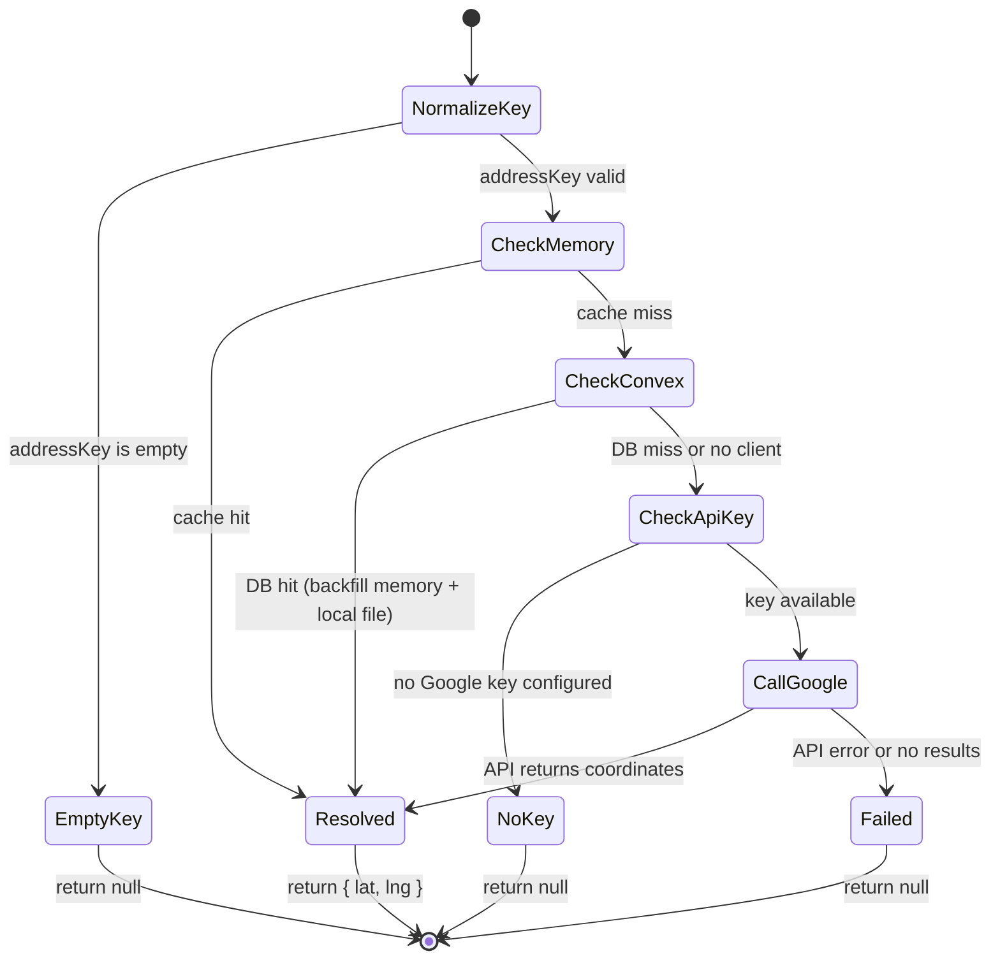
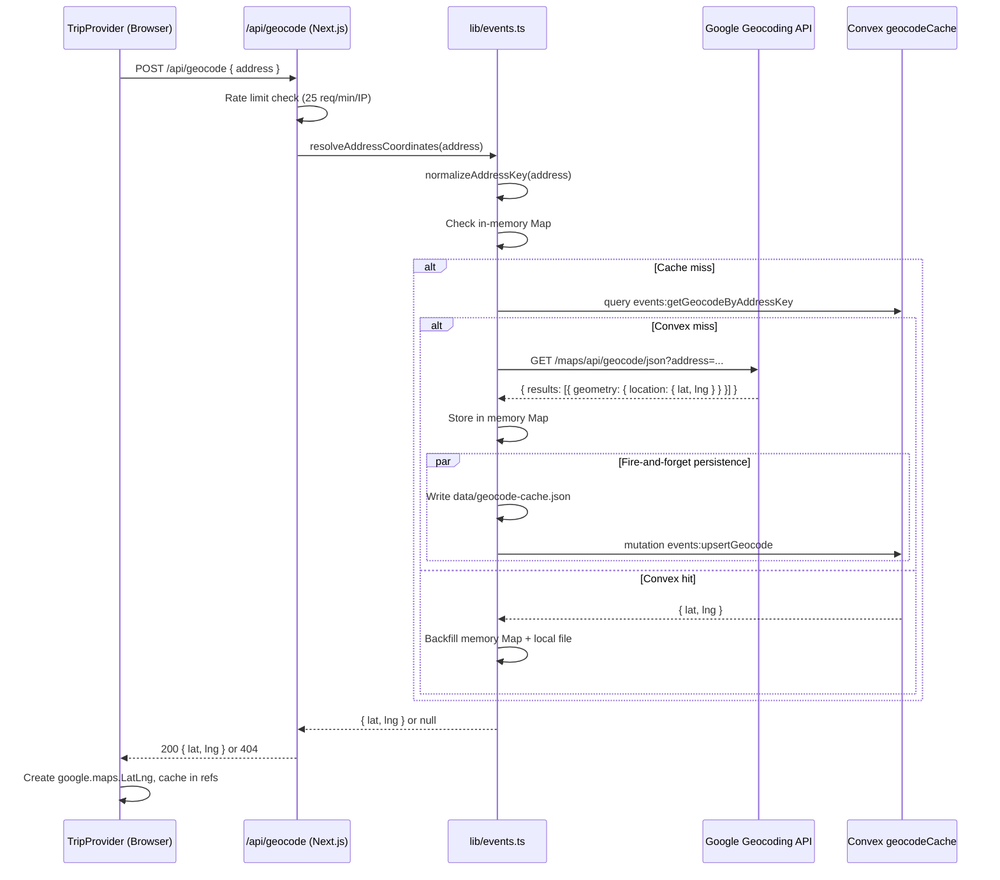

# Geocoding: Technical Architecture & Implementation

Document Basis: current code at time of generation (2026-03-15).

---

## 1. Summary

Geocoding converts street addresses and location names into lat/lng coordinates so that events and spots can be plotted on the Google Maps panel. The system operates at two layers:

- **Server-side enrichment** -- During event/spot sync, addresses are geocoded via the Google Geocoding API and cached in both a local JSON file and the Convex `geocodeCache` table. Coordinates are written directly onto event/spot records.
- **Client-side on-demand geocoding** -- The browser calls `POST /api/geocode` when it needs to resolve an address for map marker placement (e.g., base location, items missing pre-resolved coordinates).

**In scope:** address normalization, multi-tier caching (in-memory Map, local JSON file, Convex DB), Google Geocoding API calls, coordinate extraction from Google Maps URLs, rate limiting, coordinate enrichment for events and spots.

**Out of scope:** route calculation (separate `/api/route` endpoint), crime heatmap coordinates, Google Maps JavaScript API loading.

---

## 2. Runtime Placement & Ownership

| Context | Owner | Purpose |
|---------|-------|---------|
| Server-side (Node.js API routes) | `lib/events.ts` | Geocodes during sync and via `/api/geocode` endpoint |
| Server-side (Convex backend) | `convex/events.ts` | Persists/retrieves geocode cache entries |
| Client-side (React) | `components/providers/TripProvider.tsx` | Calls `/api/geocode`, maintains in-memory position cache |

Server-side geocoding runs in the Node.js runtime (`export const runtime = 'nodejs'` in `app/api/geocode/route.ts:5`). The Convex functions run in Convex's serverless runtime.

---

## 3. Module/File Map

| File | Responsibility | Key Exports / Functions | Dependencies | Side Effects |
|------|---------------|------------------------|--------------|--------------|
| `app/api/geocode/route.ts` | HTTP endpoint for client-side geocoding | `POST` handler | `lib/events.ts`, `lib/api-guards.ts`, `lib/security.ts` | Rate limiting state mutation |
| `lib/events.ts` | Core geocoding logic, cache management, enrichment | `resolveAddressCoordinates()` | Google Geocoding API, Convex client, local filesystem | Writes `data/geocode-cache.json`, writes to Convex `geocodeCache` table |
| `lib/helpers.ts` | Shared address normalization (client+server) | `normalizeAddressKey()` | None | None |
| `convex/schema.ts` | Schema definition for `geocodeCache` table | Schema export | `convex/server` | None |
| `convex/events.ts` | Convex queries/mutations for geocode cache | `getGeocodeByAddressKey`, `upsertGeocode` | `convex/server`, `convex/authz` | DB reads/writes |
| `components/providers/TripProvider.tsx` | Client-side geocode consumer, position resolution | `geocode()`, `resolvePosition()` | `/api/geocode` endpoint, Google Maps JS API | In-memory cache via refs |
| `lib/map-helpers.ts` | Coordinate utilities, pin icon rendering | `toLatLngLiteral()`, `toCoordinateKey()` | None | None |
| `data/geocode-cache.json` | Local filesystem geocode cache | N/A (JSON data) | N/A | Read/written by `lib/events.ts` |
| `lib/planner-helpers.ts` | Exports `GEOCODE_CACHE_STORAGE_KEY` constant | `GEOCODE_CACHE_STORAGE_KEY` | None | None (constant is currently unused -- browser cache intentionally disabled) |

---

## 4. State Model & Transitions

Geocoding is a stateless request/response flow with caching layers. There is no persistent state machine, but each geocode lookup follows a deterministic resolution cascade.

### Resolution Cascade (Server-Side)

```
geocodeAddressWithCache(addressText)
  |
  |--> normalizeAddressKey(addressText) --> addressKey
  |
  |--> [1] Check in-memory Map (geocodeCacheMapPromise)
  |     |-- HIT --> return { lat, lng }
  |
  |--> [2] Check Convex DB (events:getGeocodeByAddressKey)
  |     |-- HIT --> populate in-memory Map, persist to local JSON, return
  |
  |--> [3] Check for Google API key (getGoogleGeocodingKey)
  |     |-- MISSING --> return null
  |
  |--> [4] Call Google Geocoding API
  |     |-- OK --> store in-memory, persist to local JSON + Convex (fire-and-forget)
  |     |-- FAIL --> return null
```

### Resolution Cascade (Client-Side)

```
resolvePosition({ cacheKey, mapLink, fallbackLocation, lat, lng })
  |
  |--> [1] Check positionCacheRef (in-memory Map)
  |     |-- HIT --> return LatLng
  |
  |--> [2] Check if lat/lng already provided on record
  |     |-- VALID --> create LatLng, cache, return
  |
  |--> [3] Parse lat/lng from mapLink URL (?query=lat,lng)
  |     |-- FOUND --> cache, return
  |
  |--> [4] Check geocodeStoreRef by normalized addressKey
  |     |-- HIT --> create LatLng, cache, return
  |
  |--> [5] Call /api/geocode (which runs server cascade above)
  |     |-- OK --> cache in positionCacheRef + geocodeStoreRef, return
  |     |-- FAIL --> return null
```

### Mermaid State Diagram



---

## 5. Interaction & Event Flow

### Server-Side Enrichment (During Sync)

Events and spots are geocoded during sync operations. Three enrichment functions follow the same pattern:

1. **`enrichEventsWithCoordinates(events)`** (`lib/events.ts:1863`) -- called after event deduplication during sync (`lib/events.ts:1182`). For each event:
   - Skip if `lat`/`lng` already present
   - Try extracting from `googleMapsUrl` via `parseLatLngFromMapUrl()`
   - Fall back to `geocodeAddressWithCache(event.address || event.locationText)`

2. **`_enrichPlacesWithCoordinates(places)`** (`lib/events.ts:1557`) -- same pattern for spots using `place.location || place.name` as geocode target.

3. **`ensureStaticPlacesCoordinates(places)`** (`lib/events.ts:1814`) -- same pattern for static places; additionally persists changes back to `data/static-places.json`.

### Client-Side On-Demand Geocoding



---

## 6. Rendering/Layers/Motion

This feature has no direct rendering output. It produces `{ lat, lng }` coordinate pairs consumed by:

- **MapPanel** -- map marker placement via `google.maps.marker.AdvancedMarkerElement`
- **TripProvider.resolvePosition** -- feeds coordinates into marker creation loops (`TripProvider.tsx:1094-1138`)
- **Base location marker** -- geocodes the user's `baseLocation` config string to place a home marker (`TripProvider.tsx:1356`, `TripProvider.tsx:1672`)

No z-index, animation, or layer-stack concerns apply to geocoding itself.

---

## 7. API & Prop Contracts

### HTTP Endpoint: `POST /api/geocode`

**Authentication:** Required (via `runWithAuthenticatedClient`).

**Rate Limit:** 25 requests per 60 seconds per IP (`app/api/geocode/route.ts:10-12`).

**Request:**
```json
{
  "address": "string (max 300 chars, trimmed)"
}
```

**Responses:**

| Status | Body | Condition |
|--------|------|-----------|
| 200 | `{ "lat": number, "lng": number }` | Successfully geocoded |
| 400 | `{ "error": "Invalid geocode request payload." }` | Malformed JSON body |
| 400 | `{ "error": "Address is required." }` | Empty/missing address |
| 401 | `{ "error": "..." }` | Not authenticated (from `runWithAuthenticatedClient`) |
| 404 | `{ "error": "Unable to geocode this address." }` | Google API returned no results |
| 429 | `{ "error": "Too many geocode requests. Please retry shortly." }` | Rate limit exceeded; includes `Retry-After` header |

### Convex Query: `events:getGeocodeByAddressKey`

```typescript
// Args
{ addressKey: string }

// Returns: null | { addressKey: string, lat: number, lng: number, updatedAt: string }
```

Requires authenticated user (`requireAuthenticatedUserId`). Looks up by `by_address_key` index on `geocodeCache` table (`convex/events.ts:105-128`).

### Convex Mutation: `events:upsertGeocode`

```typescript
// Args
{
  addressKey: string,
  addressText: string,
  lat: number,
  lng: number,
  updatedAt: string   // ISO 8601
}

// Returns: { addressKey: string, updatedAt: string }
```

Requires authenticated user. Performs upsert: if a row exists with the same `addressKey`, patches only if `addressText`, `lat`, or `lng` differ. Otherwise inserts a new row (`convex/events.ts:130-174`).

### Key Internal Functions

**`resolveAddressCoordinates(addressText)`** (`lib/events.ts:176-186`)
- Public entry point used by the API route
- Returns `{ lat, lng }` or `null`

**`geocodeAddressWithCache(addressText)`** (`lib/events.ts:2017-2053`)
- Private; implements the full resolution cascade
- Returns `{ lat, lng }` or `null`

**`geocodeAddressViaGoogle(addressText, apiKey)`** (`lib/events.ts:2064-2092`)
- Private; makes the actual Google API call
- Uses `cache: 'no-store'` on the fetch request
- Extracts `results[0].geometry.location` from response

**`normalizeAddressKey(value)`** -- exists in two places:
- `lib/helpers.ts:18-24` (shared, used by client-side TripProvider)
- `lib/events.ts:2094-2102` (server-side, includes `cleanText()` preprocessing)
- Both produce: `lowercase, strip non-[word/space/comma/period/hyphen], collapse whitespace, trim`

**`parseLatLngFromMapUrl(url)`** (`lib/events.ts:1963-1984`)
- Extracts coordinates from Google Maps URLs containing `?query=lat,lng`
- Used as a fast path before geocoding

**`getGoogleGeocodingKey()`** (`lib/events.ts:2055-2061`)
- Resolution order: `GOOGLE_MAPS_GEOCODING_KEY` > `GOOGLE_MAPS_SERVER_KEY` > `GOOGLE_MAPS_BROWSER_KEY`

---

## 8. Reliability Invariants

These must remain true after refactors:

1. **Address keys are deterministic.** The same input text always produces the same `addressKey` after normalization. This is the cache's correctness guarantee.

2. **Geocoding never blocks sync completion.** Failures from Google API or Convex writes are swallowed (`lib/events.ts:2047-2050` uses `Promise.allSettled`; `saveGeocodeToConvex` catches all errors at `lib/events.ts:2200-2202`).

3. **The resolution cascade is ordered: memory > Convex > Google.** Skipping a tier (e.g., removing Convex lookup) would increase Google API costs.

4. **Items without coordinates are still stored.** If all geocoding attempts fail, the event/spot is pushed to the result array without `lat`/`lng` (`lib/events.ts:1590`, `1850`, `1894`). It will render in lists but not on the map.

5. **Rate limiting is per-IP, in-process.** The rate limit state lives in a module-level `Map` (`lib/security.ts:1`). It resets on server restart and is not shared across serverless instances.

6. **Browser geocode cache is intentionally in-memory only.** The `saveGeocodeCache` callback is a no-op (`TripProvider.tsx:534-536`). The comment explicitly states this avoids persisting sensitive location data in browser storage.

7. **Convex `upsertGeocode` only patches on actual change.** It compares `addressText`, `lat`, and `lng` before writing, avoiding unnecessary mutations (`convex/events.ts:156-159`).

---

## 9. Edge Cases & Pitfalls

| Scenario | Behavior | Citation |
|----------|----------|----------|
| Empty or whitespace-only address | `normalizeAddressKey` returns empty string, `geocodeAddressWithCache` returns `null` immediately | `lib/events.ts:2019-2021` |
| Address > 300 characters (via API) | Truncated to 300 chars by the route handler | `app/api/geocode/route.ts:41` |
| No Google API key configured | Geocoding silently returns `null`; items render without map markers | `lib/events.ts:2036-2038` |
| Google API returns non-OK status | Returns `null`, no error thrown | `lib/events.ts:2079-2081` |
| Google API returns OK but geometry missing | Coordinate validation fails (`isFiniteCoordinate`), returns `null` | `lib/events.ts:2087-2088` |
| Convex client unavailable | `createConvexClient()` returns `null`, cache tier is skipped | `lib/events.ts:2164-2168` |
| Read-only filesystem (e.g., Vercel) | `persistGeocodeCacheMap` silently skips the write via `writeTextFileBestEffort` | `lib/events.ts:67-85` |
| Two `normalizeAddressKey` implementations | `lib/helpers.ts` (client) and `lib/events.ts` (server) use the same regex logic but the server version wraps input through `cleanText()` first, which collapses internal whitespace. In practice the output is identical for normal addresses. | `lib/helpers.ts:18-24`, `lib/events.ts:2094-2102` |
| Module-level singleton cache (`geocodeCacheMapPromise`) | The in-memory Map is lazily initialized once per Node.js process. In serverless (cold start per invocation), this means the local file is re-read each time. In long-running dev servers, it persists. | `lib/events.ts:46`, `2113-2139` |
| Google Maps URL without `?query=` param | `parseLatLngFromMapUrl` returns `null`, falls through to geocoding | `lib/events.ts:1970` |

---

## 10. Testing & Verification

### Existing Test Coverage

No dedicated geocoding tests were found in the codebase. The geocoding functions are private to `lib/events.ts` (except `resolveAddressCoordinates`) and are not directly unit-tested.

### Manual Verification Scenarios

1. **Verify geocode API endpoint:**
   ```bash
   curl -X POST http://localhost:3000/api/geocode \
     -H "Content-Type: application/json" \
     -H "Cookie: <auth-cookie>" \
     -d '{"address": "Ferry Building, San Francisco"}'
   # Expected: 200 { "lat": 37.7955..., "lng": -122.3937... }
   ```

2. **Verify rate limiting:**
   Send 26 requests within 60 seconds to the same endpoint. The 26th should return 429 with `Retry-After` header.

3. **Verify cache population:**
   After a successful geocode, check `data/geocode-cache.json` for the normalized address key. Also verify in Convex dashboard that a `geocodeCache` row was created.

4. **Verify enrichment during sync:**
   Trigger an event sync (via `/api/sync`). Events with addresses but no pre-existing coordinates should gain `lat`/`lng` fields in Convex.

5. **Verify graceful degradation:**
   Remove `GOOGLE_MAPS_GEOCODING_KEY` from `.env.local`. Sync should complete without errors; events/spots simply lack coordinates and do not appear as map markers.

---

## 11. Quick Change Playbook

| Goal | Files to Edit |
|------|--------------|
| Change the Google Geocoding API key environment variable name | `lib/events.ts:2055-2061` (`getGoogleGeocodingKey()`) |
| Increase/decrease API rate limit | `app/api/geocode/route.ts:11-12` (change `limit` or `windowMs`) |
| Add a new cache tier (e.g., Redis) | Insert a new check between the Convex lookup and Google API call in `geocodeAddressWithCache()` at `lib/events.ts:2034` |
| Change address normalization logic | Update both `lib/helpers.ts:18-24` (client) AND `lib/events.ts:2094-2102` (server) to keep them in sync |
| Switch from Google Geocoding to another provider | Replace the body of `geocodeAddressViaGoogle()` at `lib/events.ts:2064-2092`; the cache layer is provider-agnostic |
| Enable browser-side geocode persistence | Replace the no-op `saveGeocodeCache` at `TripProvider.tsx:534-536` with actual localStorage/sessionStorage logic using `GEOCODE_CACHE_STORAGE_KEY` from `lib/planner-helpers.ts:17` |
| Change the geocode cache Convex schema | `convex/schema.ts:194-200`, then update validators in `convex/events.ts:48-57` |
| Change how spots resolve coordinates | Modify `_enrichPlacesWithCoordinates()` at `lib/events.ts:1557` and/or `ensureStaticPlacesCoordinates()` at `lib/events.ts:1814` |
| Change how events resolve coordinates | Modify `enrichEventsWithCoordinates()` at `lib/events.ts:1863` |
| Add geocoding for a new entity type | Follow the pattern: check existing lat/lng, try `parseLatLngFromMapUrl()`, fall back to `geocodeAddressWithCache()`, push result with or without coordinates |

---

## Appendix: Convex `geocodeCache` Table Schema

```typescript
// convex/schema.ts:194-200
geocodeCache: defineTable({
  addressKey: v.string(),     // normalized lowercase address
  addressText: v.string(),    // original address text (cleaned)
  lat: v.number(),
  lng: v.number(),
  updatedAt: v.string()       // ISO 8601 timestamp
}).index('by_address_key', ['addressKey'])
```

## Appendix: Local Cache File Format

```json
// data/geocode-cache.json
{
  "san francisco, ca": {
    "lat": 37.7749295,
    "lng": -122.4194155
  }
}
```

Keys are normalized address strings. Values contain only `lat` and `lng` (no metadata). The file is pretty-printed with 2-space indent and a trailing newline (`lib/events.ts:2157`).

## Appendix: Environment Variables

| Variable | Required | Fallback | Purpose |
|----------|----------|----------|---------|
| `GOOGLE_MAPS_GEOCODING_KEY` | No | `GOOGLE_MAPS_SERVER_KEY` then `GOOGLE_MAPS_BROWSER_KEY` | Server-side geocoding API key |
| `GOOGLE_MAPS_SERVER_KEY` | No | `GOOGLE_MAPS_BROWSER_KEY` | General server-side Google Maps key |
| `GOOGLE_MAPS_BROWSER_KEY` | Yes | None | Client-side Maps JS API; also last-resort geocoding key |
| `CONVEX_URL` / `NEXT_PUBLIC_CONVEX_URL` | Yes | None | Required for Convex cache tier to function |
