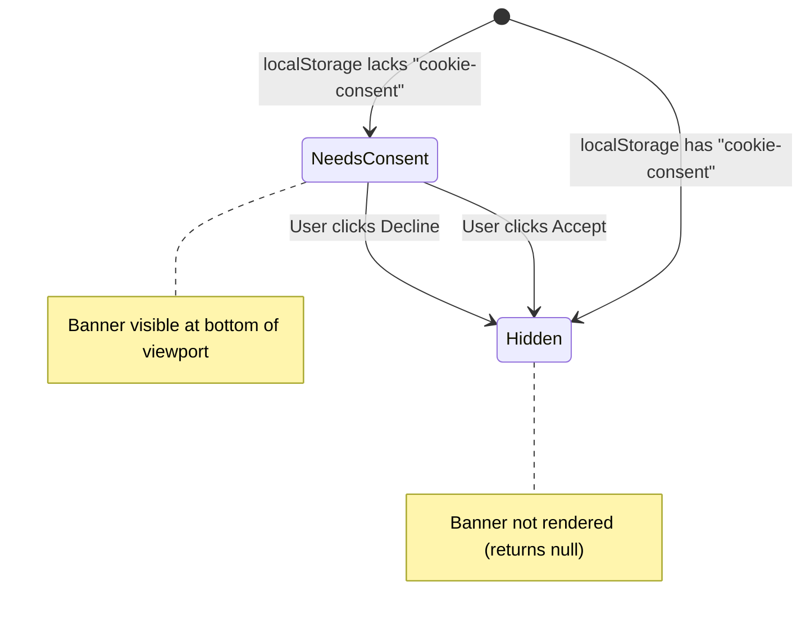
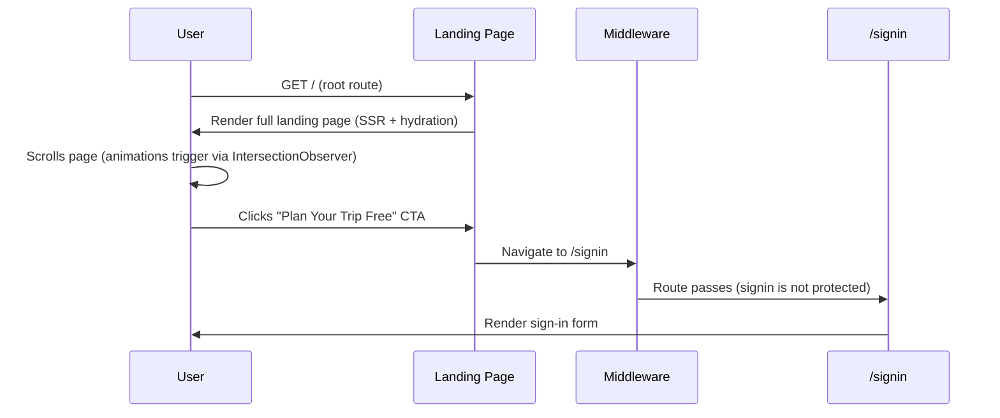

# Landing Page: Technical Architecture & Implementation

**Document Basis**: current code at time of generation.

---

## 1. Summary

The Landing Page is the public-facing marketing surface of Trip Planner, rendered at the root route `/`. It is a statically-renderable Next.js page composed of a hero section, problem statement, feature showcase sections (map, safety, spots, planner, calendar), a tech stack badge grid, a final CTA, and a footer. It uses scroll-driven Framer Motion animations, structured data (JSON-LD), OG/Twitter image generation, and links exclusively to `/signin` as the conversion target.

**Current shipped scope:**
- Server Component entry (`app/page.tsx`) with SEO metadata + JSON-LD structured data
- Client Component body (`app/landing/LandingContent.tsx`) with all visual sections
- Client Component animation primitives (`app/landing/LandingMotion.tsx`)
- OG image generation (`app/opengraph-image.tsx`) reused for Twitter (`app/twitter-image.tsx`)
- Cookie consent banner (`components/CookieConsent.tsx`) rendered globally from layout

**Out of scope:**
- No authentication logic on the landing page itself
- No data fetching (Convex queries, API calls, etc.)
- No interactive forms (sign-in form lives at `/signin`)

---

## 2. Runtime Placement & Ownership

### Route mounting

The landing page is the **root route** (`/`). The `app/page.tsx` file is a React Server Component that exports metadata and renders `<LandingContent />`.

### Provider chain

```
RootLayout (app/layout.tsx)                 [Server Component]
  -> ConvexAuthNextjsServerProvider         [Auth server wrapper]
    -> ConvexClientProvider                 [Client-side Convex + Auth]
      -> HomePage (app/page.tsx)            [Server Component]
        -> <script type="application/ld+json">  [JSON-LD injection]
        -> LandingContent                   [Client Component — 'use client' via LandingMotion]
          -> MotionProvider (LazyMotion)     [Framer Motion context]
```

`app/page.tsx:125-135`

### Middleware behavior

The landing page route (`/`) is **not** in the protected route list. The middleware only protects `/dashboard(.*)`, `/map(.*)`, `/calendar(.*)`, `/planning(.*)`, `/spots(.*)`, `/config(.*)`. The root route passes through without auth checks.

`middleware.ts:8-15`

### Lifecycle boundaries

- The page has **no client-side state** beyond Framer Motion internal animation state and the globally-mounted `CookieConsent` component (which manages its own `localStorage` state).
- All content is static. There are no `useEffect`, `useState`, or data-fetching hooks in `LandingContent.tsx`.
- The `CookieConsent` component is mounted in `app/layout.tsx:62` and appears on every page, including the landing page.

---

## 3. Module/File Map

| File | Responsibility | Exports | Dependencies | Side Effects |
|------|---------------|---------|--------------|-------------|
| `app/page.tsx` | Root route entry, SEO metadata, JSON-LD structured data | `metadata` (named), `HomePage` (default) | `LandingContent` | Injects `<script type="application/ld+json">` |
| `app/landing/LandingContent.tsx` | All visual sections: nav, hero, problem, features, screenshots, CTA, footer | `LandingContent` (default) | `LandingMotion`, `next/image`, `next/link`, `lucide-react` | None |
| `app/landing/LandingMotion.tsx` | Framer Motion animation primitives (`'use client'`) | `MotionProvider`, `ScrollProgressBar`, `NavEnter`, `InViewStagger`, `FadeItem`, `HoverLift`, `HeroParallax`, `ArrowNudge` | `framer-motion` | Scroll listeners (via `useScroll`) |
| `app/opengraph-image.tsx` | Dynamic OG image generation (1200x630) | `OgImage` (default), `runtime`, `alt`, `size`, `contentType` | `next/og`, `node:fs`, `node:path` | Reads font/image files from disk at build time |
| `app/twitter-image.tsx` | Twitter card image (re-exports OG image) | Re-exports from `opengraph-image` | `./opengraph-image` | None |
| `app/layout.tsx` | Root layout with fonts, providers, analytics, cookie consent | `metadata` (named), `RootLayout` (default) | `ConvexClientProvider`, `CookieConsent`, `@vercel/analytics`, `next/font/google`, `next/script` | Buy Me a Coffee widget script (env-gated) |
| `components/CookieConsent.tsx` | GDPR cookie consent banner | `CookieConsent` (default) | `react`, `@/components/ui/button` | `localStorage` read/write |
| `app/globals.css` | Design tokens, base styles, keyframe animations | N/A | `tailwindcss` | Global styles |

---

## 4. State Model & Transitions

The landing page is fundamentally **stateless** from a business-logic perspective. The only stateful behaviors are:

1. **Framer Motion animation state** -- managed internally by the motion library. Not application state.
2. **CookieConsent component** -- binary consent state persisted in `localStorage` under key `cookie-consent`.

### CookieConsent State



**State storage:** `localStorage.getItem('cookie-consent')` -- values are `'accepted'` or `'declined'`.

`components/CookieConsent.tsx:6,25-28`

### Scroll progress state

`ScrollProgressBar` reads `scrollYProgress` from `useScroll()` and maps it to a `scaleX` transform on a fixed 1px bar. This is a derived visual state, not application state.

`app/landing/LandingMotion.tsx:47-61`

---

## 5. Interaction & Event Flow

### Primary user journey



### CTA click targets

There are exactly **4 CTA links** on the landing page, all pointing to `/signin`:

| Location | Element | Link Target | Text |
|----------|---------|-------------|------|
| Nav bar (top-right) | `<Link>` | `/signin` | "Plan Your Trip Free" |
| Hero section | `<Link>` | `/signin` | "Plan Your Trip Free" |
| Hero section | `<a>` | `https://github.com/madeyexz/SF_trip` (external) | "View on GitHub" |
| Bottom CTA section | `<Link>` | `/signin` | "Plan Your Trip Free" |

`app/landing/LandingContent.tsx:148-150, 198-204, 209, 655-660`

### Safety data source links

Four external links to city open data portals in the Safety section:

| City | URL |
|------|-----|
| SF | `https://data.sfgov.org/d/wg3w-h783` |
| NYC | `https://data.cityofnewyork.us/d/5uac-w243` |
| LA | `https://data.lacity.org/d/2nrs-mtv8` |
| Chicago | `https://data.cityofchicago.org/d/ijzp-q8t2` |

`app/landing/LandingContent.tsx:35-56`

---

## 6. Rendering/Layers/Motion

### Page section order (top to bottom)

| # | Section ID | Section Label | Heading | Border |
|---|-----------|---------------|---------|--------|
| 0 | Nav | -- | "Trip Planner" | `border-b` |
| 1 | Hero | "Free & Open Source" (badge) | "Turn 50 Open Tabs Into One Trip Plan" | `border-b`, `min-h-[80vh]` |
| 2 | Problem | "The Problem" | "Sound Familiar?" | `border-b` |
| 3 | See Everything | "See Everything" | "See Before You Plan" | `border-b` |
| 4 | Map Screenshot | "Map" | "Events, Spots, and Crime -- One Map" | `border-b` |
| 5 | Safety | "Safety" | "Know Where to Walk -- and Where Not To" | `border-b` |
| 6 | Spots Screenshot | "Spots" | "Every Recommendation in One List" | `border-b` |
| 7 | Plan It | "Plan It" | "Now Make It Happen" | `border-b` |
| 8 | Calendar Screenshot | "Calendar" | "Spot Packed Days and Empty Ones" | `border-b` |
| 9 | Tech Stack | "Under the Hood" | "Open Source. Ship It Yourself." | `border-b` |
| 10 | Final CTA | "// READY_TO_LAUNCH" | "Close the 47 Tabs. Open One Planner." | none |
| 11 | Footer | -- | "Trip Planner" | `border-t` |

### Z-index stack

| Layer | z-index | Element |
|-------|---------|---------|
| Nav bar | `z-50` | `<NavEnter>` -- fixed position, top 0 |
| Scroll progress bar | `z-40` | `<ScrollProgressBar>` -- fixed, `top-12` (below nav) |
| Cookie consent | `z-50` | `<CookieConsent>` -- fixed, bottom 0 |
| Hero content | `z-10` | Hero text/buttons (relative, above background effects) |
| Hero grid overlay | implicit (0) | `pointer-events-none`, `opacity-[0.04]` |
| Hero glow | implicit (0) | `pointer-events-none`, blurred radial gradient |

### Animation system

All animations are provided by `app/landing/LandingMotion.tsx`, which is a `'use client'` module using `framer-motion` with `LazyMotion` + `domAnimation` for tree-shaking.

**Every animation component respects `prefers-reduced-motion`** via `useReducedMotion()`. When reduced motion is preferred, all components render plain `<div>` or `<span>` elements with no animation.

`app/landing/LandingMotion.tsx:48-53, 70-73, 97-100, 123-125, 149-152, 174-180, 198-199`

### Animation components and constants

| Component | Trigger | Motion | Constants |
|-----------|---------|--------|-----------|
| `MotionProvider` | Mount | None (context provider) | `LazyMotion features={domAnimation}` |
| `ScrollProgressBar` | Scroll | `scaleX` bound to `scrollYProgress` | Fixed bar, 1px height, `bg-accent/70` |
| `NavEnter` | Mount | Slide down from `y: -12` | Spring: stiffness 220, damping 25 |
| `InViewStagger` | Viewport entry | Stagger children | `staggerChildren: 0.08`, `delayChildren: 0.06`, viewport `once: true` |
| `FadeItem` | Parent stagger | Fade up from `y: 20, opacity: 0` | Spring: stiffness 170, damping 24 |
| `HoverLift` | Hover / Tap | Translate on hover, scale on tap | Default `y: -2`, `tapScale: 0.985`; Spring: stiffness 320, damping 24 |
| `HeroParallax` | Scroll | Parallax `y: [0, -28]`, opacity `[1, 0.9]` in first 25% scroll | Hover scale: 1.005; Spring: stiffness 300, damping 28 |
| `ArrowNudge` | Continuous | `x: [0, 2, 0]` loop | Duration 1.4s, `repeat: Infinity`, `ease: 'easeInOut'` |

`app/landing/LandingMotion.tsx:14-41` (variant definitions)

### Screenshot images used

| Image | Section | `priority` | Dimensions |
|-------|---------|-----------|------------|
| `/screenshots/planning.png` | Hero | `true` | 1920x1080 |
| `/screenshots/map.png` | Map section | `false` | 1280x720 |
| `/screenshots/spots.png` | Spots section | `false` | 1280x720 |
| `/screenshots/calendar.png` | Calendar section | `false` | 1280x720 |

Each screenshot is wrapped in a faux window chrome header:
```
<div className="flex h-8 items-center ... bg-card">
  <span>{'// SECTION_LABEL'}</span>
</div>
<Image ... />
```

`app/landing/LandingContent.tsx:224-237, 381-393, 491-505, 558-572`

---

## 7. API & Prop Contracts

### Public components

**`LandingContent`** -- No props. Self-contained default export.

`app/landing/LandingContent.tsx:132`

### Internal components (LandingContent.tsx)

**`Badge`**
```typescript
function Badge({ children }: { children: ReactNode })
```
Renders an accent-bordered uppercase label. Used for "Free & Open Source" badge.

`app/landing/LandingContent.tsx:70-76`

**`SectionLabel`**
```typescript
function SectionLabel({ children }: { children: ReactNode })
```
Renders `// {children}` in muted uppercase monospace. Used as section headers.

`app/landing/LandingContent.tsx:78-84`

**`FeatureCard`**
```typescript
function FeatureCard({
  icon: ComponentType<{ size?: number; className?: string }>;
  title: string;
  description: string;
  accent?: 'green' | 'warning' | 'danger';
})
```
Color-coded card with icon, title, and description. `accent` maps to:
- `green` -> `text-accent` / `border-accent/20` (default)
- `warning` -> `text-warning` / `border-warning/20`
- `danger` -> `text-danger` / `border-danger/20`

`app/landing/LandingContent.tsx:86-115`

**`AnimatedFeatureCard`** -- Same props as `FeatureCard`. Wraps in `FadeItem` + `HoverLift y={-4} tapScale={0.995}`.

`app/landing/LandingContent.tsx:117-130`

### Motion components (LandingMotion.tsx)

| Component | Props | Default Values |
|-----------|-------|---------------|
| `MotionProvider` | `children: ReactNode` | -- |
| `ScrollProgressBar` | none | -- |
| `NavEnter` | `children`, `className?` | -- |
| `InViewStagger` | `children`, `className?`, `amount?: number` | `amount = 0.2` |
| `FadeItem` | `children`, `className?` | -- |
| `HoverLift` | `children`, `className?`, `x?: number`, `y?: number`, `tapScale?: number` | `x = 0`, `y = -2`, `tapScale = 0.985` |
| `HeroParallax` | `children`, `className?` | -- |
| `ArrowNudge` | `children: ReactNode` | -- |

### SEO/Metadata contract

**Page-level metadata** (`app/page.tsx:3-10`):
- `title`: `'Trip Planner -- Turn 50 Open Tabs Into One Trip Plan'`
- `description`: Multi-city trip planning with crime heatmaps
- `canonical`: `https://trip.ianhsiao.me`

**JSON-LD structured data** (`app/page.tsx:12-123`):
- `@type: WebApplication` with `applicationCategory: 'TravelApplication'`, `price: '0'`
- `@type: WebSite`
- `@type: WebPage` with `SpeakableSpecification` targeting `h1`, `.hero-description`, `.faq-answer`
- `@type: FAQPage` with 7 Q&A pairs

**OG Image** (`app/opengraph-image.tsx`):
- Dimensions: 1200x630
- Runtime: `nodejs`
- Fonts loaded: `SpaceGrotesk-Bold.ttf`, `JetBrainsMono-Medium.ttf` from `public/fonts/`
- Screenshot used: `public/screenshots/map.png`
- Reused as Twitter image via `app/twitter-image.tsx`

---

## 8. Reliability Invariants

These must remain true after any refactor:

1. **The root route `/` must NOT be in the protected route list in `middleware.ts`.** The landing page must be accessible to unauthenticated users.

2. **All CTA buttons must link to `/signin`**, not directly to a protected route. The middleware handles post-auth redirect to `/dashboard`.

3. **Every Framer Motion component must check `useReducedMotion()` and fall back to static rendering.** This is an accessibility requirement.

4. **The JSON-LD `@graph` array must include `WebApplication`, `WebSite`, `WebPage`, and `FAQPage` types.** Removing any breaks SEO structured data.

5. **The OG image generator requires `public/fonts/SpaceGrotesk-Bold.ttf`, `public/fonts/JetBrainsMono-Medium.ttf`, and `public/screenshots/map.png` to exist at build time.** Missing files will crash the build.

6. **`CookieConsent` is rendered from `app/layout.tsx`, not from within `LandingContent`.** It must persist across all routes.

7. **The `<script type="application/ld+json">` tag is rendered via `dangerouslySetInnerHTML` in the Server Component (`app/page.tsx:128-131`).** This is intentional for JSON-LD injection and is safe because the data is a static constant, not user input.

8. **The hero screenshot uses `priority` loading.** Removing this flag will degrade LCP.

---

## 9. Edge Cases & Pitfalls

### Missing screenshots at build time
The OG image generator reads `public/screenshots/map.png` via `readFile` at build time. If this file is missing, `next build` will fail with an ENOENT error. The same applies to the two font files.

`app/opengraph-image.tsx:12-16`

### JSON-LD speakable selectors reference unused classes
The `SpeakableSpecification` targets `.hero-description` and `.faq-answer` CSS selectors, but these class names do not appear anywhere in `LandingContent.tsx`. The `h1` selector works correctly. This means voice assistants using the speakable spec will only find the `<h1>` content.

`app/page.tsx:58-59`

### GitHub link points to old repo name
The "View on GitHub" link points to `https://github.com/madeyexz/SF_trip`, which uses the old "SF" branding. If the repo has been renamed, this link may 404.

`app/landing/LandingContent.tsx:209`

### Cookie consent z-index collision
Both the nav bar (`z-50`) and the cookie consent banner (`z-50`) use the same z-index. Since they occupy different viewport regions (top vs bottom), this does not cause a visual conflict, but it is worth noting for future changes.

### No `<main>` landmark
`LandingContent` renders a root `<div>`, not a `<main>` element. Screen readers may not identify the primary content region. The nav is wrapped in `<nav>` (via `NavEnter`) and the footer uses `<footer>`, but the sections between them are plain `<div>`s inside `<section>` elements.

### DEV_BYPASS_AUTH in middleware
When `DEV_BYPASS_AUTH` is `true` (currently hardcoded to `true` at `middleware.ts:18`), clicking any CTA that navigates to `/signin` will immediately redirect to `/dashboard`. This means the sign-in page is unreachable in the current dev configuration.

---

## 10. Testing & Verification

### Existing test coverage

There are **no tests specific to the landing page** or its components. The closest related tests are:

| Test File | What It Covers | Relevance |
|-----------|---------------|-----------|
| `lib/layout-security.test.mjs` | Verifies `app/layout.tsx` loads BMC widget via env-gated `next/script` | Layout that wraps landing page |
| `lib/next-config-security.test.mjs` | Verifies security headers (CSP, X-Frame-Options, etc.) applied to all routes including `/` | Headers on landing page |

### Manual verification scenarios

1. **Landing page loads without auth**: Navigate to `http://localhost:3000/`. Page should render without redirect.
2. **All CTAs navigate to /signin**: Click each "Plan Your Trip Free" button. All should navigate to `/signin`.
3. **Scroll animations fire**: Scroll down. Each section should fade-up with staggered children.
4. **Reduced motion**: Enable `prefers-reduced-motion: reduce` in OS/browser settings. All animations should be disabled; content renders statically.
5. **OG image generates**: Access `http://localhost:3000/opengraph-image` -- should return a 1200x630 PNG.
6. **Cookie consent**: Clear `localStorage`, reload. Banner should appear at bottom. Click Accept/Decline -- banner should disappear and not reappear on reload.
7. **Responsive layout**: Resize to mobile width. Sections should stack vertically. Nav should remain fixed at top.

### Build-time checks

```bash
npm run build          # Verifies OG image generation, metadata exports
npm run typecheck      # Type checks all landing page files
npm run lint           # ESLint checks
npm run test:backend   # Runs layout-security and next-config-security tests
```

---

## 11. Quick Change Playbook

| If you want to... | Edit... |
|-------------------|---------|
| Change the hero heading | `app/landing/LandingContent.tsx:177-183` |
| Change the hero description | `app/landing/LandingContent.tsx:187-193` |
| Change the CTA button text | Search `Plan Your Trip Free` in `app/landing/LandingContent.tsx` (3 occurrences) |
| Change CTA destination | Replace `href="/signin"` in `app/landing/LandingContent.tsx` (3 `<Link>` instances + 1 `<a>` for GitHub) |
| Add/remove a feature card | Add/remove an `<AnimatedFeatureCard>` in the "See Everything" grid (`LandingContent.tsx:323-346`) or "Plan It" grid (`LandingContent.tsx:533-549`) |
| Add a new section | Add a new `<section>` block between existing sections in `LandingContent.tsx`. Wrap with `<InViewStagger>` and `<FadeItem>` for animations |
| Change animation timing | Edit spring constants in `app/landing/LandingMotion.tsx:14-41` |
| Change the accent color | Edit `--color-accent` in `app/globals.css:13` |
| Update SEO title/description | Edit `metadata` export in `app/page.tsx:3-10` |
| Update JSON-LD FAQ | Edit the `mainEntity` array in `jsonLd` at `app/page.tsx:63-121` |
| Change OG image design | Edit `app/opengraph-image.tsx:20-133` |
| Add a new safety data source | Add to `SAFETY_SOURCES` array at `app/landing/LandingContent.tsx:35-56` |
| Add a tech stack badge | Add to `TECH_STACK` array at `app/landing/LandingContent.tsx:58-68` |
| Change map feature bullet points | Edit `MAP_FEATURE_BULLETS` at `app/landing/LandingContent.tsx:28-33` |
| Fix the speakable selectors | Add `className="hero-description"` to the hero `<p>` and `className="faq-answer"` to FAQ answer elements (currently missing from the DOM) |
| Disable cookie consent on landing only | Move `<CookieConsent />` from `app/layout.tsx:62` into specific route layouts |
