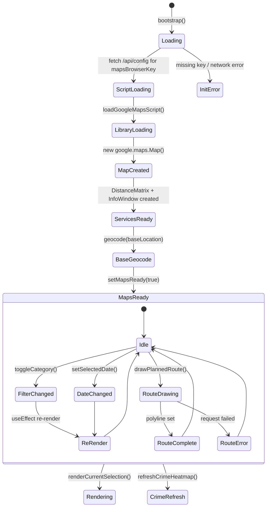
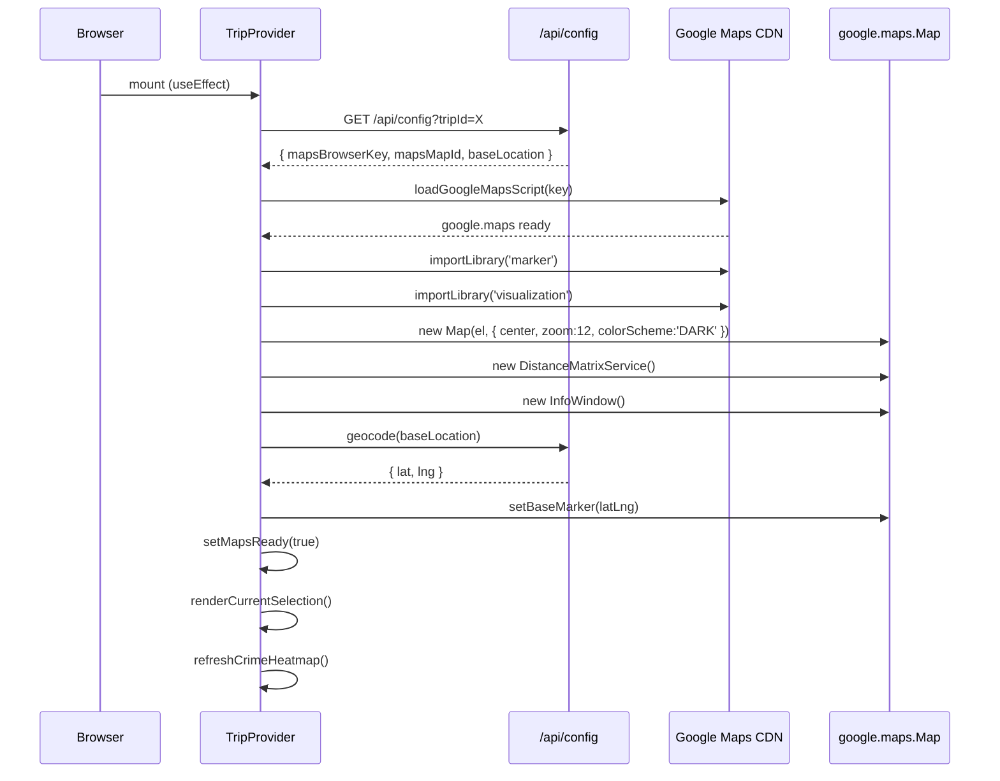
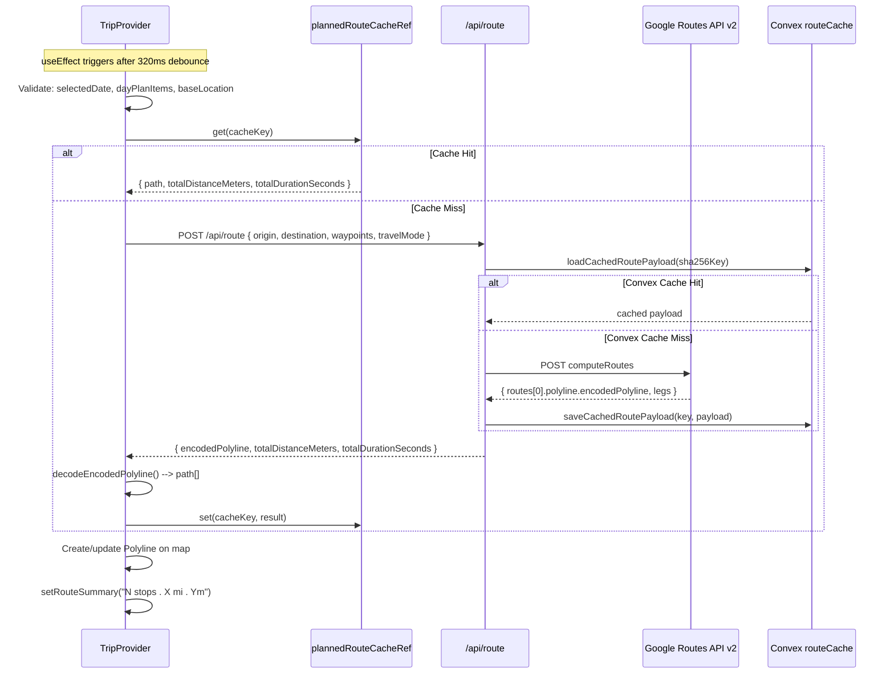

# Google Maps Integration: Technical Architecture & Implementation

Document Basis: current code at time of generation.

---

## 1. Summary

The Google Maps integration is the spatial backbone of Trip Planner. It provides:

- **Interactive dark-themed Google Map** initialized per-city with configurable center and zoom.
- **Color-coded markers** for events (orange), home base (white), and curated places (per-tag colors).
- **Safety overlay polygons** for avoid/safe regions with risk-graduated opacity.
- **Crime heatmap layer** with real-time data from city open-data APIs, adjustable intensity.
- **Route visualization** between planned day stops using the Google Routes API v2, with a green polyline.
- **Travel time estimates** via the Distance Matrix service, cached in-memory.
- **Route caching** at three tiers: client-side in-memory Map, server-side local JSON file, and Convex database.
- **Info windows** with rich HTML content, including "Add to planner" buttons.
- **Category filter chips** to toggle visibility of event/home/crime/tag layers.
- **Per-city map bounds and center** via the city registry.

**Out of scope:** Street View, satellite imagery, custom map tiles, offline maps, 3D buildings.

---

## 2. Runtime Placement & Ownership

### Mount Point

The map is always-mounted inside `AppShell`, regardless of active tab. It is visible on the MAP, PLANNING, and SPOTS tabs.

```
app/trips/layout.tsx
  --> AppShell.tsx
        --> MapPanel.tsx          (filter chips + map div)
        --> {children}            (tab content in sidebar or full-width)
        --> StatusBar.tsx          (route summary display)
```

`AppShell.tsx:21` defines which tabs show the map:

```typescript
const MAP_TABS = new Set(['map', 'planning', 'spots']);
```

When `activeId` is not in `MAP_TABS`, the map container is rendered with `position: absolute; width: 0; height: 0; overflow: hidden; pointer-events: none` and `aria-hidden={true}` -- it stays in the DOM but is visually hidden (`AppShell.tsx:98`).

### Lifecycle Ownership

All map state lives in `TripProvider.tsx` (a monolithic React Context provider, ~1800 lines). The provider owns:

- The `google.maps.Map` instance (`mapRef`)
- All marker instances (`markersRef`, `baseMarkerRef`)
- Polygon overlays (`regionPolygonsRef`)
- Heatmap layer (`crimeHeatmapRef`)
- Route polyline (`routePolylineRef`)
- InfoWindow singleton (`infoWindowRef`)
- DistanceMatrix service (`distanceMatrixRef`)
- Position/travel-time/route caches (all in-memory `useRef<Map>`)

The map is created once during bootstrap and destroyed on unmount. There is no lazy loading or deferred initialization -- it initializes as part of the main bootstrap `useEffect`.

### Map Page

`app/trips/[tripId]/map/page.tsx` renders `null` -- a no-op component. The map tab simply shows `MapPanel` at full width with no sidebar content.

---

## 3. Module/File Map

| File | Responsibility | Key Exports | Dependencies | Side Effects |
|------|---------------|-------------|-------------|--------------|
| `components/MapPanel.tsx` | UI shell: filter chip bar, map div, crime HUD overlay | `MapPanel` (default) | `TripProvider` (useTrip), `lucide-react`, `lib/helpers` | None (pure render) |
| `components/providers/TripProvider.tsx` | All map logic: init, markers, routes, heatmap, travel times | `TripProvider`, `useTrip`, `TAG_COLORS`, `getTagIconComponent` | `lib/map-helpers`, `lib/planner-helpers`, `lib/helpers`, `lib/security`, `lucide-react` icon nodes | Google Maps script injection, fetch calls, timers, event listeners |
| `lib/map-helpers.ts` | Pin icon SVG generation, polyline decoding, route requests, script loading | `createLucidePinIcon`, `createLucidePinIconWithLabel`, `toLatLngLiteral`, `toCoordinateKey`, `createTravelTimeCacheKey`, `createRouteRequestCacheKey`, `decodeEncodedPolyline`, `requestPlannedRoute`, `loadGoogleMapsScript`, `buildInfoWindowAddButton` | `lib/helpers` (escapeHtml) | DOM manipulation (createElement), script injection |
| `app/api/route/route.ts` | Server-side Routes API v2 proxy with caching | `POST` handler | `lib/events` (cache functions), `lib/api-guards`, `lib/security` | Routes API network call, route cache read/write |
| `app/api/geocode/route.ts` | Server-side geocoding proxy | `POST` handler | `lib/events`, `lib/api-guards`, `lib/security` | Geocoding API call |
| `app/api/crime/route.ts` | Crime heatmap data proxy (Socrata open data) | `GET` handler | `lib/crime-cities`, `lib/security` | Upstream Socrata API call |
| `app/api/config/route.ts` | Delivers `mapsBrowserKey` and `mapsMapId` to client | `GET`, `POST` handlers | `lib/events`, `lib/api-guards` | None |
| `convex/routeCache.ts` | Convex DB route cache (read/upsert) | `getRouteByKey` (query), `upsertRouteByKey` (mutation) | Convex server SDK, `convex/authz` | DB reads/writes |
| `convex/schema.ts` | Schema for `routeCache`, `cities`, `events`, `spots` tables | Schema definition | Convex schema SDK | None |
| `lib/city-registry.ts` | Static city definitions with mapCenter, mapBounds, crimeAdapterId | `getCityEntry`, `getAllCityEntries`, `CityEntry` type | None | None |
| `lib/events.ts` | Server-side route cache (local file + Convex), geocoding with cache | `loadCachedRoutePayload`, `saveCachedRoutePayload`, `resolveAddressCoordinates` | Convex HTTP client, node:fs, node:crypto | File I/O, Convex mutations |
| `components/AppShell.tsx` | Layout shell: decides when map is visible | `AppShell` (default) | `MapPanel`, `StatusBar`, `TripSelector`, `useTrip` | None |
| `components/StatusBar.tsx` | Displays route summary text | `StatusBar` (default) | `useTrip` | None |
| `lib/helpers.ts` | `formatDistance`, `formatDurationFromSeconds`, `escapeHtml` | Various utilities | None | None |
| `lib/planner-helpers.ts` | `MAX_ROUTE_STOPS` constant, plan sorting | Various utilities | `lib/helpers` | None |

---

## 4. State Model & Transitions

### Core Map State Variables

| State Variable | Type | Initial | Location |
|---------------|------|---------|----------|
| `mapsReady` | `boolean` | `false` | `TripProvider.tsx:252` |
| `hiddenCategories` | `Set<string>` | `new Set()` | `TripProvider.tsx:264` |
| `crimeHeatmapStrength` | `'low' \| 'medium' \| 'high'` | `'high'` | `TripProvider.tsx:251` |
| `crimeLayerMeta` | `CrimeLayerMeta` | `{ loading: false, count: 0, generatedAt: '', error: '' }` | `TripProvider.tsx:250` |
| `travelMode` | `string` | `'WALKING'` | `TripProvider.tsx:259` |
| `routeSummary` | `string` | `''` | `TripProvider.tsx:271` |
| `isRouteUpdating` | `boolean` | `false` | `TripProvider.tsx:272` |
| `selectedDate` | `string` | `''` | `TripProvider.tsx:257` |

### Refs (Mutable, Non-Rendering State)

| Ref | Type | Purpose | Location |
|-----|------|---------|----------|
| `mapRef` | `google.maps.Map` | Map instance | `TripProvider.tsx:229` |
| `markersRef` | `AdvancedMarkerElement[]` | All data markers | `TripProvider.tsx:235` |
| `baseMarkerRef` | `AdvancedMarkerElement` | Home location pin | `TripProvider.tsx:233` |
| `routePolylineRef` | `google.maps.Polyline` | Route line | `TripProvider.tsx:231` |
| `infoWindowRef` | `google.maps.InfoWindow` | Shared info window | `TripProvider.tsx:232` |
| `crimeHeatmapRef` | `HeatmapLayer` | Crime overlay | `TripProvider.tsx:237` |
| `regionPolygonsRef` | `google.maps.Polygon[]` | Safety/danger zones | `TripProvider.tsx:236` |
| `distanceMatrixRef` | `DistanceMatrixService` | Travel time calc | `TripProvider.tsx:230` |
| `positionCacheRef` | `Map<string, LatLng>` | Geocoded positions | `TripProvider.tsx:242` |
| `travelTimeCacheRef` | `Map<string, string>` | Travel time strings | `TripProvider.tsx:244` |
| `plannedRouteCacheRef` | `Map<string, RouteResult>` | Client route cache | `TripProvider.tsx:245` |

### State Diagram



---

## 5. Interaction & Event Flow

### Bootstrap Sequence



### Route Drawing Flow



### Category Filter Toggle Flow

1. User clicks `FilterChip` in `MapPanel.tsx`.
2. `toggleCategory(category)` called --> `setHiddenCategories` updated (`TripProvider.tsx:1678`).
3. `useEffect` at `TripProvider.tsx:878` fires:
   - `baseMarkerRef.current.map` set to `null` or `mapRef.current` based on `hiddenCategories.has('home')`.
   - `crimeHeatmapRef.current.setMap()` toggled based on `hiddenCategories.has('crime')`.
   - If crime toggled ON: `refreshCrimeHeatmap({ force: true })`.
4. `useEffect` at `TripProvider.tsx:1419` fires:
   - Filters `allEvents` and `filteredPlaces` by `hiddenCategories`.
   - Calls `renderCurrentSelection(...)` with `shouldFitBounds = false` (no auto-zoom).

---

## 6. Rendering / Layers / Motion

### Layer Stack (z-index contract)

| z-index | Layer | Controlled By |
|---------|-------|--------------|
| Default (map tiles) | Base map tiles | Google Maps |
| 20 | Safe region polygons | `TripProvider.tsx:1165` |
| 25 | Safe region label markers | `TripProvider.tsx:1193` |
| 30 | Avoid region polygons | `TripProvider.tsx:1165` |
| 40 | Avoid region label markers | `TripProvider.tsx:1193` |
| Default | Event/place pin markers | Google Maps default |
| Default | Route polyline | Google Maps default |
| HeatmapLayer | Crime heatmap | Google Maps visualization library |
| z-20 (CSS) | Crime HUD overlay | `MapPanel.tsx:106` |

### Map Container CSS

The map div uses absolute positioning within a flex container:

```css
/* globals.css:96 */
#map { position: absolute; inset: 0; background: #141414; }
```

Responsive breakpoints adjust the map container height:

- Desktop: flex-1 fills remaining height.
- `< 900px` (`globals.css:159`): map panel min-height 50vh.
- `< 640px` (`globals.css:173`): map panel min-height 40vh.

### Pin Icon Generation

Pins are inline SVGs generated as DOM elements (not image URLs). Two variants exist:

1. **`createLucidePinIcon(iconNode, color)`** (`map-helpers.ts:20-37`): 38x48px SVG pin with embedded Lucide icon. Used for place markers and home marker.
2. **`createLucidePinIconWithLabel(iconNode, color, label)`** (`map-helpers.ts:39-66`): Same pin + a colored badge label below (e.g., "today", "3d"). Used for event markers.

Pin dimensions: `width: 38px; height: 48px`. Badge offset: `margin-top: -6px`.

### Color Palette

| Category | Color Constant | Source |
|----------|---------------|--------|
| Events | `#FF8800` | `MapPanel.tsx:7` |
| Home base | `#FFFFFF` | `MapPanel.tsx:8` |
| Crime heatmap | `#FF4444` | `MapPanel.tsx:9` |
| Route polyline | `#00FF88` | `TripProvider.tsx:1452` |
| Tag: eat | `#FF8800` | `TripProvider.tsx:42` |
| Tag: bar | `#A78BFA` | `TripProvider.tsx:43` |
| Tag: cafes | `#60A5FA` | `TripProvider.tsx:44` |
| Tag: go out | `#F472B6` | `TripProvider.tsx:45` |
| Tag: shops | `#2DD4BF` | `TripProvider.tsx:46` |
| Tag: avoid | `#FF4444` | `TripProvider.tsx:47` |
| Tag: safe | `#00FF88` | `TripProvider.tsx:48` |
| Fallback tag | `#2563eb` | `TripProvider.tsx:154` |

### Route Polyline Styling

| Property | Solid State | Loading State (dashed) |
|----------|------------|----------------------|
| `strokeColor` | `#00FF88` | `#00FF88` |
| `strokeOpacity` | `0.86` | `0` (icons used instead) |
| `strokeWeight` | `5` | `5` |
| `icons` | `[]` | `[{ icon: { path: 'M 0,-1 0,1', strokeOpacity: 1, scale: 3 }, offset: '0', repeat: '12px' }]` |

Transition: `applyRoutePolylineStyle(isUpdating)` at `TripProvider.tsx:767-777`.

### Crime Heatmap Profiles

| Strength | Weight Multiplier | Opacity | Max Intensity | Radius Scale |
|----------|------------------|---------|---------------|-------------|
| `low` | 1.15 | 0.72 | 4.9 | 0.90 |
| `medium` | 1.45 | 0.84 | 3.3 | 1.00 |
| `high` | 1.85 | 0.90 | 2.9 | 1.08 |

Source: `TripProvider.tsx:89-97`.

Heatmap gradient (7 stops): transparent -> light red -> deep crimson (`TripProvider.tsx:57-65`).

Radius formula: `Math.max(16, Math.min(34, Math.round(46 - zoom * 1.9)))` then scaled by profile (`TripProvider.tsx:84-87`).

---

## 7. API & Prop Contracts

### Environment Variables

| Variable | Required | Used By | Purpose |
|----------|----------|---------|---------|
| `GOOGLE_MAPS_BROWSER_KEY` | Yes | Client (via /api/config) | Maps JS SDK loading |
| `GOOGLE_MAPS_MAP_ID` | No | Client (via /api/config) | Cloud-based map styling, falls back to `'DEMO_MAP_ID'` |
| `GOOGLE_MAPS_ROUTES_KEY` | Yes (for routes) | Server (`/api/route`) | Routes API v2 calls |
| `GOOGLE_MAPS_SERVER_KEY` | Fallback | Server (`/api/route`) | Fallback for Routes API |

Key priority for route API (`app/api/route/route.ts:37-40`):
```
GOOGLE_MAPS_ROUTES_KEY || GOOGLE_MAPS_SERVER_KEY || GOOGLE_MAPS_BROWSER_KEY
```

### POST /api/route

**Request:**
```json
{
  "origin": { "lat": 37.7749, "lng": -122.4194 },
  "destination": { "lat": 37.7749, "lng": -122.4194 },
  "waypoints": [{ "lat": 37.78, "lng": -122.41 }],
  "travelMode": "WALKING"
}
```

**Response (200):**
```json
{
  "encodedPolyline": "...",
  "totalDistanceMeters": 5200,
  "totalDurationSeconds": 3840,
  "source": "cache" | "live"
}
```

**Constraints:**
- Max 20 waypoints (`MAX_WAYPOINTS = 20`, `route.ts:14`).
- Rate limit: 40 requests/minute per IP (`route.ts:19-21`).
- Travel modes mapped: `WALKING` -> `WALK`, `DRIVING` -> `DRIVE`, `TRANSIT` -> `TRANSIT`. Default: `WALK` (`route.ts:184-196`).
- Cache key: SHA-256 of `{ travelMode, origin, destination, waypoints }` with coordinates rounded to 5 decimal places.

### POST /api/geocode

**Request:** `{ "address": "123 Main St, SF" }`
**Response (200):** `{ "lat": 37.7749, "lng": -122.4194 }`
**Rate limit:** 25/minute per IP.

### GET /api/crime

**Query params:** `city`, `hours`, `limit`, `south`, `west`, `north`, `east`
**Response:** `{ incidents: [...], hours, limit, count, source, bounds, generatedAt }`
**Rate limit:** 30/minute per IP.

### Client-Side Caches (useRef Maps)

| Cache | Key Format | Value | Eviction | Location |
|-------|-----------|-------|----------|----------|
| `positionCacheRef` | `"event:{eventUrl}"` or `"place:{id\|name}"` | `google.maps.LatLng` | Never (session lifetime) | `TripProvider.tsx:242` |
| `travelTimeCacheRef` | `"{mode};{baseLat,baseLng};{destLat,destLng}"` | `string` (e.g., "12 mins") | Cleared at 4000 entries | `TripProvider.tsx:244`, eviction at `:1034` |
| `plannedRouteCacheRef` | `"{mode};{originCoords};{destCoords};{waypointsJoined}"` | `{ path, totalDistanceMeters, totalDurationSeconds }` | Cleared at 1000 entries | `TripProvider.tsx:245`, eviction at `:1448` |

### MapPanel Props (via useTrip context)

`MapPanel` consumes these from context (`MapPanel.tsx:52-60`):

| Property | Type | Description |
|----------|------|-------------|
| `mapPanelRef` | `RefObject` | Outer section ref |
| `mapElementRef` | `RefObject` | Map div ref (id="map") |
| `hiddenCategories` | `Set<string>` | Currently hidden filter categories |
| `toggleCategory` | `(cat: string) => void` | Toggle a filter |
| `crimeLayerMeta` | `CrimeLayerMeta` | Crime layer status |
| `crimeHeatmapStrength` | `string` | Current heatmap intensity |
| `setCrimeHeatmapStrength` | `(s: string) => void` | Change intensity |

---

## 8. Reliability Invariants

These truths must hold after any refactor:

1. **Single map instance.** `mapRef.current` is created exactly once per TripProvider mount, at bootstrap, and set to `null` on unmount via the cleanup function (`TripProvider.tsx:1371`).

2. **Markers are always cleaned before re-render.** `clearMapMarkers()` sets `.map = null` on every marker in `markersRef.current` and calls `setMap(null)` on every polygon before creating new ones (`TripProvider.tsx:680-685`).

3. **Route origin and destination are always the home base.** `drawPlannedRoute` always uses `baseLatLngRef.current` as both `origin` and `destination`, making it a round-trip route (`TripProvider.tsx:1444`).

4. **Route polyline is never orphaned.** `clearRoute()` sets `routePolylineRef.current.setMap(null)` before nullifying the ref (`TripProvider.tsx:687-690`).

5. **InfoWindow is a singleton.** Only one `InfoWindow` instance exists; opening a new one automatically closes the previous one (standard Google Maps behavior, created at `TripProvider.tsx:1355`).

6. **Route stops are capped.** `MAX_ROUTE_STOPS = 8` (`planner-helpers.ts:18`), enforced at `TripProvider.tsx:1438`.

7. **Crime heatmap respects category toggle.** The heatmap is mapped to `null` when `hiddenCategories.has('crime')` is true, at three enforcement points: initial apply (`TripProvider.tsx:724`), toggle effect (`TripProvider.tsx:883`), and strength change effect (`TripProvider.tsx:890-893`).

8. **Coordinate normalization.** All cache keys normalize coordinates to 5 decimal places via `toCoordinateKey` (`map-helpers.ts:78-82`) or `normalizeLatLng` (`route.ts:225-230`).

9. **Script loaded once.** `loadGoogleMapsScript` checks `window.google?.maps` before creating a script tag (`map-helpers.ts:170`).

10. **Server route cache key is deterministic.** Uses SHA-256 of normalized JSON (`route.ts:216-223`), so identical routes always hit cache.

---

## 9. Edge Cases & Pitfalls

### Missing Home Location
If `baseLocation` is empty or geocoding fails, routes cannot be drawn. `drawPlannedRoute` exits early with status message `'Set your home location before drawing a route.'` (`TripProvider.tsx:1437`).

### No Coordinates for Plan Items
If plan items cannot be resolved to `_position` (geocode failure, no mapLink, no lat/lng), they are excluded from `plannedRouteStops`. If all items fail, `routeStops.length === 0` triggers `'Route needs map-ready items with known coordinates.'` (`TripProvider.tsx:1439`).

### Route Debounce During Drag
`drawPlannedRoute` skips execution when `activePlanId` is truthy (i.e., during a drag operation on the planner timeline), preventing route thrashing (`TripProvider.tsx:1435`). The 320ms `setTimeout` further debounces (`TripProvider.tsx:1431`).

### Crime Heatmap Rate Limiting
- Viewport-idle debounce: 450ms (`CRIME_IDLE_DEBOUNCE_MS`, `TripProvider.tsx:54`).
- Minimum interval between fetches: 20 seconds (`CRIME_MIN_REQUEST_INTERVAL_MS`, `TripProvider.tsx:55`).
- Auto-refresh interval: 2 minutes (`CRIME_REFRESH_INTERVAL_MS`, `TripProvider.tsx:53`).
- Same-query deduplication: compares full request path string (`TripProvider.tsx:741`).

### Avoid/Safe Regions Are Not Planner-Addable
`addPlaceToDayPlan` explicitly blocks `avoid` and boundary-based `safe` regions from being added to the day plan (`TripProvider.tsx:913-917`).

### TRANSIT Mode Requires Departure Time
The route API adds `departureTime: new Date().toISOString()` only for TRANSIT mode (`route.ts:104-106`). Other modes omit it.

### Client Cache Eviction
`travelTimeCacheRef` clears entirely at >4000 entries (`TripProvider.tsx:1034`). `plannedRouteCacheRef` clears at >1000 entries (`TripProvider.tsx:1448`). This is a blunt strategy -- no LRU.

### City Switch Re-centers Map
`switchCityLeg` calls `mapRef.current.setCenter(city.mapCenter)` and resets zoom to 12 (`TripProvider.tsx:1737-1740`). Events and places are reloaded for the new city.

---

## 10. Testing & Verification

### Existing Test Coverage

| Test File | What It Tests | Map-Relevant |
|-----------|---------------|-------------|
| `lib/trip-provider-bootstrap.test.mjs` | Bootstrap trip resolution, crime category weights, crime city slug | Yes -- verifies crime weight priorities and cross-city category patterns |
| `lib/crime-cities.test.mjs` | City crime API configuration | Yes -- validates crime adapter config |
| `lib/events.test.mjs` | Event ingestion, geocoding, caching | Indirectly -- tests route cache functions |

There are **no direct unit tests** for `MapPanel.tsx`, `map-helpers.ts` functions (pin generation, polyline decoding, cache key generation), or the route API endpoint. These are gaps.

### Manual Verification Scenarios

1. **Map loads with dark theme:** Navigate to MAP tab. Map should appear with dark color scheme and city center.
2. **Event markers appear:** Verify orange pins with day labels ("today", "2d") appear for active events.
3. **Home marker appears:** Configure a base location in CONFIG. White house-icon pin should appear.
4. **Filter chips toggle markers:** Click "Event" chip. Event pins should disappear. Click again to restore.
5. **Crime heatmap toggles:** Click "Crime Live" chip. Red heatmap overlay should appear/disappear. HUD panel with strength controls should appear when crime is ON.
6. **Route draws between stops:** Add 2+ stops to a day plan. Green polyline should appear from home -> stops -> home. StatusBar should show distance and duration.
7. **Route updates on plan change:** Add/remove a planner stop. After ~320ms debounce, the route polyline should update.
8. **Info window opens on pin click:** Click an event or place pin. Info window should show details with "Add to [date]" button.
9. **City switch re-centers map:** Switch city via TripSelector. Map should pan to new city center.
10. **Travel times populate:** With a base location set, event cards should show travel time estimates.

### Command Checks

```bash
# Run existing map-related tests
node --test lib/trip-provider-bootstrap.test.mjs
node --test lib/crime-cities.test.mjs

# Verify env vars are configured
grep GOOGLE_MAPS .env.local
```

---

## 11. Quick Change Playbook

| If you want to... | Edit... |
|-------------------|---------|
| Change the map color scheme | `TripProvider.tsx:1351` -- `colorScheme` property |
| Change the default map zoom level | `TripProvider.tsx:1349` -- `zoom: 12` |
| Change the route polyline color | `TripProvider.tsx:1452` -- `strokeColor: '#00FF88'` |
| Change the route polyline thickness | `TripProvider.tsx:1452` -- `strokeWeight: 5` |
| Add a new tag color | `TripProvider.tsx:42-48` -- add entry to `TAG_COLORS` |
| Add a new tag icon | `TripProvider.tsx:133-141` (`TAG_ICON_COMPONENTS`) and `TripProvider.tsx:143-151` (`TAG_ICON_NODES`) -- add both |
| Change pin dimensions | `lib/map-helpers.ts:23` -- `width="38" height="48" viewBox="0 0 38 48"` |
| Change max route stops | `lib/planner-helpers.ts:18` -- `MAX_ROUTE_STOPS = 8` |
| Change max server waypoints | `app/api/route/route.ts:14` -- `MAX_WAYPOINTS = 20` |
| Add a new city | `lib/city-registry.ts` -- add entry with `mapCenter`, `mapBounds`, `crimeAdapterId` |
| Change crime heatmap gradient | `TripProvider.tsx:57-65` -- `CRIME_HEATMAP_GRADIENT` array |
| Change crime refresh interval | `TripProvider.tsx:53` -- `CRIME_REFRESH_INTERVAL_MS` |
| Change crime heatmap strength profiles | `TripProvider.tsx:89-97` -- `getCrimeHeatmapProfile()` |
| Change route debounce delay | `TripProvider.tsx:1431` -- `setTimeout(..., 320)` |
| Change travel time cache eviction threshold | `TripProvider.tsx:1034` -- `> 4000` |
| Change route cache eviction threshold | `TripProvider.tsx:1448` -- `> 1000` |
| Add a new filter category | `MapPanel.tsx:71-101` -- add `FilterChip`, then handle in `toggleCategory` and `renderCurrentSelection` |
| Change the Routes API field mask | `app/api/route/route.ts:9-13` -- `ROUTES_API_FIELD_MASK` |
| Change the info window HTML styling | `TripProvider.tsx:1038-1081` -- `buildEventInfoWindowHtml` / `buildPlaceInfoWindowHtml` |
| Switch from AdvancedMarkerElement to legacy Marker | Replace all `new window.google.maps.marker.AdvancedMarkerElement(...)` calls in `TripProvider.tsx` (lines 872, 1102, 1192, 1198) |

---

## 12. Route Caching Architecture (Three-Tier)

Route responses are cached at three levels:

### Tier 1: Client In-Memory (Browser)
- **Store:** `plannedRouteCacheRef` (`Map<string, RouteResult>`)
- **Key:** `"{mode};{originCoords};{destCoords};{waypointCoords}"` (5-decimal precision)
- **TTL:** Session lifetime, cleared at >1000 entries
- **Hit path:** Checked first in `drawPlannedRoute` (`TripProvider.tsx:1446`)

### Tier 2: Server Local File
- **Store:** `data/route-cache.json` (JSON file on server filesystem)
- **Key:** SHA-256 hex hash of normalized route params
- **TTL:** Indefinite (persisted across server restarts)
- **Hit path:** `loadRouteCacheMap()` in `lib/events.ts:2431-2462`

### Tier 3: Convex Database
- **Store:** `routeCache` table with `by_key` index
- **Key:** Same SHA-256 hash as Tier 2
- **TTL:** Indefinite
- **Hit path:** `routeCache:getRouteByKey` query in `convex/routeCache.ts:16-38`
- **Write:** `routeCache:upsertRouteByKey` mutation, only patches if data actually changed (`convex/routeCache.ts:67-69`)

Read order: Tier 2 (local file) -> Tier 3 (Convex) -> Google Routes API. On a live fetch, the result is written back to all tiers.

---

## 13. Per-City Map Configuration

Each city in the registry (`lib/city-registry.ts`) defines:

| City | Center (lat, lng) | Bounds (N, S, E, W) | Crime Adapter |
|------|-------------------|---------------------|---------------|
| San Francisco | 37.7749, -122.4194 | 37.85, 37.68, -122.33, -122.55 | `sf-open-data` |
| New York | 40.7128, -74.006 | 40.92, 40.49, -73.7, -74.26 | `nypd-open-data` |
| Los Angeles | 34.0522, -118.2437 | 34.34, 33.7, -118.0, -118.67 | `lapd-open-data` |
| Chicago | 41.8781, -87.6298 | 42.02, 41.64, -87.52, -87.94 | `chicago-open-data` |
| London | 51.5074, -0.1278 | 51.69, 51.28, 0.34, -0.51 | `uk-police` |
| Tokyo | 35.6762, 139.6503 | 35.82, 35.5, 139.92, 139.56 | (none) |
| Paris | 48.8566, 2.3522 | 48.92, 48.8, 2.47, 2.22 | (none) |
| Barcelona | 41.3874, 2.1686 | 41.47, 41.32, 2.23, 2.07 | (none) |

The `mapCenter` is used as the initial center when creating the map (`TripProvider.tsx:1341`) and when switching cities (`TripProvider.tsx:1709, 1738`). The `mapBounds` are defined in the schema but not currently used for clamping the viewport -- `fitBounds` is driven by marker positions instead (`TripProvider.tsx:856-866`).

Fallback center when no city is loaded: `{ lat: 37.7749, lng: -122.4194 }` (San Francisco, `TripProvider.tsx:68`).

---

## 14. Crime Heatmap Weight System

Crime categories are weighted for heatmap intensity (`TripProvider.tsx:71-82`):

| Pattern Match | Weight | Examples |
|--------------|--------|---------|
| homicide, murder, human trafficking | 4.2 | HOMICIDE, MURDER (NYC) |
| rape, sex offense, sex crime | 3.8 | SEX CRIME (NYC) |
| assault, robbery | 3.2 | ASSAULT, ROBBERY |
| weapons, arson, kidnapping | 2.8 | WEAPONS OFFENSE |
| burglary, motor vehicle theft, vehicle+stolen | 2.3 | MOTOR VEHICLE THEFT |
| theft, larceny | 1.8 | GRAND LARCENY |
| vandalism, criminal mischief, criminal damage | 1.6 | CRIMINAL MISCHIEF (NYC), CRIMINAL DAMAGE (Chicago) |
| (default) | 1.2 | All other categories |

These weights are multiplied by the profile's `weightMultiplier` before being passed to the HeatmapLayer.
