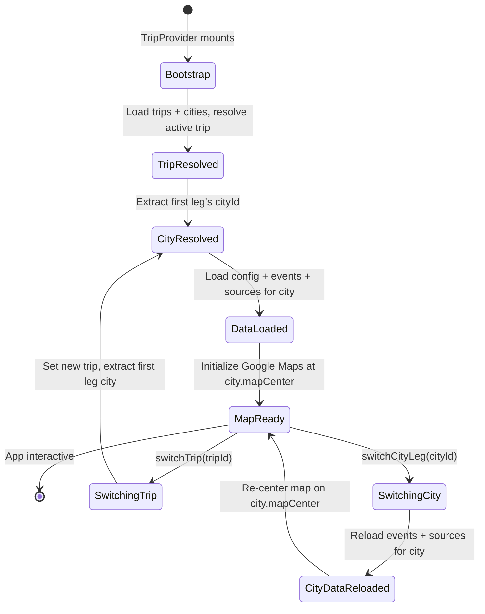
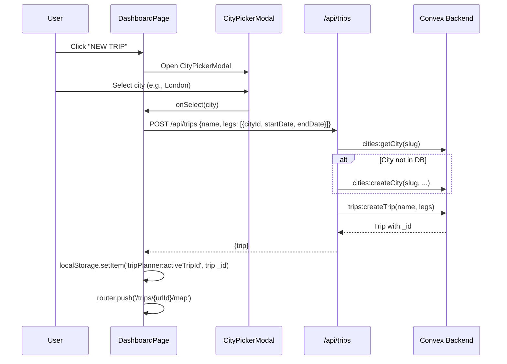
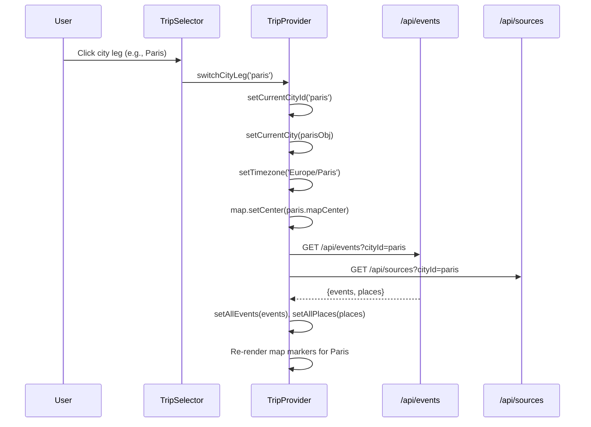

# Multi-City Trip Support: Technical Architecture & Implementation

Document Basis: current code at time of generation.

---

## 1. Summary

Multi-City Trip Support allows users to create trips with one or more city "legs," where each leg has its own city, date range, and timezone. When switching between legs, the app reloads city-scoped data (events, spots, sources, crime heatmap) and re-centers the map on the new city.

**Current shipped scope:**
- Data model: `trips` table with embedded `legs[]` array (each leg: `cityId`, `startDate`, `endDate`)
- CRUD: create, read, update, delete trips via REST API and Convex mutations
- City auto-provisioning: cities are auto-created in Convex when a trip leg references a known city slug
- TripSelector dropdown: switch between trips and between legs within a multi-leg trip
- Dashboard: displays all trips with leg badges, multi-city subtitle, and date ranges
- Per-leg city switching: reloads events/spots/sources and re-centers map
- Per-leg timezone: resolved from the `cities` table when switching legs
- City registry: 8 hardcoded cities with map bounds, timezone, locale, and crime adapter metadata

**Out of scope (not implemented):**
- Adding legs to an existing trip via UI (only possible via API PATCH)
- Per-leg base location override (single `baseLocation` lives on `tripConfig`)
- Per-leg planner date range filtering (planner uses `tripConfig.tripStart/tripEnd` which spans the full trip)
- Reordering legs within a trip
- Overlapping leg detection or validation

---

## 2. Runtime Placement & Ownership

| Concern | Location | Notes |
|---|---|---|
| Trip data model | `convex/schema.ts:32-44` | `trips` table with `legs` array |
| Trip CRUD mutations | `convex/trips.ts` | `createTrip`, `updateTrip`, `deleteTrip`, `listMyTrips`, `getTrip` |
| REST API layer | `app/api/trips/route.ts`, `app/api/trips/[tripId]/route.ts` | GET/POST/PATCH/DELETE proxied to Convex |
| City registry | `lib/city-registry.ts` | Static lookup of 8 supported cities |
| City DB operations | `convex/cities.ts` | `listCities`, `getCity`, `createCity`, `updateCity` |
| Seed data | `convex/seed.ts` | 6 initial cities with full metadata |
| Trip selection UI | `components/TripSelector.tsx` | Dropdown with trip list + per-trip city legs |
| Dashboard UI | `app/dashboard/page.tsx` | Trip grid with leg badges and create flow |
| City picker modal | `components/CityPickerModal.tsx` | Used by dashboard to pick a city for new trips |
| State management | `components/providers/TripProvider.tsx` | `switchTrip()`, `switchCityLeg()`, bootstrap logic |
| Mock data types | `lib/mock-data.ts` | `TripLeg`, `MockTrip`, `SelectedCity` interfaces |
| Trip config | `convex/tripConfig.ts` | Per-trip timezone, start/end dates, base location |

**Lifecycle boundary:** `TripProvider` wraps all protected routes. It bootstraps on mount (loads trips, cities, selects active trip/leg, initializes map). Trip/city switching happens in-memory via `switchTrip()` and `switchCityLeg()` without a full page reload.

---

## 3. Module/File Map

| File | Responsibility | Key Exports | Dependencies | Side Effects |
|---|---|---|---|---|
| `convex/schema.ts` | Schema definitions | `trips`, `cities`, `tripConfig` tables | `convex/server` | None |
| `convex/trips.ts` | Trip CRUD | `listMyTrips`, `getTrip`, `createTrip`, `updateTrip`, `deleteTrip` | `convex/authz` | Creates `tripConfig` on trip creation |
| `convex/cities.ts` | City CRUD | `listCities`, `getCity`, `createCity`, `updateCity` | `convex/authz` | None |
| `convex/tripConfig.ts` | Trip config | `getTripConfig`, `saveTripConfig` | `convex/authz` | None |
| `convex/seed.ts` | Seed initial cities | `seedInitialData`, `seedInitialDataInternal` | `convex/authz` | Inserts into `cities` table |
| `lib/city-registry.ts` | Static city catalog | `getCityEntry`, `getAllCityEntries` | None | None |
| `lib/mock-data.ts` | Mock/type definitions | `TripLeg`, `MockTrip`, `SelectedCity`, `MOCK_TRIPS`, `formatTripDateRange` | None | None |
| `app/api/trips/route.ts` | REST: list + create trips | `GET`, `POST` | `lib/request-auth`, `lib/city-registry` | Auto-creates cities in Convex |
| `app/api/trips/[tripId]/route.ts` | REST: get/update/delete trip | `GET`, `PATCH`, `DELETE` | `lib/request-auth` | None |
| `app/api/cities/route.ts` | REST: list + create cities | `GET`, `POST` | `lib/request-auth` | None |
| `components/TripSelector.tsx` | Trip/city leg switcher | `TripSelector` (default) | `TripProvider` context | Click-outside listener |
| `app/dashboard/page.tsx` | Trip dashboard | `DashboardPage` (default) | `CityPickerModal`, `lib/mock-data` | Fetches `/api/trips` + `/api/cities` |
| `components/CityPickerModal.tsx` | City picker for new trips | `CityPickerModal` | `lib/mock-data`, `components/ui/modal` | None |
| `components/providers/TripProvider.tsx` | Central state provider | `TripProvider`, `useTrip` | All API routes, Convex auth | Map init, event fetch, crime heatmap, planner persistence |

---

## 4. State Model & Transitions

### 4.1 Core State Variables

Defined in `TripProvider.tsx:289-294`:

```typescript
const [currentTripId, setCurrentTripId] = useState('');
const [currentCityId, setCurrentCityId] = useState('');
const [trips, setTrips] = useState<any[]>([]);
const [cities, setCities] = useState<any[]>([]);
const [currentCity, setCurrentCity] = useState<any>(null);
const [timezone, setTimezone] = useState('America/Los_Angeles');
```

### 4.2 Trip Resolution Priority

During bootstrap (`TripProvider.tsx:1301-1314`):

1. URL search param `?trip=<id>` (highest priority)
2. `localStorage.getItem('tripPlanner:activeTripId')` (fallback)
3. First trip in `loadedTrips` array (last fallback)

Once resolved, the active trip ID is persisted back to `localStorage`.

### 4.3 State Diagram



### 4.4 Transition Rules

| Trigger | Guard | Actions | Result State |
|---|---|---|---|
| `switchTrip(tripId)` | `tripId !== currentTripId` | Set `currentTripId`, update localStorage, extract first leg city, set `currentCityId`/`currentCity`/`timezone`, re-center map, reload `tripConfig` | Trip + city changed |
| `switchCityLeg(cityId)` | `cityId !== currentCityId` | Set `currentCityId`/`currentCity`/`timezone`, re-center map, reload events + sources for new city | City changed within same trip |
| Bootstrap | Always on mount | Parallel fetch of profile + cities + trips, resolve trip, load city-scoped data, init map | App ready |

---

## 5. Interaction & Event Flow

### 5.1 Trip Creation Flow (Dashboard)



### 5.2 City Leg Switching Flow



---

## 6. Rendering/Layers/Motion

### 6.1 TripSelector Dropdown

The dropdown is a custom component (not a Radix primitive). It uses a click-outside listener to close.

**Layer stack:**
- Trigger button: inline, no z-index
- Dropdown panel: `z-50`, absolute positioned `top-full right-0` (`TripSelector.tsx:50-51`)

**Structure:**
1. "Trips" section: all trips, active trip highlighted in `#00E87B`
2. "Cities" section: only shown when active trip has `legs.length > 1` (`TripSelector.tsx:86`)
3. Each city leg shows city name + date range (`startDate-endDate`)

**Label format:** `{cityName} . {tzAbbrev}` (e.g., "London . GMT") - computed via `Intl.DateTimeFormat` at `TripSelector.tsx:26-27`.

### 6.2 Dashboard Trip Cards

Each trip card displays:
- Trip name (or city names joined with arrows if no explicit name) (`page.tsx:255`)
- Multi-leg subtitle: `"Multi-leg . {N} cities . {tz1} / {tz2}"` - only for `legs.length > 1` (`page.tsx:44-48`)
- Date range: computed from earliest `startDate` to latest `endDate` across all legs (`page.tsx:37-42`)
- Leg count badge: `"{N} LEG" / "{N} LEGS"` (`page.tsx:311`)
- Color-coded leg badges: uses `LEG_COLORS` array (`page.tsx:31`):

```typescript
// app/dashboard/page.tsx:31
const LEG_COLORS = ['#00E87B', '#3B82F6', '#A855F7', '#F59E0B', '#EF4444', '#06B6D4'];
```

Badge background uses the color at 10% opacity (`${color}18`), border at 25% opacity (`${color}40`).

---

## 7. API & Prop Contracts

### 7.1 Data Model: Trip Leg (Convex)

```typescript
// convex/schema.ts:35-41
v.object({
  cityId: v.string(),    // References cities.slug
  startDate: v.string(), // ISO date, e.g., "2026-03-01"
  endDate: v.string(),   // ISO date, e.g., "2026-03-05"
})
```

### 7.2 Data Model: Trip

```typescript
// convex/trips.ts:11-18
{
  _id: Id<'trips'>,
  userId: string,
  name: string,
  legs: TripLeg[],        // At least 1 leg required
  createdAt: string,      // ISO datetime
  updatedAt: string,      // ISO datetime
}
```

### 7.3 Data Model: City

```typescript
// convex/schema.ts:10-30
{
  slug: string,           // URL-safe identifier, unique (indexed)
  name: string,
  timezone: string,       // IANA timezone, e.g., "Europe/London"
  locale: string,         // BCP-47, e.g., "en-GB"
  mapCenter: { lat, lng },
  mapBounds: { north, south, east, west },
  crimeAdapterId: string, // Links to crime data adapter
  isSeeded: boolean,
  createdByUserId: string,
}
```

### 7.4 Data Model: TripConfig

```typescript
// convex/schema.ts:209-216
{
  tripId: Id<'trips'>,   // Foreign key to trips
  timezone: string,       // Active timezone (set from first leg's city)
  tripStart: string,      // ISO date (first leg's startDate at creation)
  tripEnd: string,        // ISO date (last leg's endDate at creation)
  baseLocation: string,   // Optional home/hotel address
}
```

### 7.5 REST API Endpoints

| Method | Path | Request | Response | Notes |
|---|---|---|---|---|
| `GET` | `/api/trips` | -- | `{trips: Trip[]}` | Lists user's trips, sorted by `updatedAt` desc |
| `POST` | `/api/trips` | `{name, legs}` | `{trip: Trip}` | Creates trip + auto-creates unknown cities |
| `GET` | `/api/trips/[tripId]` | -- | `{trip: Trip}` | Single trip with access check |
| `PATCH` | `/api/trips/[tripId]` | `{name?, legs?}` | `{trip: Trip}` | Owner-only update |
| `DELETE` | `/api/trips/[tripId]` | -- | `{deleted: boolean}` | Cascades: deletes config, planner entries, pair rooms+members |
| `GET` | `/api/cities` | -- | `{cities: City[]}` | All cities, sorted by name |
| `POST` | `/api/cities` | `{slug, name, timezone, ...}` | `{city: City}` | Owner-only |

### 7.6 TripProvider Context API (relevant to multi-city)

| Property | Type | Description |
|---|---|---|
| `currentTripId` | `string` | Active trip's `_id` |
| `currentCityId` | `string` | Active leg's city slug |
| `currentCity` | `object \| null` | Full city object from `cities` state |
| `trips` | `any[]` | All user's trips |
| `cities` | `any[]` | All available cities |
| `timezone` | `string` | Active IANA timezone |
| `switchTrip(tripId)` | `async (string) => void` | Switch active trip, load first leg's city |
| `switchCityLeg(cityId)` | `async (string) => void` | Switch city within current trip |

### 7.7 City Auto-Provisioning

When `POST /api/trips` creates a trip, each leg's `cityId` is checked against the static `lib/city-registry.ts` catalog. If the city exists in the registry but not in Convex, it is auto-created (`app/api/trips/route.ts:39-56`). Cities not in the registry are silently skipped (the leg still references the slug, but no city record is created).

### 7.8 TripConfig Initialization on Trip Creation

`createTrip` in `convex/trips.ts:81-94` auto-creates a `tripConfig` record:
- `timezone`: first leg's city timezone (looked up from `cities` table), fallback `'UTC'`
- `tripStart`: first leg's `startDate`
- `tripEnd`: last leg's `endDate`

---

## 8. Reliability Invariants

1. **Minimum leg count:** A trip must have at least one leg. Enforced in `createTrip` (`convex/trips.ts:69-71`) and `updateTrip` (`convex/trips.ts:122-124`). Throws `Error('A trip must have at least one leg.')`.

2. **City slug uniqueness:** The `cities` table has a unique index `by_slug`. Attempting to create a duplicate throws `Error('City with slug "..." already exists.')` (`convex/cities.ts:77`).

3. **Trip ownership:** `updateTrip` and `deleteTrip` verify `trip.userId === userId`. Non-owners get `null` returned (not an error). `getTrip` also allows access for pair members via `pairMembers` table lookup (`convex/trips.ts:45-52`).

4. **Cascade delete:** `deleteTrip` deletes the trip's `tripConfig`, all `plannerEntries`, all `pairRooms` and their `pairMembers` (`convex/trips.ts:136-181`).

5. **City-scoped data isolation:** Events, spots, and sources are all indexed and queried by `cityId`. Switching legs reloads only the new city's data. Planner entries include a `cityId` field per entry (`convex/planner.ts:384-385`).

6. **localStorage persistence:** Active trip ID is always written to `localStorage` key `'tripPlanner:activeTripId'` on trip selection, ensuring persistence across page reloads (`TripProvider.tsx:1312-1314`, `TripProvider.tsx:1695-1697`).

7. **Timezone derivation:** Timezone is always derived from the city record (`city.timezone`), not hardcoded. Falls back to `'UTC'` if city not found.

---

## 9. Edge Cases & Pitfalls

### 9.1 Single-leg trips hide city section
The TripSelector only shows the "Cities" section when `activeTrip.legs.length > 1` (`TripSelector.tsx:86`). Single-leg trips show only the trip list.

### 9.2 City not in registry
If a leg references a `cityId` not in `lib/city-registry.ts`, the auto-provisioning in `POST /api/trips` silently skips it (`route.ts:42: if (!cityEntry) continue`). The trip is created but the city won't have map bounds, timezone, or other metadata until manually added to Convex.

### 9.3 tripConfig uses first leg's timezone only
On trip creation, `tripConfig.timezone` is set from the first leg's city (`convex/trips.ts:87`). When switching to a different leg, `TripProvider` updates the in-memory `timezone` state but does NOT update the persisted `tripConfig.timezone`. This means the `tripConfig.timezone` and the runtime timezone can diverge.

### 9.4 Planner entries span all legs
Planner entries are scoped to `tripId + roomCode` but NOT filtered by `cityId` on read (`convex/planner.ts:292-294`). All entries across all legs are returned together. However, the `cityId` is stored on each entry (`convex/planner.ts:385`) for potential future filtering.

### 9.5 switchTrip always selects the first leg
`switchTrip()` always activates `trip.legs[0].cityId` (`TripProvider.tsx:1700-1713`). There is no mechanism to remember which leg was last active for a given trip.

### 9.6 Dashboard creates single-leg trips only
The dashboard's `handleCitySelect` creates trips with exactly one leg spanning today + 3 days (`app/dashboard/page.tsx:97-107`). Multi-leg trips can only be created via direct API calls.

### 9.7 No date overlap validation
Neither `createTrip` nor `updateTrip` validates that leg date ranges don't overlap or are in chronological order. The legs array is stored exactly as provided.

### 9.8 CityPickerModal uses static mock data
`CityPickerModal.tsx` uses `Google Places predictions` and `Google Places predictions` from `lib/mock-data.ts`, not the real cities from Convex. This means the picker shows a fixed set of cities regardless of what's in the database.

---

## 10. Testing & Verification

### 10.1 Existing Tests

| Test File | Coverage | Framework |
|---|---|---|
| `lib/trip-provider-bootstrap.test.mjs` | Trip resolution priority (URL > localStorage > first trip), localStorage persistence, crime city integration | `node:test` + `node:assert` (source-reading tests) |
| `lib/dashboard.test.mjs` | Dashboard fetches real API, stores trip ID, navigates with query param, creates trip via POST, handles loading/error/empty states | `node:test` + `node:assert` (source-reading tests) |
| `lib/crime-cities.test.mjs` | Crime city registry: field completeness, slug matching, excluded categories | `node:test` + `node:assert` |

Note: All three test files use source-code inspection (reading `.tsx` files and asserting on string contents) rather than component rendering. There are no integration or E2E tests for the multi-city flow.

### 10.2 Manual Verification Scenarios

1. **Create multi-leg trip via API:**
   ```
   POST /api/trips
   {
     "name": "London to Paris",
     "legs": [
       {"cityId": "london", "startDate": "2026-03-01", "endDate": "2026-03-05"},
       {"cityId": "paris", "startDate": "2026-03-05", "endDate": "2026-03-08"}
     ]
   }
   ```
   Verify: trip created, both cities auto-provisioned in Convex, `tripConfig` spans `2026-03-01` to `2026-03-08` with London timezone.

2. **TripSelector shows city legs:** Open the TripSelector dropdown for a multi-leg trip. Verify the "Cities" section appears with each leg's city name and date range.

3. **Switch city leg:** Click a different city in the TripSelector. Verify the map re-centers, events/spots reload for the new city, and the timezone abbreviation updates.

4. **Dashboard leg badges:** Verify that the dashboard shows color-coded badges for each leg, with the multi-leg subtitle showing timezone info.

### 10.3 Run Tests

```bash
node --test lib/trip-provider-bootstrap.test.mjs
node --test lib/dashboard.test.mjs
node --test lib/crime-cities.test.mjs
```

---

## 11. Quick Change Playbook

| If you want to... | Edit... |
|---|---|
| Add a new supported city | `lib/city-registry.ts` (add entry to `CITIES` map), `convex/seed.ts` (add to `SEED_CITIES`), optionally `lib/mock-data.ts` (add to `Google Places predictions` or `Google Places predictions`) |
| Add fields to a trip leg | `convex/schema.ts:35-41` (schema), `convex/trips.ts:5-9` (validator), `lib/mock-data.ts:1-7` (TypeScript interface), `app/dashboard/page.tsx:10-14` (local interface) |
| Validate leg date ordering | `convex/trips.ts:69-71` in `createTrip` handler and `:121-126` in `updateTrip` handler |
| Remember last active leg per trip | `TripProvider.tsx:1692-1727` in `switchTrip()` -- store `{tripId: cityId}` mapping in state or localStorage |
| Allow adding legs from the UI | `app/dashboard/page.tsx` or a new component -- PATCH `/api/trips/[tripId]` with updated `legs` array |
| Filter planner entries by city leg | `convex/planner.ts:292-294` -- add `.eq('cityId', args.cityId)` to the query index (requires adding an index on `plannerEntries` that includes `cityId`) |
| Change how tripConfig timezone is set | `convex/trips.ts:87` -- currently uses first leg's city; modify to update on leg switch |
| Add a crime data adapter for a new city | `lib/crime-cities.ts` (add to `CRIME_CITIES` map with Socrata dataset config) |
| Customize leg badge colors | `app/dashboard/page.tsx:31` -- modify `LEG_COLORS` array |
| Change TripSelector to show all legs (even for single-leg trips) | `components/TripSelector.tsx:86` -- remove the `> 1` condition |
| Update timezone display format | `components/TripSelector.tsx:26-27` -- modify `Intl.DateTimeFormat` options |
