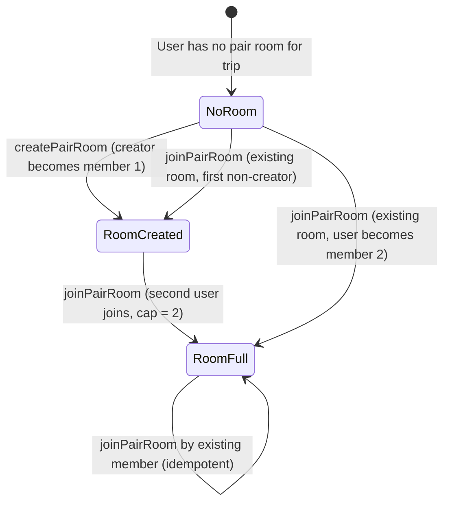
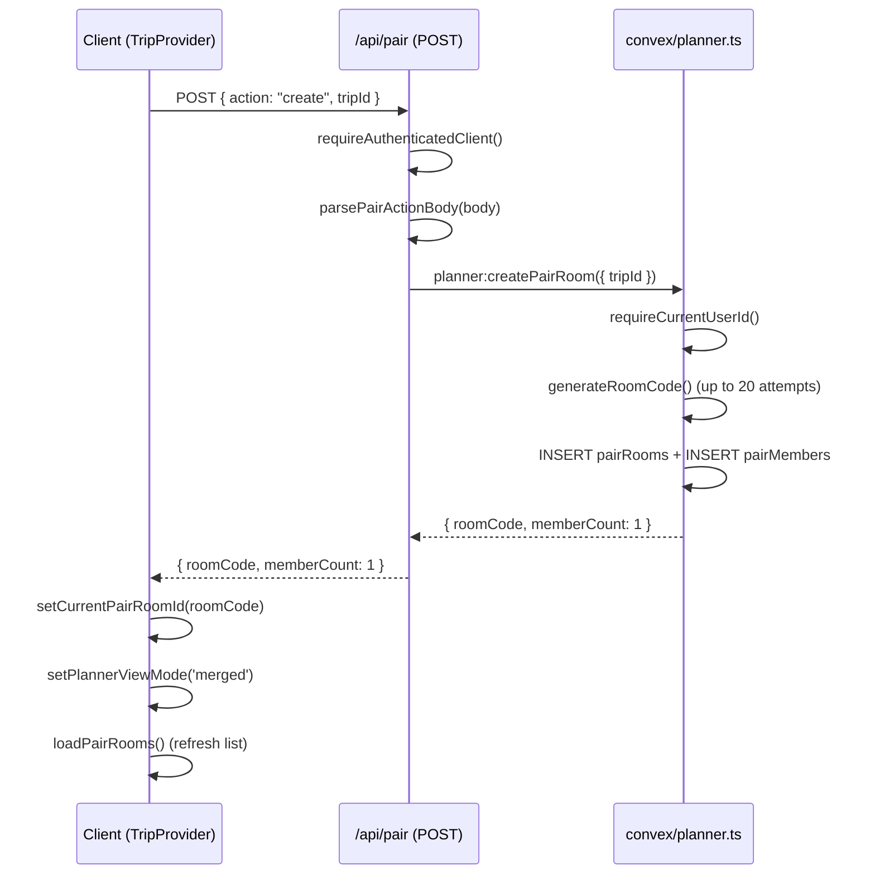
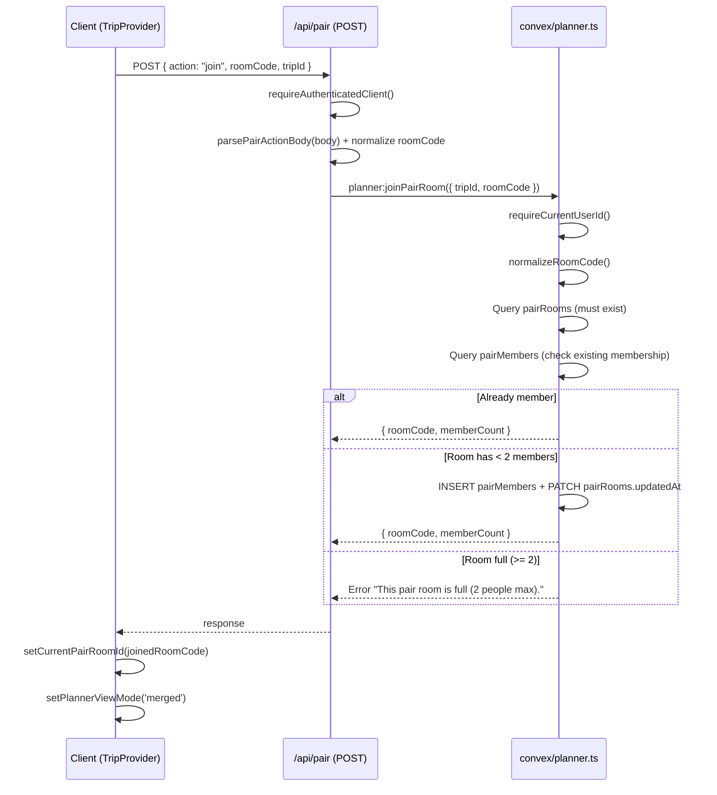
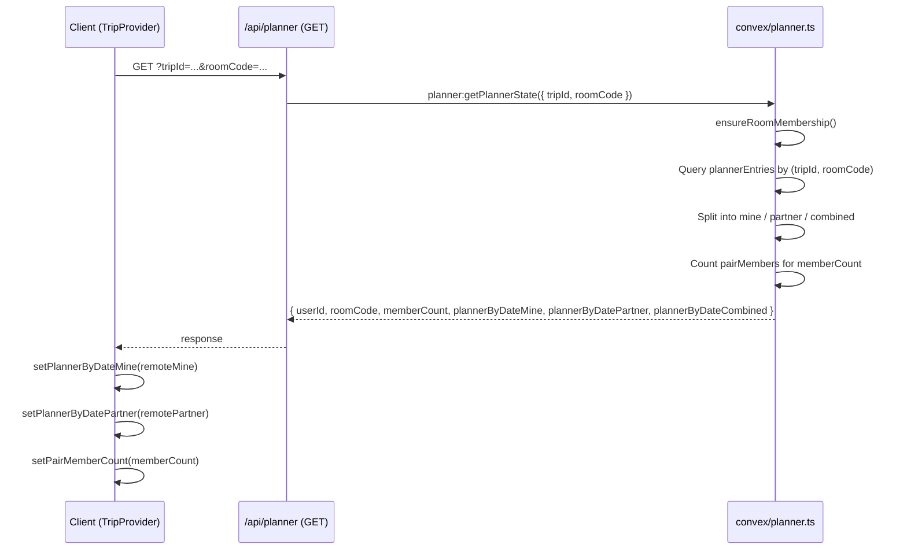

# Pair Planner / Shared Planning: Technical Architecture & Implementation

Document Basis: current code at time of generation.

**Last Updated:** 2026-03-16

---

## 1. Summary

The Pair Planner feature allows two authenticated users to collaboratively plan a trip by sharing a "pair room." Each user maintains their own set of planner entries within the room, but both can view a merged timeline showing both plans side by side.

**Current shipped scope:**

- Create a pair room (generates a 7-character alphanumeric room code)
- Join an existing pair room by code (max 2 members per room)
- List rooms the current user belongs to
- Persist planner entries scoped by `(tripId, roomCode, ownerUserId)`
- Read back three separate views: "mine," "partner," and "combined"
- Side-by-side merged view in the planner calendar UI (50/50 lane split)
- View mode toggle (Mine / Partner / Merged) when a pair room is active
- Ownership-based read-only enforcement (partner items cannot be dragged/removed)
- Visual differentiation: green left-border for own items, amber left-border for partner items

**Out of scope / not yet implemented:**

- No UI controls to create/join/select pair rooms exist in any rendered component (handlers are exposed via `TripProvider` context but not wired to buttons/modals)
- No room deletion or member removal
- No real-time WebSocket push between partners (relies on HTTP polling on page load)
- No room expiry or cleanup mechanism

---

## 2. Runtime Placement & Ownership

| Concern | Location | Notes |
|---|---|---|
| API route (pair CRUD) | `app/api/pair/route.ts` | Next.js Route Handler (GET + POST) |
| API route (planner state) | `app/api/planner/route.ts` | GET reads, POST writes planner entries, both room-aware |
| Backend mutations/queries | `convex/planner.ts` | `createPairRoom`, `joinPairRoom`, `listMyPairRooms`, `getPlannerState`, `replacePlannerState` |
| Schema | `convex/schema.ts` | `pairRooms`, `pairMembers`, `plannerEntries` tables |
| Client state + handlers | `components/providers/TripProvider.tsx` | Global context provider; holds `currentPairRoomId`, `pairRooms`, view mode, all pair handlers |
| Planner UI | `components/PlannerItinerary.tsx` | Renders the time-grid calendar; implements view mode toggle and lane-split layout |
| Pair action parsing | `lib/pair-api.ts` | `parsePairActionBody`, `normalizePairRoomCode` |
| Planner payload parsing | `lib/planner-api.ts` | `parsePlannerPostPayload`, `getPlannerRoomCodeFromUrl`, `normalizePlannerRoomCode` |
| CSS | `app/globals.css:70-93` | `.planner-block-layer-paired`, `.planner-item-owner-mine`, `.planner-item-owner-partner` |
| Auth gate | `lib/request-auth.ts` | `requireAuthenticatedClient` (used by both API routes) |
| Convex auth | `convex/planner.ts:155-161` | `requireCurrentUserId` via `@convex-dev/auth` |

**Lifecycle:** The pair room system is initialized during the TripProvider bootstrap effect (`TripProvider.tsx:1335`). `loadPairRooms()` is called during app initialization and whenever authentication state changes (`TripProvider.tsx:585-591`).

---

## 3. Module/File Map

| File | Responsibility | Key Exports | Dependencies | Side Effects |
|---|---|---|---|---|
| `convex/schema.ts` | DB schema for `pairRooms`, `pairMembers`, `plannerEntries` | Schema definition | `convex/server`, `convex/values` | None |
| `convex/planner.ts` | All pair room + planner Convex functions | `createPairRoom`, `joinPairRoom`, `listMyPairRooms`, `getPlannerState`, `replacePlannerState` | `@convex-dev/auth/server`, schema | DB reads/writes |
| `app/api/pair/route.ts` | HTTP API for pair room create/join/list | `GET`, `POST` | `lib/pair-api`, `lib/request-auth` | Network (Convex calls) |
| `app/api/planner/route.ts` | HTTP API for planner state read/write | `GET`, `POST` | `lib/planner-api`, `lib/request-auth` | Network (Convex calls) |
| `lib/pair-api.ts` | Room code normalization, action parsing | `normalizePairRoomCode`, `parsePairActionBody` | None | None |
| `lib/planner-api.ts` | Planner payload parsing, URL extraction | `normalizePlannerRoomCode`, `parsePlannerPostPayload`, `getPlannerRoomCodeFromUrl` | None | None |
| `components/providers/TripProvider.tsx` | Client-side state management for pair rooms | `useTrip()` context with pair state + handlers | `lib/planner-helpers`, `lib/helpers` | `fetch` to `/api/pair`, `/api/planner` |
| `components/PlannerItinerary.tsx` | Visual planner with pair lane rendering | Default export | `useTrip()` | DOM interaction, pointer events |
| `app/globals.css` | Paired planner visual styles | CSS classes | None | None |

---

## 4. State Model & Transitions

### 4.1 Pair Room Lifecycle (Server)



### 4.2 Client State (TripProvider)

| State Variable | Type | Default | Purpose |
|---|---|---|---|
| `currentPairRoomId` | `string` | `''` | Active pair room code; empty = personal planner |
| `pairRooms` | `any[]` | `[]` | All rooms user belongs to (for the current trip) |
| `pairMemberCount` | `number` | `1` | Member count in the active room |
| `plannerViewMode` | `string` | `'merged'` | `'mine'` / `'partner'` / `'merged'` |
| `plannerByDateMine` | `Record<string, any[]>` | `{}` | Current user's planner entries |
| `plannerByDatePartner` | `Record<string, any[]>` | `{}` | Partner's planner entries |
| `isPairActionPending` | `boolean` | `false` | Loading flag during create/join |

### 4.3 View Mode Resolution

The `plannerByDateForView` memo (`TripProvider.tsx:301-318`) selects which dataset is rendered:

| `currentPairRoomId` | `plannerViewMode` | Result |
|---|---|---|
| `''` (empty) | any | `plannerByDateMine` |
| set | `'mine'` | `plannerByDateMine` |
| set | `'partner'` | `plannerByDatePartner` |
| set | `'merged'` | `mergePlannerByDate(mine, partner)` |

### 4.4 Room Code Format

**Generation** (`convex/planner.ts:414-421`):
- Character set: `abcdefghjkmnpqrstuvwxyz23456789` (30 chars; excludes ambiguous `i`, `l`, `o`, `0`, `1`)
- Length: 7 characters
- Collision avoidance: up to 20 generation attempts per create call
- Theoretical space: 30^7 = ~21.87 billion unique codes

**Normalization** (applied in all layers):
- Lowercase, strip non-`[a-z0-9_-]` characters
- Valid length: 2-64 characters
- Regex pattern: `/^[a-z0-9_-]{2,64}$/`

---

## 5. Interaction & Event Flow

### 5.1 Create Pair Room



### 5.2 Join Pair Room



### 5.3 Load Planner State (Room-Aware)



### 5.4 Save Planner State

The save flow has a **450ms debounce** (`TripProvider.tsx:522-524`). Only the current user's entries (`plannerByDateMine`) are sent to the server. The `roomCode` is included in both the query string and the request body.

The Convex mutation `replacePlannerState` (`convex/planner.ts:341-412`):
1. Authenticates the user
2. Validates room membership via `ensureRoomMembership()`
3. Loads existing entries for `(tripId, roomCode, ownerUserId)`
4. Compares fingerprints to skip no-op writes
5. If changed: deletes all existing entries for the user, inserts new ones

---

## 6. Rendering / Layers / Motion

### 6.1 Lane Layout (Merged View)

When `isMergedPairView` is true (`PlannerItinerary.tsx:123`), the planner block layer uses a 50/50 split:

| Property | Mine (left) | Partner (right) |
|---|---|---|
| `laneWidthPct` | 50% | 50% |
| `laneOffsetPct` | 0% | 50% |
| CSS class | `.planner-item-owner-mine` | `.planner-item-owner-partner` |

The divider is rendered via CSS pseudo-element (`.planner-block-layer-paired::before`) with a 1px border-colored vertical line at 50%.

### 6.2 Visual Styling

```
/* globals.css:92-93 */
.planner-item-owner-mine    { background: rgba(0, 255, 136, 0.06); border-left: 3px solid #00E87B; }
.planner-item-owner-partner { background: rgba(245, 158, 11, 0.06); border-left: 3px solid rgba(245, 158, 11, 0.6); }
```

Additionally, partner items have `opacity-70` applied (`PlannerItinerary.tsx:235`).

### 6.3 Ownership Label

Each planner item renders an ownership badge (`PlannerItinerary.tsx:249-251`):
- Own items: green text (`text-accent`) reading "Mine"
- Partner items: amber text (`text-warning`) reading "Partner"

### 6.4 Overlap Handling

Overlap columns are computed independently per lane in merged view (`PlannerItinerary.tsx:218-223`):
- Mine items use `mineLayout` / `mineCollisions`
- Partner items use `partnerLayout` / `partnerCollisions`
- In non-merged views, all items share a single `allLayout` / `allCollisions`

### 6.5 Interaction Constraints

| Action | Own Items | Partner Items |
|---|---|---|
| Drag to move | Enabled | Disabled (`isReadOnly`) |
| Resize start/end | Enabled | Disabled |
| Remove (x button) | Enabled | Disabled (`disabled={isReadOnly}`) |
| GCal export | Enabled | Enabled |

---

## 7. API & Prop Contracts

### 7.1 Pair Room API (`/api/pair`)

**GET** `?tripId={tripId}`
- Returns: `{ rooms: Array<{ roomCode, tripId, memberCount, joinedAt, updatedAt }> }`

**POST**
- Body for create: `{ action: "create", tripId: string }`
- Body for join: `{ action: "join", tripId: string, roomCode: string }`
- Returns: `{ roomCode: string, memberCount: number }`

### 7.2 Planner API (`/api/planner`)

**GET** `?tripId={tripId}&roomCode={roomCode}`
- Returns: `{ userId, roomCode, memberCount, plannerByDateMine, plannerByDatePartner, plannerByDateCombined }`

**POST** `?tripId={tripId}&roomCode={roomCode}`
- Body: `{ tripId, cityId, roomCode?, plannerByDate: Record<string, PlanItem[]> }`
- Returns: `{ userId, roomCode, dateCount, itemCount, updatedAt }`

### 7.3 Convex Function Signatures

```typescript
// convex/planner.ts:423 - createPairRoom
mutation({ args: { tripId: v.id('trips') }, returns: { roomCode: string, memberCount: number } })

// convex/planner.ts:470 - joinPairRoom
mutation({ args: { tripId: v.id('trips'), roomCode: v.string() }, returns: { roomCode: string, memberCount: number } })

// convex/planner.ts:539 - listMyPairRooms
query({ args: { tripId: v.optional(v.id('trips')) }, returns: Array<{ roomCode, tripId, memberCount, joinedAt, updatedAt }> })

// convex/planner.ts:281 - getPlannerState
query({ args: { tripId: v.id('trips'), roomCode: v.optional(v.string()) }, returns: { userId, roomCode, memberCount, plannerByDateMine, plannerByDatePartner, plannerByDateCombined } })

// convex/planner.ts:341 - replacePlannerState
mutation({ args: { tripId: v.id('trips'), cityId: v.string(), roomCode: v.optional(v.string()), plannerByDate }, returns: { userId, roomCode, dateCount, itemCount, updatedAt } })
```

### 7.4 TripProvider Context API (Pair-Related Exports)

Exposed via `useTrip()` (`TripProvider.tsx:1776-1793`):

| Property | Type | Description |
|---|---|---|
| `currentPairRoomId` | `string` | Active room code, or `''` for personal |
| `pairRooms` | `any[]` | All rooms user is a member of |
| `pairMemberCount` | `number` | Member count in active room |
| `isPairActionPending` | `boolean` | Loading state for create/join |
| `plannerViewMode` | `string` | `'mine'` / `'partner'` / `'merged'` |
| `setPlannerViewMode` | `(mode: string) => void` | Toggle view mode |
| `plannerByDateMine` | `Record<string, any[]>` | User's entries |
| `plannerByDatePartner` | `Record<string, any[]>` | Partner's entries |
| `plannerByDate` | `Record<string, any[]>` | Merged (mine + partner) |
| `handleCreatePairRoom` | `() => Promise<string>` | Create room, returns room code |
| `handleJoinPairRoom` | `(code: string) => Promise<boolean>` | Join room, returns success |
| `handleSelectPairRoom` | `(code: string) => void` | Switch active room |
| `handleUsePersonalPlanner` | `() => void` | Exit pair mode |

---

## 8. Reliability Invariants

These must remain true after any refactor:

1. **Room capacity is exactly 2.** Enforced at `convex/planner.ts:506`: `if (members.length >= 2) throw`.
2. **Room codes are alphanumeric lowercase with hyphens/underscores, 2-64 chars.** Enforced by `ROOM_CODE_PATTERN = /^[a-z0-9_-]{2,64}$/` at `convex/planner.ts:9`.
3. **Users can only write their own planner entries.** The `ownerUserId` is set server-side from `requireCurrentUserId()` at `convex/planner.ts:356`, never from client input.
4. **Room membership is required to read or write planner data.** Enforced by `ensureRoomMembership()` at `convex/planner.ts:167-196`.
5. **Personal planner uses synthetic room code `self:{userId}`.** The `toPersonalRoomCode()` function at `convex/planner.ts:163-165` generates this when no room code is provided.
6. **No-op writes are skipped.** The `plannerFingerprint()` comparison at `convex/planner.ts:361` prevents unnecessary deletes+inserts.
7. **Join is idempotent.** If a user is already a member, `joinPairRoom` returns the current state without inserting a duplicate (`convex/planner.ts:500-501`).
8. **Normalization is applied at every layer.** Room code normalization occurs in: `lib/pair-api.ts`, `lib/planner-api.ts`, `convex/planner.ts`, and `TripProvider.tsx`.

---

## 9. Edge Cases & Pitfalls

| Scenario | Behavior | Source |
|---|---|---|
| Room code collision during create | Retries up to 20 times; throws after exhaustion | `convex/planner.ts:433-447` |
| User joins room they already belong to | Idempotent; returns current `memberCount` without duplicate insert | `convex/planner.ts:500-501` |
| User tries to join a full room | Error: "This pair room is full (2 people max)." | `convex/planner.ts:506-508` |
| Room code not found during join | Error: "Pair room not found." | `convex/planner.ts:489-491` |
| Non-member tries to read/write planner in a room | Error: "Join this pair room before viewing or editing it." | `convex/planner.ts:188-189` |
| Empty/invalid room code in planner operations | Falls back to personal room (`self:{userId}`) | `convex/planner.ts:174-179` |
| Partner drags/resizes/removes own item | Partner items render with `isReadOnly=true`; drag handlers are `undefined`; remove button is `disabled` | `PlannerItinerary.tsx:211-216, 240-245` |
| Planner save with unchanged data | Fingerprint check skips delete+reinsert cycle | `convex/planner.ts:361-373` |
| Auth bypass in dev mode | `DEV_BYPASS_AUTH=true` in `request-auth.ts:5` and `convex/authz.ts:5` hardcodes userId to `'dev-bypass'` | Both files |
| No UI to create/join rooms | Handlers exist in context but no component renders create/join controls | **Not implemented** |

---

## 10. Testing & Verification

### 10.1 Existing Test Files

| Test File | Covers |
|---|---|
| `lib/pair-api.test.mjs` | `normalizePairRoomCode`, `parsePairActionBody` (6 assertions across 4 tests) |
| `lib/planner-api.test.mjs` | `normalizePlannerRoomCode`, `getPlannerRoomCodeFromUrl`, `parsePlannerPostPayload` (7 assertions across 6 tests) |
| `lib/events.planner.test.mjs` | `normalizePlannerRoomId`, `loadPlannerPayload`, `savePlannerPayload` with mocked Convex client |

### 10.2 What Is NOT Tested

- No integration tests for `convex/planner.ts` mutations (`createPairRoom`, `joinPairRoom`, `replacePlannerState`)
- No tests for the pair room capacity limit (2 members max)
- No component tests for `PlannerItinerary` merged view rendering
- No tests for `TripProvider` pair-related state transitions

### 10.3 Manual Verification Scenarios

1. **Create a pair room:**
   ```
   curl -X POST http://localhost:3000/api/pair \
     -H 'Content-Type: application/json' \
     -d '{"action":"create","tripId":"<TRIP_ID>"}'
   ```
   Expected: `{ "roomCode": "<7-char-code>", "memberCount": 1 }`

2. **Join a pair room:**
   ```
   curl -X POST http://localhost:3000/api/pair \
     -H 'Content-Type: application/json' \
     -d '{"action":"join","tripId":"<TRIP_ID>","roomCode":"<ROOM_CODE>"}'
   ```
   Expected: `{ "roomCode": "<code>", "memberCount": 2 }`

3. **List pair rooms:**
   ```
   curl http://localhost:3000/api/pair?tripId=<TRIP_ID>
   ```
   Expected: `{ "rooms": [{ "roomCode": "...", "tripId": "...", "memberCount": 2, ... }] }`

4. **Load planner state with room:**
   ```
   curl http://localhost:3000/api/planner?tripId=<TRIP_ID>&roomCode=<ROOM_CODE>
   ```
   Expected: Response includes `plannerByDateMine`, `plannerByDatePartner`, `plannerByDateCombined`

### 10.4 Run Tests

```bash
npx --yes tsx --test lib/pair-api.test.mjs
npx --yes tsx --test lib/planner-api.test.mjs
npx --yes tsx --test lib/events.planner.test.mjs
```

---

## 11. Quick Change Playbook

| If you want to... | Edit... |
|---|---|
| Change max room capacity from 2 | `convex/planner.ts:506` -- change `>= 2` to desired limit |
| Change room code length | `convex/planner.ts:417` -- change loop bound `i < 7` |
| Change room code character set | `convex/planner.ts:415` -- modify `chars` string |
| Add a room deletion mutation | `convex/planner.ts` -- new `mutation` that deletes from `pairRooms`, `pairMembers`, and `plannerEntries` for the room |
| Add UI buttons for create/join/select pair room | Create a new component, use `useTrip()` to access `handleCreatePairRoom`, `handleJoinPairRoom`, `handleSelectPairRoom`, `handleUsePersonalPlanner` |
| Change merged view split ratio | `PlannerItinerary.tsx:226-229` -- modify `laneWidthPct` and `laneOffsetPct` |
| Change partner item visual style | `app/globals.css:93` -- modify `.planner-item-owner-partner` |
| Change partner item opacity | `PlannerItinerary.tsx:235` -- modify `opacity-70` class |
| Add real-time sync between partners | Replace HTTP polling in `TripProvider.tsx:432-489` with Convex `useQuery('planner:getPlannerState', ...)` reactive subscription |
| Change planner save debounce interval | `TripProvider.tsx:524` -- change `450` (milliseconds) |
| Add a third view mode (e.g., "conflicts only") | Add option to `plannerViewMode` logic at `TripProvider.tsx:301-318` and toggle at `PlannerItinerary.tsx:147-159` |
| Change room code normalization rules | Update in all four locations: `convex/planner.ts:91-97`, `lib/pair-api.ts:1-7`, `lib/planner-api.ts:1-7`, `TripProvider.tsx:167-173` |

---

## Appendix A: Database Schema (Pair-Related Tables)

### `pairRooms` (`convex/schema.ts:93-99`)

| Field | Type | Description |
|---|---|---|
| `tripId` | `Id<'trips'>` | Foreign key to trips table |
| `roomCode` | `string` | Normalized room code |
| `createdByUserId` | `string` | User who created the room |
| `createdAt` | `string` | ISO timestamp |
| `updatedAt` | `string` | ISO timestamp (updated on member join) |

Index: `by_trip_room` on `[tripId, roomCode]`

### `pairMembers` (`convex/schema.ts:101-109`)

| Field | Type | Description |
|---|---|---|
| `tripId` | `Id<'trips'>` | Foreign key to trips table |
| `roomCode` | `string` | Room this membership belongs to |
| `userId` | `string` | The member's user ID |
| `joinedAt` | `string` | ISO timestamp |

Indexes: `by_trip_room` `[tripId, roomCode]`, `by_trip_room_user` `[tripId, roomCode, userId]`, `by_user` `[userId]`

### `plannerEntries` (`convex/schema.ts:71-91`)

| Field | Type | Description |
|---|---|---|
| `tripId` | `Id<'trips'>` | Foreign key to trips table |
| `cityId` | `string` | City the entry belongs to |
| `roomCode` | `string` | Room code or `self:{userId}` for personal |
| `ownerUserId` | `string` | User who owns this entry |
| `dateISO` | `string` | Date in `YYYY-MM-DD` format |
| `itemId` | `string` | Client-generated plan item ID |
| `kind` | `'event' \| 'place'` | Item type |
| `sourceKey` | `string` | Event URL or spot ID |
| `title` | `string` | Display title |
| `locationText` | `string` | Location description |
| `link` | `string` | External link |
| `tag` | `string` | Category tag (eat, bar, cafes, etc.) |
| `startMinutes` | `number` | Start time as minutes from midnight |
| `endMinutes` | `number` | End time as minutes from midnight |
| `updatedAt` | `string` | ISO timestamp |

Indexes: `by_trip_room`, `by_trip_room_owner`, `by_trip_room_owner_date`, `by_trip_room_date`

---

## Appendix B: Key Constants

| Constant | Value | Location |
|---|---|---|
| `ROOM_CODE_PATTERN` | `/^[a-z0-9_-]{2,64}$/` | `convex/planner.ts:9` |
| Room code length (generated) | 7 characters | `convex/planner.ts:417` |
| Room code charset | `abcdefghjkmnpqrstuvwxyz23456789` | `convex/planner.ts:415` |
| Max room members | 2 | `convex/planner.ts:506` |
| Max room code generation attempts | 20 | `convex/planner.ts:433` |
| `MIN_PLAN_BLOCK_MINUTES` | 30 | `convex/planner.ts:8` |
| `MINUTES_IN_DAY` | 1440 | `convex/planner.ts:7` |
| Planner save debounce | 450ms | `TripProvider.tsx:524` |
| Personal room code format | `self:{userId}` | `convex/planner.ts:163-165` |
| `PLAN_HOUR_HEIGHT` | 50px | `lib/planner-helpers.ts:14` |
| `PLAN_MINUTE_HEIGHT` | 0.833px | `lib/planner-helpers.ts:15` |
