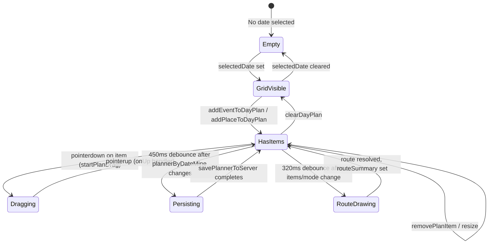
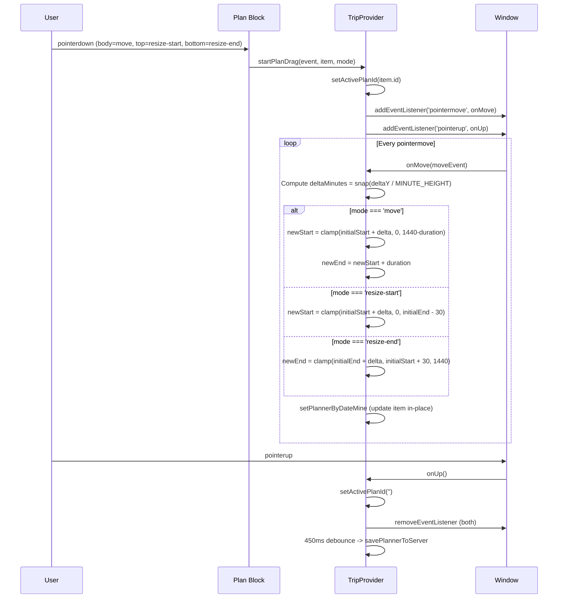

# Planner Time Grid: Technical Architecture & Implementation

**Document Basis:** current code at time of generation.

**Last Updated:** 2026-03-16

---

## 1. Summary

The Planner Time Grid is a 24-hour vertical timeline that lets users visually schedule events and places into a day plan. It supports:

- **Drag-and-drop positioning** with 15-minute snap increments
- **Resize handles** on both the top and bottom edges of each block
- **Collision detection** with visual warning indicators
- **Multi-column overlap layout** for concurrent items
- **Pair planning** with side-by-side Mine/Partner lanes and merged view
- **Route estimation** via Google Maps Routes API with polyline rendering
- **Calendar export** in both iCal (.ics) and Google Calendar URL formats
- **Server persistence** through Convex `plannerEntries` table with fingerprint-based diffing

**Out of scope:** The time grid does not handle recurring events, timezone conversion for individual items, or multi-day span blocks. All items are clamped to a single 0-1440 minute range within one calendar day.

---

## 2. Runtime Placement & Ownership

| Aspect | Detail | Citation |
|---|---|---|
| Component | `PlannerItinerary` (default export, client component) | `components/PlannerItinerary.tsx:101` |
| State owner | `TripProvider` context -- all planner state lives here | `components/providers/TripProvider.tsx:223` |
| Mount point | Right sidebar of `AppShell`, within the `trips/[tripId]` route group | `components/AppShell.tsx` |
| Lifecycle | Rendered when `selectedDate` is truthy; shows skeleton during `isInitializing` | `PlannerItinerary.tsx:112-114,186` |
| Backend | `convex/planner.ts` mutations/queries via `/api/planner` Next.js route | `app/api/planner/route.ts:1-89` |

The component itself is stateless -- it reads all data and callbacks from `useTrip()` and delegates all mutations back to `TripProvider`.

---

## 3. Module/File Map

| File | Responsibility | Key Exports | Dependencies | Side Effects |
|---|---|---|---|---|
| `components/PlannerItinerary.tsx` | UI rendering: time grid, plan blocks, header controls | `default (PlannerItinerary)` | `useTrip`, `planner-helpers`, `helpers` | None |
| `lib/planner-helpers.ts` | Pure logic: slot suggestion, ICS generation, GCal URLs, sanitization | `PLAN_SNAP_MINUTES`, `PLAN_HOUR_HEIGHT`, `PLAN_MINUTE_HEIGHT`, `createPlanId`, `sortPlanItems`, `sanitizePlannerByDate`, `parseEventTimeRange`, `getSuggestedPlanSlot`, `buildPlannerIcs`, `buildGoogleCalendarItemUrl`, `buildGoogleCalendarStopUrls`, `MAX_ROUTE_STOPS` | `helpers` | None |
| `lib/planner-api.ts` | Server-side payload parsing, room code normalization | `normalizePlannerRoomCode`, `getPlannerRoomCodeFromUrl`, `getPlannerTripIdFromUrl`, `parsePlannerPostPayload` | None | None |
| `lib/helpers.ts` | Shared constants and formatting | `MINUTES_IN_DAY`, `MIN_PLAN_BLOCK_MINUTES`, `clampMinutes`, `snapMinutes`, `formatMinuteLabel`, `formatHour` | None | None |
| `convex/planner.ts` | Convex query/mutations: CRUD for plan entries, pair rooms | `getPlannerState`, `replacePlannerState`, `createPairRoom`, `joinPairRoom`, `listMyPairRooms` | `convex/values`, `@convex-dev/auth` | DB writes |
| `convex/schema.ts` | Table definitions: `plannerEntries`, `pairRooms`, `pairMembers` | schema | None | None |
| `app/api/planner/route.ts` | Next.js API route: GET/POST proxy to Convex | `GET`, `POST` | `request-auth`, `planner-api` | Network |
| `components/providers/TripProvider.tsx` | State management: drag logic, persistence, route drawing | `useTrip`, `TripProvider` | All of the above + `map-helpers` | Pointer events, timers, network |
| `lib/map-helpers.ts` | Route request, polyline decoding, cache key generation | `requestPlannedRoute`, `createRouteRequestCacheKey`, `decodeEncodedPolyline` | None | Network (fetch) |
| `app/globals.css` | Structural CSS for time grid (too complex for Tailwind) | N/A | N/A | None |

---

## 4. State Model & Transitions

### 4.1 Core State Variables

| State | Type | Location | Purpose |
|---|---|---|---|
| `plannerByDateMine` | `Record<string, PlanItem[]>` | `TripProvider.tsx:267` | Current user's plan items, keyed by ISO date |
| `plannerByDatePartner` | `Record<string, PlanItem[]>` | `TripProvider.tsx:268` | Partner's plan items (pair mode) |
| `plannerViewMode` | `'mine' \| 'partner' \| 'merged'` | `TripProvider.tsx:269` | Active view filter in pair mode |
| `activePlanId` | `string` | `TripProvider.tsx:270` | Item ID currently being dragged (empty = idle) |
| `selectedDate` | `string` (ISO date) | `TripProvider.tsx:257` | Currently viewed day |
| `travelMode` | `'DRIVING' \| 'TRANSIT' \| 'WALKING'` | `TripProvider.tsx:259` | Route calculation mode |
| `routeSummary` | `string` | `TripProvider.tsx:271` | Human-readable route summary text |
| `isRouteUpdating` | `boolean` | `TripProvider.tsx:272` | True while route API call is in flight |

### 4.2 Derived State

| Derived | Computation | Citation |
|---|---|---|
| `plannerByDateForView` | Switches between mine/partner/merged based on `plannerViewMode` and `currentPairRoomId` | `TripProvider.tsx:301-318` |
| `dayPlanItems` | `plannerByDateForView[selectedDate]`, sorted by `startMinutes` | `TripProvider.tsx:411-415` |
| `plannedRouteStops` | Items from `dayPlanItems` that have resolved geo coordinates via `eventLookup` / `placeLookup` | `TripProvider.tsx:417-429` |

### 4.3 Plan Item Shape

```typescript
// lib/planner-helpers.ts:39-50 (client) / convex/planner.ts:70-80 (server)
{
  id: string;            // e.g. "plan-x8k2m1a"
  kind: 'event' | 'place';
  sourceKey: string;     // event URL or place composite key
  title: string;
  locationText: string;
  link: string;
  tag: string;           // normalized place tag
  startMinutes: number;  // 0-1440
  endMinutes: number;    // startMinutes+30 to 1440
  ownerUserId?: string;  // set by TripProvider on creation
}
```

### 4.4 State Diagram



---

## 5. Interaction & Event Flow

### 5.1 Adding an Item

1. User clicks "Add to Plan" on an event info window or place card.
2. `addEventToDayPlan` / `addPlaceToDayPlan` is called (`TripProvider.tsx:895-931`).
3. For events: time is parsed from `startDateTimeText` via `parseEventTimeRange` (`planner-helpers.ts:72-82`). Fallback: 9:00 AM start, 90-minute duration.
4. For places: `getSuggestedPlanSlot` finds the first non-overlapping gap starting at 9:00 AM (`planner-helpers.ts:93-118`). Default duration: 75 minutes.
5. A new `PlanItem` is created with `createPlanId()`, owner set to `authUserId`.
6. `plannerByDateMine` state updates, triggering re-render and the 450ms save debounce.

### 5.2 Drag-and-Drop (Move / Resize)



Key implementation details from `TripProvider.tsx:946-988`:
- Delta is computed as `snap(deltaY / MINUTE_HEIGHT)` where `MINUTE_HEIGHT = 50/60 ~= 0.833px/min`.
- Snap function: `Math.round(value / 15) * 15` -- always 15-minute increments.
- Minimum block size enforced: `MIN_PLAN_BLOCK = 30` minutes.
- Partner-owned items are blocked from drag (`isReadOnly` check at line 948-949).
- `activePlanId` is set during drag to suppress route recalculation (line 1435).

### 5.3 Route Drawing

1. `dayPlanItems` or `travelMode` changes trigger the route effect (`TripProvider.tsx:1428-1471`).
2. A 320ms debounce prevents excessive API calls during rapid edits.
3. Route calculation is skipped while `activePlanId` is set (drag in progress).
4. `plannedRouteStops` are capped at `MAX_ROUTE_STOPS = 8` (`planner-helpers.ts:18`).
5. `requestPlannedRoute` calls `/api/route` POST endpoint (`map-helpers.ts:141-167`).
6. Response polyline is decoded and rendered as a Google Maps Polyline with `strokeColor: '#00FF88'`, `strokeWeight: 5`.
7. During update: polyline switches to dashed style (`strokeOpacity: 0`, dashed icon pattern) (`TripProvider.tsx:767-777`).
8. Route summary format: `"{N} stops · {distance} · {duration}"` (`TripProvider.tsx:1461`).

### 5.4 Persistence Flow

1. Any change to `plannerByDateMine` triggers a 450ms debounced save (`TripProvider.tsx:517-531`).
2. The save guard checks `plannerHydratedRef.current` to prevent saving before initial load completes.
3. `savePlannerToServer` POSTs to `/api/planner` with the compacted planner data (`TripProvider.tsx:491-515`).
4. The API route proxies to `planner:replacePlannerState` Convex mutation.
5. Server-side, a fingerprint comparison (`plannerFingerprint`) skips the delete+reinsert cycle when data is unchanged (`convex/planner.ts:361`).
6. All existing entries for the user+room are deleted and re-inserted (full replace strategy, not incremental).

---

## 6. Rendering / Layers / Motion

### 6.1 Layer Stack (top to bottom in the `.planner-calendar` container)

| Layer | CSS Class | Z-behavior | Purpose |
|---|---|---|---|
| Plan item blocks | `.planner-item` | `position: absolute`, stacked by DOM order | Interactive blocks |
| Block layer | `.planner-block-layer` | `position: absolute; inset: 0 0 0 76px` | Container for blocks, offset from hour labels |
| Paired lane divider | `.planner-block-layer-paired::before` | `pointer-events: none` pseudo-element | Green/blue tint + center divider |
| Hour grid lines | `.planner-hour-row` | `position: absolute; border-top: 1px solid #1f1f1f` | 24 horizontal lines |
| Time grid container | `.planner-time-grid` | `position: relative; height: 1200px` | Establishes coordinate space |
| Calendar scroll container | `.planner-calendar` | `position: relative; overflow: auto` | Scrollable viewport |

### 6.2 Layout Constants

| Constant | Value | Source |
|---|---|---|
| `PLAN_HOUR_HEIGHT` | `50px` | `planner-helpers.ts:14` |
| `PLAN_MINUTE_HEIGHT` | `0.8333px` (50/60) | `planner-helpers.ts:15` |
| `PLAN_SNAP_MINUTES` | `15` | `planner-helpers.ts:13` |
| `MIN_PLAN_BLOCK_MINUTES` | `30` | `helpers.ts:2` |
| `MINUTES_IN_DAY` | `1440` | `helpers.ts:1` |
| `MAX_ROUTE_STOPS` | `8` | `planner-helpers.ts:18` |
| Grid total height | `24 * 50 = 1200px` | `globals.css:67` |
| Hour label gutter | `76px` | `globals.css:65,70` |
| Min block rendered height | `28px` | `PlannerItinerary.tsx:210` |

### 6.3 Block Positioning

Each plan item is absolutely positioned within `.planner-block-layer`:

```javascript
// PlannerItinerary.tsx:209-229
const top = item.startMinutes * PLAN_MINUTE_HEIGHT;          // e.g., 540 * 0.833 = 450px
const height = Math.max(28, (item.endMinutes - item.startMinutes) * PLAN_MINUTE_HEIGHT);
// Overlap columns:
const widthPct = laneWidthPct / totalColumnsInGroup;
const leftPct = laneOffsetPct + columnIndex * widthPct;
```

### 6.4 Multi-Column Overlap Algorithm

`computeOverlapColumns` (`PlannerItinerary.tsx:13-50`) implements a greedy column-packing algorithm:

1. Sort items by `startMinutes`, then `endMinutes`.
2. Group items that mutually overlap (transitive closure via pairwise check).
3. Within each group, assign columns greedily: first available column where no existing item overlaps.
4. Return `columns` (Map: itemId -> columnIndex) and `totalCols` (Map: itemId -> groupColumnCount).

In merged pair view, separate layouts are computed for mine vs partner items, each occupying 50% width of the grid.

### 6.5 Visual Differentiation

| Item Type | Background | Border | Citation |
|---|---|---|---|
| Event | `rgba(255, 136, 0, 0.10)` | `rgba(255, 136, 0, 0.3)` | `globals.css:90` |
| Place | `rgba(0, 255, 136, 0.06)` | `rgba(0, 255, 136, 0.2)` | `globals.css:91` |
| Mine (owner) | `rgba(0, 255, 136, 0.06)` | Left `3px solid #00E87B` | `globals.css:92` |
| Partner (owner) | `rgba(245, 158, 11, 0.06)` | Left `3px solid rgba(245, 158, 11, 0.6)` | `globals.css:93` |
| Active (dragging) | -- | `box-shadow: 0 0 0 3px var(--color-accent-glow)` | `globals.css:89` |
| Collision indicator | AlertTriangle icon (lucide) in `text-warning` (#FF8800) | -- | `PlannerItinerary.tsx:243` |

### 6.6 Cursor Behavior

| Region | Cursor | Citation |
|---|---|---|
| Item body | `cursor: grab` / `cursor: grabbing` (on `:active`) | `globals.css:84,88` |
| Top/bottom resize handles | `cursor: ns-resize` (or `cursor: default` if read-only) | `PlannerItinerary.tsx:241,253` |

### 6.7 Transitions

```css
/* globals.css:86 */
.planner-item {
  transition: box-shadow 0.2s, border-color 0.2s;
}
```

No spring/physics animations. Route polyline toggles between solid and dashed during updates (no CSS transition -- immediate `setOptions` call).

---

## 7. API & Prop Contracts

### 7.1 `useTrip()` -- Planner-relevant Context Values

| Value | Type | Direction | Description |
|---|---|---|---|
| `selectedDate` | `string` | Read | ISO date for current view |
| `dayPlanItems` | `PlanItem[]` | Read | Sorted items for selected date |
| `activePlanId` | `string` | Read | Currently-dragged item ID |
| `travelMode` | `string` | Read | `DRIVING` / `TRANSIT` / `WALKING` |
| `setTravelMode` | `(mode: string) => void` | Write | Update travel mode |
| `plannerViewMode` | `string` | Read | `mine` / `partner` / `merged` |
| `setPlannerViewMode` | `(mode: string) => void` | Write | Update pair view filter |
| `routeSummary` | `string` | Read | Route description text |
| `isRouteUpdating` | `boolean` | Read | Route calculation in progress |
| `startPlanDrag` | `(event, item, mode) => void` | Write | Initiate drag interaction |
| `removePlanItem` | `(itemId: string) => void` | Write | Remove item from plan |
| `clearDayPlan` | `() => void` | Write | Remove all items for selected date |
| `handleExportPlannerIcs` | `() => void` | Write | Download .ics file |
| `handleAddDayPlanToGoogleCalendar` | `() => void` | Write | Open GCal draft tabs |
| `baseLocationText` | `string` | Read | User's home/hotel address |
| `authUserId` | `string` | Read | Current authenticated user ID |
| `currentPairRoomId` | `string` | Read | Active pair room code (empty = solo) |
| `timezone` | `string` | Read | Trip timezone (default: `America/Los_Angeles`) |

### 7.2 REST API: `/api/planner`

**GET** -- Load planner state

| Param | Source | Required | Description |
|---|---|---|---|
| `tripId` | Query | Yes | Convex trip document ID |
| `roomCode` | Query | No | Pair room code |

Response: `{ userId, roomCode, memberCount, plannerByDateMine, plannerByDatePartner, plannerByDateCombined }`

**POST** -- Save planner state (full replace for current user)

| Field | Source | Required | Description |
|---|---|---|---|
| `tripId` | Body | Yes | Convex trip document ID |
| `cityId` | Body | Yes | City identifier |
| `roomCode` | Body/Query | No | Pair room code |
| `plannerByDate` | Body | Yes | `Record<string, PlanItem[]>` |

Response: `{ userId, roomCode, dateCount, itemCount, updatedAt }`

### 7.3 Convex Schema: `plannerEntries`

```typescript
// convex/schema.ts:71-91
plannerEntries: defineTable({
  tripId: v.id('trips'),
  cityId: v.string(),
  roomCode: v.string(),       // "self:{userId}" for solo, generated code for pair
  ownerUserId: v.string(),
  dateISO: v.string(),
  itemId: v.string(),
  kind: v.union(v.literal('event'), v.literal('place')),
  sourceKey: v.string(),
  title: v.string(),
  locationText: v.string(),
  link: v.string(),
  tag: v.string(),
  startMinutes: v.number(),
  endMinutes: v.number(),
  updatedAt: v.string()
})
  .index('by_trip_room', ['tripId', 'roomCode'])
  .index('by_trip_room_owner', ['tripId', 'roomCode', 'ownerUserId'])
  .index('by_trip_room_owner_date', ['tripId', 'roomCode', 'ownerUserId', 'dateISO'])
  .index('by_trip_room_date', ['tripId', 'roomCode', 'dateISO'])
```

### 7.4 Key Function Signatures

```typescript
// planner-helpers.ts:93
function getSuggestedPlanSlot(
  existingItems: PlanItem[],
  preferredRange: { startMinutes: number; endMinutes: number } | null,
  fallbackDurationMinutes: number
): { startMinutes: number; endMinutes: number }

// planner-helpers.ts:150
function buildPlannerIcs(
  dateISO: string,
  planItems: PlanItem[],
  options?: { cityName?: string }
): string  // VCALENDAR text

// planner-helpers.ts:179
function buildGoogleCalendarItemUrl(params: {
  dateISO: string;
  item: PlanItem;
  baseLocationText: string;
  timezone?: string;  // default 'America/Los_Angeles'
}): string  // https://calendar.google.com/calendar/render?...

// planner-helpers.ts:72
function parseEventTimeRange(value: string | null): {
  startMinutes: number;
  endMinutes: number;
} | null
```

---

## 8. Reliability Invariants

These are deterministic truths that must remain true after any refactor:

1. **Minimum block duration**: `endMinutes - startMinutes >= MIN_PLAN_BLOCK_MINUTES (30)`. Enforced in `clampMinutes` during sanitization (`planner-helpers.ts:38`), drag handler (`TripProvider.tsx:968`), and server-side (`convex/planner.ts:133`).

2. **Time bounds**: `0 <= startMinutes < endMinutes <= 1440`. Triple-enforced: client sanitization, drag clamping, server sanitization.

3. **Snap granularity**: All user-facing times snap to 15-minute boundaries during drag (`TripProvider.tsx:961`). Items added programmatically may have non-snapped times if `parseEventTimeRange` extracts odd minutes.

4. **Owner isolation in pair mode**: A user can only modify items where `ownerUserId === authUserId`. Enforced in UI (`isReadOnly` check at `PlannerItinerary.tsx:211-216`) and server-side (the `replacePlannerState` mutation only deletes/reinserts the calling user's entries via `by_trip_room_owner` index, `convex/planner.ts:353-356`).

5. **Fingerprint-based save optimization**: `replacePlannerState` compares `plannerFingerprint(existing)` against `plannerFingerprint(incoming)`. If identical, the mutation short-circuits without deleting/reinserting rows (`convex/planner.ts:361-373`).

6. **Hydration guard**: Saves are blocked until `plannerHydratedRef.current === true` to prevent overwriting server state with empty local state (`TripProvider.tsx:519`).

7. **Route suppression during drag**: Route recalculation is skipped when `activePlanId` is non-empty (`TripProvider.tsx:1435`).

8. **Items without `sourceKey` are discarded**: Both client and server sanitization filters `item => item.sourceKey` (`planner-helpers.ts:51`, `convex/planner.ts:146`).

---

## 9. Edge Cases & Pitfalls

### 9.1 Collision Detection vs. Overlap Layout

`getCollisions` and `computeOverlapColumns` are independent systems. `getCollisions` (`PlannerItinerary.tsx:52-63`) is O(n^2) pairwise comparison used only for the warning icon. `computeOverlapColumns` (`PlannerItinerary.tsx:13-50`) is a greedy column packer used for layout. An item can be in an overlap column without showing a collision warning (this would be a bug -- but currently both use the same overlap predicate: `a.startMinutes < b.endMinutes && a.endMinutes > b.startMinutes`).

### 9.2 Merged Pair View Layout

In merged pair view (`isMergedPairView === true`), the grid is split 50/50. Mine items use `computeOverlapColumns(mineItems)` and partner items use `computeOverlapColumns(partnerItems)` -- they are laid out independently within their halves. Cross-lane overlaps are visually apparent but do NOT trigger collision warnings because each lane uses its own collision set (`PlannerItinerary.tsx:204-206,218-224`).

### 9.3 Google Calendar Pop-up Blocking

`handleAddDayPlanToGoogleCalendar` opens one tab per item via `window.open`. Browsers aggressively block multiple pop-ups. The handler counts successful opens and warns the user about partial failures (`TripProvider.tsx:1633-1636`).

### 9.4 Route Stop Cap

Only the first 8 geocoded stops are sent to the route API (`MAX_ROUTE_STOPS = 8`). The UI shows a suffix note when items exceed this limit (`TripProvider.tsx:1460`).

### 9.5 Full-Replace Persistence

Every save deletes ALL of the user's planner entries for the room and reinserts them (`convex/planner.ts:375-401`). This is safe due to the fingerprint guard but means high write volume for frequent saves. The 450ms debounce mitigates this (`TripProvider.tsx:522-524`).

### 9.6 Drag Without Pointer Capture

The drag handler uses `window.addEventListener('pointermove')` rather than `element.setPointerCapture()`. This means pointer events outside the browser window may be missed on some platforms, potentially leaving the drag in a stuck state. The `pointerup` listener on `window` mitigates this for most cases.

### 9.7 Items from Events with Odd Times

`parseEventTimeRange` extracts times from free-text strings like "7:30 PM - 10:00 PM" using regex. Items created this way may have non-15-minute-aligned start/end times. They will only snap to 15-minute boundaries when the user subsequently drags them.

### 9.8 Minimum Rendered Height

Blocks have `Math.max(28, computed_height)` (`PlannerItinerary.tsx:210`). A 30-minute block at `0.833px/min` = 25px, which is below the 28px minimum. This means 30-minute blocks will appear slightly taller than their time range, potentially overlapping with adjacent items visually even when they don't overlap temporally.

---

## 10. Testing & Verification

### 10.1 Existing Test Files

| File | Runner | Coverage |
|---|---|---|
| `lib/planner-api.test.mjs` | `node:test` | Room code normalization, POST payload parsing, item sanitization (5 test cases) |
| `lib/events.planner.test.mjs` | `node:test` | Room ID normalization, planner load/save with mocked Convex client (5 test cases) |

Run tests:
```bash
npx tsx --test lib/planner-api.test.mjs
npx tsx --test lib/events.planner.test.mjs
```

### 10.2 Manual Verification Scenarios

| Scenario | Steps | Expected Result |
|---|---|---|
| Add place to plan | Select date, click "Add to plan" on a place card | Block appears at first available slot, 75min default duration |
| Add event to plan | Select date, click "+" on event info window | Block appears at event's parsed time (or 9:00 AM fallback) |
| Drag move | Pointerdown on block body, drag vertically | Block snaps to 15-min increments, duration preserved |
| Resize start | Pointerdown on top 8px handle, drag up | Start time moves, end stays fixed, min 30min enforced |
| Resize end | Pointerdown on bottom 8px handle, drag down | End time moves, start stays fixed, max 1440 min (midnight) |
| Collision warning | Create two overlapping items | Both show AlertTriangle icon |
| Pair merged view | In pair room, select "Merged" toggle | Grid splits 50/50 with green/blue tint, center divider |
| iCal export | Add items, click EXPORT | .ics file downloads with VCALENDAR events |
| GCal export | Add items, click GCal | Google Calendar draft tabs open (one per item) |
| Route summary | Add 2+ geocoded items | Route polyline drawn, summary shows stops/distance/time |
| Partner read-only | In pair room, partner items shown | Partner items have `opacity-70`, drag/delete disabled |

### 10.3 Untested Areas

- No unit tests for `computeOverlapColumns` or `getCollisions` (client-only, in `PlannerItinerary.tsx`).
- No integration tests for drag-and-drop behavior.
- No tests for `buildPlannerIcs` or `buildGoogleCalendarItemUrl` output correctness.
- No tests for the 450ms debounced save or hydration guard logic.
- `getSuggestedPlanSlot` has no direct test file (used only in `addPlaceToDayPlan`).

---

## 11. Quick Change Playbook

| Change Goal | File(s) to Edit | Notes |
|---|---|---|
| Change snap increment (e.g., 15min to 10min) | `lib/helpers.ts:183` (snapMinutes), `lib/planner-helpers.ts:13` (PLAN_SNAP_MINUTES), `TripProvider.tsx:960` (SNAP const in drag handler) | Must update all three locations -- the drag handler has its own inline constant |
| Change minimum block duration | `lib/helpers.ts:2` (MIN_PLAN_BLOCK_MINUTES), `TripProvider.tsx:958` (MIN_PLAN_BLOCK), `convex/planner.ts:8` (MINUTES_IN_DAY/MIN_PLAN_BLOCK_MINUTES), `lib/planner-api.ts:10` | Four locations declare this constant independently |
| Change hour height (zoom level) | `lib/planner-helpers.ts:14` (PLAN_HOUR_HEIGHT) + `app/globals.css:67` (height calc) + `PlannerItinerary.tsx:190` (inline `PLAN_HOUR_HEIGHT` usage) | CSS and JS must stay in sync; the CSS hardcodes `50px` in `calc(24 * 50px)` |
| Change hour label gutter width | `app/globals.css:65` (background gradient `76px`), `app/globals.css:70` (`.planner-block-layer` left inset `76px`) | Two CSS locations |
| Add a new item kind (e.g., `'transport'`) | `convex/schema.ts:78` (kind union), `convex/planner.ts:12` (planItemValidator), `lib/planner-helpers.ts:41`, `PlannerItinerary.tsx:233` (class selection) | Must add to Convex validator union and update CSS class mapping |
| Change route stop limit | `lib/planner-helpers.ts:18` (MAX_ROUTE_STOPS) | Single location |
| Change travel mode options | `PlannerItinerary.tsx:141-144` (Select items), `TripProvider.tsx:259` (default value) | UI and default must match |
| Change save debounce interval | `TripProvider.tsx:522` (450ms timeout) | Single location |
| Change route recalculation debounce | `TripProvider.tsx:1431` (320ms timeout) | Single location |
| Customize ICS output | `lib/planner-helpers.ts:150-177` (buildPlannerIcs) | Pure function, easy to modify |
| Change GCal URL format | `lib/planner-helpers.ts:179-198` (buildGoogleCalendarItemUrl) | Pure function, modify URLSearchParams |
| Change block visual styling | `app/globals.css:81-93` | All structural planner styles are in this CSS block |
| Change collision visual indicator | `PlannerItinerary.tsx:243` | Replace AlertTriangle icon or change `text-warning` class |
| Add new pair view mode | `TripProvider.tsx:301-318` (plannerByDateForView), `PlannerItinerary.tsx:147-159` (ToggleGroup) | Extend the view mode switch and add a new toggle item |
