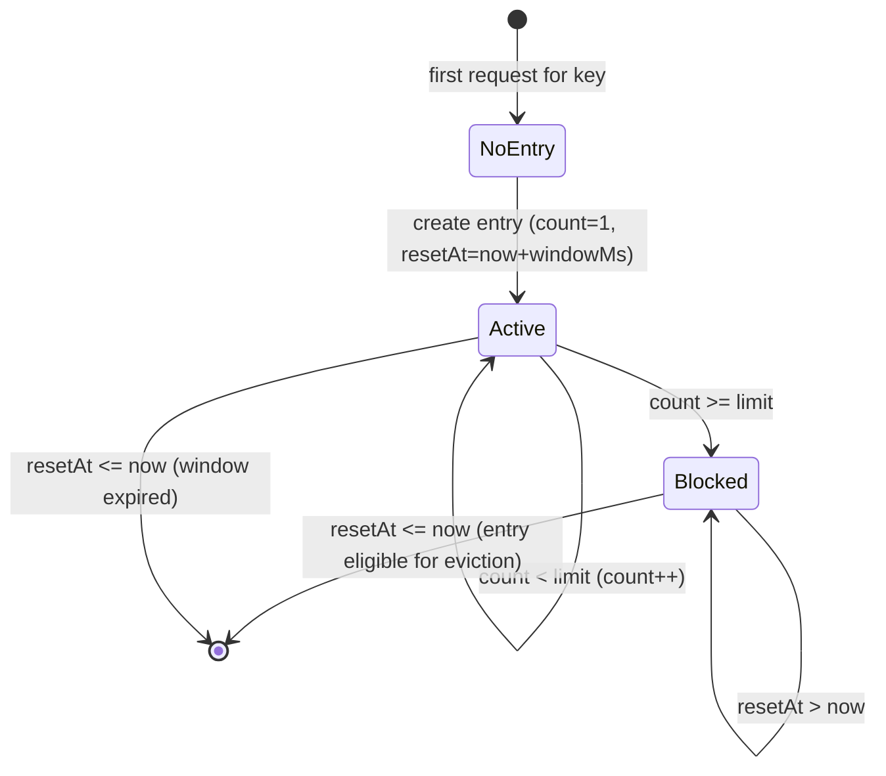
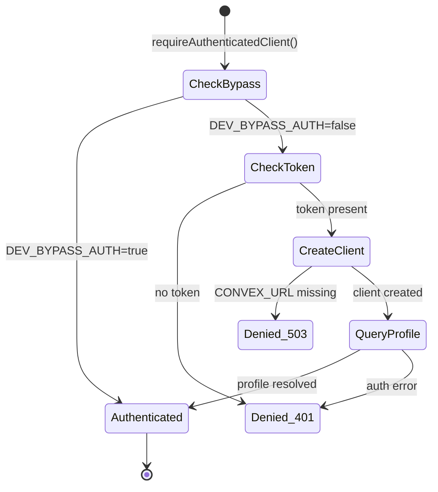
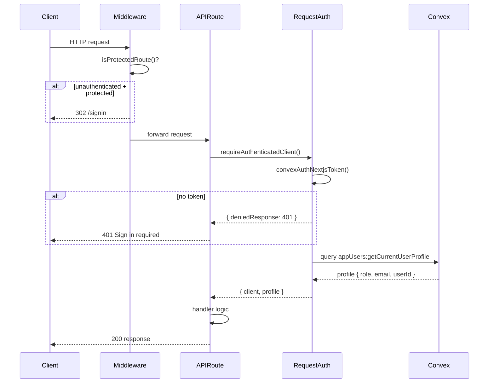
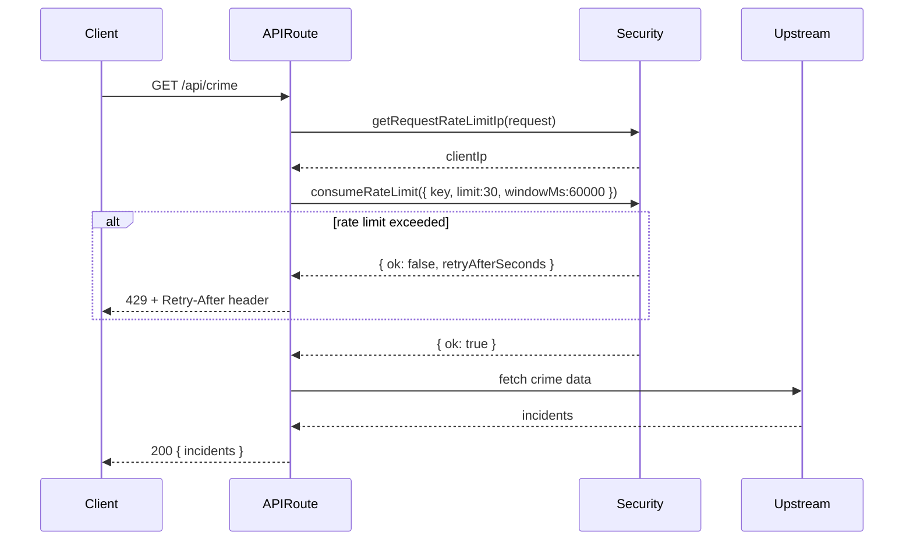
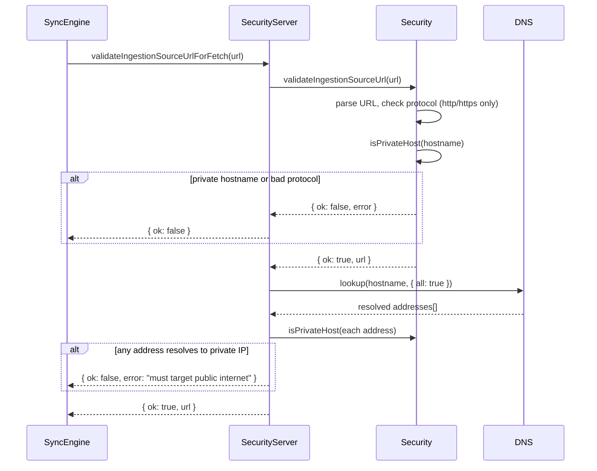

# Security Layer: Technical Architecture & Implementation

Document Basis: current code at time of generation.

---

## 1. Summary

The Security Layer is a collection of defense-in-depth mechanisms that protect the Trip Planner application across three execution boundaries:

- **Next.js edge/server** -- HTTP security headers (CSP, HSTS, X-Frame-Options), route-level middleware authentication, and per-IP rate limiting.
- **Next.js API routes** -- Request authentication via Convex tokens, role-based access control (authenticated vs owner), and rate limiting on public-facing endpoints.
- **Convex serverless functions** -- Row-level authorization guards enforcing authenticated and owner roles before any data mutation or query.
- **Client-side rendering** -- HTML escaping for Google Maps info windows, protocol-safe external URL validation, and ingestion source URL SSRF prevention with DNS rebind protection.

### Shipped scope

| Capability | Status |
|---|---|
| Content Security Policy (CSP) | Shipped |
| HSTS, X-Frame-Options, X-Content-Type-Options, Referrer-Policy, Permissions-Policy | Shipped |
| HTML entity escaping (XSS prevention in info windows) | Shipped |
| External URL protocol validation (`getSafeExternalHref`) | Shipped |
| Ingestion source SSRF prevention (hostname + DNS resolution) | Shipped |
| In-process fixed-window rate limiting | Shipped |
| Client IP extraction with trusted-header hierarchy | Shipped |
| Next.js middleware route protection | Shipped |
| API route authentication (`requireAuthenticatedClient` / `requireOwnerClient`) | Shipped |
| Convex function authorization (`requireAuthenticatedUserId` / `requireOwnerUserId`) | Shipped |
| Magic-link passwordless auth via Resend | Shipped |

### Out of scope

- CSRF token validation (relies on SameSite cookies + CSP `frame-ancestors 'none'`).
- Distributed rate limiting (current implementation is in-process only; does not share state across serverless instances).
- Content-based input sanitization (no DOMPurify or equivalent; relies on `escapeHtml` for manually-built HTML strings).

---

## 2. Runtime Placement & Ownership

```
Browser
  |
  +-- Components (EventsItinerary, SpotsItinerary, TripProvider)
  |     use: getSafeExternalHref(), escapeHtml()
  |
  +-- Next.js Edge Middleware (middleware.ts)
  |     enforces: route-level auth redirects
  |
  +-- Next.js Server (next.config.mjs)
  |     enforces: HTTP security headers on all responses
  |
  +-- API Routes (app/api/*)
  |     use: requireAuthenticatedClient(), requireOwnerClient(),
  |          runWithAuthenticatedClient(), runWithOwnerClient(),
  |          consumeRateLimit(), getRequestRateLimitIp()
  |
  +-- Convex Functions (convex/*.ts)
        use: requireAuthenticatedUserId(), requireOwnerUserId()
        use: assertPublicSourceUrl() (server-side SSRF guard)
```

The security layer has no single entry point. It is composed of cooperating guards distributed across the stack. Each guard is independently testable and fails closed (denies access on error).

---

## 3. Module/File Map

| File | Responsibility | Key Exports | Dependencies | Side Effects |
|---|---|---|---|---|
| `lib/security.ts` | URL validation, SSRF hostname checks, rate limiting, IP extraction | `isPrivateHost`, `getSafeExternalHref`, `validateIngestionSourceUrl`, `consumeRateLimit`, `getRequestRateLimitIp` | None (zero imports) | Module-level `Map` for rate limit state |
| `lib/security-server.ts` | DNS-resolution SSRF guard for ingestion URLs | `validateIngestionSourceUrlForFetch` | `node:dns/promises`, `lib/security.ts` | DNS lookups |
| `lib/helpers.ts` | HTML entity escaping | `escapeHtml` | None | None |
| `lib/request-auth.ts` | API route authentication, token+profile resolution | `requireAuthenticatedClient`, `requireOwnerClient` | `@convex-dev/auth/nextjs/server`, `convex/browser` | Convex HTTP client creation |
| `lib/api-guards.ts` | Higher-order auth wrappers for API handlers | `runWithAuthenticatedClient`, `runWithOwnerClient` | `lib/request-auth.ts`, `lib/convex-client-context.ts` | None |
| `convex/authz.ts` | Convex function authorization guards | `requireAuthenticatedUserId`, `requireOwnerUserId` | `@convex-dev/auth/server` | None |
| `convex/auth.ts` | Auth provider configuration (Resend magic links) | `auth`, `signIn`, `signOut`, `store`, `isAuthenticated` | `@convex-dev/auth` | Sends emails via Resend API |
| `convex/auth.config.ts` | Convex auth JWT config | default export | None | None |
| `middleware.ts` | Edge middleware for route protection | default export | `@convex-dev/auth/nextjs/server` | Redirects unauthenticated users |
| `next.config.mjs` | HTTP security headers | `createSecurityHeaders`, default config | None | Sets headers on all responses |
| `convex/sources.ts` | Convex-side SSRF guard for source URLs | `assertPublicSourceUrl` (internal) | `convex/authz.ts` | None |
| `lib/map-helpers.ts` | Safe HTML rendering for map UI | `buildInfoWindowAddButton`, `renderLucideIconNode` | `lib/helpers.ts` (`escapeHtml`) | None |

---

## 4. State Model & Transitions

### 4.1 Rate Limiter State

The rate limiter uses a module-level `Map<string, { count, resetAt }>` implementing a fixed-window algorithm.



**Constants** (`lib/security.ts:1-2`):
- `MAX_RATE_LIMIT_KEYS`: `10_000` -- eviction threshold for the in-memory map.
- Eviction strategy: when map exceeds `MAX_RATE_LIMIT_KEYS`, expired entries are removed lazily until the map is at or below the threshold.

**Per-endpoint rate limits:**

| Endpoint | Key Pattern | Limit | Window | Citation |
|---|---|---|---|---|
| `POST /api/route` | `api:route:{ip}` | 40 req | 60s | `app/api/route/route.ts:18-22` |
| `GET /api/crime` | `api:crime:{ip}` | 30 req | 60s | `app/api/crime/route.ts:95-98` |
| `POST /api/geocode` | `api:geocode:{ip}` | 25 req | 60s | `app/api/geocode/route.ts:9-12` |

### 4.2 Authentication State (API Routes)



### 4.3 Authorization Roles

Two roles exist in `userProfiles` (`convex/schema.ts:112-113`):
- `owner` -- full read/write access to all resources.
- `member` -- read access and personal planner writes.

---

## 5. Interaction & Event Flow

### 5.1 API Request Authentication Sequence



### 5.2 Rate-Limited Public Endpoint Flow



### 5.3 Ingestion Source URL Validation Flow (SSRF Prevention)



---

## 6. Rendering/Layers/Motion

This feature has no visual rendering or animation. Security functions operate at the data and transport layers.

The only rendering-adjacent aspect is **HTML escaping** for Google Maps info windows, which are built as raw HTML strings injected into `google.maps.InfoWindow.setContent()`. All user-sourced text passes through `escapeHtml()` before interpolation.

### HTML Escaping Usage Sites

| Location | What is escaped | Citation |
|---|---|---|
| `TripProvider.tsx:1046-1080` | Event name, time, location, travel, description, source label, crime types, safety highlights, curator comments, place descriptions | `components/providers/TripProvider.tsx:1046-1080` |
| `TripProvider.tsx:1191` | Map label place name and detail text | `components/providers/TripProvider.tsx:1191` |
| `map-helpers.ts:13` | SVG icon attributes | `lib/map-helpers.ts:13` |
| `map-helpers.ts:189-191` | Planner action button id and label | `lib/map-helpers.ts:189-191` |

### URL Sanitization in UI

| Component | Field | Citation |
|---|---|---|
| `EventsItinerary.tsx` | `event.eventUrl` | `components/EventsItinerary.tsx:91` |
| `SpotsItinerary.tsx` | `place.mapLink`, `place.cornerLink` | `components/SpotsItinerary.tsx:88-89` |
| `TripProvider.tsx` | `event.eventUrl`, `place.mapLink`, `place.cornerLink` | `components/providers/TripProvider.tsx:1045,1075-1076` |

---

## 7. API & Prop Contracts

### 7.1 `escapeHtml(value: string): string`

**File:** `lib/helpers.ts:168-175`

Replaces five HTML-significant characters with their entity equivalents. Operates on the full string (not regex-based character classes).

```typescript
// lib/helpers.ts:168-175
export function escapeHtml(value) {
  return String(value)
    .replaceAll('&', '&amp;')
    .replaceAll('<', '&lt;')
    .replaceAll('>', '&gt;')
    .replaceAll('"', '&quot;')
    .replaceAll("'", '&#39;');
}
```

### 7.2 `getSafeExternalHref(value: unknown): string`

**File:** `lib/security.ts:133-148`

Returns a sanitized URL string. Returns `''` for non-http(s) protocols (blocks `javascript:`, `data:`, `vbscript:`, etc.). Returns `''` for empty/null input.

```typescript
// lib/security.ts:133-148
export function getSafeExternalHref(value: unknown) {
  const text = String(value || '').trim();
  if (!text) return '';
  try {
    const parsed = new URL(text);
    if (parsed.protocol !== 'https:' && parsed.protocol !== 'http:') return '';
    return parsed.toString();
  } catch { return ''; }
}
```

### 7.3 `validateIngestionSourceUrl(value: unknown): { ok: boolean; url: string; error: string }`

**File:** `lib/security.ts:150-190`

Validates a URL for use as an ingestion source. Rejects non-http(s) protocols and hostnames that resolve to private/reserved IP ranges. This is the **static** (hostname-only) check.

### 7.4 `validateIngestionSourceUrlForFetch(value: unknown, deps?): Promise<{ ok, url, error }>`

**File:** `lib/security-server.ts:13-52`

Extends `validateIngestionSourceUrl` with **DNS resolution**. After passing the static check, performs `dns.lookup()` and verifies all resolved addresses are public. This prevents DNS rebinding attacks where a public hostname resolves to a private IP.

The `deps` parameter allows injecting a mock DNS resolver for testing (`lib/security.test.mjs:54-63`).

### 7.5 `isPrivateHost(hostname: string): boolean`

**File:** `lib/security.ts:121-131`

Returns `true` if the hostname represents a private, reserved, or local address. Covers:

| Range | Description | Citation |
|---|---|---|
| `localhost`, `*.localhost`, `*.local`, `*.internal` | Local hostnames | `lib/security.ts:111-119` |
| `0.0.0.0/8` | Current network | `lib/security.ts:66-68` |
| `10.0.0.0/8` | Private class A | `lib/security.ts:69-71` |
| `100.64.0.0/10` | CGNAT | `lib/security.ts:72-74` |
| `127.0.0.0/8` | Loopback | `lib/security.ts:75-77` |
| `169.254.0.0/16` | Link-local | `lib/security.ts:78-80` |
| `172.16.0.0/12` | Private class B | `lib/security.ts:81-83` |
| `192.168.0.0/16` | Private class C | `lib/security.ts:84-86` |
| `224.0.0.0/4+` | Multicast and reserved | `lib/security.ts:87-89` |
| `::1`, `::` | IPv6 loopback/unspecified | `lib/security.ts:94-97` |
| `fc00::/7` | IPv6 unique local | `lib/security.ts:102-104` |
| `fe80::/10` | IPv6 link-local | `lib/security.ts:105-107` |
| `::ffff:x.x.x.x` | IPv4-mapped IPv6 (delegates to IPv4 check) | `lib/security.ts:98-101` |
| `::ffff:HHHH:HHHH` | IPv4-mapped IPv6 hex form | `lib/security.ts:32-57` |

### 7.6 `consumeRateLimit(input: RateLimitInput): { ok: boolean; retryAfterSeconds: number }`

**File:** `lib/security.ts:199-247`

Fixed-window rate limiter. Input contract:

```typescript
type RateLimitInput = {
  key: string;       // unique identifier (e.g., "api:route:198.51.100.1")
  limit: number;     // max requests per window (floor'd, min 1)
  windowMs: number;  // window duration in ms (floor'd, min 1)
  nowMs?: number;    // injectable clock for testing (default: Date.now())
};
```

Behavior:
- Empty key always returns `{ ok: false }`.
- On first request for a key, creates entry with `count=1`, allows.
- Increments count on subsequent requests within window.
- Returns `{ ok: false, retryAfterSeconds }` when count exceeds limit.
- Evicts expired entries when map exceeds 10,000 keys.

### 7.7 `getRequestRateLimitIp(request: Request): string`

**File:** `lib/security.ts:249-269`

Extracts client IP from the request using a tiered trust model:

1. **Trusted edge headers** (always checked first, in order): `x-vercel-ip`, `cf-connecting-ip`, `fly-client-ip`, `fastly-client-ip`, `true-client-ip` (`lib/security.ts:3-9`).
2. **Proxy headers** (only if trusted): `x-forwarded-for` (first entry), `x-real-ip`.
3. Fallback: `"unknown"`.

Proxy headers are trusted only when `shouldTrustProxyHeaders()` returns `true` (`lib/security.ts:271-282`):
- `TRUST_PROXY_IP_HEADERS=true` (env var), OR
- `VERCEL=1`, OR `CF_PAGES=1`, OR `NETLIFY=true`.

IP normalization (`normalizeIpCandidate`, `lib/security.ts:284-312`):
- Strips `for=` prefix, quotes, brackets, port suffixes, and IPv6 zone IDs.
- Validates the result is a well-formed IPv4 or IPv6 address.

### 7.8 `requireAuthenticatedClient(): Promise<AuthResult>`

**File:** `lib/request-auth.ts:39-101`

Returns `{ client, deniedResponse, profile }`. If authentication fails, `deniedResponse` is a `Response` object (401 or 503) and `client` is null. Used by API route handlers to gate access.

### 7.9 `requireOwnerClient(): Promise<AuthResult>`

**File:** `lib/request-auth.ts:103-128`

Extends `requireAuthenticatedClient` with a role check. Returns 403 if `profile.role !== 'owner'`.

### 7.10 `requireAuthenticatedUserId(ctx, deps?): Promise<string>`

**File:** `convex/authz.ts:15-25`

Convex-side guard. Throws `"Authentication required."` if no user is signed in. Returns the user ID string.

### 7.11 `requireOwnerUserId(ctx, deps?): Promise<string>`

**File:** `convex/authz.ts:27-42`

Convex-side guard. After authenticating, queries `userProfiles` by `by_user_id` index and throws `"Owner role required."` if the profile does not have `role: 'owner'`.

### 7.12 `createSecurityHeaders(opts?): HeaderEntry[]`

**File:** `next.config.mjs:1-33`

Returns an array of HTTP security header objects. Accepts `{ isDevelopment }` to conditionally include `'unsafe-eval'` in the CSP `script-src` directive (needed for Next.js hot reload in dev).

### 7.13 API Guard Wrappers

**File:** `lib/api-guards.ts:1-49`

`runWithAuthenticatedClient(handler, deps?)` and `runWithOwnerClient(handler, deps?)` wrap the auth check and Convex client context in a single call. If auth fails, the denied response is returned directly without invoking the handler.

---

## 8. Reliability Invariants

These are deterministic truths that must remain true after any refactor:

1. **`escapeHtml` covers all five HTML metacharacters** -- `&`, `<`, `>`, `"`, `'`. Removal of any one creates an XSS vector in info windows.

2. **`getSafeExternalHref` blocks all non-http(s) protocols** -- Including `javascript:`, `data:`, `vbscript:`, and any future scheme. The check is a strict allowlist (`https:` or `http:`), not a denylist.

3. **`isPrivateHost` treats empty/missing hostnames as private** -- `lib/security.ts:123-125`: empty string returns `true` (fail-closed).

4. **Rate limiter fails closed on empty key** -- `lib/security.ts:204-208`: empty or falsy key always returns `{ ok: false }`.

5. **DNS resolution check runs after static hostname check** -- `lib/security-server.ts:14-17`: if static validation fails, DNS is never performed.

6. **Owner role check always calls authenticated check first** -- Both `requireOwnerClient` (`lib/request-auth.ts:108`) and `requireOwnerUserId` (`convex/authz.ts:31`) delegate to their authenticated counterparts before checking role.

7. **CSP `script-src` never includes `'unsafe-eval'` in production** -- `next.config.mjs:4-5`: the `isDevelopment` flag defaults to `process.env.NODE_ENV === 'development'`, and `'unsafe-eval'` is only spread when true.

8. **CSP `frame-ancestors` is `'none'`** -- Prevents the app from being embedded in iframes (clickjacking protection). `next.config.mjs:18`.

9. **Convex authz guards throw on failure** -- They do not return null; they throw `Error`, causing the Convex function to abort with an error response.

10. **API route auth guards return HTTP responses on failure** -- They do not throw; they return `Response` objects, enabling the handler pattern `if (auth.deniedResponse) return auth.deniedResponse`.

---

## 9. Edge Cases & Pitfalls

### 9.1 In-Process Rate Limiting

The rate limiter state lives in a module-level `Map` (`lib/security.ts:1`). In serverless environments (Vercel, etc.), each cold start creates a fresh map. This means:
- Rate limits are not shared across instances.
- A burst of requests routed to different instances will bypass limits.
- The `MAX_RATE_LIMIT_KEYS` eviction only protects against memory growth within a single process.

### 9.2 DEV_BYPASS_AUTH

Three files contain a `DEV_BYPASS_AUTH = true` constant:
- `lib/request-auth.ts:5`
- `convex/authz.ts:5`
- `middleware.ts:18`

When `true`, all authentication is bypassed. The bypass is controlled by a hardcoded constant (not an env var), meaning it must be toggled by code change before deployment. Accidentally shipping `true` to production would disable all auth.

### 9.3 IPv4-Mapped IPv6 Dual Handling

`isPrivateHost` handles two forms of IPv4-mapped IPv6:
- Dotted: `::ffff:127.0.0.1`
- Hex: `::ffff:7f00:1`

Both are tested (`lib/security.test.mjs:36-37`). However, the IPv6 validation regex (`lib/security.ts:337`) is permissive (`/^[0-9a-f:.]+$/i`); it validates character set but not structure. This is intentional for simplicity but means malformed IPv6 strings could pass `isValidIp` -- however, `isPrivateHost` would still need to match a known private range.

### 9.4 CSP `unsafe-inline` for Scripts

The CSP allows `'unsafe-inline'` for scripts (`next.config.mjs:4`). This is a trade-off: Next.js injects inline scripts for hydration. Without nonce-based CSP (not implemented), `'unsafe-inline'` is required. This weakens XSS protection from CSP; the app relies on `escapeHtml` and `getSafeExternalHref` as primary XSS defenses.

### 9.5 SQL Injection in Crime API

The crime API route constructs SODA (Socrata) query strings using `sqlStringLiteral()` (`app/api/crime/route.ts:35-37`). This function escapes single quotes by doubling them (`'` -> `''`). While this is correct for the SODA SQL dialect, the query parameters (`hours`, `limit`, bounds) are validated via `clampInteger` / `clampFloat` before being used, so they are never interpolated as strings.

### 9.6 Convex Source URL Validation Duplication

There are two copies of private-host detection:
- `lib/security.ts:121` (`isPrivateHost`) -- comprehensive, handles IPv4-mapped IPv6 and CGNAT.
- `convex/sources.ts:67` (`isPrivateHost`) -- simpler, missing CGNAT (`100.64.0.0/10`), `0.0.0.0/8`, IPv4-mapped IPv6 hex form, and `::` (unspecified).

The Convex version is a defense-in-depth backup; the primary check runs in the sync engine via `validateIngestionSourceUrlForFetch`. However, if someone adds a source directly through Convex mutations, the Convex version is the only guard, and it has a narrower block list.

---

## 10. Testing & Verification

### 10.1 Test Files

| Test File | Covers | Runner |
|---|---|---|
| `lib/security.test.mjs` | `getSafeExternalHref`, `validateIngestionSourceUrl`, `validateIngestionSourceUrlForFetch`, `consumeRateLimit`, `getRequestRateLimitIp` | Node test runner |
| `lib/layout-security.test.mjs` | Verifies Buy Me a Coffee widget loads through `next/script` with env gating | Node test runner |
| `lib/next-config-security.test.mjs` | Verifies CSP, security headers, and `unsafe-eval` dev-only behavior | Node test runner |
| `convex/authz.test.mjs` | `requireAuthenticatedUserId`, `requireOwnerUserId` | Node test runner |
| `lib/api-guards.test.mjs` | `runWithAuthenticatedClient`, `runWithOwnerClient` short-circuit and pass-through | Node test runner |

### 10.2 Manual Verification Commands

```bash
# Run all security tests
node --test lib/security.test.mjs

# Run CSP header tests
node --test lib/next-config-security.test.mjs

# Run layout script tests
node --test lib/layout-security.test.mjs

# Run Convex authz tests
node --test convex/authz.test.mjs

# Run API guard tests
node --test lib/api-guards.test.mjs
```

### 10.3 Manual Verification Scenarios

| Scenario | Steps | Expected |
|---|---|---|
| XSS in info window | Add an event with name `` | Name renders as escaped text, no script execution |
| javascript: URL in event link | Set `eventUrl` to `javascript:alert(1)` | Link does not render (returns empty string) |
| SSRF via source URL | Add source URL `https://localhost/feed.ics` | Rejected with "must target public internet" |
| SSRF via DNS rebind | Add source URL whose DNS resolves to 127.0.0.1 | Rejected at fetch-time validation |
| Rate limit on crime API | Send 31 requests to `/api/crime` within 60s | 31st request returns 429 |
| Unauthenticated API access | Call `/api/planner` without auth token | 401 response |
| Non-owner source creation | Authenticated member tries `POST /api/sources` | 403 "Owner role required" |

---

## 11. Quick Change Playbook

| If you want to... | Edit... |
|---|---|
| Change rate limit for an endpoint | The `consumeRateLimit()` call in the specific route file (e.g., `app/api/route/route.ts:18-22`) |
| Add a new rate-limited endpoint | Import `consumeRateLimit` and `getRequestRateLimitIp` from `@/lib/security`, add the check at handler top |
| Block a new private IP range | Add a check in `isPrivateIpv4()` (`lib/security.ts:59-91`) or `isPrivateIpv6()` (`lib/security.ts:93-109`) |
| Add a trusted edge IP header | Append to `TRUSTED_CLIENT_IP_HEADERS` array (`lib/security.ts:3-9`) |
| Allow a new external script in CSP | Add the domain to `scriptSources` in `createSecurityHeaders()` (`next.config.mjs:2-9`) |
| Protect a new route with auth | Add the route pattern to `isProtectedRoute` in `middleware.ts:8-15` |
| Add auth to an API route | Use `runWithAuthenticatedClient()` from `lib/api-guards.ts` as the handler wrapper |
| Add owner-only access to an API route | Use `runWithOwnerClient()` from `lib/api-guards.ts` |
| Add auth to a Convex function | Call `await requireAuthenticatedUserId(ctx)` at handler top |
| Add owner-only access to a Convex function | Call `await requireOwnerUserId(ctx)` at handler top |
| Disable dev auth bypass for production | Set `DEV_BYPASS_AUTH = false` in `lib/request-auth.ts:5`, `convex/authz.ts:5`, and `middleware.ts:18` |
| Add HTML escaping in new info window code | Import `escapeHtml` from `@/lib/helpers` and wrap all user-sourced text |
| Add safe external link rendering | Import `getSafeExternalHref` from `@/lib/security` and use as href value |
| Switch to distributed rate limiting | Replace the module-level `Map` in `lib/security.ts:1` with a Redis/Upstash client; keep the `consumeRateLimit` function signature the same |
| Align Convex-side SSRF guard with lib version | Replace `convex/sources.ts:67-94` with a call to or port of `lib/security.ts:isPrivateHost` (add CGNAT, `0.0.0.0/8`, IPv4-mapped IPv6 hex) |

---

## Appendix: Authentication Architecture Summary

```
Authentication Provider: Resend passwordless magic links
  Config: convex/auth.ts (provider setup, email template)
  Token TTL: 1 hour (convex/auth.ts:78)
  JWT Config: convex/auth.config.ts

Middleware Layer:
  middleware.ts -> convexAuthNextjsMiddleware
  Protected routes: /dashboard(.*), /trips(.*)
  Public routes: /, /landing, /signin

API Route Layer:
  lib/request-auth.ts -> requireAuthenticatedClient() / requireOwnerClient()
  lib/api-guards.ts -> runWithAuthenticatedClient() / runWithOwnerClient()

Convex Function Layer:
  convex/authz.ts -> requireAuthenticatedUserId() / requireOwnerUserId()
  Role store: userProfiles table, indexed by userId

Role Model:
  owner  -> full CRUD on all resources (sources, sync, config, cities)
  member -> read access, personal planner writes, trip management
```

### Route-to-Guard Mapping

| API Route | Guard Level | Citation |
|---|---|---|
| `GET /api/config` | authenticated | `app/api/config/route.ts:8` |
| `POST /api/config` | owner | `app/api/config/route.ts:30` |
| `GET /api/sources` | owner | `app/api/sources/route.ts:7` |
| `POST /api/sources` | owner | `app/api/sources/route.ts:16` |
| `POST /api/sync` | owner | `app/api/sync/route.ts:9` |
| `GET /api/planner` | authenticated | `app/api/planner/route.ts:7` |
| `POST /api/planner` | authenticated | `app/api/planner/route.ts:36` |
| `GET /api/pair` | authenticated | `app/api/pair/route.ts:7` |
| `POST /api/pair` | authenticated | `app/api/pair/route.ts:31` |
| `GET /api/trips` | authenticated | `app/api/trips/route.ts:7` |
| `POST /api/trips` | authenticated | `app/api/trips/route.ts:24` |
| `GET /api/me` | authenticated | `app/api/me/route.ts:6` |
| `GET /api/cities` | authenticated | `app/api/cities/route.ts:6` |
| `POST /api/cities` | owner | `app/api/cities/route.ts:23` |
| `POST /api/route` | authenticated + rate-limited | `app/api/route/route.ts:17-19` |
| `POST /api/geocode` | authenticated + rate-limited | `app/api/geocode/route.ts:8-10` |
| `GET /api/crime` | rate-limited (no auth) | `app/api/crime/route.ts:94-96` |
