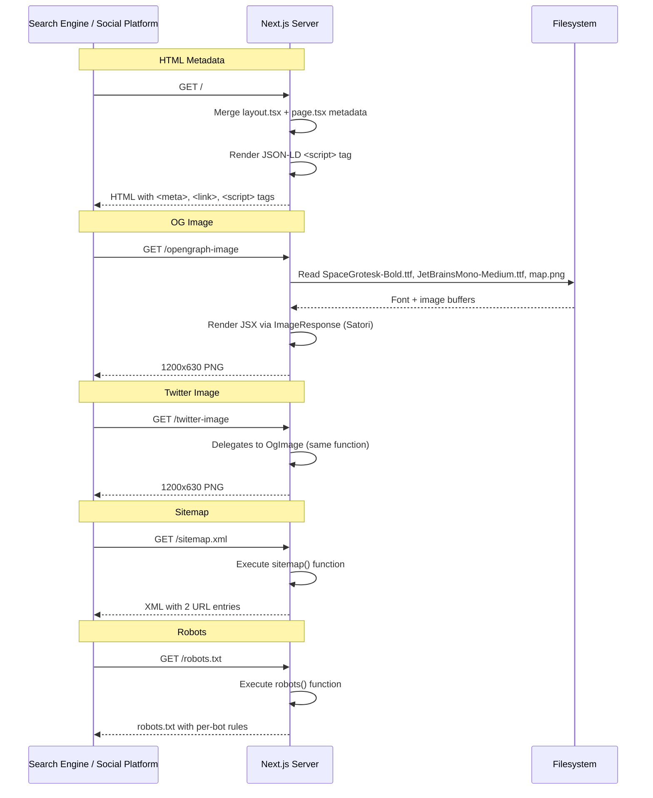

# SEO & Metadata: Technical Architecture & Implementation

Document Basis: current code at time of generation.

---

## 1. Summary

The SEO & Metadata feature provides search engine optimization and social sharing support for Trip Planner through five coordinated subsystems:

| Subsystem | Status | File |
|---|---|---|
| OpenGraph image generation | Shipped | `app/opengraph-image.tsx` |
| Twitter card image generation | Shipped | `app/twitter-image.tsx` |
| JSON-LD structured data | Shipped | `app/page.tsx:12-123` |
| Sitemap generation | Shipped | `app/sitemap.ts` |
| Robots.txt generation | Shipped | `app/robots.ts` |
| Favicon / Apple icon | Shipped | `app/icon.svg`, `app/apple-icon.svg` |
| Per-route metadata exports | Shipped | `app/layout.tsx`, `app/page.tsx`, `app/signin/layout.tsx` |

**Out of scope**: per-city dynamic OG images, per-trip dynamic metadata, search console integration, analytics-driven SEO tuning.

---

## 2. Runtime Placement & Ownership

All SEO artifacts are generated at **build time or request time by Next.js App Router** conventions. There is no client-side SEO logic.

### Metadata Hierarchy

Next.js merges metadata from parent to child layouts. The chain for this project:

```
app/layout.tsx          -- root metadata (title template, OG defaults, Twitter defaults, metadataBase)
  app/page.tsx           -- homepage overrides (title, description, canonical, JSON-LD)
  app/signin/layout.tsx  -- sign-in overrides (title, description, robots: noindex)
  app/trips/layout.tsx  -- no metadata export (inherits root)
```

The `metadataBase` is set in `app/layout.tsx:34`:

```ts
metadataBase: new URL(process.env.NEXT_PUBLIC_BASE_URL || 'https://trip.ianhsiao.me'),
```

This base URL is the single source of truth for resolving all relative metadata URLs (OG images, canonical, alternates). It falls back to `https://trip.ianhsiao.me` when `NEXT_PUBLIC_BASE_URL` is not set.

### Lifecycle Boundaries

- OG and Twitter images are generated on-demand by Next.js when a crawler or social platform requests them (server-side, `runtime = 'nodejs'`).
- `sitemap.xml` and `robots.txt` are generated at request time by the Next.js file-convention handlers.
- JSON-LD is rendered inline as a `<script type="application/ld+json">` tag in the homepage RSC output.
- Favicons (`icon.svg`, `apple-icon.svg`) are static SVG files served by Next.js file convention.

---

## 3. Module/File Map

| File | Responsibility | Exports | Dependencies | Side Effects |
|---|---|---|---|---|
| `app/layout.tsx` | Root metadata object: title template, OG defaults, Twitter card config, `metadataBase` | `metadata` (named), `RootLayout` (default) | `next/font/google`, `@vercel/analytics` | Sets `lang="en"` on `<html>`, loads Google Fonts |
| `app/page.tsx` | Homepage metadata overrides + JSON-LD structured data injection | `metadata` (named), `HomePage` (default) | `./landing/LandingContent` | Injects `<script type="application/ld+json">` |
| `app/opengraph-image.tsx` | Generates 1200x630 PNG OpenGraph image with brand visuals | `runtime`, `alt`, `size`, `contentType`, `OgImage` (default) | `next/og`, `node:fs/promises`, `node:path` | Reads font files and map screenshot from disk at render time |
| `app/twitter-image.tsx` | Re-exports OG image for Twitter card | `runtime`, `alt`, `size`, `contentType`, default (re-export of `OgImage`) | `./opengraph-image` | None |
| `app/sitemap.ts` | Generates `/sitemap.xml` with public page entries | `sitemap` (default) | `next` (types only) | None |
| `app/robots.ts` | Generates `/robots.txt` with per-bot crawl rules | `robots` (default) | `next` (types only) | None |
| `app/signin/layout.tsx` | Sign-in route metadata: noindex directive | `metadata` (named), `SignInLayout` (default) | None | None |
| `app/icon.svg` | 32x32 favicon (SVG, map pin on dark bg) | Static file | None | None |
| `app/apple-icon.svg` | 180x180 Apple touch icon (SVG, map pin on dark bg) | Static file | None | None |
| `next.config.mjs` | Security headers including CSP, HSTS, X-Frame-Options | `nextConfig` (default), `createSecurityHeaders` (named) | None | Applies headers to all routes |

---

## 4. State Model & Transitions

The SEO feature is stateless. All outputs are deterministic functions of source code constants and environment variables. There is no state machine.

### Environment Variable Surface

| Variable | Used In | Default | Purpose |
|---|---|---|---|
| `NEXT_PUBLIC_BASE_URL` | `app/layout.tsx:34`, `app/robots.ts:51` | `https://trip.ianhsiao.me` | Base URL for metadata resolution and sitemap link |

---

## 5. Interaction & Event Flow

The SEO subsystem has no user interaction. It responds to crawler and platform requests.



---

## 6. Rendering/Layers/Motion

### OpenGraph Image Layout

The OG image (`app/opengraph-image.tsx`) renders a two-column layout at 1200x630px:

| Region | Content | Style Constants |
|---|---|---|
| Background | Full bleed | `backgroundColor: '#0C0C0C'`, padding `48px`, gap `48px` |
| Left column | Brand text stack | Flex column, centered vertically |
| Green accent bar | Decorative | `48px x 4px`, `#00FF88` |
| Title | "Trip Planner" | Space Grotesk Bold 52px, `#FFFFFF`, letterSpacing `-1px`, lineHeight `1.1` |
| Author line | "by Ian Hsiao" | JetBrains Mono Medium 18px, `#8a8a8a`, letterSpacing `0.5px` |
| URL line | "trip.ianhsiao.me" | JetBrains Mono Medium 16px, `#00FF88`, letterSpacing `0.5px` |
| Tagline | "// EVENTS . SPOTS . SAFETY . ONE MAP" | JetBrains Mono Medium 14px, `#6a6a6a`, uppercase, letterSpacing `1px` |
| Right column | Map screenshot | `534px x 534px`, border `1px solid #2f2f2f`, `objectFit: 'cover'` |

### Font Loading for Image Generation

Fonts are loaded from disk at render time, not from Google Fonts CDN (`app/opengraph-image.tsx:11-16`):

```ts
const fontsDir = join(process.cwd(), 'public', 'fonts');
const [spaceGroteskBold, jetbrainsMono, mapBuffer] = await Promise.all([
  readFile(join(fontsDir, 'SpaceGrotesk-Bold.ttf')),
  readFile(join(fontsDir, 'JetBrainsMono-Medium.ttf')),
  readFile(join(process.cwd(), 'public', 'screenshots', 'map.png')),
]);
```

Required filesystem assets:
- `public/fonts/SpaceGrotesk-Bold.ttf`
- `public/fonts/JetBrainsMono-Medium.ttf`
- `public/screenshots/map.png`

### Favicon Design

Both `icon.svg` (32x32) and `apple-icon.svg` (180x180) use the same design: a rounded dark rectangle (`#0C0C0C`) with a map pin path (`#00FF88`) and a dark circle cutout at the pin center.

---

## 7. API & Prop Contracts

### Root Metadata Object (`app/layout.tsx:27-51`)

```ts
export const metadata = {
  title: {
    default: 'Trip Planner',
    template: '%s | Trip Planner',       // child pages use this template
  },
  description: 'Plan your trip with events, curated spots, and live crime heatmaps on one map. Free and open source.',
  metadataBase: new URL(process.env.NEXT_PUBLIC_BASE_URL || 'https://trip.ianhsiao.me'),
  alternates: { canonical: '/' },
  openGraph: {
    title: 'Trip Planner',
    description: 'Events, spots, and safety on one map. Plan your trip free.',
    siteName: 'Trip Planner',
    type: 'website',
    locale: 'en_US',
  },
  twitter: {
    card: 'summary_large_image',
    title: 'Trip Planner',
    description: 'Events, spots, and safety on one map. Plan your trip free.',
    creator: '@ianhsiao',
  },
};
```

### Homepage Metadata Override (`app/page.tsx:3-10`)

```ts
export const metadata = {
  title: 'Trip Planner — Turn 50 Open Tabs Into One Trip Plan',
  description: "See where events are, when they conflict, where it's safe, ...",
  alternates: { canonical: 'https://trip.ianhsiao.me' },
};
```

The homepage `title` is a full override (not using the `%s | Trip Planner` template) because it sets a complete string rather than a segment.

### Sign-In Metadata Override (`app/signin/layout.tsx:3-11`)

```ts
export const metadata = {
  title: 'Sign In',                    // renders as "Sign In | Trip Planner" via template
  description: 'Sign in to Trip Planner to start planning ...',
  robots: { index: false, follow: true },  // noindex, follow
};
```

### OG Image Exports (`app/opengraph-image.tsx:5-8`)

```ts
export const runtime = 'nodejs';
export const alt = 'Trip Planner — See events, spots, and safety on one map';
export const size = { width: 1200, height: 630 };
export const contentType = 'image/png';
```

### Twitter Image Exports (`app/twitter-image.tsx:3-7`)

Identical dimensions and alt text. The default export is a direct re-export of `OgImage` from `./opengraph-image`, meaning both platforms receive the same generated image.

### Sitemap Entries (`app/sitemap.ts:4-17`)

| URL | lastModified | changeFrequency | priority |
|---|---|---|---|
| `https://trip.ianhsiao.me` | `new Date()` (build/request time) | `weekly` | `1` |
| `https://trip.ianhsiao.me/signin` | `new Date()` (build/request time) | `monthly` | `0.5` |

Note: The sitemap hardcodes `https://trip.ianhsiao.me` rather than using `NEXT_PUBLIC_BASE_URL`. This is a potential inconsistency with `metadataBase` and `robots.ts`, which both use the env var.

### Robots.txt Rules (`app/robots.ts:4-52`)

**Protected paths** (disallowed for all bots):

```ts
const protectedPaths = ['/api/', '/app/', '/planning', '/map', '/calendar', '/spots', '/config'];
```

**Bot rules** (7 explicit user-agent entries, all with the same allow/disallow):

| User-Agent | Allow | Disallow |
|---|---|---|
| `*` | `/` | protectedPaths |
| `GPTBot` | `/` | protectedPaths |
| `ChatGPT-User` | `/` | protectedPaths |
| `PerplexityBot` | `/` | protectedPaths |
| `ClaudeBot` | `/` | protectedPaths |
| `anthropic-ai` | `/` | protectedPaths |
| `Googlebot` | `/` | protectedPaths |
| `Bingbot` | `/` | protectedPaths |

The explicit AI bot entries (GPTBot, ChatGPT-User, PerplexityBot, ClaudeBot, anthropic-ai) are listed with `allow: '/'` to ensure they can index public pages for GEO (Generative Engine Optimization), as noted in the code comment at `app/robots.ts:14`.

### JSON-LD Structured Data (`app/page.tsx:12-123`)

The JSON-LD uses a `@graph` array containing four schema.org types:

| Schema Type | Key Properties |
|---|---|
| `WebApplication` | `name`, `url`, `description`, `applicationCategory: 'TravelApplication'`, `operatingSystem: 'Web'`, `offers` (free), `author` (Ian Hsiao), `featureList` (8 items), `screenshot` |
| `WebSite` | `name: 'Trip Planner'`, `url` |
| `WebPage` | `name`, `url`, `description`, `speakable` (CSS selectors: `h1`, `.hero-description`, `.faq-answer`) |
| `FAQPage` | 7 Q&A pairs covering: what is Trip Planner, crime heatmap, planning with friends, calendar export, pricing, sponsorship, neighborhood safety |

---

## 8. Reliability Invariants

These must remain true after any refactor:

1. **`metadataBase` must resolve to a valid URL.** If `NEXT_PUBLIC_BASE_URL` is unset, the fallback `https://trip.ianhsiao.me` is used. If set to an invalid URL, `new URL()` will throw at import time (`app/layout.tsx:34`).

2. **OG image generation requires three filesystem assets.** Missing any of `public/fonts/SpaceGrotesk-Bold.ttf`, `public/fonts/JetBrainsMono-Medium.ttf`, or `public/screenshots/map.png` will cause the OG image endpoint to throw at request time (`app/opengraph-image.tsx:12-16`).

3. **Twitter image is always identical to OG image.** `app/twitter-image.tsx` re-exports the OG image function directly. Any change to OG image rendering automatically applies to Twitter cards.

4. **Sign-in page is noindexed.** `app/signin/layout.tsx:8` sets `robots: { index: false, follow: true }`. Removing this would expose the sign-in page to search indexing.

5. **Protected routes are blocked from crawling.** The `protectedPaths` array in `robots.ts:4` blocks `/api/`, `/app/`, `/planning`, `/map`, `/calendar`, `/spots`, `/config` from all bots.

6. **The `%s | Trip Planner` title template** in `app/layout.tsx:30` applies to any child route that exports a string `title` in its metadata. The homepage bypasses this by providing a full title string that does not trigger template interpolation.

7. **JSON-LD is only present on the homepage.** No other route injects structured data. The `<script type="application/ld+json">` tag is rendered inside `HomePage` (`app/page.tsx:128-131`).

---

## 9. Edge Cases & Pitfalls

### Sitemap URL Hardcoding

The sitemap (`app/sitemap.ts`) hardcodes `https://trip.ianhsiao.me` for both URL entries instead of reading from `NEXT_PUBLIC_BASE_URL`. This means:
- If deployed to a different domain, the sitemap will still point to the production domain.
- The `robots.ts` file correctly uses the env var for the sitemap URL (`app/robots.ts:51`), creating a mismatch if the base URL differs.

### OG Image Font Loading Path

The OG image reads fonts using `process.cwd()` (`app/opengraph-image.tsx:11`). In serverless environments (e.g., Vercel), `process.cwd()` resolves to the deployment root where `public/` is accessible. If the deployment structure changes or fonts are moved, the image generation will fail silently (500 error to crawlers).

### OG Image Map Screenshot Freshness

The map screenshot (`public/screenshots/map.png`) is a static file checked into the repository. It does not auto-update when the map UI changes. The OG image will show stale visuals until the screenshot is manually replaced.

### Missing Dashboard in Sitemap

The `/dashboard` route is not listed in the sitemap, which is correct (it requires authentication). However, if public routes are added in the future (e.g., `/cities/*`), the sitemap must be updated manually since it uses a static array.

### Speakable CSS Selectors

The `WebPage` schema declares `speakable` CSS selectors (`h1`, `.hero-description`, `.faq-answer`) at `app/page.tsx:57-59`. The `.hero-description` and `.faq-answer` class names are not present in the current `LandingContent.tsx` markup. This means Google's speakable feature will not match those selectors. The `h1` selector works correctly.

### No `manifest.json`

There is no `manifest.json` or `app/manifest.ts` file. PWA metadata is not configured.

---

## 10. Testing & Verification

There are no automated tests for the SEO subsystem. The project's test suite (`package.json:13`) covers backend logic, API guards, and provider behavior but does not validate metadata, OG images, or structured data.

### Manual Verification Scenarios

| Scenario | How to Verify |
|---|---|
| OG image renders correctly | `curl -s http://localhost:3000/opengraph-image -o og.png && open og.png` |
| Twitter image matches OG image | `curl -s http://localhost:3000/twitter-image -o tw.png && diff og.png tw.png` |
| Sitemap is valid XML | `curl -s http://localhost:3000/sitemap.xml` and validate against sitemap schema |
| Robots.txt has correct rules | `curl -s http://localhost:3000/robots.txt` and verify protected paths are disallowed |
| JSON-LD is valid | View page source at `/`, extract `<script type="application/ld+json">`, paste into [schema.org validator](https://validator.schema.org/) |
| Title template works | Navigate to `/signin` and check `<title>` is "Sign In \| Trip Planner" |
| Sign-in is noindexed | View page source at `/signin`, check for `<meta name="robots" content="noindex, follow">` |
| Favicon renders | Open browser, check tab icon is green map pin on dark background |
| Social preview | Paste URL into [Facebook Sharing Debugger](https://developers.facebook.com/tools/debug/) or [Twitter Card Validator](https://cards-dev.twitter.com/validator) |

### Recommended Automated Tests (Not Yet Implemented)

- Assert OG image endpoint returns 200 with `content-type: image/png` and correct dimensions.
- Assert sitemap XML contains expected URLs.
- Assert robots.txt disallows all protected paths.
- Assert JSON-LD parses as valid JSON and contains required `@type` entries.
- Assert homepage `<title>` matches expected string.

---

## 11. Quick Change Playbook

| If You Want To... | Edit This |
|---|---|
| Change the site name in OG/Twitter metadata | `app/layout.tsx:39,41` (`openGraph.title`, `openGraph.siteName`) and `app/layout.tsx:46` (`twitter.title`) |
| Change the default page description | `app/layout.tsx:33` (`description`) |
| Change the homepage title | `app/page.tsx:4` (`metadata.title`) |
| Change the OG image appearance | `app/opengraph-image.tsx` -- modify the JSX and inline styles |
| Use a different map screenshot in OG image | Replace `public/screenshots/map.png` with a new file of the same name |
| Add a new page to the sitemap | Add an entry to the array in `app/sitemap.ts:4-17` |
| Block a new path from crawlers | Add the path to `protectedPaths` in `app/robots.ts:4` |
| Allow a new AI bot to crawl | Add a new rule object in `app/robots.ts:7-49` with the bot's user-agent |
| Add a new FAQ to structured data | Add a `Question`/`Answer` object to `jsonLd['@graph'][3].mainEntity` in `app/page.tsx:63-121` |
| Change the production base URL | Set `NEXT_PUBLIC_BASE_URL` env var; also update hardcoded URLs in `app/sitemap.ts` and `app/page.tsx` JSON-LD |
| Add metadata to a new route | Export `const metadata = { ... }` from the route's `page.tsx` or `layout.tsx` (must be a server component) |
| Change the favicon | Replace `app/icon.svg` (32x32) and/or `app/apple-icon.svg` (180x180) |
| Add per-route OG images | Create `opengraph-image.tsx` in the route segment directory (e.g., `app/signin/opengraph-image.tsx`) |
| Fix speakable selectors | Update CSS selectors in `app/page.tsx:58` to match actual class names in `LandingContent.tsx`, or add the classes `.hero-description` and `.faq-answer` to the landing page markup |
| Make sitemap use env var | Replace hardcoded `https://trip.ianhsiao.me` in `app/sitemap.ts` with `` `${process.env.NEXT_PUBLIC_BASE_URL || 'https://trip.ianhsiao.me'}` `` |
| Add a web app manifest | Create `app/manifest.ts` exporting a `MetadataRoute.Manifest` function |
