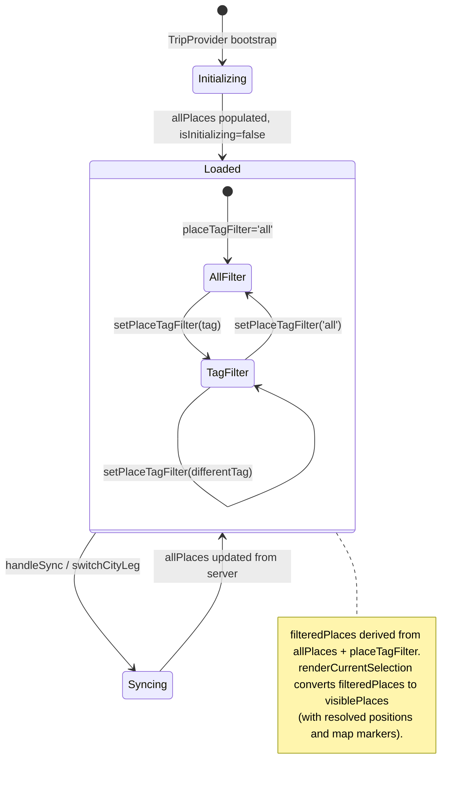
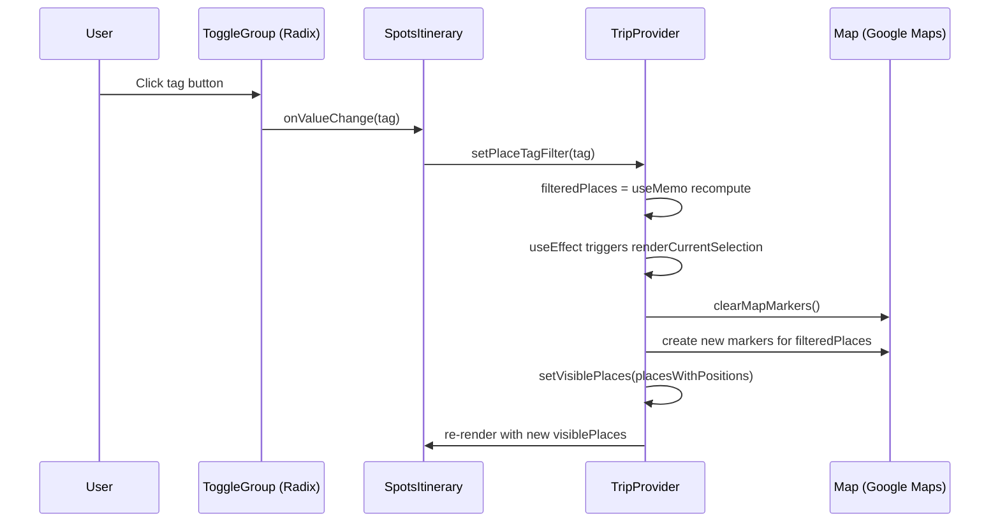
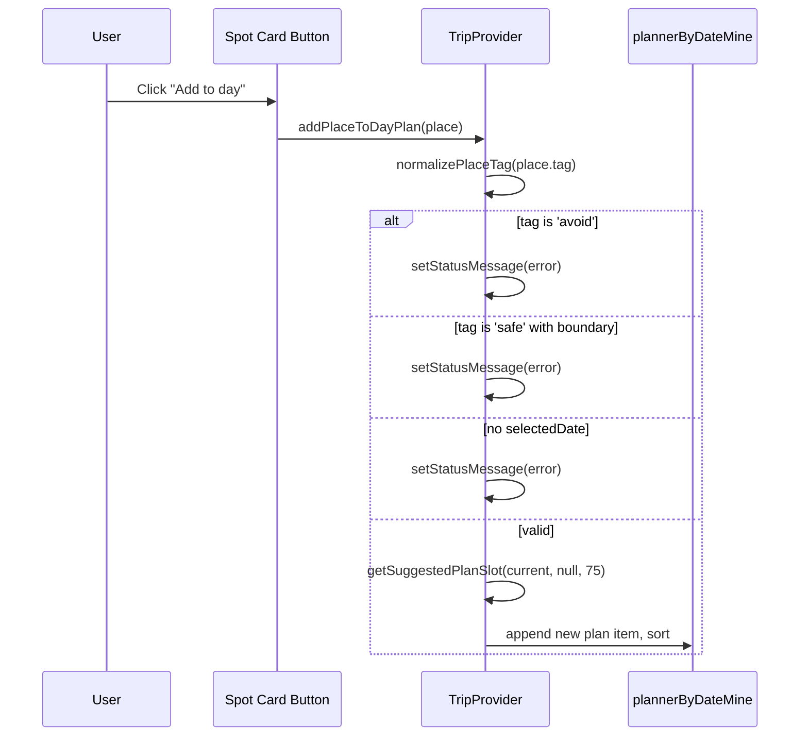

# Spots Itinerary: Technical Architecture & Implementation

**Document Basis:** current code at time of generation.

---

## 1. Summary

The Spots Itinerary feature displays curated places (restaurants, bars, cafes, nightlife, shops) alongside safety/avoid overlay regions. Users browse spots filtered by tag category, view spot details, and add regular spots to their day planner with a single click. Safety and avoid regions are display-only and cannot be added to the planner.

**Current shipped scope:**
- Tag-based filtering via toggle group: `all`, `eat`, `bar`, `cafes`, `go out`, `shops`, `avoid`, `safe`
- Spot cards with name, location, curator notes, descriptions, risk/safety banners
- "Add to day" action for non-safety/non-avoid spots
- Skeleton loading state during initialization
- Map marker rendering (pin icons for regular spots, boundary polygons for avoid/safe regions)
- External links to Google Maps and Corner.inc pages (sanitized)
- Server-side data pipeline: Convex DB query + static JSON fallback + region overlay merge

**Out of scope:** spot creation/editing UI, inline search, drag-to-reorder within spot list, spot favoriting.

---

## 2. Runtime Placement & Ownership

The Spots Itinerary renders inside the `/spots` tab of the authenticated app shell.

**Mount path:** `app/trips/[tripId]/spots/page.tsx` -> `components/SpotsItinerary.tsx`

**Layout hierarchy:**
```
AppShell (nav + map layout)
  +-- MapPanel (always mounted, visible on spots tab)
  +-- SpotsPage (aside element, sidebar)
       +-- DayList (date picker column)
       +-- SpotsItinerary (center column, filterable spots list)
       +-- PlannerItinerary (right column, day plan timeline)
```

**Lifecycle boundaries:**
- `TripProvider` owns all state. SpotsItinerary is a pure consumer via `useTrip()` hook.
- Spots data loads during TripProvider bootstrap and refreshes on sync or city switch.
- The component is route-scoped to `/spots` but all state persists across tabs via TripProvider (mounted at layout level).
- Map markers for spots are rendered by `renderCurrentSelection` inside TripProvider, not by SpotsItinerary itself.

**Key citation:** `app/trips/[tripId]/spots/page.tsx:8-22`, `components/AppShell.tsx:17`

---

## 3. Module/File Map

| File | Responsibility | Key Exports | Dependencies | Side Effects |
|------|---------------|-------------|--------------|--------------|
| `components/SpotsItinerary.tsx` | UI rendering of spot cards and tag filter | `SpotsItinerary` (default) | `useTrip`, `getTagColor`, helpers, Badge, Card, ToggleGroup | None |
| `components/providers/TripProvider.tsx` | All spots state: loading, filtering, map markers, add-to-planner | `useTrip`, `getTagColor`, `TAG_COLORS` | Convex client, helpers, map-helpers, planner-helpers | Map markers, geocoding, network fetches |
| `convex/spots.ts` | Database CRUD for spots table | `listSpots` (query), `getSyncMeta` (query), `upsertSpots` (mutation) | `convex/authz` | DB reads/writes |
| `convex/schema.ts` | Spots table schema definition | `default` (schema) | convex/server | None |
| `lib/events.ts` | Server-side spots pipeline: Convex read, static fallback, Corner scrape, merge | `loadEventsPayload` | Convex HTTP client, node:fs, firecrawl | File I/O, network |
| `lib/helpers.ts` | Tag normalization, formatting, truncation | `normalizePlaceTag`, `formatTag`, `truncate`, `getPlaceSourceKey` | None | None |
| `lib/security.ts` | URL sanitization for external links | `getSafeExternalHref` | None | None |
| `lib/planner-helpers.ts` | Plan slot suggestion, plan item sorting | `getSuggestedPlanSlot`, `createPlanId`, `sortPlanItems` | helpers | None |
| `components/ui/toggle-group.tsx` | Radix toggle group primitives | `ToggleGroup`, `ToggleGroupItem` | @radix-ui/react-toggle-group | None |
| `components/ui/badge.tsx` | CVA-styled badge | `Badge` | class-variance-authority | None |
| `data/static-places.json` | Fallback spot data (1126 lines, ~50+ spots) | JSON array | None | None |

---

## 4. State Model & Transitions

### State Variables (TripProvider)

| Variable | Type | Default | Purpose |
|----------|------|---------|---------|
| `allPlaces` | `any[]` | `[]` | All spots loaded from server (Convex + static merged) |
| `visiblePlaces` | `any[]` | `[]` | Spots with resolved map positions, after category filtering |
| `placeTagFilter` | `string` | `'all'` | Active tag filter |
| `isInitializing` | `boolean` | `true` | Controls skeleton vs real content |
| `selectedDate` | `string` | `''` | Currently selected date (required for add-to-planner) |

### Derived State (useMemo)

| Derived | Source | Logic | Citation |
|---------|--------|-------|----------|
| `placeTagOptions` | `allPlaces` | `['all', ...unique normalized tags sorted]` | `TripProvider.tsx:322-326` |
| `filteredPlaces` | `allPlaces` + `placeTagFilter` | If filter is `'all'`, return all; otherwise filter by `normalizePlaceTag` | `TripProvider.tsx:328-331` |
| `placeLookup` | `visiblePlaces` | `Map<sourceKey, place>` for O(1) lookups | `TripProvider.tsx:338-342` |

### State Diagram



### Tag Filter Transition Rules

- The ToggleGroup operates in `type="single"` mode, meaning exactly one tag is always selected.
- `onValueChange` fires only when `v` is truthy (Radix deselect produces empty string, which is ignored). This prevents deselecting all filters.
- Citation: `SpotsItinerary.tsx:72`

---

## 5. Interaction & Event Flow

### Sequence: User Selects a Tag Filter



### Sequence: User Adds a Spot to Day Plan



### "Add to day" Guard Conditions

| Condition | Outcome | Citation |
|-----------|---------|----------|
| `tag === 'avoid'` | Blocked with status message | `TripProvider.tsx:913` |
| `tag === 'safe'` AND has boundary polygon (>= 3 points) | Blocked with status message | `TripProvider.tsx:914-917` |
| `selectedDate` is empty | Blocked with "Select a specific date" message | `TripProvider.tsx:918` |
| Otherwise | Added with 75-minute default duration, starting at 9:00 AM or next available slot | `TripProvider.tsx:919-930` |

---

## 6. Rendering / Layers / Motion

### Spot Card Visual Structure

Each spot card renders inside a `<Card>` component with hover effects:
- **Hover border:** `border-accent-border` (the `#00FF88` accent)
- **Hover glow:** `shadow-[0_0_0_3px_var(--color-accent-glow)]`
- **Left border indicator:** 3px solid for `safe` (green, 30% opacity) and `avoid` (red, 30% opacity)
- **Citation:** `SpotsItinerary.tsx:92-97`

### Tag Color Map

Defined at `TripProvider.tsx:41-49`:

| Tag | Hex Color | Usage |
|-----|-----------|-------|
| `eat` | `#FF8800` | Badge bg, map pin |
| `bar` | `#A78BFA` | Badge bg, map pin |
| `cafes` | `#60A5FA` | Badge bg, map pin |
| `go out` | `#F472B6` | Badge bg, map pin |
| `shops` | `#2DD4BF` | Badge bg, map pin |
| `avoid` | `#FF4444` | Badge bg, polygon fill, warning text |
| `safe` | `#00FF88` | Badge bg, polygon fill, safety text |
| (fallback) | `#2563eb` | Any unrecognized tag |

Badge rendering uses inline style: `backgroundColor: ${tagColor}22` (hex with 13% alpha), `color: tagColor`. Citation: `SpotsItinerary.tsx:101`.

### Tag Icon Map (Map Pins)

Defined at `TripProvider.tsx:133-141`:

| Tag | Lucide Icon |
|-----|-------------|
| `eat` | UtensilsCrossed |
| `bar` | Martini |
| `cafes` | Coffee |
| `go out` | PartyPopper |
| `shops` | ShoppingBag |
| `avoid` | TriangleAlert |
| `safe` | ShieldCheck |

### Map Layer Z-Index Contract

| Layer | z-index | Type |
|-------|---------|------|
| Safe region polygon | `20` | Google Maps Polygon |
| Avoid region polygon | `30` | Google Maps Polygon |
| Safe region label marker | `25` | AdvancedMarkerElement |
| Avoid region label marker | `40` | AdvancedMarkerElement |
| Regular spot pin | default | AdvancedMarkerElement |

Citation: `TripProvider.tsx:1165`, `TripProvider.tsx:1193`

### Region Polygon Styling

**Avoid regions** (by risk level, `TripProvider.tsx:1146-1150`):

| Risk | Fill Opacity | Stroke Opacity | Stroke Weight |
|------|-------------|----------------|---------------|
| `extreme` | 0.32 | 0.85 | 3 |
| `high` | 0.22 | 0.70 | 2.5 |
| `medium-high` | 0.15 | 0.55 | 2 |
| default (`medium`) | 0.08 | 0.40 | 1.5 |

**Safe regions** (by safetyLevel, `TripProvider.tsx:1152-1155`):

| Safety Level | Fill Opacity | Stroke Opacity | Stroke Weight |
|-------------|-------------|----------------|---------------|
| `very-high` | 0.20 | 0.78 | 2.5 |
| `high` | 0.14 | 0.62 | 2.0 |
| default | 0.10 | 0.50 | 1.8 |

### Skeleton Loading State

`SpotsItinerarySkeleton` renders when `isInitializing === true`. It shows:
- A header skeleton (title bar + 3 tag button placeholders)
- 3 card skeletons with staggered animation delays (0ms, 100ms, 200ms)
- Varied widths to prevent visual monotony: title widths `['w-3/5', 'w-2/3', 'w-1/2', 'w-3/4']`
- Uses `animate-pulse` with `animationDelay` for stagger effect

Citation: `SpotsItinerary.tsx:12-44`

### Conditional Card Content

| Tag | Card Content |
|-----|-------------|
| `avoid` | Warning icon + risk-level text + crime types. No "Add to day" button. |
| `safe` | Shield icon + "Safer area" + safety label/highlights + optional crime watch. No "Add to day" button. |
| All others | "Add to day" button visible. |

Citation: `SpotsItinerary.tsx:107-120`

---

## 7. API & Prop Contracts

### SpotsItinerary Component

**Props:** None. All data consumed from `useTrip()` context hook.

**Consumed context values:**

```typescript
// From useTrip() — SpotsItinerary.tsx:48-51
{
  visiblePlaces: any[];         // Spots with resolved positions, filtered by tag + category visibility
  placeTagFilter: string;       // Current filter: 'all' | 'eat' | 'bar' | 'cafes' | 'go out' | 'shops' | 'avoid' | 'safe'
  setPlaceTagFilter: (v: string) => void;
  placeTagOptions: string[];    // ['all', ...sorted unique tags from allPlaces]
  addPlaceToDayPlan: (place: any) => void;
  selectedDate: string;         // ISO date string, e.g. '2026-03-18'
  isInitializing: boolean;
  timezone: string;             // e.g. 'America/Los_Angeles'
}
```

### Spot Data Shape (from Convex `spots` table)

```typescript
// convex/schema.ts:154-177
{
  cityId: string;
  id: string;
  name: string;
  tag: string;              // Raw tag value, normalized client-side
  location: string;
  mapLink: string;
  cornerLink: string;
  curatorComment: string;
  description: string;
  details: string;
  lat?: number;
  lng?: number;
  sourceId?: string;
  sourceUrl?: string;
  confidence?: number;
  missedSyncCount?: number;
  isDeleted?: boolean;
  lastSeenAt?: string;
  updatedAt?: string;
}
```

### Additional fields from static-places.json (not in Convex schema)

These fields exist on places merged from `data/static-places.json` but are NOT stored in Convex:
- `boundary: Array<{lat: number, lng: number}>` -- polygon coordinates for avoid/safe regions
- `risk: string` -- `'extreme'` | `'high'` | `'medium-high'` | `'medium'`
- `crimeTypes: string` -- comma-separated crime categories
- `safetyLevel: string` -- `'very-high'` | `'high'`
- `safetyLabel: string` -- human-readable safety description
- `safetyHighlights: string` -- safety detail text

### Convex API Functions

**`spots:listSpots`** (query)
- Args: `{ cityId: string }`
- Returns: `Array<SpotRecord>` sorted by `tag|name`, excluding `isDeleted === true`
- Auth: `requireAuthenticatedUserId` (any authenticated user)
- Citation: `convex/spots.ts:53-69`

**`spots:getSyncMeta`** (query)
- Args: `{ cityId: string }`
- Returns: `{ key, syncedAt, calendars, eventCount } | null`
- Auth: `requireAuthenticatedUserId`
- Citation: `convex/spots.ts:72-89`

**`spots:upsertSpots`** (mutation)
- Args: `{ cityId, spots[], syncedAt, sourceUrls[], missedSyncThreshold? }`
- Returns: `{ spotCount, syncedAt }`
- Auth: `requireOwnerUserId` (owner-only)
- Behavior: Upserts incoming spots, increments `missedSyncCount` for spots not in payload, soft-deletes after threshold (default 2)
- Citation: `convex/spots.ts:91-166`

### Server-Side Data Pipeline (lib/events.ts)

`loadEventsPayload(cityId)` orchestrates spot loading:

1. Load static places from `data/static-places.json` -- `loadStaticPlaces()` at line 597
2. Load spots from Convex via `loadSpotsFromConvex(cityId)` at line 741
3. If Convex has spots, use them; otherwise fall back to static places -- line 336-339
4. Merge region overlay places (avoid/safe with boundary polygons) from static data via `mergeStaticRegionPlaces()` -- line 337, 1916
5. Return merged `places` array in the response payload -- line 350

---

## 8. Reliability Invariants

These deterministic truths must remain true after refactors:

1. **Tag normalization is idempotent.** `normalizePlaceTag(normalizePlaceTag(x)) === normalizePlaceTag(x)` for all inputs. The function maps synonyms to canonical tags and defaults unrecognized values to `'cafes'`. Citation: `lib/helpers.ts:6-16`

2. **Avoid and safe spots are never added to the planner.** `addPlaceToDayPlan` guards against `avoid` tags unconditionally and `safe` tags with boundary polygons. Citation: `TripProvider.tsx:912-917`

3. **A date must be selected before adding any spot to the planner.** Guard at `TripProvider.tsx:918`.

4. **The tag filter always has at least `'all'` in `placeTagOptions`.** It is hardcoded as the first element. Citation: `TripProvider.tsx:325`.

5. **ToggleGroup cannot deselect to empty.** The `onValueChange` handler only fires `setPlaceTagFilter` when `v` is truthy. Citation: `SpotsItinerary.tsx:72`.

6. **Convex `listSpots` excludes soft-deleted spots.** The `.filter((spot) => !spot.isDeleted)` in the query handler. Citation: `convex/spots.ts:65`.

7. **Spot sort order is deterministic.** Spots are sorted by `${tag}|${name}` using `localeCompare`. Citation: `convex/spots.ts:68`.

8. **External links are sanitized.** All `mapLink` and `cornerLink` values pass through `getSafeExternalHref`, which rejects non-http(s) protocols. Citation: `SpotsItinerary.tsx:88-89`, `lib/security.ts:133-148`.

9. **Plan items from spots always get a 75-minute default duration.** The `fallbackDurationMinutes` is hardcoded to `75` in the `addPlaceToDayPlan` call. Citation: `TripProvider.tsx:921`.

10. **Convex upsert mutations are owner-only.** `requireOwnerUserId` is called in `upsertSpots`. Regular authenticated users can only read. Citation: `convex/spots.ts:101`.

---

## 9. Edge Cases & Pitfalls

### Unrecognized Tags Default to `cafes`

Any tag value that does not match the canonical set (`eat`, `bar`, `cafes`, `go out`, `shops`, `avoid`, `safe`) or their synonyms is silently normalized to `cafes`. This could cause data from new tag categories to be misclassified.

Citation: `lib/helpers.ts:15`

### Spots Without Coordinates

Spots missing `lat`/`lng` values will still appear in the SpotsItinerary list but will not have map markers. The `resolvePosition` function attempts geocoding from `mapLink` or `location` text, but if that fails, `position` is `null` and the marker creation branch is skipped.

Citation: `TripProvider.tsx:1136-1139`, `TripProvider.tsx:1197`

### Region Overlays From Static Data Only

Boundary polygon data (`boundary` array) only comes from `data/static-places.json`. It is not stored in the Convex `spots` table. The `mergeStaticRegionPlaces` function merges these into the spots array. If the static file is removed, avoid/safe polygon overlays will disappear but point-based spots will remain.

Citation: `lib/events.ts:1916-1943`, `lib/events.ts:337-339`

### Convex Field Sanitization

Before upserting spots to Convex, `sanitizeSpotForConvex` strips fields not in `CONVEX_SPOT_FIELDS`. Fields like `boundary`, `crimeTypes`, `risk`, `safetyLevel`, and `safetyHighlights` are stripped. This is validated by a test.

Citation: `lib/events.ts:801-815`, `lib/events.test.mjs:303-352`

### Soft Delete via Missed Sync Threshold

Spots not present in a sync payload get `missedSyncCount` incremented. After reaching `missedSyncThreshold` (default 2), they are soft-deleted (`isDeleted: true`). They can be resurrected if they reappear in a future sync.

Citation: `convex/spots.ts:103-122`

### hiddenCategories Interaction

The `hiddenCategories` set (from the map config panel) can hide entire tag categories from the map. When a category is hidden, spots of that tag are excluded from `renderCurrentSelection`'s input. However, `visiblePlaces` in the SpotsItinerary list still shows them because the component reads `visiblePlaces` which is set from `placesWithPositions` -- the places that went through `renderCurrentSelection`. If a category is hidden, those spots will not appear in the list either.

Citation: `TripProvider.tsx:1422-1424`

---

## 10. Testing & Verification

### Existing Test Coverage

| Test File | Relevant Coverage |
|-----------|------------------|
| `lib/events.test.mjs` | Convex spot upsert field sanitization (lines 303-352); mock of `spots:upsertSpots` mutation |
| `lib/security.test.mjs` | `getSafeExternalHref` URL sanitization |

No unit tests exist for `SpotsItinerary.tsx` component rendering, `normalizePlaceTag`, `formatTag`, or `addPlaceToDayPlan` logic.

### Manual Verification Scenarios

1. **Tag filter changes list:** Navigate to `/spots`. Click each tag in the toggle group. Verify the place count badge updates and only matching spots show.

2. **Add to day plan:** Select a date in DayList. Click "Add to day" on a regular spot (e.g., a cafe). Verify it appears in PlannerItinerary at 9:00 AM or the next available slot.

3. **Avoid spot blocked:** Select a date. Verify avoid-tagged spot cards show warning text and no "Add to day" button. Verify attempting to add via map info window shows error status.

4. **Safe spot display:** Verify safe-tagged spots show green "Safer area" banner. No "Add to day" button for boundary-based safe regions.

5. **External links sanitized:** Verify "Open map" and "Corner page" links open in new tabs with `https://` URLs. Verify no link appears for spots with empty/invalid URLs.

6. **Skeleton state:** Hard-refresh the page. Verify the skeleton with 3 placeholder cards appears before spots load.

7. **Empty state:** Filter to a tag with no spots. Verify the "No curated places in this category" message appears.

8. **City switch:** Switch to a different city. Verify spots list reloads with new city's data.

### Command Checks

```bash
# Run existing tests that cover spots pipeline
npm test -- lib/events.test.mjs

# Verify Convex schema matches spot validator
npx convex dev --typecheck
```

---

## 11. Quick Change Playbook

| Change Goal | Files to Edit | Notes |
|-------------|---------------|-------|
| Add a new tag category (e.g., `museum`) | `lib/helpers.ts` (add case in `normalizePlaceTag`), `TripProvider.tsx` (add to `TAG_COLORS`, `TAG_ICON_COMPONENTS`, `TAG_ICON_NODES`), `lib/events.ts` (add to `SPOT_TAGS`, update `normalizeSpotTag` regex) | Tag options derive automatically from data. No SpotsItinerary.tsx changes needed. |
| Change tag color | `TripProvider.tsx:41-49` (`TAG_COLORS` object) | Used by badge, map pin, and info window. Single source of truth. |
| Change default plan duration for added spots | `TripProvider.tsx:921` | Change the `75` argument in `getSuggestedPlanSlot(current, null, 75)` |
| Modify spot card layout | `components/SpotsItinerary.tsx:86-131` | Pure presentational. No state logic changes needed. |
| Change skeleton card count | `SpotsItinerary.tsx:31` | Change `length: 3` to desired count |
| Allow safe spots to be added to planner | `TripProvider.tsx:914-917` | Remove the `safe` guard condition in `addPlaceToDayPlan` |
| Change soft-delete threshold | `lib/events.ts:19` (`MISSED_SYNC_THRESHOLD`) | Also passable per-call via `missedSyncThreshold` arg |
| Add a new field to spots | `convex/schema.ts` (spots table), `convex/spots.ts` (validators), `lib/events.ts` (add to `CONVEX_SPOT_FIELDS`), `SpotsItinerary.tsx` (display it) | Must add to both `spotValidator` and `spotRecordValidator` |
| Change spot sort order | `convex/spots.ts:68` | Currently `tag|name` alphabetical |
| Modify map polygon styling for avoid/safe | `TripProvider.tsx:1144-1155` | `regionStyle` IIFE inside `renderCurrentSelection` |
| Hide spots from map but keep in list | Refactor `TripProvider.tsx:1419-1425` | Currently `filteredPlaces` drives both map and list; they would need to be decoupled |
