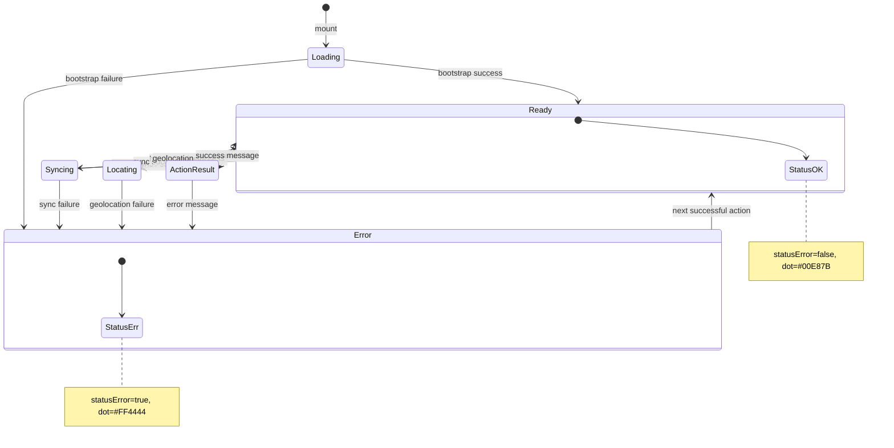
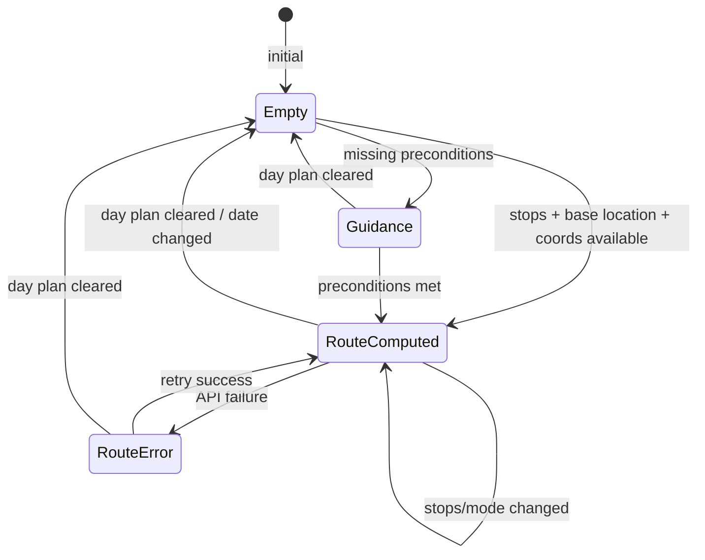
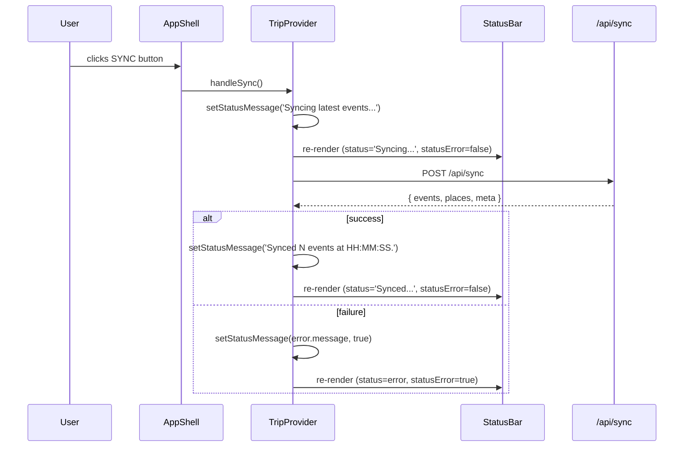
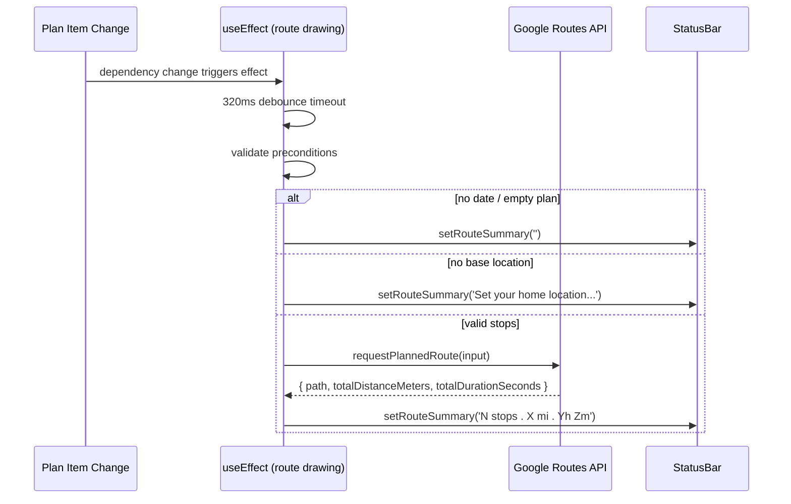

# Status Bar: Technical Architecture & Implementation

**Document Basis:** current code at time of generation.

---

## 1. Summary

The Status Bar is a persistent, full-width bottom bar rendered at the base of the application shell. It serves three purposes:

1. **Sync/system status indicator** -- a colored dot and text message reflecting the latest operation result (success, error, or in-progress).
2. **Last sync timestamp** -- a static label (currently hardcoded as `"Last sync: 2s ago"`).
3. **Route summary** -- distance, duration, and stop count for the currently drawn planner route.

**Current shipped scope:**
- Green/red dot reflecting `statusError` boolean.
- Status text from `setStatusMessage()` calls across TripProvider.
- Route summary string from the route-drawing effect.
- Hardcoded "Last sync: 2s ago" timestamp (not live-computed).

**Out of scope (not implemented):**
- Live/computed last-sync timestamp.
- Animated transitions on status change.
- Click-to-copy or expandable error details.
- StatusBar-specific tests.

---

## 2. Runtime Placement & Ownership

The StatusBar renders inside `AppShell`, which wraps all tab-based routes.

```
app/trips/layout.tsx
  TripProvider          -- owns all state
    AppShell            -- layout shell
      <header>          -- top navigation bar
      <grid>            -- map + sidebar content
      <StatusBar />     -- bottom bar (always visible)
```

**Mount point:** `components/AppShell.tsx:103` -- `<StatusBar />` is the last child of the `<main>` flex column.

**Lifecycle boundary:** StatusBar is mounted for the entire lifetime of any `trips/[tripId]` route (`/map`, `/calendar`, `/planning`, `/spots`, `/config`). It unmounts only when navigating away from the tabs layout (e.g., to `/signin`, `/landing`, `/dashboard`).

**Ownership:** StatusBar is a pure display component with zero internal state. All data comes from `TripProvider` via the `useTrip()` hook.

---

## 3. Module/File Map

| File | Responsibility | Key Exports | Dependencies | Side Effects |
|------|---------------|-------------|--------------|-------------|
| `components/StatusBar.tsx` | Renders the bottom bar UI | `default` (StatusBar component) | `useTrip` from TripProvider | None |
| `components/providers/TripProvider.tsx` | Owns `status`, `statusError`, `routeSummary` state; exposes `setStatusMessage` | `TripProvider`, `useTrip` | React context, Convex auth, Google Maps, fetch API | Network requests, map mutations, timers |
| `components/AppShell.tsx` | Mounts StatusBar as last child in the layout shell | `default` (AppShell component) | StatusBar, MapPanel, TripSelector, useTrip | None |
| `app/trips/layout.tsx` | Wraps children in TripProvider + AppShell | `default` (TabsLayout) | TripProvider, AppShell | None |
| `lib/helpers.ts` | `formatDistance`, `formatDurationFromSeconds` used for route summary text | Named exports | None | None |
| `lib/planner-helpers.ts` | `MAX_ROUTE_STOPS` constant | Named exports | None | None |
| `app/globals.css` | `--color-border`, `statusPulse` keyframe, theme tokens | CSS custom properties | Tailwind | None |

---

## 4. State Model & Transitions

StatusBar consumes three values from TripContext:

| State Variable | Type | Initial Value | Setter | Defined At |
|---------------|------|--------------|--------|-----------|
| `status` | `string` | `'Loading trip map...'` | `setStatus` (via `setStatusMessage`) | `TripProvider.tsx:248` |
| `statusError` | `boolean` | `false` | `setStatusError` (via `setStatusMessage`) | `TripProvider.tsx:249` |
| `routeSummary` | `string` | `''` | `setRouteSummary` | `TripProvider.tsx:271` |

### `setStatusMessage` -- the unified status writer

All status updates go through a single callback:

```typescript
// TripProvider.tsx:538-541
const setStatusMessage = useCallback((message, isError = false) => {
  setStatus(message);
  setStatusError(isError);
}, []);
```

This is called from 40+ locations across TripProvider. The `isError` flag defaults to `false`, so callers only pass `true` when reporting a failure.

### Status State Diagram



### Route Summary State Diagram



Route summary values and their triggers:

| routeSummary Value | Trigger | Source |
|---|---|---|
| `''` (empty) | No date selected or empty day plan | `TripProvider.tsx:1436` |
| `'Set your home location before drawing a route.'` | No base location geocoded | `TripProvider.tsx:1437` |
| `'Route needs map-ready items with known coordinates.'` | All plan items lack coordinates | `TripProvider.tsx:1439` |
| `'{N} stops · {dist} · {time}'` | Successful route computation | `TripProvider.tsx:1461` |
| Error message string | Route API failure | `TripProvider.tsx:1466` |

---

## 5. Interaction & Event Flow

StatusBar has **no user interactions** -- it is purely a read-only display. Updates flow unidirectionally from TripProvider state changes.

### Sequence: Status Update on Sync



### Sequence: Route Summary Update



---

## 6. Rendering / Layers / Motion

### Layout Position

StatusBar occupies a fixed 28px strip at the bottom of the viewport within a flex column layout:

```
<main class="min-h-dvh h-dvh flex flex-col">   -- AppShell.tsx:36
  <header height=52px>                          -- top bar
  <div class="flex-1 min-h-0">                  -- content area (grows)
  <StatusBar height=28px shrink-0>              -- bottom bar (never shrinks)
</main>
```

### Visual Specification

| Property | Value | Source |
|----------|-------|-------|
| Height | `28px` | `StatusBar.tsx:12` inline style |
| Background | `#080808` | `StatusBar.tsx:11` inline style |
| Top border | `1px solid var(--color-border)` (`#2f2f2f`) | `StatusBar.tsx:13` |
| Font family | `var(--font-jetbrains, 'JetBrains Mono', monospace)` | `StatusBar.tsx:15` |
| Font size | `10px` | `StatusBar.tsx:16` |
| Padding | `0 16px` (Tailwind `px-4`) | `StatusBar.tsx:10` |
| Flex layout | `justify-between` | `StatusBar.tsx:10` |

### Status Indicator Dot

| Property | Normal | Error |
|----------|--------|-------|
| Size | 6x6px | 6x6px |
| Shape | Circle (`border-radius: 50%`) | Circle |
| Color | `#00E87B` | `#FF4444` |
| Glow | None | `0 0 6px rgba(255,68,68,0.4)` |

Source: `StatusBar.tsx:23-29`

### Color Scheme

| Element | Normal Color | Error Color |
|---------|-------------|------------|
| Status dot | `#00E87B` (green) | `#FF4444` (red) |
| Status text | `#666` | `#FF4444` (red) |
| Last sync text | `#444` | `#444` (unchanged) |
| Route summary text | `#666` | `#666` (unchanged) |

### Z-Index Contract

StatusBar does not set any explicit z-index. It relies on document flow order within the flex column. The header sets `z-30` (`z-index: 30`) for dropdown overlays. StatusBar sits below content in stacking context but is visually at the bottom due to flex ordering.

### Animation

StatusBar itself has **no animations**. The `statusPulse` keyframe defined in `globals.css:43` is used by the route-updating indicator in PlannerItinerary, not by StatusBar directly:

```css
/* globals.css:43 */
@keyframes statusPulse { 0%, 100% { opacity: 1; } 50% { opacity: 0.5; } }
```

---

## 7. API & Prop Contracts

### StatusBar Component

```typescript
// components/StatusBar.tsx -- no props, no ref forwarding
export default function StatusBar(): JSX.Element
```

**Props:** None. All data sourced from `useTrip()`.

**Context consumption:**

| Context Field | Type | Usage |
|--------------|------|-------|
| `status` | `string` | Displayed as left-side text label |
| `statusError` | `boolean` | Controls dot color, text color, and glow |
| `routeSummary` | `string` | Displayed on right side when non-empty |

### setStatusMessage (internal API)

```typescript
// TripProvider.tsx:538
const setStatusMessage = useCallback(
  (message: string, isError?: boolean = false) => void
, []);
```

This is exposed on the context as `setStatusMessage` (`TripProvider.tsx:1791`), making it callable from any component inside TripProvider. However, all current callers are internal to TripProvider itself.

### Accessibility

- `role="status"` is set on the root `<div>` (`StatusBar.tsx:18`), which creates an ARIA live region. Screen readers will announce status text changes automatically.
- No `aria-live` attribute is explicitly set, but `role="status"` implies `aria-live="polite"` per WAI-ARIA spec.

---

## 8. Reliability Invariants

These must remain true after any refactor:

1. **StatusBar must always render.** It is unconditionally mounted at `AppShell.tsx:103` -- no conditional rendering, no loading gates.
2. **`setStatusMessage(msg)` without a second argument must clear the error state.** The `isError` parameter defaults to `false` (`TripProvider.tsx:538`).
3. **`status` always contains a non-empty string after bootstrap.** Initial value is `'Loading trip map...'` (`TripProvider.tsx:248`) and every code path through bootstrap calls `setStatusMessage`.
4. **`routeSummary` is empty string when no route is active.** This is the guard for conditional rendering on the right side (`StatusBar.tsx:35-37`).
5. **`statusError` controls both the dot color and the text color.** A single boolean drives the entire error visual state.
6. **StatusBar has zero internal state.** It is a pure function of three context values.
7. **Route summary debounce is 320ms.** The route-drawing effect uses `setTimeout(drawPlannedRoute, 320)` (`TripProvider.tsx:1431`).

---

## 9. Edge Cases & Pitfalls

### Hardcoded Last Sync Timestamp

The "Last sync: 2s ago" text at `StatusBar.tsx:34` is a **static string**. It does not compute or update based on actual sync timing. This is a known gap between the UI design and the implementation.

### No Status History or Queueing

`setStatusMessage` overwrites the previous status immediately. If two operations complete in rapid succession, only the last message is visible. There is no toast queue or history log.

### Route Summary vs Status Text Independence

Route summary and status text are independent state channels. A sync error will turn the status dot red and change the status text, but the route summary on the right side will remain unchanged (showing the last computed route). These two channels do not interact.

### Error State Persistence

`statusError=true` persists until the next `setStatusMessage` call with `isError=false` (the default). If no subsequent action clears it, the red dot remains indefinitely. There is no auto-clear timer.

### MAX_ROUTE_STOPS Truncation

When the planner has more than 8 stops (`MAX_ROUTE_STOPS = 8`, defined at `lib/planner-helpers.ts:18`), the route summary appends `(showing first 8)` to the text. The route is computed using only the first 8 stops.

### No Responsive Overrides

StatusBar has no responsive CSS overrides in `globals.css`. The 28px height and 10px font size are fixed across all viewport sizes. On narrow mobile screens the status text and route summary may overflow or become unreadable.

---

## 10. Testing & Verification

### Existing Test Coverage

There are **no dedicated tests** for StatusBar. The component is not imported or tested in any test file in the repository.

The related `lib/trip-provider-bootstrap.test.mjs` and `lib/trip-provider-storage.test.mjs` files test TripProvider bootstrap and storage logic, but they do not assert on `status`, `statusError`, or `routeSummary` values that StatusBar consumes.

### Manual Verification Scenarios

| Scenario | Steps | Expected StatusBar State |
|----------|-------|------------------------|
| App bootstrap (success) | Load any tab route | Green dot, "Loaded N events and M curated places." |
| App bootstrap (missing API key) | Remove `GOOGLE_MAPS_BROWSER_KEY` from env | Red dot, "Missing GOOGLE_MAPS_BROWSER_KEY in .env. Map cannot load." |
| Sync success | Click SYNC in header | Green dot, "Synced N events at HH:MM:SS." |
| Sync with ingestion errors | Sync with a broken source | Red dot, "Synced N events at HH:MM:SS (K ingestion errors)." |
| Sync failure | Disconnect network, click SYNC | Red dot, error message text |
| Route computed | Select date, add 2+ stops with coords, set base location | Route summary: "2 stops . X.X mi . Ym" |
| Route precondition missing | Add stops but no base location | Route summary: "Set your home location before drawing a route." |
| Sign out | Sign out from config | Green dot, "Signed out." (briefly before redirect) |
| Owner-only action as member | Member clicks sync or source management | Red dot, "Owner role required for this action." |

---

## 11. Quick Change Playbook

| If you want to... | Edit... |
|---|---|
| Change the status bar height | `components/StatusBar.tsx:12` -- change `height: 28` |
| Change the indicator dot size | `components/StatusBar.tsx:23-24` -- change `width: 6, height: 6` |
| Change the success dot color | `components/StatusBar.tsx:27` -- change `'#00E87B'` |
| Change the error dot color | `components/StatusBar.tsx:27` -- change `'#FF4444'` |
| Change the error glow | `components/StatusBar.tsx:28` -- change the `boxShadow` value |
| Make the "Last sync" timestamp dynamic | `components/StatusBar.tsx:34` -- replace hardcoded string with a computed value using a `lastSyncAt` timestamp from TripProvider (requires adding state to TripProvider) |
| Add a new status message | Call `setStatusMessage('Your message')` or `setStatusMessage('Error text', true)` anywhere inside TripProvider |
| Change the route summary format | `components/providers/TripProvider.tsx:1461` -- modify the template string |
| Change the route debounce delay | `components/providers/TripProvider.tsx:1431` -- change `320` (milliseconds) |
| Change the max route stops | `lib/planner-helpers.ts:18` -- change `MAX_ROUTE_STOPS = 8` |
| Change distance formatting (mi/km) | `lib/helpers.ts:150-154` -- modify `formatDistance()` |
| Change duration formatting | `lib/helpers.ts:156-161` -- modify `formatDurationFromSeconds()` |
| Add click-to-dismiss on error | Add an `onClick` handler to the status text `<span>` in `StatusBar.tsx:31` that calls `setStatusMessage` with a neutral message |
| Add responsive breakpoints | Add StatusBar-specific rules in `app/globals.css` media queries (~line 154+) |
| Hide StatusBar on certain routes | Wrap `<StatusBar />` in a conditional in `components/AppShell.tsx:103` based on `pathname` |
