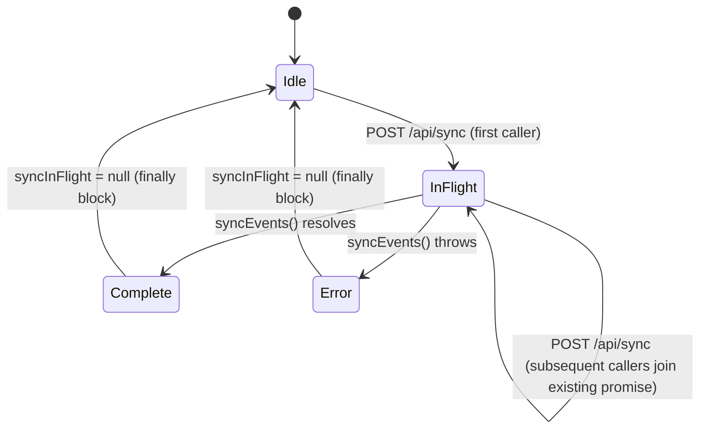
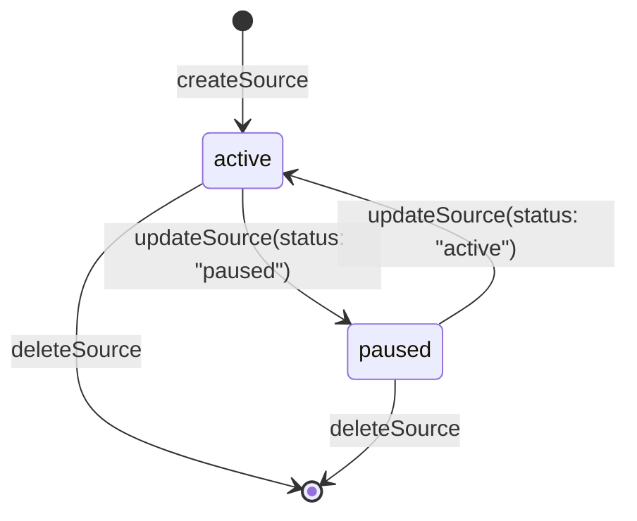
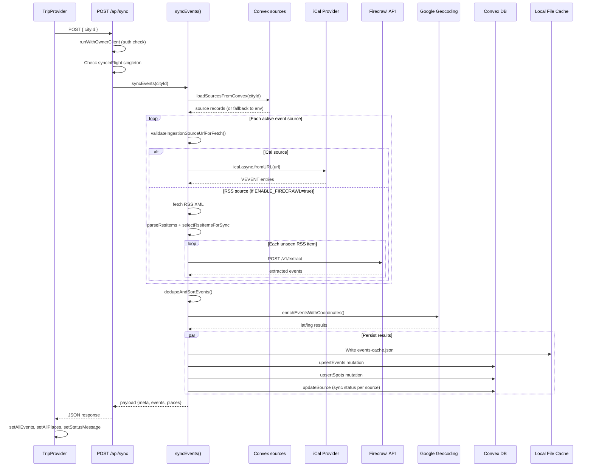

# Sync Engine: Technical Architecture & Implementation

Document Basis: current code at time of generation.

**Last Updated:** 2026-03-16

---

## 1. Summary

The Sync Engine is the server-side data ingestion pipeline that fetches events and spots from external sources, normalizes them, geocodes their addresses, deduplicates results, and persists them to both a local file cache and the Convex real-time database. It supports multiple source types: iCal/ICS calendars (Luma, Eventbrite, etc.), RSS feeds with Firecrawl-powered extraction, and static JSON place files.

**Current shipped scope:**

- iCal calendar ingestion (VEVENT parsing via `node-ical`)
- RSS feed ingestion with Firecrawl web scraping for event extraction (disabled by default; opt-in via `ENABLE_FIRECRAWL=true`)
- Google Maps Geocoding API integration with multi-layer caching (in-memory, local file, Convex DB)
- Event deduplication by canonical URL (UTM/tracking params stripped)
- Spot deduplication by cornerLink or name+location composite key
- Missed-sync tracking with soft-delete after threshold
- Per-source sync status tracking (lastSyncedAt, lastError, rssStateJson)
- SSRF protection via URL validation and DNS resolution checks
- Dual persistence: local JSON file cache + Convex mutations
- Source CRUD management (create, update, pause, delete)

**Out of scope (not implemented):**

- `syncSpotsFromSources()` is a no-op stub -- returns empty results (`lib/events.ts:1192-1198`)
- Scheduled/cron-based sync (sync is triggered manually or on page load)
- Webhook-based real-time source updates

> **⚠️ KNOWN LIMITATION: Spot Sync is Not Implemented ⚠️**
>
> The function `syncSpotsFromSources()` at `lib/events.ts:1192-1198` is a **no-op stub** that always returns:
> ```javascript
> { places: [], sourceUrls: [...], errors: [] }
> ```
>
> **Current spot data sources:**
> - Static JSON file: `data/static-places.json` (loaded via `loadStaticPlaces()`)
> - Existing Convex `spots` table entries
> - AI text parsing via `/api/ai/parse` (creates spots from pasted content)
>
> **To implement spot source sync:**
> 1. Add Firecrawl extraction logic similar to RSS event extraction
> 2. Define spot-specific field mapping from scraped data
> 3. Add spot schema validation in `CONVEX_SPOT_FIELDS`
> 4. Call `upsertSpots` mutation with extracted data

---

## 2. Runtime Placement & Ownership

The Sync Engine runs exclusively on the **server side** within Next.js API Route Handlers (Node.js runtime). It is never imported or executed in the browser.

| Boundary | Detail |
|---|---|
| Runtime | `export const runtime = 'nodejs'` on all sync routes |
| Auth gate | `runWithOwnerClient` -- requires owner role (`convex/authz.ts:27-42`) |
| Lifecycle | Triggered by: (1) TripProvider bootstrap effect, (2) manual "Sync" button click |
| Concurrency | Module-level `syncInFlight` singleton prevents duplicate parallel syncs (`app/api/sync/route.ts:6,19-23`) |
| Client context | `AsyncLocalStorage` scopes the authenticated Convex client per request (`lib/convex-client-context.ts`) |

The TripProvider initiates sync from the client in two places:

1. **Bootstrap effect** (`TripProvider.tsx:1251-1279`): runs `POST /api/sync` with `{ cityId }` on mount
2. **Manual handler** (`TripProvider.tsx:1474-1504`): `handleSync` callback, owner-gated

---

## 3. Module/File Map

| File | Responsibility | Key Exports | Dependencies | Side Effects |
|---|---|---|---|---|
| `app/api/sync/route.ts` | HTTP POST endpoint for full sync | `POST` | `lib/events.ts`, `lib/api-guards.ts` | Module-level `syncInFlight` singleton |
| `app/api/sources/route.ts` | HTTP GET/POST for source listing/creation | `GET`, `POST` | `lib/events.ts`, `lib/api-guards.ts` | None |
| `app/api/sources/[sourceId]/route.ts` | HTTP PATCH/POST/DELETE for per-source ops | `PATCH`, `POST`, `DELETE` | `lib/events.ts`, `lib/api-guards.ts` | None |
| `lib/events.ts` | Core sync logic (~2400 lines) | `syncEvents`, `syncSingleSource`, `loadEventsPayload`, `loadSourcesPayload`, `createSourcePayload`, `updateSourcePayload`, `deleteSourcePayload` | `node-ical`, `convex/browser`, `lib/security-server.ts`, `lib/convex-client-context.ts` | File I/O (data dir), network (iCal, RSS, Firecrawl, Google Geocoding), Convex mutations |
| `lib/events-api.ts` | Factory for events GET handler | `createGetEventsHandler` | `lib/events.ts`, `lib/api-guards.ts` | None |
| `lib/security-server.ts` | Server-side URL validation with DNS lookup | `validateIngestionSourceUrlForFetch` | `node:dns/promises`, `lib/security.ts` | DNS lookups |
| `lib/security.ts` | Shared SSRF checks, rate limiting | `isPrivateHost`, `validateIngestionSourceUrl`, `consumeRateLimit` | None | In-memory rate limit state |
| `lib/api-guards.ts` | Auth middleware wrappers | `runWithAuthenticatedClient`, `runWithOwnerClient` | `lib/convex-client-context.ts`, `lib/request-auth.ts` | None |
| `lib/convex-client-context.ts` | AsyncLocalStorage for Convex client scoping | `runWithConvexClient`, `getScopedConvexClient` | `node:async_hooks` | AsyncLocalStorage store |
| `convex/events.ts` | Convex mutations/queries for events + geocode | `listEvents`, `getSyncMeta`, `getGeocodeByAddressKey`, `upsertGeocode`, `upsertEvents` | `convex/authz.ts` | DB writes |
| `convex/spots.ts` | Convex mutations/queries for spots | `listSpots`, `getSyncMeta`, `upsertSpots` | `convex/authz.ts` | DB writes |
| `convex/sources.ts` | Convex CRUD for ingestion sources | `listSources`, `listActiveSources`, `createSource`, `updateSource`, `deleteSource` | `convex/authz.ts` | DB writes |
| `convex/schema.ts` | Database schema definitions | `default` (schema) | `convex/server` | None |

---

## 4. State Model & Transitions

### 4.1 Sync Lifecycle

The sync has no formal state machine but follows a deterministic pipeline.



### 4.2 Missed Sync Tracking (Events)

Events not present in the latest sync payload get their `missedSyncCount` incremented. When it reaches the threshold, they are soft-deleted.

```
missedSyncCount: 0 (present in sync) --> 0 (reset each time seen)
missedSyncCount: 0 (absent) --> 1 (first miss)
missedSyncCount: 1 (absent) --> 2 (second miss, >= threshold) --> isDeleted: true
```

- **Threshold constant**: `MISSED_SYNC_THRESHOLD = 2` (`lib/events.ts:19`)
- **Convex enforcement**: `missedSyncThreshold` is passed to `upsertEvents` and `upsertSpots` mutations, with `Math.max(1, ...)` floor (`convex/events.ts:188`, `convex/spots.ts:103`)
- **Deduplication key (events)**: `eventUrl` (`convex/events.ts:189,194,210`)
- **Deduplication key (spots)**: `id` field (`convex/spots.ts:104,109,124`)

### 4.3 RSS Seen State

RSS items are tracked per-source by `itemId` (guid or link) mapped to a version ISO timestamp. State is persisted in two locations:

1. **Convex**: `sources.rssStateJson` field per source record
2. **Local fallback**: `data/events-cache.json` under `meta.rssSeenBySourceUrl`

State is trimmed to `DEFAULT_RSS_STATE_MAX_ITEMS = 500` entries, sorted by recency (`lib/events.ts:950-964`).

### 4.4 Source Status



Only `active` sources are included in sync runs. Paused sources are skipped by `getActiveSourcesByType()` (`lib/events.ts:831-843`).

---

## 5. Interaction & Event Flow

### 5.1 Full Sync Sequence



### 5.2 Single Source Sync

Triggered via `POST /api/sources/:sourceId` and calls `syncSingleSource()` (`lib/events.ts:566-595`). This syncs only the specified source, updates its sync status, and returns a lightweight result without persisting to the main events/spots tables.

### 5.3 Source Resolution Priority

```
1. Convex DB sources (sources table, filtered by cityId + status=active)
2. Environment variable fallbacks:
   - Events: LUMA_CALENDAR_URLS (comma-separated)
   - Spots: SPOT_SOURCE_URLS (comma-separated), or DEFAULT_CORNER_LIST_URL
```

Source resolution logic: `getSourceSnapshotForSync()` (`lib/events.ts:1060-1086`).

---

## 6. Rendering/Layers/Motion

The Sync Engine is server-only. Its UI surface is limited to state consumed by TripProvider:

| UI Element | State Variable | Location |
|---|---|---|
| Sync spinner | `isSyncing` | `TripProvider.tsx:261` |
| Status message | `setStatusMessage(...)` | `TripProvider.tsx:1274,1498` |
| Per-source sync indicator | `syncingSourceId` | `TripProvider.tsx:1597` |
| Ingestion error logging | `console.error(...)` | `TripProvider.tsx:1268,1495` |

No animations, z-index contracts, or layering decisions exist within the Sync Engine itself.

---

## 7. API & Prop Contracts

### 7.1 HTTP Endpoints

#### `POST /api/sync`

**Auth**: Owner role required.
**Request body** (optional):
```typescript
{ cityId?: string }
```
**Response** (200):
```typescript
{
  meta: {
    syncedAt: string;          // ISO timestamp
    calendars: string[];       // source URLs used
    eventCount: number;
    spotCount: number;
    ingestionErrors: IngestionError[];
    rssSeenBySourceUrl: Record<string, Record<string, string>>;
  };
  events: Event[];
  places: Spot[];
}
```

#### `GET /api/sources?cityId=...`

**Auth**: Owner role required.
**Response**: `{ sources: SourceRecord[] }`

#### `POST /api/sources`

**Auth**: Owner role required.
**Request body**:
```typescript
{ cityId: string; sourceType: 'event' | 'spot'; url: string; label?: string }
```

#### `POST /api/sources/:sourceId`

**Auth**: Owner role required.
**Response**: `{ syncedAt, events|spots, errors }`

#### `PATCH /api/sources/:sourceId`

**Auth**: Owner role required.
**Request body**: `{ label?: string; status?: 'active' | 'paused' }`

#### `DELETE /api/sources/:sourceId`

**Auth**: Owner role required.
**Response**: `{ deleted: boolean }`

### 7.2 Core Data Types

**Event** (as stored in Convex `events` table -- `convex/schema.ts:129-152`):
```typescript
{
  cityId: string;
  id: string;
  name: string;
  description: string;
  eventUrl: string;
  startDateTimeText: string;
  startDateISO: string;        // YYYY-MM-DD
  locationText: string;
  address: string;
  googleMapsUrl: string;
  lat?: number;
  lng?: number;
  sourceId?: string;
  sourceUrl?: string;
  confidence?: number;          // 1 = high, 0.7 = low
  missedSyncCount?: number;
  isDeleted?: boolean;
  lastSeenAt?: string;
  updatedAt?: string;
}
```

**Source** (`convex/schema.ts:179-192`):
```typescript
{
  cityId: string;
  sourceType: 'event' | 'spot';
  url: string;
  label: string;
  status: 'active' | 'paused';
  createdAt: string;
  updatedAt: string;
  lastSyncedAt?: string;
  lastError?: string;
  rssStateJson?: string;        // JSON-serialized RSS seen state
}
```

**IngestionError** (structured error from sync pipeline):
```typescript
{
  sourceType: string;
  sourceId: string;
  sourceUrl: string;
  eventUrl: string;
  stage: 'source_validation' | 'ical' | 'rss' | 'firecrawl';
  message: string;
}
```

### 7.3 Convex Database Indexes

| Table | Index | Fields |
|---|---|---|
| `events` | `by_city` | `[cityId]` |
| `events` | `by_city_event_url` | `[cityId, eventUrl]` |
| `events` | `by_city_source` | `[cityId, sourceId]` |
| `spots` | `by_city` | `[cityId]` |
| `spots` | `by_city_spot_id` | `[cityId, id]` |
| `spots` | `by_city_source` | `[cityId, sourceId]` |
| `sources` | `by_city_type_status` | `[cityId, sourceType, status]` |
| `sources` | `by_city_url` | `[cityId, url]` |
| `geocodeCache` | `by_address_key` | `[addressKey]` |
| `syncMeta` | `by_key` | `[key]` |

---

## 8. Reliability Invariants

These are deterministic truths that must remain true after refactors:

1. **Concurrency guard**: Only one `syncEvents()` call executes at a time per Node.js process. Concurrent POST requests share the same in-flight promise (`app/api/sync/route.ts:19-25`).

2. **SSRF protection**: Every source URL is validated through `validateIngestionSourceUrlForFetch()` before any network request. This performs both static hostname checks AND DNS resolution to catch private IPs behind public domains (`lib/security-server.ts:13-52`).

3. **URL canonicalization**: Event URLs have UTM params (`utm_source`, `utm_medium`, `utm_campaign`, `utm_term`, `utm_content`), `fbclid`, `gclid`, and hash fragments stripped before deduplication (`lib/events.ts:2001-2014`).

4. **Deduplication scoring**: When two events share the same canonical URL, the one with more populated fields wins (`scoreEvent()` at `lib/events.ts:2261-2274`).

5. **Missed sync threshold floor**: `Math.max(1, ...)` ensures `missedSyncThreshold` is always at least 1, preventing immediate deletion (`convex/events.ts:188`).

6. **Graceful degradation**: If Convex is unavailable, local file cache is used. If file cache is on a read-only filesystem, writes are silently skipped (`lib/events.ts:49-65`).

7. **Firecrawl is opt-in**: RSS/Firecrawl pipeline is gated by `ENABLE_FIRECRAWL=true` env var. When disabled, RSS sources produce zero events and zero errors (`lib/events.ts:1219-1229`).

8. **Spot sanitization**: Before writing spots to Convex, only fields in `CONVEX_SPOT_FIELDS` are kept. Extra fields like `boundary`, `crimeTypes`, `risk` are stripped (`lib/events.ts:801-815`).

9. **Auth gating**: Sync endpoints require owner role. Read endpoints (events list) require authenticated user. Both enforced at Convex mutation/query level AND at API route level.

---

## 9. Edge Cases & Pitfalls

### Known Edge Cases

| Scenario | Behavior | Citation |
|---|---|---|
| iCal entry with URL-as-location | Location field is treated as `eventUrl`, `locationText` set to empty string | `lib/events.ts:1146-1148` |
| iCal entry with no `uid` | Falls back to `eventUrl`, then `ical-{name}` as ID | `lib/events.ts:1155` |
| RSS item with no `guid` | Uses `link` as `itemId` | `lib/events.ts:1346` |
| Google Geocoding API key missing | Geocoding silently returns null; events/spots lack coordinates | `lib/events.ts:2037-2038` |
| Read-only filesystem (e.g., Vercel) | File cache writes silently skipped; only Convex persists | `lib/events.ts:49-65` |
| `syncSpotsFromSources()` called | Returns `{ places: [], sourceUrls: [...], errors: [] }` -- no-op stub | `lib/events.ts:1192-1198` |
| Empty cityId on sync | Falls back to env-based source URLs, Convex queries skipped | `lib/events.ts:629,722` |
| Convex mutation failure | Caught and logged; local cache still written | `lib/events.ts:677-679` |
| Firecrawl async extract job | Polled up to 40 times at 1.5s intervals (60s max) | `lib/events.ts:1476-1510` |

### Pitfalls

1. **Module-level singleton**: `syncInFlight` is per-process. In serverless environments with multiple cold starts, this does not prevent cross-instance concurrent syncs.

2. **`@ts-nocheck`**: The entire `lib/events.ts` file has TypeScript checking disabled. Type errors will not surface at build time.

3. **Dev auth bypass**: `convex/authz.ts` has `DEV_BYPASS_AUTH = true` hardcoded, meaning all Convex mutations/queries skip auth in the current code state.

4. **Hardcoded timezone**: iCal date formatting uses `'America/Los_Angeles'` timezone (`lib/events.ts:1140`), not the city's configured timezone.

5. **Spot sync is a no-op**: `syncSpotsFromSources()` returns empty arrays. Spots come exclusively from `loadStaticPlaces()` (local JSON file) or existing Convex data.

6. **Geocode cache is process-scoped**: `geocodeCacheMapPromise` is a module-level singleton promise. It loads once per process lifetime and is never invalidated.

---

## 10. Testing & Verification

### Test Files

| File | Coverage Area | Test Count |
|---|---|---|
| `lib/events.test.mjs` | Full sync pipeline, iCal parsing, URL canonicalization, SSRF rejection, spot field sanitization | 4 tests |
| `lib/events.rss.test.mjs` | RSS parsing, Firecrawl extraction, seen-state tracking, version comparison | 4 tests |
| `lib/events-api.test.mjs` | Events GET handler auth gating | 2 tests |
| `lib/security.test.mjs` | URL validation, private host detection | Multiple |
| `lib/api-guards.test.mjs` | Auth middleware wrappers | Multiple |

### Running Tests

```bash
npx tsx --test lib/events.test.mjs
npx tsx --test lib/events.rss.test.mjs
npx tsx --test lib/events-api.test.mjs
```

### Manual Verification Scenarios

1. **Full sync**: Click the Sync button in the UI. Verify events list updates and status bar shows "Synced N events at HH:MM:SS".
2. **Source validation**: Create a source with `url: https://127.0.0.1/bad.ics`. Verify rejection with "public internet" error.
3. **Partial failure**: Configure one valid and one invalid source URL. Verify partial sync completes with ingestion errors in response.
4. **Missed sync deletion**: Remove an event source, sync twice. Verify events from that source are soft-deleted after second sync.

---

## 11. Quick Change Playbook

| If you want to... | Edit... |
|---|---|
| Change the missed sync deletion threshold | `MISSED_SYNC_THRESHOLD` constant in `lib/events.ts:19` |
| Add a new iCal source at the environment level | Add URL to `LUMA_CALENDAR_URLS` env var (comma-separated) |
| Enable the Firecrawl/RSS pipeline | Set `ENABLE_FIRECRAWL=true` env var and provide `FIRECRAWL_API_KEY` |
| Change RSS items processed per sync | Set `RSS_MAX_ITEMS_PER_SYNC` env var (default: 3) |
| Change RSS items on first-ever sync | Set `RSS_INITIAL_ITEMS` env var (default: 1) |
| Add a new allowed spot tag | Append to `SPOT_TAGS` array in `lib/events.ts:28` |
| Change Firecrawl extraction prompt | Edit the `prompt` string in `extractEventsFromNewsletterPost()` at `lib/events.ts:1409-1415` |
| Change Firecrawl poll timeout | Edit `maxAttempts` (40) or `delayMs` (1500) in `waitForFirecrawlExtract()` at `lib/events.ts:1476-1477` |
| Add fields to the event schema | Update `eventValidator` in `convex/events.ts:5-20` AND the `events` table in `convex/schema.ts:129-152` |
| Add fields to spots sent to Convex | Add the field name to `CONVEX_SPOT_FIELDS` array in `lib/events.ts:29-44` AND update `convex/schema.ts` + `convex/spots.ts` |
| Change Google Geocoding API key resolution | Edit `getGoogleGeocodingKey()` in `lib/events.ts:2055-2061` |
| Add URL tracking params to strip from event URLs | Append to `removableParams` array in `canonicalizeEventUrl()` at `lib/events.ts:2004` |
| Implement actual spot source sync | Replace the stub body of `syncSpotsFromSources()` at `lib/events.ts:1192-1198` |
| Change the SSRF blocked hostname patterns | Edit `isPrivateHost()` in `lib/security.ts` and/or `isPrivateHost()` in `convex/sources.ts:67-94` |
| Add a new sync API endpoint | Create route file under `app/api/`, use `runWithOwnerClient` from `lib/api-guards.ts` |

---

## 12. Configuration Surface

### Environment Variables

| Variable | Purpose | Default | Required |
|---|---|---|---|
| `CONVEX_URL` or `NEXT_PUBLIC_CONVEX_URL` | Convex deployment URL | None | Yes (for persistence) |
| `LUMA_CALENDAR_URLS` | Comma-separated iCal URLs (fallback sources) | `''` | No |
| `SPOT_SOURCE_URLS` | Comma-separated spot source URLs (fallback) | `''` (falls back to `DEFAULT_CORNER_LIST_URL`) | No |
| `ENABLE_FIRECRAWL` | Enable RSS+Firecrawl pipeline | `'false'` | No |
| `FIRECRAWL_API_KEY` | Firecrawl API key for web extraction | `''` | Only if `ENABLE_FIRECRAWL=true` |
| `RSS_INITIAL_ITEMS` | Number of RSS items to process on first sync | `1` | No |
| `RSS_MAX_ITEMS_PER_SYNC` | Max RSS items processed per sync run | `3` | No |
| `GOOGLE_MAPS_GEOCODING_KEY` | Google Geocoding API key | `''` | No (geocoding silently skipped) |
| `GOOGLE_MAPS_SERVER_KEY` | Fallback geocoding key | `''` | No |
| `GOOGLE_MAPS_BROWSER_KEY` | Second fallback geocoding key | `''` | No |

### Hardcoded Constants

| Constant | Value | Location |
|---|---|---|
| `MISSED_SYNC_THRESHOLD` | `2` | `lib/events.ts:19` |
| `DEFAULT_CORNER_LIST_URL` | `https://www.corner.inc/list/e65af393-...` | `lib/events.ts:20` |
| `FIRECRAWL_BASE_URL` | `https://api.firecrawl.dev` | `lib/events.ts:22` |
| `DEFAULT_RSS_INITIAL_ITEMS` | `1` | `lib/events.ts:23` |
| `DEFAULT_RSS_MAX_ITEMS_PER_SYNC` | `3` | `lib/events.ts:24` |
| `DEFAULT_RSS_STATE_MAX_ITEMS` | `500` | `lib/events.ts:25` |
| `SPOT_TAGS` | `['eat','bar','cafes','go out','shops','avoid','safe']` | `lib/events.ts:28` |
| Firecrawl poll: `maxAttempts` | `40` | `lib/events.ts:1476` |
| Firecrawl poll: `delayMs` | `1500` ms | `lib/events.ts:1477` |
| Description max length | `500` chars (`.slice(0, 500)`) | `lib/events.ts:1149` |

### Local File Paths

| File | Purpose |
|---|---|
| `data/events-cache.json` | Cached sync payload (events + spots + meta) |
| `data/geocode-cache.json` | Local geocode results cache |
| `data/static-places.json` | Static spot data (region overlays, etc.) |
| `data/sample-events.json` | Fallback sample events (no sync data available) |

---

## 13. Geocoding Pipeline Detail

Address geocoding follows a three-tier cache strategy:

```
1. In-memory Map (process lifetime, loaded from local file on first access)
   |
   v  (miss)
2. Convex geocodeCache table (by_address_key index)
   |
   v  (miss)
3. Google Maps Geocoding API (live HTTP call)
   |
   v  (result)
   Write back to all three tiers
```

- **Address key normalization**: lowercase, strip non-word chars except `\s,.-`, collapse whitespace (`lib/events.ts:2094-2101`)
- **Coordinate enrichment order for events**: (1) existing lat/lng on record, (2) parse from Google Maps URL query param, (3) geocode address/locationText (`lib/events.ts:1863-1897`)
- **Convex geocode upsert**: only patches if address text, lat, or lng changed (`convex/events.ts:156-159`)
