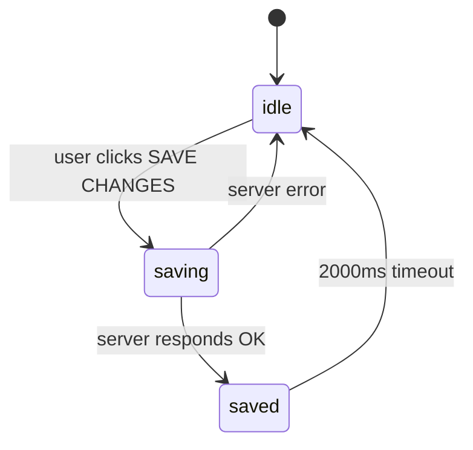
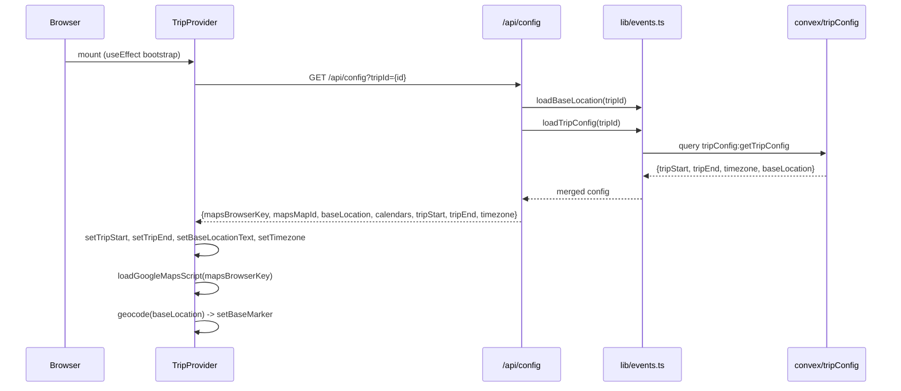
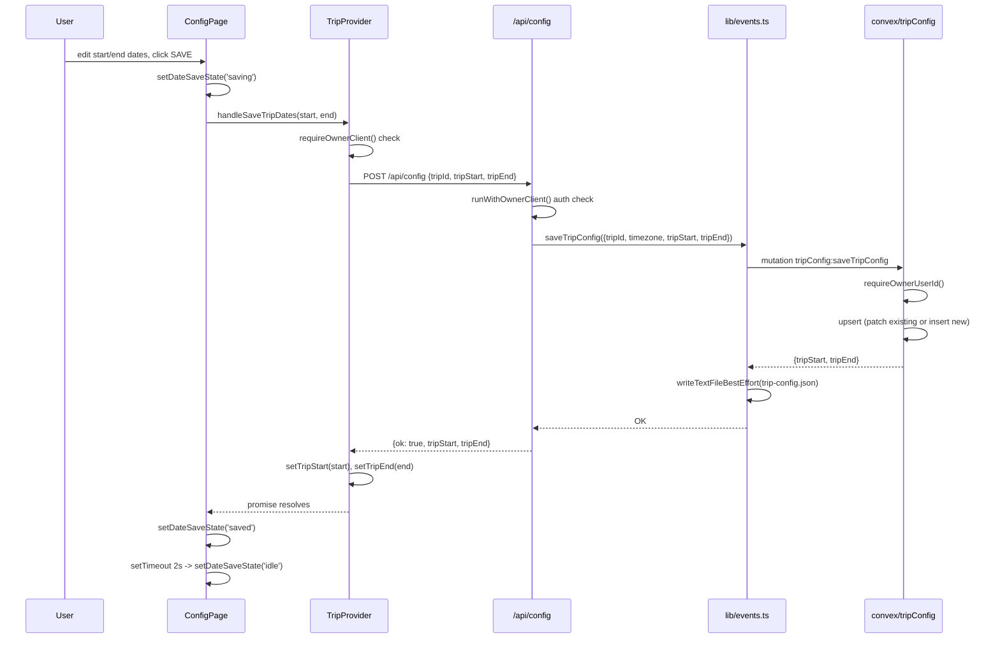

# Trip Configuration: Technical Architecture & Implementation

Document Basis: current code at time of generation.

---

## 1. Summary

**Purpose**: Trip Configuration manages four core settings that shape the entire trip planning experience: trip date range (start/end), timezone, base location (the traveler's home address during the trip), and Google Maps API key delivery. These settings drive the DayList date range, map initialization, route planning origin, calendar formatting, and crime heatmap time display.

**Current shipped scope**:
- Per-trip date range (`tripStart`, `tripEnd`) stored in Convex `tripConfig` table with file-system fallback.
- Per-trip timezone derived from the trip's city, overridable in `tripConfig`.
- Per-trip base location (free-text address) geocoded and placed as a map marker.
- Google Maps API keys (`GOOGLE_MAPS_BROWSER_KEY`, `GOOGLE_MAPS_MAP_ID`) served from server env vars, never stored in Convex.
- Legacy calendar URL delivery via `LUMA_CALENDAR_URLS` env var (returned in GET response, not persisted per-trip).
- Owner-only write access; members can read but not modify.

**Out of scope**:
- Per-user timezone overrides (timezone is trip-scoped, derived from city).
- Client-side Google Maps key management (keys are server-controlled only).
- Multi-leg per-trip date ranges (only a single start/end pair per trip).

---

## 2. Runtime Placement & Ownership

Trip configuration spans three runtime layers:

| Boundary | Owner | Runtime |
|---|---|---|
| Config UI form | `app/trips/[tripId]/config/page.tsx` | Client (React, browser) |
| Client-side state + persistence dispatch | `components/providers/TripProvider.tsx` | Client (React context) |
| REST API gateway | `app/api/config/route.ts` | Node.js (Next.js API route) |
| Server-side Convex read/write | `lib/events.ts` (`loadTripConfig`, `saveTripConfig`, `loadBaseLocation`, `saveBaseLocation`) | Node.js (server) |
| Database persistence + authorization | `convex/tripConfig.ts` (`getTripConfig`, `saveTripConfig`) | Convex serverless |
| Auth enforcement (API layer) | `lib/api-guards.ts`, `lib/request-auth.ts` | Node.js (server) |
| Auth enforcement (Convex layer) | `convex/authz.ts` (`requireOwnerUserId`, `requireAuthenticatedUserId`) | Convex serverless |

**Lifecycle**: Config is loaded during TripProvider bootstrap (once per app mount and once per trip switch). Writes go through `POST /api/config` and require owner role at both the client guard and Convex mutation layers.

---

## 3. Module/File Map

| File | Responsibility | Key Exports | Dependencies | Side Effects |
|---|---|---|---|---|
| `app/trips/[tripId]/config/page.tsx` | Config UI form (dates, base location, pair planner, sources) | `ConfigPage` (default) | `useTrip`, UI primitives | None |
| `components/providers/TripProvider.tsx` | Client state for `tripStart`, `tripEnd`, `baseLocationText`, `timezone`; dispatches saves | `handleSaveTripDates`, `handleSaveBaseLocation`, context value | `lib/helpers`, `lib/map-helpers` | `fetch('/api/config')`, geocoding, map marker placement |
| `app/api/config/route.ts` | REST GET/POST gateway for config | `GET`, `POST` | `lib/events`, `lib/api-guards` | Reads env vars, writes to Convex + filesystem |
| `lib/events.ts` | Server-side config CRUD (Convex + file fallback) | `loadTripConfig`, `saveTripConfig`, `loadBaseLocation`, `saveBaseLocation`, `getCalendarUrls` | `convex/browser`, `node:fs`, `convex-client-context` | File I/O to `data/trip-config.json` and `docs/my_location.md` |
| `convex/tripConfig.ts` | Convex query/mutation for `tripConfig` table | `getTripConfig` (query), `saveTripConfig` (mutation) | `convex/authz` | Database reads/writes |
| `convex/schema.ts` | Schema definition for `tripConfig` table | Schema object (lines 209-216) | Convex schema DSL | None |
| `lib/api-guards.ts` | Auth middleware for API routes | `runWithAuthenticatedClient`, `runWithOwnerClient` | `lib/request-auth`, `lib/convex-client-context` | Sets AsyncLocalStorage context |
| `convex/authz.ts` | Convex-level auth enforcement | `requireAuthenticatedUserId`, `requireOwnerUserId` | `@convex-dev/auth/server` | None |
| `lib/map-helpers.ts` | Google Maps script loader | `loadGoogleMapsScript` | None | DOM script injection |

---

## 4. State Model & Transitions

### 4.1 Database Schema

The `tripConfig` table (`convex/schema.ts:209-216`):

```typescript
tripConfig: defineTable({
  tripId: v.id('trips'),
  timezone: v.string(),
  tripStart: v.string(),
  tripEnd: v.string(),
  baseLocation: v.optional(v.string()),
  updatedAt: v.string()
}).index('by_trip', ['tripId'])
```

**Key constraints**:
- `tripId` is a foreign key to the `trips` table (Convex ID type).
- `timezone` is a required string (IANA format, e.g., `"America/Los_Angeles"`).
- `tripStart` and `tripEnd` are ISO date strings (`"YYYY-MM-DD"`) or empty strings.
- `baseLocation` is optional (free-text address).
- One `tripConfig` row per trip (enforced by upsert logic, indexed by `by_trip`).

### 4.2 Client State

In `TripProvider.tsx`, config lives as independent `useState` hooks:

| State Variable | Type | Default | Line |
|---|---|---|---|
| `tripStart` | `string` | `''` | 280 |
| `tripEnd` | `string` | `''` | 281 |
| `baseLocationText` | `string` | `''` | 260 |
| `timezone` | `string` | `'America/Los_Angeles'` | 294 |
| `baseLocationVersion` | `number` | `0` | 273 |

### 4.3 Config Save UI State Machine

The config form in `ConfigPage` tracks a 3-state save cycle per field group:



The `dateSaveState` variable (`config/page.tsx:41`) controls this cycle. The saved-to-idle transition uses a `setTimeout` of 2000ms (`config/page.tsx:124`).

### 4.4 Timezone Resolution Priority

Timezone is resolved through a cascade (higher priority first):

1. `tripConfig.timezone` from Convex (set when config is loaded, `TripProvider.tsx:1328`)
2. `activeCity.timezone` from the city record (`TripProvider.tsx:1311`)
3. Hardcoded default `'America/Los_Angeles'` (initial useState, `TripProvider.tsx:294`)

On trip switch, city timezone takes initial priority (`TripProvider.tsx:1707`), then the per-trip config overrides it (`TripProvider.tsx:1722`).

---

## 5. Interaction & Event Flow

### 5.1 Bootstrap Load Sequence



### 5.2 Save Trip Dates Flow



### 5.3 Save Base Location Flow

The base location save (`handleSaveBaseLocation`, `TripProvider.tsx:1660-1676`) follows the same pattern as dates but additionally:
1. Re-geocodes the new address via the Google Maps Geocoding API.
2. Updates the base map marker (`setBaseMarker`).
3. Increments `baseLocationVersion` to trigger route recalculation.

The POST body includes the current `tripStart` and `tripEnd` alongside `baseLocation` (`TripProvider.tsx:1668`), because the API route delegates to `saveTripConfig` which requires all fields.

---

## 6. Rendering / Layers / Motion

### 6.1 Config Page Layout

The config page (`config/page.tsx:196-339`) uses a two-column grid:

| Column | Sections |
|---|---|
| Left | ACCOUNT (email, sign out), TRIP CONFIG (start, end, base, save button) |
| Right | PAIR PLANNER, EVENT SOURCES |

Section headers use JetBrains Mono, 11px, weight 600, uppercase, `#737373` color, 1px letter-spacing (`config/page.tsx:186-193`).

### 6.2 Trip Config Card

The Trip Config card (`config/page.tsx:235-257`) contains:
- Three input rows with fixed-width labels (`w-16`): START (date), END (date), BASE (text).
- A full-width save button that shows three states: "SAVE CHANGES" / "Saving..." / checkmark + "Saved".
- A "Owner role required." notice when `canManageGlobal` is false.

### 6.3 Base Location Marker on Map

When base location is loaded or saved, it is geocoded and placed as a map marker (`TripProvider.tsx:1356-1357`). The label format is `"Base location: {address}"`. The `baseLocationVersion` counter (`TripProvider.tsx:273`) triggers route recalculation when the base location changes.

### 6.4 Animation

The save button transitions between states without explicit animation; it relies on the Button component's built-in transition. The 2000ms "Saved" display timeout is the only timed visual behavior.

---

## 7. API & Prop Contracts

### 7.1 GET /api/config

**Auth**: `runWithAuthenticatedClient` (any authenticated user).

**Query params**:
| Param | Type | Required | Description |
|---|---|---|---|
| `tripId` | string | No | Convex trip ID. If omitted, returns empty/default config. |

**Response** (`200 OK`):
```json
{
  "mapsBrowserKey": "AIza...",
  "mapsMapId": "abc123",
  "baseLocation": "1100 California St, SF",
  "calendars": ["https://luma.com/sf"],
  "tripStart": "2026-02-07",
  "tripEnd": "2026-02-14",
  "timezone": "America/Los_Angeles"
}
```

**Fallback chain for `tripStart`/`tripEnd`** (`route.ts:22-23`):
1. `tripConfig` row from Convex (per-trip).
2. `TRIP_START`/`TRIP_END` environment variables (global fallback).
3. Empty string.

**`mapsBrowserKey`** and **`mapsMapId`** are always read from `process.env` (`route.ts:18-19`), never from the database.

### 7.2 POST /api/config

**Auth**: `runWithOwnerClient` (owner role required).

**Request body**:
| Field | Type | Required | Description |
|---|---|---|---|
| `tripId` | string | Yes | Convex trip ID. Returns 400 if missing/empty. |
| `tripStart` | string | No | ISO date `YYYY-MM-DD`. |
| `tripEnd` | string | No | ISO date `YYYY-MM-DD`. |
| `timezone` | string | No | IANA timezone string. |
| `baseLocation` | string | No | Free-text address. Only saved if present in body. |

**Response** (`200 OK`): `{ "ok": true, "tripStart": "...", "tripEnd": "..." }`

**Error responses**:
- `400`: Missing `tripId` or validation error.
- `401`: Not authenticated.
- `403`: Not owner role.

### 7.3 Convex tripConfig:getTripConfig

**Args**: `{ tripId: Id<'trips'> }`
**Auth**: `requireAuthenticatedUserId` (any authenticated user).
**Returns**: `{ tripId, timezone, tripStart, tripEnd, baseLocation, updatedAt }` -- defaults to `{ timezone: 'UTC', tripStart: '', tripEnd: '', baseLocation: '', updatedAt: null }` when no row exists (`convex/tripConfig.ts:31`).

### 7.4 Convex tripConfig:saveTripConfig

**Args**: `{ tripId: Id<'trips'>, timezone?: string, tripStart: string, tripEnd: string, baseLocation?: string, updatedAt: string }`
**Auth**: `requireOwnerUserId` (owner only).
**Behavior**: Upsert -- patches existing row if any field changed, otherwise inserts new row (`convex/tripConfig.ts:83-93`). Skips the `db.patch` call entirely when no fields have changed (dirty-check optimization at line 84-87).

### 7.5 TripProvider Context Values (Config-Related)

| Value | Type | Description |
|---|---|---|
| `tripStart` | `string` | Current trip start date ISO |
| `tripEnd` | `string` | Current trip end date ISO |
| `baseLocationText` | `string` | Current base location address text |
| `timezone` | `string` | Active timezone (IANA) |
| `canManageGlobal` | `boolean` | `true` when `profile.role === 'owner'` |
| `handleSaveTripDates` | `(start, end) => Promise<void>` | Saves dates to server, updates local state |
| `handleSaveBaseLocation` | `(text) => Promise<void>` | Saves base location, geocodes, updates marker |

---

## 8. Reliability Invariants

These must remain true after any refactor:

1. **Owner-only writes**: Config mutations are guarded at three levels: client-side (`requireOwnerClient` in TripProvider), API route (`runWithOwnerClient`), and Convex (`requireOwnerUserId`). All three must pass for a write to succeed.

2. **Dual-write persistence**: `saveTripConfig` and `saveBaseLocation` in `lib/events.ts` write to both Convex and local filesystem (`data/trip-config.json`, `docs/my_location.md`). The file write uses `writeTextFileBestEffort` which silently skips on read-only filesystems (`lib/events.ts:67-85`).

3. **Read fallback chain**: `loadTripConfig` tries Convex first, then falls back to `data/trip-config.json` (`lib/events.ts:137-156`). `loadBaseLocation` tries Convex first, then `docs/my_location.md` (`lib/events.ts:101-119`).

4. **Upsert-not-duplicate**: The Convex mutation queries by `by_trip` index before deciding to patch or insert (`convex/tripConfig.ts:58-93`). There must be at most one `tripConfig` row per `tripId`.

5. **Dirty-check before patch**: The Convex mutation skips the `db.patch` call when no fields have actually changed (`convex/tripConfig.ts:84-88`), preventing unnecessary write operations.

6. **Maps key never persisted to DB**: `mapsBrowserKey` and `mapsMapId` are served from `process.env` only (`route.ts:18-19`), never stored in Convex or the filesystem.

7. **Timezone cascade**: City timezone is the initial value; per-trip config timezone overrides it. The client must apply both in order (`TripProvider.tsx:1311` then `1328`; and `1707` then `1722`).

8. **Date range drives DayList**: When `tripStart` and `tripEnd` are set, `uniqueDates` is computed from `buildISODateRange(tripStart, tripEnd)` (`TripProvider.tsx:358-359`), capped at 90 days (`lib/helpers.ts:220`). When unset, dates are derived from events and planner entries.

---

## 9. Edge Cases & Pitfalls

### 9.1 Empty tripId

If no `tripId` is passed to `GET /api/config`, the load functions receive `''` and skip the Convex query, falling back to file-based or env-var defaults (`lib/events.ts:104`, `140`). This can happen before any trip is created.

### 9.2 Base Location Requires Dates on Save

`handleSaveBaseLocation` sends the current `tripStart` and `tripEnd` in the POST body (`TripProvider.tsx:1668`) because the API route calls `saveTripConfig` which writes all fields. If dates are empty, they will be saved as empty strings, potentially clearing previously-set dates. The ConfigPage mitigates this by triggering both `onSaveDates` and `onSaveLocation` on the same button click (`config/page.tsx:251`).

### 9.3 Dev Auth Bypass

Both `convex/authz.ts:5` and `lib/request-auth.ts:5` have `DEV_BYPASS_AUTH = true`, bypassing all auth checks. This means the owner-only guard is effectively disabled in the current codebase state. This must be set to `false` before production deployment.

### 9.4 Calendar URLs Are Not Per-Trip

`getCalendarUrls()` reads from `LUMA_CALENDAR_URLS` env var (`lib/events.ts:87-92`) and is not trip-scoped. All trips share the same calendar URL list.

### 9.5 Timezone Initialization Race

On initial load, `timezone` defaults to `'America/Los_Angeles'` (`TripProvider.tsx:294`). The city timezone and then config timezone overwrite it asynchronously. Components rendering before the bootstrap completes will use the default timezone for any date formatting.

### 9.6 File Fallback on Read-Only Deployments

On platforms like Vercel (read-only filesystem), `writeTextFileBestEffort` silently skips file writes (`lib/events.ts:79-81`). The Convex write still succeeds, so Convex is the authoritative source. The file fallback only matters for local development or environments without Convex.

### 9.7 Date Range Cap

`buildISODateRange` caps at 90 days (`lib/helpers.ts:220`). If `tripEnd - tripStart > 90 days`, the DayList will truncate at 90 days with no user-facing warning.

---

## 10. Testing & Verification

### 10.1 Existing Test Coverage

| Test File | Scope | Runner |
|---|---|---|
| `lib/api-guards.test.mjs` | Auth guard short-circuit, owner enforcement | `node:test` |
| `lib/trip-provider-bootstrap.test.mjs` | Trip ID resolution priority (URL > localStorage > first trip), crime category weights | `node:test` (source-inspection tests) |
| `convex/authz.test.mjs` | Convex-level auth guards | Likely `node:test` |

**No direct unit tests exist for `convex/tripConfig.ts` or `lib/events.ts` config functions.**

### 10.2 Manual Verification Scenarios

**Scenario 1: Load config on app start**
1. Open the app with a valid trip.
2. Verify DayList shows dates matching `tripStart`-`tripEnd` range.
3. Verify map initializes with base location marker.

**Scenario 2: Save trip dates (owner)**
1. Navigate to Config tab.
2. Change start/end dates.
3. Click SAVE CHANGES.
4. Verify button shows "Saved" checkmark for ~2 seconds.
5. Verify DayList updates to new date range.

**Scenario 3: Save trip dates (member -- blocked)**
1. Sign in as a member (non-owner).
2. Navigate to Config tab.
3. Verify save button is disabled.
4. Verify "Owner role required." message is visible.

**Scenario 4: Save base location**
1. Enter a new address in the BASE field.
2. Click SAVE CHANGES.
3. Verify map marker moves to the new geocoded location.
4. Verify route recalculates (if a day plan has stops).

**Scenario 5: Trip switch reloads config**
1. Create two trips with different date ranges.
2. Switch between them via TripSelector.
3. Verify `tripStart`, `tripEnd`, `baseLocationText`, and `timezone` update per trip.

### 10.3 Command Checks

```bash
# Run existing API guard tests
node --test lib/api-guards.test.mjs

# Run bootstrap tests
node --test lib/trip-provider-bootstrap.test.mjs

# Run Convex auth tests
node --test convex/authz.test.mjs
```

---

## 11. Quick Change Playbook

| If you want to... | Edit... |
|---|---|
| Add a new config field (e.g., `currency`) | 1. `convex/schema.ts` (add field to `tripConfig` table). 2. `convex/tripConfig.ts` (add to validators, query return, mutation args/handling). 3. `lib/events.ts` (`loadTripConfig`, `saveTripConfig` functions). 4. `app/api/config/route.ts` (add to GET response, POST body parsing). 5. `TripProvider.tsx` (add state, wire into context). 6. `config/page.tsx` (add UI input). |
| Change the default timezone | `TripProvider.tsx:294` (client default), `convex/tripConfig.ts:31` (Convex default for missing rows). |
| Make config editable by members (not just owners) | Change `runWithOwnerClient` to `runWithAuthenticatedClient` in `app/api/config/route.ts:29`. Change `requireOwnerUserId` to `requireAuthenticatedUserId` in `convex/tripConfig.ts:56`. Remove the `canManageGlobal` guard on the save button in `config/page.tsx:251`. |
| Remove the file-system fallback | Delete `writeTextFileBestEffort` calls and file reads in `lib/events.ts` functions `loadTripConfig`, `saveTripConfig`, `loadBaseLocation`, `saveBaseLocation`. |
| Change the date range cap | Edit `MAX_DAYS` constant in `lib/helpers.ts:220` (currently `90`). |
| Add a new Google Maps env var | Add to `.env.example`, read from `process.env` in `app/api/config/route.ts` GET handler, consume in `TripProvider.tsx` bootstrap. |
| Change the save-confirmation timeout | Edit the `2000` ms value in `config/page.tsx:124` (dates) and `config/page.tsx:137` (location). |
| Make timezone user-editable in the UI | Add a timezone select/input to `config/page.tsx`, pass the value to `handleSaveTripDates` or a new handler, include it in the POST body to `/api/config`. |

---

## Appendix: Environment Variables

| Variable | Required | Used By | Description |
|---|---|---|---|
| `GOOGLE_MAPS_BROWSER_KEY` | Yes (for map) | `app/api/config/route.ts:18` | Google Maps JavaScript API key, served to client |
| `GOOGLE_MAPS_MAP_ID` | No | `app/api/config/route.ts:19` | Cloud-styled map ID for Advanced Markers |
| `TRIP_START` | No | `app/api/config/route.ts:22` | Global fallback trip start date (legacy) |
| `TRIP_END` | No | `app/api/config/route.ts:23` | Global fallback trip end date (legacy) |
| `LUMA_CALENDAR_URLS` | No | `lib/events.ts:88` | Comma-separated calendar URLs returned in GET |
| `CONVEX_URL` / `NEXT_PUBLIC_CONVEX_URL` | Yes | `lib/events.ts:608` | Convex deployment URL for server-side client |
