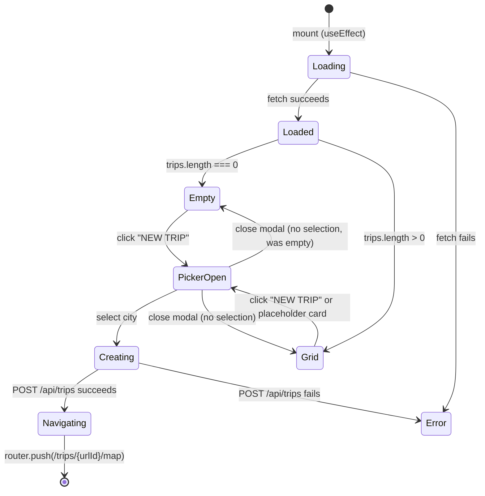
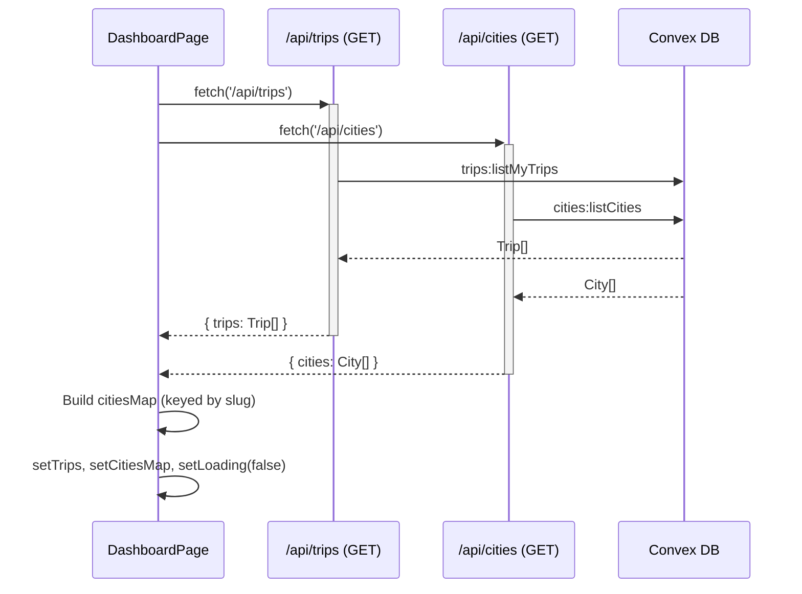
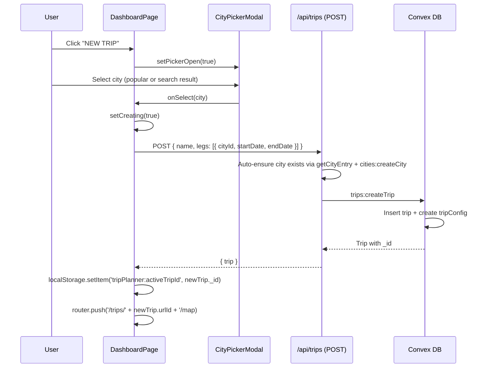

# Trip Dashboard: Technical Architecture & Implementation

**Document Basis**: current code at time of generation.

---

## 1. Summary

The Trip Dashboard is the authenticated landing page where users view all their trips, create new trips via a city picker modal, and navigate into individual trip planning views. It is a standalone page at `/dashboard` that fetches trips and cities from Next.js API routes backed by Convex serverless functions.

**Current shipped scope:**
- Grid display of trip cards with multi-leg badge visualization
- Loading, error, and empty states (inline, not using shared `EmptyState`/`ErrorState` components)
- City picker modal for trip creation with popular destinations and search
- Trip creation via `POST /api/trips` with auto-provisioning of city records
- Navigation to `/trips/{urlId}/map` with `localStorage` persistence of active trip ID

**Out of scope (not implemented):**
- Trip deletion or editing from the dashboard
- Trip reordering or sorting controls
- Trip sharing/collaboration initiation from the dashboard
- Image/cover display on trip cards (schema has no image field)

---

## 2. Runtime Placement & Ownership

The dashboard page is mounted at `/dashboard` as a standalone Next.js App Router page. It does **not** use the `AppShell` layout or `TripProvider` -- it has its own self-contained header, data fetching, and state management.

**Route protection:** The middleware at `middleware.ts:8-9` protects `/dashboard(.*)` routes. Authenticated users hitting `/signin` are redirected to `/dashboard` (`middleware.ts:24-26`). Unauthenticated users hitting `/dashboard` are redirected to `/signin` (`middleware.ts:36-38`).

**Lifecycle boundary:** The dashboard is a `'use client'` component (`app/dashboard/page.tsx:1`) that manages its own fetch-on-mount lifecycle. It does not participate in Convex real-time subscriptions -- it uses plain `fetch()` calls to REST API routes.

**Post-navigation handoff:** When a user clicks a trip card, the dashboard writes the trip ID to `localStorage` under key `tripPlanner:activeTripId` and navigates to `/trips/{urlId}/map` (`app/dashboard/page.tsx:89-91`). The `TripProvider` then picks up this ID (URL param takes priority over localStorage) to bootstrap the planning view.

---

## 3. Module/File Map

| File | Responsibility | Key Exports | Dependencies | Side Effects |
|------|---------------|-------------|--------------|--------------|
| `app/dashboard/page.tsx` | Dashboard page component | `DashboardPage` (default) | `CityPickerModal`, `Avatar`, `mock-data.formatTripDateRange` | Fetches `/api/trips` + `/api/cities` on mount; writes to `localStorage` |
| `components/CityPickerModal.tsx` | City selection modal for trip creation | `CityPickerModal` | `Modal`, `Google Places predictions`, `Google Places predictions` | None |
| `components/ui/modal.tsx` | Generic portal-based modal | `Modal` | `react-dom/createPortal`, `lucide-react/X` | Portal into `document.body`; `keydown` listener for Escape |
| `components/ui/avatar.tsx` | User avatar circle with initial | `Avatar` | None | None |
| `lib/mock-data.ts` | Static city data + date formatting | `MockTrip`, `SelectedCity`, `MOCK_TRIPS`, `Google Places predictions`, `Google Places predictions`, `formatTripDateRange` | None | None |
| `lib/city-registry.ts` | Authoritative city metadata registry | `CityEntry`, `getCityEntry`, `getAllCityEntries` | None | None |
| `app/api/trips/route.ts` | REST handler for trip CRUD | `GET`, `POST` | `request-auth`, `city-registry`, Convex `trips:*` | Auto-creates city records in Convex on trip creation |
| `app/api/cities/route.ts` | REST handler for city listing/creation | `GET`, `POST` | `request-auth`, Convex `cities:*` | None |
| `convex/trips.ts` | Convex trip queries/mutations | `listMyTrips`, `getTrip`, `createTrip`, `updateTrip`, `deleteTrip` | `convex/authz` | Creates `tripConfig` on trip creation; cascading delete |
| `convex/cities.ts` | Convex city queries/mutations | `listCities`, `getCity`, `createCity`, `updateCity` | `convex/authz` | None |
| `convex/schema.ts` | Database schema definitions | Schema for `trips`, `cities`, `tripConfig` | Convex | None |
| `convex/seed.ts` | City seed data for initial setup | `seedInitialData`, `seedInitialDataInternal` | `convex/authz` | Inserts default cities |
| `middleware.ts` | Auth route protection | Middleware function | `@convex-dev/auth/nextjs/server` | Redirects based on auth state |
| `lib/request-auth.ts` | Server-side auth client factory | `requireAuthenticatedClient`, `requireOwnerClient` | `@convex-dev/auth`, `convex/browser` | None |
| `lib/dashboard.test.mjs` | Dashboard structural tests | Test suite | `node:test`, `node:fs` | None |
| `components/TripSelector.tsx` | In-app trip/city leg switcher dropdown | `TripSelector` (default) | `TripProvider` | `mousedown` listener for click-outside |

---

## 4. State Model & Transitions

The dashboard uses React `useState` hooks for five state variables (`app/dashboard/page.tsx:52-57`):

| State Variable | Type | Initial | Purpose |
|---|---|---|---|
| `pickerOpen` | `boolean` | `false` | Controls CityPickerModal visibility |
| `trips` | `Trip[]` | `[]` | Loaded trips from API |
| `citiesMap` | `Record<string, City>` | `{}` | City lookup by slug |
| `loading` | `boolean` | `true` | Data fetch in progress |
| `creating` | `boolean` | `false` | Trip creation in progress (guards double-submit) |
| `error` | `string` | `''` | Error message to display |



**Guard:** The `creating` flag prevents double-submission (`app/dashboard/page.tsx:94`). Once `handleCitySelect` is invoked, further calls are no-ops until the current request completes.

**Cleanup:** The `useEffect` uses a `mounted` flag to prevent state updates after unmount (`app/dashboard/page.tsx:60, 85`).

---

## 5. Interaction & Event Flow

### Trip Loading (on mount)



### Trip Creation (city select)



**Default date range for new trips:** Today through today+3 days (`app/dashboard/page.tsx:97-99`). The `startDate` is `new Date().toISOString().slice(0, 10)` and `endDate` is 3 days later.

---

## 6. Rendering / Layers / Motion

### Page Layout

The dashboard renders as a full-viewport column layout with two regions:

1. **Header bar** (`app/dashboard/page.tsx:124-152`): Fixed height `min-h-[52px]`, dark background `#080808`, contains branding "TRIP PLANNER", active tab indicator "TRIPS" with green underline, and Avatar.

2. **Content area** (`app/dashboard/page.tsx:155-367`): Scrollable (`overflow-y-auto`), max-width `1200px`, centered with `px-16 py-12` padding.

### Trip Card Grid

- Grid uses CSS Grid with `repeat(auto-fill, minmax(340px, 1fr))` and `gap: 20px` (`app/dashboard/page.tsx:251`).
- Each card has dark background `#111111`, border `1px solid #1E1E1E`, and `hover:border-[#00E87B]` transition.
- Cards are `<button>` elements for full-card click navigation.
- A dashed-border placeholder card ("Create new trip") always appears at the end of the grid (`app/dashboard/page.tsx:344-365`).

### Leg Color Badges

Leg badges use a rotating color palette with 6 colors (`app/dashboard/page.tsx:31`):

| Index | Color | Usage |
|---|---|---|
| 0 | `#00E87B` | Green (accent) |
| 1 | `#3B82F6` | Blue |
| 2 | `#A855F7` | Purple |
| 3 | `#F59E0B` | Amber |
| 4 | `#EF4444` | Red |
| 5 | `#06B6D4` | Cyan |

Badge styling uses the color at 100% for text, `${color}18` (hex alpha ~9%) for background, and `${color}40` (hex alpha ~25%) for border (`app/dashboard/page.tsx:326-328`).

### Modal Layering

The `CityPickerModal` renders via `Modal` which uses `createPortal` into `document.body` at `z-50` (`components/ui/modal.tsx:30`). Overlay background is `rgba(0,0,0,0.7)`. Modal body max-width is `560px`, max-height `720px`.

### Typography

Two font families are used throughout the dashboard:
- **Space Grotesk** (`--font-space-grotesk`): Headers, trip names, branding
- **JetBrains Mono** (`--font-jetbrains`): Labels, metadata, badges, buttons

### Animation

- Trip cards: `transition-all duration-200` on border color hover (`app/dashboard/page.tsx:262`)
- Loading spinner: Lucide `Loader2` with `animate-spin` class (`app/dashboard/page.tsx:207`)
- No page-entry animations on the dashboard itself

---

## 7. API & Prop Contracts

### Dashboard Page Interfaces (app/dashboard/page.tsx:10-29)

```typescript
interface TripLeg {
  cityId: string;     // matches city.slug
  startDate: string;  // ISO date "YYYY-MM-DD"
  endDate: string;    // ISO date "YYYY-MM-DD"
}

interface Trip {
  _id: string;        // Convex document ID
  name: string;
  legs: TripLeg[];
  createdAt: string;  // ISO datetime
  updatedAt: string;  // ISO datetime
}

interface City {
  _id: string;        // Convex document ID
  slug: string;       // URL-safe identifier
  name: string;       // Display name
  timezone: string;   // IANA timezone
}
```

### CityPickerModal Props (components/CityPickerModal.tsx:8-12)

```typescript
interface CityPickerModalProps {
  open: boolean;
  onClose: () => void;
  onSelect?: (city: SelectedCity) => void;
}
```

### REST API: GET /api/trips

- **Auth:** `requireAuthenticatedClient()` -- returns 401 if unauthenticated
- **Response:** `{ trips: Trip[] }` -- sorted by `updatedAt` descending (`convex/trips.ts:32`)

### REST API: POST /api/trips

- **Auth:** `requireAuthenticatedClient()`
- **Body:** `{ name: string, legs: TripLeg[] }`
- **Side effect:** Auto-creates city records in Convex if they exist in `city-registry.ts` but not in the DB (`app/api/trips/route.ts:39-56`)
- **Validation:** Trip must have at least one leg (`convex/trips.ts:69-71`)
- **Response:** `{ trip: Trip }` on success; `{ error: string }` on failure

### REST API: GET /api/cities

- **Auth:** `requireAuthenticatedClient()`
- **Response:** `{ cities: City[] }` -- sorted alphabetically by name (`convex/cities.ts:33`)

### Convex: trips:createTrip Side Effects

When a trip is created (`convex/trips.ts:59-105`):
1. Trip document inserted with `userId`, `name`, `legs`, timestamps
2. A `tripConfig` document is auto-created with timezone from the first leg's city and date range spanning all legs
3. If city slug not found in DB, timezone defaults to `'UTC'` (`convex/trips.ts:91`)

### Key Helper Functions (app/dashboard/page.tsx)

| Function | Line | Purpose |
|---|---|---|
| `getCityDisplayName(cityId, citiesMap)` | 33-35 | Resolves city slug to display name, falls back to slug |
| `getTripDateRange(legs)` | 37-42 | Extracts earliest start and latest end across all legs |
| `getTripSubtitle(legs, citiesMap)` | 44-48 | Generates "Multi-leg . N cities . TZ1 / TZ2" for multi-leg trips, returns null for single-leg |
| `formatTripDateRange(start, end)` | `lib/mock-data.ts:75-80` | Formats date range as "Mon DD, YYYY -- Mon DD, YYYY" using `Intl.DateTimeFormat` |

---

## 8. Reliability Invariants

These are deterministic truths that must remain true after refactors:

1. **Trip ID persistence:** Clicking a trip card must write `trip._id` (Convex document ID, not mock ID) to `localStorage` key `tripPlanner:activeTripId` before navigation (`app/dashboard/page.tsx:89`).

2. **Navigation target:** Trip click navigates to `/trips/{urlId}/map` -- the URL param is the primary mechanism for `TripProvider` to resolve the active trip.

3. **Minimum one leg:** Trip creation enforces at least one leg at the Convex layer (`convex/trips.ts:69-71`). The dashboard always sends exactly one leg on creation.

4. **City auto-provisioning:** `POST /api/trips` auto-creates city records from the `city-registry.ts` registry if they do not exist in Convex (`app/api/trips/route.ts:39-56`). This means the first trip for a new city bootstraps that city's database record.

5. **Unmount safety:** The `useEffect` cleanup sets `mounted = false` to prevent state updates on unmounted component (`app/dashboard/page.tsx:60, 85`).

6. **Double-submit guard:** The `creating` state prevents concurrent trip creation requests (`app/dashboard/page.tsx:94`).

7. **Cities keyed by slug:** The `citiesMap` is built with `city.slug` as key, not `city._id` (`app/dashboard/page.tsx:74`). Leg `cityId` values must match city slugs.

8. **Trip sort order:** Trips returned from API are sorted by `updatedAt` descending -- most recently updated first (`convex/trips.ts:32`).

---

## 9. Edge Cases & Pitfalls

### Mock Data Coupling

`CityPickerModal` imports `Google Places predictions` and `Google Places predictions` from `lib/mock-data.ts` (`components/CityPickerModal.tsx:6`). These are static arrays, not fetched from the API. A city selected from "Popular Destinations" may not have a matching entry in `city-registry.ts`, which would cause the auto-provisioning in `POST /api/trips` to skip (`app/api/trips/route.ts:42` -- `if (!cityEntry) continue`). However, `createTrip` in Convex would still succeed; the `tripConfig` timezone would fall back to `'UTC'` if the city doesn't exist in the DB.

**Available cities in city-registry vs mock-data:**
- Registry (`lib/city-registry.ts`): san-francisco, new-york, los-angeles, chicago, london, tokyo, paris, barcelona (8 cities)
- Popular destinations (`lib/mock-data.ts`): san-francisco, london, tokyo, paris (4 cities, all in registry)
- Search suggestions (`lib/mock-data.ts`): new-york, barcelona (2 cities, both in registry)

All mock cities have matching registry entries, so auto-provisioning works for all currently listed cities.

### CityPickerModal "ADD DESTINATION" Button Behavior

The footer "ADD DESTINATION" button selects `filtered[0]` -- the first search result -- regardless of what the user may have visually selected (`components/CityPickerModal.tsx:53`). Individual city buttons in the popular and search sections call `onSelect` directly on click, so the footer button is effectively a "confirm first result" shortcut.

### Empty City Slug

If a city slug from mock data doesn't match any entry in `citiesMap` (built from `/api/cities` response), `getCityDisplayName` falls back to displaying the raw `cityId` slug string (`app/dashboard/page.tsx:34`).

### No Real-Time Updates

The dashboard fetches data once on mount and does not subscribe to Convex real-time updates. If another tab/user creates or modifies trips, the dashboard won't reflect changes until a full page reload.

### Error State is Not Dismissible

Once `error` is set, it displays permanently (no retry button, no dismiss). The only recovery is page reload.

### Trip Card Name Fallback

If `trip.name` is falsy, the card title falls back to joining all leg city names with ` -> ` arrows (`app/dashboard/page.tsx:255`). Since `createTrip` in Convex defaults to `'Untitled Trip'` when name is empty (`convex/trips.ts:75`), this fallback would only trigger if the name field were explicitly set to empty string post-creation.

---

## 10. Testing & Verification

### Automated Tests

**File:** `lib/dashboard.test.mjs` -- 13 structural tests using `node:test` + `node:assert/strict`.

These are **static analysis tests** that read the source file as text and assert the presence of key patterns:

| Test | What it verifies |
|---|---|
| `source file exists and is readable` | File exists at expected path |
| `fetches from /api/trips and /api/cities` | Uses `fetch('/api/trips')` and `fetch('/api/cities')` |
| `does not import MOCK_TRIPS for rendering` | No `MOCK_TRIPS` usage (uses real API) |
| `stores active trip id in localStorage on click` | Uses `localStorage.setItem('tripPlanner:activeTripId'` |
| `navigates to /planning with trip id param` | Contains `/trips/` |
| `uses real trip._id not mock id` | References `trip._id`, not `trip.id}` |
| `has loading state` | Contains `loading` and `Loader2`/`animate-spin` |
| `has error state` | Contains `error` and `Failed to load trips` |
| `has empty state` | Contains `trips.length === 0` and `No trips yet` |
| `cleans up on unmount` | Contains `mounted = false` |
| `passes onSelect to CityPickerModal` | Contains `onSelect=` |
| `creates trip via POST /api/trips on city select` | Contains `fetch('/api/trips'` with `method: 'POST'` |
| `sends legs with cityId, startDate, endDate` | Contains `cityId:`, `startDate`, `endDate` |
| `navigates to new trip after creation` | Contains `newTrip._id` |

**Run command:**
```bash
node --test lib/dashboard.test.mjs
```

**Related test file:** `lib/trip-provider-bootstrap.test.mjs` -- Tests that `TripProvider` correctly resolves trip ID from URL params, localStorage, or first trip fallback. Validates the handoff contract between dashboard and planning view.

### Manual Verification Scenarios

1. **Load with no trips:** Sign in with a new user account. Dashboard should show empty state with "No trips yet" message and "NEW TRIP" button.
2. **Create trip:** Click "NEW TRIP", select a popular destination. Verify redirect to `/trips/{urlId}/map` and `localStorage` contains the new trip ID.
3. **Multi-leg display:** Create a trip with multiple legs (via API or Convex dashboard). Verify subtitle shows "Multi-leg . N cities" and colored leg badges render.
4. **Trip click navigation:** Click an existing trip card. Verify navigation to `/trips/{urlId}/map`.
5. **Error handling:** Disconnect network or stop Convex. Reload dashboard. Verify error message appears.
6. **Auth redirect:** Access `/dashboard` while unauthenticated. Verify redirect to `/signin`.

---

## 11. Quick Change Playbook

| If you want to... | Edit... |
|---|---|
| Add a new city to the picker | Add entry to `Google Places predictions` or `Google Places predictions` in `lib/mock-data.ts`, and add matching entry to `lib/city-registry.ts` for auto-provisioning |
| Change the trip card grid layout | Modify `gridTemplateColumns` at `app/dashboard/page.tsx:251` |
| Change leg badge colors | Modify `LEG_COLORS` array at `app/dashboard/page.tsx:31` |
| Change default new trip date range | Modify the `3 * 86400000` calculation at `app/dashboard/page.tsx:99` |
| Add trip deletion to the dashboard | Wire up `convex/trips.ts:deleteTrip` via a new `DELETE` handler in `app/api/trips/route.ts` |
| Make dashboard real-time | Replace `fetch()` calls with Convex `useQuery()` hooks (requires wrapping in `ConvexProvider`) |
| Add trip cover images | Add `imageUrl` field to trips schema (`convex/schema.ts:32-44`), update `createTrip`/`updateTrip`, render in card |
| Change the modal close behavior | Edit `components/ui/modal.tsx` -- Escape key handler at line 20, overlay click at line 32 |
| Change navigation target after trip click | Edit `handleTripClick` at `app/dashboard/page.tsx:88-91` |
| Add trip search/filter | Add filter state and UI above the grid in `app/dashboard/page.tsx:250`, filter `trips` array before `.map()` |
| Change auth protection for dashboard | Edit `isProtectedRoute` matcher in `middleware.ts:8-15` |
| Add new seed cities | Add entries to `SEED_CITIES` in `convex/seed.ts` and matching entries in `lib/city-registry.ts` |
| Change the multi-leg subtitle format | Edit `getTripSubtitle` at `app/dashboard/page.tsx:44-48` |
