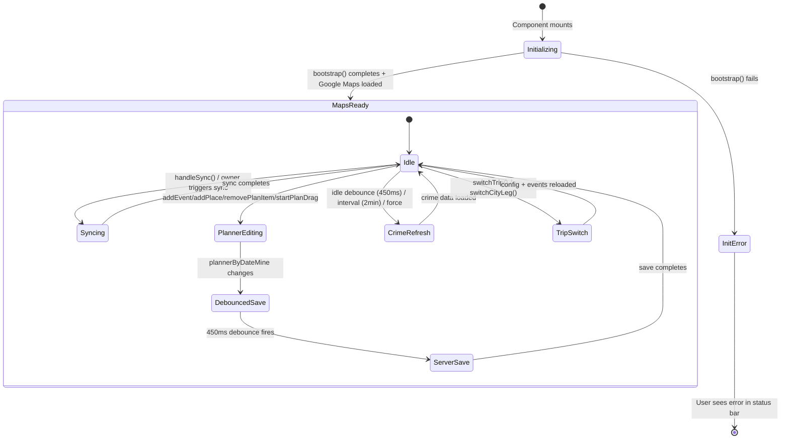
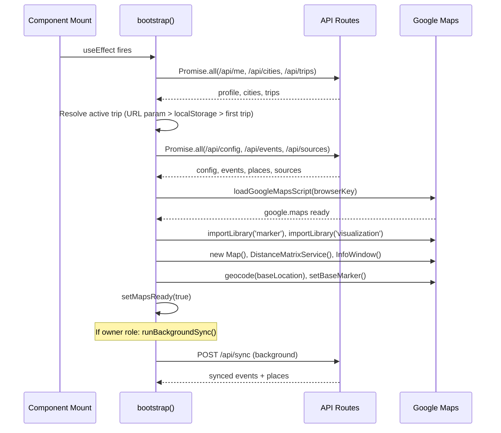
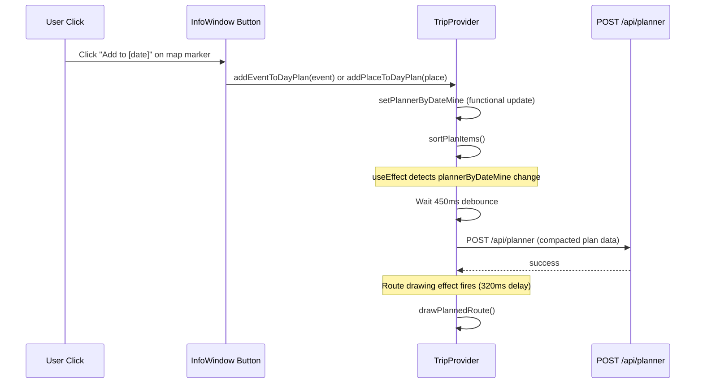
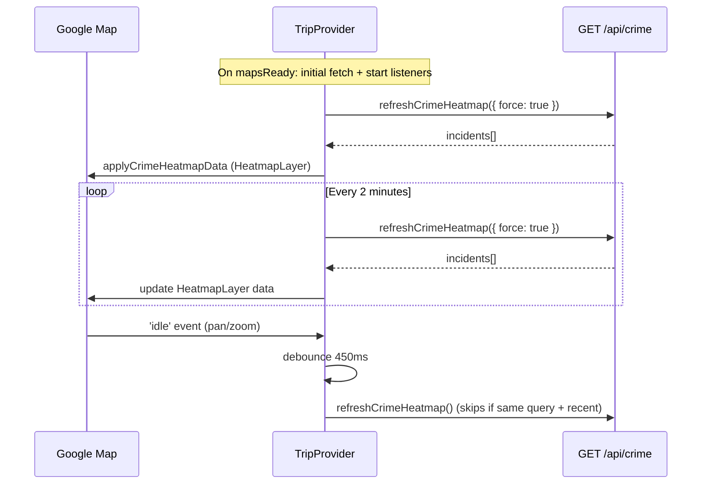

# Trip Provider State Management: Technical Architecture & Implementation

**Document Basis:** current code at time of generation.

---

## 1. Summary

TripProvider is the monolithic React context that owns **all client-side trip state** for the application. It is a single `'use client'` component (`components/providers/TripProvider.tsx`, 1805 lines) that wraps every protected route and exposes ~100 context properties via `useTrip()`.

### Current shipped scope

| Domain | What it manages |
|---|---|
| **Auth** | Auth loading, sign-out, user profile, role-based access (`owner` vs member) |
| **Trip/City selection** | Multi-trip + multi-city switching, localStorage persistence, URL param resolution |
| **Events & spots** | Loading, syncing, filtering, geocoding, travel time enrichment |
| **Planner** | Day-plan CRUD, drag-to-move/resize, iCal/Google Calendar export, server persistence with debounced saves |
| **Pair rooms** | Create/join/select shared planner rooms, merged/mine/partner view modes |
| **Map** | Google Maps initialization, marker management, route polylines, info windows, region polygons |
| **Crime heatmap** | Periodic + idle-triggered crime data fetch, weighted heatmap rendering, strength profiles |
| **Calendar** | Date selection, month navigation, date-range derivation from trip config |
| **Sources** | CRUD for event/spot data sources (owner-only) |
| **Status bar** | Global status message + error flag |

### Out of scope

- Convex real-time subscriptions (handled by `ConvexClientProvider` at a higher level)
- Authentication flow (handled by `@convex-dev/auth` and the `/signin` page)
- Rendering of individual UI components (handled by consumers)

---

## 2. Runtime Placement & Ownership

### Provider hierarchy

```
ConvexAuthNextjsProvider  (components/providers/ConvexClientProvider.tsx)
  └── TripProvider        (components/providers/TripProvider.tsx)
        └── AppShell      (components/AppShell.tsx)
              └── Tab pages (planning, spots, calendar, config, map)
```

### Mount point

TripProvider is mounted in `app/trips/layout.tsx:6`:

```tsx
export default function TabsLayout({ children }) {
  return (
    <TripProvider>
      <AppShell>{children}</AppShell>
    </TripProvider>
  );
}
```

This means TripProvider wraps **all protected tab routes** but **not** the landing page, sign-in page, or dashboard.

### Lifecycle boundaries

- **Created** when user navigates to any `/trips/[tripId]/*` route.
- **Destroyed** when user navigates away from `/trips/[tripId]` (e.g., to `/dashboard` or `/signin`).
- The bootstrap effect runs once on mount, loading profile, cities, trips, config, events, places, and initializing Google Maps.
- Cleanup on unmount clears all map markers, route polylines, base markers, and crime heatmap timers.

---

## 3. Module/File Map

| File | Responsibility | Key exports | Dependencies | Side effects |
|---|---|---|---|---|
| `components/providers/TripProvider.tsx` | Monolithic state provider | `TripProvider` (default), `useTrip()`, `getTagColor()`, `getTagIconComponent()`, `TAG_COLORS` | `@convex-dev/auth`, `convex/react`, `lucide-react`, `lib/helpers`, `lib/planner-helpers`, `lib/map-helpers`, `lib/security` | Google Maps script loading, DOM manipulation (markers, info windows), `localStorage`, `fetch` calls to API routes, `setInterval`/`setTimeout` timers |
| `lib/helpers.ts` | Date/string/formatting utilities | `normalizePlaceTag`, `normalizeDateKey`, `toISODate`, `buildISODateRange`, `fetchJson`, etc. | None | None |
| `lib/planner-helpers.ts` | Planner data logic | `createPlanId`, `sortPlanItems`, `sanitizePlannerByDate`, `compactPlannerByDate`, `parseEventTimeRange`, `getSuggestedPlanSlot`, `buildPlannerIcs`, `buildGoogleCalendarStopUrls`, `MAX_ROUTE_STOPS` | `lib/helpers` | None |
| `lib/map-helpers.ts` | Map marker/icon construction, route requests | `createLucidePinIcon`, `createLucidePinIconWithLabel`, `toCoordinateKey`, `createTravelTimeCacheKey`, `requestPlannedRoute`, `loadGoogleMapsScript`, `buildInfoWindowAddButton` | `lib/helpers` | DOM element creation |
| `lib/security.ts` | URL sanitization | `getSafeExternalHref` | None | None |
| `app/api/planner/route.ts` | Planner persistence API | GET (load), POST (save) | `lib/request-auth`, `lib/planner-api` | Convex queries/mutations |
| `app/api/pair/route.ts` | Pair room API | GET (list), POST (create/join) | `lib/request-auth`, `lib/pair-api` | Convex mutations |
| `app/api/sync/route.ts` | Event sync API (owner-only) | POST | `lib/events`, `lib/api-guards` | External data ingestion |
| `app/api/crime/route.ts` | Crime data API | GET | `lib/crime-cities`, `lib/security` | External crime data fetch |
| `app/api/config/route.ts` | Trip config API | GET, POST | `lib/request-auth` | Convex queries/mutations |
| `app/api/sources/route.ts` | Data sources CRUD API | GET, POST, PATCH, DELETE | `lib/request-auth` | Convex mutations |
| `components/providers/ConvexClientProvider.tsx` | Convex + auth React wrapper | `ConvexClientProvider` (default) | `convex/react`, `@convex-dev/auth/nextjs` | Convex WebSocket connection |

---

## 4. State Model & Transitions

### 4.1 State variables (all `useState` calls)

TripProvider declares **47 `useState` hooks** and **17 `useRef` hooks**. Below are the state variables grouped by domain.

#### App lifecycle

| Variable | Type | Initial | Purpose | Defined at |
|---|---|---|---|---|
| `status` | `string` | `'Loading trip map...'` | Global status bar message | `:248` |
| `statusError` | `boolean` | `false` | Whether status is an error | `:249` |
| `mapsReady` | `boolean` | `false` | Google Maps fully initialized | `:252` |
| `isInitializing` | `boolean` | `true` | Bootstrap in progress | `:262` |
| `isSyncing` | `boolean` | `false` | Background sync in flight | `:261` |

#### Auth & profile

| Variable | Type | Initial | Purpose | Defined at |
|---|---|---|---|---|
| `profile` | `any \| null` | `null` | User profile from `/api/me` | `:285` |
| `authUserId` | `string` | `''` | Authenticated user ID | `:286` |
| `isSigningOut` | `boolean` | `false` | Sign-out in progress | `:288` |

#### Trip & city

| Variable | Type | Initial | Purpose | Defined at |
|---|---|---|---|---|
| `currentTripId` | `string` | `''` | Active trip ID | `:289` |
| `currentCityId` | `string` | `''` | Active city slug | `:290` |
| `trips` | `any[]` | `[]` | All trips for user | `:291` |
| `cities` | `any[]` | `[]` | All available cities | `:292` |
| `currentCity` | `any \| null` | `null` | Full city object | `:293` |
| `timezone` | `string` | `'America/Los_Angeles'` | Active timezone | `:294` |
| `tripStart` | `string` | `''` | Trip start ISO date | `:280` |
| `tripEnd` | `string` | `''` | Trip end ISO date | `:281` |
| `baseLocationText` | `string` | `''` | Home/hotel address text | `:260` |
| `baseLocationVersion` | `number` | `0` | Bumped to trigger route redraw | `:273` |

#### Events & spots

| Variable | Type | Initial | Purpose | Defined at |
|---|---|---|---|---|
| `allEvents` | `any[]` | `[]` | All loaded events | `:253` |
| `allPlaces` | `any[]` | `[]` | All loaded curated places | `:254` |
| `visibleEvents` | `any[]` | `[]` | Events after date filter + enrichment | `:255` |
| `visiblePlaces` | `any[]` | `[]` | Places after tag filter + enrichment | `:256` |
| `selectedDate` | `string` | `''` | Currently selected ISO date | `:257` |
| `showAllEvents` | `boolean` | `true` | Show all dates or only selected | `:258` |
| `placeTagFilter` | `string` | `'all'` | Active spot tag filter | `:263` |
| `hiddenCategories` | `Set<string>` | `new Set()` | Map layer visibility toggles | `:264` |

#### Planner

| Variable | Type | Initial | Purpose | Defined at |
|---|---|---|---|---|
| `plannerByDateMine` | `Record<string, any[]>` | `{}` | User's own plan items by date | `:267` |
| `plannerByDatePartner` | `Record<string, any[]>` | `{}` | Partner's plan items (pair mode) | `:268` |
| `plannerViewMode` | `string` | `'merged'` | `'merged' \| 'mine' \| 'partner'` | `:269` |
| `activePlanId` | `string` | `''` | ID of item being dragged | `:270` |
| `routeSummary` | `string` | `''` | Current route summary text | `:271` |
| `isRouteUpdating` | `boolean` | `false` | Route polyline recalculation in flight | `:272` |

#### Pair rooms

| Variable | Type | Initial | Purpose | Defined at |
|---|---|---|---|---|
| `currentPairRoomId` | `string` | `''` | Active pair room code | `:282` |
| `pairRooms` | `any[]` | `[]` | User's pair rooms | `:283` |
| `pairMemberCount` | `number` | `1` | Members in current pair room | `:284` |
| `isPairActionPending` | `boolean` | `false` | Create/join in flight | `:287` |

#### Sources

| Variable | Type | Initial | Purpose | Defined at |
|---|---|---|---|---|
| `sources` | `any[]` | `[]` | Data sources list | `:274` |
| `newSourceType` | `string` | `'event'` | Form: source type | `:275` |
| `newSourceUrl` | `string` | `''` | Form: source URL | `:276` |
| `newSourceLabel` | `string` | `''` | Form: source label | `:277` |
| `isSavingSource` | `boolean` | `false` | Source save in flight | `:278` |
| `syncingSourceId` | `string` | `''` | Source currently syncing | `:279` |

#### Crime heatmap

| Variable | Type | Initial | Purpose | Defined at |
|---|---|---|---|---|
| `crimeLayerMeta` | `CrimeLayerMeta` | `{ loading: false, count: 0, generatedAt: '', error: '' }` | Crime layer metadata | `:250` |
| `crimeHeatmapStrength` | `string` | `'high'` | `'low' \| 'medium' \| 'high'` | `:251` |

#### Calendar & travel

| Variable | Type | Initial | Purpose | Defined at |
|---|---|---|---|---|
| `calendarMonthISO` | `string` | `''` | Currently viewed calendar month | `:266` |
| `travelMode` | `string` | `'WALKING'` | Google Maps travel mode | `:259` |

### 4.2 Refs

| Ref | Purpose | Defined at |
|---|---|---|
| `mapPanelRef` | DOM ref passed to MapPanel | `:226` |
| `sidebarRef` | DOM ref passed to sidebar | `:227` |
| `mapElementRef` | DOM element for Google Maps container | `:228` |
| `mapRef` | Google Maps instance | `:229` |
| `distanceMatrixRef` | Google DistanceMatrixService instance | `:230` |
| `routePolylineRef` | Active route polyline | `:231` |
| `infoWindowRef` | Shared InfoWindow instance | `:232` |
| `baseMarkerRef` | Base location marker | `:233` |
| `baseLatLngRef` | Base location LatLng | `:234` |
| `markersRef` | Array of all current markers | `:235` |
| `regionPolygonsRef` | Array of all region polygons | `:236` |
| `crimeHeatmapRef` | HeatmapLayer instance | `:237` |
| `crimeRefreshTimerRef` | Interval timer ID for crime refresh | `:238` |
| `crimeIdleListenerRef` | Map idle listener handle | `:239` |
| `lastCrimeFetchAtRef` | Timestamp of last crime fetch | `:240` |
| `lastCrimeQueryRef` | Last crime API query string | `:241` |
| `positionCacheRef` | Map of geocoded positions | `:242` |
| `geocodeStoreRef` | Map of address-to-latlng | `:243` |
| `travelTimeCacheRef` | Map of travel time results (max 4000 entries) | `:244` |
| `plannedRouteCacheRef` | Map of route results (max 1000 entries) | `:245` |
| `plannerHydratedRef` | Whether planner has loaded from server | `:246` |
| `hiddenCategoriesRef` | Mirror of hiddenCategories state for use in non-reactive callbacks | `:265` |

### 4.3 State diagram



---

## 5. Interaction & Event Flow

### 5.1 Bootstrap sequence



### 5.2 Planner add-to-day-plan flow



### 5.3 Crime heatmap refresh cycle



---

## 6. Rendering/Layers/Motion

### 6.1 Map layer stack (z-index)

| Layer | z-index | Visibility toggle | Description |
|---|---|---|---|
| Google Maps base | 0 | always | Dark color scheme map |
| Safe region polygons | 20 | `hiddenCategories.has(normalizePlaceTag(tag))` | Green fill polygons |
| Safe region labels | 25 | same as polygon | AdvancedMarkerElement with custom HTML |
| Avoid region polygons | 30 | `hiddenCategories.has(normalizePlaceTag(tag))` | Red fill polygons |
| Avoid region labels | 40 | same as polygon | AdvancedMarkerElement with custom HTML |
| Crime heatmap | (Google-managed) | `hiddenCategories.has('crime')` | HeatmapLayer with weighted points |
| Base location marker | (Google default) | `hiddenCategories.has('home')` | White house icon pin |
| Event markers | (Google default) | `hiddenCategories.has('event')` | Orange calendar icon pins with day label |
| Spot markers | (Google default) | per-tag filter | Tag-colored icon pins |
| Route polyline | (Google default) | auto (when plan exists) | `#00FF88`, strokeWeight 5 |
| InfoWindow | top | on marker click | Dark-themed HTML content |

### 6.2 Region polygon styles

**Avoid regions** (`TripProvider.tsx:1144-1151`):

| Risk level | fillOpacity | strokeOpacity | strokeWeight |
|---|---|---|---|
| extreme | 0.32 | 0.85 | 3 |
| high | 0.22 | 0.70 | 2.5 |
| medium-high | 0.15 | 0.55 | 2 |
| default (medium) | 0.08 | 0.40 | 1.5 |

**Safe regions** (`TripProvider.tsx:1152-1155`):

| Safety level | fillOpacity | strokeOpacity | strokeWeight |
|---|---|---|---|
| very-high | 0.20 | 0.78 | 2.5 |
| high | 0.14 | 0.62 | 2 |
| default | 0.10 | 0.50 | 1.8 |

### 6.3 Crime heatmap profiles

Defined in `getCrimeHeatmapProfile()` at `TripProvider.tsx:89-97`:

| Strength | weightMultiplier | opacity | maxIntensity | radiusScale |
|---|---|---|---|---|
| high | 1.85 | 0.9 | 2.9 | 1.08 |
| medium | 1.45 | 0.84 | 3.3 | 1.0 |
| low | 1.15 | 0.72 | 4.9 | 0.9 |

### 6.4 Route polyline states

- **Updating**: dashed line (`strokeOpacity: 0`, icon path `'M 0,-1 0,1'`, repeat `12px`) -- `TripProvider.tsx:770-773`
- **Settled**: solid line (`strokeOpacity: 0.86`, no icons) -- `TripProvider.tsx:776`

### 6.5 Planner drag interaction

Defined in `startPlanDrag()` at `TripProvider.tsx:946-988`:

| Constant | Value | Purpose |
|---|---|---|
| `MIN_PLAN_BLOCK` | 30 minutes | Minimum plan item duration |
| `MINUTE_HEIGHT` | 50/60 px per minute | Pixel-to-minute conversion |
| `SNAP` | 15 minutes | Snap grid for drag |
| `MINUTES_IN_DAY_LOCAL` | 1440 | Maximum minute value |

Three drag modes: `'move'`, `'resize-start'`, `'resize-end'`. Ownership is enforced: items belonging to another user cannot be dragged (`TripProvider.tsx:948-951`).

---

## 7. API & Prop Contracts

### 7.1 Context value (exposed via `useTrip()`)

The context value object is assembled at `TripProvider.tsx:1762-1802`. Below is the full contract grouped by category.

#### Refs (4)

```
mapPanelRef, sidebarRef, mapElementRef, mapRef
```

#### Auth & profile state (5)

```
authLoading, isAuthenticated, authUserId, profile, canManageGlobal
```

`canManageGlobal` is derived: `profile?.role === 'owner'` (`TripProvider.tsx:320`).

#### App state (3)

```
status, statusError, mapsReady, isInitializing
```

#### Trip/city state (7)

```
currentTripId, currentCityId, trips, cities, currentCity, timezone
```

#### Crime state (3)

```
crimeLayerMeta, crimeHeatmapStrength, setCrimeHeatmapStrength
```

#### Event/spot state (4 + 2 setters)

```
allEvents, allPlaces, visibleEvents, visiblePlaces
```

#### Date/filter state (6 + setters)

```
selectedDate, setSelectedDate, showAllEvents, setShowAllEvents,
travelMode, setTravelMode, baseLocationText, setBaseLocationText,
isSyncing, placeTagFilter, setPlaceTagFilter, hiddenCategories, toggleCategory
```

#### Calendar state (2 + setter)

```
calendarMonthISO, setCalendarMonthISO
```

#### Planner state (7 + setters)

```
plannerByDate, plannerByDateMine, plannerByDatePartner,
plannerViewMode, setPlannerViewMode,
activePlanId, setActivePlanId,
routeSummary, isRouteUpdating
```

#### Pair room state (4)

```
currentPairRoomId, pairRooms, pairMemberCount, isPairActionPending, isSigningOut
```

#### Source state (7 + setters)

```
sources, groupedSources,
newSourceType, setNewSourceType, newSourceUrl, setNewSourceUrl,
newSourceLabel, setNewSourceLabel, isSavingSource, syncingSourceId,
tripStart, setTripStart, tripEnd, setTripEnd
```

#### Derived values (9)

```
placeTagOptions, filteredPlaces, eventLookup, placeLookup,
uniqueDates, eventsByDate, planItemsByDate,
calendarAnchorISO, effectiveDateFilter,
dayPlanItems, plannedRouteStops, travelReadyCount
```

#### Handler functions (19)

| Handler | Signature | Owner-only | Purpose |
|---|---|---|---|
| `setStatusMessage` | `(message: string, isError?: boolean) => void` | No | Set status bar |
| `handleSignOut` | `() => Promise<void>` | No | Sign out + redirect |
| `handleUsePersonalPlanner` | `() => void` | No | Exit pair mode |
| `handleCreatePairRoom` | `() => Promise<string>` | No | Create pair room |
| `handleJoinPairRoom` | `(roomCode: string) => Promise<boolean>` | No | Join pair room |
| `handleSelectPairRoom` | `(roomCode: string) => void` | No | Switch pair room |
| `handleSync` | `() => Promise<void>` | **Yes** | Trigger event sync |
| `handleDeviceLocation` | `() => void` | No | Use GPS as base |
| `handleCreateSource` | `(event: FormEvent) => Promise<void>` | **Yes** | Add data source |
| `handleToggleSourceStatus` | `(source: any) => Promise<void>` | **Yes** | Toggle source active/paused |
| `handleDeleteSource` | `(source: any) => Promise<void>` | **Yes** | Delete source |
| `handleSyncSource` | `(source: any) => Promise<void>` | **Yes** | Sync individual source |
| `handleSaveTripDates` | `(start: string, end: string) => Promise<void>` | **Yes** | Save trip date range |
| `handleSaveBaseLocation` | `(text: string) => Promise<void>` | **Yes** | Save base location |
| `handleExportPlannerIcs` | `() => void` | No | Export day plan as .ics |
| `handleAddDayPlanToGoogleCalendar` | `() => void` | No | Open Google Calendar drafts |
| `addEventToDayPlan` | `(event: any) => void` | No | Add event to planner |
| `addPlaceToDayPlan` | `(place: any) => void` | No | Add place to planner |
| `removePlanItem` | `(itemId: string) => void` | No | Remove plan item |
| `clearDayPlan` | `() => void` | No | Clear all items for selected date |
| `startPlanDrag` | `(pointerEvent, item, mode) => void` | No | Begin drag operation |
| `shiftCalendarMonth` | `(offset: number) => void` | No | Navigate calendar months |
| `renderCurrentSelection` | `(events, places, dateFilter, travelMode, fitBounds?) => Promise<void>` | No | Full map re-render |
| `switchTrip` | `(tripId: string) => Promise<void>` | No | Switch active trip |
| `switchCityLeg` | `(cityId: string) => Promise<void>` | No | Switch active city |

### 7.2 API endpoints consumed

| Endpoint | Method | Called by | Auth required |
|---|---|---|---|
| `/api/me` | GET | bootstrap | Yes |
| `/api/cities` | GET | bootstrap | No (returns empty if unauthed) |
| `/api/trips` | GET | bootstrap | No (returns empty if unauthed) |
| `/api/config` | GET | bootstrap, switchTrip | Yes |
| `/api/config` | POST | handleSaveTripDates, handleSaveBaseLocation | Yes (owner) |
| `/api/events` | GET | bootstrap, switchCityLeg | Yes |
| `/api/sources` | GET | loadSourcesFromServer | Yes |
| `/api/sources` | POST | handleCreateSource | Yes (owner) |
| `/api/sources/:id` | PATCH | handleToggleSourceStatus | Yes (owner) |
| `/api/sources/:id` | DELETE | handleDeleteSource | Yes (owner) |
| `/api/sources/:id` | POST | handleSyncSource | Yes (owner) |
| `/api/sync` | POST | bootstrap (owner auto), handleSync | Yes (owner) |
| `/api/planner` | GET | loadPlannerFromServer | Yes |
| `/api/planner` | POST | savePlannerToServer (debounced) | Yes |
| `/api/pair` | GET | loadPairRooms | Yes |
| `/api/pair` | POST | handleCreatePairRoom, handleJoinPairRoom | Yes |
| `/api/crime` | GET | refreshCrimeHeatmap | No (rate limited) |
| `/api/geocode` | POST | geocode() | No |

---

## 8. Reliability Invariants

These are deterministic truths that must hold after any refactor.

1. **`useTrip()` outside TripProvider throws.** The hook checks for null context and throws `'useTrip must be used inside TripProvider'` (`TripProvider.tsx:219`).

2. **Planner saves are debounced at 450ms.** The `useEffect` at line `:517-531` sets a 450ms timeout before calling `savePlannerToServer`. Saves are skipped when `plannerHydratedRef.current` is false or `isAuthenticated` is false.

3. **Planner hydration gate.** Server save is blocked until `plannerHydratedRef.current = true`, which only happens after `loadPlannerFromServer` completes (`TripProvider.tsx:480`). This prevents overwriting server state with empty local state.

4. **Crime fetch deduplication.** `refreshCrimeHeatmap` skips if the query string matches `lastCrimeQueryRef` AND the last fetch was within `CRIME_MIN_REQUEST_INTERVAL_MS` (20s) (`TripProvider.tsx:740-743`).

5. **Cache size limits.** `travelTimeCacheRef` clears at 4000 entries (`TripProvider.tsx:1034`). `plannedRouteCacheRef` clears at 1000 entries (`TripProvider.tsx:1448`).

6. **Owner-only actions are guarded client-side.** `requireOwnerClient()` checks `canManageGlobal` (i.e., `profile.role === 'owner'`) and shows an error message if not satisfied (`TripProvider.tsx:543-549`). Server-side enforcement is handled by `runWithOwnerClient` in API routes.

7. **Trip ID resolution priority:** URL `?trip=` param > `localStorage('tripPlanner:activeTripId')` > first trip in list (`TripProvider.tsx:1302-1304`).

8. **Avoid/safe regions cannot be added to planner.** `addPlaceToDayPlan` explicitly blocks `avoid` tags and boundary-based `safe` regions (`TripProvider.tsx:913-917`).

9. **Route drawing is blocked during drag.** The route effect returns early when `activePlanId` is non-empty (`TripProvider.tsx:1435`).

10. **Plan item ownership enforcement.** `startPlanDrag` blocks edits to items owned by a different user (`TripProvider.tsx:948-951`).

---

## 9. Edge Cases & Pitfalls

### 9.1 Known pitfalls

| Pitfall | Location | Impact |
|---|---|---|
| **All state in one component.** Any state change triggers re-render of the entire context value, causing all consumers to re-render. The `value` object is not memoized. | `:1762-1804` | Performance degradation as app grows. |
| **`any` types throughout.** The context is typed as `createContext<any>(null)`. No TypeScript safety for consumers. | `:215` | Silent runtime errors when accessing nonexistent properties. |
| **Geocode cache is in-memory only.** `saveGeocodeCache` is a no-op. Cache is lost on page refresh. | `:534-536` | Repeated geocode API calls after refresh. |
| **Closure stale references in marker click handlers.** `selectedDate` is captured at marker creation time and may be stale when the user clicks later. | `:1109` | "Add to plan" may reference wrong date if user changed date after markers were rendered. |
| **Crime heatmap cleanup race.** The cleanup function at `:1398-1416` nullifies `crimeHeatmapRef.current`, but other effects may still reference it. | `:1412-1414` | Potential null pointer if effects interleave. |
| **Single sync-in-flight guard is module-scoped.** `syncInFlight` in `app/api/sync/route.ts:6` is a module-level variable, so concurrent requests share the same promise. | `sync/route.ts:6` | By design (prevents duplicate syncs), but could return stale data if first request was for a different city. |

### 9.2 Behavior under atypical conditions

| Condition | Behavior |
|---|---|
| **No Google Maps API key** | Bootstrap sets error status: `'Missing GOOGLE_MAPS_BROWSER_KEY in .env. Map cannot load.'` and returns early. `mapsReady` stays `false`. All map operations are gated on `mapsReady`. |
| **Unauthenticated user** | Planner loads as empty. Pair rooms list is empty. Owner-only handlers show error. Events and places still load. |
| **Network failure during planner save** | Error is logged to console. Local state is retained (`'Planner save failed; retaining local planner cache.'`). Next state change triggers another save attempt. |
| **No events/places** | `uniqueDates` falls back to empty array. `selectedDate` resets to empty string. Map centers on `DEFAULT_MAP_CENTER` or `currentCity.mapCenter`. |
| **Pop-up blocker on Google Calendar export** | Status message warns user: `'Google Calendar pop-up blocked. Allow pop-ups and try again.'` |
| **Pair room with invalid code** | `normalizePlannerRoomId` rejects codes < 2 or > 64 chars. Error message shown. |

---

## 10. Testing & Verification

### 10.1 Existing tests

| Test file | Framework | What it tests |
|---|---|---|
| `lib/trip-provider-bootstrap.test.mjs` | `node:test` | Static analysis of TripProvider source code: trip ID resolution priority (URL > localStorage > first trip), localStorage persistence, cross-city crime category patterns, crime API city slug parameter |

The tests are **source-text-matching tests** (they read the file as a string and assert substrings exist) rather than behavioral tests. There are no React rendering tests or integration tests for TripProvider.

### 10.2 Manual verification scenarios

| Scenario | Steps | Expected |
|---|---|---|
| Bootstrap loads | Navigate to `/planning` | Status shows "Loaded N events and M curated places." Map initializes with markers. |
| Date selection | Click a date in DayList | `selectedDate` updates. Events filter to that date. Planner shows items for that date. |
| Add event to plan | Click event marker > "Add to [date]" | Item appears in planner column. Route updates after ~770ms (320ms delay + render). |
| Drag plan item | Pointer down on plan item, move vertically | Item snaps to 15-minute grid. Plan saves to server after 450ms. |
| Pair room flow | Config page > Create room > Share code > Partner joins | Both users see merged planner. View mode toggles between merged/mine/partner. |
| Crime heatmap toggle | MapPanel > click Crime filter chip | Heatmap appears/disappears. Strength dropdown changes gradient intensity. |
| Trip switching | TripSelector > pick different trip | Map recenters. Events, config, and sources reload. |

### 10.3 Commands

```bash
# Run existing tests
node --test lib/trip-provider-bootstrap.test.mjs

# Type check (TypeScript strict mode is off)
npx tsc --noEmit

# Count context properties
grep -c 'value\.' components/providers/TripProvider.tsx
```

---

## 11. Quick Change Playbook

| If you want to... | Edit... | Notes |
|---|---|---|
| **Add a new context property** | `TripProvider.tsx` -- add `useState`, add to `value` object at `:1762` | Every consumer re-renders on any context change. Consider whether a ref would suffice. |
| **Change crime refresh interval** | `CRIME_REFRESH_INTERVAL_MS` at `:53` | Currently 2 minutes (120,000ms). |
| **Change crime data lookback** | `CRIME_HEATMAP_HOURS` at `:51` | Currently 72 hours. |
| **Change planner save debounce** | The `450` in `window.setTimeout` at `:522-524` | Shorter = more API calls. Longer = more data loss risk on tab close. |
| **Change tag colors** | `TAG_COLORS` at `:41-49` | Also update `TAG_ICON_COMPONENTS` and `TAG_ICON_NODES` if adding new tags. |
| **Add a new place tag** | 1. Add to `normalizePlaceTag()` in `lib/helpers.ts`. 2. Add color to `TAG_COLORS`. 3. Add icon to `TAG_ICON_COMPONENTS` and `TAG_ICON_NODES`. | The tag filter dropdown auto-populates from `placeTagOptions` derived state. |
| **Change route max stops** | `MAX_ROUTE_STOPS` in `lib/planner-helpers.ts:18` | Currently 8. Google Directions API limits waypoints. |
| **Change drag snap interval** | `SNAP` in `startPlanDrag()` at `:960` | Currently 15 minutes. Also update `PLAN_SNAP_MINUTES` in `lib/planner-helpers.ts:13`. |
| **Add a new map layer toggle** | Add category to `hiddenCategories` logic. Add a `FilterChip` in `MapPanel.tsx`. Handle visibility in `renderCurrentSelection`. | |
| **Change default map center** | `DEFAULT_MAP_CENTER` at `:68` | Currently SF: `{ lat: 37.7749, lng: -122.4194 }`. Overridden by `currentCity.mapCenter` when a city is loaded. |
| **Change planner persistence** | `savePlannerToServer` at `:491-515` and `loadPlannerFromServer` at `:438-482` | Server uses Convex mutation `planner:replacePlannerState`. |
| **Add a new handler** | Define `useCallback` in TripProvider, add to `value` object, destructure in consumer via `useTrip()` | |
| **Split TripProvider** | Extract domain-specific state into separate contexts (e.g., `PlannerProvider`, `CrimeProvider`, `MapProvider`). Keep `TripProvider` as a composition root. | High-impact refactor. Each sub-provider would need its own `useEffect` chains. |
| **Add TypeScript types to context** | Replace `createContext<any>(null)` with a typed interface. Define a `TripContextValue` type. | Large but high-value change. Start by typing the `value` object. |

---

## Constants Reference

| Constant | Value | Location |
|---|---|---|
| `CRIME_HEATMAP_HOURS` | 72 | `TripProvider.tsx:51` |
| `CRIME_HEATMAP_LIMIT` | 6000 | `TripProvider.tsx:52` |
| `CRIME_REFRESH_INTERVAL_MS` | 120,000 (2 min) | `TripProvider.tsx:53` |
| `CRIME_IDLE_DEBOUNCE_MS` | 450 | `TripProvider.tsx:54` |
| `CRIME_MIN_REQUEST_INTERVAL_MS` | 20,000 (20s) | `TripProvider.tsx:55` |
| `DEFAULT_CRIME_HEATMAP_STRENGTH` | `'high'` | `TripProvider.tsx:56` |
| `DEFAULT_CRIME_CITY_SLUG` | `'san-francisco'` | `TripProvider.tsx:67` |
| `DEFAULT_MAP_CENTER` | `{ lat: 37.7749, lng: -122.4194 }` | `TripProvider.tsx:68` |
| `MAX_ROUTE_STOPS` | 8 | `lib/planner-helpers.ts:18` |
| `PLAN_SNAP_MINUTES` | 15 | `lib/planner-helpers.ts:13` |
| `PLAN_HOUR_HEIGHT` | 50 | `lib/planner-helpers.ts:14` |
| `PLAN_MINUTE_HEIGHT` | 0.833 (50/60) | `lib/planner-helpers.ts:15` |
| `MINUTES_IN_DAY` | 1440 | `lib/helpers.ts:1` |
| `MIN_PLAN_BLOCK_MINUTES` | 30 | `lib/helpers.ts:2` |
| Planner save debounce | 450ms | `TripProvider.tsx:524` |
| Route draw delay | 320ms | `TripProvider.tsx:1431` |
| Travel time cache max | 4000 entries | `TripProvider.tsx:1034` |
| Route cache max | 1000 entries | `TripProvider.tsx:1448` |

---

## Consumer Map

| Consumer component | Context properties used |
|---|---|
| `AppShell` | `isSyncing`, `handleSync`, `canManageGlobal` |
| `MapPanel` | `mapPanelRef`, `mapElementRef`, `hiddenCategories`, `toggleCategory`, `crimeLayerMeta`, `crimeHeatmapStrength`, `setCrimeHeatmapStrength` |
| `StatusBar` | `status`, `statusError`, `routeSummary` |
| `DayList` | `selectedDate`, `setSelectedDate`, `uniqueDates`, `eventsByDate`, `planItemsByDate` |
| `EventsItinerary` | `visibleEvents`, `selectedDate`, `showAllEvents`, `setShowAllEvents`, `addEventToDayPlan`, `travelMode`, `setTravelMode` |
| `PlannerItinerary` | `dayPlanItems`, `selectedDate`, `activePlanId`, `plannerViewMode`, `removePlanItem`, `clearDayPlan`, `startPlanDrag`, `handleExportPlannerIcs`, `handleAddDayPlanToGoogleCalendar` |
| `SpotsItinerary` | `filteredPlaces`, `placeTagFilter`, `setPlaceTagFilter`, `placeTagOptions`, `addPlaceToDayPlan`, `selectedDate` |
| `TripSelector` | `trips`, `cities`, `currentTripId`, `currentCityId`, `currentCity`, `switchTrip`, `switchCityLeg`, `timezone` |
| `CalendarPage` | `calendarAnchorISO`, `selectedDate`, `setSelectedDate`, `setShowAllEvents`, `eventsByDate`, `planItemsByDate`, `shiftCalendarMonth`, `timezone` |
| `ConfigPage` | `authLoading`, `profile`, `canManageGlobal`, `isSigningOut`, `handleSignOut`, `currentPairRoomId`, `pairRooms`, `pairMemberCount`, `isPairActionPending`, `handleUsePersonalPlanner`, `handleCreatePairRoom`, `handleJoinPairRoom`, `handleSelectPairRoom`, `groupedSources`, `newSourceType`, `setNewSourceType`, `newSourceUrl`, `setNewSourceUrl`, `isSavingSource`, `syncingSourceId`, `handleCreateSource`, `handleToggleSourceStatus`, `handleDeleteSource`, `handleSyncSource`, `tripStart`, `tripEnd`, `handleSaveTripDates`, `baseLocationText`, `handleSaveBaseLocation`, `setStatusMessage`, `timezone` |
| `PlanningPage` | `sidebarRef` |
| `SpotsPage` | `sidebarRef` |
