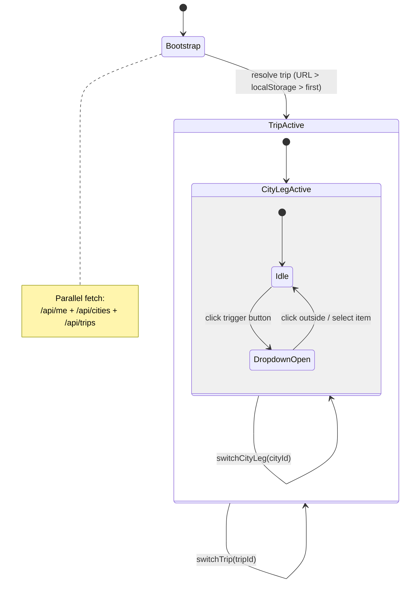
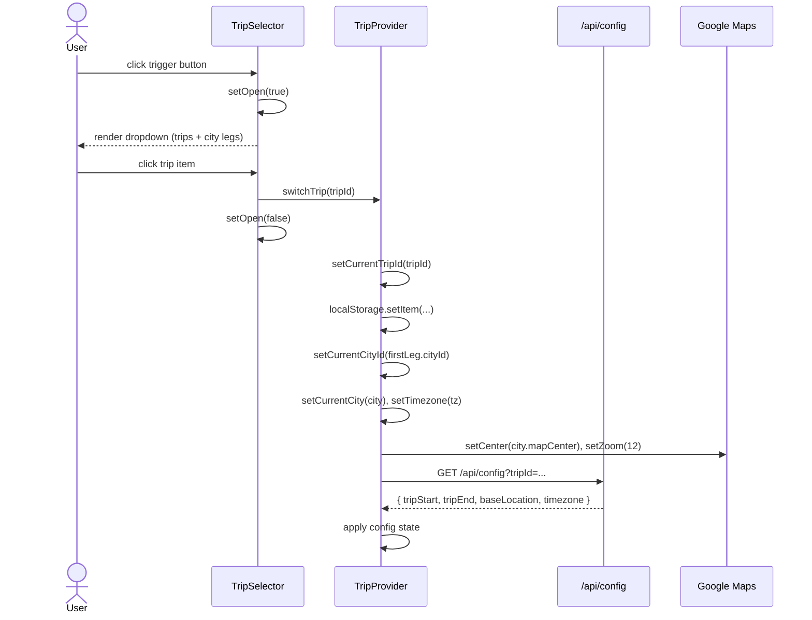
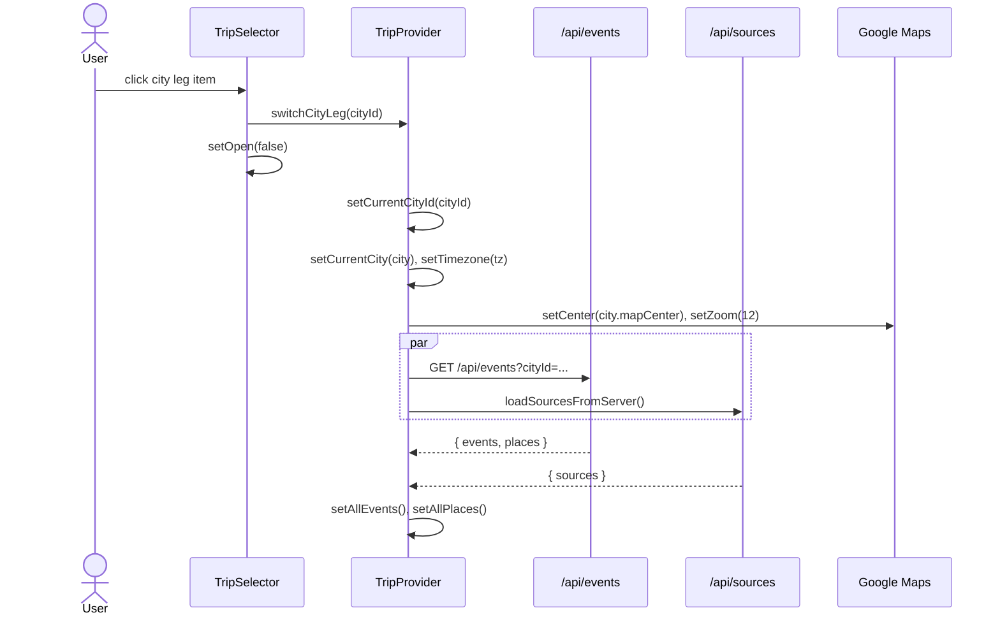

# Trip Selector: Technical Architecture & Implementation

Document Basis: current code at time of generation.

---

## 1. Summary

The Trip Selector is a dropdown component in the application header that allows users to:

1. **Switch between trips** -- selecting a different trip reloads config, events, and repositions the map.
2. **Switch between city legs within the active trip** -- selecting a different city leg reloads city-scoped data (events, sources, crime) and recenters the map.
3. **Display the current city name and timezone abbreviation** (e.g., "San Francisco . PST").

**Current shipped scope:**
- Renders as a compact button in the header topbar (right-hand actions area).
- Opens a custom dropdown (not a Radix primitive) with two sections: Trips and Cities.
- Delegates all state mutations to `switchTrip()` and `switchCityLeg()` in TripProvider.
- Timezone abbreviation is computed from the active city's IANA timezone string via `Intl.DateTimeFormat`.

**Out of scope (not implemented):**
- No "create trip" action in the dropdown (the `Plus` icon from lucide-react is imported but unused).
- No search/filter within the dropdown.
- No drag-to-reorder legs.
- No keyboard navigation or ARIA listbox semantics.

---

## 2. Runtime Placement & Ownership

The TripSelector is mounted once, inside `AppShell`, which wraps all authenticated tab routes.

```
app/layout.tsx
  -> TripProvider (context provider)
    -> app/trips/layout.tsx
      -> AppShell
        -> <header>
          -> <TripSelector />   <-- here, inside the right-hand actions div
        -> <MapPanel />
        -> {children}
        -> <StatusBar />
```

**Mount location:** `components/AppShell.tsx:76` -- rendered inside the `div.topbar-actions-responsive` container in the header.

**Lifecycle boundary:** TripSelector is a pure consumer of TripContext. It has no local effects beyond the click-outside listener. It mounts and unmounts with the AppShell, which mounts when the user navigates to any `trips/[tripId]` route.

**Responsive behavior:** On viewports <= 640px, the entire `.topbar-actions-responsive` container is hidden via `display: none !important` (`globals.css:169`). The TripSelector is invisible on mobile.

---

## 3. Module/File Map

| File | Responsibility | Key Exports | Dependencies | Side Effects |
|---|---|---|---|---|
| `components/TripSelector.tsx` | Dropdown UI for trip/city switching | `default` (React component) | `useTrip`, lucide-react icons | `mousedown` event listener on `document` |
| `components/providers/TripProvider.tsx` | All trip/city state, switching logic, bootstrap | `useTrip`, `TripProvider`, `TAG_COLORS` | Convex auth, fetch APIs, Google Maps | localStorage reads/writes, API calls, map repositioning |
| `components/AppShell.tsx` | Header + layout shell, mounts TripSelector | `default` (React component) | `TripSelector`, `useTrip`, `MapPanel`, `StatusBar` | None |
| `convex/trips.ts` | Backend CRUD for trips | `listMyTrips`, `getTrip`, `createTrip`, `updateTrip`, `deleteTrip` | `convex/authz` | Database mutations |
| `convex/cities.ts` | Backend CRUD for cities | `listCities`, `getCity`, `createCity`, `updateCity` | `convex/authz` | Database mutations |
| `convex/schema.ts` | Database schema definitions | `default` schema | convex/server | None |
| `app/api/trips/route.ts` | REST proxy for trip listing/creation | `GET`, `POST` | `convex/trips`, `lib/request-auth` | Auto-creates cities on trip creation |
| `app/api/trips/[tripId]/route.ts` | REST proxy for single trip CRUD | `GET`, `PATCH`, `DELETE` | `convex/trips`, `lib/request-auth` | None |
| `app/api/cities/route.ts` | REST proxy for city listing/creation | `GET`, `POST` | `convex/cities`, `lib/request-auth` | None |
| `app/globals.css` | Design tokens + responsive rules | CSS custom properties | Tailwind CSS v4 | None |

---

## 4. State Model & Transitions

### 4.1 State Variables

All state lives in TripProvider. TripSelector reads these via `useTrip()`:

| State Variable | Type | Default | Location |
|---|---|---|---|
| `currentTripId` | `string` | `''` | `TripProvider.tsx:289` |
| `currentCityId` | `string` | `''` | `TripProvider.tsx:290` |
| `trips` | `any[]` | `[]` | `TripProvider.tsx:291` |
| `cities` | `any[]` | `[]` | `TripProvider.tsx:292` |
| `currentCity` | `any \| null` | `null` | `TripProvider.tsx:293` |
| `timezone` | `string` | `'America/Los_Angeles'` | `TripProvider.tsx:294` |
| `open` (local) | `boolean` | `false` | `TripSelector.tsx:13` |

### 4.2 Bootstrap Resolution Order

During initialization (`TripProvider.tsx:1282-1314`), the active trip is resolved with this priority:

1. **URL query parameter** `?trip=<id>` -- checked first (`TripProvider.tsx:1302`)
2. **localStorage** key `tripPlanner:activeTripId` -- checked second (`TripProvider.tsx:1303`)
3. **First trip in list** -- fallback (`TripProvider.tsx:1304`)

The active city defaults to the first leg of the resolved trip (`TripProvider.tsx:1306`).

### 4.3 Transition Rules

#### `switchTrip(tripId)` -- `TripProvider.tsx:1692-1727`

| Step | Action | Side Effect |
|---|---|---|
| 1 | Guard: no-op if `tripId` is empty or equals `currentTripId` | None |
| 2 | `setCurrentTripId(tripId)` | State update |
| 3 | `localStorage.setItem('tripPlanner:activeTripId', tripId)` | Persistence |
| 4 | Find trip in `trips[]` by `_id` or `id` | None |
| 5 | If trip has legs, set `currentCityId` to first leg's `cityId` | State update |
| 6 | Resolve city from `cities[]` by slug, set `currentCity` and `timezone` | State update |
| 7 | Recenter map to `city.mapCenter`, zoom 12 | Map side effect |
| 8 | Fetch `/api/config?tripId=...` to reload trip config | Network call |
| 9 | Apply config: `tripStart`, `tripEnd`, `baseLocation`, `timezone` | State updates |

#### `switchCityLeg(cityId)` -- `TripProvider.tsx:1729-1756`

| Step | Action | Side Effect |
|---|---|---|
| 1 | Guard: no-op if `cityId` is empty or equals `currentCityId` | None |
| 2 | `setCurrentCityId(cityId)` | State update |
| 3 | Resolve city from `cities[]` by slug, set `currentCity` and `timezone` | State update |
| 4 | Recenter map to `city.mapCenter`, zoom 12 | Map side effect |
| 5 | Fetch `/api/events?cityId=...` and `loadSourcesFromServer()` in parallel | Network calls |
| 6 | Apply events and places from response | State updates |

### 4.4 State Diagram



---

## 5. Interaction & Event Flow

### 5.1 Sequence Diagram: Open, Select Trip, Close



### 5.2 Sequence Diagram: Switch City Leg



### 5.3 Click-Outside Dismissal

A `mousedown` listener is attached to `document` on mount (`TripSelector.tsx:16-22`). It closes the dropdown if the click target is not within the component's `ref` div. The listener is cleaned up on unmount.

---

## 6. Rendering/Layers/Motion

### 6.1 Layer Stack

| Element | z-index | Source |
|---|---|---|
| Header (`<header>`) | `z-30` | `AppShell.tsx:37` (Tailwind class) |
| Dropdown panel | `z-50` | `TripSelector.tsx:50` (Tailwind class) |
| Map panel | default | Below header |

The dropdown is `position: absolute; right: 0; top: full; mt-1` relative to the trigger button's wrapper div (`TripSelector.tsx:50`).

### 6.2 Visual Constants

| Property | Value | Source |
|---|---|---|
| Trigger background | `#111111` | `TripSelector.tsx:36` |
| Trigger border | `1px solid #262626` | `TripSelector.tsx:37` |
| Pin icon color | `#00E87B` | `TripSelector.tsx:41` |
| City label color | `#737373` | `TripSelector.tsx:42` |
| Chevron color | `#525252` | `TripSelector.tsx:45` |
| Dropdown background | `#111111` | `TripSelector.tsx:51` |
| Dropdown border | `1px solid #262626` | `TripSelector.tsx:51` |
| Dropdown min-width | `220px` | `TripSelector.tsx:50` |
| Section header color | `#525252` | `TripSelector.tsx:58` |
| Section header font-size | `9px` | `TripSelector.tsx:57` |
| Active item color | `#00E87B` | `TripSelector.tsx:74, 110` |
| Inactive item color | `#a3a3a3` | `TripSelector.tsx:74, 110` |
| Active item font-weight | `600` | `TripSelector.tsx:75, 111` |
| Item font-size | `11px` | `TripSelector.tsx:73, 109` |
| Item hover background | `#1a1a1a` | `TripSelector.tsx:70, 103` (Tailwind) |
| Font family (all text) | `var(--font-jetbrains, 'JetBrains Mono', monospace)` | Multiple locations |
| MapPin icon size (trigger) | `12px` | `TripSelector.tsx:41` |
| MapPin icon size (leg items) | `10px` | `TripSelector.tsx:111` |
| ChevronDown size | `10px` | `TripSelector.tsx:45` |
| Trigger label font-size | `10px` | `TripSelector.tsx:42` |

### 6.3 Animation

No animations are applied to the dropdown open/close. It renders/unmounts immediately via conditional rendering (`{open && ...}` at `TripSelector.tsx:48`). Note that `globals.css` defines a `selectSlideIn` keyframe animation, but it is not used by TripSelector.

### 6.4 Hit Areas

- **Trigger button:** Full button element with `px-3 py-1.5` padding. No minimum width constraint.
- **Trip items / City items:** Full-width buttons (`w-full`) with `px-3 py-1.5` padding.
- **Click-outside:** Entire document surface outside the component's root `div`.

---

## 7. API & Prop Contracts

### 7.1 Component Interface

`TripSelector` accepts no props. It is a self-contained component that reads all data from `useTrip()`.

```tsx
// components/TripSelector.tsx:7
export default function TripSelector()
```

### 7.2 Context Values Consumed

From `useTrip()` (`TripSelector.tsx:8-11`):

```tsx
const {
  trips,          // any[] -- list of user's trips
  cities,         // any[] -- list of all cities
  currentTripId,  // string -- active trip ID
  currentCityId,  // string -- active city slug
  currentCity,    // any | null -- resolved city object
  switchTrip,     // (tripId: string) => Promise<void>
  switchCityLeg,  // (cityId: string) => Promise<void>
  timezone,       // string -- IANA timezone (e.g. 'America/Los_Angeles')
} = useTrip();
```

### 7.3 Data Shapes

**Trip object** (from `convex/schema.ts:32-44`, `convex/trips.ts:11-18`):

```typescript
{
  _id: Id<'trips'>,      // Convex document ID
  userId: string,
  name: string,           // Display name, fallback: 'Untitled Trip'
  legs: Array<{
    cityId: string,       // References cities.slug
    startDate: string,    // ISO date string
    endDate: string,      // ISO date string
  }>,
  createdAt: string,
  updatedAt: string,
}
```

**City object** (from `convex/schema.ts:10-30`, `convex/cities.ts:5-23`):

```typescript
{
  _id: Id<'cities'>,
  slug: string,           // URL-safe identifier (e.g. 'san-francisco')
  name: string,           // Display name (e.g. 'San Francisco')
  timezone: string,       // IANA timezone (e.g. 'America/Los_Angeles')
  locale: string,
  mapCenter: { lat: number, lng: number },
  mapBounds: { north: number, south: number, east: number, west: number },
  crimeAdapterId: string,
  isSeeded: boolean,
  createdByUserId: string,
  createdAt: string,
  updatedAt: string,
}
```

### 7.4 Timezone Abbreviation Derivation

The timezone abbreviation (e.g., "PST", "EDT") is computed at `TripSelector.tsx:26-27`:

```tsx
const tzAbbrev = timezone
  ? new Intl.DateTimeFormat('en-US', {
      timeZone: timezone,
      timeZoneName: 'short'
    })
    .formatToParts(new Date())
    .find((p) => p.type === 'timeZoneName')?.value || ''
  : '';
```

This uses the browser's `Intl.DateTimeFormat` API and will reflect the **current** abbreviation (e.g., "PDT" during daylight saving time, "PST" during standard time).

---

## 8. Reliability Invariants

These truths must hold after any refactor:

1. **Trip ID persistence:** After `switchTrip`, the new trip ID must be written to `localStorage` at key `tripPlanner:activeTripId` (`TripProvider.tsx:1695-1697`).
2. **City-first on trip switch:** Switching trips always sets the city to the first leg's `cityId` (`TripProvider.tsx:1700-1712`).
3. **Map recentering:** Both `switchTrip` and `switchCityLeg` must recenter the map to the target city's `mapCenter` at zoom 12, if a map reference exists.
4. **No-op guard:** Both switch functions silently return if the target ID equals the current ID or is empty (`TripProvider.tsx:1693, 1730`).
5. **Timezone propagation:** Switching trip or city must update `timezone` state from the resolved city's `timezone` field, falling back to `'UTC'` (`TripProvider.tsx:1707, 1736`).
6. **Click-outside closes dropdown:** The `mousedown` document listener must close the dropdown when clicking outside the component ref.
7. **Cities section visibility:** The "Cities" section only renders when the active trip has more than one leg (`TripSelector.tsx:86`: `activeTrip?.legs?.length > 1`).
8. **Bootstrap priority:** URL param `?trip=` takes priority over localStorage, which takes priority over first-trip fallback.

---

## 9. Edge Cases & Pitfalls

### 9.1 ID Mismatch (`_id` vs `id`)

The component handles both Convex document IDs (`_id`) and plain `id` fields:
- `TripSelector.tsx:24`: `trips.find((t: any) => (t._id || t.id) === currentTripId)`
- `TripSelector.tsx:63`: `const id = trip._id || trip.id`
- `TripProvider.tsx:1699`: `trips.find((t) => t._id === tripId || t.id === tripId)`

This dual-ID pattern exists because data may come from Convex (which uses `_id`) or from API responses that may normalize to `id`.

### 9.2 Empty State

When `trips.length === 0`, the dropdown shows "No trips yet" (`TripSelector.tsx:124-131`). The trigger button will show "No city" as the label (`TripSelector.tsx:25`).

### 9.3 Single-Leg Trip

When a trip has exactly one leg (`legs.length === 1`), the Cities section is hidden. The divider and "Cities" header are not rendered. Only the Trips section appears.

### 9.4 City Not Found

If a leg references a `cityId` that does not exist in the `cities[]` array, the dropdown falls back to displaying the raw `cityId` slug: `city?.name || leg.cityId` (`TripSelector.tsx:112`).

### 9.5 Mobile Breakpoint

The TripSelector is **completely hidden** on screens <= 640px due to `globals.css:169`:
```css
.topbar-actions-responsive { display: none !important; }
```
There is no alternative mobile UI for switching trips/cities. This means mobile users cannot switch trips or cities.

### 9.6 Timezone Edge Case

The `timezone` state defaults to `'America/Los_Angeles'` (`TripProvider.tsx:294`). If a city record has no timezone, the fallback is `'UTC'` (used in `switchTrip` and `switchCityLeg`). These two fallbacks are different, which means the very first render before bootstrap completes will show "PST"/"PDT" regardless of the user's actual trip.

### 9.7 Dropdown Positioning

The dropdown is positioned `absolute right-0 top-full mt-1`. It can overflow the viewport on the left side if the dropdown's `min-w-[220px]` exceeds the available space. No overflow detection or repositioning logic exists.

### 9.8 No Keyboard Support

The dropdown has no `role="listbox"`, no `aria-expanded`, no arrow-key navigation, and no Escape-to-close handler. Accessibility is limited to basic button semantics.

### 9.9 Plus Icon Import

`Plus` from lucide-react is imported (`TripSelector.tsx:5`) but never used in the rendered output. This is dead code.

---

## 10. Testing & Verification

### 10.1 Existing Tests

| Test File | What It Tests | Type |
|---|---|---|
| `lib/trip-provider-bootstrap.test.mjs` | Bootstrap resolution order (URL > localStorage > first trip), localStorage persistence | Source-code inspection (reads TripProvider.tsx and asserts string patterns) |
| `lib/trip-provider-storage.test.mjs` | Ensures `window.localStorage` is not used (only bare `localStorage`) | Source-code inspection |

Both test files use Node.js built-in `node:test` runner. They do not render components or test runtime behavior.

### 10.2 Manual Verification Scenarios

| Scenario | Steps | Expected Result |
|---|---|---|
| Switch trip | Click trigger, click a different trip | Map recenters, trip config reloads, city label updates |
| Switch city leg | Click trigger, click a different city under "Cities" | Map recenters to new city, events/sources reload, timezone abbreviation updates |
| Single-leg trip | Select a trip with one leg | "Cities" section is not visible in dropdown |
| Multi-leg trip | Select a trip with 2+ legs | "Cities" section appears with all legs listed |
| Empty state | User with no trips | Dropdown shows "No trips yet", trigger shows "No city" |
| Click outside | Open dropdown, click elsewhere | Dropdown closes |
| Timezone display | Switch to city in different timezone | Abbreviation updates (e.g., "PST" to "EST") |
| Page refresh persistence | Switch trip, refresh page | Same trip is selected (via localStorage) |
| URL param override | Navigate with `?trip=<id>` | That trip is selected, overriding localStorage |

### 10.3 Running Tests

```bash
npx node --test lib/trip-provider-bootstrap.test.mjs
npx node --test lib/trip-provider-storage.test.mjs
```

---

## 11. Quick Change Playbook

| If you want to... | Edit... |
|---|---|
| Change the trigger button styling | `components/TripSelector.tsx:34-46` -- inline styles on the trigger `<button>` |
| Change the dropdown width | `components/TripSelector.tsx:50` -- `min-w-[220px]` class |
| Add a "Create Trip" action to the dropdown | `components/TripSelector.tsx` -- add a button after the trips list; wire to a create-trip mutation or modal. Note: `Plus` icon is already imported. |
| Change the timezone format | `components/TripSelector.tsx:26-27` -- modify the `Intl.DateTimeFormat` options (e.g., `timeZoneName: 'long'`) |
| Change the active color (green) | `components/TripSelector.tsx:74,110` (item text) and `:41` (pin icon) -- replace `#00E87B`. Also consider the global accent `--color-accent: #00FF88` in `globals.css:13`. |
| Add keyboard navigation | `components/TripSelector.tsx` -- add `onKeyDown` handler to dropdown, track focused index, add `role="listbox"` and `aria-expanded` |
| Show TripSelector on mobile | `app/globals.css:169` -- remove or modify `.topbar-actions-responsive { display: none !important; }` |
| Change the bootstrap resolution priority | `components/providers/TripProvider.tsx:1301-1304` -- reorder the `urlTripId \|\| localStorage \|\| first` chain |
| Add animation to dropdown open | `components/TripSelector.tsx:48-132` -- wrap the dropdown in a transition component or apply the existing `selectSlideIn` keyframe from `globals.css:44-47` |
| Change what data reloads on city switch | `components/providers/TripProvider.tsx:1743-1755` -- modify the `Promise.all` in `switchCityLeg` |
| Change what data reloads on trip switch | `components/providers/TripProvider.tsx:1716-1726` -- modify the config fetch in `switchTrip` |
| Add date range display to trigger label | `components/TripSelector.tsx:25-27` -- access `activeTrip.legs` to format and display dates alongside the city label |
| Change the localStorage key | `components/providers/TripProvider.tsx:1696` and `1303` -- update both the write and read of `'tripPlanner:activeTripId'` |

---

## Appendix: Key Code Snippets

### Trigger Button with Timezone Abbreviation

```tsx
// components/TripSelector.tsx:24-27
const activeTrip = trips.find((t: any) => (t._id || t.id) === currentTripId);
const cityLabel = currentCity?.name || currentCityId || 'No city';
const tzAbbrev = timezone ? new Intl.DateTimeFormat('en-US', { timeZone: timezone, timeZoneName: 'short' })
  .formatToParts(new Date()).find((p) => p.type === 'timeZoneName')?.value || '' : '';
```

### switchTrip -- Trip Switch with Config Reload

```tsx
// components/providers/TripProvider.tsx:1692-1713
const switchTrip = useCallback(async (tripId: string) => {
  if (!tripId || tripId === currentTripId) return;
  setCurrentTripId(tripId);
  if (typeof window !== 'undefined') {
    localStorage.setItem('tripPlanner:activeTripId', tripId);
  }
  const trip = trips.find((t) => t._id === tripId || t.id === tripId);
  if (trip?.legs?.length > 0) {
    const firstLeg = trip.legs[0];
    const legCityId = firstLeg.cityId || '';
    setCurrentCityId(legCityId);
    const city = cities.find((c) => c.slug === legCityId);
    if (city) {
      setCurrentCity(city);
      setTimezone(city.timezone || 'UTC');
      if (mapRef.current && city.mapCenter) {
        mapRef.current.setCenter(city.mapCenter);
        mapRef.current.setZoom(12);
      }
    }
  }
  // ... config reload follows
}, [currentTripId, trips, cities]);
```

### Bootstrap Resolution Priority

```tsx
// components/providers/TripProvider.tsx:1301-1314
const urlTripId = typeof window !== 'undefined'
  ? new URLSearchParams(window.location.search).get('trip') || '' : '';
const savedTripId = urlTripId
  || (typeof window !== 'undefined' ? localStorage.getItem('tripPlanner:activeTripId') || '' : '');
const activeTrip = loadedTrips.find((t: any) => t._id === savedTripId)
  || loadedTrips[0] || null;
```
