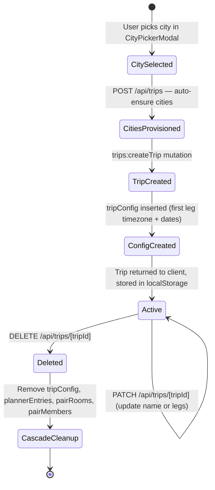
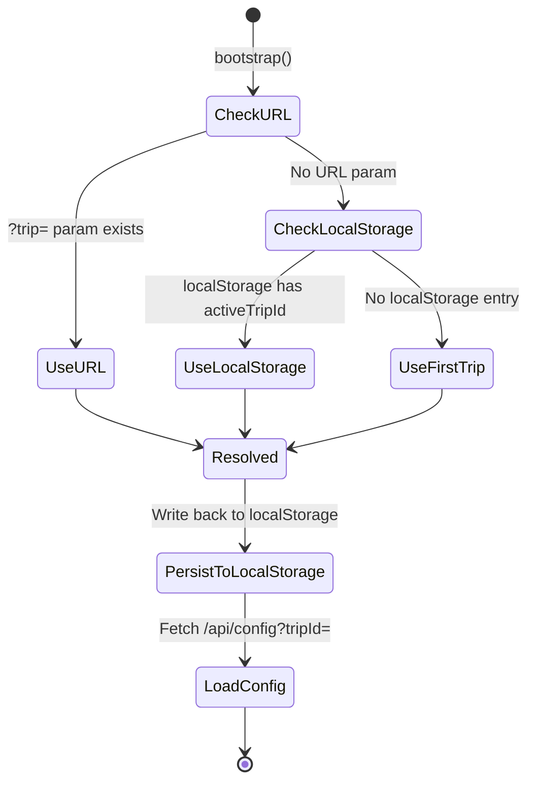
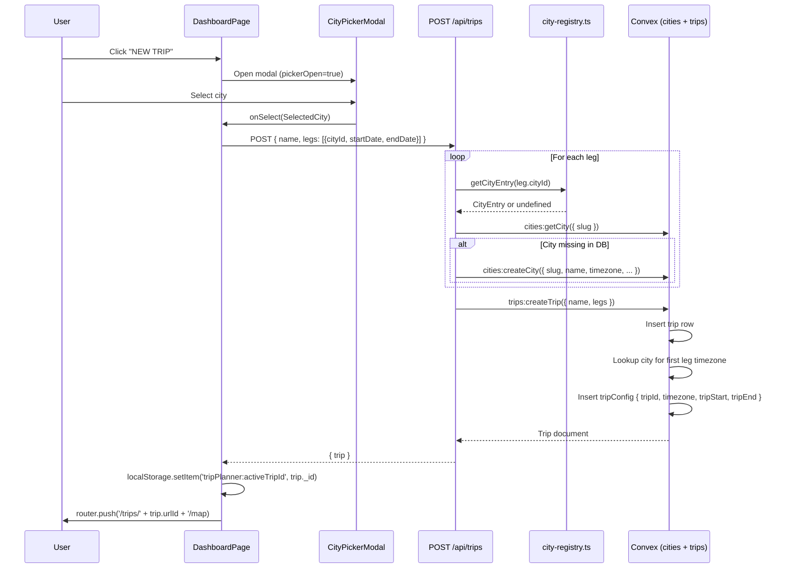
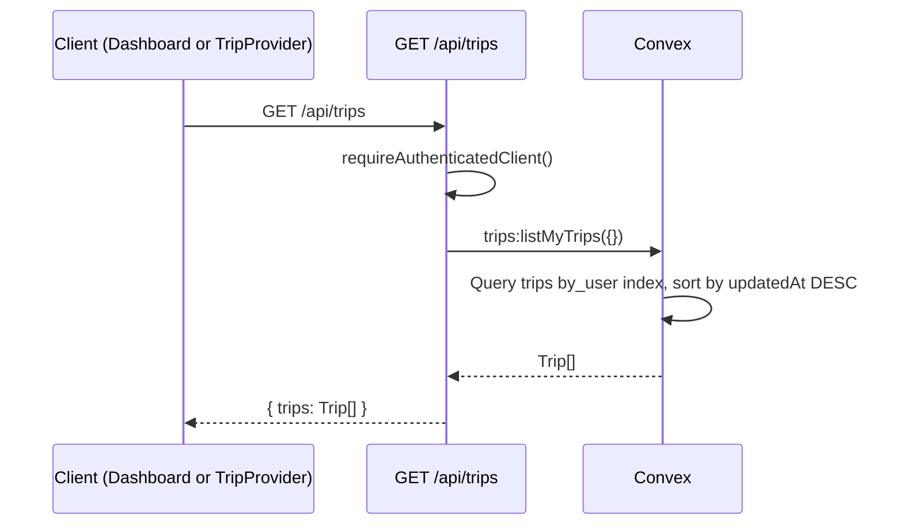
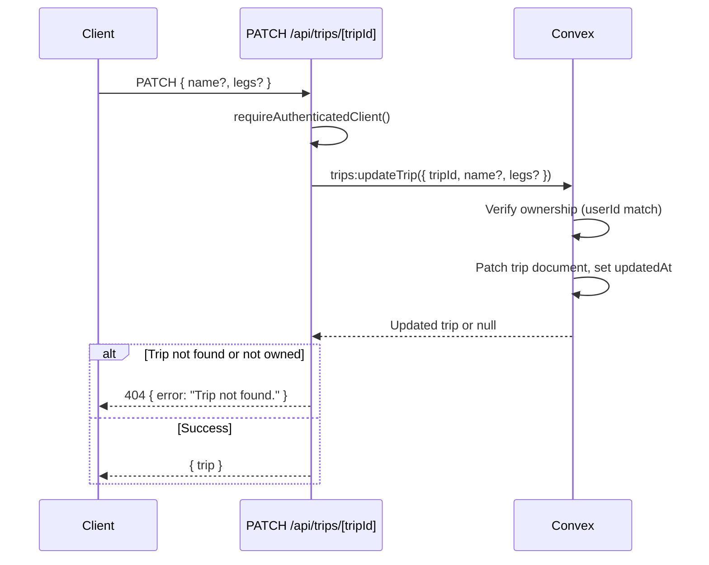
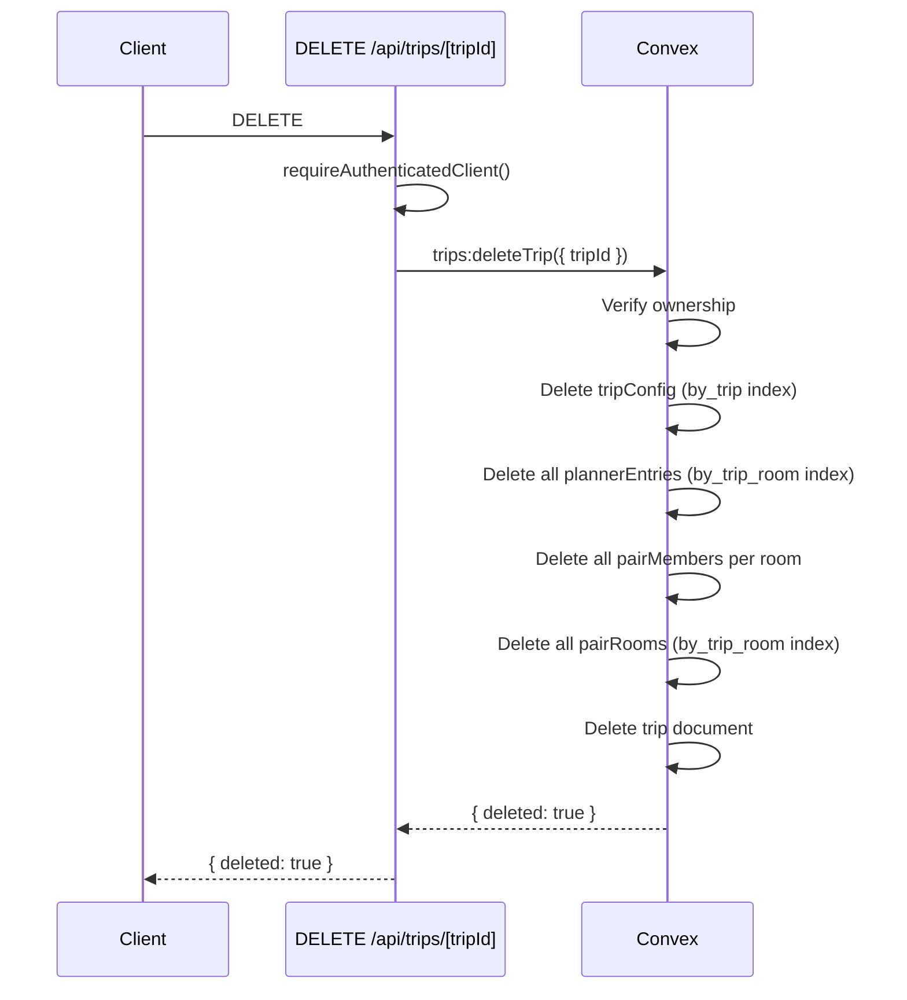

# Trips CRUD API: Technical Architecture & Implementation

**Document Basis:** current code at time of generation.

---

## 1. Summary

The Trips CRUD API manages the full lifecycle of trip documents: listing a user's trips, creating new trips (with automatic city provisioning), reading individual trips, updating trip metadata/legs, and deleting trips with cascading cleanup of related records.

**Current shipped scope:**
- REST endpoints at `/api/trips` (collection) and `/api/trips/[tripId]` (individual resource)
- Convex backend mutations/queries in `convex/trips.ts`
- Auto-provisioning of city records from a static registry on trip creation
- Cascading delete of tripConfig, plannerEntries, pairRooms, and pairMembers
- Pair-member read access on `getTrip` (shared trip viewing)
- Default tripConfig creation from the first leg on trip creation

**Out of scope:**
- No trip sharing/invitation endpoint (pair rooms are created separately)
- No trip archival or soft-delete (hard delete only)
- No pagination on `listMyTrips`
- No server-side validation of date formats or date range sanity

---

## 2. Runtime Placement & Ownership

| Concern | Location | Notes |
|---------|----------|-------|
| REST collection endpoint | `app/api/trips/route.ts` | GET (list), POST (create) |
| REST resource endpoint | `app/api/trips/[tripId]/route.ts` | GET, PATCH, DELETE |
| Backend queries/mutations | `convex/trips.ts` | All DB operations |
| City auto-provisioning (server-side) | `app/api/trips/route.ts:38-56` | Uses `lib/city-registry.ts` |
| City DB operations | `convex/cities.ts` | `getCity`, `createCity` |
| Auth gate (API routes) | `lib/request-auth.ts` | `requireAuthenticatedClient()` |
| Auth gate (Convex functions) | `convex/authz.ts` | `requireAuthenticatedUserId()` |
| Route protection (middleware) | `middleware.ts` | Redirects unauthenticated users |
| Primary consumer (dashboard) | `app/dashboard/page.tsx` | Lists trips, creates via city picker |
| Primary consumer (provider) | `components/providers/TripProvider.tsx` | Bootstrap trip resolution |
| Trip switcher UI | `components/TripSelector.tsx` | In-app trip/city switching |

Both REST route files export `runtime = 'nodejs'` (`app/api/trips/route.ts:4`, `app/api/trips/[tripId]/route.ts:3`).

---

## 3. Module/File Map

| File | Responsibility | Key Exports | Dependencies | Side Effects |
|------|---------------|-------------|--------------|-------------|
| `app/api/trips/route.ts` | Collection REST (GET/POST) | `GET`, `POST` | `request-auth`, `city-registry` | Creates city records in Convex on POST |
| `app/api/trips/[tripId]/route.ts` | Resource REST (GET/PATCH/DELETE) | `GET`, `PATCH`, `DELETE` | `request-auth` | None |
| `convex/trips.ts` | All trip DB operations | `listMyTrips`, `getTrip`, `createTrip`, `updateTrip`, `deleteTrip` | `convex/authz` | Creates tripConfig on insert; cascading delete of tripConfig, plannerEntries, pairRooms, pairMembers |
| `convex/cities.ts` | City DB operations | `listCities`, `getCity`, `createCity`, `updateCity` | `convex/authz` | None |
| `convex/schema.ts` | Table definitions | Schema with `trips`, `cities`, `tripConfig` tables | `convex/server` | Defines indexes |
| `lib/city-registry.ts` | Static city catalog | `getCityEntry`, `getAllCityEntries`, `CityEntry` | None | None |
| `lib/request-auth.ts` | API route auth | `requireAuthenticatedClient`, `requireOwnerClient` | `@convex-dev/auth`, `convex/browser` | Creates `ConvexHttpClient`, sets auth token |
| `convex/authz.ts` | Convex-side auth | `requireAuthenticatedUserId`, `requireOwnerUserId` | `@convex-dev/auth/server` | None |
| `convex/tripConfig.ts` | Trip config CRUD | `getTripConfig`, `saveTripConfig` | `convex/authz` | DB insert/patch |
| `convex/seed.ts` | City seeding | `seedInitialData`, `seedInitialDataInternal` | `convex/authz` | Inserts city records |
| `lib/mock-data.ts` | Trip type definitions + date formatting | `TripLeg`, `MockTrip`, `MOCK_TRIPS`, `formatTripDateRange` | None | None |
| `components/CityPickerModal.tsx` | Google Places-powered city search | `CityPickerModal`, `SelectedCity` | `Modal`, `map-helpers`, `city-registry` | Google Maps script, Places API |
| `app/dashboard/page.tsx` | Trip dashboard page | `DashboardPage` (default) | `CityPickerModal`, `lib/mock-data` | Fetches `/api/trips`, `/api/cities`; sets localStorage |
| `components/TripSelector.tsx` | In-app trip switcher dropdown | `TripSelector` (default) | `TripProvider` | None |

---

## 4. State Model & Transitions

### 4.1 Data Schema

**`trips` table** (`convex/schema.ts:32-44`):

```
{
  userId:    string        // owner's user ID
  name:      string        // display name
  legs:      TripLeg[]     // ordered city legs
  createdAt: string        // ISO timestamp
  updatedAt: string        // ISO timestamp
}
Index: by_user [userId]
```

**`TripLeg` shape** (`convex/trips.ts:5-9`):

```
{
  cityId:    string   // slug matching cities.slug
  startDate: string   // ISO date (YYYY-MM-DD)
  endDate:   string   // ISO date (YYYY-MM-DD)
}
```

**`cities` table** (`convex/schema.ts:10-30`):

```
{
  slug:            string
  name:            string
  timezone:        string
  locale:          string
  mapCenter:       { lat: number, lng: number }
  mapBounds:       { north, south, east, west: number }
  crimeAdapterId:  string
  isSeeded:        boolean
  createdByUserId: string
  createdAt:       string
  updatedAt:       string
}
Index: by_slug [slug]
```

**`tripConfig` table** (`convex/schema.ts:209-216`):

```
{
  tripId:       Id<'trips'>
  timezone:     string
  tripStart:    string
  tripEnd:      string
  baseLocation: string (optional)
  updatedAt:    string
}
Index: by_trip [tripId]
```

### 4.2 Trip Lifecycle State Diagram



### 4.3 Active Trip Resolution (Bootstrap)

The `TripProvider.bootstrap()` function (`TripProvider.tsx:1282-1313`) resolves the active trip on app load:

```
Priority: URL param ?trip= > localStorage tripPlanner:activeTripId > first trip in list
```



---

## 5. Interaction & Event Flow

### 5.1 Create Trip Flow (Dashboard)



### 5.2 List Trips Flow



### 5.3 Update Trip Flow



### 5.4 Delete Trip Flow (Cascading)



---

## 6. Rendering/Layers/Motion

This feature is primarily API-driven. UI rendering is handled by consumers:

| Component | Role | Key Visual Behavior |
|-----------|------|-------------------|
| `DashboardPage` (`app/dashboard/page.tsx`) | Grid of trip cards | Auto-fill grid `minmax(340px, 1fr)`, loading spinner (Loader2 + animate-spin), error/empty states |
| `CityPickerModal` (`components/CityPickerModal.tsx`) | City selection overlay | Modal from `components/ui/modal`, search filter, popular destinations grid (2 cols), scrollable results |
| `TripSelector` (`components/TripSelector.tsx`) | Dropdown trip/city switcher | Absolute-positioned dropdown `z-50`, click-outside dismiss, active item highlighted with `#00E87B` |

**Leg color palette** (`app/dashboard/page.tsx:31`):
```typescript
const LEG_COLORS = ['#00E87B', '#3B82F6', '#A855F7', '#F59E0B', '#EF4444', '#06B6D4'];
```

Colors cycle via `LEG_COLORS[i % LEG_COLORS.length]` for badge backgrounds at 10% opacity (`${color}18`) with 25% opacity borders (`${color}40`).

---

## 7. API & Prop Contracts

### 7.1 REST Endpoints

#### `GET /api/trips`

- **Auth:** `requireAuthenticatedClient()` -- 401 if unauthenticated
- **Response 200:** `{ trips: Trip[] }` -- sorted by `updatedAt` DESC
- **Response 500:** `{ error: string }`

#### `POST /api/trips`

- **Auth:** `requireAuthenticatedClient()`
- **Request body:**
  ```typescript
  {
    name: string;           // trimmed; falls back to "Untitled Trip" if empty
    legs: Array<{
      cityId: string;       // slug from city registry
      startDate: string;    // ISO date
      endDate: string;      // ISO date
    }>;
  }
  ```
- **Side effects:**
  1. Auto-provisions missing cities in Convex from `lib/city-registry.ts`
  2. Creates a `tripConfig` record with timezone from first leg's city
- **Response 200:** `{ trip: Trip }`
- **Response 400:** `{ error: string }` -- e.g., "A trip must have at least one leg."

#### `GET /api/trips/[tripId]`

- **Auth:** `requireAuthenticatedClient()`
- **Access control:** Owner OR pair member on the trip (`convex/trips.ts:44-52`)
- **Response 200:** `{ trip: Trip }`
- **Response 404:** `{ error: "Trip not found." }` -- also returned if access denied (no info leak)
- **Response 400:** `{ error: string }`

#### `PATCH /api/trips/[tripId]`

- **Auth:** `requireAuthenticatedClient()`
- **Access control:** Owner only (not pair members)
- **Request body:** (all fields optional)
  ```typescript
  {
    name?: string;          // trimmed; keeps existing name if result is empty
    legs?: TripLeg[];       // replaces entire legs array; must have >= 1 leg
  }
  ```
- **Response 200:** `{ trip: Trip }`
- **Response 404:** `{ error: "Trip not found." }`

#### `DELETE /api/trips/[tripId]`

- **Auth:** `requireAuthenticatedClient()`
- **Access control:** Owner only
- **Cascading deletes:** tripConfig, plannerEntries, pairMembers, pairRooms
- **Response 200:** `{ deleted: true }` or `{ deleted: false }` (not found/not owned)

### 7.2 Convex Functions

| Function | Type | Args | Returns | Access |
|----------|------|------|---------|--------|
| `trips:listMyTrips` | query | `{}` | `Trip[]` | Authenticated user (own trips only) |
| `trips:getTrip` | query | `{ tripId: Id<'trips'> }` | `Trip \| null` | Owner OR pair member |
| `trips:createTrip` | mutation | `{ name: string, legs: TripLeg[] }` | `Trip` | Authenticated user |
| `trips:updateTrip` | mutation | `{ tripId, name?, legs? }` | `Trip \| null` | Owner only |
| `trips:deleteTrip` | mutation | `{ tripId }` | `{ deleted: boolean }` | Owner only |

### 7.3 City Registry API

```typescript
// lib/city-registry.ts:86-88
export function getCityEntry(slug: string): CityEntry | undefined;
```

**Registered cities** (8 total): `san-francisco`, `new-york`, `los-angeles`, `chicago`, `london`, `tokyo`, `paris`, `barcelona`.

Each entry contains: `slug`, `name`, `timezone`, `locale`, `mapCenter`, `mapBounds`, `crimeAdapterId`.

### 7.4 Trip Response Shape

```typescript
interface Trip {
  _id:       string;       // Convex document ID
  userId:    string;
  name:      string;
  legs:      TripLeg[];
  createdAt: string;       // ISO timestamp
  updatedAt: string;       // ISO timestamp
}
```

Note: `_creationTime` (Convex system field) is explicitly stripped in all query/mutation responses (`convex/trips.ts:31`, `54`, `131`).

---

## 8. Reliability Invariants

These must remain true after any refactor:

1. **At least one leg:** `createTrip` and `updateTrip` both throw `"A trip must have at least one leg."` if `legs.length === 0` (`convex/trips.ts:69-71`, `122-124`).

2. **Owner-only writes:** `updateTrip` and `deleteTrip` verify `trip.userId === userId` before proceeding. Non-owners receive `null` / `{ deleted: false }` (`convex/trips.ts:117`, `142`).

3. **Pair-member read access:** `getTrip` allows read access if the requesting user has a `pairMembers` row with matching `tripId` (`convex/trips.ts:46-51`).

4. **Cascading delete completeness:** `deleteTrip` removes tripConfig, ALL plannerEntries for the trip, ALL pairMembers per room, ALL pairRooms, then the trip itself (`convex/trips.ts:144-178`).

5. **City auto-provisioning is idempotent:** The POST handler checks `cities:getCity` before calling `cities:createCity`. The `createCity` mutation also checks for duplicates and throws if the slug exists (`convex/cities.ts:76-78`).

6. **tripConfig auto-creation:** `createTrip` always inserts a `tripConfig` row using the first leg's city timezone (falling back to `'UTC'`) and the date span from first leg start to last leg end (`convex/trips.ts:81-94`).

7. **Sorted output:** `listMyTrips` returns trips sorted by `updatedAt` descending (`convex/trips.ts:32`).

8. **Name fallback:** Empty names default to `"Untitled Trip"` on create (`convex/trips.ts:75`) and are preserved on update if the trimmed name is empty (`convex/trips.ts:120`).

---

## 9. Edge Cases & Pitfalls

### 9.1 City Registry Miss

If a leg's `cityId` does not exist in the static `CITIES` registry (`lib/city-registry.ts`), `getCityEntry()` returns `undefined` and the auto-provisioning loop skips it with `continue` (`app/api/trips/route.ts:42`). The trip is still created, but no city record will exist in Convex for that leg. Downstream features (map centering, timezone resolution) will fail silently for that city.

### 9.2 Race Condition on City Creation

The check-then-create pattern in the POST handler (`app/api/trips/route.ts:44-55`) is not atomic. Two concurrent trip creations for the same city could both pass the `getCity` check before either `createCity` completes. The `createCity` mutation has a duplicate guard (`convex/cities.ts:76-78`) that throws, which would cause the second request to fail with a 400 error.

### 9.3 No tripConfig Update on Trip Update

When `updateTrip` changes legs (different dates or cities), the associated `tripConfig` is NOT updated. The `tripStart`/`tripEnd`/`timezone` in tripConfig can drift out of sync with the trip's actual legs.

### 9.4 Cascading Delete is Sequential

`deleteTrip` deletes related records one-by-one in nested loops (`convex/trips.ts:152-176`). For trips with many planner entries or pair rooms, this could be slow within a single Convex mutation.

### 9.5 Dev Auth Bypass

Both `lib/request-auth.ts:5` and `convex/authz.ts:5` have `DEV_BYPASS_AUTH = true`. In this mode, all requests authenticate as `dev-bypass` user with `owner` role. This flag must be `false` in production.

### 9.6 No Pagination

`listMyTrips` calls `.collect()` which loads all trip rows for the user into memory (`convex/trips.ts:28`). Users with many trips will see increased latency and memory usage.

### 9.7 Pair-Member Access on getTrip Does Not Extend to Update/Delete

`getTrip` allows pair members to read (`convex/trips.ts:46-51`), but `updateTrip` and `deleteTrip` are owner-only. There is no 403 distinction -- non-owners receive the same `null` / `{ deleted: false }` response as if the trip doesn't exist.

---

## 10. Testing & Verification

### 10.1 Existing Tests

**`lib/dashboard.test.mjs`** -- Source-level structural tests (15 assertions):
- Verifies dashboard fetches from `/api/trips` and `/api/cities`
- Verifies POST to `/api/trips` on city select
- Verifies leg shape includes `cityId`, `startDate`, `endDate`
- Verifies navigation to `/trips/{urlId}/map` after creation
- Verifies loading, error, and empty states exist
- Verifies `trip._id` (not mock `.id`) is used
- Verifies cleanup with `mounted = false`

**`lib/trip-provider-bootstrap.test.mjs`** -- Bootstrap resolution tests (6 assertions):
- URL param `?trip=` takes priority over localStorage
- Falls back to localStorage when no URL param
- Falls back to first trip when neither URL nor localStorage
- Persists resolved trip ID back to localStorage

### 10.2 Running Tests

```bash
node --test lib/dashboard.test.mjs
node --test lib/trip-provider-bootstrap.test.mjs
```

### 10.3 Manual Verification Scenarios

| Scenario | Steps | Expected |
|----------|-------|----------|
| List empty | GET `/api/trips` (new user) | `{ trips: [] }` |
| Create trip | POST `/api/trips` with `{ name: "Tokyo Trip", legs: [{ cityId: "tokyo", startDate: "2026-04-01", endDate: "2026-04-05" }] }` | 200, trip object returned, city auto-created if missing, tripConfig created |
| Create trip (empty legs) | POST with `legs: []` | 400, `"A trip must have at least one leg."` |
| Get trip (owner) | GET `/api/trips/[tripId]` | 200, trip object |
| Get trip (pair member) | GET `/api/trips/[tripId]` as pair member | 200, trip object |
| Get trip (non-member) | GET `/api/trips/[tripId]` as unrelated user | 404 |
| Update name | PATCH `/api/trips/[tripId]` with `{ name: "New Name" }` | 200, name updated, `updatedAt` changed |
| Update legs | PATCH with new legs array | 200, legs replaced |
| Delete trip | DELETE `/api/trips/[tripId]` | `{ deleted: true }`, cascaded records removed |
| Delete (not owner) | DELETE as non-owner | `{ deleted: false }` |

---

## 11. Quick Change Playbook

| If you want to... | Edit... |
|-------------------|---------|
| Add a new supported city | `lib/city-registry.ts` -- add entry to `CITIES` record; also add to `convex/seed.ts:SEED_CITIES` if it should be seeded |
| Add a field to the trip document | `convex/schema.ts` (trips table), `convex/trips.ts` (validators + mutation handlers), then update REST route handlers if the field is user-settable |
| Add a field to trip legs | `convex/trips.ts:5-9` (`tripLegValidator`), `convex/schema.ts:35-39` (legs array schema) |
| Change trip name default | `convex/trips.ts:75` -- currently `'Untitled Trip'` |
| Add pagination to list | `convex/trips.ts:25-33` -- replace `.collect()` with `.paginate()`, update REST response shape |
| Sync tripConfig on leg update | `convex/trips.ts:107-133` -- add tripConfig patch logic inside `updateTrip` handler |
| Add trip sharing (beyond pair rooms) | New field on trips table (e.g., `sharedWith`), update `getTrip` access check |
| Change cascade delete behavior | `convex/trips.ts:136-181` -- add/remove table cleanup in `deleteTrip` |
| Change auth from dev bypass to production | Set `DEV_BYPASS_AUTH = false` in both `lib/request-auth.ts:5` and `convex/authz.ts:5` |
| Add a seeded city | Add to `SEED_CITIES` in `convex/seed.ts` and `CITIES` in `lib/city-registry.ts` |
| Change default trip date range on creation | `app/dashboard/page.tsx:97-99` -- currently today + 3 days |
| Change active trip resolution priority | `components/providers/TripProvider.tsx:1302-1304` |
| Make trip updates available to pair members | `convex/trips.ts:117` -- modify the ownership check to include pair member lookup |
