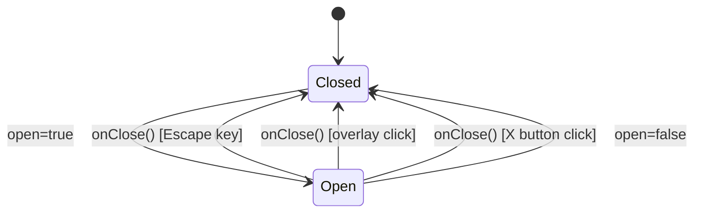
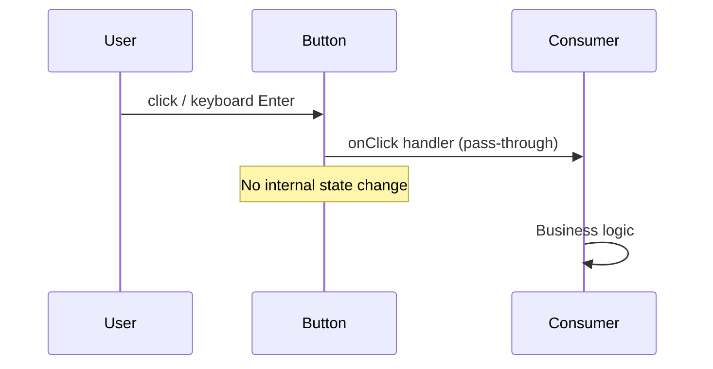
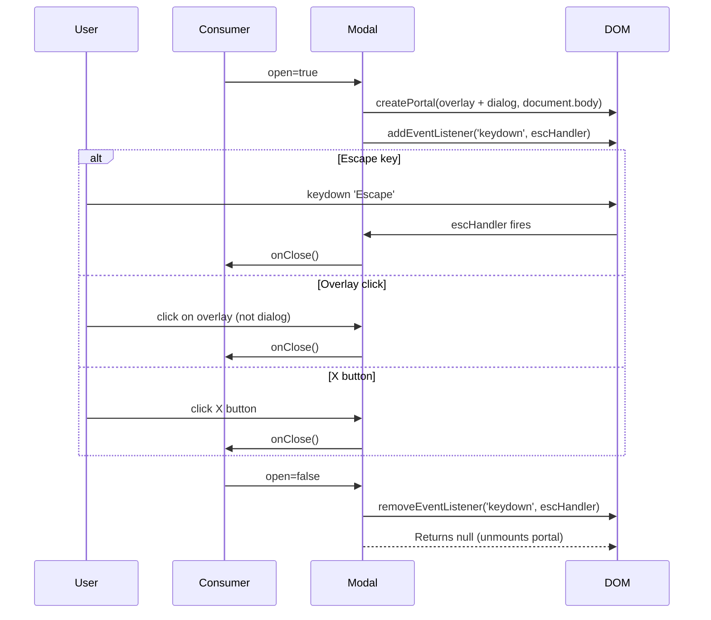
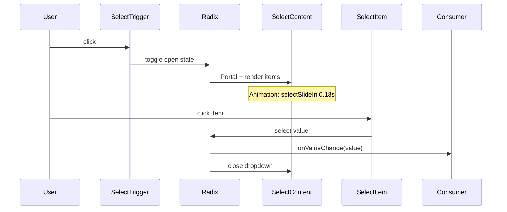

# UI Primitives / Design System: Technical Architecture & Implementation

> Document Basis: current code at time of generation.

---

## 1. Summary

The UI Primitives system is the foundational design system layer for Trip Planner. It provides 9 reusable components (Button, Badge, Card, Input, Select, Modal, Avatar, Tabs, ToggleGroup) plus a centralized design token system defined in CSS custom properties. The system enforces a dark-mode, industrial-terminal aesthetic: zero border-radius, monospace typography, neon green (`#00FF88`) accent, and hairline borders.

**Shipped scope:**
- 9 component files in `components/ui/`
- Design tokens in `app/globals.css` via Tailwind v4 `@theme` block
- Utility function `cn()` in `lib/utils.ts` (clsx + tailwind-merge)
- CSS-driven animations for Select dropdown and ToggleGroup states
- Skeleton loading pattern via `skeleton-pulse` CSS class

**Out of scope:**
- No Storybook or visual regression testing
- No component-level unit tests (all tests are backend/API)
- No theming/light mode support
- Tabs component (`components/ui/tabs.tsx`) is defined but has zero consumers and missing CSS class definitions

---

## 2. Runtime Placement & Ownership

All UI primitives are stateless, presentation-only React components. They have no providers, contexts, or lifecycle boundaries of their own.

**Mount hierarchy:**

```
app/layout.tsx (fonts + globals.css)
  -> Any route/component that imports from components/ui/*
```

Design tokens are injected globally via `app/globals.css`, which is imported in `app/layout.tsx:7`. Font CSS variables (`--font-jetbrains`, `--font-space-grotesk`, `--font-inter`) are set on `<html>` via Next.js Google Fonts in `app/layout.tsx:57`.

The Modal component is the only primitive that creates a side effect: it portals into `document.body` via `createPortal` and registers a `keydown` event listener for Escape dismissal (`components/ui/modal.tsx:18-22`).

---

## 3. Module/File Map

| File | Responsibility | Exports | Dependencies | Side Effects |
|------|---------------|---------|-------------|-------------|
| `components/ui/button.tsx` | Variant-driven button with polymorphic render | `Button`, `buttonVariants` | `@radix-ui/react-slot`, `class-variance-authority`, `lib/utils` | None |
| `components/ui/badge.tsx` | Status/label indicator | `Badge`, `badgeVariants` | `class-variance-authority`, `lib/utils` | None |
| `components/ui/card.tsx` | Container surface with border | `Card` | `lib/utils` | None |
| `components/ui/input.tsx` | Styled text input | `Input` | `lib/utils` | None |
| `components/ui/select.tsx` | Full dropdown select | `Select`, `SelectGroup`, `SelectValue`, `SelectTrigger`, `SelectContent`, `SelectItem` | `@radix-ui/react-select`, `lucide-react`, `lib/utils` | Portal via Radix |
| `components/ui/modal.tsx` | Dialog overlay with portal | `Modal` | `react-dom/createPortal`, `lucide-react` | Portal to `document.body`, `keydown` listener |
| `components/ui/avatar.tsx` | Initial-based circular avatar | `Avatar` | None | None |
| `components/ui/tabs.tsx` | Tab navigation | `Tabs`, `TabsList`, `TabsTrigger`, `TabsContent` | `@radix-ui/react-tabs`, `lib/utils` | None |
| `components/ui/toggle-group.tsx` | Multi-option toggle bar | `ToggleGroup`, `ToggleGroupItem` | `@radix-ui/react-toggle-group`, `lib/utils` | None |
| `app/globals.css` | Design tokens, animations, data-state styles | N/A (CSS) | Tailwind v4 | Global styles |
| `lib/utils.ts` | `cn()` class merge utility | `cn` | `clsx`, `tailwind-merge` | None |

### Supporting components (not in `components/ui/` but part of the design system surface)

| File | Responsibility | Exports | Dependencies |
|------|---------------|---------|-------------|
| `components/SkeletonCard.tsx` | Loading placeholder cards | `SkeletonCard` | None (uses `skeleton-pulse` CSS class) |
| `components/EmptyState.tsx` | Empty content placeholder | `EmptyState` | `lucide-react` |
| `components/ErrorState.tsx` | Error state display | `ErrorState` | `lucide-react` |

---

## 4. State Model & Transitions

UI Primitives are stateless by design. State is managed by consumers or by Radix UI internally (for Select, Tabs, ToggleGroup).

### Modal State

The Modal is the only primitive with explicit state behavior. It is controlled externally via the `open` prop.



State rules (`components/ui/modal.tsx:15-25`):
- When `open` is `false`, renders `null` (no DOM)
- When `open` is `true`, portals overlay + dialog into `document.body`
- Escape key calls `onClose` (listener added on mount, removed on cleanup)
- Overlay click calls `onClose` only when click target is the overlay itself (not dialog content)

### ToggleGroup Active State (CSS-driven)

Radix ToggleGroup sets `data-state="on"` on active items. The visual toggle is handled entirely in CSS (`app/globals.css:121-127`):

```css
/* globals.css:121-127 */
[data-state='on'].toggle-item-styled {
  background: var(--color-accent-light);
  border-color: var(--color-accent-border);
  color: var(--color-accent);
  font-weight: 600;
  box-shadow: 0 0 0 3px var(--color-accent-glow);
}
```

### Select Highlighted State (CSS-driven)

```css
/* globals.css:130-133 */
[data-highlighted].select-item-styled {
  background: var(--color-accent-light);
  outline: none;
}
```

---

## 5. Interaction & Event Flow

### Button Click Flow



### Modal Open/Close Flow



### Select Dropdown Flow



---

## 6. Rendering/Layers/Motion

### Z-Index Stack

| Layer | z-index | Component | File |
|-------|---------|-----------|------|
| Select dropdown | `z-70` | `SelectContent` | `components/ui/select.tsx:58` |
| Modal overlay | `z-50` | `Modal` | `components/ui/modal.tsx:30` |
| Cookie consent | `z-50` | `CookieConsent` | `components/CookieConsent.tsx:38` |
| Trip selector dropdown | `z-50` | `TripSelector` | `components/TripSelector.tsx:50` |
| Landing nav | `z-50` | `LandingContent` | `app/landing/LandingContent.tsx:139` |
| App header | `z-30` | `AppShell` | `components/AppShell.tsx:37` |

**Conflict note:** Modal, CookieConsent, and TripSelector all use `z-50`. The CookieConsent is fixed to bottom and Modal is centered, so they do not visually overlap. However, if both Modal and TripSelector dropdown are open simultaneously, they share the same z-index layer.

### Animation Constants

| Animation | Duration | Easing | Usage | Defined At |
|-----------|----------|--------|-------|-----------|
| `selectSlideIn` | `0.18s` | `cubic-bezier(0.22, 1, 0.36, 1)` | Select dropdown open | `globals.css:44-47, 118` |
| `fadeSlideUp` | N/A (defined, usage via consumer) | ease | Content entry | `globals.css:39-42` |
| `statusPulse` | N/A (defined, usage via consumer) | linear | Status indicator pulse | `globals.css:43` |
| `skeletonPulse` | `1.5s` | `ease-in-out infinite` | Loading skeleton shimmer | `globals.css:48-55` |
| `spin` | N/A (defined) | linear | Spinner rotation | `globals.css:38` |
| Button transitions | `200ms` | `ease-out` | Hover/active/focus | `button.tsx:8` |
| Card border transition | `200ms` | default | Border color on hover | `card.tsx:6` |
| Input border transition | `150ms` | default | Focus border color | `input.tsx:10` |
| ToggleGroupItem transition | `200ms` | default | All properties | `toggle-group.tsx:25` |
| SelectTrigger transition | `200ms` | default | All properties | `select.tsx:18` |

### Border Radius Contract

**All UI primitives use `rounded-none` (0px border radius).** This is the defining visual trait of the design system. The only exception is `Avatar`, which uses `borderRadius: '50%'` to render a circle (`components/ui/avatar.tsx:15`).

---

## 7. API & Prop Contracts

### Button

```typescript
// components/ui/button.tsx:30-34
interface ButtonProps extends React.ButtonHTMLAttributes<HTMLButtonElement>,
  VariantProps<typeof buttonVariants> {
  asChild?: boolean;  // renders as Radix Slot instead of <button>
}
```

| Prop | Type | Default | Values |
|------|------|---------|--------|
| `variant` | `string \| null` | `'default'` | `'default'`, `'secondary'`, `'ghost'`, `'danger'` |
| `size` | `string \| null` | `'default'` | `'default'` (38px), `'sm'` (32px), `'lg'` (44px) |
| `asChild` | `boolean` | `false` | Renders child element with button styles |
| `className` | `string` | — | Merged via `cn()` |

**Variant visual mapping (`button.tsx:11-16`):**

| Variant | Background | Border | Text | Hover |
|---------|-----------|--------|------|-------|
| `default` | `accent` (#00FF88) | transparent | `#0C0C0C` | brightness +10% |
| `secondary` | `card` (#0A0A0A) | border (#2f2f2f) | foreground | accent border + accent-light bg |
| `ghost` | transparent | transparent | inherited | accent-light bg |
| `danger` | danger-light | danger-border | `#FF4444` | stronger red bg + border |

### Badge

```typescript
// components/ui/badge.tsx:23
Badge({ className, variant, ...props }:
  React.HTMLAttributes<HTMLSpanElement> & VariantProps<typeof badgeVariants>)
```

| Variant | Background | Border | Text |
|---------|-----------|--------|------|
| `default` | `accent-light` | `accent-border` | `accent` |
| `secondary` | `bg-subtle` | `border` | `foreground-secondary` |
| `warning` | `warning-light` | `warning-border` | `warning` |
| `danger` | `danger-light` | `danger-border` | `danger` |

### Card

```typescript
// components/ui/card.tsx:5
Card: React.forwardRef<HTMLDivElement, React.HTMLAttributes<HTMLDivElement>>
```

Renders a `<div>` with `border border-border rounded-none bg-card transition-[border-color] duration-200`. No variants. Styling is done via `className` override.

### Input

```typescript
// components/ui/input.tsx:5
Input: React.forwardRef<HTMLInputElement, React.ComponentProps<'input'>>
```

Inherits all native `<input>` props. Base styling: `bg-bg-elevated`, `border-border`, focus changes border to `accent`. Height: `min-h-[36px]`.

### Select

Composed from 6 sub-components wrapping `@radix-ui/react-select`:

| Component | Wraps | Key Behavior |
|-----------|-------|-------------|
| `Select` | `SelectPrimitive.Root` | Direct re-export, no customization |
| `SelectGroup` | `SelectPrimitive.Group` | Direct re-export |
| `SelectValue` | `SelectPrimitive.Value` | Direct re-export |
| `SelectTrigger` | `SelectPrimitive.Trigger` | Styled trigger with `ChevronDown` icon |
| `SelectContent` | `SelectPrimitive.Content` | Portaled dropdown, `z-70`, animated |
| `SelectItem` | `SelectPrimitive.Item` | Styled item with `Check` indicator |

Default position: `'popper'` (`select.tsx:54`).

### Modal

```typescript
// components/ui/modal.tsx:7-13
interface ModalProps {
  open: boolean;        // controls visibility
  onClose: () => void;  // called on Escape, overlay click, X button
  title: string;        // uppercase header text
  children: React.ReactNode;  // body content (scrollable)
  footer?: React.ReactNode;   // optional footer action bar
}
```

**Fixed dimensions:** `max-w-[560px]`, `max-h-[720px]`, padding `p-10` on overlay.
**Header height:** `min-h-[64px]`, footer height: `min-h-[64px]`.
**Background:** hardcoded `#111111` (not using design token).
**Overlay:** `rgba(0,0,0,0.7)`.
**Note:** Modal is the only `'use client'` primitive (`modal.tsx:1`).

### Avatar

```typescript
// components/ui/avatar.tsx:1-4
interface AvatarProps {
  name: string;   // extracts first character
  size?: number;  // pixel dimensions (default: 28)
}
```

Renders first character of `name` (uppercased) in a circular div. Font size scales at `size * 0.43`. Uses Space Grotesk font. Background: hardcoded `#1E1E1E`, text: hardcoded `#737373`.

### Tabs

Wraps `@radix-ui/react-tabs` with CSS class hooks:

| Component | CSS Class | Notes |
|-----------|-----------|-------|
| `Tabs` | — | Direct re-export of `TabsPrimitive.Root` |
| `TabsList` | `ui-tabs-list` | **CSS class not defined anywhere** |
| `TabsTrigger` | `ui-tabs-trigger` | **CSS class not defined anywhere** |
| `TabsContent` | `ui-tabs-content` | **CSS class not defined anywhere** |

### ToggleGroup

Wraps `@radix-ui/react-toggle-group`:

| Component | Key Styling |
|-----------|-------------|
| `ToggleGroup` | `flex gap-1.5` |
| `ToggleGroupItem` | `border border-border bg-card text-foreground-secondary rounded-none`, active state via `toggle-item-styled` CSS class |

---

## 8. Design Token System

### Token Architecture

Tokens are defined in `app/globals.css:3-28` inside a Tailwind v4 `@theme` block. This makes them available as both CSS custom properties (`var(--color-accent)`) and Tailwind utility classes (`bg-accent`, `text-accent`, `border-accent`).

```css
/* app/globals.css:3-28 */
@theme {
  --color-bg: #0C0C0C;
  --color-bg-subtle: #1A1A1A;
  --color-bg-elevated: #141414;
  --color-bg-sidebar: #080808;
  --color-card: #0A0A0A;
  --color-card-glass: rgba(10, 10, 10, 0.92);
  --color-foreground: #FFFFFF;
  --color-foreground-secondary: #8a8a8a;
  --color-muted: #6a6a6a;
  --color-accent: #00FF88;
  --color-accent-hover: #00cc6e;
  --color-accent-light: rgba(0, 255, 136, 0.06);
  --color-accent-border: rgba(0, 255, 136, 0.25);
  --color-accent-glow: rgba(0, 255, 136, 0.12);
  --color-border: #2f2f2f;
  --color-border-hover: #3f3f3f;
  --color-warning: #FF8800;
  --color-warning-light: rgba(255, 136, 0, 0.08);
  --color-warning-border: rgba(255, 136, 0, 0.3);
  --color-danger: #FF4444;
  --color-danger-light: rgba(255, 68, 68, 0.08);
  --color-danger-border: rgba(255, 68, 68, 0.3);
  --color-blue: #3B82F6;
  --color-purple: #A855F7;
}
```

### Token-to-Tailwind Mapping

| Token | CSS Variable | Tailwind Class | Hex Value |
|-------|-------------|---------------|-----------|
| Page background | `--color-bg` | `bg-bg` | `#0C0C0C` |
| Subtle background | `--color-bg-subtle` | `bg-bg-subtle` | `#1A1A1A` |
| Elevated background | `--color-bg-elevated` | `bg-bg-elevated` | `#141414` |
| Sidebar background | `--color-bg-sidebar` | `bg-bg-sidebar` | `#080808` |
| Card surface | `--color-card` | `bg-card` | `#0A0A0A` |
| Card glass | `--color-card-glass` | `bg-card-glass` | `rgba(10,10,10,0.92)` |
| Primary text | `--color-foreground` | `text-foreground` | `#FFFFFF` |
| Secondary text | `--color-foreground-secondary` | `text-foreground-secondary` | `#8a8a8a` |
| Muted text | `--color-muted` | `text-muted` | `#6a6a6a` |
| Accent green | `--color-accent` | `text-accent`, `bg-accent` | `#00FF88` |
| Accent hover | `--color-accent-hover` | `bg-accent-hover` | `#00cc6e` |
| Accent light | `--color-accent-light` | `bg-accent-light` | `rgba(0,255,136,0.06)` |
| Accent border | `--color-accent-border` | `border-accent-border` | `rgba(0,255,136,0.25)` |
| Accent glow | `--color-accent-glow` | via `var()` | `rgba(0,255,136,0.12)` |
| Default border | `--color-border` | `border-border` | `#2f2f2f` |
| Hover border | `--color-border-hover` | `border-border-hover` | `#3f3f3f` |
| Warning | `--color-warning` | `text-warning` | `#FF8800` |
| Warning light | `--color-warning-light` | `bg-warning-light` | `rgba(255,136,0,0.08)` |
| Warning border | `--color-warning-border` | `border-warning-border` | `rgba(255,136,0,0.3)` |
| Danger | `--color-danger` | `text-danger` | `#FF4444` |
| Danger light | `--color-danger-light` | `bg-danger-light` | `rgba(255,68,68,0.08)` |
| Danger border | `--color-danger-border` | `border-danger-border` | `rgba(255,68,68,0.3)` |
| Blue | `--color-blue` | `text-blue`, `bg-blue` | `#3B82F6` |
| Purple | `--color-purple` | `text-purple`, `bg-purple` | `#A855F7` |

### Font Variables

Defined on `<html>` via Next.js Google Fonts (`app/layout.tsx:9-25`):

| Variable | Font | Usage |
|----------|------|-------|
| `--font-inter` | Inter | Not actively used in UI primitives |
| `--font-jetbrains` | JetBrains Mono | Body text, buttons, badges, labels -- 95% of text |
| `--font-space-grotesk` | Space Grotesk | Avatar initials, page titles, metrics |

Body font is set globally in `globals.css:33`:
```css
font-family: var(--font-jetbrains, 'JetBrains Mono'), monospace;
```

---

## 9. Reliability Invariants

These properties must remain true after any refactor:

1. **Zero border-radius**: All UI primitives (except Avatar) must use `rounded-none`. This is the signature design trait (`docs/design-guide.md:127-129`).

2. **cn() merge order**: All components pass `className` as the *last* argument to `cn()`, ensuring consumer overrides win over component defaults (e.g., `button.tsx:41`: `cn(buttonVariants({ variant, size }), className)`).

3. **forwardRef on all DOM-wrapping primitives**: Button, Card, Input, SelectTrigger, SelectContent, SelectItem, TabsList, TabsTrigger, TabsContent, ToggleGroup, ToggleGroupItem all use `React.forwardRef`.

4. **Modal returns null when closed**: `modal.tsx:25` -- `if (!open) return null`. No DOM is rendered when the modal is closed; there is no hidden/invisible state.

5. **Modal Escape cleanup**: The `keydown` listener is always cleaned up in the `useEffect` return (`modal.tsx:22`). The effect depends on `[open, onClose]`.

6. **Select portals through Radix**: `SelectContent` uses `SelectPrimitive.Portal` (`select.tsx:55`), which renders into a Radix portal outside the component tree. This means the dropdown is not clipped by parent `overflow: hidden`.

7. **Design tokens are the single source of truth**: All semantic colors must come from `globals.css` `@theme` block. Components reference tokens via Tailwind classes (e.g., `bg-card`, `border-border`), not raw hex values.

8. **Button disabled state**: `disabled:opacity-55 disabled:cursor-not-allowed disabled:pointer-events-none` (`button.tsx:8`). Disabled buttons are visually dimmed and fully non-interactive.

---

## 10. Edge Cases & Pitfalls

### Hardcoded colors in Modal and Avatar

Modal uses hardcoded `#111111` for background and inline `style` attributes rather than design tokens (`modal.tsx:37`). Avatar uses hardcoded `#1E1E1E` and `#737373` (`avatar.tsx:14-19`). These will not respond to token changes.

### Tabs CSS classes are undefined

`TabsList`, `TabsTrigger`, and `TabsContent` reference CSS classes `ui-tabs-list`, `ui-tabs-trigger`, `ui-tabs-content` (`tabs.tsx:12, 22, 34`), but these classes are not defined in `globals.css` or any other CSS file. The Tabs component has zero consumers in the codebase. It is effectively a skeleton awaiting implementation.

### ToggleGroup requires CSS class for active state

The `ToggleGroupItem` component applies the CSS class `toggle-item-styled` (`toggle-group.tsx:25`). The active state styling is defined in `globals.css:121-127` using the selector `[data-state='on'].toggle-item-styled`. If a consumer removes this class via `className` override, the active state will have no visual indicator.

### Select z-index is z-70

`SelectContent` uses `z-70` (`select.tsx:58`), which is higher than Modal's `z-50` (`modal.tsx:30`). If a Select is placed inside a Modal, the dropdown will correctly render above the modal overlay. However, `z-70` is a non-standard Tailwind value -- Tailwind v4 supports arbitrary z-index utilities so this works, but it is not part of the default scale.

### Modal overlay click detection

The overlay click handler checks `e.target === overlayRef.current` (`modal.tsx:32`). Clicks on the dialog content or its children do not close the modal. However, clicks on the padding area between the dialog edge and the viewport edge *do* close it, since those hit the overlay div.

### EmptyState and ErrorState bypass UI primitives

`EmptyState.tsx` and `ErrorState.tsx` use inline `style` attributes for buttons rather than the `Button` component. This means their buttons do not inherit variant styling, hover states, or focus-visible outlines from the Button primitive. The EmptyState CTA uses hardcoded `#00E87B` (not the token `#00FF88`), creating a subtle color mismatch.

### CityPickerModal bypasses Button primitive

`CityPickerModal.tsx` renders its footer buttons as raw `<button>` elements with inline styles rather than using the `Button` component (`CityPickerModal.tsx:32-68`). The action button uses `#00E87B` instead of the token `#00FF88`.

### Avatar font size scaling

Avatar font size is computed as `size * 0.43` (`avatar.tsx:18`). At the default size of 28px, this produces `12.04px`. There is no `Math.round()`, so sub-pixel font sizes are possible.

---

## 11. Consumer Usage Map

| Component | Consumers |
|-----------|-----------|
| `Button` | `EventsItinerary`, `PlannerItinerary`, `SpotsItinerary`, `CookieConsent`, `config/page.tsx` |
| `Badge` | `SpotsItinerary`, `config/page.tsx` |
| `Card` | `EventsItinerary`, `SpotsItinerary`, `config/page.tsx` |
| `Input` | `config/page.tsx` |
| `Select` family | `PlannerItinerary`, `config/page.tsx` |
| `Modal` | `CityPickerModal` |
| `Avatar` | `dashboard/page.tsx` |
| `Tabs` | **None** (zero consumers) |
| `ToggleGroup` | `EventsItinerary`, `PlannerItinerary`, `SpotsItinerary` |

---

## 12. Testing & Verification

### No component-level tests exist

There are no unit or integration tests for any UI primitive. All 16 test files in the project (`lib/*.test.mjs`, `convex/*.test.mjs`) cover backend logic, API handlers, and authorization.

### Manual verification scenarios

| Scenario | Steps | Expected |
|----------|-------|----------|
| Button variants render correctly | Render `<Button variant="default">`, `"secondary"`, `"ghost"`, `"danger"` | Each variant has distinct bg/border/text per variant table above |
| Button disabled state | Render `<Button disabled>` | 55% opacity, cursor not-allowed, no pointer events |
| Badge all variants | Render each Badge variant | Matches accent/secondary/warning/danger color mapping |
| Select opens and animates | Click SelectTrigger | Dropdown slides in with 0.18s animation, z-70 |
| Modal Escape dismissal | Open modal, press Escape | Modal closes, no listener leak |
| Modal overlay click | Open modal, click outside dialog | Modal closes |
| Modal content click | Open modal, click inside dialog | Modal stays open |
| ToggleGroup active state | Click a ToggleGroupItem | Accent-light bg, accent border, accent text, glow shadow |
| Input focus | Click/tab into Input | Border changes to accent color |
| Card hover | Hover over Card with hover class | Border color transitions over 200ms |

### Build/type verification

```bash
npm run typecheck    # TypeScript check (strict: false)
npm run lint         # ESLint
npm run build        # Next.js production build
```

---

## 13. Quick Change Playbook

| If you want to... | Edit... |
|-------------------|---------|
| Change the accent color | `app/globals.css:13-17` -- update all `--color-accent*` tokens |
| Add a new Button variant | `components/ui/button.tsx:11-16` -- add to `variant` object in `buttonVariants` |
| Add a new Button size | `components/ui/button.tsx:18-21` -- add to `size` object in `buttonVariants` |
| Add a new Badge variant | `components/ui/badge.tsx:10-15` -- add to `variant` object in `badgeVariants` |
| Change Modal max width | `components/ui/modal.tsx:35` -- update `max-w-[560px]` |
| Change Modal max height | `components/ui/modal.tsx:35` -- update `max-h-[720px]` |
| Change Modal overlay opacity | `components/ui/modal.tsx:31` -- update `rgba(0,0,0,0.7)` |
| Fix Modal background to use token | `components/ui/modal.tsx:37` -- replace `background: '#111111'` with `background: 'var(--color-bg-subtle)'` or equivalent Tailwind class |
| Change Select dropdown z-index | `components/ui/select.tsx:58` -- update `z-70` class |
| Change Select animation timing | `app/globals.css:118` -- update `0.18s` and/or the cubic-bezier |
| Implement Tabs styling | Create CSS rules for `.ui-tabs-list`, `.ui-tabs-trigger`, `.ui-tabs-content` in `app/globals.css` |
| Change ToggleGroup active state glow | `app/globals.css:121-127` -- update `box-shadow` value |
| Change skeleton loading pulse speed | `app/globals.css:48-55` -- update `1.5s` duration |
| Add a new design token | `app/globals.css:3-28` -- add `--color-<name>: <value>` inside `@theme` block |
| Change global font | `app/globals.css:33` -- update `font-family` |
| Add a new font | `app/layout.tsx:9-25` -- add Google Font import, add variable to `<html>` className |
| Fix EmptyState/ErrorState to use Button | `components/EmptyState.tsx:31-51`, `components/ErrorState.tsx:54-75` -- replace raw `<button>` with `<Button>` |
| Change disabled opacity | `components/ui/button.tsx:8` and `components/ui/input.tsx:10` -- update `disabled:opacity-55` |
| Fix Avatar to use design tokens | `components/ui/avatar.tsx:14-19` -- replace hardcoded hex with `var(--color-*)` references |
| Change scrollbar appearance | `app/globals.css:148-151` -- update scrollbar pseudo-element styles |

---

## 14. Dependency Graph

```
app/globals.css (@theme tokens)
  |
  v
lib/utils.ts (cn = clsx + tailwind-merge)
  |
  +---> components/ui/button.tsx    (@radix-ui/react-slot, CVA)
  +---> components/ui/badge.tsx     (CVA)
  +---> components/ui/card.tsx
  +---> components/ui/input.tsx
  +---> components/ui/select.tsx    (@radix-ui/react-select, lucide-react)
  +---> components/ui/tabs.tsx      (@radix-ui/react-tabs)
  +---> components/ui/toggle-group.tsx (@radix-ui/react-toggle-group)
  |
  +---> components/ui/modal.tsx     (react-dom, lucide-react) [no cn() usage]
  +---> components/ui/avatar.tsx    [no dependencies]
```

External library versions (`package.json`):
- `@radix-ui/react-select`: ^2.2.6
- `@radix-ui/react-slot`: ^1.2.4
- `@radix-ui/react-tabs`: ^1.1.13
- `@radix-ui/react-toggle-group`: ^1.1.11
- `class-variance-authority`: ^0.7.1
- `clsx`: ^2.1.1
- `tailwind-merge`: ^3.4.0
- `lucide-react`: ^0.563.0
- `tailwindcss`: ^4.1.18
